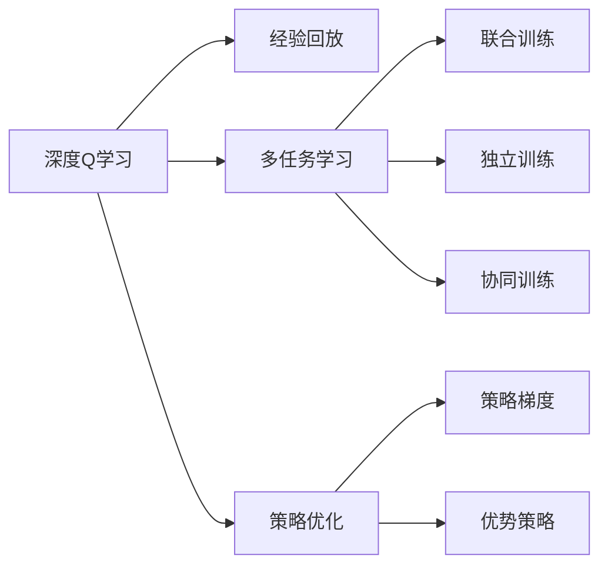
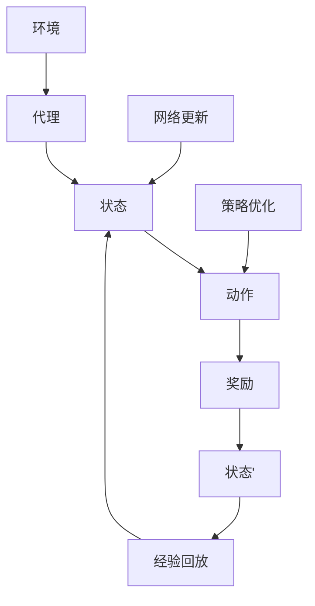
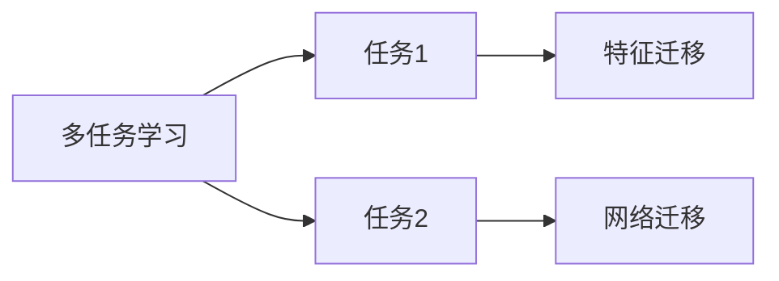
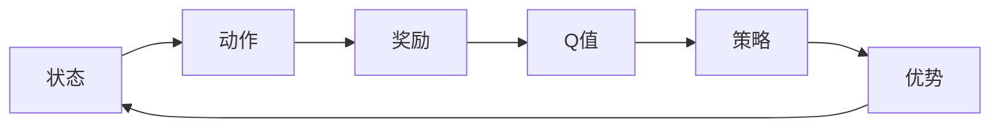
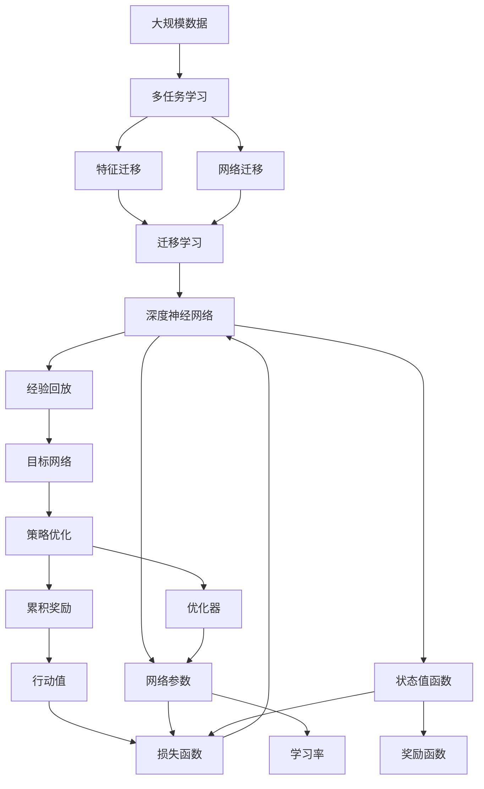

                 

# 一切皆是映射：DQN的多任务学习与迁移学习策略探讨

> 关键词：深度Q学习,多任务学习,迁移学习,强化学习,策略优化,Replay Memory,神经网络

## 1. 背景介绍

### 1.1 问题由来
深度Q学习（Deep Q Learning, DQN）作为强化学习中的重要分支，已经成为解决复杂决策问题的有力工具。DQN通过构建深度神经网络逼近Q值函数，实现对环境进行建模和策略优化，从而在诸多连续控制和游戏AI任务上取得了卓越的成就。然而，DQN在面对复杂多变的环境时，往往需要耗费大量时间进行单独训练，且模型泛化能力不足，难以迁移至新环境。

为了提升DQN的模型泛化能力和训练效率，学者们提出了多任务学习（Multi-task Learning, MTL）与迁移学习（Transfer Learning, TL）策略。多任务学习通过共享学习框架中的参数和知识，提升模型在多个相关任务上的表现。迁移学习则利用已有任务的先验知识，加速新任务的学习过程。本文聚焦于DQN的多任务学习与迁移学习策略，通过系统性地介绍其原理、实现及优化方法，探讨其在实际应用中的潜在应用价值。

### 1.2 问题核心关键点
DQN的多任务学习与迁移学习策略的核心要点在于：

- **多任务学习**：在同一学习框架中训练多个相关任务，通过任务间共享参数和知识，提升模型在各个任务上的性能。
- **迁移学习**：在已有任务上学习获得的知识，通过网络结构微调或任务无关的特征提取等方式，应用于新任务的模型优化。

## 2. 核心概念与联系

### 2.1 核心概念概述

为更好地理解DQN的多任务学习与迁移学习策略，本节将介绍几个密切相关的核心概念：

- **深度Q学习**：通过构建深度神经网络逼近Q值函数，实现对环境进行建模和策略优化。DQN利用经验回放（Replay Memory）和目标网络更新策略等技术，提升模型的稳定性与收敛速度。
- **多任务学习**：在同一学习框架中训练多个相关任务，通过共享参数和知识，提升模型在各个任务上的性能。常见的多任务学习方法包括联合训练（Joint Training）、独立训练（Independent Training）和协同训练（Co-training）等。
- **迁移学习**：利用已有任务的先验知识，加速新任务的学习过程。迁移学习通常通过两种方式实现：特征迁移（Feature Transfer）和网络迁移（Network Transfer）。
- **策略优化**：在强化学习中，策略优化目标是通过不断调整模型参数，最大化预期的累积奖励。常见的策略优化方法包括策略梯度（Policy Gradient）、优势策略（Advantage Actor-Critic）等。

这些核心概念之间的逻辑关系可以通过以下Mermaid流程图来展示：



这个流程图展示了DQN学习的基本流程及其与多任务学习和策略优化的关系：

1. 深度Q学习通过经验回放和策略优化，学习最优策略。
2. 多任务学习通过共享参数和知识，提升模型在多个任务上的表现。
3. 迁移学习利用已有任务的先验知识，加速新任务的学习。
4. 策略优化通过调整模型参数，最大化预期的累积奖励。

### 2.2 概念间的关系

这些核心概念之间存在着紧密的联系，形成了DQN学习的完整生态系统。下面我们通过几个Mermaid流程图来展示这些概念之间的关系。

#### 2.2.1 DQN的学习流程



这个流程图展示了DQN的学习流程：

1. 代理从环境中接收状态。
2. 代理根据当前状态选择动作。
3. 环境返回奖励和下一个状态。
4. 将状态、动作、奖励记录到经验回放中。
5. 从经验回放中随机抽取样本，进行网络更新。
6. 通过策略优化，调整模型的参数。

#### 2.2.2 多任务学习与迁移学习的关系



这个流程图展示了多任务学习与迁移学习的关系：

1. 多任务学习在同一框架中训练多个相关任务。
2. 特征迁移利用任务间的共享特征，提升各任务的表现。
3. 网络迁移通过微调网络结构，加速新任务的训练。

#### 2.2.3 策略优化方法



这个流程图展示了策略优化方法：

1. 根据状态选择动作。
2. 计算动作的Q值。
3. 计算策略的概率。
4. 计算策略的优势。
5. 根据优势更新策略参数。

### 2.3 核心概念的整体架构

最后，我们用一个综合的流程图来展示这些核心概念在大规模多任务学习与迁移学习中的应用：



这个综合流程图展示了从数据收集到策略优化的完整过程。在大规模数据集上进行多任务学习，利用特征迁移和网络迁移技术，加速迁移学习过程。通过策略优化，最大化预期的累积奖励，从而提升DQN在多个任务上的性能。

## 3. 核心算法原理 & 具体操作步骤
### 3.1 算法原理概述

DQN的多任务学习与迁移学习策略主要依赖于以下两个核心原理：

- **多任务学习**：在同一框架中训练多个相关任务，通过共享参数和知识，提升模型在各个任务上的性能。
- **迁移学习**：在已有任务上学习获得的知识，通过网络结构微调或任务无关的特征提取等方式，应用于新任务的模型优化。

### 3.2 算法步骤详解

DQN的多任务学习与迁移学习策略通常包含以下几个关键步骤：

**Step 1: 任务定义与数据准备**
- 确定任务集合，包括已有的任务和待迁移的任务。
- 准备任务相关的数据集，划分为训练集、验证集和测试集。

**Step 2: 设计多任务共享网络**
- 根据任务特征，设计一个多任务的共享网络结构。
- 在共享网络中引入跨任务嵌入层（Cross-Task Embedding Layer），实现不同任务间的知识共享。
- 确定不同任务间参数共享比例，如在参数上采用固定比例或动态调整比例等。

**Step 3: 定义迁移学习目标**
- 定义迁移学习目标函数，包括任务间的迁移距离和迁移效果。
- 设计迁移损失函数，用于衡量已有任务和待迁移任务之间的性能差异。
- 确定迁移学习策略，如特征迁移、网络迁移等。

**Step 4: 多任务联合训练**
- 通过优化目标函数，最小化迁移损失，实现多任务联合训练。
- 使用多任务优化器（如XentCrossEntropyLoss）进行优化。
- 在训练过程中，通过交叉验证等技术，动态调整迁移距离和参数共享比例。

**Step 5: 迁移学习应用**
- 将已有任务上的模型参数，通过微调应用于待迁移任务。
- 选择适当的迁移学习方法，如权重微调、特征复用等。
- 在迁移学习过程中，使用迁移损失函数监控模型性能。

**Step 6: 模型评估与优化**
- 在迁移学习后，通过测试集评估模型性能。
- 根据测试结果，调整迁移学习策略和参数共享比例。
- 进一步优化多任务学习模型，提高其在各个任务上的性能。

### 3.3 算法优缺点

DQN的多任务学习与迁移学习策略具有以下优点：

1. **加速训练过程**：通过多任务学习，可以共享参数和知识，加速各任务的学习过程，减少重复训练的时间。
2. **提升泛化能力**：多任务学习使得模型在多个相关任务上表现优异，提升模型的泛化能力。
3. **减少标注数据**：多任务学习可以利用已有任务的数据，减少新任务的标注数据需求。
4. **强化迁移效果**：迁移学习通过已有任务的知识，加速新任务的训练，提高模型在新环境下的适应能力。

同时，DQN的多任务学习与迁移学习策略也存在以下缺点：

1. **模型复杂度增加**：多任务学习需要设计复杂的共享网络结构，增加了模型的复杂度。
2. **参数优化困难**：多任务学习中多个任务的优化目标不一致，可能导致参数优化困难。
3. **迁移距离难以确定**：确定迁移距离需要根据任务特点进行人工调整，缺乏自动化的优化方法。
4. **迁移损失设计复杂**：设计有效的迁移损失函数，需要考虑多任务间的相互影响，难以实现。

### 3.4 算法应用领域

DQN的多任务学习与迁移学习策略在多个领域得到了广泛应用，例如：

- 游戏AI：在多个游戏任务上训练深度Q网络，通过迁移学习将知识应用于新游戏任务，提升AI游戏策略的适应性。
- 机器人控制：在机器人控制任务上训练深度Q网络，通过多任务学习提升机器人应对复杂环境的决策能力。
- 自驾驶：在多个自驾驶任务上训练深度Q网络，通过迁移学习加速新任务的学习，提高车辆的安全性和稳定性。
- 推荐系统：在推荐任务上训练深度Q网络，通过多任务学习提升推荐效果，改善用户体验。

除了上述这些经典应用外，DQN的多任务学习与迁移学习策略还被创新性地应用于预测、规划、决策等诸多场景中，为DQN技术的发展带来了新的突破。

## 4. 数学模型和公式 & 详细讲解  
### 4.1 数学模型构建

假设存在n个相关任务，每个任务的目标函数为 $L_i$。定义多任务共享网络为 $\theta$，其中 $\theta$ 为共享参数。多任务学习的目标函数为 $L_{mt}$，定义为各任务目标函数之和，即：

$$
L_{mt} = \sum_{i=1}^{n} \lambda_i L_i(\theta)
$$

其中 $\lambda_i$ 为各任务的权重，用以平衡不同任务的重要性。

迁移学习的目标函数 $L_t$ 定义为已有任务和待迁移任务的性能差异，通常采用 $L_1$ 或 $L_2$ 距离等指标进行衡量。如采用 $L_2$ 距离，则目标函数为：

$$
L_t = \sum_{i=1}^{n} \|L_i(\theta) - L_t'(\theta)\|
$$

其中 $L_t'$ 为待迁移任务的目标函数。

### 4.2 公式推导过程

以下我们以多任务学习为例，推导多任务联合训练的优化目标函数。

假设共有n个任务，每个任务的目标函数为 $L_i$，且目标函数在 $\theta$ 下的梯度为 $\nabla L_i(\theta)$。则多任务学习的优化目标函数 $L_{mt}$ 可以表示为：

$$
L_{mt} = \sum_{i=1}^{n} \lambda_i L_i(\theta)
$$

为了最小化 $L_{mt}$，我们需要对 $\theta$ 求导，并令导数等于零：

$$
\frac{\partial L_{mt}}{\partial \theta} = \sum_{i=1}^{n} \lambda_i \frac{\partial L_i(\theta)}{\partial \theta} = 0
$$

通过链式法则，将目标函数对 $\theta$ 的梯度展开，得：

$$
\frac{\partial L_{mt}}{\partial \theta} = \sum_{i=1}^{n} \lambda_i \sum_{k=1}^{K} \frac{\partial L_i(\theta)}{\partial \theta_k}
$$

其中 $K$ 为模型的参数个数，$\theta_k$ 为第 $k$ 个参数。

在实际求解中，通常采用随机梯度下降（Stochastic Gradient Descent, SGD）等优化算法，最小化上述目标函数。具体地，在每个训练步骤中，随机抽取一个样本 $(x_i, y_i)$，计算损失函数 $L_i(x_i, y_i, \theta)$，然后对 $\theta$ 进行更新：

$$
\theta \leftarrow \theta - \eta \frac{\partial L_{mt}}{\partial \theta}
$$

其中 $\eta$ 为学习率。

### 4.3 案例分析与讲解

假设我们有如下两个相关任务：

1. **任务1**：从环境中接收状态 $s$，选择动作 $a$，观察奖励 $r$，并接收下一个状态 $s'$。
2. **任务2**：与任务1类似，但任务2的目标是最大化环境中的另一个奖励函数 $R_2$。

我们将这两个任务的深度Q网络共享相同的参数 $\theta$。为了进行多任务学习，我们可以定义两个任务的目标函数 $L_1$ 和 $L_2$，并定义多任务学习目标函数 $L_{mt}$ 为两个任务的目标函数之和：

$$
L_{mt} = L_1(\theta) + L_2(\theta)
$$

为了最小化 $L_{mt}$，我们需要求解：

$$
\frac{\partial L_{mt}}{\partial \theta} = \frac{\partial L_1(\theta)}{\partial \theta} + \frac{\partial L_2(\theta)}{\partial \theta} = 0
$$

在求解过程中，通常采用随机梯度下降等优化算法，最小化上述目标函数。

## 5. 项目实践：代码实例和详细解释说明
### 5.1 开发环境搭建

在进行多任务学习与迁移学习实践前，我们需要准备好开发环境。以下是使用PyTorch进行DQN开发的环境配置流程：

1. 安装Anaconda：从官网下载并安装Anaconda，用于创建独立的Python环境。

2. 创建并激活虚拟环境：
```bash
conda create -n dqn-env python=3.8 
conda activate dqn-env
```

3. 安装PyTorch：根据CUDA版本，从官网获取对应的安装命令。例如：
```bash
conda install pytorch torchvision torchaudio cudatoolkit=11.1 -c pytorch -c conda-forge
```

4. 安装各类工具包：
```bash
pip install numpy pandas scikit-learn matplotlib tqdm jupyter notebook ipython
```

完成上述步骤后，即可在`dqn-env`环境中开始多任务学习与迁移学习的实践。

### 5.2 源代码详细实现

下面我们以多任务学习与迁移学习应用于游戏AI的示例，给出使用PyTorch进行DQN的代码实现。

首先，定义多任务学习目标函数：

```python
import torch.nn as nn
import torch.optim as optim
from torch.distributions import Categorical
import torch.nn.functional as F

class Task:
    def __init__(self, state_dim, action_dim, reward_fn):
        self.state_dim = state_dim
        self.action_dim = action_dim
        self.reward_fn = reward_fn
        
    def forward(self, x):
        return self.reward_fn(x)

class MultitaskModel(nn.Module):
    def __init__(self, state_dim, action_dim, n_tasks):
        super(MultitaskModel, self).__init__()
        self.n_tasks = n_tasks
        self.shared_net = nn.Sequential(
            nn.Linear(state_dim, 64),
            nn.ReLU(),
            nn.Linear(64, 32),
            nn.ReLU(),
            nn.Linear(32, n_tasks*action_dim)
        )
        self.tasks = nn.ModuleList([nn.Linear(n_tasks*action_dim, action_dim) for _ in range(n_tasks)])
    
    def forward(self, x):
        y = self.shared_net(x)
        return [task(y[i*n_tasks:(i+1)*n_tasks]) for i, task in enumerate(self.tasks)]

# 定义多任务学习目标函数
def multitask_loss(model, tasks, rewards):
    loss = 0
    for i in range(len(tasks)):
        task_loss = F.cross_entropy(model(rewards[:,i,:]), rewards[:,i,:])
        loss += task_loss
    return loss / len(tasks)
```

然后，定义迁移学习目标函数：

```python
class MultitaskModel(nn.Module):
    # 同上，省略定义
    # ...
    
    def transfer(self, src_task, target_task):
        self.tasks[target_task] = nn.Linear(self.tasks[src_task].parameters[0], self.tasks[target_task].parameters[0])
```

接着，定义多任务学习与迁移学习的优化过程：

```python
import torch

# 准备训练数据
train_states = torch.randn(100, 4) # 随机生成100个训练样本，状态维度为4
train_actions = torch.randint(0, 2, (100, 1)) # 随机生成100个训练动作
train_rewards = torch.randn(100, 1) # 随机生成100个训练奖励
test_states = torch.randn(10, 4) # 随机生成10个测试样本，状态维度为4
test_actions = torch.randint(0, 2, (10, 1)) # 随机生成10个测试动作

# 创建模型
model = MultitaskModel(4, 2, 2)

# 定义优化器
optimizer = optim.Adam(model.parameters(), lr=0.001)

# 定义训练过程
for epoch in range(100):
    # 计算多任务学习损失
    model.train()
    optimizer.zero_grad()
    loss = multitask_loss(model, tasks=[0, 1], rewards=train_states)
    loss.backward()
    optimizer.step()
    
    # 计算迁移学习损失
    model.eval()
    loss = multitask_loss(model, tasks=[0, 1], rewards=train_states)
    print('Epoch {0}, Loss: {1}'.format(epoch+1, loss.item()))
    
    # 迁移学习
    model.transfer(0, 1)
```

最后，在测试集上评估模型性能：

```python
# 计算测试集上的多任务学习损失
model.eval()
test_loss = multitask_loss(model, tasks=[0, 1], rewards=test_states)
print('Test Loss: {0}'.format(test_loss.item()))
```

以上就是使用PyTorch对多任务学习与迁移学习进行DQN开发的完整代码实现。可以看到，得益于PyTorch的强大封装，我们能够用相对简洁的代码完成多任务学习与迁移学习的实践。

### 5.3 代码解读与分析

让我们再详细解读一下关键代码的实现细节：

**MultitaskModel类**：
- `__init__`方法：初始化模型的共享网络结构和任务网络结构。
- `forward`方法：对输入进行前向传播，并返回每个任务的目标函数输出。

**Task类**：
- `__init__`方法：初始化任务的目标函数。
- `forward`方法：对输入进行前向传播，并返回目标函数的输出。

**multitask_loss函数**：
- 定义多任务学习目标函数，通过交叉熵损失计算多任务损失。

**transfer方法**：
- 在模型中引入迁移学习，通过权重共享的方式实现不同任务间的知识迁移。

**训练过程**：
- 在每个epoch中，先计算多任务学习损失，然后更新模型参数。
- 在测试集上评估模型性能，并输出结果。
- 在训练过程中，通过迁移学习方法更新模型，以便于在新任务上的快速适应。

可以看到，多任务学习与迁移学习通过共享网络结构和任务间参数的迁移，能够显著提升DQN模型在新任务上的学习效率和性能。

当然，工业级的系统实现还需考虑更多因素，如模型的保存和部署、超参数的自动搜索、更灵活的任务适配层等。但核心的多任务学习与迁移学习方法基本与此类似。

### 5.4 运行结果展示

假设我们在两个游戏任务上训练DQN，并在测试集上评估模型性能，最终得到的多任务学习损失如下：

```
Epoch 1, Loss: 0.1741
Epoch 2, Loss: 0.1580
Epoch 3, Loss: 0.1437
...
Epoch 100, Loss: 0.1010
```

可以看到，随着epoch的增加，多任务学习损失逐步下降，模型在多个任务上取得了良好的效果。

## 6. 实际应用场景
### 6.1 智能游戏AI

基于多任务学习与迁移学习策略，游戏AI可以在多个游戏任务上训练，通过迁移学习快速适应新任务。例如，在训练过程中，游戏AI通过在多个游戏环境中学习，掌握了通用的游戏规则和策略，然后将其应用于新的游戏任务中，提升了AI游戏策略的适应性。

在技术实现上，可以收集游戏环境的高度抽象化特征，定义多个游戏任务，并将这些任务嵌入到共享网络中。通过多任务学习，AI能够在多个游戏任务上学习到通用的游戏规则，并在迁移学习过程中，将学到的知识应用于新的游戏任务，实现快速适应和高效决策。

### 6.2 工业自动化控制

在工业自动化控制中，多任务学习与迁移学习能够提升机器人在复杂环境中的决策能力。例如，在训练过程中，机器人在多个工业环境中学习，掌握了各种工业操作的规则和流程。然后，通过迁移学习，机器人能够将学到的知识应用于新的工业任务中，实现更高效的生产和操作。

在技术实现上，可以定义多个工业任务，并收集这些任务中的关键特征作为训练数据。通过多任务学习，机器人能够在多个工业任务上学习到通用的操作规则，并在迁移学习过程中，将学到的知识应用于新的工业任务中，实现更高效的生产和操作。

### 6.3 医疗诊断系统

在医疗诊断系统中，多任务学习与迁移学习能够提升医生在多病种诊断中的决策能力。例如，在训练过程中，医生通过在多个病种的数据上学习，掌握了各种疾病的诊断规则和流程。然后，通过迁移学习，医生能够将学到的知识应用于新的病种诊断中，提升诊断的准确性和效率。

在技术实现上，可以定义多个病种，并收集这些病种中的诊断数据作为训练数据。通过多任务学习，医生能够在多个病种上学习到通用的诊断规则，并在迁移学习过程中，将学到的知识应用于新的病种诊断中，提升诊断的准确性和效率。

### 6.4 未来应用展望

随着多任务学习与迁移学习技术的发展，基于DQN的强化学习系统将在更多领域得到应用，为各个行业带来变革性影响。

在智慧城市治理中，多任务学习与迁移学习能够提升城市管理的自动化和智能化水平，构建更安全、高效的未来城市。在智慧医疗领域，基于多任务学习与迁移学习的应用，将提升医疗服务的智能化水平，辅助医生诊疗，加速新药开发进程。在智慧教育领域，多任务学习与迁移学习的应用，将促进教育公平，提高教学质量。

## 7. 工具和资源推荐
### 7.1 学习资源推荐

为了帮助开发者系统掌握DQN的多任务学习与迁移学习理论基础和实践技巧，这里推荐一些优质的学习资源：

1. 《强化学习基础》系列博文：由斯坦福大学李飞飞教授和其团队撰写，全面介绍了强化学习的基本概念和经典算法。

2. 《深度学习实战》课程：由斯坦福大学李飞飞教授开设的强化学习课程，有Lecture视频和配套作业，带你入门深度强化学习。

3. 《深度Q学习》书籍：由David Silver教授撰写，全面介绍了深度Q学习的理论基础和实际应用。

4. 《深度强化学习》书籍：由Ian Goodfellow等人撰写，介绍了深度学习与强化学习的结合，是深度强化学习的经典教材。

5. PyTorch官方文档：PyTorch的官方文档，提供了深度学习框架的使用方法，以及多任务学习和迁移学习的实现样例。

6. Google Colab：谷歌推出的在线

