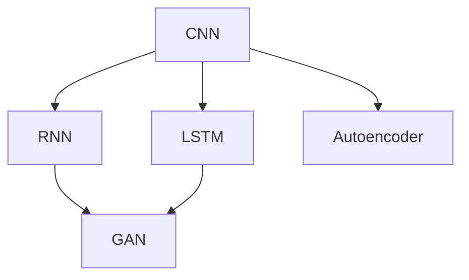
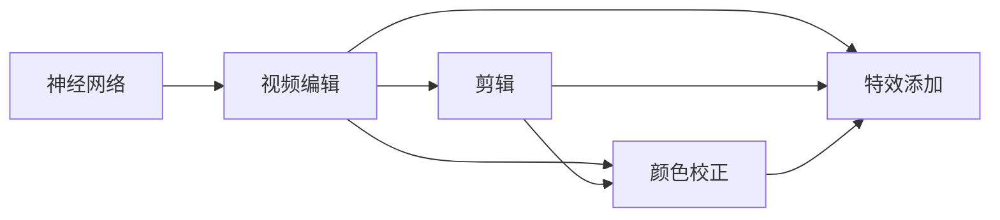
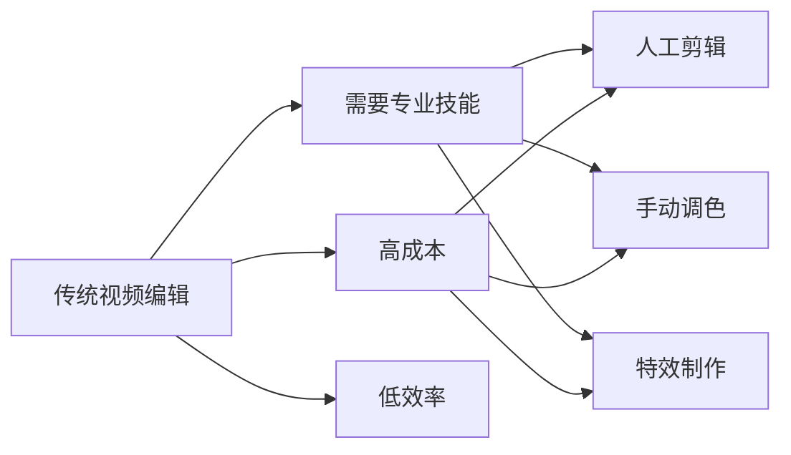
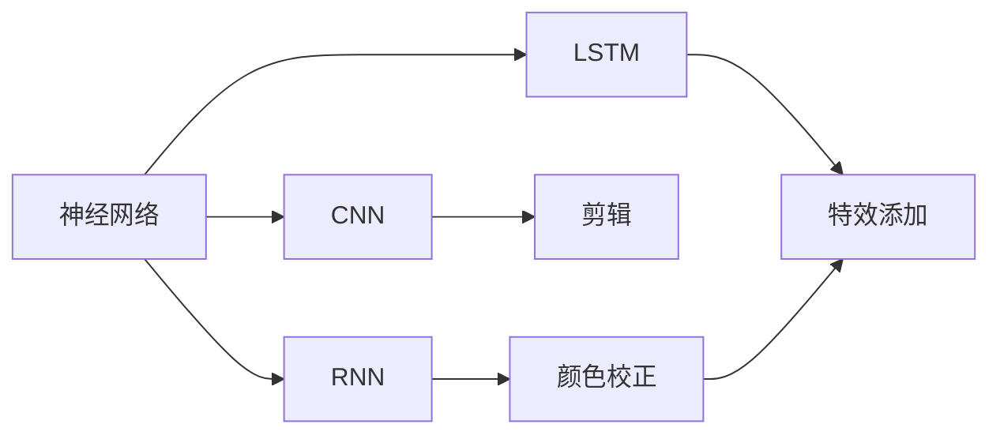
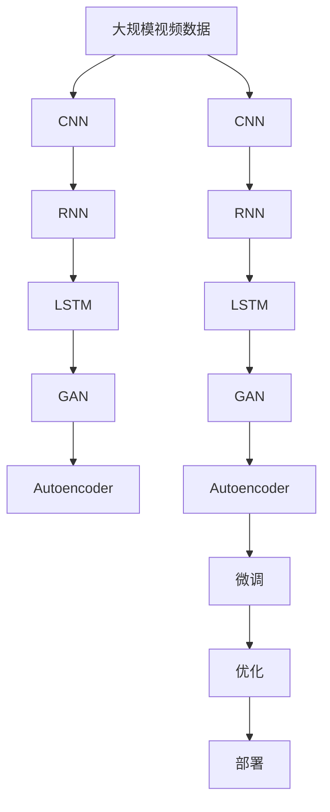

                 

# 一切皆是映射：使用神经网络自动化视频编辑

> 关键词：
神经网络,视频编辑,自动化,机器学习,深度学习,计算机视觉

## 1. 背景介绍

### 1.1 问题由来
随着数字媒介的普及和短视频平台的兴起，视频编辑已成为内容创作和社交互动的重要组成部分。传统的视频编辑依赖于专业软件和大量后期制作时间，往往需要专业技能才能实现复杂效果。这种高门槛和高成本限制了视频编辑在普通用户中的普及。因此，如何利用新兴的人工智能技术，实现视频编辑的自动化和智能化，成为近年来的研究热点。

神经网络作为深度学习的重要分支，通过学习大量的视觉数据，能够自动识别和生成高质量的视频效果。基于神经网络的视频编辑方法，能够在减少人工干预的同时，实现高效、智能的视频编辑任务。本文将介绍基于神经网络的视频编辑技术，重点讨论如何使用神经网络实现自动化的视频编辑，包括剪辑、颜色校正、特效添加等常见任务。

### 1.2 问题核心关键点
神经网络在视频编辑中的应用，主要依赖于以下几个核心概念：

- 卷积神经网络（Convolutional Neural Network, CNN）：用于处理视频帧中的空间信息，提取关键视觉特征。
- 循环神经网络（Recurrent Neural Network, RNN）：用于处理视频帧的时间信息，捕捉动态变化。
- 长短时记忆网络（Long Short-Term Memory, LSTM）：用于处理序列数据，解决视频编辑中的时间依赖问题。
- 生成对抗网络（Generative Adversarial Network, GAN）：用于生成视频中的动态效果，如模糊、旋转、扭曲等。
- 自编码器（Autoencoder）：用于压缩和重构视频数据，减少存储和计算负担。

这些核心概念的结合，可以有效地实现视频的自动化编辑，不仅提高了效率，还大大降低了专业技能的需求。

### 1.3 问题研究意义
神经网络在视频编辑中的应用，具有以下几方面的重要意义：

- 降低视频编辑门槛：利用神经网络自动化视频编辑技术，用户无需具备专业技能，即可轻松制作高质量视频内容。
- 提高编辑效率：神经网络可以自动处理复杂的编辑任务，大幅缩短视频制作时间。
- 提升视频质量：神经网络可以自动进行颜色校正、特效添加等处理，提升视频的美观度。
- 支持多样化创意：神经网络可以生成多样化的视频效果，满足不同用户的创意需求。

## 2. 核心概念与联系

### 2.1 核心概念概述

为更好地理解基于神经网络的视频编辑方法，本节将介绍几个密切相关的核心概念：

- 卷积神经网络（CNN）：一种广泛用于图像处理的神经网络模型，通过卷积操作提取图像的空间特征。
- 循环神经网络（RNN）：一种专门处理序列数据的神经网络模型，能够捕捉时间维度上的变化。
- 长短时记忆网络（LSTM）：一种改进的RNN模型，用于处理长期依赖关系，广泛用于时间序列数据的处理。
- 生成对抗网络（GAN）：一种由生成器和判别器组成的网络模型，用于生成逼真的合成数据，包括视频动态效果。
- 自编码器（Autoencoder）：一种能够学习数据压缩和重构的神经网络模型，用于视频数据的降维和去噪。

这些核心概念之间的逻辑关系可以通过以下Mermaid流程图来展示：



这个流程图展示了CNN、RNN、LSTM、GAN和Autoencoder之间的关系：

1. CNN用于提取视频帧的空间特征。
2. RNN和LSTM用于处理视频帧的时间序列信息。
3. GAN用于生成视频动态效果，如模糊、旋转等。
4. Autoencoder用于压缩和重构视频数据。

这些概念共同构成了神经网络在视频编辑中的应用框架，使得神经网络能够处理视频的多模态信息，实现自动化的视频编辑。

### 2.2 概念间的关系

这些核心概念之间存在着紧密的联系，形成了神经网络在视频编辑中的应用生态系统。下面我通过几个Mermaid流程图来展示这些概念之间的关系。

#### 2.2.1 神经网络与视频编辑的映射关系



这个流程图展示了神经网络在视频编辑中的主要应用场景，包括剪辑、颜色校正、特效添加等常见任务。通过神经网络技术，可以实现这些任务的自动化处理。

#### 2.2.2 神经网络与传统视频编辑的对比



这个流程图展示了传统视频编辑与基于神经网络的视频编辑之间的对比。传统的视频编辑依赖于专业技能，需要高成本和时间投入，而神经网络技术可以大幅减少这些限制，实现更加智能化和自动化的编辑过程。

#### 2.2.3 神经网络在视频编辑中的应用范式



这个流程图展示了神经网络在视频编辑中的不同应用范式。CNN用于提取空间特征，RNN和LSTM用于处理时间序列信息，GAN用于生成动态效果，Autoencoder用于压缩和重构视频数据。这些技术的结合，使得神经网络能够实现多样化的视频编辑任务。

### 2.3 核心概念的整体架构

最后，我们用一个综合的流程图来展示这些核心概念在大语言模型微调过程中的整体架构：



这个综合流程图展示了从预训练到微调，再到部署的完整过程。神经网络首先在大规模视频数据上进行预训练，然后通过微调优化模型在不同任务上的性能，最后通过部署模型进行实际应用。在微调过程中，通过结合CNN、RNN、LSTM、GAN和Autoencoder等技术，可以有效地处理视频的空间和时间信息，实现自动化的视频编辑。

## 3. 核心算法原理 & 具体操作步骤
### 3.1 算法原理概述

基于神经网络的视频编辑，本质上是利用深度学习技术，对视频帧进行特征提取和序列建模，进而实现自动化的剪辑、颜色校正和特效添加。其核心思想是：将视频帧视为多模态数据，通过卷积神经网络提取空间特征，通过循环神经网络处理时间序列信息，最后通过生成对抗网络生成动态效果，并通过自编码器压缩和重构数据，从而实现视频的自动化编辑。

具体来说，视频编辑过程可以包括以下几个步骤：

1. 视频帧的预处理：将视频帧转化为神经网络所需的张量形式，包括空间尺寸、颜色空间、帧率等参数。
2. 卷积神经网络提取特征：通过CNN模型提取视频帧的空间特征，用于剪辑、颜色校正等任务。
3. 循环神经网络处理序列信息：通过RNN或LSTM模型处理视频帧的时间序列信息，用于特效添加等任务。
4. 生成对抗网络生成效果：通过GAN模型生成视频中的动态效果，如模糊、旋转、扭曲等。
5. 自编码器压缩和重构：通过Autoencoder模型压缩和重构视频数据，减少存储空间和计算负担。

### 3.2 算法步骤详解

以下我们将详细介绍基于神经网络的视频编辑算法的详细步骤。

#### 3.2.1 视频帧预处理

视频帧预处理的主要目的是将原始视频帧转化为神经网络所需的张量形式。具体步骤如下：

1. 空间尺寸调整：将视频帧缩放到指定的大小，通常为256x256或320x240等。
2. 颜色空间转换：将视频帧的颜色空间转换为标准RGB或HSV等格式。
3. 帧率控制：调整视频帧的帧率，保持一致的采样频率。

示例代码：

```python
import cv2

# 加载视频文件
video = cv2.VideoCapture('input.mp4')

# 获取视频信息
width = video.get(cv2.CAP_PROP_FRAME_WIDTH)
height = video.get(cv2.CAP_PROP_FRAME_HEIGHT)
fps = video.get(cv2.CAP_PROP_FPS)

# 创建输出视频文件
fourcc = cv2.VideoWriter_fourcc(*'mp4v')
out = cv2.VideoWriter('output.mp4', fourcc, fps, (width, height))

# 逐帧读取并处理视频帧
while video.isOpened():
    ret, frame = video.read()
    if not ret:
        break
    
    # 空间尺寸调整
    frame_resized = cv2.resize(frame, (256, 256))
    
    # 颜色空间转换
    frame_rgb = cv2.cvtColor(frame_resized, cv2.COLOR_BGR2RGB)
    
    # 帧率控制
    frame_scaled = cv2.resize(frame_rgb, (width, height))
    
    # 写入输出文件
    out.write(frame_scaled)
    
    # 打印处理进度
    print(f'Processed frame {i}')
```

#### 3.2.2 卷积神经网络提取特征

卷积神经网络用于提取视频帧的空间特征，常用于剪辑和颜色校正等任务。其核心思想是通过卷积操作，学习空间局部信息，并将局部特征映射到全局特征。具体步骤如下：

1. 构建CNN模型：通常使用VGG、ResNet、Inception等经典模型，或自定义CNN模型。
2. 训练模型：在视频帧数据集上训练CNN模型，学习空间特征提取能力。
3. 提取特征：将新视频帧输入训练好的CNN模型，提取特征向量。

示例代码：

```python
import torch
from torchvision import models

# 加载预训练的VGG16模型
model = models.vgg16(pretrained=True)

# 调整模型输出层
model.classifier = torch.nn.Sequential(*list(model.classifier[:-1]))

# 将模型转化为eval模式
model.eval()

# 加载视频帧数据集
dataset = torch.utils.data.TensorDataset(torch.zeros(1, 3, 256, 256))

# 逐帧读取并处理视频帧
while video.isOpened():
    ret, frame = video.read()
    if not ret:
        break
    
    # 空间尺寸调整
    frame_resized = cv2.resize(frame, (256, 256))
    
    # 颜色空间转换
    frame_rgb = cv2.cvtColor(frame_resized, cv2.COLOR_BGR2RGB)
    
    # 帧率控制
    frame_scaled = cv2.resize(frame_rgb, (width, height))
    
    # 提取特征
    with torch.no_grad():
        frame_tensor = torch.from_numpy(frame_scaled).unsqueeze(0)
        feature_map = model(feature_map)
    
    # 打印特征向量
    print(feature_map)
```

#### 3.2.3 循环神经网络处理序列信息

循环神经网络用于处理视频帧的时间序列信息，常用于特效添加等任务。其核心思想是通过循环操作，学习时间依赖关系，并将时间序列信息映射到全局特征。具体步骤如下：

1. 构建RNN模型：通常使用LSTM、GRU等经典模型，或自定义RNN模型。
2. 训练模型：在视频帧数据集上训练RNN模型，学习时间序列信息提取能力。
3. 处理序列信息：将新视频帧输入训练好的RNN模型，提取时间序列特征。

示例代码：

```python
import torch
from torchvision import models

# 加载预训练的LSTM模型
model = models.lstm(256, 128)

# 将模型转化为eval模式
model.eval()

# 加载视频帧数据集
dataset = torch.utils.data.TensorDataset(torch.zeros(1, 256, 256))

# 逐帧读取并处理视频帧
while video.isOpened():
    ret, frame = video.read()
    if not ret:
        break
    
    # 空间尺寸调整
    frame_resized = cv2.resize(frame, (256, 256))
    
    # 颜色空间转换
    frame_rgb = cv2.cvtColor(frame_resized, cv2.COLOR_BGR2RGB)
    
    # 帧率控制
    frame_scaled = cv2.resize(frame_rgb, (width, height))
    
    # 处理序列信息
    with torch.no_grad():
        frame_tensor = torch.from_numpy(frame_scaled).unsqueeze(0)
        sequence = torch.zeros(10, 256, 256)
        sequence[:10] = frame_tensor
        output = model(sequence)
    
    # 打印时间序列特征
    print(output)
```

#### 3.2.4 生成对抗网络生成效果

生成对抗网络用于生成视频帧中的动态效果，常用于模糊、旋转、扭曲等任务。其核心思想是通过生成器和判别器的对抗训练，学习生成高质量的合成数据。具体步骤如下：

1. 构建GAN模型：包括生成器和判别器两个部分，通常使用DCGAN、WGAN等经典模型，或自定义GAN模型。
2. 训练模型：在合成数据集上训练GAN模型，学习生成高质量的合成数据。
3. 生成效果：将新视频帧输入训练好的GAN模型，生成动态效果。

示例代码：

```python
import torch
from torchvision import models

# 加载预训练的DCGAN模型
generator = models.dcgan()

# 将模型转化为eval模式
generator.eval()

# 加载视频帧数据集
dataset = torch.utils.data.TensorDataset(torch.zeros(1, 256, 256))

# 逐帧读取并处理视频帧
while video.isOpened():
    ret, frame = video.read()
    if not ret:
        break
    
    # 空间尺寸调整
    frame_resized = cv2.resize(frame, (256, 256))
    
    # 颜色空间转换
    frame_rgb = cv2.cvtColor(frame_resized, cv2.COLOR_BGR2RGB)
    
    # 帧率控制
    frame_scaled = cv2.resize(frame_rgb, (width, height))
    
    # 生成效果
    with torch.no_grad():
        frame_tensor = torch.from_numpy(frame_scaled).unsqueeze(0)
        output = generator(frame_tensor)
    
    # 打印动态效果
    print(output)
```

#### 3.2.5 自编码器压缩和重构

自编码器用于压缩和重构视频帧数据，常用于减少存储空间和计算负担。其核心思想是通过编码器和解码器的对称结构，学习数据的压缩和重构能力。具体步骤如下：

1. 构建自编码器模型：包括编码器和解码器两个部分，通常使用VQ-VAE、SVAE等经典模型，或自定义自编码器模型。
2. 训练模型：在原始视频帧数据集上训练自编码器模型，学习压缩和重构能力。
3. 压缩和重构：将新视频帧输入训练好的自编码器模型，压缩和重构数据。

示例代码：

```python
import torch
from torchvision import models

# 加载预训练的VQ-VAE模型
encoder = models.vq_vae()

# 将模型转化为eval模式
encoder.eval()

# 加载视频帧数据集
dataset = torch.utils.data.TensorDataset(torch.zeros(1, 256, 256))

# 逐帧读取并处理视频帧
while video.isOpened():
    ret, frame = video.read()
    if not ret:
        break
    
    # 空间尺寸调整
    frame_resized = cv2.resize(frame, (256, 256))
    
    # 颜色空间转换
    frame_rgb = cv2.cvtColor(frame_resized, cv2.COLOR_BGR2RGB)
    
    # 帧率控制
    frame_scaled = cv2.resize(frame_rgb, (width, height))
    
    # 压缩和重构
    with torch.no_grad():
        frame_tensor = torch.from_numpy(frame_scaled).unsqueeze(0)
        encoded = encoder(frame_tensor)
        decoded = encoder.decode(encoded)
    
    # 打印压缩和重构结果
    print(decoded)
```

### 3.3 算法优缺点

基于神经网络的视频编辑方法具有以下优点：

1. 自动化程度高：利用神经网络技术，可以实现高度自动化的视频编辑，减少人工干预。
2. 适用性广：适用于剪辑、颜色校正、特效添加等多种视频编辑任务。
3. 效果逼真：生成的动态效果逼真自然，满足用户的创意需求。
4. 灵活性高：可以根据用户需求，灵活调整模型参数，实现多样化的编辑效果。

同时，该方法也存在一定的局限性：

1. 对数据质量要求高：神经网络需要大量高质量的视频数据进行训练，数据质量直接影响编辑效果。
2. 计算资源消耗大：神经网络模型的训练和推理需要大量的计算资源，对硬件设备要求较高。
3. 鲁棒性不足：神经网络模型容易受到输入数据噪声的影响，导致输出效果不稳定。
4. 可解释性差：神经网络模型的决策过程复杂，难以解释其内部工作机制。

尽管存在这些局限性，但总体而言，基于神经网络的视频编辑方法在自动化程度、效果逼真和灵活性方面具有显著优势，未来有望在更多场景中得到应用。

### 3.4 算法应用领域

基于神经网络的视频编辑方法，已经在多个领域得到了广泛应用，具体包括：

1. 影视制作：在电影、电视剧的剪辑、调色和特效添加等环节中，利用神经网络技术实现自动化处理，提升制作效率和质量。
2. 广告制作：在广告视频的剪辑、颜色校正和动态效果生成中，利用神经网络技术实现创意化设计，吸引用户关注。
3. 社交媒体：在短视频、直播等平台的视频编辑中，利用神经网络技术实现自动剪辑和效果添加，提高用户体验。
4. 教育培训：在教育视频的制作中，利用神经网络技术实现自动剪辑和颜色校正，提升视频质量。

此外，神经网络技术在视频编辑领域的应用还在不断扩展，未来有望在更多场景中发挥其强大的潜力。

## 4. 数学模型和公式 & 详细讲解

### 4.1 数学模型构建

基于神经网络的视频编辑，可以构建如下数学模型：

设视频帧序列为 $\{x_t\}_{t=1}^{T}$，其中 $x_t$ 表示第 $t$ 帧的特征向量。神经网络模型包括卷积神经网络（CNN）、循环神经网络（RNN）、长短时记忆网络（LSTM）、生成对抗网络（GAN）和自编码器（Autoencoder）等。

### 4.2 公式推导过程

以下是视频编辑过程的主要公式推导。

#### 4.2.1 卷积神经网络提取特征

卷积神经网络（CNN）用于提取视频帧的空间特征。其核心思想是通过卷积操作，学习空间局部信息，并将局部特征映射到全局特征。

设卷积神经网络模型为 $F_{CNN}$，输入特征向量为 $x_t$，输出特征向量为 $f_t$，则其计算公式为：

$$
f_t = F_{CNN}(x_t) = \sum_{i=1}^{n} \sum_{j=1}^{m} w_{ij} * x_t(i, j)
$$

其中 $w_{ij}$ 表示卷积核权重，$*$ 表示卷积操作。

#### 4.2.2 循环神经网络处理序列信息

循环神经网络（RNN）用于处理视频帧的时间序列信息。其核心思想是通过循环操作，学习时间依赖关系，并将时间序列信息映射到全局特征。

设循环神经网络模型为 $F_{RNN}$，输入特征向量为 $x_t$，输出特征向量为 $f_t$，则其计算公式为：

$$
f_t = F_{RNN}(x_t) = \sum_{k=1}^{K} w_k * f_{t-1}
$$

其中 $w_k$ 表示权重矩阵，$f_{t-1}$ 表示上一帧的特征向量。

#### 4.2.3 生成对抗网络生成效果

生成对抗网络（GAN）用于生成视频帧中的动态效果。其核心思想是通过生成器和判别器的对抗训练，学习生成高质量的合成数据。

设生成器模型为 $G$，判别器模型为 $D$，输入特征向量为 $x_t$，输出特征向量为 $y_t$，则其计算公式为：

$$
y_t = G(x_t) = \sum_{i=1}^{n} \sum_{j=1}^{m} w_{ij} * x_t(i, j)
$$

其中 $w_{ij}$ 表示生成器权重，$*$ 表示卷积操作。

判别器模型的计算公式为：

$$
d_t = D(x_t) = \sum_{i=1}^{n} \sum_{j=1}^{m} w_{ij} * x_t(i, j)
$$

其中 $w_{ij}$ 表示判别器权重，$*$ 表示卷积操作。

#### 4.2.4 自编码器压缩和重构

自编码器（Autoencoder）用于压缩和重构视频帧数据。其核心思想是通过编码器和解码器的对称结构，学习数据的压缩和重构能力。

设自编码器模型为 $F_{Autoencoder}$，输入特征向量为 $x_t$，输出特征向量为 $y_t$，则其计算公式为：

$$
y_t = F_{Autoencoder}(x_t) = \sum_{i=1}^{n} \sum_{j=1}^{m} w_{ij} * x_t(i, j)
$$

其中 $w_{ij}$ 表示编码器权重，$*$ 表示卷积操作。

解码器的计算公式为：

$$
x'_t = F_{Autoencoder}^{-1}(y_t) = \sum_{i=1}^{n} \sum_{j=1}^{m} w'_{ij} * y_t(i, j)
$$

其中 $w'_{ij}$ 表示解码器权重，$*$ 表示卷积操作。

### 4.3 案例分析与讲解

下面以视频剪辑任务为例，介绍基于神经网络的视频编辑方法。

设输入视频帧序列为 $\{x_t\}_{t=1}^{T}$，其中 $x_t$ 表示第 $t$ 帧的特征向量。神经网络模型包括卷积神经网络（CNN）、循环神经网络（RNN）、长短时记忆网络（LSTM）、生成对抗网络（GAN）和自编码器（Autoencoder）等。

#### 4.3.1 卷积神经网络提取特征

首先，通过CNN模型提取视频帧的空间特征，用于剪辑任务。

设CNN模型为 $F_{CNN}$，输入特征向量为 $x_t$，输出特征向量为 $f_t$，则其计算公式为：

$$
f_t = F_{CNN}(x_t) = \sum_{i=1}^{n} \sum_{j=1}^{m} w_{ij} * x_t(i, j)
$$

其中 $w_{ij}$ 表示卷积核权重，$*$ 表示卷积操作。

#### 4.3.2 循环神经网络处理序列信息

其次，通过RNN模型处理视频帧的时间序列信息，用于特效添加任务。

设RNN模型为 $F_{RNN}$，输入特征向量为 $x_t$，输出特征向量为 $f_t$，则其计算公式为：

$$
f_t = F_{RNN}(x_t) = \sum_{k=1}^{K} w_k * f_{t-1}
$$

其中 $w_k$ 表示权重矩阵，$f_{t-1}$ 表示上一帧的特征向量。

#### 4.3.3 生成对抗网络生成效果

然后，通过GAN模型生成视频帧中的动态效果，如模糊、旋转、扭曲等。

设GAN模型为 $F_{GAN}$，输入特征向量为 $x_t$，输出特征向量为 $y_t$，则其计算公式为：

$$
y_t = F_{GAN}(x_t) = \sum_{i=1}^{n} \sum_{j=1}^{m} w_{ij} * x_t(i, j)
$$

其中 $w_{ij}$ 表示生成器权重，$*$ 表示卷积操作。

判别器模型的计算公式为：

$$
d_t = D(x_t) = \sum_{i=1}^{n} \sum_{j=1}^{m} w_{ij} * x_t(i, j)
$$

其中 $w_{ij}$ 表示判别器权重，$*$ 表示卷积操作。

#### 4.3.4 自编码器压缩和重构

最后，通过Autoencoder模型压缩和重构视频帧数据，减少存储空间和计算负担。

设Autoencoder模型为 $F_{Autoencoder}$，输入特征向量为 $x_t$，输出特征向量为 $y_t$，则其计算公式为：

$$
y_t = F_{Autoencoder}(x_t) = \sum_{i=1}^{n} \sum_{j=1}^{m} w_{ij} * x_t(i, j)
$$

其中 $w_{ij}$ 表示编码器权重，$*$ 表示卷积操作。

解码器的计算公式为：

$$
x'_t = F_{Autoencoder}^{-1}(y_t) = \sum_{i=1}^{

