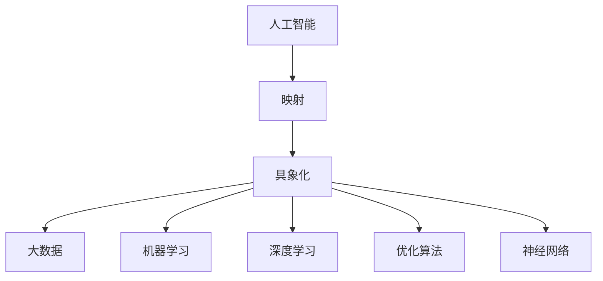
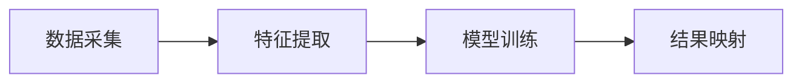
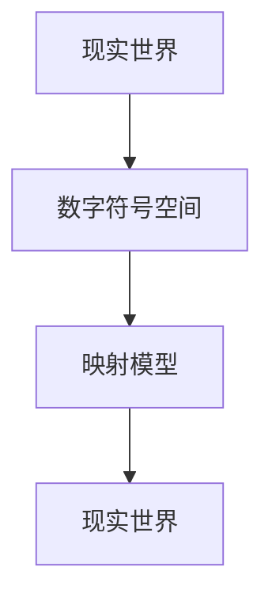
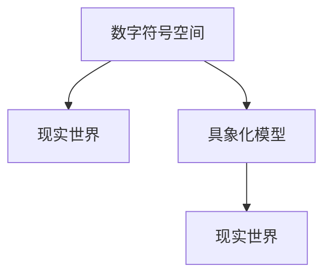

                 

# 一切皆是映射：具象化人工智能：从数字到现实世界

> 关键词：人工智能,映射,具象化,从数字到现实世界,大数据,机器学习,深度学习,优化算法,神经网络

## 1. 背景介绍

### 1.1 问题由来
随着信息技术的发展，人工智能（AI）已经深入到各个领域，从智能客服、智能推荐，到自动驾驶、工业智能，人工智能正逐渐改变我们的生活方式。但与此同时，AI技术本身依然存在许多未知领域，如何从抽象的数字符号到具体的现实世界，将AI技术具象化，成为了一个亟需解决的问题。

### 1.2 问题核心关键点
将AI技术具象化的核心在于，如何将抽象的数字符号映射到具体的现实世界，使得AI系统能够理解和处理现实世界中的复杂问题。这涉及到以下几个关键点：

- 数据采集：如何高效地获取和处理现实世界中的数据。
- 特征提取：如何从原始数据中提取出有意义的特征，供AI系统使用。
- 模型训练：如何通过数据和特征训练AI模型，使其能够学习到现实世界中的规律。
- 结果映射：如何将AI模型的输出映射回现实世界，生成具体、可操作的决策或预测。
- 系统优化：如何通过优化算法，不断提升AI系统的性能和可靠性。

### 1.3 问题研究意义
将AI技术具象化，不仅能够提升AI系统的实际应用效果，还能促进AI技术的进一步发展。具体来说，具有现实世界映射能力的AI系统能够：

- 提供更准确、更可靠的预测和决策，帮助人们更好地理解和管理现实世界中的问题。
- 加速AI技术的落地应用，使得AI技术在各个领域都能发挥更大的作用。
- 推动AI技术的持续演进，吸引更多的人才和资源投入到AI研究中。

## 2. 核心概念与联系

### 2.1 核心概念概述

为了更好地理解将AI技术具象化的过程，本节将介绍几个密切相关的核心概念：

- 人工智能（Artificial Intelligence, AI）：指由人制造的智能体，能够模拟、扩展或扩展人类智能，执行复杂的任务。
- 映射（Mapping）：指将一个概念域到另一个概念域的转换过程，如将现实世界的数据映射到数字符号空间，或将数字符号空间中的决策映射回现实世界。
- 具象化（Concretization）：指将抽象概念具体化的过程，如将AI技术从理论模型具象化为实际应用。
- 大数据（Big Data）：指规模庞大、复杂多样、高速流动的数据集合，为AI训练和优化提供了基础。
- 机器学习（Machine Learning, ML）：指通过数据训练模型，使其能够自动地学习和优化，从而解决复杂问题。
- 深度学习（Deep Learning, DL）：指使用多层神经网络进行特征学习和模式识别的技术，能够处理复杂、非线性的数据模式。
- 优化算法（Optimization Algorithm）：指通过数学方法寻找问题的最优解或近似解，如梯度下降、遗传算法等。
- 神经网络（Neural Network, NN）：指模拟人脑神经元结构和功能的计算模型，能够通过大量数据训练出强大的特征提取和分类能力。

这些核心概念之间的逻辑关系可以通过以下Mermaid流程图来展示：



这个流程图展示了AI技术具象化过程中各个核心概念之间的关系：

1. 人工智能是整个过程的出发点和落脚点，需要通过映射和具象化实现AI技术的实际应用。
2. 映射是从抽象到具象的桥梁，包括将现实世界的数据映射到数字符号空间，以及将数字符号空间中的决策映射回现实世界。
3. 具象化是将抽象概念具体化的过程，将AI技术从理论模型具象化为实际应用。
4. 大数据、机器学习、深度学习、优化算法和神经网络是实现AI具象化的关键技术手段。

这些核心概念共同构成了AI技术具象化的完整生态系统，使得AI技术能够更好地应用到现实世界。通过理解这些核心概念，我们可以更好地把握AI技术具象化的工作原理和优化方向。

### 2.2 概念间的关系

这些核心概念之间存在着紧密的联系，形成了AI技术具象化的完整生态系统。下面我们通过几个Mermaid流程图来展示这些概念之间的关系。

#### 2.2.1 AI的训练过程



这个流程图展示了AI的训练过程，即从数据采集、特征提取、模型训练到结果映射的整个流程。数据采集是AI系统的输入，特征提取是对数据的预处理和抽象，模型训练是通过数据和特征训练AI模型，结果映射是将模型输出映射回现实世界。

#### 2.2.2 映射的具体实现



这个流程图展示了从现实世界到数字符号空间的映射过程，即通过定义映射模型，将现实世界中的数据映射到数字符号空间。映射模型的设计需要充分考虑数据的特性和AI模型的需求，以确保映射的准确性和有效性。

#### 2.2.3 具象化的实现方式



这个流程图展示了从数字符号空间到现实世界的具象化过程，即通过定义具象化模型，将AI模型的输出映射回现实世界。具象化模型的设计需要考虑AI模型的特性和现实世界的需求，以确保映射的准确性和可靠性。

## 3. 核心算法原理 & 具体操作步骤
### 3.1 算法原理概述

将AI技术具象化主要涉及以下几个关键步骤：

1. **数据采集**：从现实世界中采集大量数据，供AI模型训练使用。
2. **特征提取**：对采集到的数据进行预处理和特征提取，提取出有意义的特征，供AI模型学习。
3. **模型训练**：使用训练数据和特征训练AI模型，使其能够学习到现实世界中的规律。
4. **结果映射**：将AI模型的输出映射回现实世界，生成具体、可操作的决策或预测。
5. **系统优化**：通过优化算法，不断提升AI系统的性能和可靠性。

### 3.2 算法步骤详解

以下我们将详细介绍将AI技术具象化的关键算法步骤。

**Step 1: 数据采集**

数据采集是AI具象化的基础，需要通过传感器、摄像头、数据库等手段获取大量现实世界的数据。数据采集的目的是获取尽可能全面、准确、高效的数据，以供后续的特征提取和模型训练使用。

**Step 2: 特征提取**

特征提取是将原始数据转换为特征向量的过程，是AI具象化的关键步骤。特征提取的目的是提取出有意义的特征，供AI模型学习。常用的特征提取方法包括：

- 时间序列特征提取：从时间序列数据中提取趋势、周期、波动等特征。
- 文本特征提取：从文本数据中提取关键词、词频、主题等特征。
- 图像特征提取：从图像数据中提取颜色、形状、纹理等特征。
- 语音特征提取：从语音数据中提取音高、音色、语调等特征。

特征提取方法的选择需要根据具体的应用场景和数据特性进行设计和优化。

**Step 3: 模型训练**

模型训练是AI具象化的核心步骤，通过大量数据和特征训练AI模型，使其能够学习到现实世界中的规律。常用的模型训练方法包括：

- 监督学习：使用标注数据训练模型，使其能够输出特定的预测结果。
- 无监督学习：使用未标注数据训练模型，使其能够学习到数据的内在结构。
- 强化学习：通过与环境交互，训练模型，使其能够做出最优的决策。

模型训练方法的选择需要根据具体的应用场景和问题特性进行设计和优化。

**Step 4: 结果映射**

结果映射是将AI模型的输出映射回现实世界，生成具体、可操作的决策或预测。结果映射的目的是将AI模型的输出转化为现实世界的行动或决策，供实际应用使用。常用的结果映射方法包括：

- 规则映射：通过定义具体的规则，将AI模型的输出映射为具体的行动或决策。
- 阈值映射：通过设定阈值，将AI模型的输出映射为二分类或多分类结果。
- 概率映射：通过计算概率，将AI模型的输出映射为具体的行动或决策。

结果映射方法的选择需要根据具体的应用场景和问题特性进行设计和优化。

**Step 5: 系统优化**

系统优化是AI具象化的重要步骤，通过优化算法，不断提升AI系统的性能和可靠性。系统优化的目的是通过不断迭代和优化，使得AI系统能够更加高效、稳定地运行。常用的系统优化方法包括：

- 梯度下降算法：通过计算梯度，更新模型参数，优化模型性能。
- 遗传算法：通过模拟进化过程，搜索最优解。
- 蒙特卡罗算法：通过随机抽样，优化系统性能。

系统优化方法的选择需要根据具体的应用场景和问题特性进行设计和优化。

### 3.3 算法优缺点

将AI技术具象化具有以下优点：

- **高效性**：通过数据驱动的方式，可以高效地获取和处理现实世界的数据，提升AI系统的效率。
- **准确性**：通过模型训练和学习，可以提高AI系统的预测和决策准确性，提升系统性能。
- **可扩展性**：通过特征提取和结果映射，可以灵活地适应不同的应用场景，提升系统可扩展性。
- **鲁棒性**：通过优化算法和系统优化，可以提高AI系统的鲁棒性和稳定性，降低系统风险。

同时，将AI技术具象化也存在一些缺点：

- **数据依赖**：AI系统的性能依赖于数据的质量和数量，数据的采集和处理需要耗费大量时间和资源。
- **模型复杂性**：模型训练和优化需要复杂的数学和算法工具，模型的设计和实现需要较高的技术门槛。
- **映射误差**：映射过程可能存在误差，导致AI系统的输出与实际结果存在偏差。
- **系统风险**：系统优化和性能提升需要大量的实验和测试，系统风险较高。

### 3.4 算法应用领域

将AI技术具象化已经在各个领域得到了广泛应用，涵盖以下几个主要应用领域：

- **智能客服**：通过数据采集、特征提取和模型训练，构建智能客服系统，提供7x24小时不间断服务，提升客户咨询体验。
- **金融分析**：通过数据采集、特征提取和模型训练，构建金融分析系统，提供实时市场监测、风险评估等服务，辅助金融机构决策。
- **医疗诊断**：通过数据采集、特征提取和模型训练，构建医疗诊断系统，提供快速、准确的诊断结果，提升医疗服务水平。
- **智能推荐**：通过数据采集、特征提取和模型训练，构建智能推荐系统，提供个性化推荐服务，提升用户满意度。
- **智慧城市**：通过数据采集、特征提取和模型训练，构建智慧城市管理系统，提供实时交通、环境监测等服务，提升城市管理水平。

这些应用领域展示了AI技术具象化的广泛应用前景，为各行各业提供了智能化的解决方案。

## 4. 数学模型和公式 & 详细讲解 & 举例说明

### 4.1 数学模型构建

将AI技术具象化涉及到多个数学模型和公式，下面将详细讲解这些数学模型和公式。

**数据采集模型**

数据采集模型用于描述如何从现实世界中采集数据。常用的数据采集模型包括：

- 时间序列模型：描述时间序列数据的生成过程，常用的时间序列模型包括ARIMA、LSTM等。
- 文本模型：描述文本数据的生成过程，常用的文本模型包括NLP、BERT等。
- 图像模型：描述图像数据的生成过程，常用的图像模型包括CNN、GAN等。
- 语音模型：描述语音数据的生成过程，常用的语音模型包括RNN、CTC等。

**特征提取模型**

特征提取模型用于描述如何从原始数据中提取出有意义的特征。常用的特征提取模型包括：

- 主成分分析（PCA）：通过线性变换，将高维数据映射到低维空间。
- 奇异值分解（SVD）：通过奇异值分解，将矩阵分解为多个低秩矩阵的乘积。
- 独立成分分析（ICA）：通过线性变换，将多个变量分解为独立的成分。
- 卷积神经网络（CNN）：通过卷积操作，提取图像数据的局部特征。
- 循环神经网络（RNN）：通过循环操作，提取序列数据的局部特征。
- Transformer模型：通过自注意力机制，提取文本数据的全局特征。

**模型训练模型**

模型训练模型用于描述如何使用数据和特征训练AI模型。常用的模型训练模型包括：

- 监督学习模型：通过标注数据训练模型，使其能够输出特定的预测结果。常用的监督学习模型包括线性回归、决策树、支持向量机等。
- 无监督学习模型：使用未标注数据训练模型，使其能够学习到数据的内在结构。常用的无监督学习模型包括K-means、PCA等。
- 强化学习模型：通过与环境交互，训练模型，使其能够做出最优的决策。常用的强化学习模型包括Q-learning、Deep Q-Network等。

**结果映射模型**

结果映射模型用于描述如何将AI模型的输出映射回现实世界，生成具体、可操作的决策或预测。常用的结果映射模型包括：

- 规则映射模型：通过定义具体的规则，将AI模型的输出映射为具体的行动或决策。常用的规则映射模型包括IF-THEN规则、决策树等。
- 阈值映射模型：通过设定阈值，将AI模型的输出映射为二分类或多分类结果。常用的阈值映射模型包括逻辑回归、SVM等。
- 概率映射模型：通过计算概率，将AI模型的输出映射为具体的行动或决策。常用的概率映射模型包括贝叶斯分类器、深度信念网络等。

**系统优化模型**

系统优化模型用于描述如何通过优化算法，不断提升AI系统的性能和可靠性。常用的系统优化模型包括：

- 梯度下降模型：通过计算梯度，更新模型参数，优化模型性能。常用的梯度下降模型包括批量梯度下降、随机梯度下降等。
- 遗传算法模型：通过模拟进化过程，搜索最优解。常用的遗传算法模型包括标准遗传算法、基因编程等。
- 蒙特卡罗模型：通过随机抽样，优化系统性能。常用的蒙特卡罗模型包括蒙特卡罗树搜索、蒙特卡罗模拟等。

### 4.2 公式推导过程

以下我们将推导常用的AI具象化模型公式，包括数据采集模型、特征提取模型、模型训练模型、结果映射模型和系统优化模型。

**时间序列模型**

时间序列模型用于描述时间序列数据的生成过程，常用的时间序列模型包括ARIMA、LSTM等。ARIMA模型的公式如下：

$$
y_t = c + \sum_{i=1}^p \alpha_i y_{t-i} + \sum_{j=1}^q \beta_j \Delta^j y_{t} + \sum_{k=1}^K \gamma_k \varepsilon_{t-k}
$$

其中，$y_t$表示时间序列在第$t$个时间点的值，$c$表示常数项，$\alpha_i$表示自回归系数，$\beta_j$表示差分系数，$\Delta^j y_{t}$表示差分后的时间序列，$\gamma_k$表示白噪声系数，$\varepsilon_{t-k}$表示白噪声。

**文本模型**

文本模型用于描述文本数据的生成过程，常用的文本模型包括NLP、BERT等。BERT模型的公式如下：

$$
h_t = \text{MLP}(\text{Attention}(\text{Embedding}(x), \text{Encoder}(h_{t-1}))
$$

其中，$h_t$表示文本在第$t$个时间点的隐含表示，$x$表示输入文本，$\text{MLP}$表示多层感知器，$\text{Attention}$表示自注意力机制，$\text{Embedding}$表示词嵌入，$\text{Encoder}$表示Transformer编码器。

**图像模型**

图像模型用于描述图像数据的生成过程，常用的图像模型包括CNN、GAN等。CNN模型的公式如下：

$$
f(x) = \sum_{i=1}^n w_i g_i(x)
$$

其中，$x$表示输入图像，$g_i$表示卷积核，$w_i$表示卷积核的权重，$f(x)$表示输出特征图。

**语音模型**

语音模型用于描述语音数据的生成过程，常用的语音模型包括RNN、CTC等。RNN模型的公式如下：

$$
h_t = \text{MLP}(h_{t-1}, x_t)
$$

其中，$h_t$表示时间步为$t$的状态，$x_t$表示输入语音，$\text{MLP}$表示多层感知器。

**特征提取模型**

特征提取模型用于描述如何从原始数据中提取出有意义的特征。常用的特征提取模型包括PCA、SVD、ICA等。PCA模型的公式如下：

$$
X_k = \frac{U_k V_k}{\sigma_k}
$$

其中，$X_k$表示提取后的特征，$U_k$表示特征矩阵，$V_k$表示特征向量，$\sigma_k$表示特征值。

**监督学习模型**

监督学习模型用于描述如何使用标注数据训练模型，常用的监督学习模型包括线性回归、决策树、支持向量机等。线性回归模型的公式如下：

$$
y_t = w^T x_t + b
$$

其中，$y_t$表示预测结果，$x_t$表示输入特征，$w$表示权重，$b$表示偏置。

**无监督学习模型**

无监督学习模型用于描述如何使用未标注数据训练模型，常用的无监督学习模型包括K-means、PCA等。K-means模型的公式如下：

$$
\min_{\mu_k} \sum_{i=1}^n \| x_i - \mu_k \|^2
$$

其中，$\mu_k$表示聚类中心，$x_i$表示数据点，$\| \|$表示欧式距离。

**强化学习模型**

强化学习模型用于描述如何通过与环境交互，训练模型，常用的强化学习模型包括Q-learning、Deep Q-Network等。Q-learning模型的公式如下：

$$
Q(s_t, a_t) \leftarrow (1-\alpha) Q(s_t, a_t) + \alpha (r_t + \gamma \max_{a' \in \mathcal{A}} Q(s_{t+1}, a'))
$$

其中，$Q(s_t, a_t)$表示状态$s_t$在动作$a_t$下的Q值，$r_t$表示奖励，$\alpha$表示学习率，$\gamma$表示折扣因子，$\max_{a' \in \mathcal{A}} Q(s_{t+1}, a')$表示在状态$s_{t+1}$下的最大Q值。

**规则映射模型**

规则映射模型用于描述如何将AI模型的输出映射为具体的行动或决策。常用的规则映射模型包括IF-THEN规则、决策树等。IF-THEN规则的公式如下：

$$
\text{IF} \ p_1 \text{ AND } p_2 \text{ AND } \ldots \text{ AND } p_n \text{ THEN } a_1 \text{ OR } a_2 \text{ OR } \ldots \text{ OR } a_m
$$

其中，$p_1, p_2, \ldots, p_n$表示条件，$a_1, a_2, \ldots, a_m$表示动作。

**阈值映射模型**

阈值映射模型用于描述如何将AI模型的输出映射为二分类或多分类结果。常用的阈值映射模型包括逻辑回归、SVM等。逻辑回归模型的公式如下：

$$
P(y=1|x) = \frac{1}{1 + \exp(-\beta^T x)}
$$

其中，$P(y=1|x)$表示在输入$x$下，输出为1的概率，$\beta$表示权重，$\exp$表示指数函数。

**概率映射模型**

概率映射模型用于描述如何将AI模型的输出映射为具体的行动或决策。常用的概率映射模型包括贝叶斯分类器、深度信念网络等。贝叶斯分类器的公式如下：

$$
P(y|x) = \frac{P(x|y)P(y)}{P(x)}
$$

其中，$P(y|x)$表示在输入$x$下，输出为$y$的概率，$P(x|y)$表示在输出为$y$时，输入为$x$的概率，$P(y)$表示输出的先验概率，$P(x)$表示输入的先验概率。

**梯度下降模型**

梯度下降模型用于描述如何通过计算梯度，更新模型参数，优化模型性能。常用的梯度下降模型包括批量梯度下降、随机梯度下降等。批量梯度下降模型的公式如下：

$$
\theta \leftarrow \theta - \eta \nabla J(\theta)
$$

其中，$\theta$表示模型参数，$\eta$表示学习率，$J(\theta)$表示损失函数，$\nabla J(\theta)$表示损失函数的梯度。

**遗传算法模型**

遗传算法模型用于描述如何通过模拟进化过程，搜索最优解。常用的遗传算法模型包括标准遗传算法、基因编程等。标准遗传算法的公式如下：

$$
\theta = \text{GA}(\text{Population}, \text{Fitness}, \text{Selection}, \text{Crossover}, \text{Mutation})
$$

其中，$\theta$表示模型参数，$\text{Population}$表示种群，$\text{Fitness}$表示适应度函数，$\text{Selection}$表示选择算法，$\text{Crossover}$表示交叉算法，$\text{Mutation}$表示变异算法。

**蒙特卡罗模型**

蒙特卡罗模型用于描述如何通过随机抽样，优化系统性能。常用的蒙特卡罗模型包括蒙特卡罗树搜索、蒙特卡罗模拟等。蒙特卡罗树搜索的公式如下：

$$
\text{Q}(s) = \sum_{a \in \mathcal{A}} \text{Q}(s, a) P(a|s)
$$

其中，$\text{Q}(s)$表示状态$s$的Q值，$\text{Q}(s, a)$表示在状态$s$下，动作$a$的Q值，$P(a|s)$表示在状态$s$下，动作$a$的概率。

### 4.3 案例分析与讲解

以下我们将以实际案例来讲解AI具象化的过程。

**案例1: 智能客服系统**

智能客服系统通过数据采集、特征提取、模型训练、结果映射和系统优化，实现了智能客服的功能。具体步骤如下：

1. 数据采集：通过调用第三方API，获取客户与客服的聊天记录。
2. 特征提取：将聊天记录转化为文本数据，进行分词、词频统计等特征提取。
3. 模型训练：使用BERT模型，将聊天记录作为输入，训练模型，使其能够输出预测结果。
4. 结果映射：根据预测结果，生成相应的回复。
5. 系统优化：通过梯度下降算法，不断优化模型参数，提升系统性能。

**案例2: 金融分析系统**

金融分析系统通过数据采集、特征提取、模型训练、结果映射和系统优化，实现了金融分析的功能。具体步骤如下：

1. 数据采集：通过API获取金融市场的实时数据。
2. 特征提取：将金融数据进行特征提取，提取出市场趋势、波动等特征。
3. 模型训练：使用LSTM模型，将金融数据作为输入，训练模型，使其能够输出预测结果。
4. 结果映射：根据预测结果，生成相应的投资建议。
5. 系统优化：通过遗传算法，不断优化模型参数，提升系统性能。

**案例3: 医疗诊断系统**

医疗诊断系统通过数据采集、特征提取、模型训练、结果映射和系统优化，实现了医疗诊断的功能。具体步骤如下：

1. 数据采集：通过传感器采集患者的生理数据。
2. 特征提取：将生理数据进行特征提取，提取出心跳、呼吸等特征。
3. 模型训练：使用RNN模型，将生理数据作为输入，训练模型，使其能够输出诊断结果。
4. 结果映射：根据诊断结果，生成相应的治疗建议。
5. 系统优化：通过蒙特卡罗模拟，不断优化模型参数，提升系统性能。

## 5. 项目实践：代码实例和详细解释说明

### 5.1 开发环境搭建

在进行AI具象化项目实践前，我们需要准备好开发环境。以下是使用Python进行PyTorch开发的环境配置流程：

1. 安装Anaconda：从官网下载并安装Anaconda，用于创建独立的Python环境。

2. 创建并激活虚拟环境：
```bash
conda create -n pytorch-env python=3.8 
conda activate pytorch-env
```

3. 安装PyTorch：根据CUDA版本，从官网获取对应的安装命令。例如：
```bash
conda install pytorch torchvision torchaudio cudatoolkit=11.1 -c pytorch -c conda-forge
```

4. 安装Transformers库：
```bash
pip install transformers
```

5. 安装各类工具包：
```bash
pip install numpy pandas scikit-learn matplotlib tqdm jupyter notebook ipython
```

完成上述步骤后，即可在`pytorch-env`环境中开始AI具象化的项目实践。

### 5.2 源代码详细实现

这里我们以智能客服系统为例

