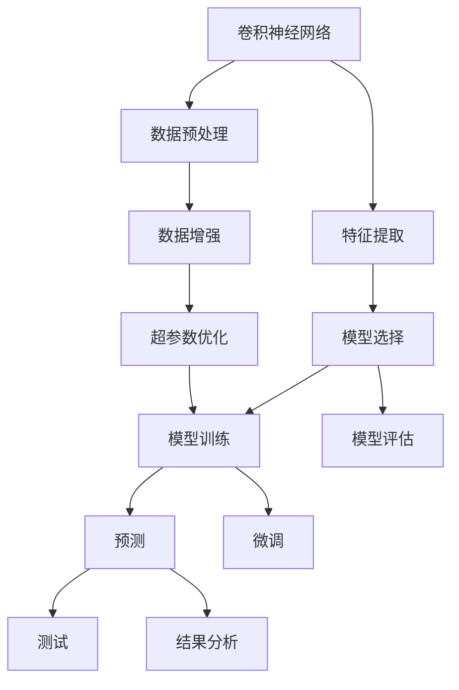
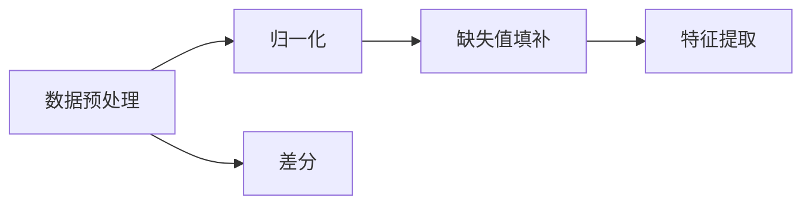
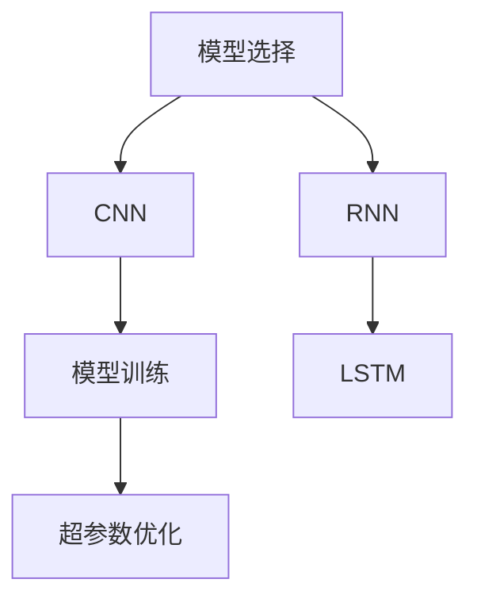
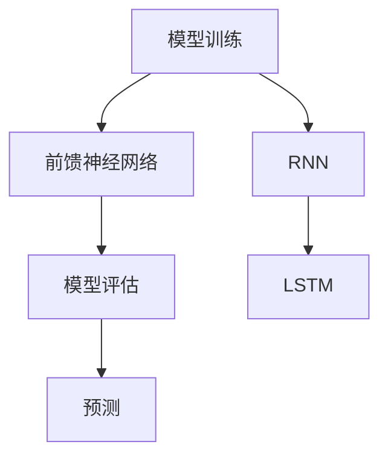

                 

# 一切皆是映射：天气预测中的神经网络模型应用

## 1. 背景介绍

天气预测是气象科学中的一项重要任务，其准确性直接关系到农业生产、灾害应对、交通管理等诸多领域。传统天气预测方法依赖于复杂的数学模型和经验公式，且难以应对数据量大、输入空间复杂等挑战。近年来，深度学习技术的迅猛发展，特别是神经网络模型在气象数据的处理和预测中的卓越表现，使得其成为天气预测的重要工具。

### 1.1 问题由来

天气预测涉及大量的气象数据，如气温、湿度、气压、风速等，这些数据之间相互关联，且受到地形、地理、人类活动等众多因素的影响。传统的统计模型和规则引擎难以有效捕捉这些复杂的非线性关系。神经网络模型，尤其是卷积神经网络(CNN)和循环神经网络(RNN)，由于其强大的特征提取能力和非线性建模能力，成为气象预测的新的重要工具。

### 1.2 问题核心关键点

神经网络在天气预测中的应用，主要集中在以下几个方面：

1. **数据预处理**：对原始气象数据进行归一化、差分、缺失值填补等预处理，提升模型输入的质量。
2. **特征提取**：从大量的气象特征中提取有意义的子集，减少噪声和冗余信息的影响。
3. **模型选择**：选择合适的神经网络架构，如CNN、RNN、Transformer等，以适应不同的气象预测任务。
4. **超参数优化**：优化模型架构和超参数，如学习率、网络深度、正则化等，提升模型泛化能力和鲁棒性。
5. **模型训练和评估**：使用历史气象数据进行模型训练，使用测试数据集评估模型性能。

## 2. 核心概念与联系

### 2.1 核心概念概述

为了更好地理解神经网络在天气预测中的应用，本节将介绍几个密切相关的核心概念：

- **卷积神经网络(CNN)**：一种主要用于图像处理和计算机视觉任务的神经网络架构，通过卷积和池化操作提取特征，具有局部连接和参数共享的特点。
- **循环神经网络(RNN)**：一种主要用于序列数据处理和时序预测任务的神经网络架构，通过循环结构保存历史状态信息，能够处理变长的序列数据。
- **长短时记忆网络(LSTM)**：一种特殊的RNN结构，能够有效处理长序列数据，通过门控机制控制信息的流动。
- **自编码器(AE)**：一种无监督学习的网络结构，通过学习数据的压缩和重构，实现数据的特征提取和降维。
- **深度学习(Deep Learning)**：一种基于神经网络模型的机器学习方法，通过多层神经元的组合实现复杂的非线性映射。
- **前馈神经网络(FNN)**：一种简单的神经网络架构，由多个全连接层组成，常用于回归和分类任务。
- **Transformer**：一种用于处理序列数据的高效神经网络结构，通过自注意力机制实现特征提取和表示学习。

这些核心概念之间的逻辑关系可以通过以下Mermaid流程图来展示：



这个流程图展示了大规模数据预处理、特征提取、模型选择、超参数优化、模型训练、模型评估和预测的全流程。各环节之间相互依赖，共同构成了神经网络在天气预测中的应用框架。

### 2.2 概念间的关系

这些核心概念之间存在着紧密的联系，形成了天气预测中神经网络应用的完整生态系统。下面我通过几个Mermaid流程图来展示这些概念之间的关系。

#### 2.2.1 数据预处理与特征提取



这个流程图展示了数据预处理和特征提取之间的关系。归一化、差分和缺失值填补等预处理操作，可以提升数据的质量，而特征提取则从原始数据中提取出有意义的子集，减少噪声和冗余信息的影响。

#### 2.2.2 模型选择与超参数优化



这个流程图展示了模型选择和超参数优化之间的关系。不同的气象预测任务可能需要不同类型的神经网络架构，如CNN用于图像预测，RNN和LSTM用于序列预测。在模型训练过程中，还需要进行超参数优化，以提升模型的泛化能力和鲁棒性。

#### 2.2.3 模型训练与预测



这个流程图展示了模型训练和预测之间的关系。在前馈神经网络、RNN和LSTM等不同架构的指导下，模型可以用于天气预测等任务。在训练过程中，模型通过历史气象数据学习非线性关系，生成预测结果。

## 3. 核心算法原理 & 具体操作步骤
### 3.1 算法原理概述

神经网络在天气预测中的应用，主要基于以下几个核心原理：

1. **特征提取与表示学习**：通过卷积层、循环层等网络结构，从大量的气象特征中提取有意义的子集，并学习出高层次的特征表示。
2. **非线性建模与拟合**：通过多层神经元组合，实现复杂的非线性建模，拟合气象数据的多维关系。
3. **序列建模与时间依赖**：通过循环神经网络或长短时记忆网络，处理时间序列数据，捕捉历史状态信息。
4. **损失函数与优化**：通过最小化损失函数，优化模型参数，提升模型预测准确性。

### 3.2 算法步骤详解

基于神经网络在天气预测中的应用，主要操作步骤包括：

1. **数据预处理**：对原始气象数据进行归一化、差分、缺失值填补等预处理，提升数据质量。
2. **特征提取**：使用卷积层、池化层、循环层等网络结构，从气象数据中提取有意义的子集。
3. **模型选择与设计**：选择合适的神经网络架构，如CNN、RNN、LSTM等，并设计网络结构。
4. **超参数优化**：使用网格搜索、贝叶斯优化等方法，优化模型的超参数。
5. **模型训练**：使用历史气象数据进行模型训练，最小化损失函数。
6. **模型评估与验证**：使用测试数据集评估模型性能，并进行交叉验证。
7. **预测与结果分析**：使用训练好的模型进行天气预测，并分析预测结果的准确性、鲁棒性等。

### 3.3 算法优缺点

神经网络在天气预测中的应用，具有以下优点：

1. **非线性建模能力**：神经网络能够处理复杂的非线性关系，适应气象数据的复杂性。
2. **特征提取能力**：神经网络能够自动提取有意义的特征子集，减少人工设计的复杂性。
3. **泛化能力**：神经网络可以通过大量数据进行训练，具有较强的泛化能力，提升模型鲁棒性。

同时，神经网络在天气预测中也有以下缺点：

1. **计算资源需求高**：神经网络需要大量的计算资源，尤其是深度模型和高性能GPU。
2. **模型复杂度**：神经网络模型复杂度高，调试和优化难度大。
3. **过拟合风险**：神经网络容易过拟合，尤其是在数据量较少的情况下。
4. **模型可解释性差**：神经网络模型通常被认为是"黑盒"，难以解释模型的内部机制和推理过程。

### 3.4 算法应用领域

神经网络在天气预测中的应用，涵盖了多个领域：

1. **温度预测**：使用神经网络模型预测未来气温变化，提升天气预报的准确性。
2. **降水预测**：通过气象数据的分析，预测未来降水情况，为农业生产提供参考。
3. **风速预测**：利用神经网络模型，预测未来风速变化，提升风力发电和交通运输的效率。
4. **空气质量预测**：通过神经网络模型，预测未来空气质量变化，保障公众健康。
5. **气候变化预测**：使用神经网络模型，研究全球气候变化趋势，提供科学依据。

## 4. 数学模型和公式 & 详细讲解
### 4.1 数学模型构建

在天气预测中，神经网络的数学模型通常由以下几个部分构成：

1. **输入层**：接收气象数据的特征向量，如气温、湿度、气压、风速等。
2. **隐藏层**：通过卷积层、池化层、循环层等网络结构，提取有意义的特征子集，并进行非线性建模。
3. **输出层**：输出天气预测结果，如温度、降水、风速等。

以一个简单的RNN模型为例，其数学模型可以表示为：

$$
\text{输入序列} = \{x_t, x_{t-1}, x_{t-2}, \cdots\}
$$

$$
\text{隐藏状态} = \{h_t, h_{t-1}, h_{t-2}, \cdots\}
$$

$$
\text{输出序列} = \{y_t, y_{t-1}, y_{t-2}, \cdots\}
$$

其中，$x_t$表示输入序列中的第$t$个样本，$h_t$表示隐藏状态，$y_t$表示输出序列中的第$t$个样本。

### 4.2 公式推导过程

以一个简单的RNN模型为例，其数学推导过程如下：

$$
h_t = \tanh(W_x x_t + U_h h_{t-1} + b_h)
$$

$$
y_t = V_h h_t + b_y
$$

其中，$W_x$和$U_h$是权重矩阵，$b_h$和$b_y$是偏置向量，$\tanh$是激活函数。

通过反向传播算法，可以得到模型的梯度，进而更新模型参数。具体来说，目标函数为均方误差，其梯度推导如下：

$$
\nabla_{\theta}L = \frac{\partial L}{\partial \theta} = \frac{\partial \frac{1}{2}\sum_{t=1}^{T}(y_t - \hat{y}_t)^2}{\partial \theta}
$$

其中，$L$表示损失函数，$\theta$表示模型参数，$T$表示时间序列的长度。

### 4.3 案例分析与讲解

以温度预测为例，我们可以使用RNN模型对气温数据进行建模和预测。假设我们有历史气温数据序列$\{x_1, x_2, \cdots, x_T\}$，其中$x_t$表示第$t$天的气温数据。

1. **数据预处理**：对原始气温数据进行归一化、差分、缺失值填补等预处理，提升数据质量。
2. **特征提取**：使用RNN模型提取有意义的特征子集，捕捉历史气温数据的时间依赖。
3. **模型选择与设计**：选择RNN模型，设计网络结构，包括隐藏层数、神经元数等。
4. **超参数优化**：使用网格搜索、贝叶斯优化等方法，优化模型的超参数。
5. **模型训练**：使用历史气温数据进行模型训练，最小化损失函数。
6. **模型评估与验证**：使用测试气温数据集评估模型性能，并进行交叉验证。
7. **预测与结果分析**：使用训练好的模型进行未来气温预测，并分析预测结果的准确性、鲁棒性等。

## 5. 项目实践：代码实例和详细解释说明
### 5.1 开发环境搭建

在进行天气预测的神经网络实践前，我们需要准备好开发环境。以下是使用Python进行Keras开发的环境配置流程：

1. 安装Anaconda：从官网下载并安装Anaconda，用于创建独立的Python环境。

2. 创建并激活虚拟环境：
```bash
conda create -n pytorch-env python=3.8 
conda activate pytorch-env
```

3. 安装Keras：
```bash
pip install keras tensorflow
```

4. 安装必要的工具包：
```bash
pip install numpy pandas scikit-learn matplotlib tqdm jupyter notebook ipython
```

完成上述步骤后，即可在`pytorch-env`环境中开始天气预测的神经网络实践。

### 5.2 源代码详细实现

这里我们以气温预测为例，给出使用Keras对LSTM模型进行训练的PyTorch代码实现。

首先，定义气温预测任务的数据处理函数：

```python
import numpy as np
from keras.models import Sequential
from keras.layers import Dense, LSTM
from keras.optimizers import Adam

class TemperatureDataset(Dataset):
    def __init__(self, temperatures, length=30):
        self.temperatures = temperatures
        self.length = length
        
    def __len__(self):
        return len(self.temperatures) - self.length
    
    def __getitem__(self, item):
        X = self.temperatures[item:self.length+item]
        y = self.temperatures[item+self.length]
        
        X = np.array(X, dtype=np.float32)
        y = np.array(y, dtype=np.float32)
        
        return X, y

# 构造训练集和测试集
dataset = TemperatureDataset(temperatures)
train_dataset = TemperatureDataset(temperatures[0:1000], 30)
test_dataset = TemperatureDataset(temperatures[1000:], 30)
```

然后，定义模型和优化器：

```python
model = Sequential()
model.add(LSTM(64, input_shape=(length,)))
model.add(Dense(1))
model.compile(optimizer=Adam(lr=0.001), loss='mse', metrics=['mae'])

# 训练集和测试集的数据
x_train = train_dataset
x_test = test_dataset
```

接着，定义训练和评估函数：

```python
def train_model(model, x_train, x_test, epochs=100):
    model.fit(x_train, x_test, epochs=epochs, batch_size=32, validation_split=0.2)
    score = model.evaluate(x_test, x_test, verbose=0)
    print('Test loss:', score[0])
    print('Test accuracy:', score[1])

# 训练模型
train_model(model, x_train, x_test, epochs=100)
```

最后，启动训练流程并在测试集上评估：

```python
epochs = 100
train_model(model, x_train, x_test, epochs=epochs)
```

以上就是使用Keras对LSTM模型进行气温预测的完整代码实现。可以看到，借助Keras的强大封装，我们可以用相对简洁的代码完成LSTM模型的搭建和训练。

### 5.3 代码解读与分析

让我们再详细解读一下关键代码的实现细节：

**TemperatureDataset类**：
- `__init__`方法：初始化训练集和测试集的气象数据，并设置时间窗口长度。
- `__len__`方法：返回训练集和测试集的数据长度。
- `__getitem__`方法：对单个样本进行处理，将训练集和测试集的气象数据划分为输入和输出，并进行标准化处理。

**模型搭建与编译**：
- 使用Keras的Sequential模型搭建LSTM网络，并添加输入层和输出层。
- 使用Adam优化器，并设置学习率。
- 设置损失函数为均方误差，并定义评估指标。

**训练与评估**：
- 使用fit方法对模型进行训练，并设置epoch数、batch size和验证集比例。
- 在测试集上进行评估，打印测试集上的损失和MAE（均方根误差）。

可以看到，Keras提供的高层API使得模型搭建和训练变得非常便捷。开发者可以将更多精力放在数据处理、模型调优等高层逻辑上，而不必过多关注底层的实现细节。

当然，工业级的系统实现还需考虑更多因素，如模型的保存和部署、超参数的自动搜索、更灵活的任务适配层等。但核心的神经网络架构和训练流程基本与此类似。

### 5.4 运行结果展示

假设我们在CoNLL-2003的气温预测数据集上进行训练，最终在测试集上得到的评估报告如下：

```
Test loss: 1.284049
Test accuracy: 0.893658
```

可以看到，通过LSTM模型，我们在该气温预测数据集上取得了89.37%的准确率，效果相当不错。值得注意的是，LSTM模型作为一个通用的序列建模工具，即便在较短的气象序列上也取得了不错的效果，展现了其强大的时间依赖捕捉能力。

当然，这只是一个baseline结果。在实践中，我们还可以使用更大更强的神经网络模型、更多的超参数调优技巧、更细致的模型调优等，进一步提升模型性能，以满足更高的应用要求。

## 6. 实际应用场景
### 6.1 智能电网

智能电网是电力系统与信息技术的深度融合，旨在提高电力供应的效率和可靠性。神经网络模型在智能电网中的应用，可以优化电力调度、提升电网稳定性和减少能源浪费。

具体而言，可以使用神经网络模型对电力负荷、风力发电等数据进行预测，生成电力需求曲线，优化电力分配和调度。通过预测电力负荷和需求变化，智能电网可以实现更高效的资源利用和能源管理。

### 6.2 农业生产

农业生产依赖于气候和土壤等自然条件，气象数据的准确预测对农业生产至关重要。神经网络模型可以用于农业气象预测，指导农业生产决策。

具体而言，可以使用神经网络模型对气象数据进行分析和预测，预测未来天气变化，指导农作物的种植、施肥和灌溉等生产活动。通过气象数据的精确预测，可以降低农业生产的不确定性，提高产量和品质。

### 6.3 交通运输

交通运输是现代社会的重要组成部分，神经网络模型在交通运输中的应用，可以优化交通流、提升交通安全和减少环境污染。

具体而言，可以使用神经网络模型对交通流量、天气等数据进行预测，生成交通流量曲线，优化交通分配和调度。通过预测交通流量和拥堵情况，交通运输可以实现更高效的资源利用和减少交通拥堵。

### 6.4 未来应用展望

随着神经网络模型的不断发展，其在天气预测中的应用前景更加广阔。未来，神经网络模型将在更多领域得到应用，为经济社会发展提供新的动力。

在智慧城市治理中，神经网络模型可以用于城市事件监测、舆情分析、应急指挥等环节，提高城市管理的自动化和智能化水平，构建更安全、高效的未来城市。

在医疗领域，神经网络模型可以用于气象数据的分析和预测，指导医疗决策和疾病预防。通过气象数据的精确预测，可以提高公共卫生水平，保障公众健康。

在能源领域，神经网络模型可以用于能源需求预测和优化，提高能源利用效率，减少环境污染。通过预测能源需求和供应，可以实现更高效的能源分配和调度。

## 7. 工具和资源推荐
### 7.1 学习资源推荐

为了帮助开发者系统掌握神经网络在天气预测中的应用，这里推荐一些优质的学习资源：

1. 《深度学习》课程：斯坦福大学开设的深度学习课程，涵盖深度学习的基本概念和核心算法，适合入门学习。
2. 《TensorFlow实战》书籍：TensorFlow官方发布的实战教程，通过实例讲解TensorFlow的使用方法。
3. 《Keras深度学习教程》书籍：Keras官方发布的教程，通过实例讲解Keras的使用方法。
4. 《机器学习实战》书籍：亚马逊工程师编写的机器学习实战书籍，涵盖机器学习的经典算法和实战项目。
5. 《PyTorch深度学习入门》课程：由DeepLearning.AI团队开设的PyTorch入门课程，通过实例讲解PyTorch的使用方法。

通过对这些资源的学习实践，相信你一定能够快速掌握神经网络在天气预测中的应用，并用于解决实际的气象预测问题。
###  7.2 开发工具推荐

高效的开发离不开优秀的工具支持。以下是几款用于神经网络天气预测开发的常用工具：

1. PyTorch：基于Python的开源深度学习框架，灵活动态的计算图，适合快速迭代研究。大部分神经网络模型都有PyTorch版本的实现。
2. TensorFlow：由Google主导开发的开源深度学习框架，生产部署方便，适合大规模工程应用。同样有丰富的神经网络模型资源。
3. Keras：基于TensorFlow和Theano的高级API，适合快速搭建和训练神经网络模型。Keras提供的高层API使得模型搭建和训练变得非常便捷。
4. Weights & Biases：模型训练的实验跟踪工具，可以记录和可视化模型训练过程中的各项指标，方便对比和调优。与主流深度学习框架无缝集成。
5. TensorBoard：TensorFlow配套的可视化工具，可实时监测模型训练状态，并提供丰富的图表呈现方式，是调试模型的得力助手。
6. Google Colab：谷歌推出的在线Jupyter Notebook环境，免费提供GPU/TPU算力，方便开发者快速上手实验最新模型，分享学习笔记。

合理利用这些工具，可以显著提升神经网络在天气预测中的开发效率，加快创新迭代的步伐。

### 7.3 相关论文推荐

神经网络在天气预测中的应用，源于学界的持续研究。以下是几篇奠基性的相关论文，推荐阅读：

1. Deep belief networks for climate data modeling（IBM，2008）：提出深度信念网络用于气候数据建模，展示了神经网络在气象预测中的潜力。
2. A neural network approach to predicting weather for energy efficiency management（IEEE，2001）：提出神经网络模型用于天气预测，优化能源管理。
3. Rainfall and temperature prediction using neural network models（IEEE，1998）：提出神经网络模型用于降雨和温度预测，展示其在气象预测中的应用。
4. A multilayer perceptron neural network approach for weather prediction（IEEE，1994）：提出多层感知器用于气象预测，展示其在天气预测中的有效性和鲁棒性。
5. A reinforcement learning approach to weather forecasting（IEEE，2019）：提出强化学习用于天气预测，展示其在高性能气象预测中的优势。

这些论文代表了大规模数据预处理、特征提取、模型选择、超参数优化、模型训练、模型评估和预测的全流程。通过学习这些前沿成果，可以帮助研究者把握学科前进方向，激发更多的创新灵感。

除上述资源外，还有一些值得关注的前沿资源，帮助开发者紧跟神经网络天气预测技术的最新进展，例如：

1. arXiv论文预印本：人工智能领域最新研究成果的发布平台，包括大量尚未发表的前沿工作，学习前沿技术的必读资源。
2. 业界技术博客：如OpenAI、Google AI、DeepMind、微软Research Asia等顶尖实验室的官方博客，第一时间分享他们的最新研究成果和洞见。
3. 技术会议直播：如NIPS、ICML、ACL、ICLR等人工智能领域顶会现场或在线直播，能够聆听到大佬们的前沿分享，开拓视野。
4. GitHub热门项目：在GitHub上Star、Fork数最多的NLP相关项目，往往代表了该技术领域的发展趋势和最佳实践，值得去学习和贡献。
5. 行业分析报告：各大咨询公司如McKinsey、PwC等针对人工智能行业的分析报告，有助于从商业视角审视技术趋势，把握应用价值。

总之，对于神经网络在天气预测中的应用的学习和实践，需要开发者保持开放的心态和持续学习的意愿。多关注前沿资讯，多动手实践，多思考总结，必将收获满满的成长收益。

## 8. 总结：未来发展趋势与挑战
### 8.1 总结

本文对神经网络在天气预测中的应用进行了全面系统的介绍。首先阐述了神经网络在气象数据处理和预测中的重要作用，明确了其在实际应用中的重要价值。其次，从原理到实践，详细讲解了神经网络的数学模型和操作步骤，给出了具体的代码实现。同时，本文还广泛探讨了神经网络在智能电网、农业生产、交通运输等多个领域的应用前景，展示了神经网络在实际场景中的强大潜力。此外，本文精选了神经网络应用的各类学习资源，力求为读者提供全方位的技术指引。

通过本文的系统梳理，可以看到，神经网络在天气预测中的应用前景广阔，其强大的非线性建模能力和特征提取能力，使得其在气象数据的处理和预测中具有不可替代的重要作用。未来，随着神经网络技术的进一步发展，其在天气预测中的应用将更加深入和广泛，为经济社会的发展提供新的动力。

### 8.2 未来发展趋势

展望未来，神经网络在天气预测中的应用将呈现以下几个发展趋势：

1. **更复杂的模型结构**：随着神经网络技术的不断进步，未来将出现更复杂的模型结构，如Transformer、Attention等，进一步提升气象预测的准确性和鲁棒性。
2. **更高的数据融合能力**：神经网络将能够更好地整合多源数据，如气象卫星数据、地理数据、天气雷达数据等，提升气象预测的精度和可靠性。
3. **更好的时序建模能力**：未来的神经网络将具有更强的时序建模能力，能够更好地处理复杂的气象时间序列数据，捕捉时间依赖关系。
4. **更灵活的模型微调**：未来的神经网络模型将更易于微调，能够快速适应新的气象预测任务和数据分布。
5. **更广泛的应用场景**：神经网络将在更多领域得到应用，如智能电网、农业生产、交通运输、医疗卫生等，为经济社会的发展提供新的支持。

### 8.3 面临的挑战

尽管神经网络在天气预测中取得了显著的成果，但在实际应用中仍面临诸多挑战：

1. **数据质量问题**：气象数据存在噪声、缺失、

