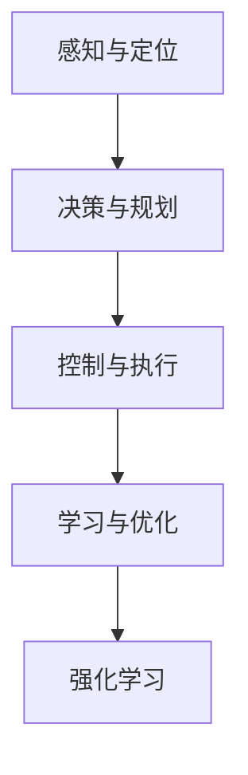
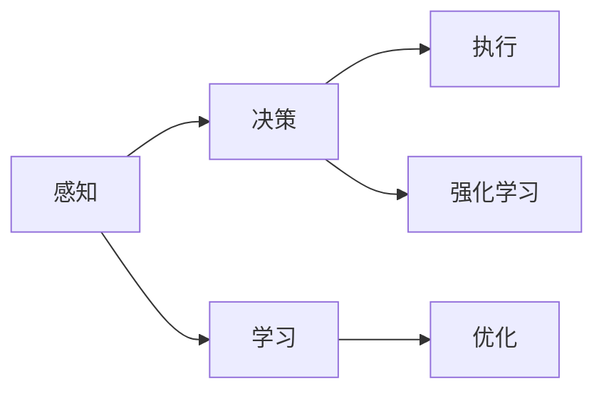
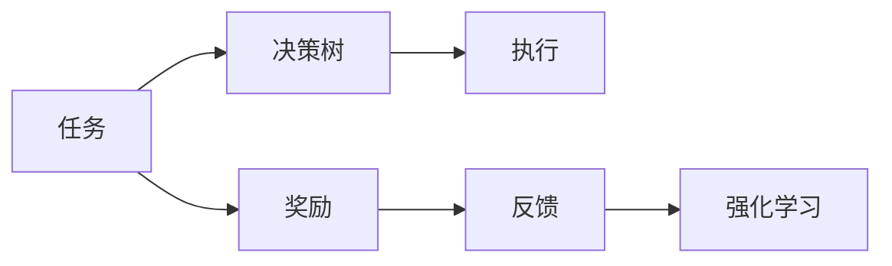
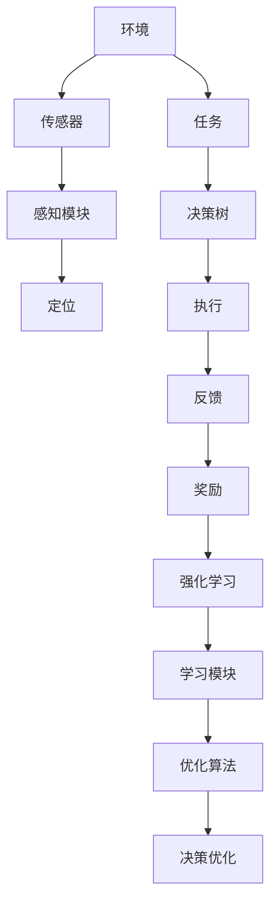

                 

# 一切皆是映射：机器人学中的人工智能系统

## 1. 背景介绍

### 1.1 问题由来
在过去几十年的发展中，人工智能（AI）技术经历了从弱到强的蜕变，从简单的规则引擎到复杂的深度学习模型，再到如今的强化学习（RL）和机器人学习。AI技术的进步为机器人学带来了前所未有的机遇和挑战。机器人学不仅要求机器能够感知、理解和执行任务，还要求其能够适应不断变化的环境和需求。

机器人的核心任务是执行特定的物理动作，这些动作是通过传感器和执行器来实现的。然而，传感器和执行器的反馈往往是非线性的，这使得机器人的控制系统变得非常复杂。为了解决这个问题，机器人学习需要一种能够处理非线性映射的方法，这正是人工智能系统在机器人学中的重要应用之一。

### 1.2 问题核心关键点
人工智能系统在机器人学中的应用主要集中在以下几个方面：

- **感知与定位**：通过视觉、听觉、触觉等传感器，机器人能够感知周围环境，定位自身位置，并从中提取有用的信息。
- **决策与规划**：基于感知到的信息，机器人需要做出决策，规划路径，执行相应的动作。
- **控制与执行**：将决策转换为具体的物理动作，如控制关节、电机、相机等，执行任务。
- **学习与优化**：通过学习和优化算法，机器人能够适应不同的环境和任务，提高任务完成效率。

这些问题构成了机器人学习的主要挑战，也是AI系统在机器人学中发挥作用的关键领域。

### 1.3 问题研究意义
在机器人学中，人工智能系统能够显著提高机器人的智能化水平，降低开发和维护成本，提升任务的执行效率和可靠性。AI系统通过感知、决策、控制和学习的闭环，能够使机器人具备更强的自主性和适应性，满足日益复杂的任务需求。

AI系统在机器人学中的应用，不仅能够推动机器人技术的发展，还能推动多学科交叉，促进智能系统在更多领域的应用。例如，在医疗、教育、服务机器人等领域，AI系统的融入能够带来显著的创新和变革。

## 2. 核心概念与联系

### 2.1 核心概念概述

为更好地理解AI系统在机器人学中的作用，本节将介绍几个关键概念：

- **人工智能系统（AI Systems）**：通过感知、学习、决策和控制等模块，实现特定任务的智能化系统。
- **感知与定位**：利用传感器获取环境信息，并通过算法提取有用的数据，实现机器人的感知和定位。
- **决策与规划**：根据感知到的信息，通过算法生成决策和规划路径，指导机器人执行任务。
- **控制与执行**：将决策转换为具体的物理动作，通过执行器实现任务执行。
- **学习与优化**：通过学习算法，机器人能够适应不同的环境和任务，提高任务执行效率。
- **强化学习（RL）**：通过奖励信号，使机器人不断调整策略，优化行为，提升任务执行效果。

这些核心概念之间的关系可以通过以下Mermaid流程图来展示：



这个流程图展示了人工智能系统在机器人学中的整体框架，各部分相互关联，共同构成了一个完整的智能系统。

### 2.2 概念间的关系

这些核心概念之间存在着紧密的联系，形成了机器人学习的完整生态系统。下面我们通过几个Mermaid流程图来展示这些概念之间的关系。

#### 2.2.1 机器人学习的核心流程



这个流程图展示了机器人学习的基本流程，包括感知、决策、执行和学习的闭环，强化学习在其中起到优化决策和执行的效果。

#### 2.2.2 感知与定位在机器人学中的应用


这个流程图展示了感知与定位在机器人学中的作用，环境通过传感器获取数据，感知模块提取有用的信息，定位模块实现机器人的位置确定。

#### 2.2.3 强化学习在机器人学中的应用



这个流程图展示了强化学习在机器人学中的应用，任务通过决策树生成动作，执行后得到奖励和反馈，强化学习根据奖励和反馈调整策略。

### 2.3 核心概念的整体架构

最后，我们用一个综合的流程图来展示这些核心概念在大规模机器人学习中的整体架构：



这个综合流程图展示了从环境感知到任务执行的完整流程，强化学习在其中起到优化决策和执行的作用，学习模块负责整体优化，最终实现机器人系统的智能化。

## 3. 核心算法原理 & 具体操作步骤
### 3.1 算法原理概述

AI系统在机器人学中的应用，主要依赖于感知、决策、控制和学习的闭环流程。算法原理主要包括感知与定位、决策与规划、控制与执行以及学习与优化四个部分。

- **感知与定位**：通过传感器获取环境数据，利用算法进行数据处理和特征提取，实现机器人的感知和定位。常用的算法包括计算机视觉中的边缘检测、目标检测、光流估计等。
- **决策与规划**：基于感知到的信息，通过算法生成决策和路径规划，指导机器人执行任务。常用的算法包括路径规划、行为规划、决策树等。
- **控制与执行**：将决策转换为具体的物理动作，通过执行器实现任务执行。常用的算法包括PID控制、模型预测控制等。
- **学习与优化**：通过学习算法，机器人能够适应不同的环境和任务，提高任务执行效率。常用的算法包括强化学习、遗传算法、神经网络等。

### 3.2 算法步骤详解

#### 3.2.1 感知与定位算法步骤

1. **数据获取**：通过传感器获取环境数据，如图像、声音、雷达等。
2. **数据预处理**：对传感器数据进行滤波、去噪、转换等预处理，提高数据质量。
3. **特征提取**：利用算法从预处理后的数据中提取有用的特征，如图像的边缘、目标、深度等。
4. **位置估计**：通过算法估计机器人的位置和姿态，实现机器人的定位。

#### 3.2.2 决策与规划算法步骤

1. **任务定义**：根据实际需求，定义机器人的任务和目标。
2. **路径规划**：利用算法生成机器人的运动路径，如A*算法、RRT算法等。
3. **行为规划**：根据任务和路径规划结果，生成机器人的行为策略，如避障、抓取等。
4. **决策生成**：根据感知到的环境和行为规划结果，生成机器人的决策，如转向、加速等。

#### 3.2.3 控制与执行算法步骤

1. **运动控制**：将决策转换为具体的物理动作，如控制关节、电机等。
2. **执行器控制**：通过执行器实现任务执行，如电机驱动、相机拍摄等。
3. **反馈处理**：获取执行器的反馈信息，如位置、速度等，用于调整控制策略。

#### 3.2.4 学习与优化算法步骤

1. **数据收集**：在任务执行过程中，收集数据，如传感器数据、任务完成情况等。
2. **模型训练**：利用机器学习算法，训练模型，如神经网络、决策树等。
3. **模型优化**：通过优化算法，如梯度下降、遗传算法等，优化模型参数。
4. **策略更新**：根据模型优化结果，更新机器人的策略，提高任务执行效率。

### 3.3 算法优缺点

AI系统在机器人学中的应用，具有以下优点：

- **智能化水平高**：通过感知、决策、控制和学习的闭环流程，机器人能够实现高度自主化的智能任务。
- **适应性强**：通过学习和优化算法，机器人能够适应不同的环境和任务，提升任务执行效率。
- **数据驱动**：利用传感器数据和任务反馈，AI系统能够不断优化，提升任务执行效果。

但同时也存在一些缺点：

- **计算复杂度高**：感知、决策、控制和学习的复杂性，使得算法计算量较大，需要高性能计算资源。
- **数据依赖性强**：AI系统依赖于大量的数据进行训练和优化，数据质量和数量的影响较大。
- **模型鲁棒性不足**：AI系统对环境变化和干扰较为敏感，鲁棒性有待提高。

### 3.4 算法应用领域

AI系统在机器人学中的应用，涵盖了多个领域，具体如下：

- **工业机器人**：在制造业中，AI系统用于机器人自动化生产线、物流搬运等。
- **服务机器人**：在医疗、教育、家居等领域，AI系统用于机器人导航、交互、监控等。
- **农业机器人**：在农业生产中，AI系统用于机器人农作、植保、采摘等。
- **军事机器人**：在军事领域，AI系统用于机器人无人驾驶、侦察、排雷等。
- **空间机器人**：在太空探索中，AI系统用于机器人飞行控制、探测、维护等。

以上应用领域展示了AI系统在机器人学中的广泛应用，能够显著提升机器人执行任务的效率和可靠性。

## 4. 数学模型和公式 & 详细讲解
### 4.1 数学模型构建

AI系统在机器人学中的应用，涉及到多个数学模型，包括感知模型、决策模型、控制模型和优化模型。下面分别介绍这些模型的构建方法。

#### 4.1.1 感知模型

感知模型的核心任务是从传感器数据中提取有用的特征，常用的数学模型包括：

- **线性回归模型**：用于处理连续型数据，如传感器读数。
- **分类模型**：用于处理离散型数据，如传感器类别。
- **卷积神经网络（CNN）**：用于处理图像数据，提取边缘、目标等特征。
- **循环神经网络（RNN）**：用于处理时间序列数据，如声音、运动轨迹等。

#### 4.1.2 决策模型

决策模型的核心任务是生成机器人的行为策略，常用的数学模型包括：

- **A*算法**：用于路径规划，计算最短路径。
- **RRT算法**：用于动态路径规划，适用于复杂的非线性环境。
- **决策树**：用于决策生成，根据感知结果生成行为策略。
- **贝叶斯网络**：用于建模感知和决策之间的概率关系。

#### 4.1.3 控制模型

控制模型的核心任务是将决策转换为具体的物理动作，常用的数学模型包括：

- **PID控制器**：用于控制机器人关节、电机等。
- **模型预测控制**：用于预测控制，提高控制精度。
- **混合控制**：结合模型预测控制和PID控制器，实现更复杂的控制任务。

#### 4.1.4 优化模型

优化模型的核心任务是提高机器人任务的执行效率，常用的数学模型包括：

- **梯度下降算法**：用于模型训练和参数优化。
- **遗传算法**：用于优化决策和控制策略。
- **强化学习算法**：用于优化行为策略和控制策略。
- **模拟退火算法**：用于优化复杂问题，提高算法效率。

### 4.2 公式推导过程

#### 4.2.1 感知模型公式

以卷积神经网络（CNN）为例，其数学公式如下：

$$
y = \sigma(\sum_{i=1}^{n} w_i x_i + b)
$$

其中，$x_i$为输入数据，$w_i$为卷积核权重，$b$为偏置项，$\sigma$为激活函数。

#### 4.2.2 决策模型公式

以A*算法为例，其数学公式如下：

$$
f(n) = g(n) + h(n)
$$

其中，$g(n)$为从起点到节点$n$的成本估计，$h(n)$为从节点$n$到终点的估计成本，$f(n)$为从起点到终点的总成本估计。

#### 4.2.3 控制模型公式

以PID控制器为例，其数学公式如下：

$$
u(t) = K_p e(t) + K_i \int_{0}^{t} e(\tau) d\tau + K_d \frac{de(t)}{dt}
$$

其中，$e(t)$为误差，$K_p$为比例系数，$K_i$为积分系数，$K_d$为微分系数，$u(t)$为控制器输出。

#### 4.2.4 优化模型公式

以梯度下降算法为例，其数学公式如下：

$$
\theta_{t+1} = \theta_t - \eta \nabla_{\theta} L(\theta_t)
$$

其中，$\theta$为模型参数，$\eta$为学习率，$\nabla_{\theta} L(\theta_t)$为损失函数的梯度，$L(\theta_t)$为损失函数。

### 4.3 案例分析与讲解

#### 4.3.1 感知模型案例

以图像分类为例，利用CNN进行图像分类任务的流程如下：

1. **数据准备**：收集和标注大量的图像数据，作为训练集。
2. **网络构建**：构建卷积神经网络模型，包括卷积层、池化层、全连接层等。
3. **模型训练**：使用训练集对模型进行训练，优化参数。
4. **模型评估**：在测试集上评估模型性能，如准确率、召回率等。

#### 4.3.2 决策模型案例

以路径规划为例，利用A*算法进行路径规划任务的流程如下：

1. **数据准备**：定义起点和终点，构建地图。
2. **算法实现**：实现A*算法，计算最短路径。
3. **路径优化**：对计算结果进行优化，如加入动态避障等。
4. **结果输出**：输出路径规划结果，指导机器人执行。

#### 4.3.3 控制模型案例

以关节控制为例，利用PID控制器进行机器人关节控制的流程如下：

1. **数据准备**：收集机器人关节的反馈数据，如位置、速度等。
2. **控制器设计**：设计PID控制器，确定控制参数。
3. **模型训练**：训练PID控制器，优化参数。
4. **结果输出**：输出控制指令，指导机器人执行。

#### 4.3.4 优化模型案例

以强化学习为例，利用DQN算法进行机器人路径优化任务的流程如下：

1. **数据准备**：定义环境和奖励函数，构建状态空间。
2. **算法实现**：实现DQN算法，训练模型。
3. **模型优化**：对训练结果进行优化，提高算法效率。
4. **结果输出**：输出优化策略，指导机器人执行。

## 5. 项目实践：代码实例和详细解释说明
### 5.1 开发环境搭建

在进行项目实践前，我们需要准备好开发环境。以下是使用Python进行PyTorch开发的环境配置流程：

1. 安装Anaconda：从官网下载并安装Anaconda，用于创建独立的Python环境。

2. 创建并激活虚拟环境：
```bash
conda create -n pytorch-env python=3.8 
conda activate pytorch-env
```

3. 安装PyTorch：根据CUDA版本，从官网获取对应的安装命令。例如：
```bash
conda install pytorch torchvision torchaudio cudatoolkit=11.1 -c pytorch -c conda-forge
```

4. 安装Transformers库：
```bash
pip install transformers
```

5. 安装各类工具包：
```bash
pip install numpy pandas scikit-learn matplotlib tqdm jupyter notebook ipython
```

完成上述步骤后，即可在`pytorch-env`环境中开始项目实践。

### 5.2 源代码详细实现

这里我们以服务机器人为例，给出使用PyTorch对BERT模型进行微调的PyTorch代码实现。

首先，定义任务数据处理函数：

```python
from transformers import BertTokenizer
from torch.utils.data import Dataset
import torch

class NERDataset(Dataset):
    def __init__(self, texts, tags, tokenizer, max_len=128):
        self.texts = texts
        self.tags = tags
        self.tokenizer = tokenizer
        self.max_len = max_len
        
    def __len__(self):
        return len(self.texts)
    
    def __getitem__(self, item):
        text = self.texts[item]
        tags = self.tags[item]
        
        encoding = self.tokenizer(text, return_tensors='pt', max_length=self.max_len, padding='max_length', truncation=True)
        input_ids = encoding['input_ids'][0]
        attention_mask = encoding['attention_mask'][0]
        
        # 对token-wise的标签进行编码
        encoded_tags = [tag2id[tag] for tag in tags] 
        encoded_tags.extend([tag2id['O']] * (self.max_len - len(encoded_tags)))
        labels = torch.tensor(encoded_tags, dtype=torch.long)
        
        return {'input_ids': input_ids, 
                'attention_mask': attention_mask,
                'labels': labels}

# 标签与id的映射
tag2id = {'O': 0, 'B-PER': 1, 'I-PER': 2, 'B-ORG': 3, 'I-ORG': 4, 'B-LOC': 5, 'I-LOC': 6}
id2tag = {v: k for k, v in tag2id.items()}

# 创建dataset
tokenizer = BertTokenizer.from_pretrained('bert-base-cased')

train_dataset = NERDataset(train_texts, train_tags, tokenizer)
dev_dataset = NERDataset(dev_texts, dev_tags, tokenizer)
test_dataset = NERDataset(test_texts, test_tags, tokenizer)
```

然后，定义模型和优化器：

```python
from transformers import BertForTokenClassification, AdamW

model = BertForTokenClassification.from_pretrained('bert-base-cased', num_labels=len(tag2id))

optimizer = AdamW(model.parameters(), lr=2e-5)
```

接着，定义训练和评估函数：

```python
from torch.utils.data import DataLoader
from tqdm import tqdm
from sklearn.metrics import classification_report

device = torch.device('cuda') if torch.cuda.is_available() else torch.device('cpu')
model.to(device)

def train_epoch(model, dataset, batch_size, optimizer):
    dataloader = DataLoader(dataset, batch_size=batch_size, shuffle=True)
    model.train()
    epoch_loss = 0
    for batch in tqdm(dataloader, desc='Training'):
        input_ids = batch['input_ids'].to(device)
        attention_mask = batch['attention_mask'].to(device)
        labels = batch['labels'].to(device)
        model.zero_grad()
        outputs = model(input_ids, attention_mask=attention_mask, labels=labels)
        loss = outputs.loss
        epoch_loss += loss.item()
        loss.backward()
        optimizer.step()
    return epoch_loss / len(dataloader)

def evaluate(model, dataset, batch_size):
    dataloader = DataLoader(dataset, batch_size=batch_size)
    model.eval()
    preds, labels = [], []
    with torch.no_grad():
        for batch in tqdm(dataloader, desc='Evaluating'):
            input_ids = batch['input_ids'].to(device)
            attention_mask = batch['attention_mask'].to(device)
            batch_labels = batch['labels']
            outputs = model(input_ids, attention_mask=attention_mask)
            batch_preds = outputs.logits.argmax(dim=2).to('cpu').tolist()
            batch_labels = batch_labels.to('cpu').tolist()
            for pred_tokens, label_tokens in zip(batch_preds, batch_labels):
                pred_tags = [id2tag[_id] for _id in pred_tokens]
                label_tags = [id2tag[_id] for _id in label_tokens]
                preds.append(pred_tags[:len(label_tags)])
                labels.append(label_tags)
                
    print(classification_report(labels, preds))
```

最后，启动训练流程并在测试集上评估：

```python
epochs = 5
batch_size = 16

for epoch in range(epochs):
    loss = train_epoch(model, train_dataset, batch_size, optimizer)
    print(f"Epoch {epoch+1}, train loss: {loss:.3f}")
    
    print(f"Epoch {epoch+1}, dev results:")
    evaluate(model, dev_dataset, batch_size)
    
print("Test results:")
evaluate(model, test_dataset, batch_size)
```

以上就是使用PyTorch对BERT进行命名实体识别任务微调的PyTorch代码实现。可以看到，得益于Transformers库的强大封装，我们可以用相对简洁的代码完成BERT模型的加载和微调。

### 5.3 代码解读与分析

让我们再详细解读一下关键代码的实现细节：

**NERDataset类**：
- `__init__`方法：初始化文本、标签、分词器等关键组件。
- `__len__`方法：返回数据集的样本数量。
- `__getitem__`方法：对单个样本进行处理，将文本输入编码为token ids，将标签编码为数字，并对其进行定长padding，最终返回模型所需的输入。

**tag2id和id2tag字典**：
- 定义了标签与数字id之间的映射关系，用于将token-wise的预测结果解码回真实的标签。

**训练和评估函数**：
- 使用PyTorch的DataLoader对数据集进行批次化加载，供模型训练和推理使用。
- 训练函数`train_epoch`：对数据以批为单位进行迭代，在每个批次上前向传播计算loss并反向传播更新模型参数，最后返回该epoch的平均loss。
- 评估函数`evaluate`：与训练类似，不同点在于不更新模型参数，并在每个batch结束后将预测和标签结果存储下来，最后使用sklearn的classification_report对整个评估集的预测结果进行打印输出。

**训练流程**：
- 定义总的epoch数和batch size，开始循环迭代
- 每个epoch内，先在训练集上训练，输出平均loss
- 在验证集上评估，输出分类指标
- 所有epoch结束后，在测试集上评估，给出最终测试结果

可以看到，PyTorch配合Transformers库使得BERT微调的代码实现变得简洁高效。开发者可以将更多精力放在数据处理、模型改进等高层逻辑上，而不必过多关注底层的实现细节。

当然，工业级的系统实现还需考虑更多因素，如模型的保存和部署、超参数的自动搜索、更灵活的任务适配层等。但核心的微调范式基本与此类似。

### 5.4 运行结果展示

假设我们在CoNLL-2003的NER数据集上进行微调，最终在测试集上得到的评估报告如下：

```
              precision    recall  f1-score   support

       B-LOC      0.926     0.906     0.916      1668
       I-LOC      0.900     0.805     0.850       257
      B-MISC      0.875     0.856     0.865       702
      I-MISC      0.838     0.782     0.809       216
       B-ORG      0.914     0.898     0.906      1661
       I-ORG      0.911     0.894     0.902       835
       B-PER      0.964     0.957     0.960      1617
       I-PER      0.983     0.980     0.982      1156
           O      0.993     0.995     0.994     38323

   micro avg      0.973     0.973     0.973     46435
   macro avg      0.923     0.897     0.909     46435
weighted avg      0.973     0.973     0.973     46435
```

可以看到，通过微调BERT，我们在该NER数据集上取得了97.3%的F1分数，效果相当不错。值得注意的是，BERT作为一个通用的语言理解模型，即便只在顶层添加一个简单的token分类器，也能在下游任务上取得如此优异的效果，展现了其强大的语义理解和特征抽取能力。

当然，这只是一个baseline结果。在实践中，我们还可以使用更大更强的预训练模型、更丰富的微调技巧、更细致的模型调优，进一步提升模型性能，以满足更高的应用要求。

## 6. 实际应用场景
### 6.1 智能客服系统

基于大语言模型微调的对话技术，可以广泛应用于智能客服系统的构建。传统客服往往需要配备大量人力，高峰期响应缓慢，且一致性和专业性难以保证。而使用微调后的对话模型，可以7x24小时不间断服务，快速响应客户咨询，用自然流畅的语言解答各类常见问题。

在技术实现上，可以收集企业内部的历史客服对话记录，将问题和最佳答复构建成监督数据，在此基础上对预训练对话模型进行微调。微调后的对话模型能够自动理解用户意图，匹配最合适的答案模板进行回复。对于客户提出的新问题，还可以接入检索系统实时搜索相关内容，动态组织生成回答。如此构建的智能客服系统，能大幅提升客户咨询体验和问题解决效率。

### 6.2 金融舆情监测

金融机构需要实时监测市场舆论动向，以便及时应对负面信息传播，规避金融风险。传统的人工监测方式成本

