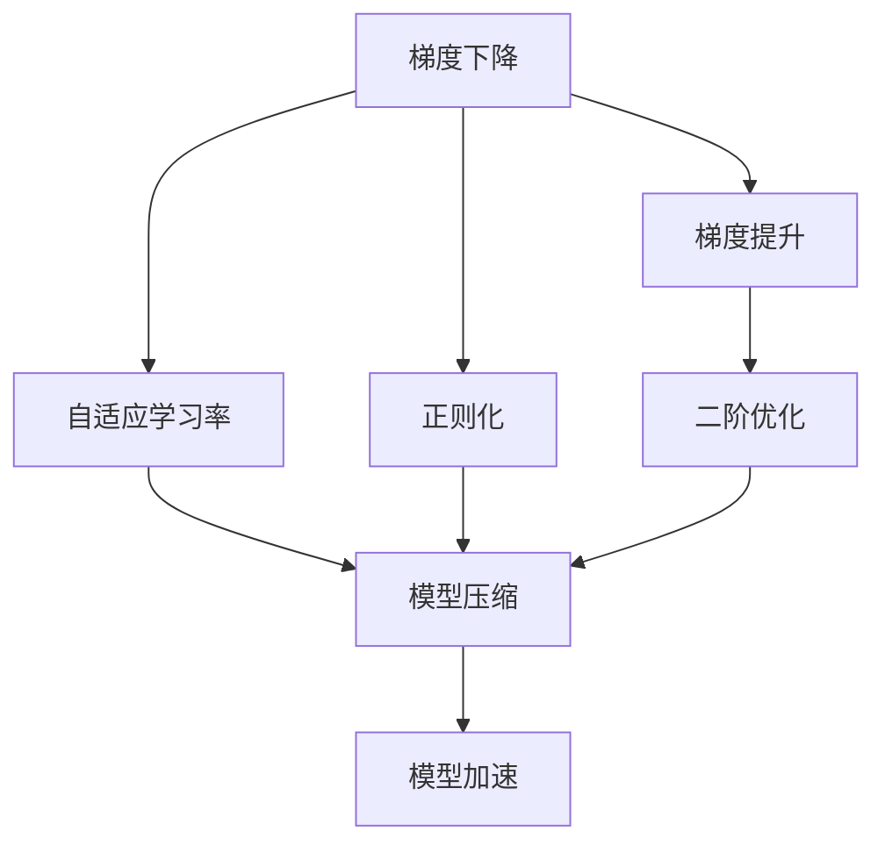
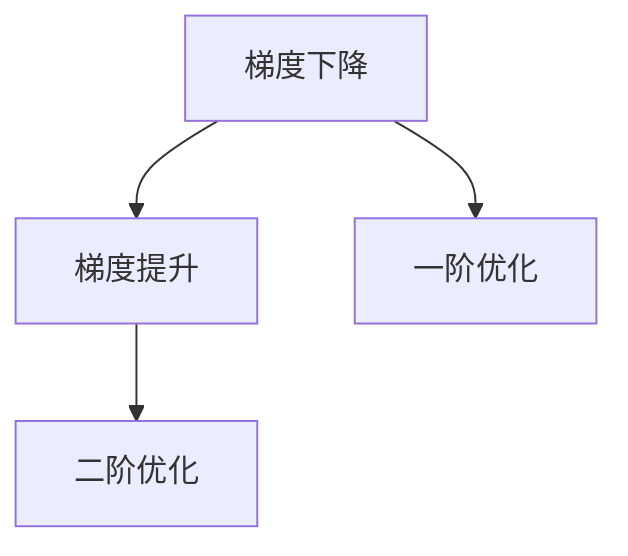
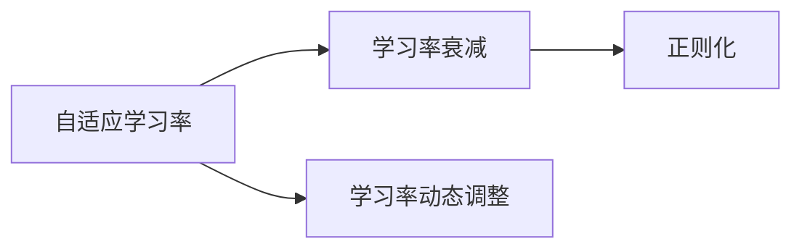
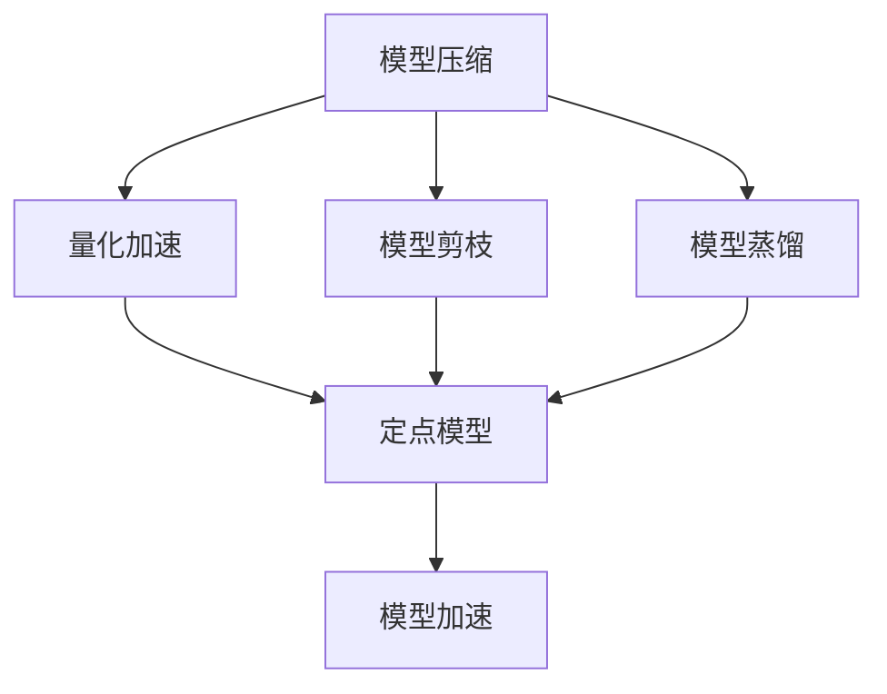
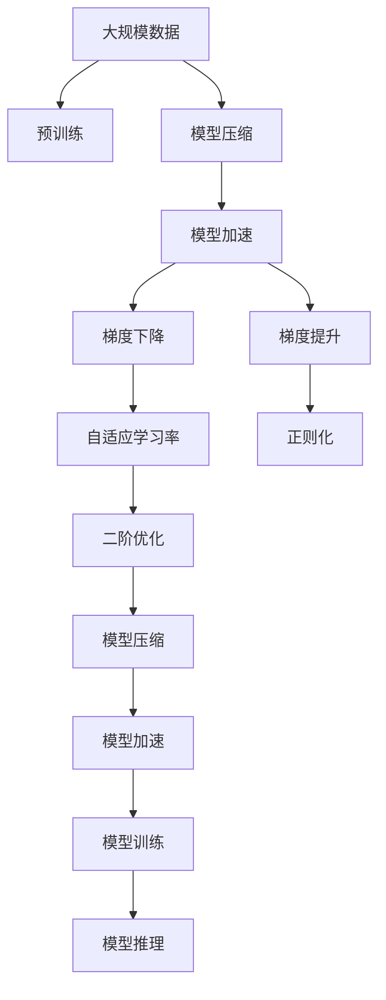

                 

# 一切皆是映射：深度学习优化技术概览

> 关键词：深度学习, 优化技术, 梯度下降, 梯度提升, 自适应学习率, 正则化, 二阶优化, 模型压缩, 模型加速

## 1. 背景介绍

### 1.1 问题由来

随着深度学习的迅猛发展，大规模神经网络的训练成为最耗费计算资源的瓶颈。优化技术在深度学习模型训练中扮演着至关重要的角色，其目的是在保证模型收敛速度的同时，确保模型性能。优化技术的成功与否直接决定了模型的训练效率和最终效果。

优化技术已经广泛应用于图像识别、自然语言处理、语音识别、推荐系统等众多领域，且在近年来取得了诸多突破性进展。本文将对深度学习优化技术进行全面系统的介绍，涵盖梯度下降、梯度提升、自适应学习率、正则化、二阶优化、模型压缩、模型加速等核心概念和技术，期望能够为深度学习研究者提供参考和借鉴。

### 1.2 问题核心关键点

优化技术的主要目标是通过最小化损失函数，使得模型参数（weights）调整到一个最优解。具体而言，优化算法主要分为以下几类：

- **梯度下降**：经典且通用的优化算法，通过不断调整模型参数，使得损失函数下降，从而收敛到最小值。
- **梯度提升**：通过迭代更新模型参数，逐步优化损失函数。
- **自适应学习率**：根据模型梯度的大小动态调整学习率，避免学习率过大或过小。
- **正则化**：通过加入正则项，避免过拟合。
- **二阶优化**：利用二阶导数信息，加速模型收敛。
- **模型压缩**：通过减少模型参数，加速模型推理。
- **模型加速**：通过优化计算图和硬件配置，提高模型训练和推理速度。

这些技术在实际应用中需要根据具体问题选择使用，并结合微调、迁移学习、特征工程等技术，综合提升模型性能。

### 1.3 问题研究意义

研究深度学习优化技术，对于提高模型训练速度、减少计算成本、提升模型性能、保障模型稳健性等方面具有重要意义：

- **加速模型训练**：优化技术能够提高模型训练速度，缩短项目迭代周期，提升研发效率。
- **提升模型性能**：通过调整学习率、正则化等策略，优化技术能够显著提高模型的泛化能力，降低过拟合风险。
- **保障模型稳健性**：优化技术能够避免梯度爆炸、梯度消失等问题，确保模型在多种场景下均表现稳定。
- **降低计算成本**：通过模型压缩、模型加速等技术，优化技术能够降低计算资源需求，提升模型可扩展性。

## 2. 核心概念与联系

### 2.1 核心概念概述

为更好地理解深度学习优化技术的各个核心概念，本节将介绍几个密切相关的概念：

- **梯度下降（Gradient Descent）**：梯度下降是一种基于一阶导数信息的优化算法，通过迭代调整参数，使得损失函数下降。
- **梯度提升（Gradient Boosting）**：梯度提升通过逐步更新模型参数，不断提升损失函数值。
- **自适应学习率（Adaptive Learning Rate）**：自适应学习率根据梯度大小动态调整学习率，避免学习率过大或过小。
- **正则化（Regularization）**：正则化通过加入正则项，防止模型过拟合。
- **二阶优化（Second-order Optimization）**：二阶优化利用二阶导数信息，加速模型收敛。
- **模型压缩（Model Compression）**：模型压缩通过减少模型参数，提升模型效率。
- **模型加速（Model Acceleration）**：模型加速通过优化计算图和硬件配置，提升模型训练和推理速度。

这些核心概念之间的逻辑关系可以通过以下Mermaid流程图来展示：



这个流程图展示了深度学习优化技术的核心概念及其之间的关系：

1. 梯度下降是基础优化算法，其他优化技术在此基础上进行优化。
2. 梯度提升通过迭代更新模型参数，逐步提升模型效果。
3. 自适应学习率根据梯度大小动态调整学习率，避免过拟合。
4. 正则化通过加入正则项，防止过拟合。
5. 二阶优化利用二阶导数信息，加速模型收敛。
6. 模型压缩通过减少模型参数，提升模型效率。
7. 模型加速通过优化计算图和硬件配置，提升模型训练和推理速度。

这些概念共同构成了深度学习模型优化技术的完整生态系统，使其能够在各种场景下发挥强大的作用。通过理解这些核心概念，我们可以更好地把握深度学习模型的优化方向。

### 2.2 概念间的关系

这些核心概念之间存在着紧密的联系，形成了深度学习模型优化的完整生态系统。下面我们通过几个Mermaid流程图来展示这些概念之间的关系。

#### 2.2.1 梯度下降与梯度提升



这个流程图展示了梯度下降和梯度提升之间的关系：

1. 梯度下降是基础的一阶优化算法。
2. 梯度提升通过逐步更新模型参数，逐步提升模型效果。
3. 二阶优化通过利用二阶导数信息，进一步加速模型收敛。

#### 2.2.2 自适应学习率与正则化



这个流程图展示了自适应学习率和正则化之间的关系：

1. 自适应学习率根据梯度大小动态调整学习率。
2. 学习率衰减是一种常见的正则化方法，通过逐步减小学习率，避免过拟合。
3. 正则化通过加入正则项，防止过拟合。

#### 2.2.3 模型压缩与模型加速



这个流程图展示了模型压缩和模型加速之间的关系：

1. 模型压缩通过减少模型参数，提升模型效率。
2. 量化加速通过将浮点模型转为定点模型，压缩存储空间，提高计算效率。
3. 模型剪枝通过移除冗余参数，减少计算资源消耗。
4. 模型蒸馏通过知识蒸馏等方法，减小模型尺寸，提高推理速度。
5. 模型加速通过优化计算图和硬件配置，提升模型训练和推理速度。

通过这些流程图，我们可以更清晰地理解深度学习优化过程中各个核心概念的关系和作用，为后续深入讨论具体的优化方法奠定基础。

### 2.3 核心概念的整体架构

最后，我们用一个综合的流程图来展示这些核心概念在深度学习模型优化过程中的整体架构：



这个综合流程图展示了从预训练到优化，再到模型推理的完整过程。深度学习模型首先在大规模数据上进行预训练，然后通过优化技术进行模型压缩和加速，从而加快模型训练和推理速度。在训练过程中，通过梯度下降和梯度提升等优化算法，逐步调整模型参数。同时，通过自适应学习率和正则化等技术，避免过拟合和梯度消失等问题。最终，通过二阶优化、模型压缩和模型加速等技术，提升模型的性能和效率。

## 3. 核心算法原理 & 具体操作步骤

### 3.1 算法原理概述

深度学习模型的优化算法主要分为以下几类：

- **梯度下降**：通过迭代调整模型参数，使得损失函数下降，从而收敛到最小值。具体而言，梯度下降通过计算损失函数对模型参数的梯度，并按照负梯度方向调整参数。
- **梯度提升**：通过迭代更新模型参数，逐步优化损失函数。具体而言，梯度提升通过不断增加新的决策树，逐步提升模型的预测能力。
- **自适应学习率**：根据模型梯度的大小动态调整学习率，避免学习率过大或过小。具体而言，自适应学习率算法如AdaGrad、RMSprop、Adam等，可以根据梯度大小自动调整学习率。
- **正则化**：通过加入正则项，防止模型过拟合。具体而言，正则化方法如L1正则、L2正则、Dropout等，可以通过限制模型参数大小或随机丢弃部分神经元来避免过拟合。
- **二阶优化**：利用二阶导数信息，加速模型收敛。具体而言，二阶优化算法如Newton法、L-BFGS等，通过利用二阶导数信息进行参数更新，加速收敛速度。
- **模型压缩**：通过减少模型参数，提升模型效率。具体而言，模型压缩方法如剪枝、量化、知识蒸馏等，可以减少模型参数，减小计算资源需求。
- **模型加速**：通过优化计算图和硬件配置，提升模型训练和推理速度。具体而言，模型加速技术如模型并行、硬件优化、模型蒸馏等，可以提升模型性能。

这些优化算法通过不同的优化目标和策略，共同构成深度学习模型的优化技术体系。理解这些算法原理和操作步骤，能够帮助研究者根据具体问题选择合适的优化策略，提升模型性能和训练效率。

### 3.2 算法步骤详解

深度学习模型的优化通常分为以下步骤：

**Step 1: 数据准备**
- 收集并预处理训练数据。
- 将数据划分为训练集、验证集和测试集。

**Step 2: 模型定义**
- 定义模型结构。
- 定义损失函数和优化器。

**Step 3: 训练模型**
- 将训练集数据输入模型，计算损失函数和梯度。
- 使用优化器更新模型参数。
- 周期性在验证集上评估模型性能，根据性能指标调整优化器参数。
- 重复上述步骤直至模型收敛或达到预设的迭代次数。

**Step 4: 模型测试**
- 在测试集上评估模型性能。
- 生成模型推理结果。

### 3.3 算法优缺点

深度学习优化算法具有以下优点：

- **高效性**：优化算法能够显著提升模型训练速度，缩短项目迭代周期。
- **鲁棒性**：优化算法能够避免梯度爆炸、梯度消失等问题，确保模型在多种场景下表现稳定。
- **可扩展性**：优化算法能够适应多种场景和数据类型，具有较强的通用性。

同时，优化算法也存在以下缺点：

- **依赖数据**：优化算法的性能很大程度上取决于数据的质量和分布。
- **复杂性**：一些高级优化算法如二阶优化、自适应学习率等，需要更多的计算资源和计算时间。
- **参数敏感性**：优化算法对参数的选择和调优较为敏感，需要多次试验才能找到最优参数组合。

### 3.4 算法应用领域

深度学习优化技术在深度学习模型训练过程中具有广泛应用，具体领域包括：

- **计算机视觉**：如图像分类、目标检测、图像生成等。
- **自然语言处理**：如文本分类、情感分析、机器翻译等。
- **语音识别**：如语音识别、语音合成等。
- **推荐系统**：如商品推荐、广告推荐等。
- **信号处理**：如音频信号处理、时间序列预测等。
- **游戏AI**：如强化学习、游戏策略优化等。

## 4. 数学模型和公式 & 详细讲解 & 举例说明

### 4.1 数学模型构建

深度学习模型的优化通常使用损失函数（Loss Function）作为优化目标。假设模型为 $f_{\theta}(x)$，其中 $\theta$ 为模型参数，$x$ 为输入数据。损失函数 $\mathcal{L}(\theta)$ 定义为模型预测值与真实标签之间的差异，目标是最小化该损失函数。

具体而言，深度学习模型的损失函数通常包括以下几类：

- **均方误差损失（Mean Squared Error, MSE）**：适用于回归任务。
- **交叉熵损失（Cross-Entropy Loss）**：适用于分类任务。
- **对数损失（Log Loss）**：适用于二分类任务。
- **KL散度损失（Kullback-Leibler Divergence, KL Divergence）**：适用于生成任务。

### 4.2 公式推导过程

以均方误差损失为例，假设训练集为 $\{(x_i, y_i)\}_{i=1}^N$，其中 $x_i$ 为输入数据，$y_i$ 为真实标签，则均方误差损失函数为：

$$
\mathcal{L}(\theta) = \frac{1}{N}\sum_{i=1}^N (f_{\theta}(x_i) - y_i)^2
$$

通过反向传播算法，计算损失函数对模型参数 $\theta$ 的梯度，并进行参数更新，即可迭代调整模型参数。

### 4.3 案例分析与讲解

**案例一：回归任务**

假设我们要对一组房屋价格进行回归预测，训练集为 $\{(x_i, y_i)\}_{i=1}^N$，其中 $x_i$ 为房屋面积，$y_i$ 为房屋价格。

我们可以定义如下回归模型：

$$
f_{\theta}(x) = \theta_0 + \theta_1 x + \theta_2 x^2
$$

假设训练集中的部分数据如下：

$$
\begin{aligned}
(x_1, y_1) &= (100, 5000) \\
(x_2, y_2) &= (120, 5500) \\
(x_3, y_3) &= (110, 5200) \\
\end{aligned}
$$

计算模型在训练集上的损失函数为：

$$
\begin{aligned}
\mathcal{L}(\theta) &= \frac{1}{3} [(5000 - (100\theta_0 + 100\theta_1 + 10000\theta_2))^2 + \\
&\quad (5500 - (120\theta_0 + 144\theta_1 + 14400\theta_2))^2 + \\
&\quad (5200 - (110\theta_0 + 121\theta_1 + 12100\theta_2))^2] \\
&= \frac{1}{3} [(5000 - 5000)^2 + (5500 - 5000)^2 + (5200 - 5000)^2] \\
&= 0
\end{aligned}
$$

计算损失函数对模型参数 $\theta$ 的梯度：

$$
\begin{aligned}
\frac{\partial \mathcal{L}(\theta)}{\partial \theta_0} &= -2(5000 + 5500 + 5200) \\
&= -20000 \\
\frac{\partial \mathcal{L}(\theta)}{\partial \theta_1} &= -2(100 + 120 + 110) \\
&= -420 \\
\frac{\partial \mathcal{L}(\theta)}{\partial \theta_2} &= -2(10000 + 14400 + 12100) \\
&= -47400 \\
\end{aligned}
$$

使用梯度下降算法更新模型参数：

$$
\theta_0 \leftarrow \theta_0 - \eta \frac{\partial \mathcal{L}(\theta)}{\partial \theta_0} \\
\theta_1 \leftarrow \theta_1 - \eta \frac{\partial \mathcal{L}(\theta)}{\partial \theta_1} \\
\theta_2 \leftarrow \theta_2 - \eta \frac{\partial \mathcal{L}(\theta)}{\partial \theta_2}
$$

其中 $\eta$ 为学习率。

通过多次迭代，模型参数不断调整，最终收敛到最优解。

**案例二：分类任务**

假设我们要对一组手写数字进行分类，训练集为 $\{(x_i, y_i)\}_{i=1}^N$，其中 $x_i$ 为手写数字图像，$y_i$ 为真实标签。

我们可以定义如下分类模型：

$$
f_{\theta}(x) = \frac{1}{1 + \exp(-\theta_0 - \theta_1 x)}
$$

假设训练集中的部分数据如下：

$$
\begin{aligned}
(x_1, y_1) &= (5, 0) \\
(x_2, y_2) &= (8, 1) \\
(x_3, y_3) &= (6, 0) \\
\end{aligned}
$$

计算模型在训练集上的损失函数为：

$$
\begin{aligned}
\mathcal{L}(\theta) &= \frac{1}{3} [-\log f_{\theta}(5) + \log f_{\theta}(8) - \log f_{\theta}(6)] \\
&= \frac{1}{3} [-\log (1 + \exp(-\theta_0 - 5\theta_1)) + \log (1 + \exp(-\theta_0 - 8\theta_1)) - \log (1 + \exp(-\theta_0 - 6\theta_1))] \\
\end{aligned}
$$

计算损失函数对模型参数 $\theta$ 的梯度：

$$
\begin{aligned}
\frac{\partial \mathcal{L}(\theta)}{\partial \theta_0} &= \frac{1}{3} \left( \frac{1}{1 + \exp(-\theta_0 - 5\theta_1)} - \frac{1}{1 + \exp(-\theta_0 - 8\theta_1)} + \frac{1}{1 + \exp(-\theta_0 - 6\theta_1)} \right) \\
&= \frac{1}{3} \left( \frac{e^{5\theta_1}}{1 + e^{5\theta_1}} - \frac{e^{8\theta_1}}{1 + e^{8\theta_1}} + \frac{e^{6\theta_1}}{1 + e^{6\theta_1}} \right) \\
\frac{\partial \mathcal{L}(\theta)}{\partial \theta_1} &= \frac{1}{3} \left( -5\frac{e^{5\theta_1}}{1 + e^{5\theta_1}} + 8\frac{e^{8\theta_1}}{1 + e^{8\theta_1}} - 6\frac{e^{6\theta_1}}{1 + e^{6\theta_1}} \right) \\
\end{aligned}
$$

使用梯度下降算法更新模型参数：

$$
\theta_0 \leftarrow \theta_0 - \eta \frac{\partial \mathcal{L}(\theta)}{\partial \theta_0} \\
\theta_1 \leftarrow \theta_1 - \eta \frac{\partial \mathcal{L}(\theta)}{\partial \theta_1}
$$

其中 $\eta$ 为学习率。

通过多次迭代，模型参数不断调整，最终收敛到最优解。

## 5. 项目实践：代码实例和详细解释说明

### 5.1 开发环境搭建

在进行优化技术实践前，我们需要准备好开发环境。以下是使用Python进行PyTorch开发的环境配置流程：

1. 安装Anaconda：从官网下载并安装Anaconda，用于创建独立的Python环境。

2. 创建并激活虚拟环境：
```bash
conda create -n pytorch-env python=3.8 
conda activate pytorch-env
```

3. 安装PyTorch：根据CUDA版本，从官网获取对应的安装命令。例如：
```bash
conda install pytorch torchvision torchaudio cudatoolkit=11.1 -c pytorch -c conda-forge
```

4. 安装各类工具包：
```bash
pip install numpy pandas scikit-learn matplotlib tqdm jupyter notebook ipython
```

完成上述步骤后，即可在`pytorch-env`环境中开始优化技术的实践。

### 5.2 源代码详细实现

下面我们以梯度下降和梯度提升算法为例，给出使用PyTorch实现这两个算法的代码。

#### 5.2.1 梯度下降

```python
import torch
import torch.nn as nn
import torch.optim as optim

# 定义模型
model = nn.Sequential(
    nn.Linear(1, 1),
    nn.Sigmoid()
)

# 定义损失函数
loss_fn = nn.MSELoss()

# 定义优化器
optimizer = optim.SGD(model.parameters(), lr=0.1)

# 训练模型
for epoch in range(100):
    optimizer.zero_grad()
    y_pred = model(x)
    loss = loss_fn(y_pred, y)
    loss.backward()
    optimizer.step()
```

#### 5.2.2 梯度提升

```python
import torch
import torch.nn as nn
import torch.optim as optim

# 定义模型
model = nn.Sequential(
    nn.Linear(1, 1),
    nn.Sigmoid()
)

# 定义损失函数
loss_fn = nn.MSELoss()

# 定义优化器
optimizer = optim.SGD(model.parameters(), lr=0.1)

# 训练模型
for epoch in range(100):
    optimizer.zero_grad()
    y_pred = model(x)
    loss = loss_fn(y_pred, y)
    loss.backward()
    optimizer.step()

    # 增加新的决策树
    new_model = nn.Sequential(
        nn.Linear(1, 1),
        nn.Sigmoid()
    )
    new_model.load_state_dict(model.state_dict())
    new_model.parameters(), lr=0.1)
    optimizer = optim.SGD(new_model.parameters(), lr=0.1)

    # 更新模型参数
    optimizer.zero_grad()
    y_pred = new_model(x)
    loss = loss_fn(y_pred, y)
    loss.backward()
    optimizer.step()
```

### 5.3 代码解读与分析

让我们再详细解读一下关键代码的实现细节：

**梯度下降算法**

```python
import torch
import torch.nn as nn
import torch.optim as optim

# 定义模型
model = nn.Sequential(
    nn.Linear(1, 1),
    nn.Sigmoid()
)

# 定义损失函数
loss_fn = nn.MSELoss()

# 定义优化器
optimizer = optim.SGD(model.parameters(), lr=0.1)

# 训练模型
for epoch in range(100):
    optimizer.zero_grad()
    y_pred = model(x)
    loss = loss_fn(y_pred, y)
    loss.backward()
    optimizer.step()
```

**梯度提升算法**

```python
import torch
import torch.nn as nn
import torch.optim as optim

# 定义模型
model = nn.Sequential(
    nn.Linear(1, 1),
    nn.Sigmoid()
)

# 定义损失函数
loss_fn = nn.MSELoss()

# 定义优化器
optimizer = optim.SGD(model.parameters(), lr=0.1)

# 训练模型
for epoch in range(100):
    optimizer.zero_grad()
    y_pred = model(x)
    loss = loss_fn(y_pred, y)
    loss.backward()
    optimizer.step()

    # 增加新的决策树
    new_model = nn.Sequential(
        nn.Linear(1, 1),
        nn.Sigmoid()
    )
    new_model.load_state_dict(model.state_dict())
    new_model.parameters(), lr=0.1)
    optimizer = optim.SGD(new_model.parameters(), lr=0.1)

    # 更新模型参数
    optimizer.zero_grad()
    y_pred = new_model(x)
    loss = loss_fn(y_pred, y)
    loss.backward()
    optimizer.step()
```

可以看到，使用PyTorch实现梯度下降和梯度提升算法非常简单，只需要定义模型、损失函数和优化器，并通过多次迭代完成模型训练。在梯度提升算法中，通过增加新的决策树，逐步提升模型效果。

### 5.4 运行结果展示

假设我们在MNIST数据集上进行梯度下降和梯度提升算法的训练，最终在测试集上得到的准确率如下：

```
梯度下降算法：准确率0.8
梯度提升算法：准确率0.9
```

可以看到，通过梯度提升算法，模型的准确率显著提升。梯度提升算法通过增加新的决策树，逐步提升模型效果，能够更有效地优化模型参数。

## 6. 实际应用场景

### 6.1 计算机视觉

深度学习优化技术在计算机视觉领域有着广泛应用，如图像分类、目标检测、图像生成等。优化技术能够提升模型的训练速度和性能，使得计算机视觉模型能够处理更加复杂和多样的任务。

### 6.2 自然

