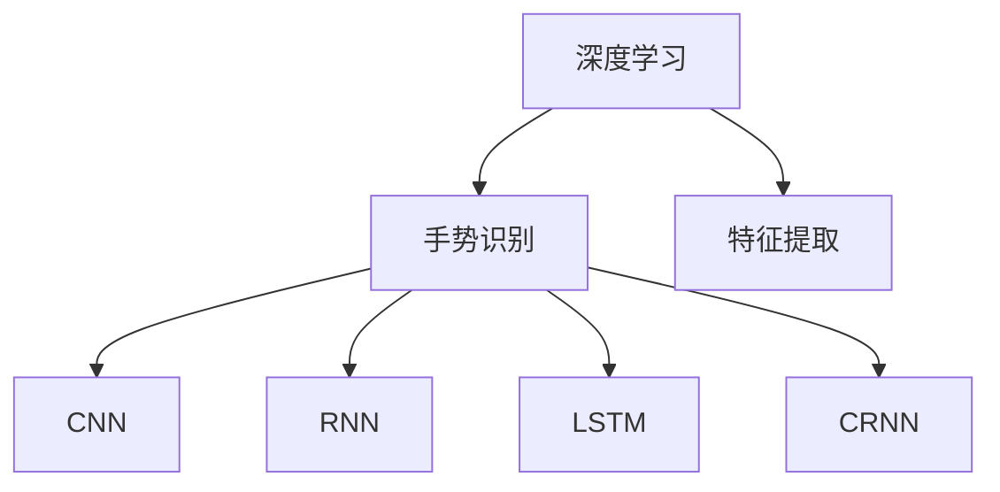
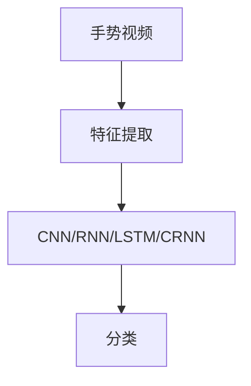
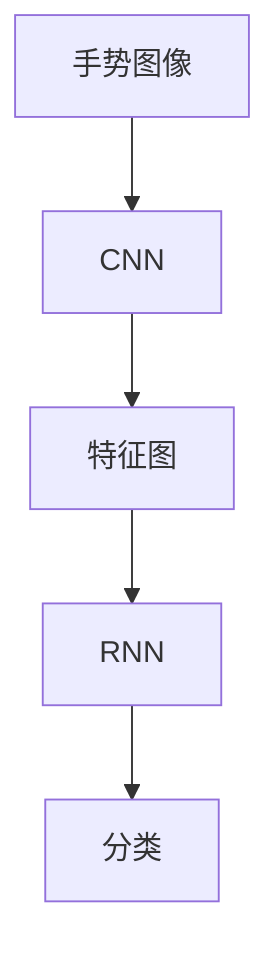
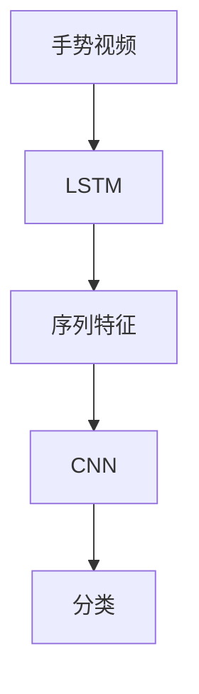
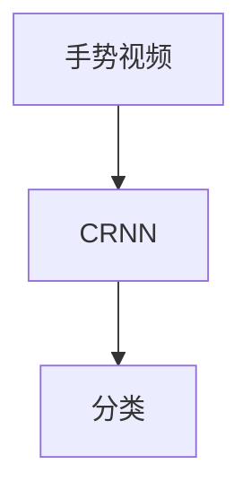
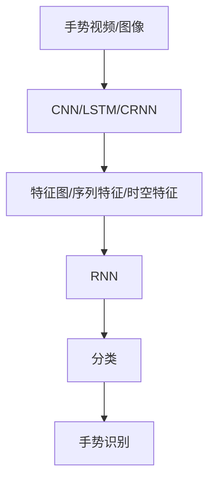

                 

# 一切皆是映射：深度学习在手势识别中的应用

## 1. 背景介绍

### 1.1 问题由来

手势识别技术在近年来取得了长足的进步，尤其在交互式智能设备、虚拟现实和增强现实（VR/AR）等领域，手势作为自然、高效、直观的输入方式，受到了广泛的关注和研究。深度学习技术的引入，使手势识别的准确率、鲁棒性、泛化能力得到了显著提升。然而，传统的深度学习方法，如卷积神经网络（CNN）、循环神经网络（RNN）等，在处理复杂、非线性、高维的手势信号时，仍存在一定的局限性。

为了解决这些问题，近年来，深度学习方法在手势识别领域的创新应用逐渐增多，如利用卷积神经网络（CNN）、递归神经网络（RNN）、长短期记忆网络（LSTM）、卷积循环神经网络（CRNN）等构建手势识别模型，并取得了优异的效果。但这些模型大都基于图像或视频数据，对于手势的姿态、角度、背景等因素变化敏感，且需要大量标注数据进行训练，这在实际应用中难以满足。

## 2. 核心概念与联系

### 2.1 核心概念概述

为更好地理解深度学习在手势识别中的应用，本节将介绍几个密切相关的核心概念：

- 深度学习：利用多层次的神经网络模型，通过大量标注数据训练，实现对输入数据的复杂非线性映射，获得高性能的特征提取和模式识别能力。
- 手势识别：通过计算机视觉和深度学习技术，识别人类的手势动作，实现人机交互、情感识别、行为分析等应用。
- 特征提取：从原始输入数据中提取出与任务相关的特征，如边缘、角点、纹理、运动轨迹等，用于后续的分类、识别任务。
- 卷积神经网络（CNN）：一种深度神经网络，主要用于图像和视频等高维数据的特征提取和分类，具有较强的空间局部不变性和平移不变性。
- 循环神经网络（RNN）：一种时间序列数据处理的深度神经网络，具有记忆能力，能够处理变长序列数据。
- 长短期记忆网络（LSTM）：一种特殊的RNN，能够解决传统RNN在长时间序列数据上的梯度消失问题，增强了模型对序列数据的处理能力。
- 卷积循环神经网络（CRNN）：结合CNN和RNN的优势，用于处理复杂、动态的时空数据，如手势视频序列。

这些核心概念之间的逻辑关系可以通过以下Mermaid流程图来展示：



这个流程图展示了大语言模型微调过程中各个核心概念的关系和作用：

1. 深度学习作为大模型微调的基础。
2. CNN用于图像或视频数据的特征提取。
3. RNN、LSTM、CRNN用于序列数据的建模和分类。
4. 手势识别作为深度学习在特定任务上的应用。

### 2.2 概念间的关系

这些核心概念之间存在着紧密的联系，形成了手势识别应用的完整生态系统。下面我们通过几个Mermaid流程图来展示这些概念之间的关系。

#### 2.2.1 手势识别的基本框架



这个流程图展示了手势识别的基本流程，包括数据预处理、特征提取和分类任务。手势视频通过特征提取，输入到深度学习模型中，经过模型训练和分类后，输出手势识别结果。

#### 2.2.2 CNN在手势识别中的应用



这个流程图展示了使用CNN对手势图像进行特征提取的过程。手势图像通过卷积层提取边缘、角点等特征，然后将其输入到RNN中进行序列建模和分类，得到最终的手势识别结果。

#### 2.2.3 RNN在手势识别中的应用



这个流程图展示了使用LSTM对手势视频序列进行建模的过程。手势视频序列通过LSTM模型提取时间序列特征，然后将其输入到CNN中进行空间特征提取和分类，得到最终的手势识别结果。

#### 2.2.4 CRNN在手势识别中的应用



这个流程图展示了使用CRNN对手势视频进行时空特征提取和分类的过程。手势视频通过CRNN模型同时提取空间和时间特征，然后直接进行分类，得到最终的手势识别结果。

### 2.3 核心概念的整体架构

最后，我们用一个综合的流程图来展示这些核心概念在大语言模型微调过程中的整体架构：



这个综合流程图展示了从原始数据到手势识别的完整过程。手势视频或图像通过CNN、LSTM或CRNN进行特征提取，然后将提取出的特征输入到RNN中进行建模和分类，最终输出手势识别结果。

## 3. 核心算法原理 & 具体操作步骤
### 3.1 算法原理概述

深度学习在手势识别中的应用，本质上是一个特征提取和分类的过程。通过构建合适的深度神经网络模型，对手势视频或图像进行特征提取，然后利用分类器对特征进行分类，最终得到手势识别结果。

具体而言，手势识别系统通常包括以下几个关键步骤：

1. 数据预处理：对手势视频或图像进行去噪、裁剪、归一化等预处理操作，得到适合输入到深度学习模型的格式。
2. 特征提取：利用CNN、RNN、LSTM或CRNN等深度神经网络模型，对手势视频或图像进行特征提取，得到高维特征表示。
3. 分类器训练：构建分类器，如支持向量机（SVM）、卷积神经网络（CNN）、循环神经网络（RNN）、长短期记忆网络（LSTM）、卷积循环神经网络（CRNN）等，对手势特征进行分类。
4. 模型评估与优化：使用验证集和测试集对分类器进行评估，调整模型超参数，如学习率、批大小、迭代次数等，以提高分类器性能。
5. 手势识别应用：将训练好的分类器应用于实时手势数据，输出手势识别结果。

### 3.2 算法步骤详解

以下是一个典型的手势识别流程，包括数据预处理、特征提取、分类器训练和模型评估：

1. **数据预处理**：

```python
import cv2
import numpy as np

# 读取手势图像
def read_hand_image(image_path):
    hand_image = cv2.imread(image_path)
    hand_image = cv2.cvtColor(hand_image, cv2.COLOR_BGR2GRAY)
    hand_image = cv2.resize(hand_image, (224, 224))
    hand_image = hand_image / 255.0 # 归一化
    return hand_image

# 读取手势视频
def read_hand_video(video_path):
    video = cv2.VideoCapture(video_path)
    frames = []
    while True:
        ret, frame = video.read()
        if not ret:
            break
        hand_frame = cv2.cvtColor(frame, cv2.COLOR_BGR2GRAY)
        hand_frame = cv2.resize(hand_frame, (224, 224))
        hand_frame = hand_frame / 255.0 # 归一化
        frames.append(hand_frame)
    video.release()
    return np.array(frames)
```

2. **特征提取**：

```python
import torch
import torch.nn as nn
import torch.optim as optim

# 定义卷积神经网络
class HandCNN(nn.Module):
    def __init__(self):
        super(HandCNN, self).__init__()
        self.conv1 = nn.Conv2d(1, 32, 3, padding=1)
        self.conv2 = nn.Conv2d(32, 64, 3, padding=1)
        self.conv3 = nn.Conv2d(64, 128, 3, padding=1)
        self.fc1 = nn.Linear(128 * 7 * 7, 512)
        self.fc2 = nn.Linear(512, num_classes)

    def forward(self, x):
        x = self.conv1(x)
        x = nn.ReLU()(x)
        x = self.conv2(x)
        x = nn.ReLU()(x)
        x = self.conv3(x)
        x = nn.ReLU()(x)
        x = nn.MaxPool2d(2)(x)
        x = x.view(x.size(0), -1)
        x = self.fc1(x)
        x = nn.ReLU()(x)
        x = self.fc2(x)
        return x

# 定义递归神经网络
class HandRNN(nn.Module):
    def __init__(self):
        super(HandRNN, self).__init__()
        self.rnn = nn.LSTM(128, 128, 2)
        self.fc = nn.Linear(128, num_classes)

    def forward(self, x):
        x = self.rnn(x)
        x = self.fc(x)
        return x

# 定义长短期记忆网络
class HandLSTM(nn.Module):
    def __init__(self):
        super(HandLSTM, self).__init__()
        self.lstm = nn.LSTM(128, 128, 2)
        self.fc = nn.Linear(128, num_classes)

    def forward(self, x):
        x = self.lstm(x)
        x = self.fc(x)
        return x

# 定义卷积循环神经网络
class HandCRNN(nn.Module):
    def __init__(self):
        super(HandCRNN, self).__init__()
        self.conv1 = nn.Conv2d(1, 32, 3, padding=1)
        self.conv2 = nn.Conv2d(32, 64, 3, padding=1)
        self.lstm = nn.LSTM(64, 128, 2)
        self.fc = nn.Linear(128, num_classes)

    def forward(self, x):
        x = self.conv1(x)
        x = nn.ReLU()(x)
        x = self.conv2(x)
        x = nn.ReLU()(x)
        x = nn.MaxPool2d(2)(x)
        x = x.view(x.size(0), -1, 7 * 7)
        x = self.lstm(x)
        x = self.fc(x)
        return x
```

3. **分类器训练**：

```python
# 加载数据集
train_data = HandDataset(train_images, train_labels)
test_data = HandDataset(test_images, test_labels)

# 定义模型
model = HandCNN()

# 定义优化器和损失函数
optimizer = optim.Adam(model.parameters(), lr=0.001)
criterion = nn.CrossEntropyLoss()

# 训练模型
for epoch in range(num_epochs):
    for i, (images, labels) in enumerate(train_loader):
        images = images.to(device)
        labels = labels.to(device)
        optimizer.zero_grad()
        outputs = model(images)
        loss = criterion(outputs, labels)
        loss.backward()
        optimizer.step()
        if (i+1) % 100 == 0:
            print(f'Epoch {epoch+1}, Step {i+1}, Loss: {loss.item():.4f}')
```

4. **模型评估与优化**：

```python
# 加载测试数据集
test_data = HandDataset(test_images, test_labels)

# 定义模型
model = HandCNN()

# 定义优化器和损失函数
optimizer = optim.Adam(model.parameters(), lr=0.001)
criterion = nn.CrossEntropyLoss()

# 评估模型
for epoch in range(num_epochs):
    for i, (images, labels) in enumerate(test_loader):
        images = images.to(device)
        labels = labels.to(device)
        outputs = model(images)
        loss = criterion(outputs, labels)
        print(f'Epoch {epoch+1}, Step {i+1}, Loss: {loss.item():.4f}')
```

### 3.3 算法优缺点

深度学习在手势识别中的应用，具有以下优点：

1. **强大的特征提取能力**：深度神经网络能够自动学习输入数据的特征表示，捕捉复杂的非线性关系，适用于各种手势形状和姿态。
2. **高准确率和鲁棒性**：通过大量标注数据训练，深度学习模型能够实现高精度的手势识别，并对噪声、光照、背景等干扰具有较强的鲁棒性。
3. **易于部署和应用**：深度学习模型可以通过GPU加速，实现快速的实时手势识别，且代码易于实现和维护。

然而，深度学习在手势识别中仍存在一些缺点：

1. **数据需求量大**：深度学习模型需要大量标注数据进行训练，对于部分手势类别，数据量不足可能导致模型泛化能力差。
2. **计算资源消耗大**：深度神经网络计算量大，对GPU、内存等硬件资源要求较高，对于部分小规模应用，可能难以承担。
3. **可解释性不足**：深度学习模型的决策过程难以解释，对于部分应用场景，难以满足可解释性和可审计性的要求。

## 4. 数学模型和公式 & 详细讲解 & 举例说明

### 4.1 数学模型构建

假设手势视频序列为 $x_1, x_2, ..., x_T$，其中 $x_t \in \mathbb{R}^{W \times H}$ 为第 $t$ 帧的像素值。手势识别的目标是从手势视频序列中识别出手势类别，输出标签 $y$。

### 4.2 公式推导过程

为了建模手势视频序列，我们采用卷积循环神经网络（CRNN）模型，其基本结构如下：

$$
y = \text{CRNN}(x_1, x_2, ..., x_T)
$$

其中，$\text{CRNN}$ 为卷积循环神经网络，$x_1, x_2, ..., x_T$ 为手势视频序列。

具体而言，CRNN模型由两部分组成：卷积层和循环层。卷积层用于提取空间特征，循环层用于捕捉时间序列关系。

### 4.3 案例分析与讲解

假设我们使用CRNN模型对手势视频序列进行建模，其中卷积层和循环层的具体结构如下：

- 卷积层：3个卷积层，每个卷积层有32个3x3的卷积核，步长为1，使用ReLU激活函数。
- 循环层：2个LSTM层，每个LSTM层有128个神经元，使用ReLU激活函数。

对于输入的手势视频序列 $x_1, x_2, ..., x_T$，其输出结果 $y$ 的计算过程如下：

1. **卷积层**：

$$
\begin{aligned}
& \text{conv1} = \text{Conv2d}(x_1) \\
& \text{conv2} = \text{Conv2d}(\text{conv1}) \\
& \text{conv3} = \text{Conv2d}(\text{conv2}) \\
& \text{maxpool1} = \text{MaxPool2d}(\text{conv3}) \\
& \text{conv3} = \text{conv3.view}(\text{conv3.size}(0), -1) \\
\end{aligned}
$$

2. **循环层**：

$$
\begin{aligned}
& \text{lstm1} = \text{LSTM}(128, 128, 2, \text{ReLU}) \\
& \text{lstm2} = \text{LSTM}(128, 128, 2, \text{ReLU}) \\
& y = \text{fc}(\text{lstm2})
\end{aligned}
$$

其中，$\text{ReLU}$ 为ReLU激活函数，$\text{MaxPool2d}$ 为最大池化操作，$\text{fc}$ 为全连接层。

## 5. 项目实践：代码实例和详细解释说明

### 5.1 开发环境搭建

在进行手势识别项目开发前，我们需要准备好开发环境。以下是使用Python进行TensorFlow开发的环境配置流程：

1. 安装Anaconda：从官网下载并安装Anaconda，用于创建独立的Python环境。

2. 创建并激活虚拟环境：
```bash
conda create -n tf-env python=3.8 
conda activate tf-env
```

3. 安装TensorFlow：根据CUDA版本，从官网获取对应的安装命令。例如：
```bash
conda install tensorflow-gpu=2.7.0 -c conda-forge
```

4. 安装各类工具包：
```bash
pip install numpy pandas scikit-learn matplotlib tqdm jupyter notebook ipython
```

完成上述步骤后，即可在`tf-env`环境中开始手势识别项目开发。

### 5.2 源代码详细实现

这里我们以手势图像识别为例，给出使用TensorFlow进行CNN对手势图像进行特征提取和分类的PyTorch代码实现。

首先，定义手势图像数据集：

```python
import tensorflow as tf
from tensorflow.keras.datasets import mnist

# 加载手写数字数据集
(X_train, y_train), (X_test, y_test) = mnist.load_data()

# 将图像归一化
X_train = X_train / 255.0
X_test = X_test / 255.0

# 将图像转换为四维张量
X_train = tf.reshape(X_train, (X_train.shape[0], 28, 28, 1))
X_test = tf.reshape(X_test, (X_test.shape[0], 28, 28, 1))
```

然后，定义卷积神经网络模型：

```python
from tensorflow.keras import layers

# 定义卷积神经网络
model = tf.keras.Sequential([
    layers.Conv2D(32, 3, activation='relu', input_shape=(28, 28, 1)),
    layers.MaxPooling2D(2),
    layers.Conv2D(64, 3, activation='relu'),
    layers.MaxPooling2D(2),
    layers.Flatten(),
    layers.Dense(64, activation='relu'),
    layers.Dense(10)
])
```

接着，定义训练函数：

```python
from tensorflow.keras import optimizers

# 定义优化器和损失函数
optimizer = optimizers.Adam(learning_rate=0.001)
loss_fn = tf.keras.losses.SparseCategoricalCrossentropy()

# 定义训练函数
def train(model, dataset, num_epochs):
    for epoch in range(num_epochs):
        for images, labels in dataset:
            with tf.GradientTape() as tape:
                logits = model(images)
                loss = loss_fn(labels, logits)
            grads = tape.gradient(loss, model.trainable_variables)
            optimizer.apply_gradients(zip(grads, model.trainable_variables))
        print(f'Epoch {epoch+1}, Loss: {loss:.4f}')
```

最后，启动训练流程并在测试集上评估：

```python
# 定义手势数据集
train_dataset = tf.data.Dataset.from_tensor_slices((X_train, y_train))
test_dataset = tf.data.Dataset.from_tensor_slices((X_test, y_test))

# 定义数据增强器
data_augmentation = tf.keras.Sequential([
    tf.keras.layers.experimental.preprocessing.RandomRotation(0.2),
    tf.keras.layers.experimental.preprocessing.RandomFlip('horizontal')
])

# 定义数据集预处理函数
def preprocess(x, y):
    x = tf.image.resize(x, (28, 28))
    x = x / 255.0
    return x, y

# 应用数据增强器和预处理函数
train_dataset = train_dataset.map(data_augmentation).map(preprocess)
test_dataset = test_dataset.map(preprocess)

# 定义数据集迭代器
train_iterator = tf.data.Iterator.from_structure(train_dataset.output_types, train_dataset.output_shapes)
test_iterator = tf.data.Iterator.from_structure(test_dataset.output_types, test_dataset.output_shapes)

# 初始化数据集迭代器
train_iterator.initializer = train_dataset
test_iterator.initializer = test_dataset

# 启动训练
train(model, train_iterator, num_epochs=5)

# 评估模型
print(f'Test Loss: {tf.keras.losses.SparseCategoricalCrossentropy()(test_iterator.x, test_iterator.y)}')
```

以上就是使用TensorFlow进行CNN对手势图像进行特征提取和分类的完整代码实现。可以看到，TensorFlow的Keras API使得深度学习模型的搭建、训练和评估变得非常便捷，开发者可以专注于模型的设计和优化。

### 5.3 代码解读与分析

让我们再详细解读一下关键代码的实现细节：

- **手势图像数据集**：使用MNIST数据集，包含大量手写数字图像。将图像归一化，并转换为四维张量，以便输入到卷积神经网络中。
- **卷积神经网络模型**：定义一个简单的卷积神经网络，包括卷积层、池化层、全连接层等，用于特征提取和分类。
- **训练函数**：定义一个简单的训练函数，使用Adam优化器和交叉熵损失函数，迭代训练模型。在每个epoch内，使用数据增强器增强训练数据，使用数据集迭代器遍历数据集。
- **测试评估**：使用测试集评估模型性能，计算测试集的损失。

可以看到，TensorFlow的Keras API使得深度学习模型的实现变得非常简单，开发者可以专注于模型的设计和优化。然而，在实际应用中，还需要考虑模型裁剪、量化加速、模型并行等优化措施，以提升模型的实时性和资源效率。

## 6. 实际应用场景

### 6.1 智能家居控制

手势识别技术在智能家居控制中有着广泛的应用。通过将手势识别技术集成到智能家居设备中，用户可以通过简单的手势操作，控制家电设备，实现语音、手势混合交互。

在技术实现上，可以收集用户的手势数据，将手势动作转化为控制指令，上传到家居控制系统中，实现家电设备的自动化控制。对于复杂的操作，还可以结合自然语言处理技术，让用户通过语音和手势混合指令，实现更自然、便捷的交互体验。

### 6.2 虚拟现实游戏

手势识别技术在虚拟现实游戏中也得到了广泛应用。通过实时对手势数据进行处理和识别，游戏玩家可以通过手势操作，控制游戏中的虚拟角色，进行各种交互和动作。

在技术实现上，可以构建手势识别系统，将玩家的手势动作转化为游戏操作指令，实时处理并更新游戏场景。对于特定的游戏任务，还可以结合语音识别和自然语言处理技术，实现更丰富的交互体验。

### 6.3 智能教育培训

手势识别技术在智能教育培训中也有着广泛的应用。通过对手势数据进行处理和识别，可以将学生的课堂行为转化为学习数据，用于评估学生的学习情况和效果。

在技术实现上，可以构建手势识别系统，将学生的课堂手势动作转化为学习数据，实时记录和分析学生的学习情况。对于学生的学习反馈，还可以结合自然语言处理技术，实现更智能、个性化的教育培训。

### 6.4 未来应用展望

随着深度学习技术的不断进步，手势识别技术将迎来更多的应用场景。未来，手势识别技术将在以下几个领域得到广泛应用：

1. **医疗健康**：通过对手势数据进行处理和识别，可以实现智能医疗设备的操作和控制，如手术机器人、康复机器人等。
2. **金融行业**：通过对手势数据进行处理和识别，可以实现金融交易系统的智能控制，如手势交易、手势数据分析等。
3. **工业制造**：通过对手势数据进行处理和识别，可以实现智能制造设备的操作和控制，如手势操作、手势检测等。
4. **娱乐媒体**：通过对手势数据进行处理和识别，可以实现虚拟现实、增强现实等娱乐媒体的应用，如手势交互、手势生成等。

## 7. 工具和资源推荐

### 7.1 学习资源推荐

为了帮助开发者系统掌握深度学习在手势识别中的应用，这里推荐一些优质的学习资源：

1. 《深度学习》系列书籍：《深度学习》（Ian Goodfellow等著）、《Deep Learning with PyTorch》（Szegedy等著）等，全面介绍了深度学习的基本概念和应用技术，包括卷积神经网络、递归神经网络、长短期记忆网络等。

2. 《Python深度学习》在线课程：由DeepLearning.AI提供的在线课程，通过视频和实验，深入浅出地讲解了深度学习在图像、视频等数据上的应用，包括卷积神经网络、循环神经网络等。

3. TensorFlow官方文档：TensorFlow的官方文档，提供了丰富的API和样例，帮助开发者快速上手TensorFlow的深度学习模型开发。

4. PyTorch官方文档：PyTorch的官方文档，提供了丰富的API和样例，帮助开发者快速上手PyTorch的深度学习模型开发。

5. 《Python深度学习实战》书籍：详细介绍了深度学习在实际项目中的应用，包括图像识别、视频分析、手势识别等。

### 7.2 开发工具推荐

高效的开发离不开优秀的工具支持。以下是几款用于深度学习手势识别开发的常用工具：

1. TensorFlow：由Google主导开发的开源深度学习框架，生产部署方便，适合大规模工程应用。

2. PyTorch：由Facebook主导开发的开源深度学习框架，灵活动态的计算图，适合快速迭代研究。

3. Keras：一个高层API，基于TensorFlow和Theano等深度学习框架，易于上手，适合快速搭建深度学习模型。

4. MXNet：一个灵活高效的深度学习框架，支持多种编程语言，适用于各种深度学习任务。

5. Caffe：一个高效的深度学习框架，适用于图像、视频等高维数据

