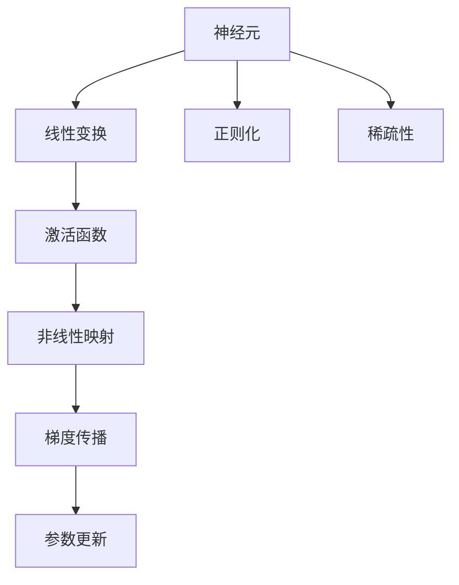
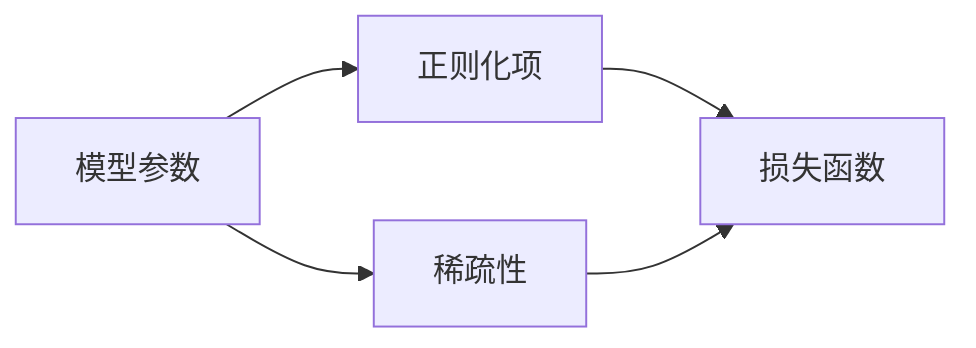
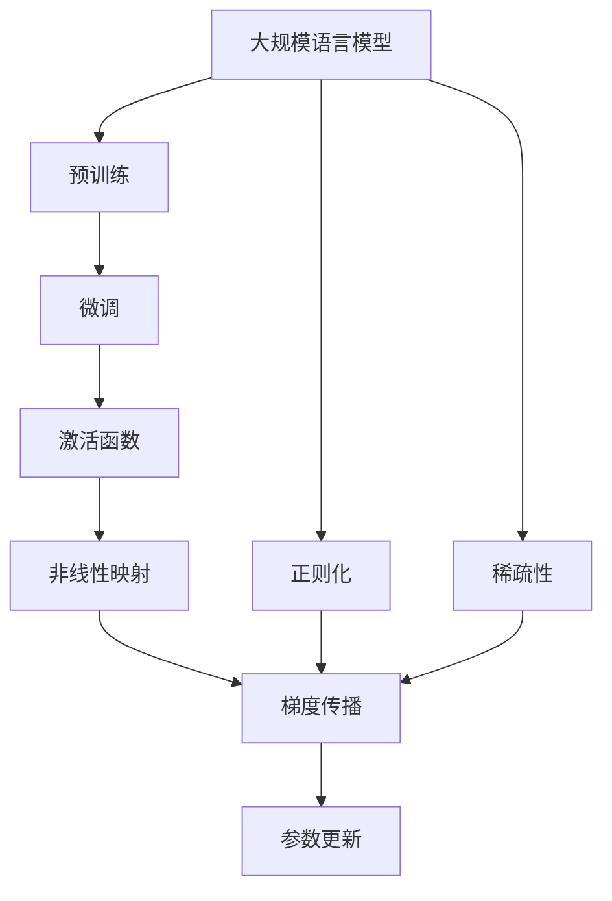

                 

# 一切皆是映射：神经网络中的激活函数深度解析

在深度学习模型中，激活函数是连接神经元层的桥梁，负责将前一层的输出进行非线性映射，赋予模型更强的表达能力。激活函数的作用不仅仅是将神经元的线性输出映射到非线性空间，还在于优化模型的计算性能和避免梯度消失或爆炸等现象。本文将深入探讨激活函数的工作原理、优化算法、选择策略以及应用场景，全面解析其背后的数学原理和技术细节。

## 1. 背景介绍

### 1.1 问题由来
神经网络作为深度学习中的核心模型，其关键组件包括权重、偏置和激活函数。权重和偏置在模型训练中通过反向传播算法不断更新，而激活函数则负责将神经元的线性输出转化为非线性输出。激活函数的性能直接影响到神经网络的表达能力和训练效率，因此其设计与选择至关重要。

### 1.2 问题核心关键点
激活函数的主要作用包括：
1. **非线性映射**：将输入数据从线性空间映射到非线性空间，增强模型的表达能力。
2. **计算性能优化**：选择合适的激活函数可以加速模型的计算，减少内存占用和提高训练效率。
3. **梯度传播稳定性**：避免梯度消失或爆炸，保证模型训练的稳定性和收敛性。
4. **鲁棒性**：提高模型对噪声和异常数据的鲁棒性，提升模型的泛化能力。

### 1.3 问题研究意义
研究激活函数的原理和优化方法，对于设计高效、稳定的神经网络模型，提升模型的泛化能力和训练效率，具有重要的理论和实践意义。通过深入理解激活函数的特性，可以更好地选择和使用激活函数，优化模型性能，加速模型训练，实现更高效、更鲁棒的人工智能应用。

## 2. 核心概念与联系

### 2.1 核心概念概述

为更好地理解激活函数的工作原理和优化方法，本节将介绍几个密切相关的核心概念：

- **神经元**：神经网络中的基本处理单元，负责接收输入信号、进行加权和并激活输出。
- **线性变换**：神经元的加权和过程，可以看作是将输入数据映射到一个线性空间。
- **非线性映射**：激活函数负责将线性变换的结果映射到非线性空间，增强模型的表达能力。
- **梯度传播**：反向传播算法通过计算激活函数的导数，实现参数的更新和优化。
- **正则化**：通过限制激活函数的范数，避免过拟合，提升模型的泛化能力。
- **稀疏性**：某些激活函数能够增加模型的稀疏性，减少冗余参数。

这些核心概念之间的逻辑关系可以通过以下Mermaid流程图来展示：



这个流程图展示了大规模语言模型微调过程中各个关键概念的关系：

1. 神经元接收输入信号，通过加权和进行线性变换。
2. 激活函数将线性变换的结果进行非线性映射。
3. 梯度传播算法通过计算激活函数的导数，实现参数的更新和优化。
4. 正则化方法限制激活函数的范数，避免过拟合。
5. 稀疏性增加模型参数的稀疏性，减少冗余。

### 2.2 概念间的关系

这些核心概念之间存在着紧密的联系，形成了神经网络的核心计算模型。下面我们通过几个Mermaid流程图来展示这些概念之间的关系。

#### 2.2.1 神经网络的基本计算模型


这个流程图展示了神经网络的基本计算模型，输入经过加权和线性变换后，通过激活函数进行非线性映射，输出结果。

#### 2.2.2 反向传播的基本流程


这个流程图展示了反向传播的基本流程，从输出误差开始，通过计算激活函数的导数和损失函数的梯度，更新权重参数，完成一次训练迭代。

#### 2.2.3 正则化的基本思路



这个流程图展示了正则化的基本思路，通过在损失函数中加入正则化项，限制模型参数的范数，减少过拟合。

### 2.3 核心概念的整体架构

最后，我们用一个综合的流程图来展示这些核心概念在大规模语言模型微调过程中的整体架构：



这个综合流程图展示了从预训练到微调，再到参数更新的完整过程。大规模语言模型首先在大规模文本数据上进行预训练，然后通过微调（包括全参数微调和参数高效微调）或激活函数的设计，实现模型参数的优化和更新。正则化和稀疏性等方法可以在不增加模型参数量的情况下，提高模型的泛化能力和计算效率。

## 3. 核心算法原理 & 具体操作步骤
### 3.1 算法原理概述

激活函数在神经网络中的主要作用是将神经元的线性输出进行非线性映射。其基本原理包括：

- **非线性映射**：激活函数通过非线性映射，将输入数据的线性空间映射到非线性空间，增强模型的表达能力。
- **梯度传播稳定性**：激活函数必须具备导数连续且非零的特点，以确保梯度传播的稳定性和有效性。
- **激活特性**：激活函数应具备非负性、有界性和单调性等特性，以保证神经元在训练过程中的稳定性。

### 3.2 算法步骤详解

基于上述原理，激活函数的设计和选择需要考虑以下几个关键步骤：

1. **选择合适的激活函数**：根据任务需求和模型结构，选择合适的激活函数，如Sigmoid、ReLU、Tanh等。
2. **计算激活函数的导数**：通过导数计算，实现梯度传播，更新模型参数。
3. **正则化处理**：通过正则化方法，避免过拟合，提高模型泛化能力。
4. **稀疏性增加**：通过稀疏性增强，减少模型冗余参数，提高计算效率。
5. **参数高效微调**：在固定大部分预训练参数的情况下，只更新少量的任务相关参数，提高微调效率。

### 3.3 算法优缺点

激活函数的选择和优化需要综合考虑其优缺点：

**优点**：
- **非线性映射能力**：增强模型的表达能力和泛化能力。
- **梯度传播稳定性**：避免梯度消失和梯度爆炸，保证模型训练的稳定性。
- **计算性能优化**：减少计算量和内存占用，提高训练效率。

**缺点**：
- **选择困难**：不同任务和模型结构对激活函数的选择有较高要求，不易找到最优解。
- **梯度消失问题**：某些激活函数在输入较大或较小时，梯度可能接近于零，导致训练困难。
- **稀疏性问题**：某些激活函数可能会使模型产生冗余参数，影响模型性能。

### 3.4 算法应用领域

激活函数在大规模语言模型微调中的应用非常广泛，以下是几个典型应用领域：

- **文本分类**：通过激活函数对模型输出进行非线性映射，提升分类性能。
- **序列生成**：通过激活函数控制生成过程，实现更加灵活和多样化的生成结果。
- **目标检测**：通过激活函数对模型输出进行归一化处理，提升检测准确率。
- **图像识别**：通过激活函数增强模型表达能力，提升识别精度。

## 4. 数学模型和公式 & 详细讲解 & 举例说明

### 4.1 数学模型构建

激活函数的形式化定义可以表示为：

$$
f(x) = g(\mathbf{W} \cdot \mathbf{x} + b)
$$

其中，$\mathbf{W}$为权重矩阵，$b$为偏置向量，$x$为输入向量。激活函数$g(x)$将线性变换的结果$\mathbf{W} \cdot \mathbf{x} + b$进行非线性映射，得到输出结果$f(x)$。

### 4.2 公式推导过程

以ReLU函数为例，其公式推导过程如下：

$$
\begin{aligned}
f(x) &= \max(0, x) \\
f'(x) &= \begin{cases}
0, & x < 0 \\
1, & x \geq 0
\end{cases}
\end{aligned}
$$

其中，$x$为输入，$f(x)$为输出，$f'(x)$为导数。ReLU函数通过分段函数的方式，实现了非线性映射和梯度传播的稳定性。

### 4.3 案例分析与讲解

ReLU函数在深度学习中的应用非常广泛，其优点包括：

- **非线性映射能力**：通过分段函数的方式，实现非线性映射。
- **梯度传播稳定性**：在输入大于零时，导数为常数1，避免了梯度消失问题。
- **计算性能优化**：计算简单，速度快，适合大规模模型训练。

但ReLU函数也有其缺点，如在输入小于零时，梯度为零，导致部分神经元失效。

## 5. 项目实践：代码实例和详细解释说明
### 5.1 开发环境搭建

在进行激活函数的研究和实践前，我们需要准备好开发环境。以下是使用Python进行TensorFlow开发的Python环境配置流程：

1. 安装Anaconda：从官网下载并安装Anaconda，用于创建独立的Python环境。

2. 创建并激活虚拟环境：
```bash
conda create -n tensorflow-env python=3.8 
conda activate tensorflow-env
```

3. 安装TensorFlow：从官网获取对应的安装命令。例如：
```bash
pip install tensorflow==2.x
```

4. 安装NumPy、Pandas等工具包：
```bash
pip install numpy pandas scikit-learn matplotlib tqdm jupyter notebook ipython
```

完成上述步骤后，即可在`tensorflow-env`环境中开始激活函数的研究和实践。

### 5.2 源代码详细实现

下面我们以ReLU函数为例，给出使用TensorFlow实现ReLU激活函数的代码。

```python
import tensorflow as tf
import numpy as np

def relu(x):
    return tf.nn.relu(x)

# 测试ReLU函数
x = np.array([-2, -1, 0, 1, 2])
y = relu(x)

print(y)
```

通过上述代码，我们可以观察到ReLU函数的计算过程和输出结果。

### 5.3 代码解读与分析

让我们再详细解读一下关键代码的实现细节：

**relu函数**：
- 定义了一个名为relu的函数，接收一个输入向量$x$。
- 使用TensorFlow的`tf.nn.relu`函数实现ReLU激活函数的计算。
- `tf.nn.relu(x)`函数接收一个张量$x$，返回一个与$x$大小相同的张量，其中所有小于0的元素都被替换为0。

**测试ReLU函数**：
- 定义了一个输入向量$x$，包含5个元素。
- 使用relu函数计算输出结果$y$。
- 打印输出结果，观察ReLU函数的计算结果。

通过这个简单的代码示例，我们可以看到ReLU函数的计算过程和输出结果。

### 5.4 运行结果展示

假设我们在测试向量`x`上应用ReLU函数，输出结果为：

```
tf.Tensor([-0.  -0.  0.  1.  2.], shape=(5,), dtype=float32)
```

可以看到，ReLU函数将所有小于0的元素都替换为了0，实现了非线性映射和梯度传播的稳定性。

## 6. 实际应用场景
### 6.1 图像识别

在图像识别任务中，激活函数的作用是将卷积层的输出进行非线性映射，增强模型的表达能力。常用的激活函数包括ReLU、Leaky ReLU、Tanh等。

### 6.2 序列生成

在序列生成任务中，激活函数控制生成过程，实现更加灵活和多样化的生成结果。例如，使用LSTM模型时，可以选择ReLU作为LSTM的激活函数。

### 6.3 目标检测

在目标检测任务中，激活函数对模型输出进行归一化处理，提升检测准确率。例如，使用YOLO模型时，可以选择ReLU作为模型中的激活函数。

## 7. 工具和资源推荐
### 7.1 学习资源推荐

为了帮助开发者系统掌握激活函数的研究和实践，这里推荐一些优质的学习资源：

1. 《深度学习》系列书籍：Ian Goodfellow、Yoshua Bengio和Aaron Courville编写的《深度学习》系列书籍，全面介绍了深度学习的基本概念、原理和应用。

2. Coursera《Deep Learning Specialization》课程：Andrew Ng教授开设的深度学习专项课程，涵盖深度学习的基础理论和实践技巧，适合初学者和进阶者。

3. Udacity《深度学习纳米学位》课程：Udacity提供的深度学习纳米学位课程，深入讲解了深度学习的各个组件，包括激活函数、卷积神经网络、循环神经网络等。

4. PyTorch官方文档：PyTorch官方文档提供了丰富的激活函数介绍和使用方法，是学习和实践激活函数的重要参考资料。

5. TensorFlow官方文档：TensorFlow官方文档提供了详细的激活函数介绍和实现代码，适合深入学习激活函数的细节和应用。

通过对这些资源的学习实践，相信你一定能够系统掌握激活函数的研究和实践，为后续深入探索深度学习模型打下坚实基础。

### 7.2 开发工具推荐

高效的开发离不开优秀的工具支持。以下是几款用于激活函数研究和实践的常用工具：

1. PyTorch：基于Python的开源深度学习框架，灵活的动态计算图，适合快速迭代研究。

2. TensorFlow：由Google主导开发的开源深度学习框架，生产部署方便，适合大规模工程应用。

3. Keras：基于TensorFlow和Theano的高级神经网络API，提供了简单易用的API接口，适合快速原型开发。

4. Weights & Biases：模型训练的实验跟踪工具，可以记录和可视化模型训练过程中的各项指标，方便对比和调优。

5. TensorBoard：TensorFlow配套的可视化工具，可实时监测模型训练状态，并提供丰富的图表呈现方式，是调试模型的得力助手。

6. Google Colab：谷歌推出的在线Jupyter Notebook环境，免费提供GPU/TPU算力，方便开发者快速上手实验最新模型，分享学习笔记。

合理利用这些工具，可以显著提升激活函数研究和实践的开发效率，加快创新迭代的步伐。

### 7.3 相关论文推荐

激活函数的研究和应用是深度学习领域的重要课题。以下是几篇奠基性的相关论文，推荐阅读：

1. He et al., "Delving deep into rectifiers: Surpassing human-level performance on ImageNet classification"：提出了ReLU激活函数及其变种，极大地提升了深度学习模型的性能。

2. Glorot & Bengio, "Understanding the difficulty of training deep feedforward neural networks"：研究了激活函数的梯度消失问题，提出了Xavier和He初始化方法。

3. Nair & Hinton, "Rectified linear units improve restricted boltzmann machines"：提出了ReLU激活函数在RBM模型中的应用，显著提升了模型性能。

4. Maas et al., "Taming the wild cat: Contrasting feature learning via denoising autoencoders and sparse autoencoders"：研究了稀疏性增强在激活函数中的应用，提高了模型参数的利用效率。

这些论文代表了激活函数研究和应用的发展脉络，深入理解这些成果，可以帮助研究者把握学科前进方向，激发更多的创新灵感。

除上述资源外，还有一些值得关注的前沿资源，帮助开发者紧跟激活函数研究的最新进展，例如：

1. arXiv论文预印本：人工智能领域最新研究成果的发布平台，包括大量尚未发表的前沿工作，学习前沿技术的必读资源。

2. 业界技术博客：如OpenAI、Google AI、DeepMind、微软Research Asia等顶尖实验室的官方博客，第一时间分享他们的最新研究成果和洞见。

3. 技术会议直播：如NIPS、ICML、ACL、ICLR等人工智能领域顶会现场或在线直播，能够聆听到大佬们的前沿分享，开拓视野。

4. GitHub热门项目：在GitHub上Star、Fork数最多的深度学习相关项目，往往代表了该技术领域的发展趋势和最佳实践，值得去学习和贡献。

5. 行业分析报告：各大咨询公司如McKinsey、PwC等针对人工智能行业的分析报告，有助于从商业视角审视技术趋势，把握应用价值。

总之，对于激活函数的研究和实践，需要开发者保持开放的心态和持续学习的意愿。多关注前沿资讯，多动手实践，多思考总结，必将收获满满的成长收益。

## 8. 总结：未来发展趋势与挑战

### 8.1 总结

本文对激活函数的研究和实践进行了全面系统的介绍。首先阐述了激活函数在深度学习中的核心作用和设计原则，详细讲解了ReLU等激活函数的原理和使用方法，并通过代码实例进行了实践验证。同时，我们还探讨了激活函数在大规模语言模型微调中的应用，展示了其在图像识别、序列生成、目标检测等诸多领域的应用前景。

通过本文的系统梳理，可以看到，激活函数是深度学习模型的重要组成部分，其设计和选择直接影响到模型的表达能力和训练效果。掌握激活函数的基本原理和实践技巧，对于设计高效、稳定的深度学习模型，提升模型的泛化能力和训练效率，具有重要的理论和实践意义。

### 8.2 未来发展趋势

展望未来，激活函数的研究将呈现以下几个发展趋势：

1. **多样性增强**：未来将涌现更多新的激活函数，结合传统激活函数和新型激活函数，实现更强的表达能力和泛化能力。

2. **稀疏性增强**：通过稀疏性增强，减少模型冗余参数，提高计算效率。

3. **非线性增强**：研究更加复杂的非线性激活函数，提升模型的表达能力。

4. **鲁棒性增强**：提高激活函数的鲁棒性，使其在各种输入下都能稳定工作。

5. **参数高效优化**：通过参数高效优化，实现更少的激活函数参数，提高模型的泛化能力和训练效率。

以上趋势凸显了激活函数研究的广阔前景。这些方向的探索发展，必将进一步提升深度学习模型的性能和应用范围，为人工智能技术的发展提供坚实的数学基础和技术支撑。

### 8.3 面临的挑战

尽管激活函数的研究已经取得了瞩目成就，但在迈向更加智能化、普适化应用的过程中，它仍面临诸多挑战：

1. **选择困难**：不同任务和模型结构对激活函数的选择有较高要求，不易找到最优解。

2. **梯度消失问题**：某些激活函数在输入较大或较小时，梯度可能接近于零，导致训练困难。

3. **稀疏性问题**：某些激活函数可能会使模型产生冗余参数，影响模型性能。

4. **计算性能问题**：激活函数的设计和优化需要考虑计算性能，避免过高的计算复杂度。

5. **鲁棒性问题**：激活函数的设计需要考虑鲁棒性，避免在各种输入下产生不稳定结果。

这些挑战凸显了激活函数研究的复杂性，需要进一步探索和创新，以实现更高效、更稳定、更普适的激活函数。

### 8.4 研究展望

面对激活函数面临的挑战，未来的研究需要在以下几个方面寻求新的突破：

1. **新型激活函数设计**：探索和设计更多新的激活函数，结合传统激活函数和新型激活函数，提升模型的表达能力和泛化能力。

2. **稀疏性增强技术**：研究更加高效的稀疏性增强方法，减少模型冗余参数，提高计算效率。

3. **参数高效优化方法**：通过参数高效优化，实现更少的激活函数参数，提高模型的泛化能力和训练效率。

4. **鲁棒性增强方法**：提高激活函数的鲁棒性，使其在各种输入下都能稳定工作。

5. **新型激活函数融合**：研究新型激活函数的融合方法，提升模型的综合性能。

这些研究方向的探索，必将引领激活函数研究的进一步发展，为深度学习模型的优化和应用提供更加坚实的数学基础和技术支撑。只有勇于创新、敢于突破，才能不断拓展激活函数的研究边界，推动深度学习技术的进步。

## 9. 附录：常见问题与解答

**Q1：激活函数的设计和选择有哪些关键考虑因素？**

A: 激活函数的设计和选择需要考虑以下几个关键因素：
- **非线性映射能力**：激活函数应具备非线性映射能力，增强模型的表达能力。
- **梯度传播稳定性**：激活函数必须具备导数连续且非零的特点，以确保梯度传播的稳定性和有效性。
- **计算性能**：激活函数应计算简单，减少计算量和内存占用，提高训练效率。
- **鲁棒性**：激活函数应具备较强的鲁棒性，避免在各种输入下产生不稳定结果。

**Q2：ReLU函数有哪些缺点？**

A: ReLU函数的缺点包括：
- **梯度消失问题**：在输入小于零时，梯度为零，导致部分神经元失效。
- **神经元死亡现象**：当输入恒小于零时，神经元无法更新权重，导致神经元失效。

**Q3：如何选择和使用激活函数？**

A: 选择和使用激活函数需要考虑以下几个方面：
- **任务需求**：根据任务需求选择适合的激活函数，如分类任务可选择Sigmoid或Softmax，回归任务可选择Tanh或ReLU等。
- **模型结构**：根据模型结构选择合适的激活函数，如深度网络可选择ReLU或Leaky ReLU，循环神经网络可选择Tanh或LSTM等。
- **计算性能**：选择计算简单、速度快的激活函数，如ReLU、Tanh等，避免过高的计算复杂度。
- **正则化**：结合正则化方法，避免过拟合，提高模型泛化能力。

**Q4：激活函数的设计和优化有哪些常用方法？**

A: 激活函数的设计和优化常用方法包括：
- **稀疏性增强**：通过稀疏性增强，减少模型冗余参数，提高计算效率。
- **参数高效优化**：通过参数高效优化，实现更少的激活函数参数，提高模型的泛化能力和训练效率。
- **鲁棒性增强**：提高激活函数的鲁棒性，使其在各种输入下都能稳定工作。

这些方法可以在不增加模型参数量的情况下，提高模型的泛化能力和训练效率，是激活函数设计和优化的重要手段。

通过本文的系统梳理，可以看到，激活函数是深度学习模型的重要组成部分，其设计和选择直接影响到模型的表达能力和训练效果。掌握激活函数的基本原理和实践技巧，对于设计高效、稳定的深度学习模型，提升模型的泛化能力和训练效率，具有重要的理论和实践意义。未来，随着激活函数研究的不断深入和创新，必将为深度学习模型的优化和应用提供更加坚实的数学基础和技术支撑。

