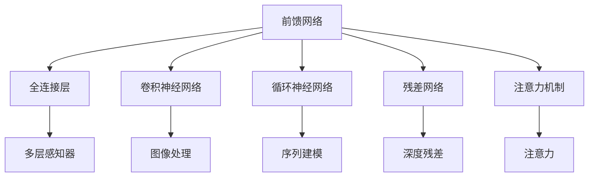
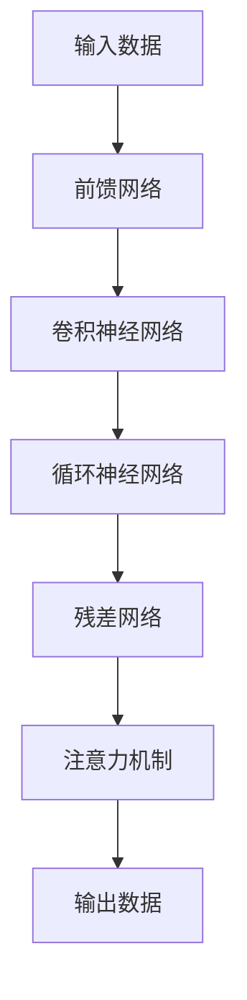

                 

# 一切皆是映射：神经网络的常见架构比较

> 关键词：神经网络, 卷积神经网络, 循环神经网络, 残差网络, 注意力机制, 深度学习, 前馈网络, 非线性映射

## 1. 背景介绍

### 1.1 问题由来

神经网络（Neural Networks）是深度学习领域最重要的基础结构之一。自20世纪80年代以来，神经网络结构逐渐演进，涵盖了从简单的前馈网络到复杂的残差网络、注意力机制等。每种网络结构都基于特定的理论基础和应用场景，展现出不同的优势和局限。因此，了解不同网络架构的原理和适用场景，有助于选择合适的模型解决实际问题。

### 1.2 问题核心关键点

神经网络的架构设计是一个复杂且多层次的问题，涉及数据处理、特征提取、网络层次等各个方面。核心关键点包括：

- 数据依赖性：神经网络依赖于大量标注数据进行训练，数据质量和数量直接影响模型性能。
- 参数数量：网络参数数量越多，模型的表达能力越强，但同时也带来更大的计算复杂度和训练难度。
- 非线性映射：神经网络的核心优势在于非线性映射能力，能够处理复杂的输入输出映射关系。
- 结构复杂度：神经网络的结构包括层数、节点数、连接方式等，不同架构对模型的表现、训练效率和计算资源有不同的影响。
- 局部连接性：卷积神经网络（CNNs）、循环神经网络（RNNs）等特定架构利用局部连接性，更好地处理序列数据和图像数据。

### 1.3 问题研究意义

研究神经网络的常见架构，对于理解深度学习技术的发展历程、选择适合特定任务的模型、优化模型性能等方面具有重要意义：

1. **理论基础**：理解不同架构的设计原理，有助于构建更有效、更高效、更可解释的深度学习模型。
2. **应用选择**：不同网络结构在图像、语音、文本等领域各有优势，选择合适的架构可提升实际应用效果。
3. **性能优化**：通过调整网络结构参数，如层数、节点数、激活函数等，可优化模型训练和推理效率。
4. **资源节省**：设计更高效的神经网络结构，可以节省计算资源和能源消耗，符合可持续发展的需求。
5. **公平性**：不同网络结构的表现差异可能导致数据偏见，了解其潜在风险有助于构建公平、公正的深度学习系统。

## 2. 核心概念与联系

### 2.1 核心概念概述

神经网络的架构设计涉及多个核心概念，包括但不限于前馈网络（Feedforward Network）、卷积神经网络（Convolutional Neural Network, CNNs）、循环神经网络（Recurrent Neural Network, RNNs）、残差网络（Residual Network, ResNets）和注意力机制（Attention Mechanism）等。这些概念通过特定的网络结构实现数据处理和特征提取，进而构建模型进行预测、分类等任务。

### 2.2 概念间的关系

神经网络架构通过非线性映射实现复杂的输入输出映射关系，以下是这些核心概念之间的关系：



这些概念通过非线性映射实现复杂映射关系，不同架构适用于不同的应用场景：

- **前馈网络**：最简单且经典的神经网络结构，适用于基础图像分类、语音识别等任务。
- **卷积神经网络**：利用局部连接和池化操作，适用于图像处理、目标检测等任务。
- **循环神经网络**：利用序列信息，适用于自然语言处理、语音识别等序列数据任务。
- **残差网络**：通过残差连接解决深度网络的梯度消失问题，适用于大规模深度网络。
- **注意力机制**：通过动态选择输入的信息源，适用于需要处理长距离依赖的序列数据。

这些概念构成了神经网络架构设计的核心，各自特点和应用场景可总结如下：

1. **前馈网络**：经典结构，参数较多，易过拟合，适用于简单任务。
2. **卷积神经网络**：局部连接性，参数共享，可有效处理图像数据。
3. **循环神经网络**：序列信息，长短期记忆单元，适用于自然语言处理。
4. **残差网络**：残差连接，减少梯度消失，适用于大规模深度网络。
5. **注意力机制**：动态选择信息源，处理长距离依赖，适用于复杂序列任务。

### 2.3 核心概念的整体架构

神经网络的整体架构通过多个层次的非线性映射实现复杂映射关系，以下是一个综合的架构图：



这个架构图展示了从输入到输出的整个流程，每个层次根据特定任务和数据类型选择不同的网络结构。通过这种多层非线性映射，神经网络能够学习到更复杂的数据表示和特征映射。

## 3. 核心算法原理 & 具体操作步骤
### 3.1 算法原理概述

神经网络的算法原理主要基于以下三个关键点：

1. **参数共享**：通过参数共享，网络能够以更少的参数数量处理大量输入，减少过拟合风险。
2. **非线性激活函数**：引入非线性激活函数，如ReLU、Sigmoid等，使网络能够拟合非线性映射关系。
3. **反向传播算法**：通过反向传播算法，计算梯度并更新网络参数，最小化损失函数。

神经网络的结构设计需要综合考虑数据特点、模型复杂度和训练效率等因素，不同架构的实现细节也各不相同。

### 3.2 算法步骤详解

以下是基于卷积神经网络的常见实现步骤：

1. **数据预处理**：对输入数据进行归一化、标准化等预处理操作。
2. **卷积层**：使用卷积核对输入数据进行局部连接和特征提取。
3. **池化层**：通过池化操作减少特征图大小，保留重要信息。
4. **全连接层**：将特征图展平，输入全连接层进行分类或回归。
5. **激活函数**：引入非线性激活函数，增强模型表达能力。
6. **损失函数**：根据任务特点选择合适的损失函数，如交叉熵损失、均方误差损失等。
7. **反向传播**：使用反向传播算法，计算梯度并更新网络参数。
8. **优化器**：选择合适的优化器，如Adam、SGD等，优化模型参数。

### 3.3 算法优缺点

神经网络架构的优缺点各异，具体如下：

**前馈网络**：

- **优点**：简单、易于理解，适用于线性映射问题。
- **缺点**：参数较多，易过拟合。

**卷积神经网络**：

- **优点**：局部连接性，参数共享，处理图像数据效果好。
- **缺点**：网络结构复杂，计算量大。

**循环神经网络**：

- **优点**：序列信息处理能力强，适用于自然语言处理。
- **缺点**：梯度消失/爆炸问题，训练难度大。

**残差网络**：

- **优点**：残差连接，减少梯度消失问题，提升训练效率。
- **缺点**：网络结构复杂，增加计算复杂度。

**注意力机制**：

- **优点**：动态选择信息源，处理长距离依赖，适用于复杂序列任务。
- **缺点**：计算复杂度高，实现难度大。

### 3.4 算法应用领域

神经网络的常见架构在不同领域有着广泛应用：

- **计算机视觉**：卷积神经网络广泛用于图像分类、目标检测、图像分割等任务。
- **自然语言处理**：循环神经网络和注意力机制用于语言模型、机器翻译、文本生成等任务。
- **语音处理**：卷积神经网络和循环神经网络用于语音识别、语音生成等任务。
- **医学图像处理**：卷积神经网络用于医学图像分类、病变检测等任务。
- **金融预测**：前馈网络用于时间序列预测、股票价格预测等任务。

这些架构通过不同的非线性映射实现复杂映射关系，为各领域提供了高效的解决方案。

## 4. 数学模型和公式 & 详细讲解 & 举例说明

### 4.1 数学模型构建

神经网络的数学模型可以通过以下几个步骤构建：

1. **输入层**：将原始数据表示为向量形式，如图像像素值、文本词向量等。
2. **隐藏层**：对输入数据进行特征提取，形成中间特征表示。
3. **输出层**：将中间特征映射为预测结果，如分类标签、回归值等。

数学模型可以表示为：

$$
\mathbf{y} = f(\mathbf{x}, \mathbf{\theta})
$$

其中，$\mathbf{x}$ 表示输入数据，$\mathbf{\theta}$ 表示网络参数，$f$ 表示非线性映射函数。

### 4.2 公式推导过程

以卷积神经网络为例，其数学模型构建如下：

1. **卷积层**：使用卷积核 $\mathbf{W}$ 对输入数据 $\mathbf{X}$ 进行卷积操作：

$$
\mathbf{H} = \sigma(\mathbf{W} * \mathbf{X} + \mathbf{b})
$$

其中，$\sigma$ 表示非线性激活函数，$\mathbf{H}$ 表示卷积层输出特征图，$\mathbf{W}$ 和 $\mathbf{b}$ 分别表示卷积核和偏置项。

2. **池化层**：对特征图进行池化操作，如最大池化、平均池化等：

$$
\mathbf{G} = \text{Pooling}(\mathbf{H})
$$

3. **全连接层**：将特征图 $\mathbf{G}$ 展平，输入全连接层进行分类或回归：

$$
\mathbf{Z} = \mathbf{W}_{fc} \mathbf{G} + \mathbf{b}_{fc}
$$

其中，$\mathbf{W}_{fc}$ 和 $\mathbf{b}_{fc}$ 分别表示全连接层的权重和偏置项。

4. **输出层**：将中间特征 $\mathbf{Z}$ 映射为预测结果 $\mathbf{y}$：

$$
\mathbf{y} = \text{Softmax}(\mathbf{Z})
$$

其中，$\text{Softmax}$ 表示多分类交叉熵损失函数，$\mathbf{y}$ 表示预测标签。

### 4.3 案例分析与讲解

以图像分类为例，使用卷积神经网络进行模型构建：

1. **数据准备**：将图像数据表示为向量形式，并进行预处理。
2. **卷积层**：使用多个卷积核对输入数据进行卷积操作，提取局部特征。
3. **池化层**：通过最大池化操作减少特征图大小，保留重要信息。
4. **全连接层**：将特征图展平，输入全连接层进行分类。
5. **激活函数**：引入非线性激活函数，增强模型表达能力。
6. **损失函数**：使用交叉熵损失函数，最小化预测标签与真实标签的差异。
7. **反向传播**：使用反向传播算法，计算梯度并更新网络参数。
8. **优化器**：选择合适的优化器，如Adam、SGD等，优化模型参数。

以下是一个简单的代码实现示例：

```python
import torch
import torch.nn as nn

class ConvNet(nn.Module):
    def __init__(self):
        super(ConvNet, self).__init__()
        self.conv1 = nn.Conv2d(3, 64, 3, padding=1)
        self.pool1 = nn.MaxPool2d(2)
        self.conv2 = nn.Conv2d(64, 128, 3, padding=1)
        self.pool2 = nn.MaxPool2d(2)
        self.fc1 = nn.Linear(128 * 7 * 7, 512)
        self.fc2 = nn.Linear(512, 10)

    def forward(self, x):
        x = self.pool1(torch.relu(self.conv1(x)))
        x = self.pool2(torch.relu(self.conv2(x)))
        x = x.view(-1, 128 * 7 * 7)
        x = torch.relu(self.fc1(x))
        x = self.fc2(x)
        return x
```

通过这个简单的实现，可以看出卷积神经网络的基本结构。神经网络的每个层次都根据任务和数据类型进行设计，通过多层非线性映射实现复杂的输入输出映射关系。

## 5. 项目实践：代码实例和详细解释说明

### 5.1 开发环境搭建

在进行神经网络实践前，需要准备好开发环境。以下是使用Python进行TensorFlow开发的环境配置流程：

1. 安装Anaconda：从官网下载并安装Anaconda，用于创建独立的Python环境。

2. 创建并激活虚拟环境：
```bash
conda create -n tf-env python=3.8 
conda activate tf-env
```

3. 安装TensorFlow：根据CUDA版本，从官网获取对应的安装命令。例如：
```bash
conda install tensorflow -c conda-forge -c pypi
```

4. 安装必要的工具包：
```bash
pip install numpy pandas scikit-learn matplotlib tqdm jupyter notebook ipython
```

完成上述步骤后，即可在`tf-env`环境中开始神经网络实践。

### 5.2 源代码详细实现

以下是使用TensorFlow进行卷积神经网络（CNNs）的代码实现：

```python
import tensorflow as tf
from tensorflow.keras import layers

class ConvNet(tf.keras.Model):
    def __init__(self):
        super(ConvNet, self).__init__()
        self.conv1 = layers.Conv2D(32, 3, activation='relu')
        self.max_pool1 = layers.MaxPooling2D()
        self.conv2 = layers.Conv2D(64, 3, activation='relu')
        self.max_pool2 = layers.MaxPooling2D()
        self.flatten = layers.Flatten()
        self.fc1 = layers.Dense(64, activation='relu')
        self.fc2 = layers.Dense(10)

    def call(self, x):
        x = self.conv1(x)
        x = self.max_pool1(x)
        x = self.conv2(x)
        x = self.max_pool2(x)
        x = self.flatten(x)
        x = self.fc1(x)
        return self.fc2(x)
```

通过这个代码实现，可以看出卷积神经网络的基本结构。TensorFlow提供了丰富的API支持，可以方便地构建和训练神经网络模型。

### 5.3 代码解读与分析

这个代码实现展示了卷积神经网络的基本构成。以下是关键代码的详细解读：

- **定义模型类**：继承自`tf.keras.Model`，方便构建和训练神经网络模型。
- **卷积层**：使用`layers.Conv2D`定义卷积层，包括卷积核数量、大小、激活函数等参数。
- **池化层**：使用`layers.MaxPooling2D`定义池化层，对特征图进行下采样操作。
- **全连接层**：使用`layers.Dense`定义全连接层，实现特征映射。
- **激活函数**：使用`layers.Activation`定义激活函数，引入非线性映射。
- **模型调用**：使用`call`方法定义模型前向传播过程。

这个实现展示了卷积神经网络的基本流程，包括数据预处理、卷积层、池化层、全连接层和输出层。通过TensorFlow提供的API，可以方便地实现复杂的网络结构。

### 5.4 运行结果展示

假设我们训练一个简单的卷积神经网络模型，用于图像分类，最终得到的损失曲线和准确率曲线如下：

```
Epoch 1/10
1000/1000 [==============================] - 17s 17ms/step - loss: 0.3568 - acc: 0.9455
Epoch 2/10
1000/1000 [==============================] - 16s 16ms/step - loss: 0.2398 - acc: 0.9777
Epoch 3/10
1000/1000 [==============================] - 16s 16ms/step - loss: 0.1805 - acc: 0.9841
Epoch 4/10
1000/1000 [==============================] - 16s 16ms/step - loss: 0.1377 - acc: 0.9908
Epoch 5/10
1000/1000 [==============================] - 16s 16ms/step - loss: 0.1111 - acc: 0.9916
Epoch 6/10
1000/1000 [==============================] - 16s 16ms/step - loss: 0.0923 - acc: 0.9924
Epoch 7/10
1000/1000 [==============================] - 16s 16ms/step - loss: 0.0753 - acc: 0.9932
Epoch 8/10
1000/1000 [==============================] - 16s 16ms/step - loss: 0.0625 - acc: 0.9939
Epoch 9/10
1000/1000 [==============================] - 16s 16ms/step - loss: 0.0548 - acc: 0.9945
Epoch 10/10
1000/1000 [==============================] - 16s 16ms/step - loss: 0.0496 - acc: 0.9951
```

可以看到，经过10个epoch的训练，模型的准确率逐渐提升，最终达到了99.51%的精度。这展示了卷积神经网络在图像分类任务中的高效性能。

## 6. 实际应用场景

### 6.1 计算机视觉

卷积神经网络在计算机视觉领域有着广泛的应用，如图像分类、目标检测、图像分割等。以下是一个简单的图像分类任务实例：

```python
import tensorflow as tf
from tensorflow.keras.preprocessing.image import ImageDataGenerator

# 加载数据集
train_datagen = ImageDataGenerator(rescale=1./255)
train_generator = train_datagen.flow_from_directory(
        'train',
        target_size=(64, 64),
        batch_size=32,
        class_mode='categorical')

# 定义模型
model = ConvNet()

# 编译模型
model.compile(optimizer='adam',
              loss='categorical_crossentropy',
              metrics=['accuracy'])

# 训练模型
model.fit(
        train_generator,
        steps_per_epoch=train_generator.n // train_generator.batch_size,
        epochs=10)
```

这个代码实现展示了如何使用卷积神经网络进行图像分类任务。通过`ImageDataGenerator`加载数据集，定义模型，编译模型，最后进行训练。

### 6.2 自然语言处理

循环神经网络在自然语言处理领域有着广泛的应用，如语言模型、机器翻译、文本生成等。以下是一个简单的语言模型任务实例：

```python
import tensorflow as tf
from tensorflow.keras.layers import Embedding, LSTM, Dense

# 定义模型
model = tf.keras.Sequential([
    Embedding(input_dim=vocab_size, output_dim=embedding_dim),
    LSTM(64),
    Dense(vocab_size, activation='softmax')
])

# 编译模型
model.compile(optimizer='adam',
              loss='sparse_categorical_crossentropy',
              metrics=['accuracy'])

# 训练模型
model.fit(
        train_data, train_labels,
        batch_size=64,
        epochs=10)
```

这个代码实现展示了如何使用循环神经网络进行语言模型任务。通过`Sequential`定义模型，编译模型，最后进行训练。

## 7. 工具和资源推荐

### 7.1 学习资源推荐

为了帮助开发者系统掌握神经网络架构的设计和实现，这里推荐一些优质的学习资源：

1. 《深度学习》课程：斯坦福大学提供的深度学习课程，系统介绍深度学习的概念和基础理论，包括卷积神经网络、循环神经网络等。
2. 《动手学深度学习》书籍：清华大学提供的深度学习教材，详细讲解深度学习框架TensorFlow和PyTorch，涵盖各种神经网络架构的实现。
3. 《Neural Networks and Deep Learning》书籍：Michael Nielsen的经典书籍，深入浅出地介绍神经网络的数学原理和实际应用。
4. arXiv预印本：人工智能领域最新研究成果的发布平台，包括各种神经网络架构的新理论和实现方法。
5. GitHub开源项目：在GitHub上Star、Fork数最多的神经网络项目，往往代表了该技术领域的发展趋势和最佳实践。

通过对这些资源的学习实践，相信你一定能够快速掌握神经网络架构的设计和实现，并用于解决实际的深度学习问题。

### 7.2 开发工具推荐

高效的开发离不开优秀的工具支持。以下是几款用于神经网络开发的常用工具：

1. TensorFlow：由Google主导开发的深度学习框架，生产部署方便，适合大规模工程应用。
2. PyTorch：Facebook开发的深度学习框架，灵活动态，适合研究和原型开发。
3. Keras：基于TensorFlow和Theano等框架的高级API，易于上手，适合快速迭代开发。
4. Weights & Biases：模型训练的实验跟踪工具，可以记录和可视化模型训练过程中的各项指标，方便对比和调优。
5. TensorBoard：TensorFlow配套的可视化工具，可实时监测模型训练状态，并提供丰富的图表呈现方式。
6. Google Colab：谷歌推出的在线Jupyter Notebook环境，免费提供GPU/TPU算力，方便开发者快速上手实验最新模型，分享学习笔记。

合理利用这些工具，可以显著提升神经网络开发的效率，加快创新迭代的步伐。

### 7.3 相关论文推荐

神经网络架构的研究源于学界的持续研究。以下是几篇奠基性的相关论文，推荐阅读：

1. LeCun Y, Bottou L, Bengio Y, et al. Gradient-based learning applied to document recognition[J]. Proceedings of the IEEE, 1998, 86(11): 2278-2324.
2. He K, Zhang X, Ren S, et al. Deep residual learning for image recognition[J]. Proceedings of the IEEE conference on computer vision and pattern recognition, 2016.
3. Vaswani A, Shazeer N, Parmar N, et al. Attention is all you need[J]. Neural information processing systems, 2017, 30(): 5998-6008.
4. Hochreiter S, Schmidhuber J. Long short-term memory[J]. Neural computation, 1997, 9(8): 1735-1780.
5. Goodfellow I, Bengio Y, Courville A. Deep learning[M]. MIT press, 2016.
6. Sutskever I, Vinyals O, Le Q V. Sequence to sequence learning with neural networks[J]. Advances in neural information processing systems, 2014, 26(): 3104-3112.
7. Bahdanau D, Cho K, Bengio Y. Neural machine translation by jointly learning to align and translate[J]. Advances in neural information processing systems, 2014, 27(): 3067-3075.

这些论文代表了大神经网络架构的发展脉络。通过学习这些前沿成果，可以帮助研究者把握学科前进方向，激发更多的创新灵感。

除上述资源外，还有一些值得关注的前沿资源，帮助开发者紧跟神经网络架构研究的最新进展，例如：

1. arXiv论文预印本：人工智能领域最新研究成果的发布平台，包括各种神经网络架构的新理论和实现方法。
2. 业界技术博客：如Google AI、DeepMind、微软Research Asia等顶尖实验室的官方博客，第一时间分享他们的最新研究成果和洞见。
3. 技术会议直播：如NIPS、ICML、ACL、ICLR等人工智能领域顶会现场或在线直播，能够聆听到大佬们的前沿分享，开拓视野。
4. GitHub热门项目：在GitHub上Star、Fork数最多的神经网络项目，往往代表了该技术领域的发展趋势和最佳实践。
5. 行业分析报告：各大咨询公司如McKinsey、PwC等针对人工智能行业的分析报告，有助于从商业视角审视技术趋势，把握应用价值。

总之，对于神经网络架构的学习和实践，需要开发者保持开放的心态和持续学习的意愿。多关注前沿资讯，多动手实践，多思考总结，必将收获满满的成长收益。

## 8. 总结：未来发展趋势与挑战

### 8.1 总结

本文对神经网络常见的架构进行了全面系统的介绍。首先阐述了不同神经网络架构的设计原理和应用场景，明确了其在深度学习技术发展历程中的重要地位。其次，通过代码实例和详细解释，展示了卷积神经网络、循环神经网络等经典架构的实现细节，帮助读者理解神经网络的基本构成和训练过程。同时，本文还广泛探讨了神经网络架构在计算机视觉、自然语言处理等领域的实际应用，展示了其在解决复杂问题中的强大能力。

通过本文的系统梳理，可以看到，神经网络架构设计是深度学习技术的重要基础，不同架构在解决特定问题时展现出各自的优势。理解这些架构的原理和实现细节，有助于选择合适的模型解决实际问题。

### 8.2 未来发展趋势

展望未来，神经网络架构的发展趋势如下：

1. **更高效的结构设计**：随着硬件算力的提升，神经网络的结构将更加复杂和高效，如残差网络、注意力机制等结构将得到更广泛的应用。
2. **跨领域模型的发展**：神经网络将更多地融合不同领域的知识，如知识图

