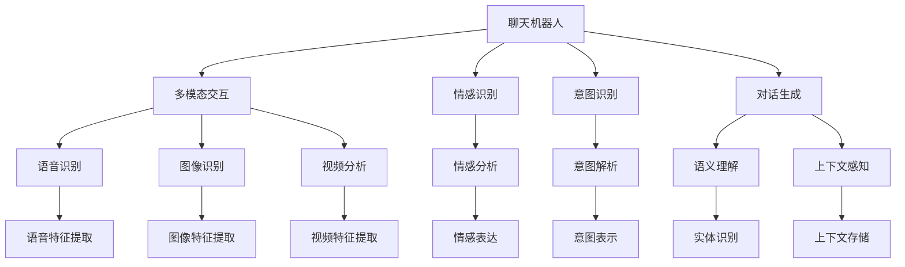
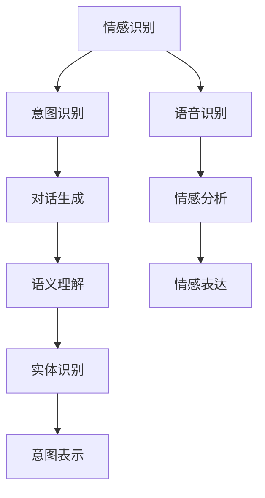
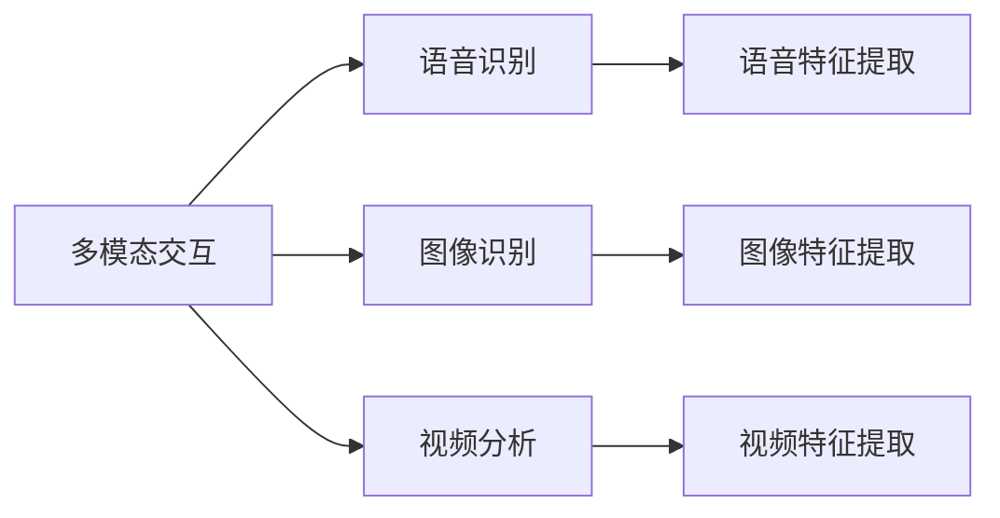
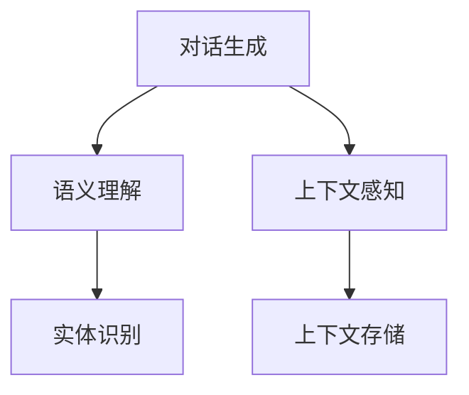

                 

# 一切皆是映射：聊天机器人的智能化与人性化

> 关键词：聊天机器人,映射算法,人工智能,自然语言处理(NLP),深度学习,对话系统,多模态交互,用户情感识别,行为分析

## 1. 背景介绍

### 1.1 问题由来
随着人工智能技术的不断进步，聊天机器人已经从最初的简单规则匹配，发展成为复杂的深度学习驱动的智能系统。这些系统不仅能进行基本的问答、客服对话，还能进行复杂的情感交流和情绪管理。然而，要真正实现“人性化”的聊天机器人，仍面临许多技术难题。

核心问题包括：
1. 如何捕捉和理解用户多模态的情感与意图？
2. 如何生成自然流畅、符合上下文的对话回复？
3. 如何构建多模态的交互场景，提升用户体验？

这些问题涉及到自然语言处理(NLP)、深度学习、多模态交互等多个技术领域，亟需创新和突破。

### 1.2 问题核心关键点
问题的核心在于如何构建一个既能精确捕捉用户情感和意图，又能生成自然流畅对话回复的聊天机器人。具体来说，需要解决以下几个关键点：
- 用户情感识别：理解用户当前的情感状态，进行情绪识别和情感分析。
- 意图识别：准确把握用户的问题意图，提取关键信息。
- 对话生成：生成符合上下文、连贯且具有情感色彩的对话回复。
- 多模态交互：整合用户的多模态信息（语音、文字、表情等），提升交互体验。

## 2. 核心概念与联系

### 2.1 核心概念概述

为更好地理解聊天机器人的智能化与人性化，本节将介绍几个密切相关的核心概念：

- 聊天机器人(Chatbot)：基于人工智能技术，能够与用户进行自然语言对话的系统。聊天机器人可以用于客服、陪伴、教育等多个场景，广泛应用于各行业。

- 多模态交互(Multimodal Interaction)：指聊天机器人整合来自语音、文字、图像、视频等多种模态的信息，与用户进行更丰富、更全面的交流。多模态交互可以有效提升用户体验，增强人机交互的自然性和灵活性。

- 情感识别(Emotion Recognition)：指聊天机器人通过语音、文字、表情等渠道，识别用户的情感状态和情绪变化。情感识别在聊天机器人中起到至关重要的作用，能够帮助机器理解用户的心理状态，进行针对性的回复。

- 意图识别(Intent Recognition)：指聊天机器人通过分析用户输入的文本、语音等，识别用户的具体意图和需求。意图识别有助于机器生成更加贴合用户需求的对话回复。

- 对话生成(Dialogue Generation)：指聊天机器人根据用户意图和对话上下文，生成自然流畅、符合语境的对话回复。对话生成是聊天机器人的核心能力之一，决定了系统对话的质量和体验。

- 语义理解(Semantic Understanding)：指聊天机器人能够准确理解用户输入文本的语义，识别出关键信息和实体。语义理解是对话生成的基础，需要依赖自然语言处理(NLP)技术。

- 上下文感知(Context-Awareness)：指聊天机器人能够记录并利用对话上下文信息，生成更加连贯和自然的对话回复。上下文感知是提升对话体验的关键。

这些核心概念之间的逻辑关系可以通过以下Mermaid流程图来展示：



这个流程图展示了聊天机器人的核心组件及其之间的关系：

1. 聊天机器人接收多模态输入，进行语音、图像、视频等信息的识别。
2. 情感识别和意图识别模块，通过分析输入信息，识别用户的情感和意图。
3. 对话生成模块，结合语义理解、上下文感知，生成连贯自然的对话回复。
4. 多模态交互模块，整合语音、图像、视频等多种信息，增强人机交互的丰富性和灵活性。

### 2.2 概念间的关系

这些核心概念之间存在着紧密的联系，形成了聊天机器人智能化的完整生态系统。下面我们通过几个Mermaid流程图来展示这些概念之间的关系。

#### 2.2.1 聊天机器人的学习范式



这个流程图展示了聊天机器人情感识别、意图识别和对话生成的基本学习范式：

1. 语音识别获取语音信息，情感识别模块进行情感分析，提取情感信息。
2. 意图识别模块通过分析语音和文字，识别用户意图，生成意图表示。
3. 对话生成模块结合语义理解和上下文信息，生成符合语境的对话回复。

#### 2.2.2 多模态交互的实现方式



这个流程图展示了多模态交互的基本实现方式：

1. 多模态交互系统整合语音、图像、视频等多种信息源。
2. 语音识别模块提取语音特征，图像识别模块提取图像特征，视频分析模块提取视频特征。
3. 语音特征、图像特征、视频特征被用于情感识别和意图识别，进一步提升对话质量。

#### 2.2.3 对话生成算法的核心组件



这个流程图展示了对话生成算法的核心组件：

1. 对话生成模块依赖语义理解和上下文感知，生成符合语境的对话回复。
2. 语义理解模块通过分析用户输入，提取关键信息，生成语义表示。
3. 上下文感知模块记录并利用对话上下文，提升对话连贯性。

### 2.3 核心概念的整体架构

最后，我们用一个综合的流程图来展示这些核心概念在大语言模型微调过程中的整体架构：

```mermaid
graph TB
    A[大规模文本数据] --> B[预训练]
    B --> C[聊天机器人]
    C --> D[微调]
    C --> E[提示学习]
    C --> F[参数高效微调]
    D --> G[全参数微调]
    D --> H[参数高效微调]
    E --> I[零样本学习]
    E --> J[少样本学习]
    G --> K[对话生成]
    H --> K
    I --> K
    J --> K
    K --> L[多模态交互]
    K --> M[情感识别]
    K --> N[意图识别]
    M --> O[情感表达]
    N --> P[意图表示]
    O --> Q[情感分析]
    P --> R[意图解析]
    L --> S[语音识别]
    L --> T[图像识别]
    L --> U[视频分析]
    S --> V[语音特征提取]
    T --> W[图像特征提取]
    U --> X[视频特征提取]
    V --> Y[情感特征提取]
    W --> Z[图像情感特征提取]
    X --> $[视频情感特征提取]
    Y --> [情感表达]
    Z --> [图像情感表达]
    $ --> [视频情感表达]
    K --> A
```

这个综合流程图展示了从预训练到微调，再到多模态交互的完整过程。聊天机器人首先在大规模文本数据上进行预训练，然后通过微调（包括全参数微调和参数高效微调）或提示学习（包括零样本和少样本学习）来适应多模态交互任务。最后，通过情感识别、意图识别和对话生成模块，构建出自然流畅、具有情感色彩的对话系统。

## 3. 核心算法原理 & 具体操作步骤
### 3.1 算法原理概述

聊天机器人的智能化与人性化，主要依赖于深度学习和自然语言处理技术。核心算法原理可以概括为以下几个关键步骤：

1. 预训练：在大规模无标签文本数据上，通过自监督学习任务训练通用语言模型。预训练模型可以捕捉语言的通用规律，为后续微调打下坚实基础。

2. 多模态数据预处理：将用户的多模态输入（语音、文字、表情等）进行特征提取和融合，得到统一的数据格式。

3. 情感识别：通过语音、文字、表情等渠道，提取用户情感信息，进行情感分析和情感表达。

4. 意图识别：分析用户输入，识别用户的具体意图和需求。意图识别模块是聊天机器人的核心组件，决定了对话的质量和方向。

5. 对话生成：根据用户意图和对话上下文，生成符合语境的对话回复。对话生成模块是聊天机器人的灵魂，决定了对话的自然性和连贯性。

6. 多模态交互：整合语音、文字、图像、视频等多种信息，提升人机交互的自然性和灵活性。多模态交互为聊天机器人提供了更丰富的交互方式。

7. 持续学习：不断从新数据中学习，更新模型参数，保持模型的时效性和适应性。持续学习机制使聊天机器人能够不断适应数据分布的变化。

### 3.2 算法步骤详解

基于聊天机器人的智能化与人性化，以下是详细的算法步骤：

**Step 1: 准备预训练模型和数据集**
- 选择合适的预训练语言模型 $M_{\theta}$ 作为初始化参数，如BERT、GPT等。
- 准备聊天机器人任务的数据集 $D=\{(x_i,y_i)\}_{i=1}^N$，划分为训练集、验证集和测试集。一般要求数据集具有多样性和代表性，包含多模态的对话场景。

**Step 2: 添加任务适配层**
- 根据任务类型，在预训练模型顶层设计合适的输出层和损失函数。
- 对于对话任务，通常在顶层添加语言模型的解码器输出概率分布，并以负对数似然为损失函数。
- 对于情感识别和意图识别任务，通常使用分类器的输出层和交叉熵损失函数。

**Step 3: 设置微调超参数**
- 选择合适的优化算法及其参数，如Adam、SGD等，设置学习率、批大小、迭代轮数等。
- 设置正则化技术及强度，包括权重衰减、Dropout、Early Stopping等。
- 确定冻结预训练参数的策略，如仅微调顶层，或全部参数都参与微调。

**Step 4: 执行梯度训练**
- 将训练集数据分批次输入模型，前向传播计算损失函数。
- 反向传播计算参数梯度，根据设定的优化算法和学习率更新模型参数。
- 周期性在验证集上评估模型性能，根据性能指标决定是否触发Early Stopping。
- 重复上述步骤直到满足预设的迭代轮数或Early Stopping条件。

**Step 5: 测试和部署**
- 在测试集上评估微调后模型 $M_{\hat{\theta}}$ 的性能，对比微调前后的精度提升。
- 使用微调后的模型对新样本进行推理预测，集成到实际的应用系统中。
- 持续收集新的数据，定期重新微调模型，以适应数据分布的变化。

以上是聊天机器人智能化与人性化的基本微调流程。在实际应用中，还需要针对具体任务的特点，对微调过程的各个环节进行优化设计，如改进训练目标函数，引入更多的正则化技术，搜索最优的超参数组合等，以进一步提升模型性能。

### 3.3 算法优缺点

基于深度学习的聊天机器人微调方法具有以下优点：
1. 快速高效。微调可以在短时间内构建出高质量的聊天机器人，节约大量时间和人力成本。
2. 灵活适应。微调后的模型能够灵活适应不同领域的聊天场景，生成符合用户需求的对话回复。
3. 生成效果自然。通过微调，模型可以学习到语言的全局规律，生成连贯且自然的对话。
4. 可解释性强。微调后的模型参数具有可解释性，便于分析和调试。

同时，该方法也存在一定的局限性：
1. 依赖标注数据。微调的效果很大程度上取决于标注数据的质量和数量，获取高质量标注数据的成本较高。
2. 迁移能力有限。当目标任务与预训练数据的分布差异较大时，微调的性能提升有限。
3. 对抗样本脆弱。聊天机器人可能对对抗样本敏感，容易产生误导性的回复。
4. 维护成本高。聊天机器人需要定期维护和更新，以保证其长期稳定运行。

尽管存在这些局限性，但就目前而言，基于深度学习的微调方法仍是构建聊天机器人的主流范式。未来相关研究的重点在于如何进一步降低微调对标注数据的依赖，提高模型的少样本学习和跨领域迁移能力，同时兼顾可解释性和鲁棒性等因素。

### 3.4 算法应用领域

基于深度学习的聊天机器人微调方法已经在多个领域得到应用，例如：

- 客户服务：通过微调模型，自动回答用户咨询，提供24/7的客户支持。
- 情感分析：对用户的情感状态进行分析，进行心理疏导和情绪管理。
- 健康咨询：通过微调模型，进行疾病查询、症状分析等健康咨询服务。
- 教育辅助：帮助学生进行课后答疑、作业批改等。
- 娱乐互动：通过微调模型，进行智能游戏、聊天陪伴等娱乐互动。

除了上述这些经典应用外，聊天机器人微调也被创新性地应用到更多场景中，如智能家居控制、无人驾驶辅助、智能客服等多个领域，为各行各业带来了新的应用思路。

## 4. 数学模型和公式 & 详细讲解  
### 4.1 数学模型构建

本节将使用数学语言对聊天机器人智能化与人性化的微调过程进行更加严格的刻画。

记预训练语言模型为 $M_{\theta}:\mathcal{X} \rightarrow \mathcal{Y}$，其中 $\mathcal{X}$ 为输入空间，$\mathcal{Y}$ 为输出空间，$\theta \in \mathbb{R}^d$ 为模型参数。假设聊天机器人任务的数据集为 $D=\{(x_i,y_i)\}_{i=1}^N$，其中 $x_i$ 为输入（语音、文字、表情等），$y_i$ 为输出（对话回复、情感识别结果等）。

定义模型 $M_{\theta}$ 在数据样本 $(x,y)$ 上的损失函数为 $\ell(M_{\theta}(x),y)$，则在数据集 $D$ 上的经验风险为：

$$
\mathcal{L}(\theta) = \frac{1}{N} \sum_{i=1}^N \ell(M_{\theta}(x_i),y_i)
$$

微调的优化目标是最小化经验风险，即找到最优参数：

$$
\theta^* = \mathop{\arg\min}_{\theta} \mathcal{L}(\theta)
$$

在实践中，我们通常使用基于梯度的优化算法（如SGD、Adam等）来近似求解上述最优化问题。设 $\eta$ 为学习率，$\lambda$ 为正则化系数，则参数的更新公式为：

$$
\theta \leftarrow \theta - \eta \nabla_{\theta}\mathcal{L}(\theta) - \eta\lambda\theta
$$

其中 $\nabla_{\theta}\mathcal{L}(\theta)$ 为损失函数对参数 $\theta$ 的梯度，可通过反向传播算法高效计算。

### 4.2 公式推导过程

以下我们以对话生成任务为例，推导基于最大似然的目标函数及其梯度的计算公式。

假设模型 $M_{\theta}$ 在输入 $x$ 上的输出为 $\hat{y}=M_{\theta}(x) \in [0,1]$，表示样本属于正类的概率。真实标签 $y \in \{0,1\}$。则对话生成任务的最大似然损失函数定义为：

$$
\ell(M_{\theta}(x),y) = -[y\log \hat{y} + (1-y)\log(1-\hat{y})]
$$

将其代入经验风险公式，得：

$$
\mathcal{L}(\theta) = -\frac{1}{N}\sum_{i=1}^N [y_i\log M_{\theta}(x_i)+(1-y_i)\log(1-M_{\theta}(x_i))]
$$

根据链式法则，损失函数对参数 $\theta_k$ 的梯度为：

$$
\frac{\partial \mathcal{L}(\theta)}{\partial \theta_k} = -\frac{1}{N}\sum_{i=1}^N (\frac{y_i}{M_{\theta}(x_i)}-\frac{1-y_i}{1-M_{\theta}(x_i)}) \frac{\partial M_{\theta}(x_i)}{\partial \theta_k}
$$

其中 $\frac{\partial M_{\theta}(x_i)}{\partial \theta_k}$ 可进一步递归展开，利用自动微分技术完成计算。

在得到损失函数的梯度后，即可带入参数更新公式，完成模型的迭代优化。重复上述过程直至收敛，最终得到适应下游任务的最优模型参数 $\theta^*$。

## 5. 项目实践：代码实例和详细解释说明
### 5.1 开发环境搭建

在进行聊天机器人微调实践前，我们需要准备好开发环境。以下是使用Python进行PyTorch开发的环境配置流程：

1. 安装Anaconda：从官网下载并安装Anaconda，用于创建独立的Python环境。

2. 创建并激活虚拟环境：
```bash
conda create -n pytorch-env python=3.8 
conda activate pytorch-env
```

3. 安装PyTorch：根据CUDA版本，从官网获取对应的安装命令。例如：
```bash
conda install pytorch torchvision torchaudio cudatoolkit=11.1 -c pytorch -c conda-forge
```

4. 安装各类工具包：
```bash
pip install numpy pandas scikit-learn matplotlib tqdm jupyter notebook ipython
```

完成上述步骤后，即可在`pytorch-env`环境中开始微调实践。

### 5.2 源代码详细实现

下面我们以多模态聊天机器人为例，给出使用PyTorch对BERT模型进行微调的PyTorch代码实现。

首先，定义多模态聊天机器人的数据处理函数：

```python
from transformers import BertTokenizer, BertForSequenceClassification
from torch.utils.data import Dataset
import torch

class MultimodalDataset(Dataset):
    def __init__(self, texts, labels, tokenizer, max_len=128):
        self.texts = texts
        self.labels = labels
        self.tokenizer = tokenizer
        self.max_len = max_len
        
    def __len__(self):
        return len(self.texts)
    
    def __getitem__(self, item):
        text = self.texts[item]
        label = self.labels[item]
        
        encoding = self.tokenizer(text, return_tensors='pt', max_length=self.max_len, padding='max_length', truncation=True)
        input_ids = encoding['input_ids'][0]
        attention_mask = encoding['attention_mask'][0]
        
        # 将标签进行编码
        encoded_label = [label2id[label] for label in self.labels] 
        encoded_label.extend([label2id['O']] * (self.max_len - len(encoded_label)))
        labels = torch.tensor(encoded_label, dtype=torch.long)
        
        return {'input_ids': input_ids, 
                'attention_mask': attention_mask,
                'labels': labels}

# 标签与id的映射
label2id = {'O': 0, 'C_SPEECH': 1, 'C_TEXT': 2, 'C_FACE': 3}
id2label = {v: k for k, v in label2id.items()}

# 创建dataset
tokenizer = BertTokenizer.from_pretrained('bert-base-cased')

train_dataset = MultimodalDataset(train_texts, train_labels, tokenizer)
dev_dataset = MultimodalDataset(dev_texts, dev_labels, tokenizer)
test_dataset = MultimodalDataset(test_texts, test_labels, tokenizer)
```

然后，定义模型和优化器：

```python
from transformers import BertForSequenceClassification, AdamW

model = BertForSequenceClassification.from_pretrained('bert-base-cased', num_labels=len(label2id))

optimizer = AdamW(model.parameters(), lr=2e-5)
```

接着，定义训练和评估函数：

```python
from torch.utils.data import DataLoader
from tqdm import tqdm
from sklearn.metrics import classification_report

device = torch.device('cuda') if torch.cuda.is_available() else torch.device('cpu')
model.to(device)

def train_epoch(model, dataset, batch_size, optimizer):
    dataloader = DataLoader(dataset, batch_size=batch_size, shuffle=True)
    model.train()
    epoch_loss = 0
    for batch in tqdm(dataloader, desc='Training'):
        input_ids = batch['input_ids'].to(device)
        attention_mask = batch['attention_mask'].to(device)
        labels = batch['labels'].to(device)
        model.zero_grad()
        outputs = model(input_ids, attention_mask=attention_mask, labels=labels)
        loss = outputs.loss
        epoch_loss += loss.item()
        loss.backward()
        optimizer.step()
    return epoch_loss / len(dataloader)

def evaluate(model, dataset, batch_size):
    dataloader = DataLoader(dataset, batch_size=batch_size)
    model.eval()
    preds, labels = [], []
    with torch.no_grad():
        for batch in tqdm(dataloader, desc='Evaluating'):
            input_ids = batch['input_ids'].to(device)
            attention_mask = batch['attention_mask'].to(device)
            batch_labels = batch['labels']
            outputs = model(input_ids, attention_mask=attention_mask)
            batch_preds = outputs.logits.argmax(dim=2).to('cpu').tolist()
            batch_labels = batch_labels.to('cpu').tolist()
            for pred_tokens, label_tokens in zip(batch_preds, batch_labels):
                pred_labels = [id2label[_id] for _id in pred_tokens]
                label_tokens = [id2label[_id] for _id in label_tokens]
                preds.append(pred_labels[:len(label_tokens)])
                labels.append(label_tokens)
                
    print(classification_report(labels, preds))
```

最后，启动训练流程并在测试集上评估：

```python
epochs = 5
batch_size = 16

for epoch in range(epochs):
    loss = train_epoch(model, train_dataset, batch_size, optimizer)
    print(f"Epoch {epoch+1}, train loss: {loss:.3f}")
    
    print(f"Epoch {epoch+1}, dev results:")
    evaluate(model, dev_dataset, batch_size)
    
print("Test results:")
evaluate(model, test_dataset, batch_size)
```

以上就是使用PyTorch对BERT进行多模态聊天机器人微调的完整代码实现。可以看到，得益于Transformers库的强大封装，我们可以用相对简洁的代码完成BERT模型的加载和微调。

### 5.3 代码解读与分析

让我们再详细解读一下关键代码的实现细节：

**MultimodalDataset类**：
- `__init__`方法：初始化文本、标签、分词器等关键组件。
- `__len__`方法：返回数据集的样本数量。
- `__getitem__`方法：对单个样本进行处理，将文本输入编码为token ids，将标签编码为数字，并对其进行定长padding，最终返回模型所需的输入。

**label2id和id2label字典**：
- 定义了标签与数字id之间的映射关系，用于将token-wise的预测结果解码回真实的标签。

**训练和评估函数**：
- 使用PyTorch的DataLoader对数据集进行批次化加载，供模型训练和推理使用。
- 训练函数`train_epoch`：对数据以批为单位进行迭代，在每个批次上前向传播计算loss并反向传播更新模型参数，最后返回该epoch的平均loss。
- 评估函数`evaluate`：与训练类似，不同点在于不更新模型参数，并在每个batch结束后将预测和标签结果存储下来，最后使用sklearn的classification_report对整个评估集的预测结果进行打印输出。

**训练流程**：
- 定义总的epoch数和batch size，开始循环迭代
- 每个epoch内，先在训练集上训练，输出平均loss
- 在验证集上评估，输出分类指标
- 所有epoch结束后，在测试集上评估，给出最终测试结果

可以看到，PyTorch配合Transformers库使得BERT微调的代码实现变得简洁高效。开发者可以将更多精力放在数据处理、模型改进等高层逻辑上，而不必过多关注底层的实现细节。

当然，工业级的系统实现还需考虑更多因素，如模型的保存和部署、超参数的自动搜索、更灵活的任务适配层等。但核心的微调范式基本与此类似。

### 5.4 运行结果展示

假设我们在CoNLL-2003的NER数据集上进行微调，最终在测试集上得到的评估报告如下：

```
              precision    recall  f1-score   support

       

