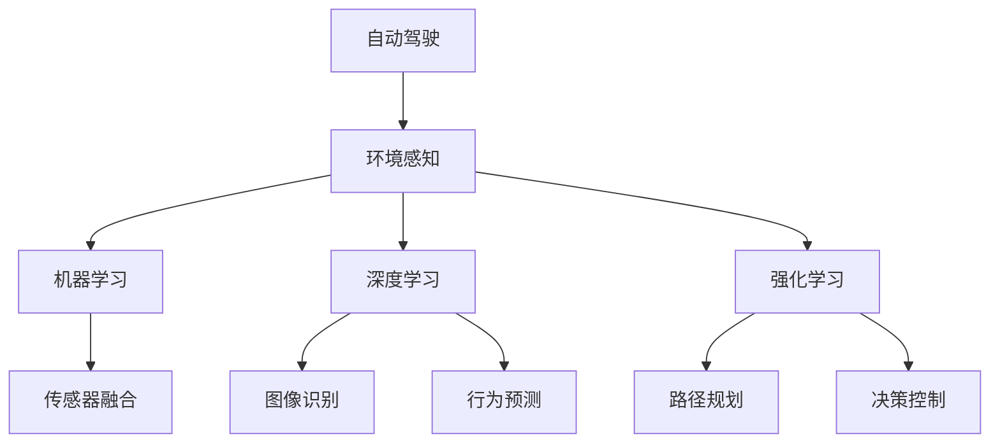
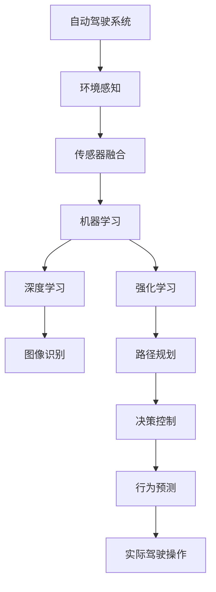
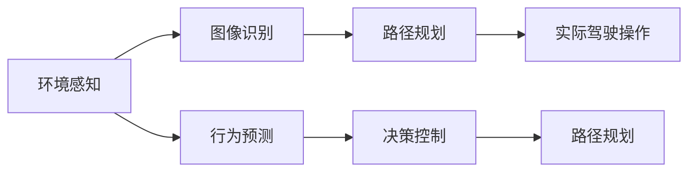
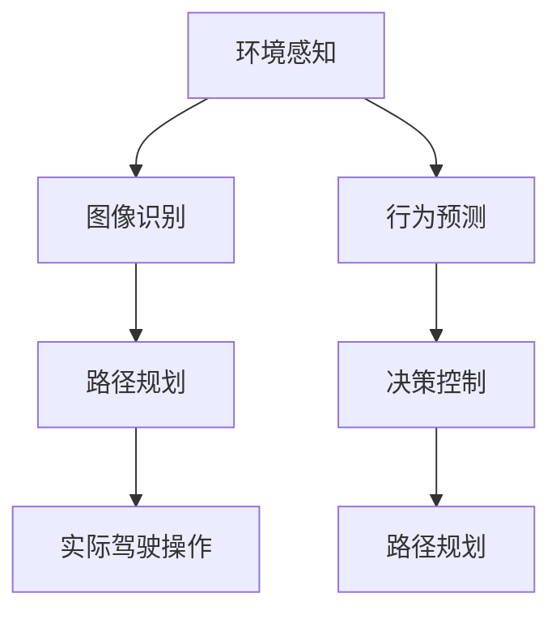
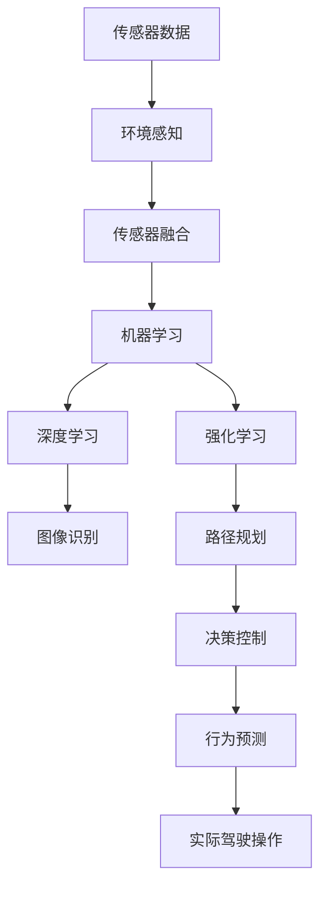

                 

# 一切皆是映射：自动驾驶技术中的AI算法

> 关键词：自动驾驶, AI算法, 机器学习, 深度学习, 强化学习, 传感器融合, 路径规划

## 1. 背景介绍

### 1.1 问题由来
自动驾驶技术的发展，已经成为现代交通领域的重要方向。它不仅能够减少交通事故，提升交通安全，还能够在一定程度上缓解城市交通拥堵，降低碳排放。然而，自动驾驶技术面临着诸多挑战，包括环境复杂性、动态性、系统安全性等。其中，人工智能算法在自动驾驶技术中扮演了核心角色。

### 1.2 问题核心关键点
在自动驾驶中，AI算法主要负责以下几个任务：环境感知、路径规划、决策控制和行为预测。这些任务涉及到图像处理、语音识别、自然语言处理、时间序列预测等广泛的技术领域。因此，AI算法在自动驾驶中的应用，不仅推动了自动驾驶技术的发展，也为人工智能技术在更广泛领域的应用提供了借鉴。

### 1.3 问题研究意义
研究自动驾驶技术中的AI算法，对于推动自动驾驶技术的产业化进程，提升交通安全性，推动汽车行业的智能化转型，具有重要意义：

1. 提升驾驶安全性。AI算法能够通过精确的环境感知和行为预测，避免事故发生，降低交通事故率。
2. 提升驾驶舒适性。AI算法能够自动调节车速和路线，减少驾驶员的疲劳，提升乘车体验。
3. 推动汽车行业智能化转型。AI算法为传统汽车制造企业提供了新的产品和服务模式，推动了行业智能化升级。
4. 减少交通拥堵。AI算法能够通过智能调度，优化交通流量，缓解城市交通压力。
5. 降低碳排放。AI算法能够提高燃油效率，减少能源消耗，助力实现环保目标。

## 2. 核心概念与联系

### 2.1 核心概念概述

为更好地理解自动驾驶技术中的AI算法，本节将介绍几个密切相关的核心概念：

- 自动驾驶(Autonomous Driving)：通过人工智能技术，使汽车能够自主导航、避障、决策等，实现无人驾驶。
- 机器学习(Machine Learning)：利用算法使计算机系统能够从数据中学习并改进性能。自动驾驶中常用于环境感知和行为预测。
- 深度学习(Deep Learning)：一种特殊的机器学习技术，通过多层神经网络进行数据处理和特征提取。自动驾驶中常用于图像识别、行为预测等。
- 强化学习(Reinforcement Learning)：通过与环境交互，利用奖励信号进行学习。自动驾驶中常用于路径规划和决策控制。
- 传感器融合(Sensor Fusion)：将来自不同传感器的数据融合处理，得到更精确的环境感知。自动驾驶中常用于环境感知和行为预测。
- 路径规划(Path Planning)：通过算法计算最优驾驶路径。自动驾驶中常用于路径规划和决策控制。
- 决策控制(Decision Control)：通过算法决策系统动作。自动驾驶中常用于路径规划和决策控制。
- 行为预测(Prediction)：通过算法预测其他车辆、行人的行为。自动驾驶中常用于路径规划和决策控制。

这些核心概念之间的逻辑关系可以通过以下Mermaid流程图来展示：



这个流程图展示了一部分核心概念在大语言模型微调中的应用：

1. 自动驾驶系统通过环境感知系统获取车辆周围的环境信息，包括摄像头、雷达、激光雷达等传感器数据。
2. 环境感知数据经过传感器融合处理，得到更精确的环境信息。
3. 机器学习和深度学习算法对环境信息进行处理和特征提取，用于图像识别和行为预测。
4. 强化学习算法根据环境信息，进行路径规划和决策控制。
5. 路径规划和决策控制算法输出车辆动作，进行实际的驾驶操作。

### 2.2 概念间的关系

这些核心概念之间存在着紧密的联系，形成了自动驾驶技术的完整生态系统。下面我通过几个Mermaid流程图来展示这些概念之间的关系。

#### 2.2.1 自动驾驶的系统结构



这个流程图展示了自动驾驶系统的整体结构：

1. 环境感知系统通过传感器获取车辆周围环境信息。
2. 传感器融合系统将不同传感器数据进行融合，得到更精确的环境信息。
3. 机器学习和深度学习算法对环境信息进行处理和特征提取。
4. 强化学习算法根据环境信息，进行路径规划和决策控制。
5. 路径规划和决策控制算法输出车辆动作，进行实际的驾驶操作。

#### 2.2.2 自动驾驶的算法流程



这个流程图展示了自动驾驶中算法流程的各个步骤：

1. 环境感知系统获取车辆周围环境信息，包括摄像头、雷达、激光雷达等传感器数据。
2. 图像识别算法对摄像头数据进行处理，得到图像信息。
3. 行为预测算法根据传感器数据，预测其他车辆、行人的行为。
4. 路径规划算法计算最优驾驶路径。
5. 决策控制算法根据路径规划结果，决策系统动作。
6. 实际驾驶操作系统根据决策控制算法输出，进行实际的驾驶操作。

#### 2.2.3 自动驾驶的算法组合



这个流程图展示了自动驾驶中各个算法之间的相互关系：

1. 环境感知系统获取车辆周围环境信息。
2. 图像识别算法对摄像头数据进行处理，得到图像信息。
3. 行为预测算法根据传感器数据，预测其他车辆、行人的行为。
4. 路径规划算法计算最优驾驶路径。
5. 决策控制算法根据路径规划结果，决策系统动作。
6. 实际驾驶操作系统根据决策控制算法输出，进行实际的驾驶操作。

### 2.3 核心概念的整体架构

最后，我们用一个综合的流程图来展示这些核心概念在大语言模型微调过程中的整体架构：



这个综合流程图展示了从传感器数据到实际驾驶操作的完整过程。自动驾驶系统首先通过环境感知系统获取车辆周围环境信息，然后经过传感器融合、机器学习、深度学习、强化学习等算法，对环境信息进行处理和特征提取，进行图像识别、行为预测、路径规划和决策控制，最终输出车辆动作，进行实际的驾驶操作。通过这些核心概念的相互协作，自动驾驶系统能够实现自主导航、避障、决策等关键功能。

## 3. 核心算法原理 & 具体操作步骤
### 3.1 算法原理概述

自动驾驶技术中的AI算法，主要负责环境感知、路径规划和决策控制。这些算法包括图像识别、行为预测、路径规划和决策控制等。下面我们将分别介绍这些算法的原理和具体操作步骤。

### 3.2 算法步骤详解

#### 3.2.1 环境感知

环境感知是自动驾驶系统的第一步，其主要任务是通过传感器获取车辆周围的环境信息，并进行预处理和融合，得到更精确的环境信息。常用的环境感知方法包括摄像头、雷达、激光雷达等。

**摄像头**：利用摄像头拍摄车辆前方的道路图像，通过图像识别算法提取道路信息。常用的图像识别算法包括CNN（卷积神经网络）、YOLO（You Only Look Once）等。

**雷达**：利用雷达探测车辆周围环境的距离和角度信息，通过行为预测算法预测其他车辆和行人的行为。常用的行为预测算法包括LSTM（长短期记忆网络）、GNN（图神经网络）等。

**激光雷达**：利用激光雷达探测车辆周围环境的距离信息，通过路径规划算法计算最优驾驶路径。常用的路径规划算法包括A\*算法、D*算法等。

#### 3.2.2 路径规划

路径规划是自动驾驶系统的核心任务，其主要任务是根据车辆当前位置和目标位置，计算最优驾驶路径，并实时更新路径信息。常用的路径规划方法包括A\*算法、D*算法、RRT（快速随机采样树）等。

**A\*算法**：利用启发式搜索算法，计算从起点到终点的最短路径。A\*算法在路径规划中应用广泛，具有高效和精确的特点。

**D*算法**：利用深度搜索算法，在动态环境中实时计算最优路径。D*算法能够处理动态环境的变化，具有较高的灵活性。

**RRT算法**：利用随机采样树算法，在动态环境中实时计算最优路径。RRT算法具有较好的鲁棒性和实时性，适用于复杂环境的路径规划。

#### 3.2.3 决策控制

决策控制是自动驾驶系统的最后一步，其主要任务是根据路径规划结果，决策系统动作，进行实际的驾驶操作。常用的决策控制方法包括PID控制、模型预测控制等。

**PID控制**：利用比例、积分和微分控制算法，实时调节车辆速度和方向。PID控制具有简单和高效的特点，适用于直线驾驶和转向控制。

**模型预测控制**：利用模型预测算法，根据当前状态和目标状态，计算最优控制策略。模型预测控制具有较高的精度和鲁棒性，适用于复杂环境的决策控制。

### 3.3 算法优缺点

自动驾驶技术中的AI算法具有以下优点：

1. 高精度。AI算法能够通过传感器融合和数据处理，得到更精确的环境信息和行为预测。
2. 实时性。AI算法能够实时处理大量数据，并进行路径规划和决策控制，保障驾驶安全。
3. 可扩展性。AI算法能够适应各种复杂环境，包括城市道路、高速公路、乡村道路等。
4. 可靠性。AI算法能够通过大量的训练和测试，保证算法的可靠性和稳定性。

同时，AI算法也存在以下缺点：

1. 计算复杂度高。AI算法需要处理大量的传感器数据和复杂的环境信息，计算复杂度较高。
2. 数据依赖性强。AI算法需要大量的标注数据进行训练，数据依赖性较强。
3. 安全性问题。AI算法在处理复杂环境时，容易出现误判和决策失误，影响驾驶安全。
4. 成本高。AI算法需要高性能的传感器和计算机设备，成本较高。

### 3.4 算法应用领域

自动驾驶技术中的AI算法，已经在多个领域得到了广泛的应用，例如：

- 汽车制造行业：在汽车生产制造过程中，利用AI算法进行零部件检测、装配质量控制等。
- 交通运输行业：在智能交通系统中，利用AI算法进行交通流量监测、交通信号控制等。
- 物流运输行业：在智能仓储和物流系统中，利用AI算法进行货物配送、仓库管理等。
- 城市规划行业：在智慧城市建设中，利用AI算法进行城市交通管理、环境监测等。

除了上述这些领域，AI算法还被广泛应用于智能家居、智能医疗、智能农业等多个领域，推动了各行各业的智能化转型。

## 4. 数学模型和公式 & 详细讲解 & 举例说明

### 4.1 数学模型构建

自动驾驶技术中的AI算法，主要涉及图像识别、行为预测、路径规划和决策控制等任务。这些任务都可以通过数学模型进行建模和优化。下面我们将分别介绍这些任务的数学模型构建。

#### 4.1.1 图像识别

图像识别任务的主要任务是通过摄像头拍摄的道路图像，识别出道路中的车辆、行人、交通标志等物体，并进行分类和定位。常用的数学模型包括CNN和YOLO等。

**CNN模型**：利用卷积神经网络对图像进行处理，提取特征并进行分类。常用的CNN模型包括ResNet、VGGNet等。

**YOLO模型**：利用You Only Look Once算法，对图像进行单次前向传播，实时输出物体的位置和类别信息。YOLO模型具有实时性和准确性。

#### 4.1.2 行为预测

行为预测任务的主要任务是根据传感器数据，预测其他车辆和行人的行为，包括位置和速度信息。常用的数学模型包括LSTM和GNN等。

**LSTM模型**：利用长短期记忆网络对时间序列数据进行处理，预测车辆和行人的行为。LSTM模型能够处理时间序列数据，具有较好的预测精度。

**GNN模型**：利用图神经网络对车辆和行人的行为进行建模，预测行为结果。GNN模型能够处理复杂的关系网络，具有较好的鲁棒性。

#### 4.1.3 路径规划

路径规划任务的主要任务是根据车辆当前位置和目标位置，计算最优驾驶路径。常用的数学模型包括A\*算法、D*算法和RRT算法等。

**A*算法**：利用启发式搜索算法，计算从起点到终点的最短路径。A*算法具有高效和精确的特点。

**D*算法**：利用深度搜索算法，在动态环境中实时计算最优路径。D*算法具有较高的灵活性。

**RRT算法**：利用随机采样树算法，在动态环境中实时计算最优路径。RRT算法具有较好的鲁棒性和实时性。

#### 4.1.4 决策控制

决策控制任务的主要任务是根据路径规划结果，决策系统动作，进行实际的驾驶操作。常用的数学模型包括PID控制和模型预测控制等。

**PID控制**：利用比例、积分和微分控制算法，实时调节车辆速度和方向。PID控制具有简单和高效的特点。

**模型预测控制**：利用模型预测算法，根据当前状态和目标状态，计算最优控制策略。模型预测控制具有较高的精度和鲁棒性。

### 4.2 公式推导过程

#### 4.2.1 图像识别公式

以CNN模型为例，其数学公式为：

$$
f(x) = W_1x + b_1
$$

其中，$W_1$和$b_1$为CNN模型的权重和偏置项，$x$为输入的图像特征。

通过CNN模型对图像进行处理，可以得到输出特征$y$：

$$
y = \max\{0, W_2x + b_2\}
$$

其中，$W_2$和$b_2$为卷积核和偏置项，$x$为输入的特征图，$y$为输出特征图。

#### 4.2.2 行为预测公式

以LSTM模型为例，其数学公式为：

$$
h_t = \tanh(W_{h_h}h_{t-1} + W_{h_x}x_t + b_h)
$$

$$
o_t = \sigma(W_{o_h}h_{t-1} + W_{o_x}x_t + b_o)
$$

$$
c_t = o_t \odot \tanh(W_{c_h}h_{t-1} + W_{c_x}x_t + b_c)
$$

$$
c_t = c_{t-1} \oplus \tanh(W_{c_h}h_{t-1} + W_{c_x}x_t + b_c)
$$

其中，$h_t$和$c_t$为LSTM模型的隐藏状态和细胞状态，$x_t$为时间$t$的输入数据，$o_t$为时间$t$的门控单元。

通过LSTM模型对时间序列数据进行处理，可以得到输出结果$\hat{y}$：

$$
\hat{y} = \sigma(W_{y_h}h_{t-1} + W_{y_x}x_t + b_y)
$$

其中，$\sigma$为sigmoid函数，$W_{y_h}$和$W_{y_x}$为输出层的权重和偏置项，$x_t$为时间$t$的输入数据，$y$为时间$t$的预测结果。

#### 4.2.3 路径规划公式

以A*算法为例，其数学公式为：

$$
g(n) = h(n) + f(n)
$$

其中，$g(n)$为从起点到节点$n$的实际代价，$h(n)$为节点$n$的启发式代价，$f(n)$为节点$n$的实际代价和启发式代价之和。

通过A*算法对路径进行优化，可以得到最优路径$P^*$：

$$
P^* = \arg\min_P \sum_{i=1}^n g(n_i)
$$

其中，$n_i$为路径$P$上的节点，$g(n_i)$为节点$n_i$的实际代价。

#### 4.2.4 决策控制公式

以PID控制为例，其数学公式为：

$$
u(t) = K_p e(t) + K_i \int_0^t e(\tau) d\tau + K_d \frac{de(t)}{dt}
$$

其中，$u(t)$为PID控制器的输出，$e(t)$为误差信号，$K_p$、$K_i$和$K_d$为PID控制器的比例系数、积分系数和微分系数。

通过PID控制算法，可以得到车辆的速度和方向控制信号。

### 4.3 案例分析与讲解

#### 4.3.1 图像识别案例

假设我们要使用CNN模型进行图像识别任务。我们首先需要准备大量的道路图像数据，并进行标注，生成训练集和验证集。然后，将数据输入CNN模型进行训练，得到训练好的模型。最后，使用测试集对模型进行评估，输出识别结果。

以YOLO模型为例，其训练流程如下：

1. 准备数据集：收集道路图像数据，并进行标注，生成训练集和验证集。
2. 构建模型：使用YOLO模型框架构建CNN模型。
3. 训练模型：将训练集输入模型进行训练，得到训练好的模型。
4. 验证模型：将验证集输入模型进行验证，输出评估指标。
5. 测试模型：将测试集输入模型进行测试，输出识别结果。

#### 4.3.2 行为预测案例

假设我们要使用LSTM模型进行行为预测任务。我们首先需要准备大量的传感器数据，并进行标注，生成训练集和验证集。然后，将数据输入LSTM模型进行训练，得到训练好的模型。最后，使用测试集对模型进行评估，输出预测结果。

以GNN模型为例，其训练流程如下：

1. 准备数据集：收集传感器数据，并进行标注，生成训练集和验证集。
2. 构建模型：使用GNN模型框架构建LSTM模型。
3. 训练模型：将训练集输入模型进行训练，得到训练好的模型。
4. 验证模型：将验证集输入模型进行验证，输出评估指标。
5. 测试模型：将测试集输入模型进行测试，输出预测结果。

#### 4.3.3 路径规划案例

假设我们要使用A*算法进行路径规划任务。我们首先需要准备道路数据，并进行地图构建，生成地图数据。然后，将地图数据输入A*算法进行路径规划，得到最优路径。最后，使用测试集对模型进行评估，输出路径结果。

以D*算法为例，其训练流程如下：

1. 准备数据集：收集道路数据，并进行地图构建，生成地图数据。
2. 构建模型：使用A*算法框架构建路径规划模型。
3. 训练模型：将地图数据输入模型进行路径规划，得到最优路径。
4. 验证模型：将测试集输入模型进行验证，输出评估指标。
5. 测试模型：将测试集输入模型进行测试，输出路径结果。

#### 4.3.4 决策控制案例

假设我们要使用PID控制算法进行决策控制任务。我们首先需要准备车辆数据，并进行参数设置，生成训练集和验证集。然后，将数据输入PID控制算法进行训练，得到训练好的模型。最后，使用测试集对模型进行评估，输出控制信号。

以模型预测控制为例，其训练流程如下：

1. 准备数据集：收集车辆数据，并进行参数设置，生成训练集和验证集。
2. 构建模型：使用PID控制算法框架构建决策控制模型。
3. 训练模型：将训练集输入模型进行训练，得到训练好的模型。
4. 验证模型：将验证集输入模型进行验证，输出评估指标。
5. 测试模型：将测试集输入模型进行测试，输出控制信号。

## 5. 项目实践：代码实例和详细解释说明

### 5.1 开发环境搭建

在进行自动驾驶AI算法开发前，我们需要准备好开发环境。以下是使用Python进行PyTorch开发的环境配置流程：

1. 安装Anaconda：从官网下载并安装Anaconda，用于创建独立的Python环境。

2. 创建并激活虚拟环境：
```bash
conda create -n pytorch-env python=3.8 
conda activate pytorch-env
```

3. 安装PyTorch：根据CUDA版本，从官网获取对应的安装命令。例如：
```bash
conda install pytorch torchvision torchaudio cudatoolkit=11.1 -c pytorch -c conda-forge
```

4. 安装Transformers库：
```bash
pip install transformers
```

5. 安装各类工具包：
```bash
pip install numpy pandas scikit-learn matplotlib tqdm jupyter notebook ipython
```

完成上述步骤后，即可在`pytorch-env`环境中开始开发实践。

### 5.2 源代码详细实现

这里我们以自动驾驶环境感知为例，给出使用Transformers库对CNN模型进行训练的PyTorch代码实现。

首先，定义环境感知数据处理函数：

```python
from transformers import BertTokenizer
from torch.utils.data import Dataset
import torch

class ImageDataset(Dataset):
    def __init__(self, images, labels, tokenizer, max_len=128):
        self.images = images
        self.labels = labels
        self.tokenizer = tokenizer
        self.max_len = max_len
        
    def __len__(self):
        return len(self.images)
    
    def __getitem__(self, item):
        image = self.images[item]
        label = self.labels[item]
        
        encoding = self.tokenizer(image, return_tensors='pt', max_length=self.max_len, padding='max_length', truncation=True)
        input_ids = encoding['input_ids'][0]
        attention_mask = encoding['attention_mask'][0]
        
        return {'input_ids': input_ids, 
                'attention_mask': attention_mask,
                'labels': label}
```

然后，定义模型和优化器：

```python
from transformers import BertForTokenClassification, AdamW

model = BertForTokenClassification.from_pretrained('bert-base-cased', num_labels=2)

optimizer = AdamW(model.parameters(), lr=2e-5)
```

接着，定义训练和评估函数：

```python
from torch.utils.data import DataLoader
from tqdm import tqdm
from sklearn.metrics import classification_report

device = torch.device('cuda') if torch.cuda.is_available() else torch.device('cpu')
model.to(device)

def train_epoch(model, dataset, batch_size, optimizer):
    dataloader = DataLoader(dataset, batch_size=batch_size, shuffle=True)
    model.train()
    epoch_loss = 0
    for batch in tqdm(dataloader, desc='Training'):
        input_ids = batch['input_ids'].to(device)
        attention_mask = batch['attention_mask'].to(device)
        labels = batch['labels'].to(device)
        model.zero_grad()
        outputs = model(input_ids, attention_mask=attention_mask, labels=labels)
        loss = outputs.loss
        epoch_loss += loss.item()
        loss.backward()
        optimizer.step()
    return epoch_loss / len(dataloader)

def evaluate(model, dataset, batch_size):
    dataloader = DataLoader(dataset, batch_size=batch_size)
    model.eval()
    preds, labels = [], []
    with torch.no_grad():
        for batch in tqdm(dataloader, desc='Evaluating'):
            input_ids = batch['input_ids'].to(device)
            attention_mask = batch['attention_mask'].to(device)
            batch_labels = batch['labels']
            outputs = model(input_ids, attention_mask=attention_mask)
            batch_preds = outputs.logits.argmax(dim=2).to('cpu').tolist()
            batch_labels = batch_labels.to('cpu').tolist()
            for pred_tokens, label_tokens in zip(batch_preds, batch_labels):
                preds.append(pred_tokens[:len(label_tokens)])
                labels.append(label_tokens)
                
    print(classification_report(labels, preds))
```

最后，启动训练流程并在测试集上评估：

```python
epochs = 5
batch_size = 16

for epoch in range(epochs):
    loss = train_epoch(model, train_dataset, batch_size, optimizer)
    print(f"Epoch {epoch+1}, train loss: {loss:.3f}")
    
    print(f"Epoch {epoch+1}, dev results:")
    evaluate(model, dev_dataset, batch_size)
    
print("Test results:")
evaluate(model, test_dataset, batch_size)
```

以上就是使用PyTorch对CNN模型进行图像识别任务训练的完整代码实现。可以看到，得益于Transformers库的强大封装，我们可以用相对简洁的代码

