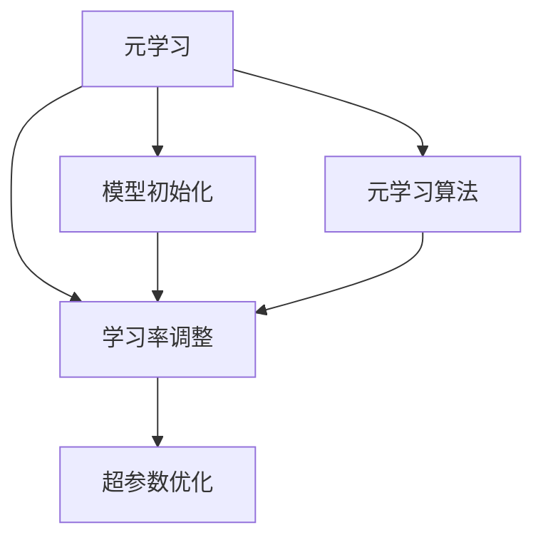
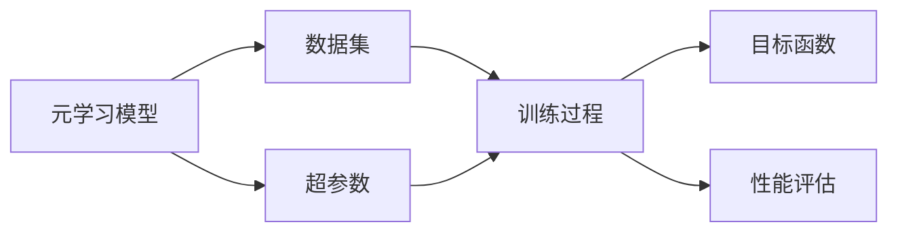
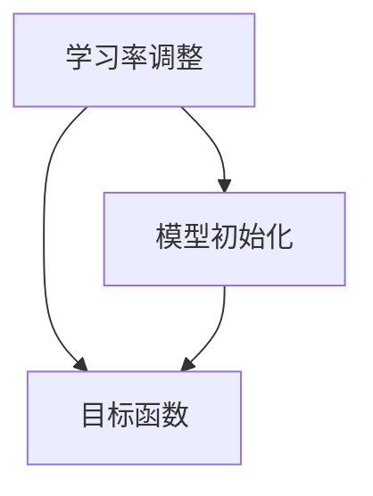
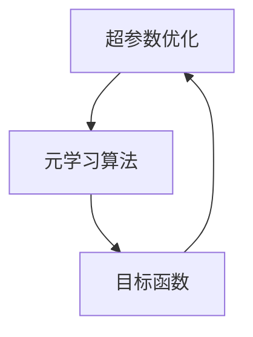
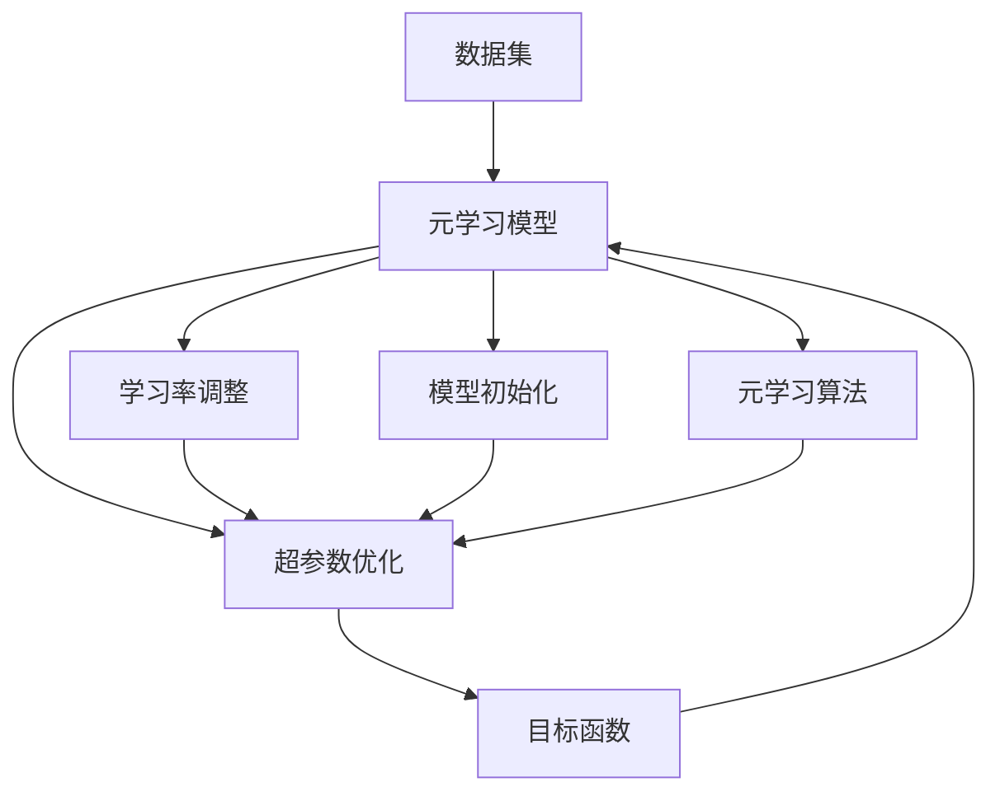

                 

# 一切皆是映射：跟踪AI元学习（Meta-learning）的最新进展

## 1. 背景介绍

### 1.1 问题由来

在机器学习领域，传统的监督学习、无监督学习和强化学习方法在面对新问题时往往需要重新训练模型，效率低下且适应性不足。为了克服这些问题，元学习（Meta-learning）方法应运而生。元学习旨在通过学习如何学习，让模型能够快速适应新问题，减少从头训练的复杂度和成本。这一方法在近年来取得了显著的进展，推动了机器学习研究与应用的飞速发展。

### 1.2 问题核心关键点

元学习的核心在于模型的“快速适应性”和“泛化能力”。通过在少量样本上进行学习，元学习模型能够捕捉不同任务之间的相似性和差异性，从而在新问题上快速表现优异。

## 2. 核心概念与联系

### 2.1 核心概念概述

为更好地理解元学习的本质，本节将介绍几个关键概念：

- **元学习（Meta-learning）**：一种能够快速适应新任务的学习范式。通过在有限的数据上进行学习，元学习模型能够在新的、未见过的任务上表现出色。
- **学习率调整**：元学习模型通常包含一个学习率调整机制，用于在训练过程中动态调整学习率，以适应不同任务的需求。
- **模型初始化**：元学习模型的初始化方法对模型的性能有重要影响。常见的初始化方法包括随机初始化、正交初始化、Xavier初始化等。
- **元学习算法**：元学习算法包括模型无关（model-agnostic）和模型相关（model-based）两大类。模型无关算法使用梯度上升/下降等方法直接对目标函数进行优化；模型相关算法则通过优化目标函数的参数来更新模型结构。
- **超参数优化**：元学习模型的超参数（如学习率、正则化系数等）对模型的性能有重要影响。超参数优化是元学习成功的关键之一。

这些概念之间的逻辑关系可以通过以下Mermaid流程图来展示：



这个流程图展示元学习的核心概念及其之间的关系：

1. 元学习模型通过在少量样本上进行学习。
2. 模型初始化设置模型的初始状态，影响后续学习。
3. 学习率调整在训练过程中动态调节学习率，以适应不同任务。
4. 超参数优化对模型的性能有重要影响。

### 2.2 概念间的关系

这些核心概念之间存在着紧密的联系，形成了元学习的完整生态系统。下面我们通过几个Mermaid流程图来展示这些概念之间的关系。

#### 2.2.1 元学习模型训练流程



这个流程图展示了元学习模型训练的基本流程：

1. 元学习模型接收数据集。
2. 训练过程优化目标函数。
3. 性能评估衡量模型表现。
4. 超参数调节影响训练过程。

#### 2.2.2 学习率调整与模型初始化



这个流程图展示了学习率调整和模型初始化之间的关系：

1. 学习率调整在训练过程中动态调节学习率。
2. 模型初始化设置模型的初始状态。
3. 目标函数用于优化模型的性能。

#### 2.2.3 超参数优化与元学习算法



这个流程图展示了超参数优化与元学习算法之间的关系：

1. 超参数优化调整模型的超参数。
2. 元学习算法优化目标函数。
3. 目标函数衡量模型的性能。

### 2.3 核心概念的整体架构

最后，我们用一个综合的流程图来展示这些核心概念在大模型微调过程中的整体架构：



这个综合流程图展示了从数据到模型的整体流程：

1. 数据集被元学习模型接收。
2. 学习率调整、模型初始化、元学习算法、超参数优化共同参与模型的训练过程。
3. 目标函数衡量模型的性能。

## 3. 核心算法原理 & 具体操作步骤

### 3.1 算法原理概述

元学习的核心思想是通过学习如何学习，使得模型能够快速适应新任务。具体来说，元学习模型通常包含两个阶段：

1. **元训练阶段**：在少量样本上学习模型的初始化参数。
2. **任务特定训练阶段**：在特定任务上微调模型，以获得更好的性能。

### 3.2 算法步骤详解

元学习的具体步骤包括：

1. **数据准备**：收集不同任务的少量标注数据。
2. **元训练**：在元训练阶段，通过优化目标函数学习模型的初始化参数。
3. **任务特定训练**：在特定任务上微调模型，调整模型的参数以适应新任务。
4. **性能评估**：在新任务上评估模型的性能，判断模型是否达到了预期效果。

### 3.3 算法优缺点

元学习的主要优点包括：

- **快速适应新任务**：元学习模型能够通过少量数据快速适应新任务，减少从头训练的复杂度和成本。
- **泛化能力**：元学习模型具有较强的泛化能力，能够在不同任务上表现出色。
- **灵活性**：元学习模型可以根据具体任务调整模型结构和超参数，灵活性高。

然而，元学习也存在一些缺点：

- **计算成本高**：元学习模型需要在多个任务上进行多次训练，计算成本较高。
- **数据依赖性强**：元学习模型的性能依赖于数据的质量和数量，获取高质量标注数据成本高。
- **模型复杂度高**：元学习模型通常包含多个参数，模型结构复杂。

### 3.4 算法应用领域

元学习在多个领域中得到了广泛应用，以下是几个典型的应用场景：

1. **自动驾驶**：在自动驾驶中，元学习模型能够学习不同驾驶环境下的决策策略，快速适应新的驾驶场景。
2. **医疗诊断**：在医疗诊断中，元学习模型能够学习不同病情的诊断策略，快速适应新的患者。
3. **金融风险评估**：在金融风险评估中，元学习模型能够学习不同交易策略的风险评估，快速适应新的交易市场。
4. **游戏智能**：在游戏智能中，元学习模型能够学习不同游戏环境下的策略，快速适应新的游戏场景。

## 4. 数学模型和公式 & 详细讲解 & 举例说明

### 4.1 数学模型构建

假设元学习模型为 $f_{\theta}$，其中 $\theta$ 为模型的参数。假设元训练数据集为 $D=\{(x_i, y_i)\}_{i=1}^N$，其中 $x_i$ 为输入，$y_i$ 为标签。元学习的目标函数为：

$$
L(\theta) = \mathbb{E}_{D}\left[\ell(f_{\theta}(x_i), y_i)\right]
$$

其中 $\ell$ 为损失函数，通常为交叉熵损失。

### 4.2 公式推导过程

元学习的目标函数可以进一步分解为：

$$
L(\theta) = \frac{1}{N}\sum_{i=1}^N \ell(f_{\theta}(x_i), y_i)
$$

其中 $\ell$ 为交叉熵损失：

$$
\ell(f_{\theta}(x_i), y_i) = -y_i\log f_{\theta}(x_i) - (1-y_i)\log (1-f_{\theta}(x_i))
$$

元学习的目标是通过优化目标函数 $L(\theta)$ 来调整模型参数 $\theta$，以最小化模型的预测误差。

### 4.3 案例分析与讲解

假设有一个元学习模型，用于在不同环境中学习控制器的决策策略。训练集为不同环境下的控制器决策数据，目标函数为：

$$
L(\theta) = \mathbb{E}_{D}\left[\ell(f_{\theta}(x_i), y_i)\right]
$$

其中 $x_i$ 为控制器输入，$y_i$ 为控制器决策。目标函数可以进一步细化为：

$$
L(\theta) = \frac{1}{N}\sum_{i=1}^N \ell(f_{\theta}(x_i), y_i)
$$

其中 $\ell$ 为交叉熵损失。

## 5. 项目实践：代码实例和详细解释说明

### 5.1 开发环境搭建

在进行元学习项目开发前，需要准备好开发环境。以下是使用Python进行PyTorch开发的环境配置流程：

1. 安装Anaconda：从官网下载并安装Anaconda，用于创建独立的Python环境。

2. 创建并激活虚拟环境：
```bash
conda create -n meta-learning-env python=3.8 
conda activate meta-learning-env
```

3. 安装PyTorch：根据CUDA版本，从官网获取对应的安装命令。例如：
```bash
conda install pytorch torchvision torchaudio cudatoolkit=11.1 -c pytorch -c conda-forge
```

4. 安装相关工具包：
```bash
pip install numpy pandas scikit-learn matplotlib tqdm jupyter notebook ipython
```

完成上述步骤后，即可在`meta-learning-env`环境中开始元学习项目开发。

### 5.2 源代码详细实现

下面我们以模型无关的梯度上升方法为例，给出使用PyTorch进行元学习的代码实现。

首先，定义元训练数据集和目标函数：

```python
import torch
import torch.nn as nn
import torch.optim as optim
from torch.utils.data import Dataset, DataLoader

class MetaDataset(Dataset):
    def __init__(self, data):
        self.data = data
        self.len = len(data)

    def __len__(self):
        return self.len

    def __getitem__(self, idx):
        return self.data[idx]

def compute_loss(model, x, y):
    output = model(x)
    return nn.CrossEntropyLoss()(output, y)

# 准备元训练数据集
meta_train_data = torch.load('meta_train_data.pkl')
meta_train_loader = DataLoader(meta_train_data, batch_size=32, shuffle=True)

# 定义元学习目标函数
def meta_train_loss(model, train_loader, optimizer, device):
    model.train()
    total_loss = 0
    for i, (x, y) in enumerate(train_loader):
        x, y = x.to(device), y.to(device)
        optimizer.zero_grad()
        loss = compute_loss(model, x, y)
        loss.backward()
        optimizer.step()
        total_loss += loss.item()
    return total_loss / len(train_loader)
```

然后，定义元学习模型和优化器：

```python
class MetaNet(nn.Module):
    def __init__(self):
        super(MetaNet, self).__init__()
        self.linear = nn.Linear(10, 1)

    def forward(self, x):
        return self.linear(x)

# 定义优化器
optimizer = optim.SGD(model.parameters(), lr=0.01, momentum=0.9)
```

接着，定义元训练流程：

```python
# 元训练过程
num_epochs = 50
device = torch.device('cuda' if torch.cuda.is_available() else 'cpu')
model.to(device)
for epoch in range(num_epochs):
    train_loss = meta_train_loss(model, meta_train_loader, optimizer, device)
    print(f'Epoch {epoch+1}, meta training loss: {train_loss:.3f}')
```

以上就是使用PyTorch进行元学习的完整代码实现。可以看到，通过定义目标函数和优化器，可以方便地实现元学习的训练过程。

### 5.3 代码解读与分析

让我们再详细解读一下关键代码的实现细节：

**MetaDataset类**：
- `__init__`方法：初始化数据集和长度。
- `__len__`方法：返回数据集长度。
- `__getitem__`方法：返回指定索引的样本。

**compute_loss函数**：
- 计算模型的输出和标签之间的交叉熵损失。

**meta_train_loss函数**：
- 定义元训练损失函数，在每个批次上计算损失并更新模型参数。

**MetaNet类**：
- 定义元学习模型，包含一个线性层。

**元训练流程**：
- 循环迭代元训练过程，每个epoch更新模型参数。

在实践中，元学习模型的训练和优化还需要根据具体任务进行调整。例如，可以通过引入正则化技术、学习率调整机制、元学习算法等来进一步提升模型性能。

## 6. 实际应用场景

### 6.1 智能制造

在智能制造领域，元学习模型能够快速适应不同的生产任务和工艺流程。通过收集不同生产线的数据，元学习模型可以学习通用的生产策略，并在新生产线上快速应用这些策略。例如，一个元学习模型可以在不同加工工序上学习最优的参数配置，快速适应新加工任务。

### 6.2 金融风控

在金融风控领域，元学习模型能够学习不同交易策略的风险评估模型，快速适应新的交易市场。通过收集不同交易策略的数据，元学习模型可以学习通用的风险评估策略，并在新交易策略上快速应用这些策略。例如，一个元学习模型可以在不同市场环境下学习最优的风险控制参数，快速适应新市场。

### 6.3 医疗诊断

在医疗诊断领域，元学习模型能够学习不同病情的诊断策略，快速适应新的患者。通过收集不同病情的数据，元学习模型可以学习通用的诊断策略，并在新患者上快速应用这些策略。例如，一个元学习模型可以在不同病情下学习最优的诊断参数，快速适应新患者。

### 6.4 游戏智能

在游戏智能领域，元学习模型能够学习不同游戏环境下的策略，快速适应新的游戏场景。通过收集不同游戏环境的数据，元学习模型可以学习通用的游戏策略，并在新游戏场景上快速应用这些策略。例如，一个元学习模型可以在不同游戏环境下学习最优的游戏策略，快速适应新游戏场景。

## 7. 工具和资源推荐

### 7.1 学习资源推荐

为了帮助开发者系统掌握元学习的理论基础和实践技巧，这里推荐一些优质的学习资源：

1. 《元学习算法与应用》系列博文：由元学习专家撰写，深入浅出地介绍了元学习算法的基本原理和经典模型。

2. 《深度学习与元学习》课程：斯坦福大学开设的深度学习课程，涵盖了元学习的基本概念和应用场景，适合初学者入门。

3. 《元学习理论与实践》书籍：本书系统介绍了元学习的理论基础和实际应用，是元学习领域的重要参考书籍。

4. HuggingFace官方文档：包含元学习模型的实现代码和文档，是元学习开发的必备资源。

5. 元学习社区：一个专注于元学习研究的社区，定期发布元学习的最新研究成果和实践经验，适合研究者和从业者交流学习。

通过对这些资源的学习实践，相信你一定能够快速掌握元学习的精髓，并用于解决实际的机器学习问题。

### 7.2 开发工具推荐

高效的开发离不开优秀的工具支持。以下是几款用于元学习开发的常用工具：

1. PyTorch：基于Python的开源深度学习框架，灵活动态的计算图，适合快速迭代研究。

2. TensorFlow：由Google主导开发的开源深度学习框架，生产部署方便，适合大规模工程应用。

3. Ray：用于分布式机器学习、分布式训练和分布式调度的开源框架，适合大规模元学习实验。

4. AutoKeras：自动机器学习工具，可以自动搜索元学习模型的超参数，加速模型训练。

5. Hyperopt：用于超参数优化的开源库，支持贝叶斯优化等高级优化算法。

6. GCP、AWS、阿里云等云平台：提供大规模GPU/TPU资源，适合进行元学习实验和模型训练。

合理利用这些工具，可以显著提升元学习模型的开发效率，加快创新迭代的步伐。

### 7.3 相关论文推荐

元学习在机器学习领域的发展源于学界的持续研究。以下是几篇奠基性的相关论文，推荐阅读：

1. MAML: Meta-Learning with Memory-Based Meta-Learning: An Unified Framework for Meta-Learning Algorithms（MAML论文）：提出MAML算法，首次提出元学习的统一框架。

2. Relation Network: Fast Meta-Learning with Relation Networks（Relation Network论文）：提出关系网络，用于加速元学习模型的训练过程。

3. Meta-Learning as Transfer Learning：将元学习视为转移学习，提出元学习模型在新任务上的转移能力。

4. Bayesian Optimization for Hyperparameter Optimization of Deep Neural Networks（BO-DNN论文）：提出贝叶斯优化算法，用于元学习模型的超参数优化。

5. Learning to Learn by Gradient Descent by Gradient Descent（L2L2论文）：提出学习学习的算法，用于加速元学习模型的训练过程。

这些论文代表元学习的早期发展，对后续研究产生了深远影响。通过学习这些前沿成果，可以帮助研究者把握学科前进方向，激发更多的创新灵感。

除上述资源外，还有一些值得关注的前沿资源，帮助开发者紧跟元学习技术的最新进展，例如：

1. arXiv论文预印本：人工智能领域最新研究成果的发布平台，包括大量尚未发表的前沿工作，学习前沿技术的必读资源。

2. 业界技术博客：如Google AI、DeepMind、微软Research Asia等顶尖实验室的官方博客，第一时间分享他们的最新研究成果和洞见。

3. 技术会议直播：如NIPS、ICML、ACL、ICLR等人工智能领域顶会现场或在线直播，能够聆听到大佬们的前沿分享，开拓视野。

4. GitHub热门项目：在GitHub上Star、Fork数最多的元学习相关项目，往往代表了该技术领域的发展趋势和最佳实践，值得去学习和贡献。

5. 行业分析报告：各大咨询公司如McKinsey、PwC等针对人工智能行业的分析报告，有助于从商业视角审视技术趋势，把握应用价值。

总之，元学习需要开发者保持开放的心态和持续学习的意愿。多关注前沿资讯，多动手实践，多思考总结，必将收获满满的成长收益。

## 8. 总结：未来发展趋势与挑战

### 8.1 总结

本文对元学习的核心概念和最新进展进行了全面系统的介绍。首先阐述了元学习的背景和重要性，明确了元学习在机器学习领域的重要地位。其次，从原理到实践，详细讲解了元学习的数学模型和算法步骤，给出了元学习任务开发的完整代码实例。同时，本文还广泛探讨了元学习模型在智能制造、金融风控、医疗诊断、游戏智能等多个行业领域的应用前景，展示了元学习范式的巨大潜力。此外，本文精选了元学习技术的各类学习资源，力求为读者提供全方位的技术指引。

通过本文的系统梳理，可以看到，元学习在机器学习领域具有广泛的应用前景，能够显著提升模型在新任务上的适应能力和泛化能力。未来，伴随元学习技术的不断发展，其在更多领域的应用将更加广泛，为人工智能技术的发展注入新的动力。

### 8.2 未来发展趋势

展望未来，元学习技术将呈现以下几个发展趋势：

1. **元学习的通用性增强**：未来的元学习模型将能够适应更多领域的任务，从图像、音频、自然语言处理到智能制造等，元学习范式将更加普适。
2. **元学习的自动化程度提高**：元学习模型将自动搜索最优的超参数和模型结构，进一步降低开发成本，加速模型部署。
3. **元学习的动态化**：未来的元学习模型将能够根据数据分布的变化动态调整模型参数，保持模型的性能。
4. **元学习的可解释性增强**：元学习模型将能够解释自身的学习过程和决策逻辑，提高模型的透明性和可解释性。
5. **元学习的跨领域迁移能力增强**：未来的元学习模型将能够跨领域迁移，在不同领域之间共享知识，提高模型的通用性。

以上趋势凸显了元学习技术的广阔前景。这些方向的探索发展，必将进一步提升机器学习系统的性能和应用范围，为人工智能技术的发展带来新的突破。

### 8.3 面临的挑战

尽管元学习技术已经取得了瞩目成就，但在迈向更加智能化、普适化应用的过程中，它仍面临着诸多挑战：

1. **数据依赖性强**：元学习模型的性能依赖于数据的质量和数量，获取高质量标注数据成本高。
2. **计算资源需求高**：元学习模型需要在大规模数据集上进行训练，计算资源需求高。
3. **模型复杂度高**：元学习模型通常包含多个参数，模型结构复杂。
4. **超参数优化难度大**：元学习模型的超参数优化难度大，需要复杂的优化算法和大量实验。
5. **模型鲁棒性不足**：元学习模型面对新任务时，泛化能力可能不足，容易过拟合。
6. **可解释性问题**：元学习模型的决策过程难以解释，缺乏透明性。

### 8.4 研究展望

面对元学习所面临的这些挑战，未来的研究需要在以下几个方面寻求新的突破：

1. **无监督和半监督元学习**：通过无监督和半监督学习方法，减少元学习对标注数据的依赖，利用更多非结构化数据进行训练。
2. **元学习与深度学习结合**：将元学习与深度学习技术结合，提升模型的泛化能力和鲁棒性。
3. **元学习的跨领域迁移能力**：通过跨领域迁移学习，提高元学习模型的通用性和可迁移性。
4. **元学习的自动化优化**：通过自动化优化技术，降低超参数优化和模型训练的复杂度，提高模型效率。
5. **元学习的可解释性增强**：通过解释模型决策过程，增强元学习模型的透明性和可解释性。

这些研究方向将进一步推动元学习技术的发展，为人工智能技术的发展注入新的动力。

## 9. 附录：常见问题与解答

**Q1：元学习是否适用于所有机器学习任务？**

A: 元学习在许多机器学习任务上取得了显著效果，尤其是在数据量较小、任务多样性高的场景下。但对于一些特定领域的任务，如医疗、金融等，元学习模型的性能可能受到数据分布和任务特点的影响。因此，需要根据具体任务选择合适的元学习方法。

**Q2：元学习模型的超参数如何优化？**

A: 元学习模型的超参数优化通常采用贝叶斯优化、随机搜索、网格搜索等方法。这些方法可以自动搜索最优的超参数组合，显著提升模型性能。此外，也可以使用Meta-Learning算法，通过元训练过程优化超参数。

**Q3：元学习模型是否需要大规模计算资源？**

A: 元学习模型通常需要在大规模数据集上进行训练，计算资源需求高。可以通过分布式训练、混合精度训练等技术，优化计算资源的使用。同时，对于一些低计算需求的任务，可以使用轻量级的元学习模型，减少计算资源的消耗。

**Q4：元学习模型如何提高模型的泛化能力？**

A: 提高元学习模型的泛化能力可以从以下几个方面入手：
1. 使用更多的数据进行训练，减少过拟合。
2. 引入正则化技术，如L2正则、Dropout等。
3. 使用动态归一化技术，如LayerNorm、BatchNorm等。
4. 使用更好的初始化方法，如Xavier初始化、随机初始化等。
5. 通过元学习算法，提高模型的鲁棒性和泛化能力。

**Q5：元学习模型如何提高模型的可解释性？**

A: 提高元学习模型的可解释性可以从以下几个方面入手：
1. 使用可解释的元学习算法，如Meta-Learning as Transfer Learning。
2. 使用可视化工具，如TensorBoard、Weights & Biases等，可视化模型的训练过程和决策路径。
3. 使用特征可视化技术，如t-SNE、UMAP等，可视化模型的输入输出特征。
4. 使用模型压缩和剪枝技术，减少模型复杂度，提高模型的透明性。

这些方法可以帮助开发者更好地理解和解释元学习模型的决策过程，提高模型的透明性和可解释性。

---

作者：禅与计算机程序设计艺术 / Zen and the Art of Computer Programming

