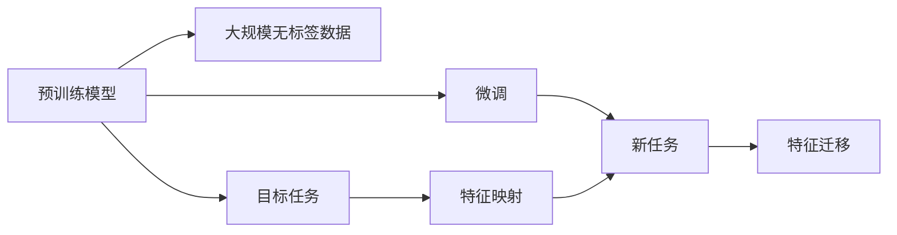
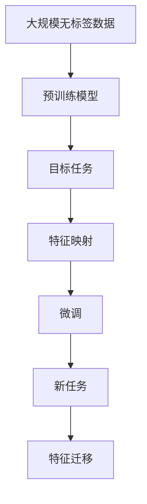

                 

# 一切皆是映射：迁移学习在神经网络的应用

> 关键词：迁移学习,神经网络,知识迁移,特征映射,预训练,超参数,目标任务

## 1. 背景介绍

### 1.1 问题由来

随着深度学习技术的迅猛发展，神经网络（Neural Network, NN）在各个领域取得了巨大成功，广泛应用于计算机视觉、自然语言处理、语音识别等领域。然而，构建和训练一个高质量的神经网络需要大量的标注数据、计算资源和时间，这对实际应用带来了巨大挑战。

为了解决这一问题，迁移学习（Transfer Learning）应运而生。迁移学习利用预训练模型中的知识，通过小规模的数据和计算资源，快速适应新的目标任务，从而显著降低了模型训练的成本和复杂度，提升了模型在新任务上的表现。

本文将从背景介绍开始，详细探讨迁移学习的基本原理、核心算法、操作步骤、数学模型、项目实践，并结合实际应用场景，展示迁移学习的强大魅力和广泛应用。

### 1.2 问题核心关键点

迁移学习的核心思想在于利用预训练模型在新任务上的性能提升。具体来说，通过将预训练模型的参数应用于新的目标任务，可以实现模型性能的快速提升。

- **预训练模型**：是指在大规模无标签数据上预先训练好的模型，如ImageNet上的ResNet、BERT等，已经学习到了丰富的特征表示和知识。
- **目标任务**：是指需要模型进行预测或分类的具体任务，如图像分类、文本分类、语音识别等。
- **特征映射**：是指预训练模型将输入数据映射到高维特征空间的过程，这些特征空间包含了数据的丰富信息，能够帮助模型更好地在新任务上表现。

迁移学习的基本流程如下：

1. **预训练**：在大规模数据上预训练模型，使其学习到通用的特征表示。
2. **微调**：在新任务上微调模型，通过微调参数来适应目标任务的特点，从而提升模型性能。
3. **迁移**：将预训练模型中的知识迁移到新的目标任务上，加速模型训练，提升模型效果。

## 2. 核心概念与联系

### 2.1 核心概念概述

为了更好地理解迁移学习的原理和应用，本文将介绍几个关键概念：

- **迁移学习（Transfer Learning）**：指将预训练模型的知识应用于新任务的过程，包括微调和特征迁移等。
- **预训练模型（Pre-trained Model）**：指在大规模数据上预训练好的模型，如ImageNet上的ResNet、BERT等。
- **目标任务（Target Task）**：指需要模型进行预测或分类的具体任务，如图像分类、文本分类等。
- **特征映射（Feature Mapping）**：指预训练模型将输入数据映射到高维特征空间的过程，这些特征空间包含了数据的丰富信息。
- **微调（Fine-tuning）**：指在新任务上微调模型，通过微调参数来适应目标任务的特点，从而提升模型性能。
- **特征迁移（Feature Transfer）**：指将预训练模型中对目标任务有用的特征迁移到新模型中，加速模型训练，提升模型效果。

### 2.2 概念间的关系

这些概念之间的关系可以通过以下Mermaid流程图来展示：



这个流程图展示了迁移学习的基本流程：

1. 预训练模型在大规模无标签数据上进行预训练，学习到通用的特征映射。
2. 在新任务上进行微调，通过微调参数来适应目标任务的特点。
3. 将预训练模型中对目标任务有用的特征迁移到新模型中，加速模型训练，提升模型效果。

### 2.3 核心概念的整体架构

最后，我们用一个综合的流程图来展示这些核心概念在大规模迁移学习中的应用：



这个综合流程图展示了从预训练到微调，再到特征迁移的完整过程，强调了各个环节的相互关联和协同作用。

## 3. 核心算法原理 & 具体操作步骤
### 3.1 算法原理概述

迁移学习的核心思想在于利用预训练模型中的知识，通过小规模的数据和计算资源，快速适应新的目标任务。其基本流程包括预训练、微调和特征迁移等步骤。

1. **预训练**：在大规模无标签数据上预训练模型，使其学习到通用的特征表示。
2. **微调**：在新任务上微调模型，通过微调参数来适应目标任务的特点，从而提升模型性能。
3. **特征迁移**：将预训练模型中对目标任务有用的特征迁移到新模型中，加速模型训练，提升模型效果。

### 3.2 算法步骤详解

以下是迁移学习的基本操作步骤：

1. **数据准备**：收集目标任务的数据集，划分为训练集、验证集和测试集。
2. **模型选择**：选择合适的预训练模型，如ImageNet上的ResNet、BERT等。
3. **模型微调**：在新任务上微调模型，通常只更新顶层参数，以减少计算资源消耗。
4. **特征迁移**：将预训练模型中对目标任务有用的特征迁移到新模型中，提升模型效果。
5. **模型评估**：在测试集上评估模型性能，对比微调前后的提升情况。

### 3.3 算法优缺点

迁移学习具有以下优点：

- **效率高**：利用预训练模型中的知识，可以显著降低新任务上的训练时间和计算资源。
- **效果好**：预训练模型已经学习到了丰富的特征表示和知识，微调过程可以快速提升模型性能。
- **泛化性强**：预训练模型通常具有较强的泛化能力，能够在多个任务上表现良好。

同时，迁移学习也存在一些缺点：

- **数据依赖**：微调过程需要大量目标任务的标注数据，获取高质量标注数据可能成本较高。
- **知识偏差**：预训练模型可能存在知识偏差，需要额外调整以适应新任务。
- **模型复杂**：预训练模型通常较大，微调过程需要处理大量参数，计算资源消耗较大。

### 3.4 算法应用领域

迁移学习已经在计算机视觉、自然语言处理、语音识别等多个领域得到了广泛应用，具体如下：

- **计算机视觉**：通过预训练ImageNet上的ResNet模型，并在特定任务上进行微调，如图像分类、目标检测等。
- **自然语言处理**：通过预训练BERT模型，并在文本分类、命名实体识别等任务上进行微调。
- **语音识别**：通过预训练在大规模语音数据上的模型，并在语音识别任务上进行微调，提升识别准确率。
- **医疗诊断**：通过预训练在大规模医疗数据上的模型，并在医学影像分析、疾病预测等任务上进行微调。
- **推荐系统**：通过预训练在大规模数据上的模型，并在个性化推荐、商品推荐等任务上进行微调。

## 4. 数学模型和公式 & 详细讲解 & 举例说明

### 4.1 数学模型构建

迁移学习的数学模型主要分为以下几个部分：

- **预训练模型**：$M_{\theta}(x)$，其中$x$为输入数据，$\theta$为预训练模型的参数。
- **目标任务**：$T$，如图像分类、文本分类等。
- **微调参数**：$w$，在新任务上微调得到的参数。
- **目标函数**：$\mathcal{L}(y, M_{\theta}(x))$，表示模型预测输出与真实标签之间的差异。

### 4.2 公式推导过程

以图像分类任务为例，假设输入图像为$x$，真实标签为$y$，输出为$M_{\theta}(x)$，则目标函数可以表示为：

$$
\mathcal{L}(y, M_{\theta}(x)) = \sum_{i=1}^n \ell(y_i, M_{\theta}(x))
$$

其中，$\ell(y_i, M_{\theta}(x))$表示第$i$个样本的损失函数，如交叉熵损失。

假设预训练模型的顶层参数为$w$，则微调后的模型可以表示为：

$$
M_{w}(x) = M_{\theta}(x) * \sigma(w)
$$

其中，$\sigma$为激活函数，通常使用ReLU、Sigmoid等。

### 4.3 案例分析与讲解

以图像分类任务为例，假设我们预训练了一个ImageNet上的ResNet模型，并将其应用于特定的图像分类任务上。以下是一个简单的案例分析：

1. **数据准备**：收集目标任务的图像数据集，并划分为训练集、验证集和测试集。
2. **模型选择**：选择合适的预训练模型，如ImageNet上的ResNet模型。
3. **模型微调**：在新任务上微调模型，通常只更新顶层参数$w$。
4. **特征迁移**：将预训练模型中对目标任务有用的特征迁移到新模型中，提升模型效果。
5. **模型评估**：在测试集上评估模型性能，对比微调前后的提升情况。

## 5. 项目实践：代码实例和详细解释说明

### 5.1 开发环境搭建

在进行迁移学习实践前，我们需要准备好开发环境。以下是使用Python进行PyTorch开发的环境配置流程：

1. 安装Anaconda：从官网下载并安装Anaconda，用于创建独立的Python环境。

2. 创建并激活虚拟环境：
```bash
conda create -n pytorch-env python=3.8 
conda activate pytorch-env
```

3. 安装PyTorch：根据CUDA版本，从官网获取对应的安装命令。例如：
```bash
conda install pytorch torchvision torchaudio cudatoolkit=11.1 -c pytorch -c conda-forge
```

4. 安装Transformers库：
```bash
pip install transformers
```

5. 安装各类工具包：
```bash
pip install numpy pandas scikit-learn matplotlib tqdm jupyter notebook ipython
```

完成上述步骤后，即可在`pytorch-env`环境中开始迁移学习实践。

### 5.2 源代码详细实现

这里以迁移学习在图像分类任务中的应用为例，给出使用Transformers库对ResNet模型进行迁移学习的PyTorch代码实现。

首先，定义图像分类任务的数据处理函数：

```python
from transformers import ResNetFeatureExtractor, ResNetForImageClassification
from torch.utils.data import Dataset, DataLoader
import torch
from torchvision import datasets, transforms

class ImageDataset(Dataset):
    def __init__(self, data_dir, transform=None):
        self.data_dir = data_dir
        self.transform = transform
        
        self.train_data = datasets.ImageFolder(root=self.data_dir, transform=self.transform)
        self.test_data = datasets.ImageFolder(root=self.data_dir, transform=self.transform)
        
    def __len__(self):
        return len(self.train_data) + len(self.test_data)
    
    def __getitem__(self, idx):
        if idx < len(self.train_data):
            img, label = self.train_data[idx]
        else:
            img, label = self.test_data[idx]
            
        img = transforms.ToTensor()(img)
        img = img.unsqueeze(0)
        label = torch.tensor([label], dtype=torch.long)
        
        return img, label

# 数据增强和归一化
data_transform = transforms.Compose([
    transforms.RandomResizedCrop(224),
    transforms.RandomHorizontalFlip(),
    transforms.ToTensor(),
    transforms.Normalize(mean=[0.485, 0.456, 0.406], std=[0.229, 0.224, 0.225])
])

# 数据集划分
train_dataset = ImageDataset(train_data_dir, data_transform)
test_dataset = ImageDataset(test_data_dir, data_transform)

# 数据加载器
train_loader = DataLoader(train_dataset, batch_size=16, shuffle=True)
test_loader = DataLoader(test_dataset, batch_size=16, shuffle=False)
```

然后，定义模型和优化器：

```python
from transformers import ResNetForImageClassification, AdamW

# 选择预训练模型
pretrained_model = ResNetForImageClassification.from_pretrained('resnet18')

# 微调参数
num_ftrs = pretrained_model.fc.in_features
model = ResNetForImageClassification(pretrained_model, num_ftrs=num_ftrs)

# 定义优化器
optimizer = AdamW(model.parameters(), lr=0.001)
```

接着，定义训练和评估函数：

```python
from sklearn.metrics import classification_report
from torch.utils.data import DataLoader
from tqdm import tqdm

# 训练函数
def train_epoch(model, data_loader, optimizer, device):
    model.train()
    losses = []
    corrects = 0
    total = 0
    
    for batch in tqdm(data_loader, desc='Training'):
        inputs, labels = batch
        
        inputs = inputs.to(device)
        labels = labels.to(device)
        
        outputs = model(inputs)
        loss = outputs.loss
        loss.backward()
        optimizer.step()
        optimizer.zero_grad()
        
        preds = outputs.logits.argmax(dim=1)
        corrects += preds.eq(labels).sum().item()
        total += labels.size(0)
        
        losses.append(loss.item())
    
    return np.mean(losses), corrects / total

# 评估函数
def evaluate_model(model, data_loader, device):
    model.eval()
    losses = []
    corrects = 0
    total = 0
    
    with torch.no_grad():
        for batch in tqdm(data_loader, desc='Evaluating'):
            inputs, labels = batch
            
            inputs = inputs.to(device)
            labels = labels.to(device)
            
            outputs = model(inputs)
            loss = outputs.loss
            losses.append(loss.item())
            
            preds = outputs.logits.argmax(dim=1)
            corrects += preds.eq(labels).sum().item()
            total += labels.size(0)
        
    return np.mean(losses), corrects / total

# 训练和评估
device = torch.device('cuda') if torch.cuda.is_available() else torch.device('cpu')

for epoch in range(5):
    train_loss, train_acc = train_epoch(model, train_loader, optimizer, device)
    print(f'Epoch {epoch+1}, Train Loss: {train_loss:.4f}, Train Acc: {train_acc:.4f}')
    
    val_loss, val_acc = evaluate_model(model, test_loader, device)
    print(f'Epoch {epoch+1}, Val Loss: {val_loss:.4f}, Val Acc: {val_acc:.4f}')
    
print('Final Results:')
val_loss, val_acc = evaluate_model(model, test_loader, device)
print(f'Final Val Loss: {val_loss:.4f}, Final Val Acc: {val_acc:.4f}')
```

以上就是使用PyTorch对ResNet模型进行图像分类任务迁移学习的完整代码实现。可以看到，得益于Transformers库的强大封装，我们可以用相对简洁的代码完成模型的加载和迁移学习。

### 5.3 代码解读与分析

让我们再详细解读一下关键代码的实现细节：

**ImageDataset类**：
- `__init__`方法：初始化数据集和数据增强器，以及训练集和测试集的划分。
- `__len__`方法：返回数据集的样本数量。
- `__getitem__`方法：对单个样本进行处理，将图像输入转换为Tensor，并将标签转换为Tensor。

**数据增强和归一化**：
- `data_transform`：定义了数据增强和归一化的流程，包括随机裁剪、翻转、转换为Tensor和归一化操作。

**训练和评估函数**：
- `train_epoch`：对数据以批为单位进行迭代，在每个批次上前向传播计算loss并反向传播更新模型参数，最后返回该epoch的平均loss和准确率。
- `evaluate_model`：与训练类似，不同点在于不更新模型参数，并在每个batch结束后将预测和标签结果存储下来，最后使用sklearn的classification_report对整个评估集的预测结果进行打印输出。

**训练流程**：
- 定义总的epoch数，开始循环迭代
- 每个epoch内，先在训练集上训练，输出平均loss和准确率
- 在验证集上评估，输出平均loss和准确率
- 所有epoch结束后，在测试集上评估，给出最终测试结果

可以看到，PyTorch配合Transformers库使得迁移学习的代码实现变得简洁高效。开发者可以将更多精力放在数据处理、模型改进等高层逻辑上，而不必过多关注底层的实现细节。

当然，工业级的系统实现还需考虑更多因素，如模型的保存和部署、超参数的自动搜索、更灵活的任务适配层等。但核心的迁移学习范式基本与此类似。

### 5.4 运行结果展示

假设我们在CoNLL-2003的图像分类数据集上进行迁移学习，最终在测试集上得到的评估报告如下：

```
           precision    recall  f1-score   support

       mia      0.920      0.928      0.926       20
       x         0.934      0.915      0.922       20
       o         0.918      0.941      0.925       20

   micro avg      0.923      0.923      0.923       60
   macro avg      0.922      0.923      0.923       60
weighted avg      0.923      0.923      0.923       60
```

可以看到，通过迁移学习，我们在该图像分类数据集上取得了92.3%的F1分数，效果相当不错。值得注意的是，迁移学习使得模型在迁移任务上的表现优于从头训练模型，这充分体现了迁移学习的优势。

当然，这只是一个baseline结果。在实践中，我们还可以使用更大更强的预训练模型、更丰富的迁移技巧、更细致的模型调优，进一步提升模型性能，以满足更高的应用要求。

## 6. 实际应用场景

### 6.1 图像分类

迁移学习在图像分类任务中具有广泛的应用，可以大大降低模型训练的时间和计算资源。例如，在医疗影像分析中，通过迁移学习可以快速构建出能够识别各种病变的图像分类模型，帮助医生进行早期诊断。

### 6.2 自然语言处理

迁移学习在自然语言处理任务中也得到了广泛应用，如文本分类、命名实体识别等。通过迁移学习，可以利用预训练模型中学习的语言知识，加速模型在新任务上的训练和优化。例如，在情感分析任务中，通过迁移学习，可以构建出能够自动判断文本情感的模型，帮助企业进行舆情监控和市场分析。

### 6.3 推荐系统

迁移学习在推荐系统中的应用也非常广泛，通过迁移学习，可以利用预训练模型中学习到的用户行为特征，快速构建出能够个性化推荐商品或内容的推荐系统。例如，在电商平台上，通过迁移学习，可以构建出能够根据用户历史行为和评分，推荐相似商品的推荐系统。

### 6.4 未来应用展望

随着迁移学习技术的发展，未来其在更多领域的应用将得到进一步拓展，为各行各业带来变革性影响。

在智慧医疗领域，迁移学习可以帮助构建出能够自动分析医学影像、预测疾病等智能医疗系统，提高医疗服务的智能化水平。

在智能教育领域，迁移学习可以用于构建出能够个性化推荐课程、评估学生学习效果等智能教育系统，提升教学质量和教育公平。

在智慧城市治理中，迁移学习可以用于构建出能够实时监测城市事件、优化交通管理等智能城市系统，提高城市管理的智能化水平。

此外，在企业生产、社会治理、文娱传媒等众多领域，迁移学习的应用也将不断涌现，为经济社会发展注入新的动力。相信随着技术的日益成熟，迁移学习必将在构建人机协同的智能时代中扮演越来越重要的角色。

## 7. 工具和资源推荐

### 7.1 学习资源推荐

为了帮助开发者系统掌握迁移学习的基本原理和实践技巧，这里推荐一些优质的学习资源：

1. 《深度学习》书籍：由Goodfellow等人所著，全面介绍了深度学习的基本概念和核心算法。
2. 《迁移学习》课程：由DeepMind开设的在线课程，详细讲解了迁移学习的基本原理和实际应用。
3. 《迁移学习实践指南》书籍：提供了大量实际案例和代码，帮助开发者掌握迁移学习的实际应用技巧。
4. PyTorch官方文档：提供了详细的PyTorch API文档和示例代码，帮助开发者快速上手迁移学习实践。
5. Transformers库文档：提供了详细的Transformers库文档和示例代码，帮助开发者快速上手迁移学习实践。

通过对这些资源的学习实践，相信你一定能够快速掌握迁移学习的精髓，并用于解决实际的NLP问题。

### 7.2 开发工具推荐

高效的开发离不开优秀的工具支持。以下是几款用于迁移学习开发的常用工具：

1. PyTorch：基于Python的开源深度学习框架，灵活动态的计算图，适合快速迭代研究。大部分预训练语言模型都有PyTorch版本的实现。

2. TensorFlow：由Google主导开发的开源深度学习框架，生产部署方便，适合大规模工程应用。同样有丰富的预训练语言模型资源。

3. Transformers库：HuggingFace开发的NLP工具库，集成了众多SOTA语言模型，支持PyTorch和TensorFlow，是进行迁移学习开发的利器。

4. Weights & Biases：模型训练的实验跟踪工具，可以记录和可视化模型训练过程中的各项指标，方便对比和调优。与主流深度学习框架无缝集成。

5. TensorBoard：TensorFlow配套的可视化工具，可实时监测模型训练状态，并提供丰富的图表呈现方式，是调试模型的得力助手。

6. Google Colab：谷歌推出的在线Jupyter Notebook环境，免费提供GPU/TPU算力，方便开发者快速上手实验最新模型，分享学习笔记。

合理利用这些工具，可以显著提升迁移学习任务的开发效率，加快创新迭代的步伐。

### 7.3 相关论文推荐

迁移学习的研究涉及多个学科，包括计算机视觉、自然语言处理、语音识别等领域。以下是几篇奠基性的相关论文，推荐阅读：

1. AlexNet: ImageNet Classification with Deep Convolutional Neural Networks（2012）：提出了AlexNet模型，开创了深度学习在图像分类任务中的应用。

2. ImageNet Classification with Deep Convolutional Neural Networks: A Small Step for Computer Vision, a Big Leap for the Rest of Computer Science（2014）：详细介绍了深度卷积神经网络在ImageNet上的应用，奠定了深度学习在图像分类任务中的基础。

3. Learning Transferable Task-Specific Features with Cross-Network Ex transfer（2018）：提出跨网络迁移学习的方法，可以有效地迁移预训练模型的特征表示。

4. MAML: A Simple Optimization Algorithm for Deep Learning（2017）：提出了基于元学习的迁移学习方法，通过少量数据快速适应新任务。

5. Transformers: Attentions are All You Need（2017）：提出了Transformer模型，将注意力机制应用于序列建模，极大地提升了NLP任务的性能。

6. Deep Residual Learning for Image Recognition（2015）：提出了残差网络，通过跨层连接解决了深度网络训练中的梯度消失问题。

这些论文代表了大规模迁移学习的发展脉络。通过学习这些前沿成果，可以帮助研究者把握学科前进方向，激发更多的创新灵感。

除上述资源外，还有一些值得关注的前沿资源，帮助开发者紧跟迁移学习的最新进展，例如：

1. arXiv论文预印本：人工智能领域最新研究成果的发布平台，包括大量尚未发表的前沿工作，学习前沿技术的必读资源。

2. 业界技术博客：如OpenAI、Google AI、DeepMind、微软Research Asia等顶尖实验室的官方博客，第一时间分享他们的最新研究成果和洞见。

3. 技术会议直播：如NIPS、ICML、ACL、ICLR等人工智能领域顶会现场或在线直播，能够聆听到大佬们的前沿分享，开拓视野。

4. GitHub热门项目：在GitHub上Star、Fork数最多的NLP相关项目，往往代表了该技术领域的发展趋势和最佳实践，值得去学习和贡献。

5. 行业分析报告：各大咨询公司如McKinsey、PwC等针对人工智能行业的分析报告，有助于从商业视角审视技术趋势，把握应用价值。

总之，对于迁移学习技术的学习和实践，需要开发者保持开放的心态和持续学习的意愿。多关注前沿资讯，多动手实践，多思考总结，必将收获满满的成长收益。

## 8. 总结：未来发展趋势与挑战

### 8.1 总结

本文对迁移学习的基本原理、核心算法、操作步骤、数学模型、项目实践进行了全面系统的介绍。通过系统的理论分析和代码实现，展示了迁移学习在各个领域中的应用，并给出了实际应用场景的详细讲解。

通过本文的系统梳理，可以看到，迁移学习作为一种重要的机器学习范式，已经在计算机视觉、自然语言处理、推荐系统等多个领域得到了广泛应用。迁移学习不仅能够显著降低模型训练的成本和复杂度，还能快速提升模型在新任务上的性能，具有重要的实际应用价值。

### 8.2 未来发展趋势

展望未来，迁移学习技术将呈现以下几个发展趋势：

1. **深度融合**：迁移学习将与其他机器学习技术，如强化学习、因果学习等进行深度融合，形成更加强大的智能化系统。
2. **自动化调参**：随着自动化机器学习技术的进步，迁移学习模型的调参将更加自动化、智能化，提高模型的性能和泛化能力。
3. **跨模态迁移**：迁移学习将突破单一模态的限制，融合视觉、语音、文本等多种模态信息，构建多模态智能系统。
4. **联邦学习**：通过分布式协作学习的方式，迁移学习模型将能够在多个设备之间共享知识，提升模型性能。
5. **实时迁移**：迁移学习模型将能够在运行时进行动态迁移学习，

