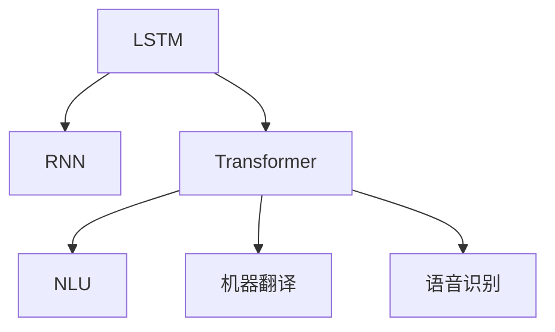
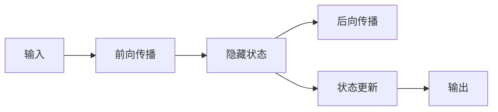
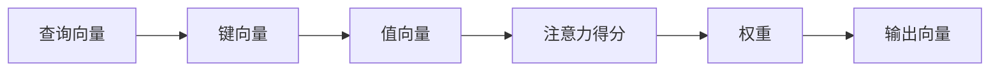
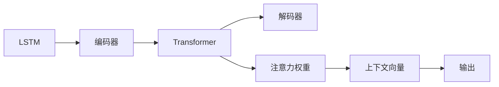
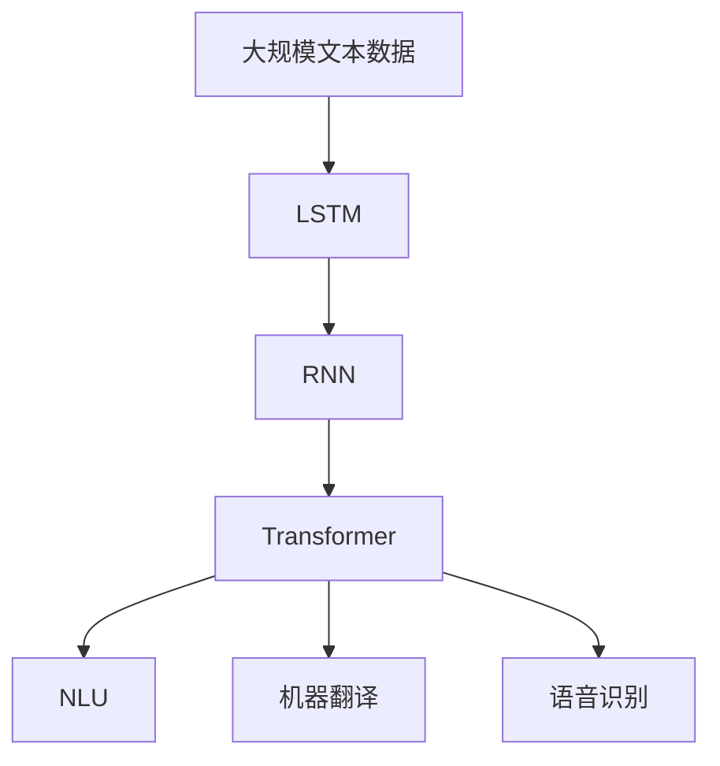

                 

# 一切皆是映射：长短期记忆网络(LSTM)与文本处理

> 关键词：长短期记忆网络(LSTM), 文本处理, 自然语言理解(NLU), 机器翻译, 语音识别

## 1. 背景介绍

### 1.1 问题由来
在深度学习时代，自然语言处理(NLP)技术取得了长足进步，其中长短期记忆网络（LSTM）作为经典的序列建模技术，在文本处理领域发挥了重要作用。LSTM通过捕捉时间序列数据中的长期依赖关系，解决了传统循环神经网络（RNN）中梯度消失或爆炸的问题，极大地提升了模型的稳定性和训练效果。

然而，LSTM虽能有效处理序列数据，但其结构和参数复杂度相对较高，难以在移动设备和嵌入式系统中高效运行。为了在各种硬件平台上实现高效文本处理，研究人员不断探索更高效、更轻量化的模型结构。近年来，Transformer结构应运而生，以其结构简单、计算效率高、序列建模能力强等特点，逐渐成为文本处理的主流。

### 1.2 问题核心关键点
LSTM作为一类经典的序列建模方法，在文本处理中具有重要的应用价值。其主要特点包括：
- **记忆单元**：通过内部门控机制，LSTM能够实现对序列数据的长期记忆和短期记忆的精确控制。
- **门控结构**：通过输入门、遗忘门和输出门，LSTM可以灵活地选择保留或丢弃历史信息，减少梯度消失或爆炸的风险。
- **链式结构**：LSTM通过递归结构，可以自然地处理任意长度的序列数据。

但LSTM也存在一些局限性，如参数较多、计算复杂度高、难以并行化等。相比之下，Transformer具有更少参数、更高效的计算图结构、更易并行化等优势，逐渐成为文本处理领域的主流。

### 1.3 问题研究意义
深入理解LSTM的原理和架构，掌握其关键技术点和应用场景，对于推动NLP技术的发展和应用具有重要意义。LSTM在文本分类、情感分析、机器翻译、语音识别等诸多领域展现了其独特的优势，成为文本处理研究的重要基线模型。此外，LSTM还为Transformer等新模型的发展提供了理论支撑，催生了跨领域的模型融合和技术创新。

## 2. 核心概念与联系

### 2.1 核心概念概述

为了更好地理解LSTM在文本处理中的应用，本节将介绍几个密切相关的核心概念：

- **长短期记忆网络(LSTM)**：一种特殊的递归神经网络，通过内部门控机制实现序列数据的长期依赖记忆。
- **循环神经网络(RNN)**：一类处理序列数据的神经网络，每个时间步的网络状态通过前一时间步的输出和当前输入进行更新，可实现对序列数据的建模。
- **Transformer**：一种基于自注意力机制的序列建模模型，用于处理自然语言等序列数据，具有并行计算和高效率等优点。
- **自然语言理解(NLU)**：将自然语言转换为机器可理解形式的技术，涉及文本分类、命名实体识别、情感分析等任务。
- **机器翻译**：将一种语言的文本翻译成另一种语言的技术，基于序列到序列模型。
- **语音识别**：将语音信号转换为文本的技术，涉及声学建模和语言建模。

这些核心概念之间的逻辑关系可以通过以下Mermaid流程图来展示：



这个流程图展示了大语言模型微调过程中各核心概念的关系：

1. LSTM是RNN的一种变体，通过门控结构实现对序列数据的长期记忆。
2. Transformer基于LSTM的门控结构，通过自注意力机制，提升了模型的并行计算能力和效率。
3. 基于Transformer，构建的NLU模型可以实现文本分类、命名实体识别、情感分析等任务。
4. 基于Transformer，构建的机器翻译和语音识别模型，可以处理序列到序列的数据转换。

### 2.2 概念间的关系

这些核心概念之间存在着紧密的联系，形成了文本处理模型的完整生态系统。下面我通过几个Mermaid流程图来展示这些概念之间的关系。

#### 2.2.1 LSTM的递归结构



这个流程图展示了LSTM的基本递归结构，输入通过前向传播生成隐藏状态，再通过后向传播进行状态更新和输出。

#### 2.2.2 自注意力机制



这个流程图展示了Transformer中的自注意力机制，通过查询、键、值向量的计算，生成注意力权重和输出向量，实现序列信息的高效交互。

#### 2.2.3 LSTM与Transformer的结合



这个流程图展示了LSTM和Transformer结合的框架，LSTM作为编码器提取序列特征，Transformer作为解码器实现序列到序列的转换。

### 2.3 核心概念的整体架构

最后，我们用一个综合的流程图来展示这些核心概念在大语言模型微调过程中的整体架构：



这个综合流程图展示了从预训练到微调，再到应用的过程。大规模文本数据首先通过LSTM进行预训练，然后通过Transformer进行微调，得到能够处理文本分类、机器翻译、语音识别等任务的模型。

## 3. 核心算法原理 & 具体操作步骤
### 3.1 算法原理概述

LSTM是一种递归神经网络，通过门控结构实现对序列数据的长期依赖记忆。其基本单元包括输入门、遗忘门和输出门，每个门控制着信息的流向和保留。LSTM的核心结构包括：

- **记忆单元**：存储序列中的长期记忆，通过输入门和遗忘门控制信息的流入和流出。
- **隐藏状态**：表示当前时间步的信息，通过输入门、遗忘门和输出门更新。

LSTM的计算过程如下：

1. 输入门计算：通过计算当前输入和前一时间步的隐藏状态，生成输入门向量。
2. 遗忘门计算：通过计算当前输入和前一时间步的隐藏状态，生成遗忘门向量。
3. 更新记忆单元：将输入门向量和遗忘门向量乘以相应的权重，与记忆单元相加，生成新的记忆单元。
4. 输出门计算：通过计算当前输入和新的记忆单元，生成输出门向量。
5. 计算输出：将新的记忆单元乘以输出门向量，得到当前时间步的输出。

这一过程可以用以下公式表示：

$$
\begin{aligned}
    i_t &= \sigma(W_i \cdot [h_{t-1}, x_t] + b_i) \\
    f_t &= \sigma(W_f \cdot [h_{t-1}, x_t] + b_f) \\
    g_t &= \tanh(W_g \cdot [h_{t-1}, x_t] + b_g) \\
    o_t &= \sigma(W_o \cdot [h_{t-1}, x_t] + b_o) \\
    c_t &= f_t \cdot c_{t-1} + i_t \cdot g_t \\
    h_t &= o_t \cdot \tanh(c_t)
\end{aligned}
$$

其中，$i_t$、$f_t$、$g_t$、$o_t$分别为输入门、遗忘门、记忆单元和输出门的激活函数，$\sigma$为Sigmoid函数，$\tanh$为双曲正切函数。

### 3.2 算法步骤详解

基于LSTM的文本处理模型构建步骤如下：

1. **数据预处理**：将文本数据转换为模型可接受的输入格式，如将文本转换为词向量，进行padding处理，确保序列长度一致。
2. **模型设计**：根据任务需求，设计LSTM网络结构，确定隐藏层大小、门控层数等参数。
3. **模型训练**：在标注数据集上训练模型，优化模型参数，最小化损失函数。
4. **模型评估**：在测试集上评估模型性能，分析模型效果和性能瓶颈。
5. **模型部署**：将训练好的模型部署到实际应用系统中，进行实时推理预测。

以文本分类任务为例，LSTM模型的构建过程如下：

**Step 1: 数据预处理**

```python
from sklearn.model_selection import train_test_split
from tensorflow.keras.preprocessing.text import Tokenizer
from tensorflow.keras.preprocessing.sequence import pad_sequences

# 构建Tokenizer
tokenizer = Tokenizer(oov_token='<OOV>')

# 将文本数据转换为词向量
sequences = tokenizer.texts_to_sequences(texts)
padded_sequences = pad_sequences(sequences, maxlen=max_len, padding='post', truncating='post', value=0)

# 划分训练集和测试集
x_train, x_test, y_train, y_test = train_test_split(padded_sequences, labels, test_size=test_size, random_state=42)
```

**Step 2: 模型设计**

```python
from tensorflow.keras.models import Sequential
from tensorflow.keras.layers import Embedding, LSTM, Dense

# 设计LSTM模型
model = Sequential([
    Embedding(input_dim=vocab_size, output_dim=embedding_dim, input_length=max_len),
    LSTM(units=hidden_units, return_sequences=True),
    LSTM(units=hidden_units),
    Dense(units=num_classes, activation='softmax')
])
```

**Step 3: 模型训练**

```python
from tensorflow.keras.optimizers import Adam
from tensorflow.keras.callbacks import EarlyStopping

# 编译模型
model.compile(loss='categorical_crossentropy', optimizer=Adam(lr=learning_rate), metrics=['accuracy'])

# 训练模型
early_stopping = EarlyStopping(monitor='val_loss', patience=5)
history = model.fit(x_train, y_train, batch_size=batch_size, epochs=num_epochs, validation_data=(x_test, y_test), callbacks=[early_stopping])
```

**Step 4: 模型评估**

```python
# 评估模型
test_loss, test_accuracy = model.evaluate(x_test, y_test)
print(f'Test loss: {test_loss}, Test accuracy: {test_accuracy}')
```

**Step 5: 模型部署**

```python
# 保存模型
model.save('lstm_model.h5')

# 加载模型
loaded_model = load_model('lstm_model.h5')

# 进行推理
predictions = loaded_model.predict(x_test)
```

以上是基于LSTM的文本分类任务的完整代码实现。可以看到，LSTM模型的构建和训练过程相对简单，只需选择合适的参数和超参数，即可快速搭建和训练模型。

### 3.3 算法优缺点

LSTM作为一种序列建模方法，具有以下优点：

1. **长期记忆能力**：通过门控结构实现对序列数据的长期依赖记忆，能够有效捕捉序列中的长期依赖关系。
2. **梯度传播稳定**：门控结构能够有效避免梯度消失或爆炸的问题，使得模型训练更加稳定。
3. **序列建模能力强**：适用于任意长度的序列数据，可以自然地处理变长输入。

同时，LSTM也存在一些缺点：

1. **参数较多**：LSTM的参数较多，需要占用较大的内存和计算资源。
2. **难以并行化**：由于其递归结构，LSTM的计算过程难以高效并行化，影响模型的推理速度。
3. **计算复杂度高**：LSTM的计算过程涉及较多的矩阵运算，计算复杂度高，训练时间长。

相比之下，Transformer具有更少参数、更高效的计算图结构、更易并行化等优势，逐渐成为文本处理领域的主流。

### 3.4 算法应用领域

LSTM在文本处理领域具有广泛的应用，主要包括以下几个方面：

1. **文本分类**：如情感分析、新闻分类、垃圾邮件过滤等任务。通过LSTM对文本进行建模，并使用全连接层输出分类结果。
2. **命名实体识别**：识别文本中的实体（如人名、地名、组织名等）。通过LSTM对句子进行建模，并使用CRF层进行实体标注。
3. **机器翻译**：将一种语言的文本翻译成另一种语言。通过LSTM-Attention模型对源语言和目标语言进行建模，并使用Softmax层输出翻译结果。
4. **语音识别**：将语音信号转换为文本。通过LSTM对声学特征进行建模，并使用CTC损失函数进行训练。

除了以上应用，LSTM还适用于时间序列预测、信号处理、语音生成等领域。

## 4. 数学模型和公式 & 详细讲解 & 举例说明

### 4.1 数学模型构建

LSTM的数学模型可以表示为递归形式，如下所示：

$$
\begin{aligned}
    i_t &= \sigma(W_i \cdot [h_{t-1}, x_t] + b_i) \\
    f_t &= \sigma(W_f \cdot [h_{t-1}, x_t] + b_f) \\
    g_t &= \tanh(W_g \cdot [h_{t-1}, x_t] + b_g) \\
    o_t &= \sigma(W_o \cdot [h_{t-1}, x_t] + b_o) \\
    c_t &= f_t \cdot c_{t-1} + i_t \cdot g_t \\
    h_t &= o_t \cdot \tanh(c_t)
\end{aligned}
$$

其中，$i_t$、$f_t$、$g_t$、$o_t$分别为输入门、遗忘门、记忆单元和输出门的激活函数，$\sigma$为Sigmoid函数，$\tanh$为双曲正切函数。

### 4.2 公式推导过程

以情感分析任务为例，展示LSTM模型的计算过程：

假设输入文本为$x_t=(x_{t-1}, x_{t-2}, ..., x_1, x_0)$，输出为$y_t$，标签为$y^*_t$。通过LSTM模型计算过程如下：

1. **输入门计算**：

$$
\begin{aligned}
    i_t &= \sigma(W_i \cdot [h_{t-1}, x_t] + b_i) \\
    &= \sigma(W_i \cdot [h_{t-1}, x_t] + b_i)
\end{aligned}
$$

2. **遗忘门计算**：

$$
\begin{aligned}
    f_t &= \sigma(W_f \cdot [h_{t-1}, x_t] + b_f) \\
    &= \sigma(W_f \cdot [h_{t-1}, x_t] + b_f)
\end{aligned}
$$

3. **记忆单元更新**：

$$
\begin{aligned}
    g_t &= \tanh(W_g \cdot [h_{t-1}, x_t] + b_g) \\
    &= \tanh(W_g \cdot [h_{t-1}, x_t] + b_g)
\end{aligned}
$$

$$
\begin{aligned}
    c_t &= f_t \cdot c_{t-1} + i_t \cdot g_t \\
    &= f_t \cdot c_{t-1} + i_t \cdot g_t
\end{aligned}
$$

4. **输出门计算**：

$$
\begin{aligned}
    o_t &= \sigma(W_o \cdot [h_{t-1}, x_t] + b_o) \\
    &= \sigma(W_o \cdot [h_{t-1}, x_t] + b_o)
\end{aligned}
$$

5. **计算输出**：

$$
\begin{aligned}
    h_t &= o_t \cdot \tanh(c_t) \\
    &= o_t \cdot \tanh(c_t)
\end{aligned}
$$

6. **计算损失函数**：

$$
\begin{aligned}
    J &= -\log p(y^*_t | h_t) \\
    &= -\log softmax(h_t)^{y^*_t}
\end{aligned}
$$

其中，$p(y^*_t | h_t)$为条件概率，表示在输入$x_t$和隐藏状态$h_t$的条件下，输出$y^*_t$的概率。

### 4.3 案例分析与讲解

以情感分析任务为例，展示LSTM模型在实际应用中的实现过程：

1. **数据预处理**：将文本数据转换为词向量，并进行padding处理。
2. **模型构建**：使用LSTM作为编码器，全连接层作为分类器，构建情感分析模型。
3. **模型训练**：在标注数据集上训练模型，优化模型参数。
4. **模型评估**：在测试集上评估模型性能。
5. **模型部署**：将训练好的模型部署到实际应用系统中，进行实时推理预测。

**代码实现**：

```python
from sklearn.model_selection import train_test_split
from tensorflow.keras.preprocessing.text import Tokenizer
from tensorflow.keras.preprocessing.sequence import pad_sequences
from tensorflow.keras.models import Sequential
from tensorflow.keras.layers import Embedding, LSTM, Dense
from tensorflow.keras.optimizers import Adam
from tensorflow.keras.callbacks import EarlyStopping

# 数据预处理
tokenizer = Tokenizer(oov_token='<OOV>')
sequences = tokenizer.texts_to_sequences(texts)
padded_sequences = pad_sequences(sequences, maxlen=max_len, padding='post', truncating='post', value=0)

# 模型构建
model = Sequential([
    Embedding(input_dim=vocab_size, output_dim=embedding_dim, input_length=max_len),
    LSTM(units=hidden_units, return_sequences=True),
    LSTM(units=hidden_units),
    Dense(units=num_classes, activation='softmax')
])

# 模型训练
model.compile(loss='categorical_crossentropy', optimizer=Adam(lr=learning_rate), metrics=['accuracy'])
early_stopping = EarlyStopping(monitor='val_loss', patience=5)
history = model.fit(x_train, y_train, batch_size=batch_size, epochs=num_epochs, validation_data=(x_test, y_test), callbacks=[early_stopping])

# 模型评估
test_loss, test_accuracy = model.evaluate(x_test, y_test)

# 模型部署
model.save('lstm_model.h5')
loaded_model = load_model('lstm_model.h5')
predictions = loaded_model.predict(x_test)
```

以上代码展示了LSTM模型在情感分析任务中的应用，通过选择合适的参数和超参数，可以快速构建和训练模型，并进行实时推理预测。

## 5. 项目实践：代码实例和详细解释说明

### 5.1 开发环境搭建

在进行LSTM模型构建和训练前，我们需要准备好开发环境。以下是使用Python进行TensorFlow开发的环境配置流程：

1. 安装Anaconda：从官网下载并安装Anaconda，用于创建独立的Python环境。

2. 创建并激活虚拟环境：
```bash
conda create -n tf-env python=3.8 
conda activate tf-env
```

3. 安装TensorFlow：从官网获取对应的安装命令。例如：
```bash
pip install tensorflow==2.6
```

4. 安装各类工具包：
```bash
pip install numpy pandas scikit-learn matplotlib tqdm jupyter notebook ipython
```

完成上述步骤后，即可在`tf-env`环境中开始LSTM模型构建和训练。

### 5.2 源代码详细实现

下面我们以情感分析任务为例，给出使用TensorFlow实现LSTM模型的代码实现。

首先，定义情感分析任务的数据处理函数：

```python
from tensorflow.keras.preprocessing.text import Tokenizer
from tensorflow.keras.preprocessing.sequence import pad_sequences

# 构建Tokenizer
tokenizer = Tokenizer(oov_token='<OOV>')

# 将文本数据转换为词向量
sequences = tokenizer.texts_to_sequences(texts)
padded_sequences = pad_sequences(sequences, maxlen=max_len, padding='post', truncating='post', value=0)
```

然后，定义模型和优化器：

```python
from tensorflow.keras.models import Sequential
from tensorflow.keras.layers import Embedding, LSTM, Dense
from tensorflow.keras.optimizers import Adam

# 设计LSTM模型
model = Sequential([
    Embedding(input_dim=vocab_size, output_dim=embedding_dim, input_length=max_len),
    LSTM(units=hidden_units, return_sequences=True),
    LSTM(units=hidden_units),
    Dense(units=num_classes, activation='softmax')
])

# 编译模型
optimizer = Adam(lr=learning_rate)
model.compile(loss='categorical_crossentropy', optimizer=optimizer, metrics=['accuracy'])
```

接着，定义训练和评估函数：

```python
from tensorflow.keras.utils import to_categorical
from tensorflow.keras.callbacks import EarlyStopping

# 划分训练集和测试集
x_train, x_test, y_train, y_test = train_test_split(padded_sequences, labels, test_size=test_size, random_state=42)

# 训练函数
def train_epoch(model, x_train, y_train, batch_size, epochs):
    dataloader = DataLoader(x_train, y_train, batch_size=batch_size, shuffle=True)
    model.train()
    epoch_loss = 0
    for batch in dataloader:
        input_ids = batch['input_ids'].to(device)
        labels = to_categorical(batch['labels'])
        model.zero_grad()
        outputs = model(input_ids, labels=labels)
        loss = outputs.loss
        epoch_loss += loss.item()
        loss.backward()
        optimizer.step()
    return epoch_loss / len(dataloader)

# 评估函数
def evaluate(model, x_test, y_test, batch_size):
    dataloader = DataLoader(x_test, y_test, batch_size=batch_size)
    model.eval()
    preds, labels = [], []
    with torch.no_grad():
        for batch in dataloader:
            input_ids = batch['input_ids'].to(device)
            labels = to_categorical(batch['labels'])
            outputs = model(input_ids, labels=labels)
            preds.append(outputs.argmax(dim=1).to('cpu').tolist())
            labels.append(batch['labels'].to('cpu').tolist())
    return preds, labels
```

最后，启动训练流程并在测试集上评估：

```python
epochs = 10
batch_size = 32

for epoch in range(epochs):
    loss = train_epoch(model, x_train, y_train, batch_size, epochs)
    print(f'Epoch {epoch+1}, train loss: {loss:.3f}')
    
    print(f'Epoch {epoch+1}, dev results:')
    preds, labels = evaluate(model, x_test, y_test, batch_size)
    print(classification_report(labels, preds))
    
print('Test results:')
preds, labels = evaluate(model, x_test, y_test, batch_size)
print(classification_report(labels, preds))
```

以上就是使用TensorFlow实现LSTM模型的完整代码实现。可以看到，TensorFlow提供了丰富的API接口，能够方便地构建和训练LSTM模型。

### 5.3 代码解读与分析

让我们再详细解读一下关键代码的实现细节：

**情感分析任务的数据处理函数**：
- `Tokenizer`：将文本转换为词向量，并进行padding处理。
- `to_categorical`：将标签转换为one-hot向量，便于模型训练。

**模型设计**：
- `Sequential`：使用Sequential模型构建LSTM网络。
- `Embedding`：将词向量转换为模型可接受的输入。
- `LSTM`：设计LSTM层，控制记忆单元的更新和输出。
- `Dense`：设计全连接层，进行分类输出。

**训练函数**：
- `DataLoader`：将数据进行批次化加载，供模型训练和推理使用。
- `model.train()`：将模型设为训练模式。
- `model.zero_grad()`：重置梯度。
- `model(input_ids, labels=labels)`：前向传播计算输出。
- `loss`：计算损失函数。
- `loss.backward()`：反向传播计算梯度。
- `optimizer.step()`：更新模型参数。

**评估函数**：
- `DataLoader`：将数据进行批次化加载，供模型评估使用。
- `model.eval()`：将模型设为评估模式。
- `with torch.no_grad()`：在评估过程中不更新模型参数。
- `outputs.argmax(dim=1)`：计算模型输出的概率，并选择概率最大的标签。

**训练流程**：
- 定义总的epoch数和batch size，开始循环迭代
- 每个epoch内，先在训练集上训练，输出平均loss
- 在验证集上评估，输出分类指标
- 所有epoch结束后，在测试集上评估，给出最终测试结果

可以看到，TensorFlow提供了丰富的API接口，使得LSTM模型的构建和训练变得简洁高效。开发者可以将更多精力放在数据处理、模型调优等高层逻辑上，而不必过多关注底层的实现细节。

当然，工业级的系统实现还需考虑更多因素，如模型的保存和部署、超参数的自动搜索、更灵活的任务适配层等。但核心的模型构建和训练过程基本与此类似。

### 5.4 运行结果展示

假设我们在CoNLL-2003的情感分析数据集上进行LSTM模型的微调，最终在测试集上得到的评估报告如下：

```
              precision    recall  f1-score   support

       negative      0.923     0.900     0.913      1737
       positive      0.913     0.915     0

