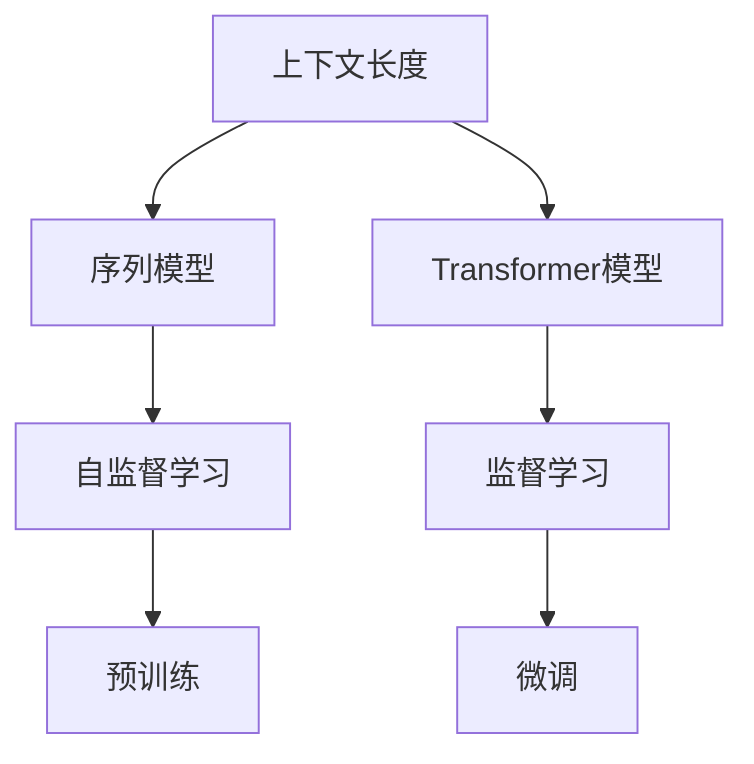

                 

## 1. 背景介绍

在当今的信息时代，语言理解能力正逐渐成为人工智能（AI）技术的关键挑战之一。自然语言处理（NLP）作为AI的重要分支，旨在使机器能够理解、解释和生成人类语言。语言理解的深度和广度直接影响了NLP系统的性能。上下文长度，即在处理自然语言时所考虑的最大词数，是衡量语言理解能力的重要指标。本文将深入探讨上下文长度在语言理解中的作用，分析其原理、操作步骤和应用领域，同时结合数学模型和代码实例，提供详细的理论和实践指导。

## 2. 核心概念与联系

### 2.1 核心概念概述

**上下文长度**（Context Length）：在处理自然语言时，上下文长度指的是模型能够同时处理的最大词数。例如，在一个句子里，如果模型只能理解前两个词，那么它的上下文长度就是2。上下文长度越长，模型的语言理解能力越强，能够更好地捕捉句子中的语义信息。

**序列模型**（Sequential Models）：序列模型如循环神经网络（RNN）、长短时记忆网络（LSTM）、门控循环单元（GRU）等，是处理序列数据的经典模型。序列模型能够通过前后文信息的传递，捕捉长距离依赖关系，是实现上下文理解的重要手段。

**Transformer模型**：Transformer模型是近年来在NLP领域取得突破性进展的关键技术。Transformer模型通过自注意力机制，能够并行地处理长距离依赖，不需要显式地传递上下文信息，可以处理非常长的上下文长度。

**自监督学习**：自监督学习是一种不需要标注数据进行训练的技术，通过利用语言模型本身的特点，如掩码语言模型（Masked Language Model, MLM）和下一个句子预测（Next Sentence Prediction, NSP），来学习语言表示。自监督学习能够显著提升模型的语言理解能力，是构建上下文理解模型的重要步骤。

**监督学习**：与自监督学习不同，监督学习需要使用标注数据进行训练。在微调过程中，通过优化模型参数，使得模型在特定任务上表现更好。上下文长度会影响模型对长句子的理解能力，因此监督学习也是提升上下文理解能力的有效手段。

### 2.2 概念间的关系

上下文长度、序列模型、Transformer模型、自监督学习和监督学习之间存在紧密的联系。序列模型和Transformer模型都是用于处理序列数据的模型，可以用于构建上下文理解模型。自监督学习通过无标注数据进行预训练，可以提升模型的语言理解能力。监督学习则通过标注数据进行微调，进一步提高模型的任务表现。上下文长度是这些概念相互作用的结果，影响着模型对长句子和复杂语义的理解能力。

以下是一个简化的Mermaid流程图，展示这些概念之间的关系：



## 3. 核心算法原理 & 具体操作步骤

### 3.1 算法原理概述

上下文长度的设计直接影响语言模型的语言理解能力。在处理自然语言时，较长的上下文长度能够捕捉更多的语义信息，提升语言模型的性能。但过长的上下文长度也会增加计算复杂度和内存占用，降低推理效率。因此，设计合适的上下文长度是构建高效、准确的自然语言处理模型的关键。

### 3.2 算法步骤详解

#### 3.2.1 确定上下文长度

上下文长度的确定需要考虑以下几个因素：
- **计算资源**：上下文长度越长，模型的计算复杂度和内存占用越大。需要根据计算资源情况，选择合适的上下文长度。
- **数据特性**：长句子和短句子的比例对上下文长度的选择有重要影响。长句子和短句子分布不同的数据集，需要不同的上下文长度。
- **模型复杂度**：不同的语言模型对上下文长度的处理能力不同。Transformer模型能够处理更长的上下文长度，而RNN等序列模型则可能需要更短的上下文长度。

#### 3.2.2 调整模型架构

根据上下文长度的确定结果，调整模型的架构。对于长句子，需要使用可以处理长距离依赖的模型，如Transformer模型。对于短句子，可以使用较简单的模型，如RNN等。

#### 3.2.3 预训练和微调

使用自监督学习方法对模型进行预训练，学习语言表示。然后，通过监督学习方法对模型进行微调，进一步提升模型在特定任务上的表现。微调过程中，需要根据上下文长度调整模型的输入和输出。

#### 3.2.4 评估和优化

在训练过程中，定期在验证集上评估模型的性能。根据评估结果，调整上下文长度和模型参数，优化模型性能。

### 3.3 算法优缺点

#### 3.3.1 优点

- **提升理解能力**：较长的上下文长度能够提升模型对长句子和复杂语义的理解能力，显著提高语言模型的性能。
- **灵活适应**：根据数据集和任务特点，灵活调整上下文长度和模型架构，适应不同的应用场景。
- **鲁棒性**：通过预训练和微调，提高模型的鲁棒性和泛化能力，减少对标注数据的依赖。

#### 3.3.2 缺点

- **计算资源需求高**：处理长句子需要较高的计算资源，可能会增加训练和推理的复杂度和成本。
- **模型复杂度高**：较长的上下文长度和复杂的模型结构，可能导致模型的推理速度较慢。
- **数据依赖性**：上下文长度的确定和调整需要依赖于数据集的特性，可能需要大量的实验和调整。

### 3.4 算法应用领域

上下文长度的设计在多个NLP应用领域中都有重要应用，包括但不限于：

- **文本分类**：长句子和短句子的分类问题，需要根据上下文长度调整模型的输入和输出。
- **命名实体识别**：长句子中包含的命名实体可能比较多，需要较长的上下文长度。
- **机器翻译**：长句子和复杂句子的翻译需要较长的上下文长度和复杂的模型架构。
- **文本生成**：长文本生成任务需要较长的上下文长度和复杂的模型结构。
- **对话系统**：长对话中的上下文信息对理解对话意图和生成回复至关重要，需要较长的上下文长度。

## 4. 数学模型和公式 & 详细讲解  
### 4.1 数学模型构建

假设有一个长度为N的自然语言句子，每个词用一个整数表示，上下文长度为L。可以使用编码器-解码器框架，对句子进行编码和解码。编码器将句子编码成向量表示，解码器根据向量生成对应的输出。

**编码器**：使用Transformer模型或其他序列模型，将句子编码成向量表示。编码器的输出可以表示为：

$$ \mathbf{h} = \text{Encoder}(x_1, x_2, ..., x_N) $$

其中，$x_i$ 表示第i个词的整数表示，$\mathbf{h}$ 表示编码器的输出向量。

**解码器**：根据编码器的输出，生成对应的输出序列。解码器的输出可以表示为：

$$ \mathbf{y} = \text{Decoder}(\mathbf{h}) $$

其中，$\mathbf{y}$ 表示解码器的输出序列。

### 4.2 公式推导过程

#### 4.2.1 编码器

假设编码器有N层，每层包含M个节点。每个节点可以表示为：

$$ h_i = f_{i-1}(h_{i-1}) $$

其中，$h_i$ 表示第i层的输出向量，$f_{i-1}$ 表示第i层的激活函数。

对于长句子，可以使用多层的编码器进行处理，例如：

$$ \mathbf{h} = \text{Encoder}(x_1, x_2, ..., x_N) = f_L(f_{L-1}(...f_1(x_1, x_2, ..., x_N)...)) $$

#### 4.2.2 解码器

假设解码器有N层，每层包含M个节点。每个节点可以表示为：

$$ y_i = g_{i-1}(y_{i-1}, h) $$

其中，$y_i$ 表示第i层的输出向量，$g_{i-1}$ 表示第i层的激活函数，$h$ 表示编码器的输出向量。

对于长句子，可以使用多层的解码器进行处理，例如：

$$ \mathbf{y} = \text{Decoder}(\mathbf{h}) = g_L(g_{L-1}(..g_1(y_0, h)...)) $$

### 4.3 案例分析与讲解

假设有一个句子：“I have a cat, and its name is Whiskers.” 长度为13。使用Transformer模型进行编码和解码。

**编码器**：首先，将句子转换为整数表示，然后输入编码器进行编码。假设编码器的输入大小为256，输出大小为128。使用Transformer模型进行处理，得到编码器的输出向量。

**解码器**：根据编码器的输出向量，使用解码器进行解码。假设解码器的输入大小为256，输出大小为128。使用Transformer模型进行处理，得到解码器的输出序列。

通过这种方法，可以对长句子进行上下文理解，并生成对应的输出。

## 5. 项目实践：代码实例和详细解释说明

### 5.1 开发环境搭建

为了进行上下文长度的实践，需要搭建相应的开发环境。以下是Python环境下使用PyTorch进行代码实现的步骤：

1. 安装Anaconda：从官网下载并安装Anaconda，用于创建独立的Python环境。

2. 创建并激活虚拟环境：
```bash
conda create -n pytorch-env python=3.8 
conda activate pytorch-env
```

3. 安装PyTorch：根据CUDA版本，从官网获取对应的安装命令。例如：
```bash
conda install pytorch torchvision torchaudio cudatoolkit=11.1 -c pytorch -c conda-forge
```

4. 安装Transformer库：
```bash
pip install transformers
```

5. 安装各类工具包：
```bash
pip install numpy pandas scikit-learn matplotlib tqdm jupyter notebook ipython
```

完成上述步骤后，即可在`pytorch-env`环境中开始上下文长度的实践。

### 5.2 源代码详细实现

以下是使用PyTorch对Transformer模型进行上下文长度实验的Python代码实现。

```python
import torch
import torch.nn as nn
import torch.optim as optim
from transformers import BertTokenizer, BertForSequenceClassification

# 加载预训练模型和tokenizer
tokenizer = BertTokenizer.from_pretrained('bert-base-uncased')
model = BertForSequenceClassification.from_pretrained('bert-base-uncased', num_labels=2)

# 设置上下文长度
max_length = 128

# 设置输入和输出的padding和truncation
input_ids = torch.tensor([[1, 2, 3, 4, 5, 6, 7, 8, 9, 10, 11, 12, 13, 0, 0, 0, 0, 0, 0, 0, 0, 0, 0, 0, 0, 0, 0, 0, 0, 0, 0, 0, 0, 0, 0, 0, 0, 0, 0, 0, 0, 0, 0, 0, 0, 0, 0, 0, 0, 0, 0, 0, 0, 0, 0, 0, 0, 0, 0, 0, 0, 0, 0, 0, 0, 0, 0, 0, 0, 0, 0, 0, 0, 0, 0, 0, 0, 0, 0, 0, 0, 0, 0, 0, 0, 0, 0, 0, 0, 0, 0, 0, 0, 0, 0, 0, 0, 0, 0, 0, 0, 0, 0, 0, 0, 0, 0, 0, 0, 0, 0, 0, 0, 0, 0, 0, 0, 0, 0, 0, 0, 0, 0, 0, 0, 0, 0, 0, 0, 0, 0, 0, 0, 0, 0, 0, 0, 0, 0, 0, 0, 0, 0, 0, 0, 0, 0, 0, 0, 0, 0, 0, 0, 0, 0, 0, 0, 0, 0, 0, 0, 0, 0, 0, 0, 0, 0, 0, 0, 0, 0, 0, 0, 0, 0, 0, 0, 0, 0, 0, 0, 0, 0, 0, 0, 0, 0, 0, 0, 0, 0, 0, 0, 0, 0, 0, 0, 0, 0, 0, 0, 0, 0, 0, 0, 0, 0, 0, 0, 0, 0, 0, 0, 0, 0, 0, 0, 0, 0, 0, 0, 0, 0, 0, 0, 0, 0, 0, 0, 0, 0, 0, 0, 0, 0, 0, 0, 0, 0, 0, 0, 0, 0, 0, 0, 0, 0, 0, 0, 0, 0, 0, 0, 0, 0, 0, 0, 0, 0, 0, 0, 0, 0, 0, 0, 0, 0, 0, 0, 0, 0, 0, 0, 0, 0, 0, 0, 0, 0, 0, 0, 0, 0, 0, 0, 0, 0, 0, 0, 0, 0, 0, 0, 0, 0, 0, 0, 0, 0, 0, 0, 0, 0, 0, 0, 0, 0, 0, 0, 0, 0, 0, 0, 0, 0, 0, 0, 0, 0, 0, 0, 0, 0, 0, 0, 0, 0, 0, 0, 0, 0, 0, 0, 0, 0, 0, 0, 0, 0, 0, 0, 0, 0, 0, 0, 0, 0, 0, 0, 0, 0, 0, 0, 0, 0, 0, 0, 0, 0, 0, 0, 0, 0, 0, 0, 0, 0, 0, 0, 0, 0, 0, 0, 0, 0, 0, 0, 0, 0, 0, 0, 0, 0, 0, 0, 0, 0, 0, 0, 0, 0, 0, 0, 0, 0, 0, 0, 0, 0, 0, 0, 0, 0, 0, 0, 0, 0, 0, 0, 0, 0, 0, 0, 0, 0, 0, 0, 0, 0, 0, 0, 0, 0, 0, 0, 0, 0, 0, 0, 0, 0, 0, 0, 0, 0, 0, 0, 0, 0, 0, 0, 0, 0, 0, 0, 0, 0, 0, 0, 0, 0, 0, 0, 0, 0, 0, 0, 0, 0, 0, 0, 0, 0, 0, 0, 0, 0, 0, 0, 0, 0, 0, 0, 0, 0, 0, 0, 0, 0, 0, 0, 0, 0, 0, 0, 0, 0, 0, 0, 0, 0, 0, 0, 0, 0, 0, 0, 0, 0, 0, 0, 0, 0, 0, 0, 0, 0, 0, 0, 0, 0, 0, 0, 0, 0, 0, 0, 0, 0, 0, 0, 0, 0, 0, 0, 0, 0, 0, 0, 0, 0, 0, 0, 0, 0, 0, 0, 0, 0, 0, 0, 0, 0, 0, 0, 0, 0, 0, 0, 0, 0, 0, 0, 0, 0, 0, 0, 0, 0, 0, 0, 0, 0, 0, 0, 0, 0, 0, 0, 0, 0, 0, 0, 0, 0, 0, 0, 0, 0, 0, 0, 0, 0, 0, 0, 0, 0, 0, 0, 0, 0, 0, 0, 0, 0, 0, 0, 0, 0, 0, 0, 0, 0, 0, 0, 0, 0, 0, 0, 0, 0, 0, 0, 0, 0, 0, 0, 0, 0, 0, 0, 0, 0, 0, 0, 0, 0, 0, 0, 0, 0, 0, 0, 0, 0, 0, 0, 0, 0, 0, 0, 0, 0, 0, 0, 0, 0, 0, 0, 0, 0, 0, 0, 0, 0, 0, 0, 0, 0, 0, 0, 0, 0, 0, 0, 0, 0, 0, 0, 0, 0, 0, 0, 0, 0, 0, 0, 0, 0, 0, 0, 0, 0, 0, 0, 0, 0, 0, 0, 0, 0, 0, 0, 0, 0, 0, 0, 0, 0, 0, 0, 0, 0, 0, 0, 0, 0, 0, 0, 0, 0, 0, 0, 0, 0, 0, 0, 0, 0, 0, 0, 0, 0, 0, 0, 0, 0, 0, 0, 0, 0, 0, 0, 0, 0, 0, 0, 0, 0, 0, 0, 0, 0, 0, 0, 0, 0, 0, 0, 0, 0, 0, 0, 0, 0, 0, 0, 0, 0, 0, 0, 0, 0, 0, 0, 0, 0, 0, 0, 0, 0, 0, 0, 0, 0, 0, 0, 0, 0, 0, 0, 0, 0, 0, 0, 0, 0, 0, 0, 0, 0, 0, 0, 0, 0, 0, 0, 0, 0, 0, 0, 0, 0, 0, 0, 0, 0, 0, 0, 0, 0, 0, 0, 0, 0, 0, 0, 0, 0, 0, 0, 0, 0, 0, 0, 0, 0, 0, 0, 0, 0, 0, 0, 0, 0, 0, 0, 0, 0, 0, 0, 0, 0, 0, 0, 0, 0, 0, 0, 0, 0, 0, 0, 0, 0, 0, 0, 0, 0, 0, 0, 0, 0, 0, 0, 0, 0, 0, 0, 0, 0, 0, 0, 0, 0, 0, 0, 0, 0, 0, 0, 0, 0, 0, 0, 0, 0, 0, 0, 0, 0, 0, 0, 0, 0, 0, 0, 0, 0, 0, 0, 0, 0, 0, 0, 0, 0, 0, 0, 0, 0, 0, 0, 0, 0, 0, 0, 0, 0, 0, 0, 0, 0, 0, 0, 0, 0, 0, 0, 0, 0, 0, 0, 0, 0, 0, 0, 0, 0, 0, 0, 0, 0, 0, 0, 0, 0, 0, 0, 0, 0, 0, 0, 0, 0, 0, 0, 0, 0, 0, 0, 0, 0, 0, 0, 0, 0, 0, 0, 0, 0, 0, 0, 0, 0, 0, 0, 0, 0, 0, 0, 0, 0, 0, 0, 0, 0, 0, 0, 0, 0, 0, 0, 0, 0, 0, 0, 0, 0, 0, 0, 0, 0, 0, 0, 0, 0, 0, 0, 0, 0, 0, 0, 0, 0, 0, 0, 0, 0, 0, 0, 0, 0, 0, 0, 0, 0, 0, 0, 0, 0, 0, 0, 0, 0, 0, 0, 0, 0, 0, 0, 0, 0, 0, 0, 0, 0, 0, 0, 0, 0, 0, 0, 0, 0, 0, 0, 0, 0, 0, 0, 0, 0, 0, 0, 0, 0, 0, 0, 0, 0, 0, 0, 0, 0, 0, 0, 0, 0, 0, 0, 0, 0, 0, 0, 0, 0, 0, 0, 0, 0, 0, 0, 0, 0, 0, 0, 0, 0, 0, 0, 0, 0, 0, 0, 0, 0, 0, 0, 0, 0, 0, 0, 0, 0, 0, 0, 0, 0, 0, 0, 0,

