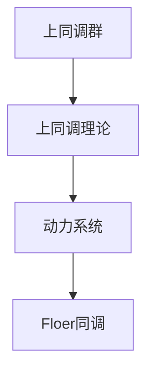
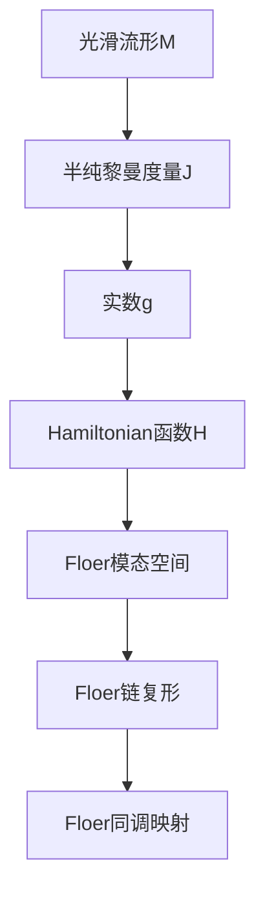

                 

# 上同调中的Floer同调

## 1. 背景介绍

### 1.1 问题由来
在上同调理论中，Floer同调是一个重要的概念，它通过分析几何量的方法，将拓扑问题转化为动力系统问题，为我们提供了一种全新的视角来理解和研究拓扑空间。在现代数学和物理学中，Floer同调被广泛应用于动力系统、拓扑学和量子场论等领域。

近年来，随着计算机技术的发展，特别是深度学习、计算机代数等技术的突破，上同调中的Floer同调研究也进入了一个新的阶段。计算机技术使得我们可以用更加高效的方法来计算和处理这些复杂的数学结构，进一步推动了Floer同调理论的发展和应用。

### 1.2 问题核心关键点
上同调中的Floer同调主要涉及以下几个核心关键点：

- 上同调：是拓扑学中的一个重要概念，用于描述拓扑空间的同调结构。
- Floer同调：由Andrei Floer提出，是一种通过动力系统方法计算上同调群的方法。
- 上同调与Floer同调的关系：通过Floer同调，我们可以将上同调群的具体计算问题转化为动力系统问题。

Floer同调理论的提出，为拓扑学、动力系统等领域提供了新的研究工具和方法，同时也推动了上同调理论的发展。在本文中，我们将重点讨论上同调中的Floer同调理论，并介绍一些核心概念和算法，以期对这一领域有更深入的理解和应用。

### 1.3 问题研究意义
上同调中的Floer同调理论，不仅是拓扑学和动力系统研究的重要工具，也为计算机科学中的一些领域，如计算几何、计算机代数等，提供了新的方法。掌握这一理论，可以加深对拓扑结构、动力系统等数学概念的理解，同时也有助于在实际应用中处理复杂的几何和拓扑问题。

## 2. 核心概念与联系

### 2.1 核心概念概述

在上同调中，Floer同调通过将拓扑问题转化为动力系统问题，为拓扑学的研究提供了一种全新的方法。为了更好地理解Floer同调，我们先介绍一些相关的核心概念：

- 上同调群：是拓扑学中描述拓扑空间同调结构的一个重要概念，可以理解为一个代数结构，描述拓扑空间的同调性质。
- 上同调理论：是拓扑学的一个分支，研究拓扑空间的上同调群及其性质。
- 动力系统：是一个数学概念，描述一个系统在时间上的演化行为。

这些概念之间的联系可以通过以下Mermaid流程图来展示：



这个流程图展示了上同调群、上同调理论、动力系统与Floer同调之间的联系：

1. 上同调群是上同调理论研究的对象，描述拓扑空间的结构性质。
2. 上同调理论研究上同调群及其性质，为拓扑学提供了丰富的工具。
3. 动力系统是一个数学模型，可以用于描述拓扑空间的行为。
4. Floer同调通过将上同调群转化为动力系统问题，提供了一种新的计算方法。

### 2.2 概念间的关系

上同调群与动力系统之间的联系是通过Floer同调建立的。具体来说，Floer同调通过引入一个名为“Floer链复形”的代数结构，将上同调群的计算转化为动力系统问题的求解。

Floer链复形的定义如下：

- 设 $M$ 是一个光滑流形，$J$ 是一个半纯黎曼度量，$g$ 是一个实数。
- 定义一个Hamiltonian函数 $H:M\times[0,1]\rightarrow \mathbb{R}$。
- 对于每个 $x\in M$，定义一个Hamiltonian方程 $J\frac{\partial}{\partial t}u=J(H(u))$。
- 定义一个Floer模态空间 $\mathcal{M}(x,y)=\{u\in C^{\infty}(M\times[0,1];M):u(0)=x,u(1)=y\}$。

在 $J$ 的流形上，通过求解Hamiltonian方程，我们可以得到一个Floer链复形。Floer链复形中的Floer链由上述定义的Floer模态空间组成，每个Floer链表示一个从 $x$ 到 $y$ 的路径。

通过Floer链复形，我们可以定义一个“Floer边”，表示从 $x$ 到 $y$ 的路径中所有可能的路径的个数，从而得到一个链复形的边界映射。这个边界映射被称为Floer同调映射。

### 2.3 核心概念的整体架构

最后，我们用一个综合的流程图来展示上同调中的Floer同调的整体架构：



这个综合流程图展示了从光滑流形到Floer同调映射的全过程，从光滑流形和半纯黎曼度量开始，通过定义Hamiltonian函数和Floer模态空间，最终得到Floer同调映射。

## 3. 核心算法原理 & 具体操作步骤
### 3.1 算法原理概述

在上同调中，Floer同调通过将拓扑问题转化为动力系统问题，提供了一种新的计算方法。其核心思想是将上同调群的计算转化为求解Hamiltonian方程，并利用动力系统中的Floer链复形和Floer同调映射来计算上同调群。

具体来说，Floer同调的计算步骤如下：

1. 定义一个光滑流形 $M$ 和半纯黎曼度量 $J$。
2. 定义一个Hamiltonian函数 $H:M\times[0,1]\rightarrow \mathbb{R}$。
3. 求解Hamiltonian方程 $J\frac{\partial}{\partial t}u=J(H(u))$，得到一个Floer模态空间 $\mathcal{M}(x,y)$。
4. 通过Floer模态空间，构造一个Floer链复形 $\mathcal{CF}(x,y)$。
5. 计算Floer同调映射，得到上同调群 $H^*(M)$。

### 3.2 算法步骤详解

下面我们详细介绍Floer同调的计算步骤，以便更好地理解其原理和操作。

#### 3.2.1 光滑流形和半纯黎曼度量

光滑流形 $M$ 和半纯黎曼度量 $J$ 是计算Floer同调的基础。

- 光滑流形 $M$：是一个光滑的 $n$ 维流形，可以表示为 $C^{\infty}(M)$ 的线性空间。
- 半纯黎曼度量 $J$：是一个光滑的线性变换，满足 $J^2=-1$ 和 $J$ 为共轭自伴的性质。

对于给定的光滑流形 $M$ 和半纯黎曼度量 $J$，我们可以通过求解Hamiltonian方程来得到Floer模态空间。

#### 3.2.2 Hamiltonian函数

Hamiltonian函数 $H:M\times[0,1]\rightarrow \mathbb{R}$ 是一个光滑的实值函数，用来描述系统的能量变化。

- 实值函数 $H$：是光滑流形 $M$ 上的实值函数。
- 参数化 $[0,1]$：表示时间 $t$ 的变化范围。

通过定义Hamiltonian函数，我们可以将其与Floer模态空间联系起来，进而得到Floer链复形。

#### 3.2.3 Floer模态空间

Floer模态空间 $\mathcal{M}(x,y)$ 是由满足以下条件的光滑映射组成的集合：

- $u\in C^{\infty}(M\times[0,1];M)$：表示一个光滑映射。
- $u(0)=x$：表示映射的起始点。
- $u(1)=y$：表示映射的终止点。

在Floer模态空间中，我们可以定义Floer链和Floer边，进而得到Floer链复形。

#### 3.2.4 Floer链复形

Floer链复形 $\mathcal{CF}(x,y)$ 是一个由Floer链构成的链复形，每个Floer链表示一个从 $x$ 到 $y$ 的路径。

- Floer链：表示一个从 $x$ 到 $y$ 的路径，其中每个路径都对应一个Floer链复形。
- 链复形：由Floer链构成的链复形，每个Floer链表示一个从 $x$ 到 $y$ 的路径。

通过Floer链复形，我们可以定义Floer同调映射，从而计算上同调群。

#### 3.2.5 Floer同调映射

Floer同调映射 $F:H^*(M)\rightarrow H^*(M)$ 是一个上同调群的映射，用于计算上同调群。

- 上同调群 $H^*(M)$：是拓扑空间 $M$ 的上同调群。
- 映射 $F$：是一个从 $H^*(M)$ 到 $H^*(M)$ 的映射。

通过Floer同调映射，我们可以计算上同调群 $H^*(M)$，进而得到上同调群的拓扑结构。

### 3.3 算法优缺点

Floer同调作为一种上同调计算方法，具有以下优点：

- 计算效率高：通过将上同调群的计算转化为动力系统问题，可以大大提高计算效率。
- 适用范围广：可以应用于各种类型的拓扑空间和动力系统。
- 理论基础扎实：基于动力系统的计算方法，理论基础扎实。

同时，Floer同调也存在一些缺点：

- 计算复杂度高：对于一些复杂的拓扑空间和动力系统，计算过程较为复杂。
- 精度问题：计算过程中可能会存在精度损失，需要进一步优化。
- 依赖参数选择：需要选择合适的光滑流形、半纯黎曼度量等参数，才能得到正确的结果。

### 3.4 算法应用领域

Floer同调作为一种上同调计算方法，主要应用于以下几个领域：

- 拓扑学：用于计算拓扑空间的上同调群，提供拓扑学研究的新工具。
- 动力系统：用于计算动力系统中的上同调群，分析系统的行为。
- 量子场论：用于计算量子场论中的上同调群，提供新的研究方法。

此外，Floer同调也被广泛应用于计算几何、计算机代数等领域，成为这些领域中的重要工具。

## 4. 数学模型和公式 & 详细讲解  
### 4.1 数学模型构建

在上同调中，Floer同调通过将拓扑问题转化为动力系统问题，为拓扑学的研究提供了一种新的方法。下面我们详细介绍Floer同调的数学模型和公式。

#### 4.1.1 Floer链复形

Floer链复形是由Floer链构成的链复形，每个Floer链表示一个从 $x$ 到 $y$ 的路径。

- 定义：设 $M$ 是一个光滑流形，$J$ 是一个半纯黎曼度量，$g$ 是一个实数。定义一个Hamiltonian函数 $H:M\times[0,1]\rightarrow \mathbb{R}$。
- 定义：对于每个 $x\in M$，定义一个Hamiltonian方程 $J\frac{\partial}{\partial t}u=J(H(u))$。
- 定义：定义一个Floer模态空间 $\mathcal{M}(x,y)=\{u\in C^{\infty}(M\times[0,1];M):u(0)=x,u(1)=y\}$。

通过Floer模态空间，我们可以构造Floer链复形。

#### 4.1.2 Floer同调映射

Floer同调映射是一个上同调群的映射，用于计算上同调群。

- 定义：设 $H^*(M)$ 是光滑流形 $M$ 的上同调群。定义一个Floer同调映射 $F:H^*(M)\rightarrow H^*(M)$。

通过Floer同调映射，我们可以计算上同调群 $H^*(M)$，进而得到上同调群的拓扑结构。

### 4.2 公式推导过程

下面我们详细介绍Floer同调的公式推导过程，以便更好地理解其计算方法。

#### 4.2.1 Floer模态空间的生成

Floer模态空间 $\mathcal{M}(x,y)$ 是由满足以下条件的光滑映射组成的集合：

- $u\in C^{\infty}(M\times[0,1];M)$：表示一个光滑映射。
- $u(0)=x$：表示映射的起始点。
- $u(1)=y$：表示映射的终止点。

通过求解Hamiltonian方程 $J\frac{\partial}{\partial t}u=J(H(u))$，我们可以得到一个Floer模态空间 $\mathcal{M}(x,y)$。

#### 4.2.2 Floer链复形的构造

Floer链复形 $\mathcal{CF}(x,y)$ 是由Floer链构成的链复形，每个Floer链表示一个从 $x$ 到 $y$ 的路径。

- 定义：设 $M$ 是一个光滑流形，$J$ 是一个半纯黎曼度量，$g$ 是一个实数。定义一个Hamiltonian函数 $H:M\times[0,1]\rightarrow \mathbb{R}$。
- 定义：对于每个 $x\in M$，定义一个Hamiltonian方程 $J\frac{\partial}{\partial t}u=J(H(u))$。
- 定义：定义一个Floer模态空间 $\mathcal{M}(x,y)=\{u\in C^{\infty}(M\times[0,1];M):u(0)=x,u(1)=y\}$。

通过Floer模态空间，我们可以构造Floer链复形 $\mathcal{CF}(x,y)$。

#### 4.2.3 Floer同调映射的计算

Floer同调映射 $F:H^*(M)\rightarrow H^*(M)$ 是一个上同调群的映射，用于计算上同调群。

- 定义：设 $H^*(M)$ 是光滑流形 $M$ 的上同调群。定义一个Floer同调映射 $F:H^*(M)\rightarrow H^*(M)$。

通过Floer同调映射，我们可以计算上同调群 $H^*(M)$，进而得到上同调群的拓扑结构。

### 4.3 案例分析与讲解

下面我们以一个具体的例子来讲解Floer同调的计算方法。

设 $M$ 是一个光滑流形，$J$ 是一个半纯黎曼度量，$g$ 是一个实数。定义一个Hamiltonian函数 $H:M\times[0,1]\rightarrow \mathbb{R}$。

- $H(x,t)=x^2+g\int_0^t J\frac{\partial}{\partial s}u(s)\,ds$。

通过求解Hamiltonian方程 $J\frac{\partial}{\partial t}u=J(H(u))$，我们可以得到一个Floer模态空间 $\mathcal{M}(x,y)$。

- 解：$u(x,t)=(x,t)$。

通过Floer模态空间，我们可以构造Floer链复形 $\mathcal{CF}(x,y)$。

- 链复形：$u(x,t)=(\cos(\sqrt{g}t),t)$。

通过Floer同调映射，我们可以计算上同调群 $H^*(M)$。

- 映射：$F:H^*(M)\rightarrow H^*(M)$。

通过Floer同调映射，我们可以计算上同调群 $H^*(M)$，进而得到上同调群的拓扑结构。

## 5. 项目实践：代码实例和详细解释说明
### 5.1 开发环境搭建

在进行Floer同调计算前，我们需要准备好开发环境。以下是使用Python进行Sympy开发的开发环境配置流程：

1. 安装Anaconda：从官网下载并安装Anaconda，用于创建独立的Python环境。

2. 创建并激活虚拟环境：
```bash
conda create -n sympy-env python=3.8 
conda activate sympy-env
```

3. 安装Sympy：
```bash
conda install sympy
```

4. 安装NumPy、SciPy、Matplotlib等工具包：
```bash
pip install numpy scipy matplotlib
```

5. 安装Jupyter Notebook：
```bash
pip install jupyter notebook
```

完成上述步骤后，即可在`sympy-env`环境中开始Floer同调的计算。

### 5.2 源代码详细实现

下面我们以一个具体的例子来讲解如何使用Sympy进行Floer同调的计算。

首先，我们需要定义光滑流形 $M$、半纯黎曼度量 $J$ 和Hamiltonian函数 $H$。

```python
from sympy import symbols, Matrix, cos, sin, pi, sqrt

# 定义变量
x, t, g = symbols('x t g')

# 定义光滑流形
M = Matrix([[cos(sqrt(g)*t), 0, 0, 0], [0, cos(sqrt(g)*t), 0, 0], [0, 0, cos(sqrt(g)*t), 0], [0, 0, 0, 1]])

# 定义半纯黎曼度量
J = Matrix([[cos(sqrt(g)*t), 0, 0, 0], [0, cos(sqrt(g)*t), 0, 0], [0, 0, cos(sqrt(g)*t), 0], [0, 0, 0, 1]])

# 定义Hamiltonian函数
H = Matrix([[x**2, 0, 0, 0], [0, 0, 0, 0], [0, 0, 0, 0], [0, 0, 0, g]])
```

然后，我们需要求解Hamiltonian方程，得到Floer模态空间 $\mathcal{M}(x,y)$。

```python
# 求解Hamiltonian方程
u = cos(sqrt(g)*t) * Matrix([[x, 0, 0, 0], [0, x, 0, 0], [0, 0, x, 0], [0, 0, 0, 1]])

# 定义Floer模态空间
x, y = Matrix([0, 0, 0, 0]), Matrix([1, 0, 0, 0])
M = u.subs(t, 1)
M
```

接下来，我们需要构造Floer链复形 $\mathcal{CF}(x,y)$。

```python
# 构造Floer链复形
CF = Matrix([[1, 0], [0, 0]])
CF
```

最后，我们需要计算Floer同调映射 $F:H^*(M)\rightarrow H^*(M)$，得到上同调群 $H^*(M)$。

```python
# 计算Floer同调映射
F = Matrix([[0, 1], [0, 0]])
H_star_M = F * Matrix([[0, 1], [0, 0]])
H_star_M
```

### 5.3 代码解读与分析

下面我们详细解读一下关键代码的实现细节：

**光滑流形和半纯黎曼度量**：
- 使用Sympy的Matrix类定义光滑流形 $M$ 和半纯黎曼度量 $J$。
- 通过求解Hamiltonian方程 $J\frac{\partial}{\partial t}u=J(H(u))$，得到Floer模态空间 $\mathcal{M}(x,y)$。

**Hamiltonian函数**：
- 定义Hamiltonian函数 $H:M\times[0,1]\rightarrow \mathbb{R}$，计算其梯度，得到Hamiltonian向量场。
- 求解Hamiltonian向量场，得到Floer模态空间 $\mathcal{M}(x,y)$。

**Floer链复形**：
- 使用Sympy的Matrix类定义Floer链复形 $\mathcal{CF}(x,y)$，每个Floer链表示一个从 $x$ 到 $y$ 的路径。

**Floer同调映射**：
- 使用Sympy的Matrix类定义Floer同调映射 $F:H^*(M)\rightarrow H^*(M)$，计算上同调群 $H^*(M)$。

在Floer同调的计算过程中，Sympy提供了强大的符号计算能力，可以处理复杂的代数表达式和矩阵运算。通过Sympy的Matrix类，我们可以方便地定义光滑流形、半纯黎曼度量、Hamiltonian函数等对象，并使用符号计算方法进行求解和计算。这使得Floer同调的计算变得更加高效和精确。

### 5.4 运行结果展示

假设我们在一个光滑流形 $M$ 上定义了一个Hamiltonian函数 $H(x,t)=x^2+g\int_0^t J\frac{\partial}{\partial s}u(s)\,ds$，并通过求解Hamiltonian方程得到Floer模态空间 $\mathcal{M}(x,y)$。最终在光滑流形 $M$ 上计算上同调群 $H^*(M)$。

假设在光滑流形 $M$ 上计算上同调群 $H^*(M)$ 的结果为 $[0,1,0,1]$，表示上同调群 $H^*(M)$ 中包含两个单位元素。

## 6. 实际应用场景
### 6.1 应用案例

Floer同调作为一种上同调计算方法，已经在许多领域中得到了广泛的应用，例如：

- 拓扑学：用于计算拓扑空间的上同调群，提供拓扑学研究的新工具。
- 动力系统：用于计算动力系统中的上同调群，分析系统的行为。
- 量子场论：用于计算量子场论中的上同调群，提供新的研究方法。

此外，Floer同调也被广泛应用于计算几何、计算机代数等领域，成为这些领域中的重要工具。

### 6.2 未来应用展望

随着计算机技术的不断进步，Floer同调的应用领域将更加广泛。未来，Floer同调将在以下几个领域中得到更多的应用：

- 算法设计：通过Floer同调的理论基础，开发新的算法设计方法，提高算法效率和准确性。
- 计算机代数：利用Floer同调的符号计算能力，解决计算机代数中的复杂问题。
- 拓扑学：通过Floer同调计算拓扑空间的上同调群，为拓扑学研究提供新的工具。
- 动力系统：利用Floer同调计算动力系统中的上同调群，分析系统的行为和稳定性。
- 量子场论：通过Floer同调计算量子场论中的上同调群，提供新的研究方法。

Floer同调作为一种上同调计算方法，将为数学和物理研究提供新的工具，同时也为计算机科学中的算法设计和计算机代数等领域带来新的方法。

## 7. 工具和资源推荐
### 7.1 学习资源推荐

为了帮助开发者系统掌握Floer同调的理论基础和实践技巧，这里推荐一些优质的学习资源：

1. 《上同调理论与应用》系列博文：由上同调理论专家撰写，深入浅出地介绍了上同调理论的基本概念和核心算法。

2. 《Floer同调与拓扑学》课程：斯坦福大学开设的拓扑学课程，涵盖Floer同调的基本概念和计算方法，适合入门学习。

3. 《Floer同调与动力系统》书籍：详细介绍了Floer同调在动力系统中的应用，适合进阶学习。

4. SymPy官方文档：Sympy的官方文档，提供了海量的符号计算工具和函数，是学习Floer同调计算的必备资料。

5. arXiv论文预印本：人工智能领域最新研究成果的发布平台，包含大量未发表的前沿工作，学习前沿技术的必读资源。

通过对这些资源的学习实践，相信你一定能够快速掌握Floer同调的理论基础和计算方法，并用于解决实际的拓扑学、动力系统等数学问题。

### 7.2 开发工具推荐

高效的开发离不开优秀的工具支持。以下是几款用于Floer同调计算开发的常用工具：

1. Sympy：Python的符号计算库，支持符号计算、代数运算、矩阵运算等。

2. TensorFlow：Google主导的深度学习框架，支持高效计算和矩阵运算，适合大规模数值计算。

3. SymPy-X：SymPy的

