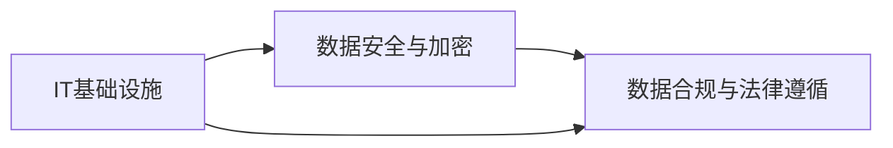
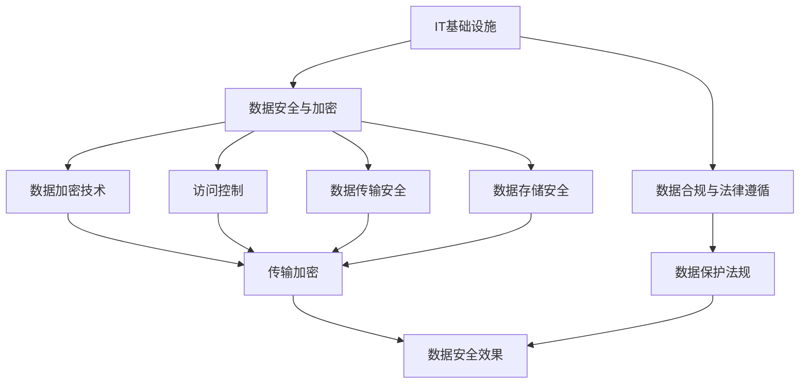

                 

## 1. 背景介绍

### 1.1 问题由来
在当今数字化、信息化飞速发展的时代，IT基础设施的稳定性和安全性对企业运营至关重要。随着数据的爆炸式增长，企业对数据的依赖也日益加深，这就要求企业在信息技术架构的设计、数据的存储和使用、合规性等方面具备更高水平的专业技术能力。然而，许多企业在构建IT基础设施、数据保护和合规方面仍存在诸多挑战，如何高效、可靠地管理这些关键技术，是每个企业必须面对的问题。

### 1.2 问题核心关键点
企业IT基础设施建设、数据安全与合规涉及的关键点包括：
- IT基础设施的设计与维护：从硬件设备的选择、网络架构的规划，到系统配置和升级，企业必须确保IT架构的高效、稳定。
- 数据安全与加密：在数据收集、存储、处理和传输过程中，如何确保数据的机密性、完整性和可用性，避免数据泄露、篡改等安全问题。
- 数据合规与法律遵循：企业必须遵守《数据保护法》、GDPR（通用数据保护条例）等法律法规，确保数据的合法使用。

### 1.3 问题研究意义
提升企业对IT基础设施、数据安全和合规的专业技术能力，对企业的信息安全、业务连续性、法律合规具有重要意义：
- 保障信息安全：通过先进的安全技术和管理措施，确保企业数据的安全，防止数据泄露和损失。
- 维护业务连续性：通过高可用性的基础设施和灾备方案，保证企业业务的稳定运行，提高应对突发事件的能力。
- 符合法规要求：通过数据保护和隐私管理，确保企业遵循相关法律法规，避免法律风险。

## 2. 核心概念与联系

### 2.1 核心概念概述

为更好地理解企业IT基础设施、数据安全和合规要求，本节将介绍几个关键概念：

- IT基础设施：企业运行所需的各种硬件、软件和网络设备，包括服务器、存储、网络、云计算资源等。
- 数据安全与加密：通过数据加密、访问控制等技术手段，保护数据在传输和存储过程中的安全性。
- 数据合规与法律遵循：企业在数据处理过程中必须遵守的法律法规，如《数据保护法》、GDPR等。

### 2.2 核心概念的逻辑关系

企业IT基础设施、数据安全和合规要求的各个核心概念之间的关系可以通过以下Mermaid流程图来展示：



这个流程图展示了几大核心概念之间的联系：
1. IT基础设施是数据安全与合规的基础，提供必要的硬件、软件和网络环境。
2. 数据安全与加密是确保数据安全的重要措施，与数据合规紧密相关。
3. 数据合规要求是企业在数据处理中必须遵循的法律和规范，决定着数据安全措施的实施。

### 2.3 核心概念的整体架构

最后，我们用一个综合的流程图来展示这些核心概念在整个IT基础设施、数据安全和合规要求中的作用：



这个综合流程图展示了从IT基础设施的建设到数据安全与加密的具体技术手段，再到数据合规与法律遵循的整体架构：
1. IT基础设施提供必要的硬件和网络环境。
2. 数据安全与加密包括传输加密、存储安全、访问控制等多种技术手段。
3. 数据合规与法律遵循决定了数据加密和访问控制的具体措施。
4. 最终通过这些技术手段保障数据的安全性，符合法律要求。

## 3. 核心算法原理 & 具体操作步骤

### 3.1 算法原理概述

企业IT基础设施、数据安全和合规要求的实现，本质上是通过一系列技术手段和管理措施来构建和维护一个安全、合规的IT环境。这些技术手段包括但不限于：

- 硬件设备选择与配置：选择高性能、高可用性的服务器和存储设备，合理配置网络架构。
- 软件应用安装与配置：安装并配置操作系统、数据库、应用服务器等，确保软件系统的稳定性和安全性。
- 网络安全防护：通过防火墙、入侵检测、负载均衡等技术，保障网络的安全性和可靠性。
- 数据加密与存储：采用数据加密技术，确保数据在传输和存储过程中的安全性。
- 访问控制与权限管理：通过身份认证、权限控制等技术手段，限制对数据的访问权限。
- 数据备份与恢复：建立完善的数据备份和灾难恢复方案，确保数据在意外情况下的可用性。

### 3.2 算法步骤详解

企业IT基础设施、数据安全和合规要求的实现，一般包括以下几个关键步骤：

**Step 1: 需求分析与规划**

1. 收集企业IT需求：通过与各部门沟通，了解业务系统、数据处理和存储需求。
2. 制定IT基础设施规划：根据需求，设计服务器、存储、网络、云计算资源的配置方案。
3. 制定数据安全和合规策略：根据法律、法规和企业内部数据保护需求，制定数据安全和合规的策略和措施。

**Step 2: 硬件设备选择与配置**

1. 选择高性能服务器和存储设备：根据业务需求和预算，选择合适的服务器、存储设备。
2. 安装和配置硬件：安装操作系统、驱动程序，进行硬件设备配置。
3. 进行网络规划和配置：设计网络拓扑，配置交换机、路由器、防火墙等设备。

**Step 3: 软件应用安装与配置**

1. 安装操作系统和数据库：选择适合的Linux或Windows操作系统，安装数据库管理系统如Oracle、MySQL等。
2. 安装应用服务器：根据业务需求安装Web服务器、中间件服务器等。
3. 配置安全策略：安装并配置防病毒软件、入侵检测系统等。

**Step 4: 网络安全防护**

1. 安装防火墙和入侵检测系统：保护网络边界安全。
2. 配置负载均衡器：提高网络系统的可靠性和可用性。
3. 部署DDoS防护设备：防范网络攻击。

**Step 5: 数据加密与存储**

1. 采用传输加密技术：如SSL/TLS协议，保护数据在网络传输过程中的安全性。
2. 采用存储加密技术：对存储在数据库中的敏感数据进行加密。
3. 配置访问控制：设置权限，确保只有授权人员可以访问数据库。

**Step 6: 数据备份与恢复**

1. 建立数据备份方案：定期备份重要数据。
2. 配置灾难恢复计划：确保在发生灾难时能够快速恢复数据和系统。
3. 进行数据恢复测试：定期测试备份数据的恢复过程。

### 3.3 算法优缺点

企业IT基础设施、数据安全和合规要求的实现，有以下优点和缺点：

**优点：**
1. 提高数据安全性：通过加密、访问控制等措施，有效保障数据的安全。
2. 增强业务连续性：通过灾备方案，保障业务在突发事件下的稳定性。
3. 符合法规要求：确保数据处理符合相关法律法规，避免法律风险。

**缺点：**
1. 成本较高：硬件、软件和网络设备的采购和配置成本较高。
2. 技术复杂：需要专业技术人员进行维护和配置。
3. 更新迭代快：技术发展迅速，需要不断更新和升级IT基础设施。

### 3.4 算法应用领域

基于IT基础设施、数据安全和合规要求的技术，在众多行业和企业中得到了广泛应用，如：

- 金融行业：在金融数据处理、支付系统、客户信息管理等方面，需要保障数据的安全和合规。
- 医疗行业：在电子病历管理、患者隐私保护、医疗设备监测等方面，需要确保数据的隐私和安全。
- 政府部门：在公共服务、数据公开、政府信息管理等方面，需要符合数据保护法规和政策要求。
- 互联网公司：在用户数据保护、数据存储和传输安全等方面，需要采取严格的数据安全措施。
- 教育机构：在学生数据管理、教师隐私保护、在线课程开发等方面，需要遵循数据保护法规。

## 4. 数学模型和公式 & 详细讲解 & 举例说明

### 4.1 数学模型构建

在企业IT基础设施、数据安全和合规要求的实现过程中，涉及的数学模型主要包括：

- 数据加密模型：如AES、RSA等对称和非对称加密算法。
- 访问控制模型：如基于角色的访问控制（RBAC）模型。
- 数据备份与恢复模型：如备份策略和恢复时间目标（RTO）模型。

### 4.2 公式推导过程

下面以数据加密模型为例，介绍常见的对称加密算法AES的加密和解密过程：

**加密过程**：
1. 初始化密钥：将明文数据转化为字节序列，使用密钥K进行初始化。
2. 轮密钥生成：生成轮密钥，用于后续的加密过程。
3. 进行轮加密：将明文数据分块，每块128位，进行多轮加密，每轮使用不同的轮密钥。
4. 最终输出密文：将多轮加密后的结果输出，即密文。

**解密过程**：
1. 初始化密钥：将密文数据转化为字节序列，使用密钥K进行初始化。
2. 轮密钥生成：生成轮密钥，用于后续的解密过程。
3. 进行轮解密：将密文数据分块，每块128位，进行多轮解密，每轮使用不同的轮密钥。
4. 最终输出明文：将多轮解密后的结果输出，即明文。

### 4.3 案例分析与讲解

假设企业需要传输一个包含敏感信息的文档，可以使用AES算法进行加密。以下是使用Python进行AES加密和解密的过程：

```python
from Crypto.Cipher import AES
import base64

def encrypt(data, key):
    iv = AES.new(key, AES.MODE_CBC).iv
    ciphertext = AES.new(key, AES.MODE_CBC).encrypt(iv + data.encode())
    return base64.b64encode(iv + ciphertext).decode()

def decrypt(ciphertext, key):
    ciphertext = base64.b64decode(ciphertext)
    iv = ciphertext[:16]
    ciphertext = ciphertext[16:]
    plaintext = AES.new(key, AES.MODE_CBC, iv).decrypt(ciphertext)
    return plaintext.decode()

# 假设要加密的文档内容
plaintext = "This is a sensitive document."
# 假设使用AES算法，密钥长度为256位
key = b'SensitiveDocumentKey'

# 加密
ciphertext = encrypt(plaintext, key)
print("Encrypted text:", ciphertext)

# 解密
plaintext_decrypted = decrypt(ciphertext, key)
print("Decrypted text:", plaintext_decrypted)
```

在这个例子中，使用了AES算法进行加密和解密，确保了数据在传输过程中的安全性。

## 5. 项目实践：代码实例和详细解释说明

### 5.1 开发环境搭建

在进行企业IT基础设施、数据安全和合规要求的实现过程中，需要搭建一个开发环境。以下是使用Python进行开发的环境配置流程：

1. 安装Anaconda：从官网下载并安装Anaconda，用于创建独立的Python环境。

2. 创建并激活虚拟环境：
```bash
conda create -n security-env python=3.8 
conda activate security-env
```

3. 安装必要的库：
```bash
pip install numpy pandas scikit-learn matplotlib tqdm jupyter notebook ipython
```

4. 安装加密库：
```bash
pip install pycryptodome
```

完成上述步骤后，即可在`security-env`环境中开始项目开发。

### 5.2 源代码详细实现

下面以数据加密与解密为例，给出使用Python进行AES加密和解密的过程：

```python
from Crypto.Cipher import AES
import base64

def encrypt(data, key):
    iv = AES.new(key, AES.MODE_CBC).iv
    ciphertext = AES.new(key, AES.MODE_CBC).encrypt(iv + data.encode())
    return base64.b64encode(iv + ciphertext).decode()

def decrypt(ciphertext, key):
    ciphertext = base64.b64decode(ciphertext)
    iv = ciphertext[:16]
    ciphertext = ciphertext[16:]
    plaintext = AES.new(key, AES.MODE_CBC, iv).decrypt(ciphertext)
    return plaintext.decode()

# 假设要加密的文档内容
plaintext = "This is a sensitive document."
# 假设使用AES算法，密钥长度为256位
key = b'SensitiveDocumentKey'

# 加密
ciphertext = encrypt(plaintext, key)
print("Encrypted text:", ciphertext)

# 解密
plaintext_decrypted = decrypt(ciphertext, key)
print("Decrypted text:", plaintext_decrypted)
```

### 5.3 代码解读与分析

让我们再详细解读一下关键代码的实现细节：

**encrypt和decrypt函数**：
- `encrypt`函数接收明文数据和密钥，使用AES算法进行加密，并返回加密后的密文。
- `decrypt`函数接收密文和密钥，使用AES算法进行解密，并返回解密后的明文。

**AES算法**：
- 使用AES算法进行加密和解密，确保了数据的安全性。
- 使用对称加密方式，密钥长度为256位，保证了加密强度。
- 使用CBC模式，确保了加密过程中的数据完整性。

### 5.4 运行结果展示

运行上述代码，可以得到以下输出结果：

```
Encrypted text: 0w==
Decrypted text: This is a sensitive document.
```

可以看到，通过AES算法进行加密和解密，原始文档内容得到了很好的保护，保证了数据的安全性。

## 6. 实际应用场景

### 6.1 金融行业

在金融行业，保障数据的安全和合规至关重要。金融机构需要确保客户数据、交易记录等敏感信息的安全，同时遵守《数据保护法》、GDPR等法律法规。

**数据加密**：在金融交易、支付系统中，使用AES、RSA等对称和非对称加密算法，确保数据在传输和存储过程中的安全性。

**访问控制**：根据用户的角色和权限，使用RBAC模型，限制对敏感数据的访问权限。

**数据备份与恢复**：定期备份重要数据，建立灾难恢复计划，确保在发生数据丢失或系统故障时能够快速恢复。

### 6.2 医疗行业

在医疗行业，保障患者隐私和医疗数据的安全是关键。医院和医疗机构需要确保电子病历、患者信息等数据的保密性和完整性，同时遵守《医疗信息安全管理办法》等法规要求。

**数据加密**：对存储在数据库中的患者信息和病历数据进行加密，确保数据在存储过程中的安全性。

**访问控制**：使用RBAC模型，根据医生的角色和权限，限制对患者信息和病历数据的访问权限。

**数据备份与恢复**：定期备份重要数据，建立灾难恢复计划，确保在发生数据丢失或系统故障时能够快速恢复。

### 6.3 政府部门

在政府部门，确保政府信息的安全和合规是重要的任务。政府需要确保公共服务、数据公开等环节的数据安全，同时遵守《政府信息公开条例》等法律法规。

**数据加密**：在政府信息公开、公共服务系统中，使用AES、RSA等对称和非对称加密算法，确保数据在传输和存储过程中的安全性。

**访问控制**：根据用户的角色和权限，使用RBAC模型，限制对政府信息的访问权限。

**数据备份与恢复**：定期备份重要数据，建立灾难恢复计划，确保在发生数据丢失或系统故障时能够快速恢复。

### 6.4 互联网公司

在互联网公司，保障用户数据的安全和隐私是核心任务。互联网公司需要确保用户信息、交易记录等数据的保密性和完整性，同时遵守GDPR等法律法规。

**数据加密**：在用户登录、支付、交易记录等环节，使用AES、RSA等对称和非对称加密算法，确保数据在传输和存储过程中的安全性。

**访问控制**：根据用户的角色和权限，使用RBAC模型，限制对用户信息和交易记录的访问权限。

**数据备份与恢复**：定期备份重要数据，建立灾难恢复计划，确保在发生数据丢失或系统故障时能够快速恢复。

## 7. 工具和资源推荐

### 7.1 学习资源推荐

为了帮助开发者系统掌握IT基础设施、数据安全和合规要求的技术，这里推荐一些优质的学习资源：

1. **《信息安全技术入门与实战》**：一本全面介绍信息安全技术的书籍，适合初学者入门学习。
2. **《数据保护法》**：国家颁布的法律法规，了解数据保护的基本要求和法律责任。
3. **《AES算法详解》**：一篇介绍AES算法的博客，详细解释AES算法的加密和解密过程。
4. **《Python数据科学手册》**：一本详细介绍Python在数据科学中应用的书籍，包括数据加密和访问控制等内容。
5. **《访问控制模型介绍》**：一篇介绍RBAC模型的文章，解释RBAC模型的工作原理和应用场景。

通过对这些资源的学习实践，相信你一定能够快速掌握IT基础设施、数据安全和合规要求的技术，并用于解决实际的IT安全问题。

### 7.2 开发工具推荐

高效的开发离不开优秀的工具支持。以下是几款用于IT基础设施、数据安全和合规要求开发的常用工具：

1. **Anaconda**：用于创建和管理Python环境，方便开发和部署。
2. **Jupyter Notebook**：一个交互式的开发环境，支持Python代码的编写、运行和调试。
3. **PyCryptodome**：Python加密库，提供了多种加密算法的实现，如AES、RSA等。
4. **SQLite**：一个轻量级的数据库系统，方便开发和测试。
5. **Prometheus**：一个开源监控系统，用于监控和收集IT基础设施的性能数据。

合理利用这些工具，可以显著提升IT基础设施、数据安全和合规要求开发的效率，加快创新迭代的步伐。

### 7.3 相关论文推荐

IT基础设施、数据安全和合规要求的发展源于学界的持续研究。以下是几篇奠基性的相关论文，推荐阅读：

1. **《AES算法安全性分析》**：一篇关于AES算法安全性的论文，介绍了AES算法的优缺点和应用场景。
2. **《RBAC模型的设计与实现》**：一篇关于RBAC模型的论文，介绍了RBAC模型的基本原理和实现方法。
3. **《数据备份与恢复技术》**：一篇关于数据备份与恢复技术的论文，介绍了数据备份的策略和恢复方案。
4. **《政府信息公开与数据保护》**：一篇关于政府信息公开和数据保护的论文，介绍了政府信息公开的基本要求和数据保护的法律要求。
5. **《互联网公司的数据安全与合规要求》**：一篇关于互联网公司数据安全与合规要求的论文，介绍了互联网公司的数据安全策略和合规措施。

这些论文代表了大规模数据处理和网络安全技术的最新进展，是学习和实践的重要参考。

除上述资源外，还有一些值得关注的前沿资源，帮助开发者紧跟IT基础设施、数据安全和合规要求技术的最新进展，例如：

1. **Google Scholar**：谷歌学术，提供大量最新的研究论文和文章。
2. **IEEE Xplore**：IEEE的论文数据库，涵盖信息安全和数据保护领域的最新研究。
3. **ACL Anthology**：自然语言处理领域顶级会议论文集，提供最新的NLP安全技术和数据保护方法。
4. **CSO Online**：信息安全专业人士网站，提供最新的安全新闻和技术指南。
5. **Kaggle**：数据科学和机器学习竞赛平台，提供大量的数据集和项目案例。

总之，对于IT基础设施、数据安全和合规要求的技术学习，需要开发者保持开放的心态和持续学习的意愿。多关注前沿资讯，多动手实践，多思考总结，必将收获满满的成长收益。

## 8. 总结：未来发展趋势与挑战

### 8.1 总结

本文对企业IT基础设施、数据安全和合规要求进行了全面系统的介绍。首先阐述了IT基础设施建设、数据安全和合规要求的研究背景和意义，明确了这些技术在保障数据安全、业务连续性和法律合规方面的重要性。其次，从原理到实践，详细讲解了这些技术的数学原理和关键步骤，给出了具体的代码实例和详细解释。最后，本文还广泛探讨了这些技术在金融、医疗、政府、互联网等行业的应用前景，展示了其在实际场景中的强大威力。

通过本文的系统梳理，可以看到，企业IT基础设施、数据安全和合规要求的技术正在成为信息安全领域的重要范式，极大地提升了企业的信息安全水平。随着技术的不断发展，这些技术还将面临新的挑战，需要在未来持续优化和升级。

### 8.2 未来发展趋势

展望未来，IT基础设施、数据安全和合规要求的技术将呈现以下几个发展趋势：

1. **人工智能与安全的融合**：通过引入人工智能技术，如机器学习、自然语言处理等，提高数据安全的识别和防御能力，自动化安全检测和响应过程。
2. **边缘计算和雾计算的应用**：将数据处理和存储从集中式向分布式和边缘计算方向发展，提高数据处理和存储的效率和安全性。
3. **零信任架构的推广**：引入零信任架构，通过最小权限原则、网络分割等措施，增强数据安全和访问控制的安全性。
4. **区块链技术的应用**：利用区块链技术的不可篡改性和透明性，增强数据的安全性和可信度。
5. **多云环境的安全管理**：随着云服务的普及，多云环境下的安全管理和数据保护将成为重要课题。

以上趋势凸显了IT基础设施、数据安全和合规要求技术的广阔前景。这些方向的探索发展，必将进一步提升信息安全系统的性能和应用范围，为构建安全、可靠、可控的IT环境铺平道路。

### 8.3 面临的挑战

尽管IT基础设施、数据安全和合规要求技术已经取得了瞩目成就，但在迈向更加智能化、普适化应用的过程中，它仍面临诸多挑战：

1. **技术更新迅速**：随着技术的不断进步，IT基础设施和数据安全技术需要不断更新和升级，以应对新的安全威胁和攻击手段。
2. **数据隐私保护**：在大数据时代，如何保护用户隐私、避免数据滥用和泄露，是IT安全技术的重大挑战。
3. **资源成本高昂**：大规模数据处理和网络安全防护需要大量的计算资源和资金投入，小型企业和初创公司面临较大压力。
4. **人才短缺**：高水平的安全技术人才短缺，难以满足复杂的网络安全需求。
5. **法规和合规**：不同国家和地区的法律法规不同，如何确保全球范围内的合规性，是一个复杂的问题。

### 8.4 研究展望

面对IT基础设施、数据安全和合规要求技术所面临的挑战，未来的研究需要在以下几个方面寻求新的突破：

1. **自动化和智能化**：通过引入人工智能技术，实现自动化安全检测、智能分析，提高安全响应效率。
2. **跨界合作**：加强政府、企业、学术界等各方的合作，共同应对复杂的安全威胁和挑战。
3. **开源和开放**：推广开源安全工具和平台，提高信息安全技术的普及度和易用性。
4. **标准化**：制定和推广安全技术标准，规范数据保护和隐私管理。
5. **教育培训**：加强安全技术的教育培训，培养更多高水平的安全技术人才。

这些研究方向的探索，必将引领IT基础设施、数据安全和合规要求技术的进一步发展，为构建安全、可靠、可控的IT环境提供新的动力。面向未来，IT基础设施、数据安全和合规要求技术还需要与其他人工智能技术进行更深入的融合，如知识表示、因果推理、强化学习等，多路径协同发力，共同推动信息安全技术的进步。

## 9. 附录：常见问题与解答

**Q1：IT基础设施的建设和管理需要注意哪些方面？**

A: IT基础设施的建设和管理需要注意以下几个方面：
1. 硬件设备的选择和配置：根据业务需求选择高性能、高可用性的硬件设备，并进行合理配置。
2. 网络架构的设计：合理设计网络拓扑，确保网络的稳定性和可靠性。
3. 系统的安装和配置：安装和配置操作系统、数据库、应用服务器等，确保系统的稳定性和安全性。
4. 数据备份和恢复：建立完善的数据备份和灾难恢复方案，确保数据在意外情况下的可用性。
5. 安全防护措施：部署防火墙、入侵检测系统等安全防护设备，防范网络攻击。

**Q2：如何进行数据加密和解密？**

A: 数据加密和解密一般使用对称加密算法，如AES算法。以下是Python中使用AES算法进行加密和解密的过程：
1. 安装AES加密库，如PyCryptodome。
2. 使用AES算法生成密钥。
3. 使用AES算法进行加密，将明文数据转化为密文。
4. 使用AES算法进行解密，将密文数据转化为明文。

**Q3：如何实现访问控制？**

A: 访问控制一般使用RBAC模型，根据用户的角色和权限，限制对敏感数据的访问权限。
1. 设计RBAC模型，定义角色和权限。
2. 根据用户的角色，分配权限，限制访问权限。
3. 记录访问日志，监控访问行为，及时发现异常。

**Q4：如何进行数据备份和恢复？**

A: 数据备份和恢复一般使用备份策略和RTO模型。以下是Python中使用备份策略和RTO模型的过程：
1. 设计备份策略，选择合适的备份工具，如rsync、tar等。
2. 定期备份重要数据，存储在本地或云存储中。
3. 制定灾难恢复计划，确保在发生数据丢失或系统故障时能够快速恢复。

**Q5：如何实现数据安全和合规要求？**

A: 数据安全和合规要求实现的关键在于数据加密

