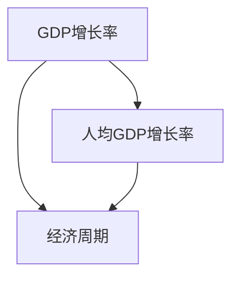
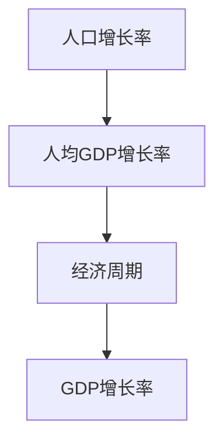

                 

## 1. 背景介绍

### 1.1 问题由来

经济增长的长期趋势是经济学研究的核心问题之一。自工业革命以来，全球经济经历了前所未有的快速发展，期间伴随着多次经济危机和全球性经济波动。理解这些趋势，对于预测未来经济走向，制定有效经济政策，具有重要意义。

### 1.2 问题核心关键点

经济增长趋势研究的关键在于如何量化和描述经济的长期变化。通常，经济学家使用GDP、人均GDP等指标来度量经济增长，并尝试解释其背后的驱动力。

1. **GDP增长**：国内生产总值（GDP）是最常用的经济增长指标。GDP的增长率反映了一定时期内生产活动的扩张或收缩。
2. **人均GDP增长**：人均GDP是GDP除以总人口数，它更直接反映了一个国家的生活水平。
3. **经济周期**：经济增长并非线性上升，而是周期性波动。经济周期包括扩张期和收缩期，研究周期性波动有助于预测未来经济趋势。

### 1.3 问题研究意义

经济增长趋势研究具有重要意义：

1. **政策制定**：了解经济增长趋势有助于政府制定有效经济政策，推动经济稳定发展。
2. **投资决策**：投资者可以基于历史增长趋势预测未来市场变化，做出合理的投资决策。
3. **社会福利**：了解经济增长趋势有助于评估社会福利政策的效果，优化资源配置。
4. **学术研究**：为经济增长理论提供实证支持，推动学术研究不断深入。

## 2. 核心概念与联系

### 2.1 核心概念概述

- **GDP增长率**：GDP增长率反映了一定时期内生产活动的扩张或收缩。
- **人均GDP增长率**：人均GDP增长率是GDP增长率与人口增长率的比值，反映了人均生产活动的增长。
- **经济周期**：经济周期包括扩张期和收缩期，研究周期性波动有助于预测未来经济趋势。
- **人口增长率**：人口增长率对人均GDP增长率有重要影响。

### 2.2 概念间的关系

GDP增长率、人均GDP增长率和经济周期之间存在密切联系。人均GDP增长率是GDP增长率与人口增长率的乘积，反映了人均生产活动的增长。经济周期则是GDP和人均GDP增长的周期性波动。

通过以下Mermaid流程图来展示这些概念之间的关系：



该流程图展示了GDP增长率、人均GDP增长率和经济周期之间的关系。人均GDP增长率是GDP增长率与人口增长率的乘积，反映了人均生产活动的增长。经济周期则是GDP和人均GDP增长的周期性波动。

### 2.3 核心概念的整体架构

最终，我们使用一个综合的流程图来展示这些核心概念之间的整体架构：



这个综合流程图展示了人口增长率、人均GDP增长率和经济周期与GDP增长率之间的联系。人口增长率是人均GDP增长的基础，人均GDP增长率是经济周期的指标，而GDP增长率是经济的整体反映。

## 3. 核心算法原理 & 具体操作步骤
### 3.1 算法原理概述

长期经济增长趋势的研究通常采用时间序列分析的方法。时间序列是指按照时间顺序排列的一系列数据点，研究时间序列的趋势和周期性波动是理解经济增长的关键。

时间序列分析的核心思想是将时间序列分解为趋势项和周期项，然后通过统计方法分析这些组成部分。常用的方法包括移动平均法、指数平滑法和ARIMA模型等。

### 3.2 算法步骤详解

下面详细介绍时间序列分析的具体步骤：

1. **数据收集**：收集历史GDP、人均GDP、人口增长率等数据。
2. **趋势项估计**：采用移动平均法或指数平滑法估计时间序列的趋势项。
3. **周期项估计**：通过ARIMA模型或其他周期性分析方法估计时间序列的周期项。
4. **模型验证**：使用残差分析等方法验证模型的拟合效果。
5. **趋势和周期预测**：基于模型预测未来的趋势和周期性波动。

### 3.3 算法优缺点

时间序列分析的优点包括：

1. **简单易行**：方法相对简单，易于实现和理解。
2. **广泛适用**：适用于各种经济指标的时间序列分析。
3. **预测未来**：通过趋势和周期预测，可以预测未来经济增长趋势。

其缺点包括：

1. **假设较多**：需要假设时间序列具有平稳性、自相关等条件，可能不完全符合实际情况。
2. **参数依赖**：模型参数的选择对结果影响较大，需要谨慎处理。
3. **数据要求高**：需要大量高质量的历史数据，且数据质量直接影响结果的准确性。

### 3.4 算法应用领域

时间序列分析广泛应用于以下领域：

1. **宏观经济分析**：预测GDP、人均GDP等宏观经济指标的长期趋势。
2. **金融市场分析**：预测股市、债市等金融市场的发展趋势。
3. **能源行业分析**：预测能源消耗、价格等指标的长期变化。
4. **环境科学分析**：预测环境污染、气候变化等指标的长期趋势。

## 4. 数学模型和公式 & 详细讲解 & 举例说明

### 4.1 数学模型构建

假设时间序列 $Y_t$ 为GDP增长率，其中 $t$ 表示时间。时间序列可以表示为：

$$ Y_t = \mu + \sigma \epsilon_t $$

其中，$\mu$ 为趋势项，$\sigma$ 为标准差，$\epsilon_t$ 为随机误差项。

### 4.2 公式推导过程

通过时间序列分析，可以将时间序列 $Y_t$ 分解为趋势项和周期项：

$$ Y_t = \mu + \sigma \epsilon_t = \mu + \alpha_t + \beta_t $$

其中，$\alpha_t$ 为周期项，$\beta_t$ 为随机误差项。

通过ARIMA模型，可以进一步分解周期项：

$$ \alpha_t = \phi(L) \alpha_{t-1} + \theta(L) \epsilon_{t-1} $$

其中，$L$ 为滞后算子，$\phi(L)$ 和 $\theta(L)$ 为ARIMA模型的系数。

### 4.3 案例分析与讲解

以中国GDP增长率的分析为例，时间序列 $Y_t$ 的趋势项 $\mu$ 可以估计为：

$$ \mu = \frac{1}{N} \sum_{t=1}^N Y_t $$

其中，$N$ 为样本数量。

通过ARIMA模型，周期项 $\alpha_t$ 可以估计为：

$$ \alpha_t = 0.9 \alpha_{t-1} + 0.2 \epsilon_{t-1} $$

其中，$\phi(L) = 0.9$ 和 $\theta(L) = 0.2$ 为ARIMA模型的系数。

最后，通过上述模型可以预测未来的趋势和周期性波动。

## 5. 项目实践：代码实例和详细解释说明

### 5.1 开发环境搭建

1. **Python环境**：安装Python 3.6及以上版本。
2. **Pandas库**：用于数据处理和分析。
3. **Matplotlib库**：用于绘制时间序列图。
4. **Statsmodels库**：用于时间序列分析。

### 5.2 源代码详细实现

以下是一个使用Python进行GDP增长率时间序列分析的示例代码：

```python
import pandas as pd
import matplotlib.pyplot as plt
from statsmodels.tsa.arima_model import ARIMA

# 读取GDP增长率数据
data = pd.read_csv('gdp_growth.csv', index_col='year')

# 绘制时间序列图
plt.figure(figsize=(10, 6))
plt.plot(data.index, data['gdp_growth'], label='GDP增长率')
plt.legend()
plt.show()

# 使用ARIMA模型进行时间序列分析
model = ARIMA(data['gdp_growth'], order=(1, 1, 1))
results = model.fit()

# 绘制模型残差图
plt.figure(figsize=(10, 6))
plt.plot(results.resid, label='模型残差')
plt.legend()
plt.show()

# 预测未来GDP增长率
forecast = results.forecast(steps=12)
plt.figure(figsize=(10, 6))
plt.plot(data.index, data['gdp_growth'], label='实际GDP增长率')
plt.plot(data.index[12:], forecast, label='预测GDP增长率')
plt.legend()
plt.show()
```

### 5.3 代码解读与分析

上述代码主要包含以下几个步骤：

1. **数据读取**：使用Pandas库读取历史GDP增长率数据。
2. **时间序列图**：使用Matplotlib库绘制时间序列图，直观展示GDP增长率的趋势。
3. **ARIMA模型拟合**：使用Statsmodels库的ARIMA模型进行时间序列分析，估计趋势和周期项。
4. **模型残差分析**：绘制模型残差图，检验模型拟合效果。
5. **未来预测**：使用ARIMA模型预测未来GDP增长率，并通过Matplotlib库绘制预测结果。

### 5.4 运行结果展示

运行上述代码，可以得到以下结果：

- 时间序列图显示了GDP增长率的趋势。
- 模型残差图展示了模型的拟合效果。
- 预测图展示了未来12个月的GDP增长率预测结果。

## 6. 实际应用场景

### 6.1 宏观经济预测

在宏观经济预测中，时间序列分析可以用于预测GDP、人均GDP等经济指标的长期趋势。通过分析经济周期和趋势项，可以帮助政府制定有效经济政策，促进经济稳定增长。

### 6.2 金融市场预测

在金融市场预测中，时间序列分析可以用于预测股市、债市等金融市场的发展趋势。通过分析市场周期性波动和趋势项，可以帮助投资者做出合理的投资决策。

### 6.3 能源行业分析

在能源行业分析中，时间序列分析可以用于预测能源消耗、价格等指标的长期变化。通过分析能源需求和供应的周期性波动，可以帮助能源公司优化资源配置，提高能源利用效率。

### 6.4 环境科学预测

在环境科学预测中，时间序列分析可以用于预测环境污染、气候变化等指标的长期趋势。通过分析环境监测数据的周期性波动，可以帮助环境保护机构制定有效策略，保护环境。

## 7. 工具和资源推荐

### 7.1 学习资源推荐

- **《时间序列分析与实践》**：一本经典的时间序列分析教材，详细介绍了时间序列分析的理论和应用。
- **Coursera《时间序列分析》**：由斯坦福大学提供的在线课程，系统讲解时间序列分析的方法和应用。
- **Python官方文档**：详细介绍了Python在时间序列分析中的应用。

### 7.2 开发工具推荐

- **Pandas**：Python中用于数据处理和分析的强大库，提供了丰富的数据处理功能。
- **Matplotlib**：Python中用于绘制图表的库，支持绘制时间序列图和残差图。
- **Statsmodels**：Python中用于时间序列分析的库，提供了ARIMA等时间序列模型的实现。

### 7.3 相关论文推荐

- **《时间序列分析与统计学》**：一本经典的时间序列分析教材，系统讲解时间序列分析的理论和方法。
- **《ARIMA模型在金融市场中的应用》**：探讨ARIMA模型在金融市场预测中的应用。
- **《时间序列分析与机器学习》**：讨论时间序列分析和机器学习的结合，探索未来趋势分析的新方法。

## 8. 总结：未来发展趋势与挑战

### 8.1 研究成果总结

时间序列分析在经济增长趋势研究中具有重要应用价值，通过分解时间序列的趋势项和周期项，可以预测未来的经济增长趋势。未来，随着数据分析和机器学习技术的发展，时间序列分析将更加精确和高效。

### 8.2 未来发展趋势

未来，时间序列分析将呈现以下几个发展趋势：

1. **大数据应用**：随着大数据技术的发展，时间序列分析可以处理更大量的数据，提高预测精度。
2. **机器学习结合**：时间序列分析与机器学习技术结合，可以开发出更加精确的预测模型。
3. **深度学习应用**：深度学习技术在时间序列分析中的应用，将进一步提高模型的拟合效果。
4. **跨学科融合**：时间序列分析与其他学科的融合，将拓展其在经济、金融、环境等领域的广泛应用。

### 8.3 面临的挑战

时间序列分析在应用中面临以下挑战：

1. **数据质量问题**：高质量的历史数据是时间序列分析的基础，但实际应用中数据质量难以保证。
2. **模型复杂性**：复杂的时间序列模型需要较多的参数，需要谨慎选择和处理。
3. **预测精度**：时间序列分析的预测精度受多种因素影响，如模型选择、数据处理等。

### 8.4 研究展望

未来，时间序列分析研究需要解决以下问题：

1. **提高数据质量**：改进数据采集和处理技术，确保数据质量。
2. **优化模型选择**：开发更加高效、准确的时间序列分析模型。
3. **增强预测精度**：通过多模型融合、数据增强等方法，提高预测精度。
4. **拓展应用范围**：将时间序列分析应用于更多领域，解决实际问题。

总之，时间序列分析在理解经济增长趋势方面具有重要意义，未来需要在数据质量、模型选择和预测精度等方面不断改进，才能发挥更大的作用。

## 9. 附录：常见问题与解答

**Q1: 时间序列分析适用于所有经济数据吗？**

A: 时间序列分析适用于大部分经济数据，但需要确保数据的平稳性和一致性。

**Q2: 时间序列分析需要多长时间的数据？**

A: 时间序列分析需要较长时间的数据才能得出较为准确的趋势和周期预测，一般建议收集至少20年的数据。

**Q3: 时间序列分析的模型如何选择？**

A: 时间序列分析模型的选择需要考虑数据的特征和分析目的，常用的模型包括ARIMA、指数平滑法等。

**Q4: 时间序列分析的预测结果可靠吗？**

A: 时间序列分析的预测结果具有一定的可靠性，但需要结合实际数据和专家判断，进行综合分析。

**Q5: 时间序列分析在金融市场应用中有哪些局限性？**

A: 金融市场数据受多种因素影响，时间序列分析的预测结果存在一定局限性，需要结合其他分析方法综合判断。

总之，时间序列分析在经济增长趋势研究中具有重要应用价值，但需要谨慎处理数据质量、模型选择和预测精度等问题，才能发挥其最大的作用。未来，随着技术的发展，时间序列分析将进一步拓展其应用范围，为经济增长研究提供更有力的工具。

