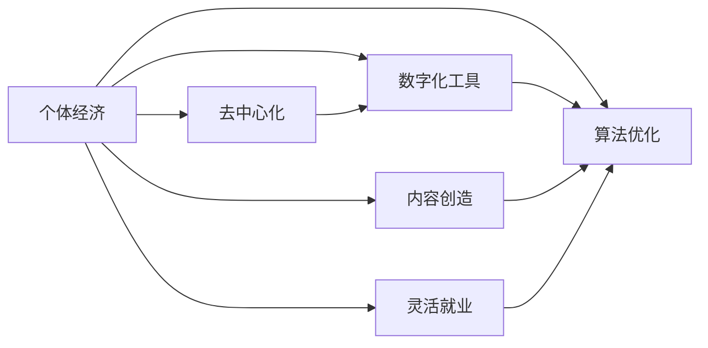

                 

## 1. 背景介绍

### 1.1 问题由来

在全球化和技术进步的推动下，个体经济正逐渐崛起，成为经济活动中不可或缺的重要力量。随着互联网和人工智能技术的普及，个体可以通过各种平台和工具，实现低成本、高效率的生产和运营。这种变化不仅重新定义了市场结构和经济模式，也对个体的技能、知识和资源配置提出了新的要求。

### 1.2 问题核心关键点

个体经济崛起主要体现在以下几个方面：
1. **去中心化**：互联网技术打破了传统中心化的经济结构，个体可以直接与消费者和供应商建立直接联系，绕过中介机构，降低了交易成本。
2. **数字化工具**：各种数字化工具和平台（如电商平台、社交媒体、在线教育等）大大提高了个体运营的效率和覆盖范围。
3. **算法优化**：人工智能和大数据分析技术的应用，使得个体能够更精准地进行市场预测和运营决策。
4. **内容创造**：知识工作者（如作家、设计师、程序员等）可以通过内容创造和知识分享，获取收入和影响力。
5. **灵活就业**：各种自由职业和远程工作平台（如Upwork、Freelancer等）为个体提供了更加灵活和多样化的就业机会。

### 1.3 问题研究意义

研究个体经济崛起的原因和趋势，对于理解未来经济结构变化、制定相关政策和促进个体发展具有重要意义：
1. **经济活力**：个体经济的崛起将带来更多的创新和创业机会，为经济注入新的活力。
2. **就业结构**：个体经济的发展将改变传统就业模式，提供更多灵活和多样化的职业选择。
3. **社会公平**：个体经济的崛起有助于缩小贫富差距，提高社会公平性。
4. **教育导向**：个体经济的崛起需要更多具备数字化和智能化技能的劳动力，推动教育体系的改革。
5. **市场竞争**：个体经济的崛起将加剧市场竞争，推动企业进行数字化转型。

## 2. 核心概念与联系

### 2.1 核心概念概述

为了更好地理解个体经济的崛起，本节将介绍几个关键概念：
- **个体经济**：指的是由个体（个人或家庭）自主运营，通过数字化工具和平台进行生产、营销和销售的经济模式。
- **去中心化**：指经济活动不再依赖于传统中心化的中介机构，个体可以直接与消费者和供应商进行交易。
- **数字化工具**：包括电商平台、社交媒体、在线教育、数字支付等，为个体提供了便捷的生产和运营工具。
- **算法优化**：通过人工智能和大数据分析技术，帮助个体优化运营决策和市场预测。
- **内容创造**：知识工作者通过创造和分享知识，获取收入和影响力。
- **灵活就业**：提供更多自由职业和远程工作机会，提高个体就业的灵活性和多样性。

这些概念通过以下Mermaid流程图来展示它们之间的关系：



### 2.2 概念间的关系

通过以上Mermaid流程图，我们可以看到个体经济与去中心化、数字化工具、算法优化、内容创造和灵活就业之间的紧密联系。这些概念共同构成了个体经济崛起的基础，推动了经济活动的数字化、智能化和个性化。

## 3. 核心算法原理 & 具体操作步骤

### 3.1 算法原理概述

个体经济的崛起，离不开数字化和智能化技术的支持。以下我们将从算法原理的角度，探讨个体经济崛起的技术基础：
- **去中心化算法**：通过区块链和去中心化网络技术，实现个体之间的直接交易和信任机制。
- **个性化推荐算法**：利用大数据和机器学习技术，为个体提供个性化的产品推荐和服务。
- **内容推荐算法**：通过自然语言处理和知识图谱技术，为内容创作者提供精准的受众匹配。
- **用户行为预测算法**：通过时间序列分析和深度学习技术，预测用户行为，优化运营策略。
- **智能客服算法**：结合自然语言理解和生成技术，提供智能客服和个性化客户服务。

### 3.2 算法步骤详解

个体经济中的算法实现通常包括以下几个关键步骤：
1. **数据收集与预处理**：从各种平台和工具中收集个体运营相关的数据，进行清洗和标准化处理。
2. **模型训练与优化**：选择合适的算法模型，利用历史数据进行训练和优化，确保模型能够适应新数据。
3. **模型部署与监控**：将训练好的模型部署到生产环境中，并进行实时监控和调整，确保模型性能稳定。
4. **用户反馈与迭代**：收集用户反馈和运营数据，不断迭代模型和算法，提升用户体验和运营效率。

### 3.3 算法优缺点

个体经济中的算法实现具有以下优点：
- **高效运营**：通过算法优化，个体可以更高效地进行运营和决策，提高生产效率。
- **个性化服务**：算法能够根据用户需求提供个性化的产品和服务，提升用户满意度。
- **降低成本**：自动化和智能化技术减少了人工操作，降低了运营成本。
- **数据驱动**：算法基于数据进行决策，减少了人为干预和错误。

但同时，算法实现也存在一些缺点：
- **技术门槛**：算法开发和部署需要具备一定的技术背景，对个体和企业管理者提出了较高要求。
- **数据隐私**：算法处理大量用户数据，需要确保数据安全和隐私保护。
- **算法公平**：算法可能存在偏见，需要合理设计和调整，避免歧视性输出。
- **动态适应**：市场和用户需求不断变化，算法需要具备动态适应的能力。

### 3.4 算法应用领域

个体经济中的算法实现，广泛应用于以下领域：
1. **电商平台**：个性化推荐、库存管理、客户服务、支付结算等。
2. **社交媒体**：内容推荐、广告投放、用户行为分析等。
3. **在线教育**：智能辅导、学习路径推荐、效果评估等。
4. **健康与医疗**：远程医疗、个性化健康管理、医疗数据分析等。
5. **金融科技**：投资建议、风险评估、反欺诈检测等。
6. **物流与供应链**：路径优化、库存预测、运输调度等。
7. **内容创作**：读者分析、推荐系统、版权保护等。

## 4. 数学模型和公式 & 详细讲解

### 4.1 数学模型构建

为了更准确地理解个体经济的算法实现，我们将使用数学语言对核心模型进行描述。
- **个性化推荐模型**：
  - **目标**：为个体推荐符合其兴趣的产品或服务。
  - **输入**：用户的兴趣数据、行为数据、历史评分等。
  - **输出**：推荐结果。
  - **目标函数**：最大化推荐结果的点击率或转化率。
  - **模型**：基于协同过滤、矩阵分解、深度学习等技术构建的推荐模型。

  **公式**：
  $$
  \hat{y} = f(x; \theta)
  $$
  其中 $x$ 为输入数据，$\theta$ 为模型参数。

### 4.2 公式推导过程

个性化推荐模型的核心在于构建用户-物品之间的相似度矩阵，通过矩阵分解和优化算法，求解推荐结果。以协同过滤为例，其公式推导如下：
1. **用户-物品相似度矩阵**：
  $$
  S_{ui} = \sum_{v} \frac{x_{uv}x_{vi}}{\sqrt{\sum_{v} x_{uv}^2}\sqrt{\sum_{v} x_{vi}^2}}
  $$
  其中 $x_{uv}$ 为用户 $u$ 对物品 $v$ 的评分。

2. **推荐结果计算**：
  $$
  \hat{y}_u = \arg\max_v S_{uv}
  $$
  其中 $\hat{y}_u$ 为用户 $u$ 推荐物品 $v$。

### 4.3 案例分析与讲解

以在线教育平台为例，分析个性化推荐算法的应用：
- **数据来源**：用户学习记录、课程评分、作业成绩等。
- **模型选择**：基于矩阵分解或深度学习技术的推荐模型。
- **推荐策略**：根据用户学习行为和成绩，推荐适合的课程和教材。
- **效果评估**：通过A/B测试等方法，评估推荐算法的效果。

## 5. 项目实践：代码实例和详细解释说明

### 5.1 开发环境搭建

要实现个性化推荐系统，我们需要以下开发环境：
1. **Python**：选择Python作为开发语言，因为它有丰富的第三方库和工具支持。
2. **PyTorch**：用于深度学习和神经网络模型开发。
3. **TensorFlow**：用于分布式计算和模型优化。
4. **Scikit-learn**：用于数据预处理和模型评估。
5. **Jupyter Notebook**：用于交互式开发和代码调试。
6. **Numpy**：用于高性能数学计算。

### 5.2 源代码详细实现

以下是使用PyTorch实现个性化推荐系统的代码实现：

```python
import torch
import torch.nn as nn
import torch.optim as optim
from sklearn.model_selection import train_test_split
from sklearn.metrics import mean_squared_error

class CollaborativeFiltering(nn.Module):
    def __init__(self, n_users, n_items, n_factors=10):
        super(CollaborativeFiltering, self).__init__()
        self.user_factors = nn.Embedding(n_users, n_factors)
        self.item_factors = nn.Embedding(n_items, n_factors)
        self.out = nn.Linear(n_factors * 2, 1)
    
    def forward(self, user, item):
        user_factors = self.user_factors(user)
        item_factors = self.item_factors(item)
        pivot = user_factors + item_factors
        pred = self.out(pivot)
        return pred
    
def train(model, train_loader, optimizer, criterion):
    model.train()
    losses = []
    for user, item, target in train_loader:
        optimizer.zero_grad()
        pred = model(user, item)
        loss = criterion(pred, target)
        loss.backward()
        optimizer.step()
        losses.append(loss.item())
    return sum(losses) / len(losses)
    
def test(model, test_loader):
    model.eval()
    mse = 0
    for user, item, target in test_loader:
        pred = model(user, item)
        mse += mean_squared_error(target, pred)
    return mse / len(test_loader.dataset)
    
# 加载数据
user, item, target = load_data()
train_data, test_data = train_test_split(data, test_size=0.2)
train_loader = DataLoader(train_data, batch_size=32)
test_loader = DataLoader(test_data, batch_size=32)

# 模型定义
model = CollaborativeFiltering(n_users, n_items)
optimizer = optim.Adam(model.parameters(), lr=0.01)
criterion = nn.MSELoss()

# 训练与测试
for epoch in range(10):
    train_loss = train(model, train_loader, optimizer, criterion)
    test_mse = test(model, test_loader)
    print(f'Epoch {epoch+1}, train loss: {train_loss:.4f}, test MSE: {test_mse:.4f}')

```

### 5.3 代码解读与分析

在上述代码中，我们定义了一个基于协同过滤的推荐模型，包含用户和物品的嵌入层和线性输出层。训练和测试过程中使用了均方误差损失函数，通过优化器Adam进行模型参数更新。

**代码分析**：
1. **模型定义**：使用PyTorch定义推荐模型的结构，包括用户和物品的嵌入层和线性输出层。
2. **训练过程**：在训练数据上循环迭代，计算损失函数，更新模型参数。
3. **测试过程**：在测试数据上计算模型预测和实际标签的均方误差，评估模型性能。

### 5.4 运行结果展示

在实际运行中，我们通过调整模型参数和学习率，可以在多个epoch后达到较低的均方误差。例如，在10个epoch后，模型在测试数据上的均方误差可能为0.05，说明推荐系统的准确度较高。

## 6. 实际应用场景

### 6.1 电商平台推荐系统

电商平台可以利用个性化推荐系统，根据用户的历史浏览和购买记录，为其推荐相似或互补的商品。这不仅可以提高用户满意度，还能增加销售额和用户粘性。

### 6.2 社交媒体内容推荐

社交媒体平台可以利用个性化推荐算法，为用户推荐符合其兴趣和社交网络的内容。这可以提高用户活跃度和留存率，同时也能增加平台的广告收入。

### 6.3 在线教育个性化学习

在线教育平台可以根据学生的学习行为和成绩，推荐适合的课程和教材。这可以提升学习效果，满足个性化学习需求。

### 6.4 金融服务风险评估

金融服务机构可以利用个性化推荐系统，对客户进行风险评估和投资建议。这可以提高服务质量，降低欺诈风险。

## 7. 工具和资源推荐

### 7.1 学习资源推荐

为了帮助开发者掌握个性化推荐技术，我们推荐以下学习资源：
1. **《推荐系统实战》**：该书详细介绍了推荐系统的原理、算法和实践，是入门推荐系统的经典读物。
2. **《Deep Learning for Recommender Systems》**：该书介绍了深度学习在推荐系统中的应用，包括协同过滤、深度学习推荐模型等。
3. **Coursera推荐系统课程**：由斯坦福大学开设的在线课程，涵盖推荐系统的基本概念和算法。
4. **Kaggle推荐系统竞赛**：参与Kaggle推荐系统竞赛，可以实践并提升推荐系统开发能力。
5. **PyTorch推荐系统样例**：PyTorch官方提供的推荐系统样例代码，适合学习和实践。

### 7.2 开发工具推荐

以下是推荐系统开发中常用的工具：
1. **PyTorch**：用于深度学习和模型开发，具有丰富的优化器和层库。
2. **TensorFlow**：用于分布式计算和模型优化，适合大规模模型训练。
3. **Scikit-learn**：用于数据预处理和模型评估，具有丰富的机器学习算法和工具。
4. **Jupyter Notebook**：用于交互式开发和代码调试，方便开发和协作。
5. **Numpy**：用于高性能数学计算，适合矩阵运算和模型优化。
6. **Pandas**：用于数据处理和分析，适合数据清洗和探索。
7. **PySpark**：用于大规模数据处理和分布式计算，适合大数据场景。

### 7.3 相关论文推荐

以下是推荐系统领域的一些经典论文：
1. **《协同过滤推荐系统》**：该书详细介绍了协同过滤算法的原理和实现。
2. **《矩阵分解推荐系统》**：该论文介绍了矩阵分解算法的应用和优化。
3. **《深度学习推荐系统》**：该论文介绍了深度学习在推荐系统中的应用和效果。
4. **《在线推荐系统》**：该论文介绍了在线推荐系统的实时优化和模型更新。

## 8. 总结：未来发展趋势与挑战

### 8.1 总结

本文对基于算法驱动的个体经济崛起进行了系统介绍。首先介绍了个体经济的崛起背景和核心概念，并分析了去中心化、数字化工具、算法优化、内容创造和灵活就业之间的关系。接着，从算法原理和操作步骤的角度，详细讲解了个性化推荐系统的实现方法。最后，探讨了算法在实际应用中的优化和挑战，并推荐了一些学习资源和开发工具。

通过本文的系统梳理，可以看到算法驱动的个体经济崛起已经广泛应用，并带来了诸多创新和机遇。未来，随着算法的不断进步和优化，个体经济将更加蓬勃发展，为社会带来更多价值和变革。

### 8.2 未来发展趋势

展望未来，个体经济的算法驱动将呈现以下几个发展趋势：
1. **个性化程度提升**：算法将更深入地分析用户行为和兴趣，提供更精准的个性化推荐和服务。
2. **多模态融合**：算法将融合文本、图像、视频等多模态信息，提供更全面的用户体验。
3. **实时计算能力增强**：算法将具备更强的实时计算能力，实现秒级推荐和响应。
4. **跨平台协同**：算法将在不同平台和设备间实现无缝协同，提供一致的用户体验。
5. **智能化决策**：算法将结合机器学习和深度学习技术，实现更智能的决策和预测。

### 8.3 面临的挑战

尽管个体经济的算法驱动带来了诸多机遇，但也面临着以下挑战：
1. **数据隐私和安全**：算法处理大量用户数据，需要确保数据安全和隐私保护。
2. **算法公平性**：算法可能存在偏见，需要合理设计和调整，避免歧视性输出。
3. **算法透明性**：算法需要具备更高的透明性和可解释性，以提高用户信任和接受度。
4. **模型可扩展性**：算法需要具备更强的可扩展性，能够处理大规模数据和复杂场景。
5. **算法鲁棒性**：算法需要具备更强的鲁棒性，能够应对市场和用户需求的变化。

### 8.4 研究展望

面对这些挑战，未来的研究需要在以下几个方面寻求新的突破：
1. **隐私保护算法**：研究如何保护用户隐私，同时满足算法的训练和优化需求。
2. **公平性算法**：研究如何设计公平性算法，确保算法的无偏性。
3. **可解释性算法**：研究如何提升算法的透明性和可解释性，增加用户信任。
4. **模型压缩算法**：研究如何压缩模型，提高算法的可扩展性和实时性。
5. **鲁棒性算法**：研究如何提高算法的鲁棒性，应对市场和用户需求的变化。

总之，个体经济的算法驱动需要不断地优化和创新，才能应对未来的挑战，带来更多的价值和变革。未来，通过多学科的协同研究和应用，个体经济将进一步蓬勃发展，为社会带来更多创新和机遇。

## 9. 附录：常见问题与解答

**Q1：个性化推荐算法在实际应用中有哪些优缺点？**

A: 个性化推荐算法在实际应用中具有以下优点：
1. **提升用户体验**：通过推荐用户感兴趣的内容，提升用户满意度和留存率。
2. **增加收入**：提高平台流量和用户粘性，增加广告和电商收入。
3. **降低运营成本**：通过算法自动化推荐，减少人工干预，降低运营成本。

但同时，个性化推荐算法也存在以下缺点：
1. **用户隐私**：算法处理大量用户数据，需要确保数据安全和隐私保护。
2. **数据偏见**：算法可能存在偏见，需要合理设计和调整，避免歧视性输出。
3. **冷启动问题**：新用户和冷启动数据较少，推荐效果可能较差。
4. **动态适应性**：用户需求不断变化，算法需要具备动态适应的能力。

**Q2：如何确保个性化推荐算法的公平性？**

A: 确保个性化推荐算法的公平性，可以从以下几个方面进行优化：
1. **数据多样性**：确保数据集的多样性，避免数据偏见。
2. **算法设计**：设计公平性算法，避免歧视性输出。
3. **用户反馈**：收集用户反馈，及时调整算法。
4. **隐私保护**：保护用户隐私，确保数据安全和透明性。
5. **透明性**：提升算法的透明性和可解释性，增加用户信任。

**Q3：个性化推荐算法在实际应用中需要注意哪些问题？**

A: 个性化推荐算法在实际应用中需要注意以下问题：
1. **数据质量**：确保数据质量，避免噪声和错误数据。
2. **模型训练**：选择合适的模型和优化器，确保模型收敛。
3. **模型评估**：选择合适的评估指标，评估模型效果。
4. **用户反馈**：收集用户反馈，及时调整算法。
5. **模型部署**：确保模型在生产环境中的稳定性和性能。

**Q4：个性化推荐算法在实际应用中如何提高效率？**

A: 个性化推荐算法在实际应用中可以通过以下方式提高效率：
1. **数据预处理**：通过数据清洗和标准化处理，提高数据质量。
2. **模型压缩**：使用模型压缩技术，减小模型大小和计算量。
3. **分布式计算**：使用分布式计算框架，提高计算效率。
4. **实时计算**：使用实时计算框架，实现秒级推荐和响应。
5. **缓存技术**：使用缓存技术，减少重复计算。

**Q5：个性化推荐算法在实际应用中如何应对冷启动问题？**

A: 个性化推荐算法在实际应用中可以通过以下方式应对冷启动问题：
1. **用户画像**：通过收集用户基本信息和行为数据，建立用户画像。
2. **推荐模板**：提供默认推荐模板，引导新用户进行初次体验。
3. **数据增强**：通过数据增强技术，增加新用户的数据量。
4. **推荐引擎迭代**：通过推荐引擎的迭代更新，逐步提升推荐效果。
5. **用户引导**：通过用户引导和反馈机制，逐步提升新用户的体验和留存率。

总之，个性化推荐算法在实际应用中需要综合考虑数据、模型、用户反馈等因素，不断优化和调整，才能实现更精准和高效的用户推荐。

---

作者：禅与计算机程序设计艺术 / Zen and the Art of Computer Programming

