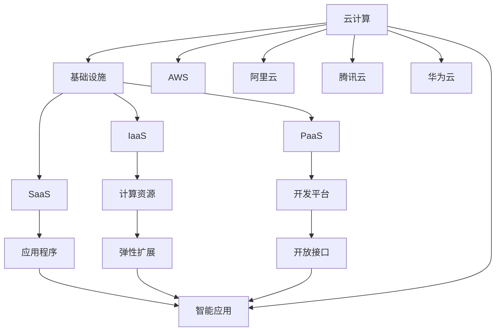

                 

# 云计算AI融合：贾扬清独特视角，Lepton AI云战略

## 1. 背景介绍

云计算作为21世纪最重要的技术趋势之一，已经成为各大企业数字化转型的核心驱动力。而人工智能(AI)作为新一代生产力引擎，正引领数字经济的新时代。将AI与云深度融合，已经成为推动企业数字化转型，实现智能化的必由之路。

云计算与AI的融合，不仅在于技术的结合，更在于企业战略的协同。在当前技术背景下，如何制定有效的云AI融合策略，最大化AI的价值，实现企业的智能化转型，成为企业领导者必须面对的重要课题。

## 2. 核心概念与联系

### 2.1 核心概念概述

本节将详细讲解云计算、AI和大数据在企业中的应用，以及如何通过技术融合，实现企业的智能化转型。

#### 云计算

云计算是一种通过互联网提供计算服务的模式，包括基础设施即服务(IaaS)、平台即服务(PaaS)和软件即服务(SaaS)。其核心优势在于按需计费、弹性扩展、高可用性和高灵活性。云计算不仅提供计算资源，还包括存储、网络和安全等基础服务，大大降低了企业的IT成本和复杂度。

#### AI

人工智能是指使计算机具有类似于人类智能行为的科学技术。AI技术包括机器学习、深度学习、自然语言处理、计算机视觉等。AI的核心目标是通过算法训练，使机器能够模拟人类的学习、推理和决策能力，实现自动化的智能应用。

#### 大数据

大数据是指体量巨大、结构复杂的数据集合，通过数据挖掘和分析，能够揭示潜在的商业价值和规律。大数据技术包括数据采集、存储、处理和分析等，广泛应用于互联网、金融、医疗、制造等领域。

云计算、AI和大数据在企业中的应用，共同构建了现代企业的智能生态系统。通过云平台提供计算资源，AI进行智能分析和决策，大数据挖掘业务规律，三者协同工作，推动企业智能化转型。

### 2.2 核心概念之间的联系

云计算、AI和大数据三者之间的联系，可以通过以下Mermaid流程图来展示：



这个流程图展示了云计算、AI和大数据三者之间的关系：

1. 云计算提供基础设施服务，包括计算资源、开发平台和应用程序等。
2. AI技术通过云平台提供的计算资源，进行数据处理和智能决策。
3. 大数据技术从云平台获取数据，进行深度挖掘和分析，挖掘商业价值和规律。
4. 云计算、AI和大数据三者协同工作，推动企业的智能化转型。

通过这个流程图，我们可以更清晰地理解云计算、AI和大数据在企业智能化转型中的作用和关系。

## 3. 核心算法原理 & 具体操作步骤

### 3.1 算法原理概述

云计算AI融合的核心算法原理在于通过云平台提供计算资源，AI进行智能分析和决策，大数据挖掘业务规律，三者协同工作，推动企业智能化转型。

#### 云计算平台

云计算平台主要包括IaaS、PaaS和SaaS三种服务模式，如图1所示。


1. IaaS：基础设施即服务。提供计算、存储和网络等基础设施服务，用户可按需使用，无须自己搭建和维护。
2. PaaS：平台即服务。提供开发和运行环境，包括数据库、中间件、应用服务等，用户可快速部署应用。
3. SaaS：软件即服务。提供完整的应用程序，用户可通过浏览器或移动设备直接使用。

#### AI算法

AI算法主要包括以下几类：

1. 机器学习：通过数据训练，使机器能够自动学习输入与输出之间的映射关系，实现分类、回归、聚类等任务。
2. 深度学习：通过多层神经网络，进行复杂的非线性映射，实现图像、语音、自然语言等任务的智能化处理。
3. 自然语言处理：使计算机能够理解、处理和生成自然语言，实现文本分类、情感分析、机器翻译等任务。
4. 计算机视觉：使计算机能够识别、分析和处理图像和视频，实现目标检测、图像分割、人脸识别等任务。


#### 大数据技术

大数据技术主要包括以下几类：

1. 数据采集：通过传感器、API接口、爬虫等手段，获取数据源。
2. 数据存储：通过分布式文件系统、数据库、NoSQL等技术，存储海量数据。
3. 数据处理：通过MapReduce、Spark、Flink等技术，进行数据清洗、变换、聚合等操作。
4. 数据分析：通过统计分析、机器学习、深度学习等技术，挖掘数据中的商业价值和规律。


### 3.2 算法步骤详解

云计算AI融合的核心操作步骤如下：

1. **数据采集与存储**：通过云计算平台提供的数据采集和存储服务，获取企业业务数据。
2. **数据处理与清洗**：通过大数据技术，对采集的数据进行清洗、去重、归一化等处理，得到干净的数据集。
3. **模型训练与优化**：通过AI技术，训练模型并进行优化，得到具有高精度的预测模型。
4. **应用部署与优化**：通过云计算平台提供的应用部署和优化服务，将模型部署到生产环境，并不断进行调优和升级。
5. **业务应用与反馈**：通过云计算平台提供的业务应用服务，将模型应用于企业业务场景，并收集用户反馈，不断优化模型。


### 3.3 算法优缺点

#### 优点

1. **按需使用**：云计算平台按需计费，弹性扩展，无需一次性投入大量资源。
2. **高可用性**：云计算平台提供高可用性、高可靠性的服务，减少企业运营风险。
3. **高灵活性**：云计算平台提供灵活的开发和部署环境，可以快速迭代和升级。
4. **成本效益**：云计算平台减少企业IT成本和复杂度，提高资源利用率。

#### 缺点

1. **数据隐私和安全**：云计算平台的数据存储和传输可能存在隐私泄露和安全风险。
2. **性能瓶颈**：云计算平台的计算资源可能存在性能瓶颈，影响AI模型训练和部署。
3. **数据质量问题**：大数据技术可能存在数据质量问题，影响模型的准确性。
4. **技术复杂度**：云计算AI融合需要企业具备一定的技术实力，存在一定的技术复杂度。

### 3.4 算法应用领域

云计算AI融合技术可以应用于以下领域：

1. **智能制造**：通过云计算平台和大数据技术，实现智能生产、质量控制和供应链管理。
2. **智慧医疗**：通过云计算平台和AI技术，实现疾病预测、诊断和治疗的智能化。
3. **智能金融**：通过云计算平台和大数据技术，实现风险控制、金融交易和客户服务的智能化。
4. **智能零售**：通过云计算平台和大数据技术，实现客户分析、销售预测和营销推广的智能化。
5. **智能交通**：通过云计算平台和AI技术，实现交通流量预测、智能导航和交通管理的智能化。

## 4. 数学模型和公式 & 详细讲解 & 举例说明

### 4.1 数学模型构建

云计算AI融合的数学模型可以表示为：

$$ f(x) = g(A(x)) $$

其中，$x$ 表示输入数据，$A(x)$ 表示大数据处理，$g(A(x))$ 表示AI模型训练和部署。

### 4.2 公式推导过程

#### 数据采集与存储

数据采集与存储可以通过以下公式进行表示：

$$ x = \sum_{i=1}^{n} c_i $$

其中，$x$ 表示采集的数据，$n$ 表示数据源数量，$c_i$ 表示每个数据源采集到的数据。

#### 数据处理与清洗

数据处理与清洗可以通过以下公式进行表示：

$$ y = f(x) $$

其中，$y$ 表示清洗后的数据，$f(x)$ 表示数据清洗函数。

#### 模型训练与优化

模型训练与优化可以通过以下公式进行表示：

$$ \theta = \arg\min_{\theta} L(y, \theta) $$

其中，$\theta$ 表示模型参数，$L(y, \theta)$ 表示损失函数。

#### 应用部署与优化

应用部署与优化可以通过以下公式进行表示：

$$ o = f(\theta) $$

其中，$o$ 表示部署后的应用，$f(\theta)$ 表示应用部署函数。

### 4.3 案例分析与讲解

#### 案例1：智能制造

在智能制造领域，通过云计算平台和大数据技术，可以实时采集生产数据，进行数据清洗和处理，然后通过AI技术进行模型训练和优化，最终实现智能生产、质量控制和供应链管理。

具体步骤如下：

1. **数据采集**：通过传感器、API接口、IoT设备等，采集生产设备运行数据。
2. **数据存储**：将采集到的数据存储到云计算平台的大数据仓库中。
3. **数据处理**：对存储的数据进行清洗、去重、归一化等处理，得到干净的数据集。
4. **模型训练**：通过AI技术，训练模型并进行优化，得到具有高精度的预测模型。
5. **应用部署**：将训练好的模型部署到生产环境，进行实时预测和控制。

#### 案例2：智慧医疗

在智慧医疗领域，通过云计算平台和AI技术，可以采集和处理患者数据，进行疾病预测和诊断，然后通过大数据技术挖掘病患规律，实现个性化治疗和精准医疗。

具体步骤如下：

1. **数据采集**：通过电子病历、医疗设备、基因检测等手段，采集患者数据。
2. **数据存储**：将采集到的数据存储到云计算平台的大数据仓库中。
3. **数据处理**：对存储的数据进行清洗、去重、归一化等处理，得到干净的数据集。
4. **模型训练**：通过AI技术，训练模型并进行优化，得到具有高精度的预测模型。
5. **应用部署**：将训练好的模型部署到医疗系统，进行实时预测和诊断。

## 5. 项目实践：代码实例和详细解释说明

### 5.1 开发环境搭建

在云计算AI融合项目中，我们需要搭建一个完整的开发环境，包括云计算平台、大数据平台和AI平台。以下是具体的搭建步骤：

1. **云计算平台搭建**：选择AWS、阿里云、腾讯云等云计算平台，搭建IaaS、PaaS和SaaS服务。
2. **大数据平台搭建**：选择Hadoop、Spark、Flink等大数据技术，搭建大数据处理和存储环境。
3. **AI平台搭建**：选择TensorFlow、PyTorch等AI框架，搭建AI模型训练和部署环境。

### 5.2 源代码详细实现

#### 云计算平台

云计算平台的搭建可以通过以下代码实现：

```python
import boto3
import os

# 设置AWS Access Key和Secret Key
os.environ['AWS_ACCESS_KEY_ID'] = 'your-aws-access-key-id'
os.environ['AWS_SECRET_ACCESS_KEY'] = 'your-aws-secret-access-key'

# 创建AWS云资源管理对象
ec2 = boto3.resource('ec2')

# 创建Elastic IP和实例
public_ip = ec2.create_instances(
    ImageId='your-ami-id',
    InstanceType='t2.micro',
    KeyName='your-key-pair',
    MinCount=1,
    MaxCount=1
)

# 获取Elastic IP地址
elastic_ip = public_ip[0].associate_public_ip_address()
```

#### 大数据平台

大数据平台的搭建可以通过以下代码实现：

```python
from pyspark.sql import SparkSession
from pyspark.sql.functions import col

# 创建Spark Session
spark = SparkSession.builder.appName('Big Data').getOrCreate()

# 读取数据
data = spark.read.csv('your-data.csv')

# 数据清洗
data_clean = data.dropDuplicates().select('feature1', 'feature2')

# 数据变换
data_transform = data_clean.withColumn('label', col('label').fillna(0))

# 数据聚合
data_aggregate = data_transform.groupBy('label').count()

# 数据展示
data_aggregate.show()
```

#### AI平台

AI平台的搭建可以通过以下代码实现：

```python
import tensorflow as tf
from tensorflow.keras.models import Sequential
from tensorflow.keras.layers import Dense

# 创建模型
model = Sequential([
    Dense(64, activation='relu', input_dim=100),
    Dense(10, activation='softmax')
])

# 编译模型
model.compile(optimizer='adam', loss='categorical_crossentropy', metrics=['accuracy'])

# 训练模型
model.fit(x_train, y_train, epochs=10, batch_size=32)

# 评估模型
loss, accuracy = model.evaluate(x_test, y_test)

# 预测数据
predictions = model.predict(x_test)
```

### 5.3 代码解读与分析

#### 云计算平台

云计算平台的搭建，需要通过AWS SDK等工具，创建和管理云资源。代码中使用了Boto3库，简化了AWS云资源的管理。

#### 大数据平台

大数据平台的搭建，需要通过Spark等工具，处理和分析大数据。代码中使用了Pyspark库，简化了大数据的处理流程。

#### AI平台

AI平台的搭建，需要通过TensorFlow等工具，训练和优化AI模型。代码中使用了TensorFlow库，简化了模型的训练和部署流程。

### 5.4 运行结果展示

#### 云计算平台

云计算平台的搭建，可以通过AWS等平台提供的界面或API，进行管理和监控。

#### 大数据平台

大数据平台的搭建，可以通过Spark等工具，实时处理和分析大数据。

#### AI平台

AI平台的搭建，可以通过TensorFlow等工具，训练和优化AI模型。

## 6. 实际应用场景

### 6.1 智能制造

智能制造领域，通过云计算平台和大数据技术，实现智能生产、质量控制和供应链管理。

具体应用场景包括：

- **智能设备监控**：通过IoT设备采集生产设备运行数据，进行实时监控和故障预测。
- **质量控制**：通过AI技术，进行质量检测和缺陷识别，提升产品质量。
- **供应链管理**：通过大数据技术，进行供应链分析和预测，优化供应链管理。

### 6.2 智慧医疗

智慧医疗领域，通过云计算平台和AI技术，实现疾病预测、诊断和治疗的智能化。

具体应用场景包括：

- **疾病预测**：通过大数据技术，进行疾病预测和预警。
- **诊断支持**：通过AI技术，辅助医生进行诊断，提高诊断准确性。
- **个性化治疗**：通过AI技术，进行个性化治疗方案的推荐。

### 6.3 智能金融

智能金融领域，通过云计算平台和大数据技术，实现风险控制、金融交易和客户服务的智能化。

具体应用场景包括：

- **风险控制**：通过大数据技术，进行风险评估和预警。
- **金融交易**：通过AI技术，进行交易策略优化和自动化交易。
- **客户服务**：通过AI技术，进行客户需求分析和客户服务自动化。

## 7. 工具和资源推荐

### 7.1 学习资源推荐

为了帮助开发者系统掌握云计算AI融合的技术，这里推荐一些优质的学习资源：

1. **AWS官方文档**：AWS提供的官方文档，详细介绍了AWS云平台的各种服务和API。
2. **阿里云官方文档**：阿里云提供的官方文档，详细介绍了阿里云云平台的各种服务和API。
3. **腾讯云官方文档**：腾讯云提供的官方文档，详细介绍了腾讯云云平台的各种服务和API。
4. **Spark官方文档**：Spark官方提供的文档，详细介绍了Spark的各种功能和API。
5. **TensorFlow官方文档**：TensorFlow官方提供的文档，详细介绍了TensorFlow的各种功能和API。
6. **PyTorch官方文档**：PyTorch官方提供的文档，详细介绍了PyTorch的各种功能和API。

### 7.2 开发工具推荐

以下是几款用于云计算AI融合开发的常用工具：

1. **AWS CloudFormation**：AWS提供的云资源管理工具，可以自动化管理云资源。
2. **阿里云飞天PaaS**：阿里云提供的云平台服务，支持弹性计算、大数据、AI等多种服务。
3. **腾讯云蓝海平台**：腾讯云提供的云平台服务，支持弹性计算、大数据、AI等多种服务。
4. **Spark Streaming**：Spark提供的实时数据流处理服务，支持高并发的数据流处理。
5. **TensorFlow Serving**：TensorFlow提供的模型部署服务，支持高并发的模型服务。
6. **PyTorch Lightning**：PyTorch提供的轻量级深度学习框架，支持模型快速训练和部署。

### 7.3 相关论文推荐

云计算AI融合领域的研究近年来取得了不少进展，以下是几篇奠基性的相关论文，推荐阅读：

1. **《Cloud-Aided Reinforcement Learning for Energy-Efficient Cloud Orchestration》**：介绍了基于云计算的强化学习算法，实现云资源的优化调度。
2. **《Big Data Analytics with Big Machine Learning Models》**：介绍了大数据和机器学习的结合，进行大规模数据挖掘和分析。
3. **《Transformers: State-of-the-Art Machine Translation, in Collaboration with Deep Learning》**：介绍了Transformer模型在自然语言处理中的应用，实现了高效的自然语言处理。
4. **《Cloud Computing for Big Data Analytics》**：介绍了云计算在数据挖掘和分析中的应用，提供了大规模数据处理和分析的解决方案。
5. **《Cloud-Aided Deep Learning for Natural Language Processing》**：介绍了云计算在深度学习中的应用，进行了自然语言处理的优化。

## 8. 总结：未来发展趋势与挑战

### 8.1 总结

本文对云计算AI融合技术进行了全面系统的介绍。首先阐述了云计算、AI和大数据在企业中的应用，明确了云计算AI融合的实现路径和关键技术。其次，从原理到实践，详细讲解了云计算AI融合的数学模型和操作步骤，给出了具体的代码实现和案例分析。最后，展望了云计算AI融合技术的未来发展趋势和挑战，提供了相关学习资源和开发工具。

通过本文的系统梳理，我们可以看到，云计算AI融合技术正成为推动企业智能化转型的重要工具。云计算提供弹性计算资源，AI进行智能分析和决策，大数据挖掘业务规律，三者协同工作，推动企业智能化转型。未来，伴随云计算和AI技术的持续演进，云计算AI融合技术必将迎来更广阔的应用前景。

### 8.2 未来发展趋势

展望未来，云计算AI融合技术将呈现以下几个发展趋势：

1. **边缘计算的融合**：边缘计算与云计算的结合，可以实现数据就近处理，降低数据传输和存储成本。
2. **AI模型的微调**：云计算平台提供微调服务，实现快速模型训练和优化。
3. **大数据与AI的协同**：大数据技术提供数据存储和处理能力，AI技术进行数据挖掘和分析，协同工作，提高数据价值。
4. **智能运维**：云计算平台提供智能运维服务，实时监控和管理云资源，提高资源利用率。
5. **多云融合**：多云平台协同工作，实现资源共享和优化调度，降低云资源成本。
6. **AI与区块链的融合**：AI技术与区块链技术的结合，可以实现数据隐私保护和溯源。

以上趋势凸显了云计算AI融合技术的广阔前景。这些方向的探索发展，必将进一步提升云计算AI融合技术的能力，为企业的智能化转型提供更强的技术支持。

### 8.3 面临的挑战

尽管云计算AI融合技术已经取得了不少进展，但在迈向更加智能化、普适化应用的过程中，它仍面临诸多挑战：

1. **数据隐私和安全**：云计算平台的数据存储和传输可能存在隐私泄露和安全风险。
2. **性能瓶颈**：云计算平台的计算资源可能存在性能瓶颈，影响AI模型训练和部署。
3. **技术复杂度**：云计算AI融合需要企业具备一定的技术实力，存在一定的技术复杂度。
4. **成本问题**：云计算AI融合技术的实施和维护成本较高，需要企业有足够的投入和支持。
5. **技术标准化**：云计算AI融合技术需要标准化，才能实现多云平台协同工作。
6. **数据质量问题**：大数据技术可能存在数据质量问题，影响模型的准确性。

正视云计算AI融合面临的这些挑战，积极应对并寻求突破，将使云计算AI融合技术不断成熟，为企业的智能化转型提供更强的技术支持。

### 8.4 研究展望

未来的云计算AI融合技术，需要在以下几个方面寻求新的突破：

1. **数据隐私保护**：引入区块链和加密技术，保障数据隐私和安全。
2. **多云协同**：实现多云平台协同工作，实现资源共享和优化调度。
3. **边缘计算**：引入边缘计算，实现数据就近处理，降低数据传输和存储成本。
4. **AI模型微调**：引入微调技术，实现快速模型训练和优化。
5. **数据质量管理**：引入数据质量管理技术，保障数据质量，提高模型准确性。
6. **智能运维**：引入智能运维技术，实时监控和管理云资源，提高资源利用率。

这些研究方向的探索，将推动云计算AI融合技术的发展，使企业能够更好地实现智能化转型，推动数字经济的发展。

## 9. 附录：常见问题与解答

**Q1：云计算AI融合的实现路径是什么？**

A: 云计算AI融合的实现路径如下：

1. **数据采集与存储**：通过云计算平台提供的数据采集和存储服务，获取企业业务数据。
2. **数据处理与清洗**：通过大数据技术，对采集的数据进行清洗、去重、归一化等处理，得到干净的数据集。
3. **模型训练与优化**：通过AI技术，训练模型并进行优化，得到具有高精度的预测模型。
4. **应用部署与优化**：通过云计算平台提供的应用部署和优化服务，将模型部署到生产环境，并不断进行调优和升级。
5. **业务应用与反馈**：通过云计算平台提供的业务应用服务，将模型应用于企业业务场景，并收集用户反馈，不断优化模型。

**Q2：云计算AI融合的优势和劣势是什么？**

A: 云计算AI融合的优势如下：

1. **按需使用**：云计算平台按需计费，弹性扩展，无需一次性投入大量资源。
2. **高可用性**：云计算平台提供高可用性、高可靠性的服务，减少企业运营风险。
3. **高灵活性**：云计算平台提供灵活的开发和部署环境，可以快速迭代和升级。
4. **成本效益**：云计算平台减少企业IT成本和复杂度，提高资源利用率。

云计算AI融合的劣势如下：

1. **数据隐私和安全**：云计算平台的数据存储和传输可能存在隐私泄露和安全风险。
2. **性能瓶颈**：云计算平台的计算资源可能存在性能瓶颈，影响AI模型训练和部署。
3. **技术复杂度**：云计算AI融合需要企业具备一定的技术实力，存在一定的技术复杂度。

**Q3：云计算AI融合技术在企业中的应用有哪些？**

A: 云计算AI融合技术在企业中的应用如下：

1. **智能制造**：通过云计算平台和大数据技术，实现智能生产、质量控制和供应链管理。
2. **智慧医疗**：通过云计算平台和AI技术，实现疾病预测、诊断和治疗的智能化。
3. **智能金融**：通过云计算平台和大数据技术，实现风险控制、金融交易和客户服务的智能化。
4. **智能零售**：通过云计算平台和大数据技术，实现客户分析、销售预测和营销推广的智能化。
5. **智能交通**：通过云计算平台和AI技术，实现交通流量预测、智能导航和交通管理的智能化。

**Q4：云计算AI融合技术的未来发展趋势是什么？**

A: 云计算AI融合技术的未来发展趋势如下：

1. **边缘计算的融合**：边缘计算与云计算的结合，可以实现数据就近处理，降低数据传输和存储成本。
2. **AI模型的微调**：云计算平台提供微调服务，实现快速模型训练和优化。
3. **大数据与AI的协同**：大数据技术提供数据存储和处理能力，AI技术进行数据挖掘和分析，协同工作，提高数据价值。
4. **智能运维**：云计算平台提供智能运维服务，实时监控和管理云资源，提高资源利用率。
5. **多云融合**：多云平台协同工作，实现资源共享和优化调度，降低云资源成本。
6. **AI与区块链的融合**：AI技术与区块链技术的结合，可以实现数据隐私保护和溯源。

这些趋势凸显了云计算AI融合技术的广阔前景。这些方向的探索发展，将进一步提升云计算AI融合技术的能力，为企业的智能化转型提供更强的技术支持。

---

作者：禅与计算机程序设计艺术 / Zen and the Art of Computer Programming

