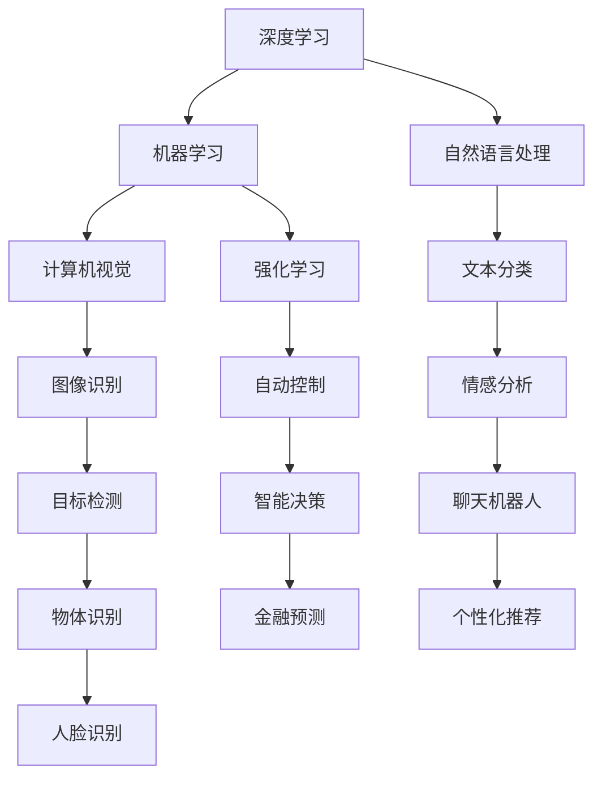

                 

# 人工智能 原理与代码实例讲解

> 关键词：人工智能,原理,代码实例,深度学习,机器学习,深度神经网络,强化学习,计算机视觉,自然语言处理,推荐系统

## 1. 背景介绍

### 1.1 问题由来
随着科技的飞速发展，人工智能(AI)已经渗透到各行各业，成为了推动社会进步的重要力量。特别是在深度学习和机器学习（Machine Learning, ML）领域，凭借其强大的数据处理能力和自主学习能力，AI技术取得了突破性进展，被广泛应用于图像识别、语音识别、自然语言处理、机器人控制等多个领域。

然而，尽管深度学习和机器学习带来了巨大便利，但其中仍存在诸多问题。诸如模型训练过程复杂、模型难以解释、模型性能过拟合等问题，一直是制约AI技术发展的瓶颈。因此，如何高效地进行AI模型的原理和代码实践，成为了当前亟待解决的关键问题。

### 1.2 问题核心关键点
本文聚焦于人工智能原理与代码实例讲解，特别关注深度学习和机器学习的核心算法及其实现，帮助读者理解AI技术的原理，并能够在实际应用中进行代码实践。

本文的核心关键点包括：
1. 深度学习原理与代码实现
2. 机器学习算法概述
3. 计算机视觉与自然语言处理实例
4. 强化学习与推荐系统框架
5. 模型训练与优化策略
6. 模型解释与性能分析

### 1.3 问题研究意义
通过深入理解AI技术的原理，掌握其实现方法，不仅可以帮助开发者更好地开发和使用AI模型，还能够促进学术界和工业界的技术交流和创新。具体意义如下：

1. 降低技术门槛：帮助读者快速上手AI技术，减少学习和实践成本。
2. 提高开发效率：掌握代码实例能够加快模型开发速度，提升模型性能。
3. 推动创新应用：深入理解AI原理，能够开发更具创新性的AI应用。
4. 强化技术合作：通过共享代码实例和研究成果，促进学术界与工业界的合作。
5. 实现商业价值：AI技术广泛应用于各行业，代码实例有助于企业快速部署AI解决方案。

## 2. 核心概念与联系

### 2.1 核心概念概述

为了更好地理解AI技术的实现原理，本文将介绍几个关键的核心概念：

1. 深度学习（Deep Learning, DL）：一种模拟人脑神经网络的计算模型，通过多层神经网络进行特征提取和分类等任务。
2. 机器学习（Machine Learning, ML）：让计算机从数据中学习规律，自动识别数据特征，进行分类、回归等任务。
3. 强化学习（Reinforcement Learning, RL）：让计算机在不断试错中学习最优策略，自动调整模型参数以获得最大收益。
4. 计算机视觉（Computer Vision, CV）：利用图像处理技术，使计算机具备识别、分析图像的能力。
5. 自然语言处理（Natural Language Processing, NLP）：使计算机具备理解、处理和生成人类语言的能力。
6. 推荐系统（Recommendation System）：根据用户历史行为，预测用户偏好，推荐个性化产品或内容。

### 2.2 概念间的关系

这些核心概念之间的关系通过以下Mermaid流程图展示：

该流程图展示了各个核心概念之间的关系，深度学习是机器学习的核心，计算机视觉和自然语言处理则是机器学习在不同领域的应用，强化学习则是让计算机具备自适应能力，推荐系统则是机器学习在推荐领域的典型应用。

## 3. 核心算法原理 & 具体操作步骤
### 3.1 算法原理概述

本文将详细介绍AI核心算法的原理和实现步骤，帮助读者深入理解这些算法的工作机制。

### 3.2 算法步骤详解

#### 3.2.1 深度学习算法
深度学习算法通常包括以下几个步骤：

1. 数据预处理：将原始数据进行清洗、归一化等处理，准备训练模型。
2. 模型构建：选择合适的深度神经网络结构，并设置各层参数。
3. 前向传播：将输入数据传入网络，逐层进行运算，输出特征。
4. 损失计算：计算预测值与真实值之间的差异，生成损失函数。
5. 反向传播：根据损失函数，反向传播计算各层梯度。
6. 参数更新：使用优化算法（如梯度下降）更新模型参数。
7. 迭代训练：多次重复上述步骤，直到模型收敛。

#### 3.2.2 机器学习算法
机器学习算法主要包括以下步骤：

1. 数据预处理：对数据进行清洗、归一化等处理，准备训练模型。
2. 模型选择：选择适合任务的机器学习算法，如回归、分类、聚类等。
3. 特征提取：对原始数据进行特征提取，生成特征向量。
4. 模型训练：使用训练数据训练模型，更新模型参数。
5. 模型评估：使用测试数据评估模型性能，调整参数。
6. 模型部署：将模型应用到实际场景中，进行预测或分类。

#### 3.2.3 强化学习算法
强化学习算法主要包括以下几个步骤：

1. 环境定义：定义问题环境，包括状态、动作和奖励。
2. 策略选择：选择合适的策略（如Q-learning、DQN等），并初始化模型。
3. 状态采样：从环境随机采样当前状态。
4. 动作选择：根据当前状态，选择动作。
5. 环境反馈：执行动作后，获取环境反馈（如奖励、新状态等）。
6. 模型更新：根据奖励和状态，更新模型参数。
7. 迭代优化：多次重复上述步骤，直到模型收敛。

#### 3.2.4 计算机视觉算法
计算机视觉算法通常包括以下几个步骤：

1. 数据预处理：对图像进行预处理，如裁剪、归一化等。
2. 特征提取：使用卷积神经网络（CNN）提取图像特征。
3. 特征分类：对提取的特征进行分类或回归，得到结果。
4. 模型训练：使用训练数据训练模型，调整模型参数。
5. 模型评估：使用测试数据评估模型性能，调整参数。
6. 模型部署：将模型应用到实际场景中，进行图像识别或分类。

#### 3.2.5 自然语言处理算法
自然语言处理算法通常包括以下几个步骤：

1. 数据预处理：对文本进行清洗、分词、标记化等处理。
2. 特征提取：使用循环神经网络（RNN）或Transformer等模型提取文本特征。
3. 特征分类：对提取的特征进行分类或回归，得到结果。
4. 模型训练：使用训练数据训练模型，调整模型参数。
5. 模型评估：使用测试数据评估模型性能，调整参数。
6. 模型部署：将模型应用到实际场景中，进行文本分类或生成。

#### 3.2.6 推荐系统算法
推荐系统算法通常包括以下几个步骤：

1. 数据预处理：对用户行为数据进行清洗、归一化等处理。
2. 特征提取：使用协同过滤、基于内容的推荐等方法提取特征。
3. 模型训练：使用训练数据训练模型，调整模型参数。
4. 模型评估：使用测试数据评估模型性能，调整参数。
5. 模型部署：将模型应用到实际场景中，进行个性化推荐。

### 3.3 算法优缺点
每种算法都有其独特的优缺点，下面逐一介绍：

#### 3.3.1 深度学习算法
- **优点**：
  - 强大的特征提取能力，适合处理复杂的数据结构。
  - 自动学习特征，无需手动设计特征工程。
  - 适用于多种任务，如图像识别、语音识别、自然语言处理等。

- **缺点**：
  - 模型复杂，训练时间长，计算资源消耗大。
  - 过拟合风险高，需要大量数据和复杂的正则化技术。
  - 模型解释性差，难以理解其内部决策机制。

#### 3.3.2 机器学习算法
- **优点**：
  - 算法多样，适用于多种数据类型和任务。
  - 模型训练速度快，计算资源消耗小。
  - 结果可解释性强，便于理解和调试。

- **缺点**：
  - 依赖于特征工程，需要手工设计合适的特征。
  - 数据质量要求高，模型性能受数据分布影响大。
  - 泛化能力有限，需要大量标注数据进行训练。

#### 3.3.3 强化学习算法
- **优点**：
  - 能够自主学习最优策略，适用于动态环境。
  - 能够处理连续动作空间和稀疏奖励问题。
  - 算法简单，易于实现和部署。

- **缺点**：
  - 模型训练时间长，计算资源消耗大。
  - 策略选择困难，容易陷入局部最优。
  - 模型不稳定，易受环境干扰。

#### 3.3.4 计算机视觉算法
- **优点**：
  - 图像识别精度高，适合处理视觉数据。
  - 模型结构清晰，易于理解和调试。
  - 算法多样，可适应多种应用场景。

- **缺点**：
  - 数据量要求高，需要大量标注数据进行训练。
  - 计算资源消耗大，需要高性能硬件支持。
  - 模型复杂，难以解释其内部决策机制。

#### 3.3.5 自然语言处理算法
- **优点**：
  - 能够处理自然语言，适合处理文本数据。
  - 模型结构清晰，易于理解和调试。
  - 算法多样，可适应多种应用场景。

- **缺点**：
  - 数据量要求高，需要大量标注数据进行训练。
  - 计算资源消耗大，需要高性能硬件支持。
  - 模型复杂，难以解释其内部决策机制。

#### 3.3.6 推荐系统算法
- **优点**：
  - 能够进行个性化推荐，提高用户体验。
  - 算法多样，适用于多种推荐场景。
  - 结果可解释性强，便于理解和调试。

- **缺点**：
  - 依赖于用户行为数据，数据获取难度大。
  - 模型训练时间长，计算资源消耗大。
  - 推荐结果受数据分布影响大，易受数据偏差影响。

### 3.4 算法应用领域

以上算法在各个领域都有广泛的应用，下面简要介绍一些典型的应用场景：

#### 3.4.1 深度学习
- **图像识别**：如人脸识别、物体识别、医学影像分析等。
- **语音识别**：如语音合成、语音翻译、情感识别等。
- **自然语言处理**：如机器翻译、文本分类、情感分析等。

#### 3.4.2 机器学习
- **金融预测**：如股票价格预测、信用风险评估等。
- **医疗诊断**：如疾病预测、基因分析等。
- **推荐系统**：如电商推荐、社交网络推荐等。

#### 3.4.3 强化学习
- **自动驾驶**：如路径规划、避障决策等。
- **游戏AI**：如AlphaGo、星际争霸等。
- **机器人控制**：如机器人导航、路径规划等。

#### 3.4.4 计算机视觉
- **视频分析**：如行为识别、动作识别等。
- **目标检测**：如行人检测、交通标志识别等。
- **人脸识别**：如身份验证、安防监控等。

#### 3.4.5 自然语言处理
- **聊天机器人**：如智能客服、智能助手等。
- **情感分析**：如舆情分析、用户情绪分析等。
- **文本分类**：如新闻分类、垃圾邮件过滤等。

#### 3.4.6 推荐系统
- **电商推荐**：如商品推荐、广告推荐等。
- **社交网络推荐**：如内容推荐、好友推荐等。
- **个性化推荐**：如音乐推荐、视频推荐等。

## 4. 数学模型和公式 & 详细讲解 & 举例说明
### 4.1 数学模型构建

本文将详细讲解几个核心算法中的数学模型构建，以帮助读者深入理解其原理和实现细节。

#### 4.1.1 深度学习模型构建
深度学习模型通常采用多层神经网络结构，包括输入层、隐藏层和输出层。以卷积神经网络（CNN）为例，其数学模型构建如下：

$$
y = f(W_2 f(W_1 x + b_1) + b_2)
$$

其中：
- $x$ 为输入向量。
- $W_1, W_2$ 为卷积核权重矩阵。
- $b_1, b_2$ 为偏置向量。
- $f$ 为非线性激活函数，如ReLU、Sigmoid等。

#### 4.1.2 机器学习模型构建
机器学习模型通常采用回归或分类模型，如线性回归、逻辑回归、决策树等。以线性回归模型为例，其数学模型构建如下：

$$
y = \theta_0 + \sum_{i=1}^n \theta_i x_i
$$

其中：
- $x_i$ 为特征向量。
- $\theta_0, \theta_1, \cdots, \theta_n$ 为模型参数。
- $y$ 为预测结果。

#### 4.1.3 强化学习模型构建
强化学习模型通常采用Q-learning或DQN模型，其数学模型构建如下：

$$
Q(s, a) \leftarrow Q(s, a) + \alpha [r + \gamma \max_a Q(s', a') - Q(s, a)]
$$

其中：
- $s$ 为状态。
- $a$ 为动作。
- $Q(s, a)$ 为状态-动作值函数。
- $r$ 为奖励。
- $\gamma$ 为折扣因子。
- $s', a'$ 为下一个状态和动作。
- $\alpha$ 为学习率。

#### 4.1.4 计算机视觉模型构建
计算机视觉模型通常采用卷积神经网络（CNN），其数学模型构建如下：

$$
y = f(W_{conv} f_{conv}(x) + b_{conv})
$$

其中：
- $x$ 为输入图像。
- $W_{conv}$ 为卷积核权重矩阵。
- $f_{conv}$ 为卷积运算。
- $b_{conv}$ 为偏置向量。
- $f$ 为非线性激活函数，如ReLU、Sigmoid等。

#### 4.1.5 自然语言处理模型构建
自然语言处理模型通常采用循环神经网络（RNN）或Transformer模型，其数学模型构建如下：

$$
y = f(W_{rec} f_{rec}(x) + b_{rec})
$$

其中：
- $x$ 为输入文本。
- $W_{rec}$ 为权重矩阵。
- $f_{rec}$ 为循环运算。
- $b_{rec}$ 为偏置向量。
- $f$ 为非线性激活函数，如ReLU、Sigmoid等。

#### 4.1.6 推荐系统模型构建
推荐系统模型通常采用协同过滤、基于内容的推荐等方法，其数学模型构建如下：

$$
y = f(W_{u} f_{u}(x) + b_{u})
$$

其中：
- $x$ 为用户行为数据。
- $W_{u}$ 为用户权重矩阵。
- $f_{u}$ 为用户特征提取。
- $b_{u}$ 为用户偏置向量。
- $f$ 为非线性激活函数，如ReLU、Sigmoid等。

### 4.2 公式推导过程

#### 4.2.1 深度学习公式推导
以卷积神经网络（CNN）为例，其反向传播公式推导如下：

- **前向传播**：
$$
y = f(W_2 f(W_1 x + b_1) + b_2)
$$

- **损失函数**：
$$
L = \frac{1}{2} \sum_{i=1}^n (y_i - \hat{y_i})^2
$$

- **反向传播**：
$$
\begin{aligned}
\frac{\partial L}{\partial W_2} &= f'(W_2 f(W_1 x + b_1) + b_2) f'(W_1 x + b_1) W_1^T \\
\frac{\partial L}{\partial W_1} &= W_2^T f'(W_2 f(W_1 x + b_1) + b_2) f'(W_1 x + b_1) \\
\frac{\partial L}{\partial x} &= W_1^T W_2^T f'(W_2 f(W_1 x + b_1) + b_2) f'(W_1 x + b_1)
\end{aligned}
$$

其中 $f'$ 为激活函数导数。

#### 4.2.2 机器学习公式推导
以线性回归为例，其反向传播公式推导如下：

- **前向传播**：
$$
y = \theta_0 + \sum_{i=1}^n \theta_i x_i
$$

- **损失函数**：
$$
L = \frac{1}{2} \sum_{i=1}^n (y_i - \hat{y_i})^2
$$

- **反向传播**：
$$
\frac{\partial L}{\partial \theta_i} = \sum_{i=1}^n (y_i - \hat{y_i}) x_i
$$

#### 4.2.3 强化学习公式推导
以Q-learning为例，其反向传播公式推导如下：

- **前向传播**：
$$
Q(s, a) \leftarrow Q(s, a) + \alpha [r + \gamma \max_a Q(s', a') - Q(s, a)]
$$

- **损失函数**：
$$
L = \sum_{i=1}^n (y_i - \hat{y_i})^2
$$

- **反向传播**：
$$
\frac{\partial L}{\partial Q(s, a)} = -y + r + \gamma \max_a Q(s', a') - Q(s, a)
$$

#### 4.2.4 计算机视觉公式推导
以卷积神经网络（CNN）为例，其反向传播公式推导如下：

- **前向传播**：
$$
y = f(W_{conv} f_{conv}(x) + b_{conv})
$$

- **损失函数**：
$$
L = \frac{1}{2} \sum_{i=1}^n (y_i - \hat{y_i})^2
$$

- **反向传播**：
$$
\frac{\partial L}{\partial W_{conv}} = f'(W_{conv} f_{conv}(x) + b_{conv}) f'_{conv}(x) x^T
$$

#### 4.2.5 自然语言处理公式推导
以循环神经网络（RNN）为例，其反向传播公式推导如下：

- **前向传播**：
$$
y = f(W_{rec} f_{rec}(x) + b_{rec})
$$

- **损失函数**：
$$
L = \frac{1}{2} \sum_{i=1}^n (y_i - \hat{y_i})^2
$$

- **反向传播**：
$$
\frac{\partial L}{\partial W_{rec}} = f'(W_{rec} f_{rec}(x) + b_{rec}) f'_{rec}(x) x^T
$$

#### 4.2.6 推荐系统公式推导
以协同过滤为例，其反向传播公式推导如下：

- **前向传播**：
$$
y = f(W_{u} f_{u}(x) + b_{u})
$$

- **损失函数**：
$$
L = \frac{1}{2} \sum_{i=1}^n (y_i - \hat{y_i})^2
$$

- **反向传播**：
$$
\frac{\partial L}{\partial W_{u}} = f'(W_{u} f_{u}(x) + b_{u}) f'_{u}(x) x^T
$$

### 4.3 案例分析与讲解

#### 4.3.1 深度学习案例
以图像识别为例，使用卷积神经网络（CNN）进行图像分类任务。

- **数据预处理**：将图像进行归一化处理。
- **模型构建**：构建包含多个卷积层和池化层的CNN模型。
- **前向传播**：将图像输入模型，逐层进行卷积和池化运算。
- **损失计算**：计算预测值与真实值之间的差异，生成损失函数。
- **反向传播**：根据损失函数，反向传播计算各层梯度。
- **参数更新**：使用梯度下降算法更新模型参数。
- **迭代训练**：多次重复上述步骤，直到模型收敛。

#### 4.3.2 机器学习案例
以金融预测为例，使用线性回归模型进行股票价格预测。

- **数据预处理**：对历史股价数据进行归一化处理。
- **模型构建**：构建包含线性回归模型的预测模型。
- **特征提取**：提取历史股价、交易量等特征。
- **模型训练**：使用历史数据训练模型，调整模型参数。
- **模型评估**：使用测试数据评估模型性能，调整参数。
- **模型部署**：将模型应用到实际场景中，进行股票价格预测。

#### 4.3.3 强化学习案例
以自动驾驶为例，使用Q-learning算法进行路径规划。

- **环境定义**：定义交通环境，包括道路、车辆、行人等。
- **策略选择**：选择Q-learning算法，并初始化模型。
- **状态采样**：从环境随机采样当前状态。
- **动作选择**：根据当前状态，选择动作（如加速、减速、转向等）。
- **环境反馈**：执行动作后，获取环境反馈（如奖励、新状态等）。
- **模型更新**：根据奖励和状态，更新模型参数。
- **迭代优化**：多次重复上述步骤，直到模型收敛。

#### 4.3.4 计算机视觉案例
以视频分析为例，使用卷积神经网络（CNN）进行行为识别。

- **数据预处理**：将视频进行帧提取、归一化处理。
- **特征提取**：使用CNN提取视频帧的特征。
- **特征分类**：对提取的特征进行分类或回归，得到行为识别结果。
- **模型训练**：使用训练数据训练模型，调整模型参数。
- **模型评估**：使用测试数据评估模型性能，调整参数。
- **模型部署**：将模型应用到实际场景中，进行行为识别。

#### 4.3.5 自然语言处理案例
以聊天机器人为例，使用循环神经网络（RNN）进行对话生成。

- **数据预处理**：将对话历史进行标记化处理。
- **特征提取**：提取对话历史中的语义特征。
- **模型训练**：使用对话历史训练模型，调整模型参数。
- **模型评估**：使用测试数据评估模型性能，调整参数。
- **模型部署**：将模型应用到实际场景中，进行对话生成。

#### 4.3.6 推荐系统案例
以电商推荐为例，使用协同过滤算法进行个性化推荐。

- **数据预处理**：对用户行为数据进行清洗、归一化处理。
- **特征提取**：使用协同过滤算法提取用户和物品的特征。
- **模型训练**：使用用户行为数据训练模型，调整模型参数。
- **模型评估**：使用测试数据评估模型性能，调整参数。
- **模型部署**：将模型应用到实际场景中，进行个性化推荐。

## 5. 项目实践：代码实例和详细解释说明
### 5.1 开发环境搭建

为了进行AI项目的实践，我们需要搭建一个合适的开发环境。以下是Python环境搭建的详细步骤：

1. **安装Python**：
   - 下载并安装最新版本的Python（建议3.8或更高版本）。
   - 设置Python环境变量，使其成为默认的解释器。

2. **安装PyTorch**：
   - 使用pip安装PyTorch及其依赖包，如NumPy、Pandas等。
   - 安装TensorBoard，用于可视化训练过程和模型性能。

3. **安装TensorFlow**：
   - 使用pip安装TensorFlow及其依赖包，如CUDA、cuDNN等。
   - 安装Weights & Biases，用于实验跟踪和模型管理。

4. **安装Scikit-learn**：
   - 使用pip安装Scikit-learn及其依赖包，如NumPy、SciPy等。
   - 安装Tqdm，用于进度条显示。

5. **安装其他库**：
   - 安装P

