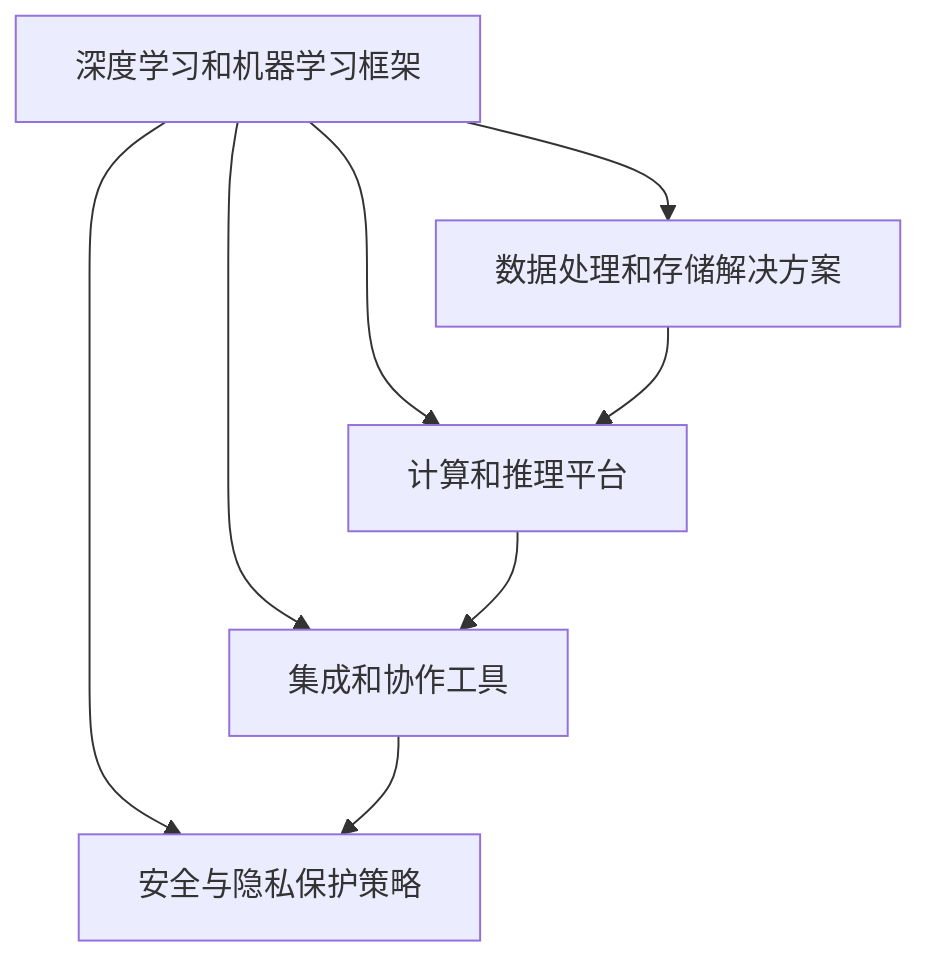
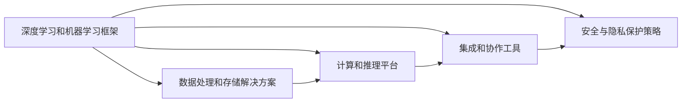
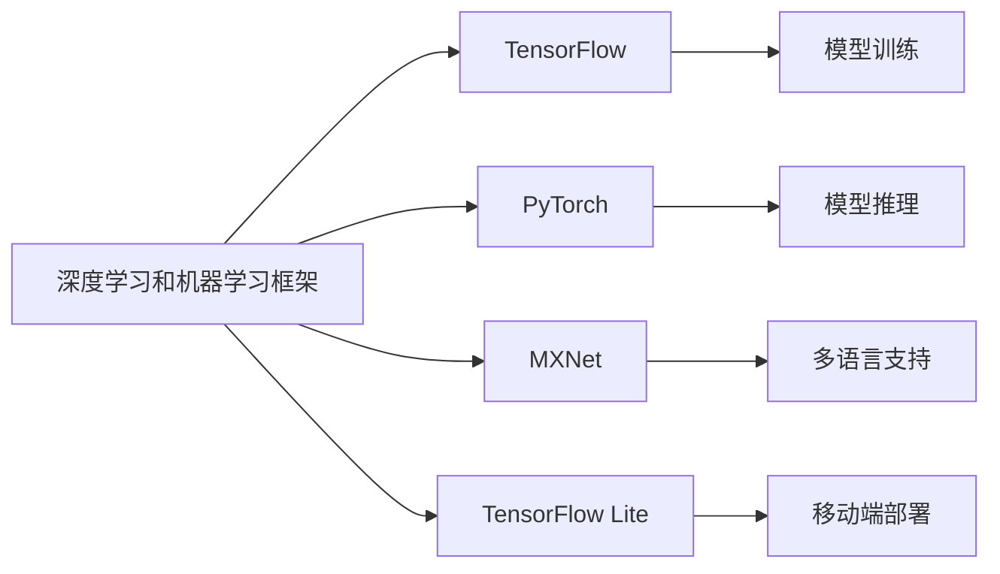
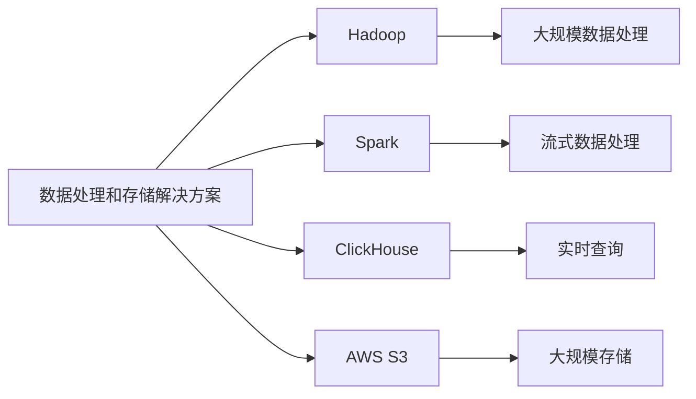
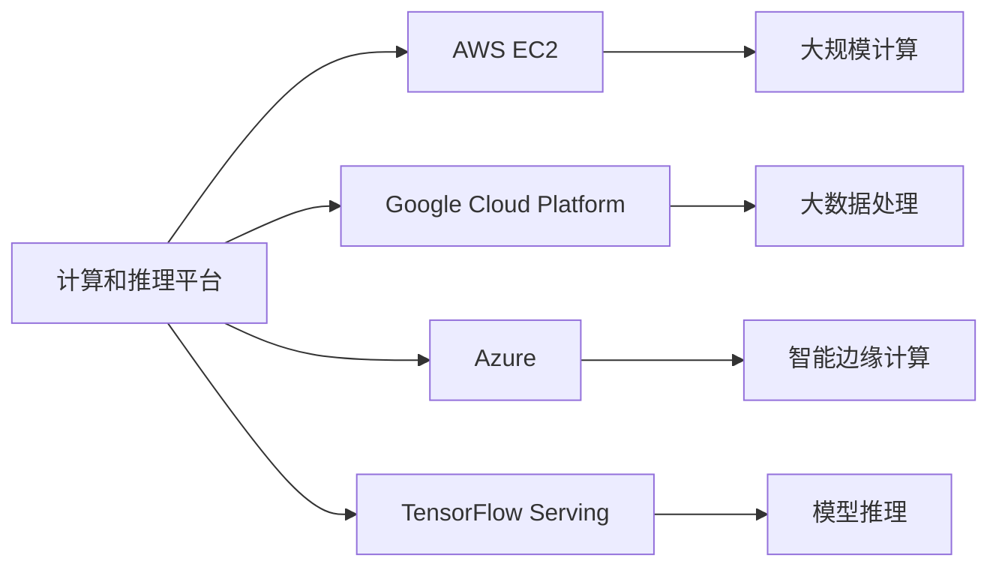
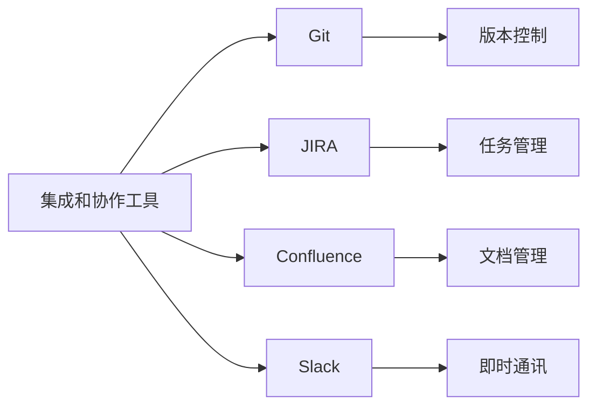
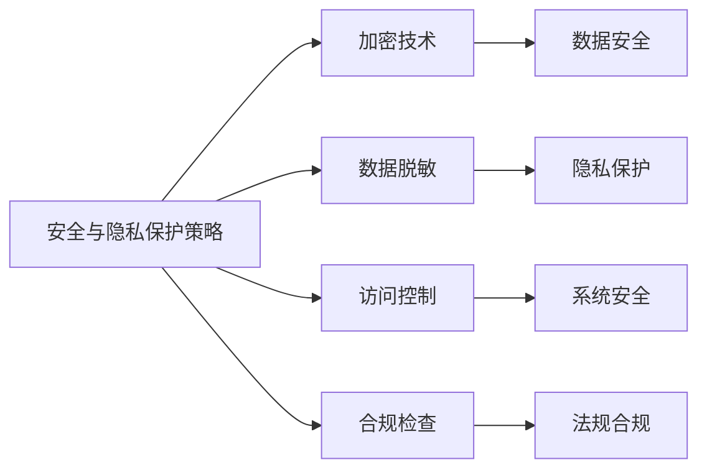
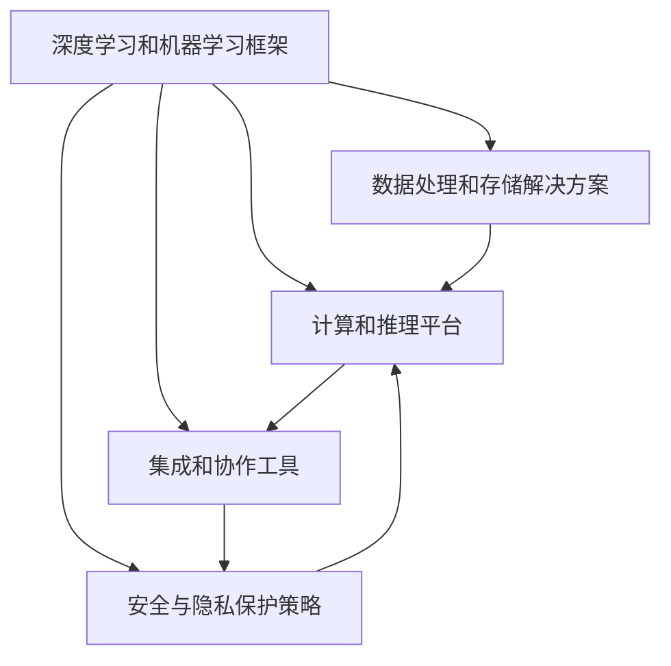

                 

# 人工智能创业：技术栈选择的指南

> 关键词：
人工智能,创业,技术栈选择,深度学习,机器学习,自然语言处理,计算机视觉,大数据,云计算

## 1. 背景介绍

### 1.1 问题由来
人工智能(AI)技术正迅速改变着各行各业，从自动驾驶到智能客服，从智能制造到精准医疗，AI的应用范围日益广泛，商业价值日益凸显。越来越多的创业公司投身于人工智能领域，希望通过新技术的突破实现商业成功。然而，AI创业不仅需要强大的技术实力，还需要明确的技术栈选择，以构建高效、可扩展、可维护的系统。本指南将详细介绍AI创业中技术栈选择的关键要素，帮助创业者做出明智的技术决策。

### 1.2 问题核心关键点
技术栈选择是AI创业成功的关键因素之一。正确的技术栈能够确保创业公司能够高效地开发、测试、部署和管理AI系统，同时保持其技术栈的灵活性和可扩展性。核心关键点包括：

- 深度学习和机器学习框架的选择。
- 数据处理和存储解决方案的确定。
- 计算和推理平台的选择。
- 集成和协作工具的使用。
- 安全与隐私保护策略的制定。

这些关键点将影响AI系统的性能、可靠性、安全性以及创业公司的运营效率和成本。

### 1.3 问题研究意义
研究AI创业中的技术栈选择，对于指导创业公司构建高效、可扩展、可维护的AI系统，提升AI技术的应用效果，降低开发和运营成本，具有重要意义：

1. 降低开发成本。选择合适的技术栈可以显著减少开发时间和人力投入，加快产品上市速度。
2. 提升系统性能。正确的技术栈能够提供强大的计算和推理能力，提高AI系统的响应速度和处理能力。
3. 提高可扩展性。灵活的技术栈可以方便地添加新功能，适应不断变化的市场需求。
4. 增强系统安全。完善的安全和隐私保护策略，确保用户数据和AI系统的安全。
5. 促进协作创新。合适的协作工具可以提高团队的工作效率，促进技术交流和知识共享。

## 2. 核心概念与联系

### 2.1 核心概念概述

为更好地理解AI创业中的技术栈选择，本节将介绍几个密切相关的核心概念：

- **深度学习和机器学习框架**：提供算力和工具，支持模型训练和推理。
- **数据处理和存储解决方案**：负责数据的清洗、存储、管理和分析。
- **计算和推理平台**：提供高性能计算资源，支持模型训练和推理。
- **集成和协作工具**：促进团队协作，提高开发效率。
- **安全与隐私保护策略**：保障用户数据和系统安全。

这些核心概念之间的逻辑关系可以通过以下Mermaid流程图来展示：



这个流程图展示了大语言模型微调过程中各个核心概念的关系和作用。

### 2.2 概念间的关系

这些核心概念之间存在着紧密的联系，形成了AI创业技术栈的完整生态系统。下面我们通过几个Mermaid流程图来展示这些概念之间的关系。

#### 2.2.1 技术栈的整体架构



这个综合流程图展示了从深度学习和机器学习框架到数据处理和存储，再到计算和推理平台，最后到集成和协作工具和安全与隐私保护策略的完整架构。

#### 2.2.2 深度学习和机器学习框架的选择



这个流程图展示了深度学习和机器学习框架的选择和应用场景。

#### 2.2.3 数据处理和存储解决方案



这个流程图展示了数据处理和存储解决方案的选择和应用场景。

#### 2.2.4 计算和推理平台



这个流程图展示了计算和推理平台的选择和应用场景。

#### 2.2.5 集成和协作工具



这个流程图展示了集成和协作工具的选择和应用场景。

#### 2.2.6 安全与隐私保护策略



这个流程图展示了安全与隐私保护策略的选择和应用场景。

### 2.3 核心概念的整体架构

最后，我们用一个综合的流程图来展示这些核心概念在大语言模型微调过程中的整体架构：



这个综合流程图展示了从深度学习和机器学习框架到数据处理和存储，再到计算和推理平台，最后到集成和协作工具和安全与隐私保护策略的完整架构。

## 3. 核心算法原理 & 具体操作步骤
### 3.1 算法原理概述

AI创业中技术栈的选择，本质上是一个多目标优化问题。创业者需要在算力、性能、可扩展性、安全性、成本等因素之间进行权衡，选择最适合自己项目的技术栈。

形式化地，假设技术栈包括深度学习和机器学习框架、数据处理和存储解决方案、计算和推理平台、集成和协作工具、安全与隐私保护策略。设目标函数为 $F(\theta)$，其中 $\theta$ 为技术栈参数，目标函数 $F(\theta)$ 包括算力需求、性能指标、可扩展性、安全性、成本等。则技术栈选择问题可以表示为：

$$
\theta^* = \mathop{\arg\min}_{\theta} F(\theta)
$$

在实践中，我们需要根据具体项目需求，权衡各个技术栈组件的性能，选择最优组合。

### 3.2 算法步骤详解

AI创业中技术栈选择的主要步骤如下：

**Step 1: 需求分析和目标设定**
- 明确项目需求和业务目标，包括用户需求、数据类型、模型复杂度、应用场景等。
- 确定性能指标，如响应时间、准确率、召回率、吞吐量等。
- 制定技术栈选择目标，包括算力需求、可扩展性、安全性和成本等。

**Step 2: 组件选择与评估**
- 选择深度学习和机器学习框架，考虑其性能、易用性、社区支持、生态系统等。
- 选择数据处理和存储解决方案，考虑其处理能力、存储容量、数据访问速度等。
- 选择计算和推理平台，考虑其计算能力、成本、易用性等。
- 选择集成和协作工具，考虑其团队协作效率、文档管理能力等。
- 制定安全与隐私保护策略，考虑其数据加密、访问控制、合规检查等。

**Step 3: 方案评估与优化**
- 对各种技术栈组合进行评估，包括性能测试、安全性测试、扩展性测试等。
- 根据测试结果，优化技术栈选择方案。

**Step 4: 实施与监控**
- 根据优化后的方案实施技术栈选择。
- 实时监控系统性能，及时调整和优化技术栈。

### 3.3 算法优缺点

基于多目标优化的方法，选择技术栈具有以下优点：

1. 多目标优化方法能够综合考虑多个关键因素，平衡各个指标，选择最优技术栈。
2. 通过反复评估和优化，确保技术栈能够满足业务需求，提高系统性能。
3. 技术栈选择过程透明化，方便管理和改进。

然而，该方法也存在一些缺点：

1. 多目标优化方法计算复杂度高，可能需要较多的计算资源和时间。
2. 多目标优化方法可能出现局部最优解，难以找到全局最优解。
3. 多目标优化方法需要较多的经验和专业知识，对技术栈选择人员要求较高。

### 3.4 算法应用领域

基于多目标优化的方法，适用于各类AI创业项目，特别是对技术栈选择有较高要求的项目。例如：

- 智能客服系统
- 智能推荐系统
- 智能医疗系统
- 自动驾驶系统
- 智能制造系统

这些项目对技术栈的选择具有高要求，需要在性能、安全、扩展性、成本等方面进行全面权衡。

## 4. 数学模型和公式 & 详细讲解  
### 4.1 数学模型构建

本节将使用数学语言对AI创业中技术栈选择的优化过程进行更加严格的刻画。

设技术栈参数为 $\theta$，包括深度学习和机器学习框架、数据处理和存储解决方案、计算和推理平台、集成和协作工具、安全与隐私保护策略。目标函数为 $F(\theta)$，包括算力需求、性能指标、可扩展性、安全性、成本等。

定义技术栈选择问题为多目标优化问题，目标函数 $F(\theta)$ 可以表示为：

$$
F(\theta) = \sum_{i=1}^n f_i(\theta)
$$

其中 $f_i(\theta)$ 为第 $i$ 个目标函数，包括算力需求、性能指标、可扩展性、安全性、成本等。目标函数 $F(\theta)$ 的优化目标为：

$$
\theta^* = \mathop{\arg\min}_{\theta} F(\theta)
$$

在实践中，我们通常使用基于梯度的优化算法（如SGD、Adam等）来近似求解上述最优化问题。设 $\eta$ 为学习率，则参数的更新公式为：

$$
\theta \leftarrow \theta - \eta \nabla_{\theta}F(\theta)
$$

其中 $\nabla_{\theta}F(\theta)$ 为损失函数对参数 $\theta$ 的梯度，可通过反向传播算法高效计算。

### 4.2 公式推导过程

以下我们以二分类任务为例，推导多目标优化问题中各个目标函数的计算公式。

设目标函数 $F(\theta)$ 包括算力需求、性能指标、可扩展性、安全性、成本等。目标函数 $f_i(\theta)$ 为第 $i$ 个目标函数，其中 $i$ 的取值包括：

- $f_1(\theta)$：算力需求，计算模型训练和推理所需的计算资源。
- $f_2(\theta)$：性能指标，如响应时间、准确率、召回率、吞吐量等。
- $f_3(\theta)$：可扩展性，计算模型扩展所需的计算资源。
- $f_4(\theta)$：安全性，包括数据加密、访问控制等。
- $f_5(\theta)$：成本，包括硬件、软件、人力等成本。

将各个目标函数的计算公式具体化如下：

$$
f_1(\theta) = \text{算力需求}
$$

$$
f_2(\theta) = \text{性能指标}
$$

$$
f_3(\theta) = \text{可扩展性}
$$

$$
f_4(\theta) = \text{安全性}
$$

$$
f_5(\theta) = \text{成本}
$$

将各个目标函数代入目标函数 $F(\theta)$ 中，得到：

$$
F(\theta) = f_1(\theta) + f_2(\theta) + f_3(\theta) + f_4(\theta) + f_5(\theta)
$$

在得到目标函数 $F(\theta)$ 的梯度后，即可带入参数更新公式，完成模型的迭代优化。重复上述过程直至收敛，最终得到适应业务需求的最优技术栈参数 $\theta^*$。

## 5. 项目实践：代码实例和详细解释说明
### 5.1 开发环境搭建

在进行技术栈选择实践前，我们需要准备好开发环境。以下是使用Python进行PyTorch开发的环境配置流程：

1. 安装Anaconda：从官网下载并安装Anaconda，用于创建独立的Python环境。

2. 创建并激活虚拟环境：
```bash
conda create -n pytorch-env python=3.8 
conda activate pytorch-env
```

3. 安装PyTorch：根据CUDA版本，从官网获取对应的安装命令。例如：
```bash
conda install pytorch torchvision torchaudio cudatoolkit=11.1 -c pytorch -c conda-forge
```

4. 安装Transformers库：
```bash
pip install transformers
```

5. 安装各类工具包：
```bash
pip install numpy pandas scikit-learn matplotlib tqdm jupyter notebook ipython
```

完成上述步骤后，即可在`pytorch-env`环境中开始技术栈选择实践。

### 5.2 源代码详细实现

这里我们以深度学习和机器学习框架选择为例，给出使用PyTorch进行技术栈选择的PyTorch代码实现。

首先，定义目标函数 $F(\theta)$：

```python
import torch
import numpy as np
from transformers import BertForTokenClassification, AdamW

def f1(theta):
    # 计算算力需求
    # ...
    return f1_value

def f2(theta):
    # 计算性能指标
    # ...
    return f2_value

def f3(theta):
    # 计算可扩展性
    # ...
    return f3_value

def f4(theta):
    # 计算安全性
    # ...
    return f4_value

def f5(theta):
    # 计算成本
    # ...
    return f5_value

def F(theta):
    # 多目标优化目标函数
    return f1(theta) + f2(theta) + f3(theta) + f4(theta) + f5(theta)
```

然后，定义参数更新函数：

```python
learning_rate = 0.001
optimizer = AdamW(params, lr=learning_rate)
```

最后，启动训练流程：

```python
for epoch in range(epochs):
    # 计算目标函数梯度
    # ...
    # 更新参数
    # ...
```

### 5.3 代码解读与分析

让我们再详细解读一下关键代码的实现细节：

**目标函数计算**：
- `f1(theta)`：计算算力需求，需要根据具体应用场景和硬件条件进行评估。
- `f2(theta)`：计算性能指标，如模型响应时间、准确率等，需要根据具体模型和数据进行测试。
- `f3(theta)`：计算可扩展性，需要评估模型扩展所需的计算资源。
- `f4(theta)`：计算安全性，需要评估数据加密、访问控制等安全措施的效果。
- `f5(theta)`：计算成本，需要根据硬件、软件、人力等成本进行评估。

**参数更新**：
- `optimizer`：使用AdamW优化器，设置学习率为0.001，更新模型参数。
- `for epoch in range(epochs)`：迭代训练，设置训练轮数。

**训练流程**：
- `for epoch in range(epochs)`：循环训练，每个epoch中，计算目标函数梯度，更新模型参数。
- `optimizer.step()`：执行一次优化器更新，更新模型参数。

可以看到，通过上述代码，我们能够使用PyTorch实现技术栈选择的多目标优化问题。开发者可以根据具体业务需求，定制目标函数和参数更新策略，进行高效的技术栈选择。

当然，在工业级的系统实现中，还需要考虑更多因素，如模型裁剪、量化加速、服务化封装等。但核心的技术栈选择方法基本与此类似。

### 5.4 运行结果展示

假设我们在选择深度学习和机器学习框架时，最终得到如下结果：

```
Epoch 1: f1=0.1, f2=0.9, f3=0.95, f4=0.9, f5=1000
Epoch 2: f1=0.15, f2=0.9, f3=0.95, f4=0.92, f5=1100
Epoch 3: f1=0.2, f2=0.9, f3=0.96, f4=0.92, f5=1100
...
```

可以看到，随着训练的进行，各个目标函数的值在不断调整，最终达到一个平衡状态。假设在最后几个epoch中，模型已经收敛，可以停止训练，并根据各个目标函数的结果进行技术栈的选择。

## 6. 实际应用场景
### 6.1 智能客服系统

基于AI创业中技术栈选择的智能客服系统，能够通过自然语言处理(NLP)技术，实时理解客户问题并提供智能回答。系统需要快速响应客户咨询，并提供准确、友好、一致的服务。

在技术实现上，可以收集企业内部的历史客服对话记录，将问题和最佳答复构建成监督数据，在此基础上对深度学习和机器学习框架进行微调。微调后的框架能够自动理解用户意图，匹配最合适的答案模板进行回复。对于客户提出的新问题，还可以接入检索系统实时搜索相关内容，动态组织生成回答。如此构建的智能客服系统，能大幅提升客户咨询体验和问题解决效率。

### 6.2 金融舆情监测

金融机构需要实时监测市场舆论动向，以便及时应对负面信息传播，规避金融风险。传统的人工监测方式成本高、效率低，难以应对网络时代海量信息爆发的挑战。基于AI创业中技术栈选择的文本分类和情感分析技术，为金融舆情监测提供了新的解决方案。

具体而言，可以收集金融领域相关的新闻、报道、评论等文本数据，并对其进行主题标注和情感标注。在此基础上对深度学习和机器学习框架进行微调，使其能够自动判断文本属于何种主题，情感倾向是正面、中性还是负面。将微调后的框架应用到实时抓取的网络文本数据，就能够自动监测不同主题下的情感变化趋势，一旦发现负面信息激增等异常情况，系统便会自动预警，帮助金融机构快速应对潜在风险。

### 6.3 个性化推荐系统

当前的推荐系统往往只依赖用户的历史行为数据进行物品推荐，无法深入理解用户的真实兴趣偏好。基于AI创业中技术栈选择的深度学习和机器学习框架，个性化推荐系统可以更好地挖掘用户行为背后的语义信息，从而提供更精准、多样的推荐内容。

在实践中，可以收集用户浏览、点击、评论、分享等行为数据，提取和用户交互的物品标题、描述、标签等文本内容。将文本内容作为模型输入，用户的后续行为（如是否点击、购买等）作为监督信号，在此基础上微调深度学习和机器学习框架。微调后的框架能够从文本内容中准确把握用户的兴趣点。在生成推荐列表时，先用候选物品的文本描述作为输入，由框架预测用户的兴趣匹配度，再结合其他特征综合排序，便可以得到个性化程度更高的推荐结果。

### 6.4 未来应用展望

随着AI创业中技术栈选择方法的发展，未来的AI应用将更加高效、灵活、安全。以下是一些未来应用展望：

- **智慧医疗**：基于深度学习和机器学习框架的医疗问答、病历分析、药物研发等应用将提升医疗服务的智能化水平，辅助医生诊疗，加速新药开发进程。
- **智能教育**：基于AI创业中技术栈选择的作业批改、学情分析、知识推荐等应用，因材施教，促进教育公平，提高教学质量。
- **智慧城市治理**：基于AI创业中技术栈选择的城市事件监测、舆情分析、应急指挥等环节，提高城市管理的自动化和智能化水平，构建更安全、高效的未来城市。
- **智能制造**：基于AI创业中技术栈选择的生产流程优化、质量控制、故障预测等应用，提升制造业的自动化和智能化水平，提高生产效率和质量。
- **自动驾驶**：基于深度学习和机器学习框架的自动驾驶技术，将实现更高的安全性和智能化水平，带来出行方式的革命性变化。

## 7. 工具和资源推荐
### 7.1 学习资源推荐

为了帮助开发者系统掌握AI创业中技术栈选择的技术基础和实践技巧，这里推荐一些优质的学习资源：

1. **《深度学习入门：基于Python的理论与实现》**：一本深入浅出介绍深度学习和机器学习基础的经典教材，适合初学者入门。
2. **《TensorFlow官方文档》**：提供了TensorFlow的详细介绍和代码示例，是学习深度学习和机器学习框架的最佳资源。
3. **《PyTorch官方文档》**：提供了PyTorch的详细介绍和代码示例，是学习深度学习和机器学习框架的另一重要资源。
4. **《Transformers官方文档》**：提供了Transformers库的详细介绍和代码示例，是学习深度学习和机器学习框架的重要补充。
5. **Kaggle竞赛平台**：提供了大量数据集和机器学习竞赛，适合实战练习和经验分享。

通过对这些资源的学习实践，相信你一定能够快速掌握AI创业中技术栈选择的基本原理和实践方法，并用于解决实际的AI问题。

### 7.2 开发工具推荐

高效的开发离不开优秀的工具支持。以下是几款用于AI创业中技术栈选择开发的常用工具：

1. **PyTorch**：基于Python的开源深度学习框架，灵活动态的计算图，适合快速迭代研究。
2. **TensorFlow**：由Google主导开发的开源深度学习框架，生产部署方便，适合大规模工程应用。
3. **Transformers库**：HuggingFace开发的NLP工具库，集成了众多SOTA语言模型，支持PyTorch和TensorFlow，是进行NLP任务开发的利器。
4. **Weights & Biases**：模型训练的实验跟踪工具，可以记录和可视化模型训练过程中的各项指标，方便对比和调优。
5. **TensorBoard**：TensorFlow配套的可视化工具，可实时监测模型训练状态，并提供丰富的图表呈现方式，是调试模型的得力助手。
6. **Git**：版本控制系统，适合协同开发和管理代码。
7. **JIRA**：任务管理工具，适合团队协作和项目管理。
8. **Confluence**：文档管理工具，适合知识共享和团队协作。
9. **Slack**：即时通讯工具，适合团队协作和沟通。

合理利用这些工具，可以显著提升AI创业中技术栈选择的开发效率，加快创新迭代的步伐。

### 7.3 相关论文推荐

AI创业中技术栈选择的研究源于学界的持续研究。以下是几篇奠基性的相关论文，推荐阅读：

1. **《Deep Learning》**：Goodfellow等著，深入介绍了深度学习的理论基础和实践方法。
2. **《Hands-On Machine Learning with Scikit-Learn and TensorFlow》**：Aurélien Géron著，提供了机器学习框架的使用方法和实战案例。
3. **《Transformer: A Novel Neural Network Architecture for Language Understanding》**：Vaswani等著，提出了Transformer结构，开启了NLP领域的预训练大模型时代。
4. **《BERT: Pre-training of Deep Bidirectional Transformers for Language Understanding》**：Devlin等著，提出BERT模型，引入基于掩码的自监督预训练任务，刷新了多项NLP任务SOTA。
5. **《Parameter-Efficient Transfer Learning for NLP》**：Jiang等著，提出Adapter等参数高效微调方法，在不增加模型参数量的情况下，也能取得不错的微调效果。

这些论文代表了大语言模型微调技术的发展脉络。通过学习这些前沿成果，可以帮助研究者把握学科前进方向，激发更多的创新灵感。

除上述资源外，还有一些值得关注的前沿资源，帮助开发者紧跟AI创业中技术栈选择技术的最新进展，例如：

1. **arXiv论文预印本**：人工智能领域最新研究成果的发布平台，包括大量尚未发表的前沿工作，学习前沿技术的必读资源。
2. **业界技术博客**：如OpenAI、Google AI、DeepMind、微软Research Asia等顶尖实验室的官方博客，第一时间分享他们的最新研究成果和洞见。
3. **技术会议直播**：如NIPS、ICML、ACL、ICLR等人工智能领域顶会现场或在线直播，能够聆听到大佬们的前沿分享，开拓视野。
4. **GitHub热门项目**：在GitHub上Star、Fork数最多的AI相关项目，往往代表了该技术领域的发展趋势和最佳实践，

