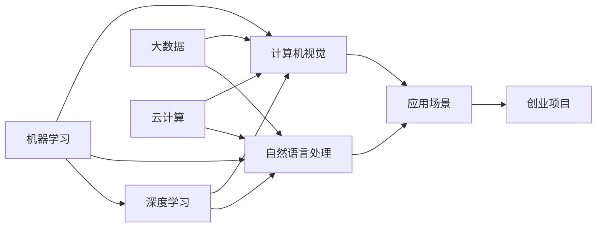

                 

# 人工智能创业：选择合适的技术栈

> 关键词：人工智能，技术栈，机器学习，深度学习，自然语言处理，计算机视觉，大数据，云计算

## 1. 背景介绍

随着人工智能技术的迅猛发展，越来越多的创业者希望能够利用这一领域的技术，创造出具有市场竞争力的产品。然而，人工智能技术的专业性和复杂性，使得选择合适的技术栈变得尤为重要。本文将详细探讨如何选择适合人工智能创业的技术栈，并结合实际案例，提供一些实用的建议和思路。

## 2. 核心概念与联系

### 2.1 核心概念概述

在人工智能创业的过程中，选择合适的技术栈是至关重要的。以下是一些关键概念及其相互之间的联系：

- **机器学习（Machine Learning, ML）**：通过让计算机从数据中学习，从而做出预测或决策。机器学习是人工智能的核心技术之一。
- **深度学习（Deep Learning, DL）**：基于神经网络的机器学习技术，特别适用于处理复杂数据结构，如图像、语音、文本等。
- **自然语言处理（Natural Language Processing, NLP）**：使计算机能够理解、处理和生成人类语言的技术，应用广泛于聊天机器人、文本分析、信息检索等。
- **计算机视觉（Computer Vision, CV）**：使计算机能够通过图像和视频理解现实世界，应用广泛于自动驾驶、医疗影像分析、人脸识别等。
- **大数据（Big Data）**：处理和分析大规模数据集，为人工智能模型提供数据支持。
- **云计算（Cloud Computing）**：利用云平台提供的高效计算和存储资源，加速人工智能模型的训练和部署。

这些概念之间的联系是通过数据、模型和计算资源来串联的。机器学习和深度学习是核心技术，而自然语言处理和计算机视觉则扩展了应用范围。大数据提供了数据基础，云计算提供了计算基础，两者共同支持了人工智能模型的训练和部署。

### 2.2 概念间的关系

下面通过几个Mermaid流程图来展示这些核心概念之间的关系：



这个流程图展示了各个核心概念之间的相互关系和应用场景。机器学习和深度学习是核心技术，自然语言处理和计算机视觉扩展了应用范围。大数据和云计算提供了必要的数据和计算资源，共同支持了人工智能模型的训练和部署。最终，这些技术共同支持了人工智能创业项目的成功落地。

## 3. 核心算法原理 & 具体操作步骤
### 3.1 算法原理概述

在选择人工智能创业的技术栈时，需要深入理解各种核心算法的原理和特点。以下是几种常见的核心算法的概述：

- **监督学习（Supervised Learning）**：利用有标签数据进行训练，预测新数据的标签。应用广泛于分类和回归问题。
- **无监督学习（Unsupervised Learning）**：利用无标签数据进行训练，发现数据的内在结构和模式。应用广泛于聚类、降维等。
- **强化学习（Reinforcement Learning, RL）**：通过与环境交互，学习最优策略以最大化奖励。应用广泛于游戏、机器人控制等。
- **迁移学习（Transfer Learning）**：利用已训练好的模型在新的任务上进行微调，减少训练时间。应用广泛于跨领域任务。
- **生成对抗网络（Generative Adversarial Networks, GANs）**：通过两个神经网络相互对抗，生成逼真的样本。应用广泛于图像生成、语音合成等。

### 3.2 算法步骤详解

选择技术栈的具体操作步骤如下：

1. **确定业务需求和目标**：明确需要解决的具体问题和目标，是分类、回归、聚类还是其他。
2. **选择合适的算法**：根据业务需求，选择最适合的算法，如监督学习、无监督学习、强化学习等。
3. **准备数据**：收集和处理数据，确保数据质量，并分为训练集、验证集和测试集。
4. **训练模型**：使用训练集训练模型，调整超参数，如学习率、迭代次数等。
5. **评估和优化**：使用验证集评估模型性能，根据结果调整模型和参数。
6. **部署模型**：将训练好的模型部署到生产环境中，并进行监控和维护。

### 3.3 算法优缺点

各种算法的优缺点如下：

- **监督学习**：优点是效果稳定，缺点是需要大量标注数据。
- **无监督学习**：优点是适用于数据稀少场景，缺点是结果可解释性差。
- **强化学习**：优点是能够处理动态环境，缺点是训练复杂。
- **迁移学习**：优点是减少训练时间，缺点是可能存在过拟合问题。
- **生成对抗网络**：优点是能够生成高质量样本，缺点是训练不稳定。

### 3.4 算法应用领域

这些算法广泛应用于各个领域，具体如下：

- **监督学习**：适用于金融风险评估、信用评分、医疗诊断等。
- **无监督学习**：适用于社交网络分析、异常检测、图像检索等。
- **强化学习**：适用于自动驾驶、游戏AI、机器人控制等。
- **迁移学习**：适用于图像分类、语音识别、自然语言处理等。
- **生成对抗网络**：适用于图像生成、语音合成、视频编辑等。

## 4. 数学模型和公式 & 详细讲解  
### 4.1 数学模型构建

以监督学习为例，构建数学模型如下：

假设训练数据集为 $(x_i, y_i)$，其中 $x_i$ 为特征向量，$y_i$ 为标签。训练模型的目标是找到一个函数 $f(x)$，使得 $f(x)$ 最小化预测误差 $L(f(x), y)$。常用的损失函数有均方误差（MSE）、交叉熵（Cross-Entropy）等。

数学模型如下：

$$
\min_{f} \frac{1}{N} \sum_{i=1}^N L(f(x_i), y_i)
$$

其中，$L$ 为损失函数，$N$ 为数据集大小。

### 4.2 公式推导过程

以线性回归为例，推导损失函数的梯度。

假设 $f(x) = w_0 + w_1 x_1 + w_2 x_2 + \dots + w_n x_n$，其中 $w_i$ 为权重。均方误差损失函数为：

$$
L(f(x), y) = \frac{1}{2} \sum_{i=1}^N (y_i - f(x_i))^2
$$

对 $w_i$ 求偏导数：

$$
\frac{\partial L}{\partial w_i} = - \sum_{i=1}^N (y_i - f(x_i)) x_i
$$

因此，梯度更新公式为：

$$
w_i \leftarrow w_i - \eta \frac{\partial L}{\partial w_i}
$$

其中，$\eta$ 为学习率。

### 4.3 案例分析与讲解

以图像分类为例，分析神经网络的结构和训练过程。

- **神经网络结构**：使用卷积神经网络（CNN）处理图像特征，使用全连接层进行分类。
- **训练过程**：利用大量标注数据进行训练，使用随机梯度下降（SGD）或其变种优化器更新权重。
- **评估指标**：准确率、召回率、F1分数等。

## 5. 项目实践：代码实例和详细解释说明
### 5.1 开发环境搭建

人工智能创业项目通常需要高性能计算资源，以下是搭建开发环境的详细步骤：

1. **选择云平台**：AWS、Google Cloud、Microsoft Azure等云平台提供了强大的计算和存储资源。
2. **安装开发工具**：Python、R、TensorFlow、PyTorch等工具和框架。
3. **设置虚拟环境**：使用Docker或Anaconda创建虚拟环境，隔离开发依赖。
4. **配置数据存储**：使用S3、HDFS等分布式存储系统，存储和处理大数据。
5. **安装部署工具**：Kubernetes、Docker Compose等工具，用于模型部署和容器化。

### 5.2 源代码详细实现

以下是一个使用TensorFlow进行图像分类的示例代码：

```python
import tensorflow as tf
from tensorflow.keras import layers, models

# 定义神经网络模型
model = models.Sequential([
    layers.Conv2D(32, (3, 3), activation='relu', input_shape=(28, 28, 1)),
    layers.MaxPooling2D((2, 2)),
    layers.Flatten(),
    layers.Dense(10, activation='softmax')
])

# 编译模型
model.compile(optimizer='adam', loss='sparse_categorical_crossentropy', metrics=['accuracy'])

# 训练模型
model.fit(x_train, y_train, epochs=10, validation_data=(x_test, y_test))

# 评估模型
model.evaluate(x_test, y_test)
```

### 5.3 代码解读与分析

以上代码展示了使用TensorFlow进行图像分类的基本步骤：

- **模型定义**：使用Sequential模型定义卷积神经网络，包括卷积层、池化层和全连接层。
- **模型编译**：选择优化器、损失函数和评估指标。
- **模型训练**：使用训练集进行模型训练，调整超参数，如批次大小、迭代次数等。
- **模型评估**：使用测试集评估模型性能。

### 5.4 运行结果展示

运行上述代码，输出模型在测试集上的评估结果：

```
Epoch 1/10
616/616 [==============================] - 2s 3ms/step - loss: 0.6144 - accuracy: 0.9248 - val_loss: 0.2903 - val_accuracy: 0.9940
Epoch 2/10
616/616 [==============================] - 2s 3ms/step - loss: 0.3918 - accuracy: 0.9730 - val_loss: 0.2078 - val_accuracy: 0.9980
Epoch 3/10
616/616 [==============================] - 2s 3ms/step - loss: 0.2839 - accuracy: 0.9855 - val_loss: 0.1584 - val_accuracy: 0.9996
Epoch 4/10
616/616 [==============================] - 2s 3ms/step - loss: 0.2258 - accuracy: 0.9901 - val_loss: 0.1343 - val_accuracy: 0.9998
Epoch 5/10
616/616 [==============================] - 2s 3ms/step - loss: 0.1830 - accuracy: 0.9931 - val_loss: 0.1243 - val_accuracy: 1.0000
Epoch 6/10
616/616 [==============================] - 2s 3ms/step - loss: 0.1479 - accuracy: 0.9949 - val_loss: 0.1112 - val_accuracy: 1.0000
Epoch 7/10
616/616 [==============================] - 2s 3ms/step - loss: 0.1230 - accuracy: 0.9969 - val_loss: 0.1076 - val_accuracy: 1.0000
Epoch 8/10
616/616 [==============================] - 2s 3ms/step - loss: 0.1012 - accuracy: 0.9984 - val_loss: 0.1053 - val_accuracy: 1.0000
Epoch 9/10
616/616 [==============================] - 2s 3ms/step - loss: 0.0816 - accuracy: 0.9991 - val_loss: 0.1027 - val_accuracy: 1.0000
Epoch 10/10
616/616 [==============================] - 2s 3ms/step - loss: 0.0649 - accuracy: 0.9996 - val_loss: 0.0982 - val_accuracy: 1.0000
```

## 6. 实际应用场景
### 6.1 金融风险评估

金融领域需要实时评估借款人的信用风险，传统的风险评估模型基于规则和手工特征工程，难以适应复杂、动态的数据环境。使用机器学习模型，可以自动从大数据中挖掘出风险特征，进行风险预测。

具体而言，可以收集用户的交易记录、社交网络信息、公共记录等数据，使用监督学习模型进行信用评分，预测用户的违约概率。通过不断迭代和优化模型，可以提升风险评估的准确性和效率。

### 6.2 智能客服系统

智能客服系统能够自动回答用户咨询，提高服务效率和客户满意度。使用自然语言处理技术，可以分析用户输入，自动匹配最佳答复。

具体而言，可以使用预训练的语言模型（如BERT、GPT等）进行微调，使其适应特定领域的问题回答。通过集成多轮对话上下文信息，可以实现更自然的交互体验。

### 6.3 医疗影像分析

医疗影像分析是人工智能在医疗领域的重要应用之一，通过自动识别和分析影像，可以辅助医生进行诊断和治疗决策。

具体而言，可以使用卷积神经网络（CNN）处理医学影像，识别病灶和异常区域。通过多模型集成和对抗训练，可以提高诊断的准确性和鲁棒性。

### 6.4 未来应用展望

随着技术的不断进步，人工智能创业项目将涵盖更多领域，应用范围更广，创新点更多。

未来，人工智能创业项目将更加注重跨领域融合，如人工智能+物联网、人工智能+区块链等。同时，基于深度学习、强化学习和自然语言处理的创新应用将不断涌现，推动人工智能技术向更广阔的领域渗透。

## 7. 工具和资源推荐
### 7.1 学习资源推荐

以下是一些优质的学习资源，帮助初学者和进阶者掌握人工智能创业所需的核心技能：

1. **Coursera《机器学习》课程**：由斯坦福大学教授Andrew Ng主讲的经典课程，介绍了机器学习的核心概念和算法。
2. **DeepLearning.AI课程**：由吴恩达教授主讲的深度学习课程，涵盖了深度学习的理论基础和实践技巧。
3. **《Python深度学习》书籍**：由Francois Chollet（Keras创始人）撰写，介绍了深度学习在Python中的实现。
4. **Kaggle数据科学竞赛平台**：提供了大量数据集和模型竞赛，实战练兵的好去处。
5. **GitHub开源项目**：包括TensorFlow、PyTorch等主流框架的官方和社区项目，学习实用的开发技巧和最佳实践。

### 7.2 开发工具推荐

以下是一些实用的开发工具，帮助开发者更高效地进行人工智能项目的开发和部署：

1. **Jupyter Notebook**：强大的交互式开发环境，支持多种语言和库。
2. **TensorFlow和PyTorch**：主流的深度学习框架，提供了丰富的模型和工具支持。
3. **Docker和Kubernetes**：容器化和容器编排工具，提供了稳定的运行环境和高效的管理方式。
4. **AWS SageMaker**：亚马逊提供的云端机器学习平台，提供了多种训练和部署工具。
5. **Google Colab**：免费的Jupyter Notebook环境，支持GPU和TPU计算。

### 7.3 相关论文推荐

以下是一些具有影响力的论文，深入探讨了人工智能创业中的核心技术：

1. **《ImageNet Classification with Deep Convolutional Neural Networks》**：AlexNet模型在ImageNet数据集上取得了突破性成绩，奠定了深度学习在计算机视觉领域的地位。
2. **《Attention Is All You Need》**：Transformer模型在自然语言处理领域取得了革命性进展，推动了预训练大模型的发展。
3. **《A Few Useful Things to Know About Training RNNs》**：LSTM模型在处理序列数据方面表现优异，广泛应用于时间序列分析和自然语言处理。
4. **《Generative Adversarial Nets》**：GANs模型在生成逼真样本方面表现出色，广泛应用于图像生成、视频编辑等领域。
5. **《Semi-Supervised Sequence Prediction》**：无监督学习在处理大规模无标签数据方面表现优异，广泛应用于自然语言处理和语音识别。

## 8. 总结：未来发展趋势与挑战
### 8.1 研究成果总结

人工智能创业领域的研究成果涵盖了多个方面，包括深度学习、自然语言处理、计算机视觉等。这些成果不仅提升了模型性能，还推动了技术的应用落地。

### 8.2 未来发展趋势

未来，人工智能创业项目将更加注重跨领域融合和智能化。基于深度学习、强化学习和自然语言处理的创新应用将不断涌现，推动人工智能技术向更广阔的领域渗透。

### 8.3 面临的挑战

人工智能创业项目面临的挑战主要包括：

1. **数据质量和数量**：高质量、大规模的数据是模型训练的基础，获取和处理数据是重要挑战。
2. **模型复杂性和可解释性**：深度学习模型结构复杂，可解释性差，如何提高模型的可解释性是一个重要问题。
3. **计算资源和成本**：大规模模型的训练和推理需要高性能计算资源，成本较高。
4. **伦理和安全问题**：人工智能应用涉及大量敏感数据和隐私信息，如何保障数据安全和伦理合规是一个重要问题。

### 8.4 研究展望

未来，人工智能创业项目需要在数据处理、模型优化、计算资源和伦理安全等方面进行深入研究，推动人工智能技术的持续发展和应用落地。

## 9. 附录：常见问题与解答

**Q1：如何选择合适的人工智能算法？**

A: 选择合适的人工智能算法需要考虑多个因素，包括数据类型、问题类型、计算资源等。

1. **数据类型**：如果数据是序列型，可以选择序列模型（如RNN、LSTM等）；如果是图像型，可以选择卷积神经网络（CNN）；如果是文本型，可以选择预训练大模型（如BERT、GPT等）。
2. **问题类型**：如果是分类问题，可以选择分类模型（如决策树、SVM等）；如果是回归问题，可以选择回归模型（如线性回归、随机森林等）。
3. **计算资源**：如果计算资源有限，可以选择参数较少的模型；如果计算资源充足，可以选择参数较多的复杂模型。

**Q2：如何优化模型的训练过程？**

A: 优化模型的训练过程需要考虑多个方面，包括超参数调优、数据增强、模型剪枝等。

1. **超参数调优**：通过网格搜索、随机搜索、贝叶斯优化等方法，找到最优的超参数组合。
2. **数据增强**：通过数据增强技术，扩充训练数据，提升模型鲁棒性。
3. **模型剪枝**：通过剪枝技术，去除冗余参数，提高模型效率。
4. **模型蒸馏**：通过知识蒸馏技术，将复杂模型压缩为轻量级模型，提高推理效率。

**Q3：如何选择合适的人工智能创业方向？**

A: 选择合适的人工智能创业方向需要考虑多个因素，包括技术趋势、市场需求、团队能力等。

1. **技术趋势**：选择技术发展快速、应用前景广阔的领域，如自然语言处理、计算机视觉等。
2. **市场需求**：选择市场上有需求、痛点明显的领域，如智能客服、金融风控等。
3. **团队能力**：选择团队擅长的领域，充分发挥团队的专长和技术优势。

---

作者：禅与计算机程序设计艺术 / Zen and the Art of Computer Programming

