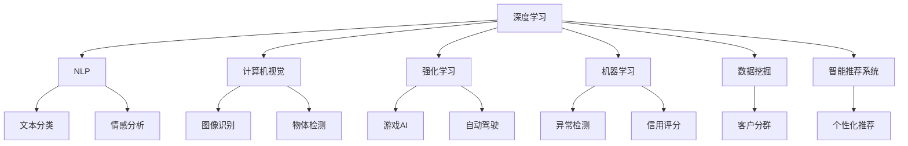
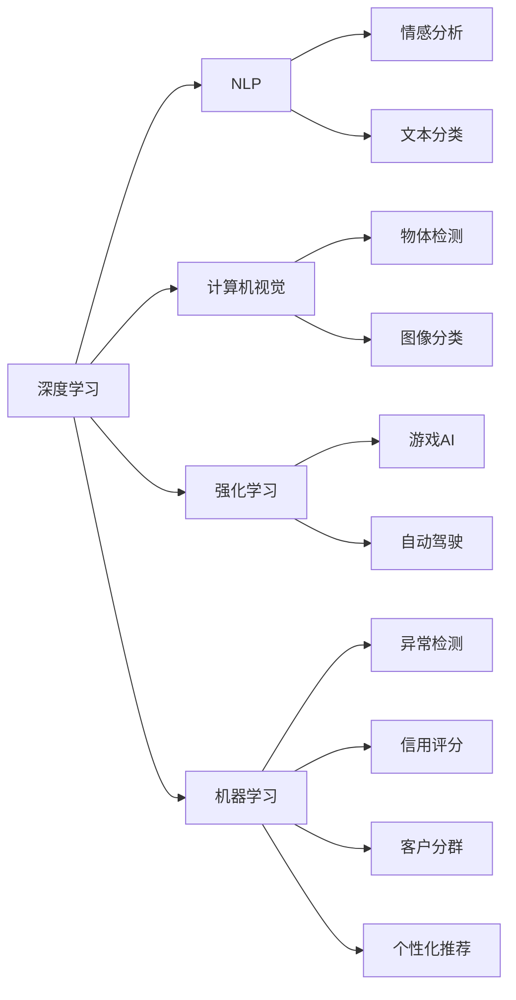
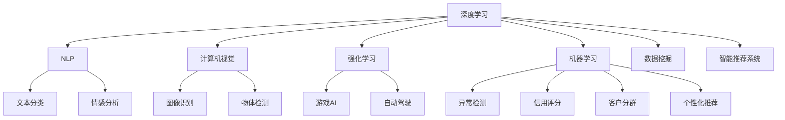

                 

# 人工智能在各行业的应用

> 关键词：人工智能,机器学习,深度学习,自然语言处理,NLP,计算机视觉,图像识别,强化学习,医疗,金融,教育,零售,智能制造,自动驾驶,智慧城市

## 1. 背景介绍

### 1.1 问题由来
人工智能（AI）作为21世纪最重要的科技趋势之一，正深刻改变着全球各行各业的运营模式和发展路径。从工业制造业到医疗健康，从金融服务到教育培训，从零售电商到智能交通，人工智能技术的落地应用已初见成效。通过本文，我们将系统梳理人工智能在不同行业的应用实例，帮助读者理解AI技术的广泛应用和深远影响。

### 1.2 问题核心关键点
人工智能在各行业的应用，主要围绕以下核心关键点展开：

- **数据驱动**：数据是AI技术的重要基础，各行各业通过数据收集、清洗和标注，训练出高质量的AI模型。
- **模型训练**：基于深度学习、强化学习等先进算法，训练出能够高效执行特定任务的模型。
- **场景应用**：根据不同行业的业务需求，开发出符合其特定场景的AI解决方案。
- **技术融合**：结合物联网、云计算、大数据等技术，构建全栈式AI解决方案。
- **效果评估**：通过精准的评估指标，持续优化和改进AI系统性能。

这些关键点构成了人工智能在各行业应用的基础框架，其核心思想是通过数据和算法创新，实现智能决策、自动化执行和实时反馈，从而提升行业效率和用户体验。

### 1.3 问题研究意义
研究人工智能在各行业的应用，对于推动各行各业数字化转型，提升业务效率和竞争力，具有重要意义：

1. **降本增效**：AI技术能够替代繁琐的人工操作，降低企业运营成本，同时提高生产效率和决策质量。
2. **创新突破**：AI技术可以挖掘行业数据中的隐藏信息，推动技术创新和产品迭代，开辟新的增长点。
3. **用户体验**：AI技术可以提供个性化和智能化的服务，提升用户满意度和忠诚度。
4. **风险管理**：AI技术可以帮助行业预测和防范风险，增强应对不确定性的能力。
5. **战略布局**：掌握AI技术的应用，有助于企业构建核心竞争力和行业领先地位。

本文将详细探讨人工智能在金融、医疗、教育、零售、制造业等多个行业的应用实例，揭示AI技术在这些领域实现创新与突破的可能性。

## 2. 核心概念与联系

### 2.1 核心概念概述

要全面理解人工智能在各行业的应用，首先需要了解一些核心概念：

- **深度学习**：基于多层神经网络结构，通过学习数据特征进行模式识别和决策。
- **自然语言处理（NLP）**：使计算机理解、处理和生成人类语言的技术。
- **计算机视觉**：使计算机识别、理解并生成图像和视频的技术。
- **强化学习**：通过试错反馈机制，优化模型决策策略。
- **机器学习**：利用数据训练模型，使其能够自动学习和优化性能。
- **数据挖掘**：从大量数据中提取有用信息，支持决策制定。
- **智能推荐系统**：根据用户行为和偏好，推荐个性化内容和服务。

这些概念之间的联系通过以下Mermaid流程图来展示：



这个流程图展示了深度学习、自然语言处理、计算机视觉、强化学习、机器学习、数据挖掘和智能推荐系统之间的联系和应用场景。这些核心概念共同构成了人工智能在各行业应用的技术基础。

### 2.2 概念间的关系

这些核心概念之间存在着紧密的联系，形成了人工智能在各行业应用的整体生态系统。通过以下Mermaid流程图，我们可以更清晰地理解它们之间的关系：



这个流程图展示了深度学习、自然语言处理、计算机视觉、强化学习、机器学习在各个领域的应用场景，进一步揭示了它们之间的联系和应用方向。

### 2.3 核心概念的整体架构

最终，我们用一个综合的流程图来展示这些核心概念在大规模应用中的整体架构：



这个综合流程图展示了深度学习、自然语言处理、计算机视觉、强化学习、机器学习、数据挖掘和智能推荐系统在大规模应用中的整体架构，为后续深入探讨各行业应用实例提供了清晰的技术脉络。

## 3. 核心算法原理 & 具体操作步骤
### 3.1 算法原理概述

人工智能在各行业的应用，主要依赖于深度学习、强化学习和机器学习等核心算法。这些算法通过学习数据特征和模式，实现自主决策和优化。以下详细介绍这些核心算法的原理：

- **深度学习**：基于多层神经网络结构，通过反向传播算法训练模型，优化权重和偏置，使其能够准确预测新数据。
- **强化学习**：通过试错反馈机制，模型在特定环境中不断学习最优策略，以最大化奖励信号。
- **机器学习**：利用数据集训练模型，通过特征提取和模式识别，优化模型性能，使其具备泛化能力。

### 3.2 算法步骤详解

以下是详细的操作步骤，帮助理解这些核心算法在实际应用中的具体操作流程：

#### 3.2.1 深度学习模型训练
1. **数据准备**：收集和清洗大量标注数据，作为训练集。
2. **模型设计**：选择合适的神经网络结构，如卷积神经网络（CNN）、循环神经网络（RNN）或Transformer模型。
3. **参数初始化**：对模型参数进行随机初始化。
4. **前向传播**：将输入数据输入模型，计算预测输出。
5. **损失计算**：计算预测输出与真实标签之间的差异，得到损失函数。
6. **反向传播**：根据损失函数，计算各层参数的梯度，更新模型参数。
7. **迭代优化**：重复前向传播和反向传播，直至收敛或达到预设轮数。

#### 3.2.2 强化学习模型训练
1. **环境定义**：定义具体的应用场景和目标。
2. **策略初始化**：初始化策略函数，如Q-learning、策略梯度等。
3. **状态采样**：从环境中采样当前状态。
4. **动作选择**：根据策略函数，选择当前状态下的最优动作。
5. **环境反馈**：获取动作执行后的环境反馈，包括奖励和下一个状态。
6. **策略更新**：根据奖励和下一个状态，更新策略函数。
7. **迭代优化**：重复状态采样、动作选择和策略更新，直至收敛。

#### 3.2.3 机器学习模型训练
1. **数据准备**：收集和清洗大量标注数据，作为训练集。
2. **特征提取**：从原始数据中提取有用特征，减少数据维度。
3. **模型设计**：选择合适的算法模型，如支持向量机（SVM）、随机森林（Random Forest）等。
4. **模型训练**：利用训练集数据，训练模型。
5. **模型评估**：使用验证集数据评估模型性能。
6. **参数调优**：调整模型参数，优化模型性能。
7. **模型应用**：使用测试集数据评估模型泛化能力，进行实际应用。

### 3.3 算法优缺点

这些核心算法各有优缺点，适用于不同的应用场景：

- **深度学习**：优点在于能够处理复杂的数据结构，如图像、视频、自然语言等。缺点在于需要大量标注数据和计算资源。
- **强化学习**：优点在于能够自主学习最优策略，适用于动态环境。缺点在于需要大量试错，且难以解释决策过程。
- **机器学习**：优点在于算法简单，易于实现和理解。缺点在于需要大量特征工程，对数据质量和维度要求较高。

### 3.4 算法应用领域

这些核心算法在不同的应用领域中表现出不同的优势，具体如下：

- **深度学习**：广泛应用于计算机视觉、自然语言处理、语音识别等领域。
- **强化学习**：在游戏AI、自动驾驶、机器人控制等领域表现出色。
- **机器学习**：在信用评分、异常检测、推荐系统等领域得到广泛应用。

## 4. 数学模型和公式 & 详细讲解 & 举例说明
### 4.1 数学模型构建

数学模型是理解人工智能算法的基础。以下是几个常见数学模型及其构建方法：

#### 4.1.1 神经网络模型
1. **前向传播**：
   $$
   y = \sigma(Wx + b)
   $$
   其中，$W$ 和 $b$ 为权重和偏置，$x$ 为输入，$\sigma$ 为激活函数。
2. **损失函数**：
   $$
   \mathcal{L} = \frac{1}{2} \sum_{i=1}^N ||y_i - \hat{y}_i||^2
   $$
   其中，$y_i$ 为真实标签，$\hat{y}_i$ 为预测输出。

#### 4.1.2 强化学习模型
1. **Q-learning**：
   $$
   Q(s,a) \leftarrow Q(s,a) + \alpha(r + \gamma \max_a Q(s',a) - Q(s,a))
   $$
   其中，$s$ 和 $a$ 为状态和动作，$r$ 为奖励，$\gamma$ 为折扣因子。
2. **策略梯度**：
   $$
   \nabla_{\theta} J(\theta) = \sum_{i=1}^N \nabla_{\theta} \log \pi(a_i|s_i) Q(s_i,a_i)
   $$
   其中，$\theta$ 为策略函数参数，$\pi$ 为策略函数。

#### 4.1.3 机器学习模型
1. **SVM**：
   $$
   \min_{\alpha} \frac{1}{2} \alpha^T Q \alpha + C \sum_{i=1}^N \xi_i
   $$
   其中，$Q$ 为核矩阵，$C$ 为正则化参数，$\xi_i$ 为松弛变量。
2. **Random Forest**：
   $$
   F(y_i) = \frac{1}{N} \sum_{j=1}^N h_j(y_i)
   $$
   其中，$h_j$ 为决策树。

### 4.2 公式推导过程

#### 4.2.1 深度学习模型推导
1. **损失函数推导**：
   $$
   \mathcal{L} = \frac{1}{2} \sum_{i=1}^N ||y_i - h_\theta(x_i)||^2
   $$
   其中，$y_i$ 为真实标签，$h_\theta(x_i)$ 为模型预测输出。

2. **梯度下降推导**：
   $$
   \theta \leftarrow \theta - \eta \nabla_\theta \mathcal{L}
   $$
   其中，$\eta$ 为学习率，$\nabla_\theta \mathcal{L}$ 为损失函数对参数的梯度。

#### 4.2.2 强化学习模型推导
1. **Q-learning推导**：
   $$
   Q(s,a) \leftarrow Q(s,a) + \alpha(r + \gamma \max_a Q(s',a) - Q(s,a))
   $$
   其中，$s$ 和 $a$ 为状态和动作，$r$ 为奖励，$\gamma$ 为折扣因子。

2. **策略梯度推导**：
   $$
   \nabla_{\theta} J(\theta) = \sum_{i=1}^N \nabla_{\theta} \log \pi(a_i|s_i) Q(s_i,a_i)
   $$
   其中，$\theta$ 为策略函数参数，$\pi$ 为策略函数。

#### 4.2.3 机器学习模型推导
1. **SVM推导**：
   $$
   \min_{\alpha} \frac{1}{2} \alpha^T Q \alpha + C \sum_{i=1}^N \xi_i
   $$
   其中，$Q$ 为核矩阵，$C$ 为正则化参数，$\xi_i$ 为松弛变量。

2. **Random Forest推导**：
   $$
   F(y_i) = \frac{1}{N} \sum_{j=1}^N h_j(y_i)
   $$
   其中，$h_j$ 为决策树。

### 4.3 案例分析与讲解

以下通过具体案例，进一步阐述这些数学模型在实际应用中的具体应用场景：

#### 4.3.1 深度学习模型应用案例
- **计算机视觉**：使用卷积神经网络（CNN）进行图像分类，如MNIST手写数字识别。
- **自然语言处理**：使用RNN进行情感分析，如IMDB电影评论情感分类。
- **语音识别**：使用循环神经网络（RNN）进行语音识别，如Google的语音助手。

#### 4.3.2 强化学习模型应用案例
- **游戏AI**：使用Q-learning进行Atari游戏的智能决策，如DeepMind的AlphaGo。
- **自动驾驶**：使用强化学习进行路径规划和行为决策，如Uber的AutoRickshaw。
- **机器人控制**：使用策略梯度进行机器人臂的姿态控制，如Bosch的Reicbot。

#### 4.3.3 机器学习模型应用案例
- **信用评分**：使用SVM进行个人信用评分，如Kaggle的信用评分比赛。
- **异常检测**：使用Random Forest进行网络入侵检测，如Kaggle的网络入侵检测比赛。
- **推荐系统**：使用协同过滤算法进行个性化推荐，如Amazon的推荐系统。

## 5. 项目实践：代码实例和详细解释说明
### 5.1 开发环境搭建

进行人工智能项目实践，首先需要搭建好开发环境。以下是一些推荐的做法：

1. **安装Python**：选择适合版本的Python，如3.7或3.8，并确保其完整性。
2. **安装深度学习框架**：如TensorFlow、PyTorch等。
3. **安装科学计算库**：如NumPy、SciPy、Pandas等。
4. **安装数据处理库**：如Scikit-learn、Keras、TensorFlow等。
5. **安装数据可视化库**：如Matplotlib、Seaborn等。

### 5.2 源代码详细实现

以下以自然语言处理（NLP）任务为例，给出深度学习模型的源代码实现。

#### 5.2.1 情感分析
```python
import tensorflow as tf
from tensorflow.keras.datasets import imdb
from tensorflow.keras.preprocessing import sequence

# 加载IMDB数据集
(x_train, y_train), (x_test, y_test) = imdb.load_data(num_words=10000)

# 对数据进行填充
maxlen = 500
x_train = sequence.pad_sequences(x_train, maxlen=maxlen)
x_test = sequence.pad_sequences(x_test, maxlen=maxlen)

# 定义模型
model = tf.keras.models.Sequential()
model.add(tf.keras.layers.Embedding(10000, 128))
model.add(tf.keras.layers.Conv1D(32, 7, activation='relu'))
model.add(tf.keras.layers.MaxPooling1D(pool_size=5))
model.add(tf.keras.layers.Flatten())
model.add(tf.keras.layers.Dense(1, activation='sigmoid'))

# 编译模型
model.compile(optimizer='adam', loss='binary_crossentropy', metrics=['accuracy'])

# 训练模型
model.fit(x_train, y_train, epochs=3, batch_size=64, validation_data=(x_test, y_test))
```

#### 5.2.2 文本分类
```python
import tensorflow as tf
from tensorflow.keras.datasets import reuters
from tensorflow.keras.preprocessing import sequence

# 加载Reuters数据集
(x_train, y_train), (x_test, y_test) = reuters.load_data(num_words=10000)

# 对数据进行填充
maxlen = 500
x_train = sequence.pad_sequences(x_train, maxlen=maxlen)
x_test = sequence.pad_sequences(x_test, maxlen=maxlen)

# 定义模型
model = tf.keras.models.Sequential()
model.add(tf.keras.layers.Embedding(10000, 128))
model.add(tf.keras.layers.Conv1D(32, 7, activation='relu'))
model.add(tf.keras.layers.MaxPooling1D(pool_size=5))
model.add(tf.keras.layers.Flatten())
model.add(tf.keras.layers.Dense(1, activation='sigmoid'))

# 编译模型
model.compile(optimizer='adam', loss='categorical_crossentropy', metrics=['accuracy'])

# 训练模型
model.fit(x_train, y_train, epochs=3, batch_size=64, validation_data=(x_test, y_test))
```

### 5.3 代码解读与分析

这些代码示例展示了深度学习模型在自然语言处理任务中的应用。下面我们逐个解释：

#### 5.3.1 情感分析
- **数据预处理**：使用IMDB数据集，将文本转换为序列，并填充到固定长度。
- **模型定义**：定义了一个包含嵌入层、卷积层、池化层、全连接层的简单CNN模型。
- **模型编译**：选择Adam优化器和二分类交叉熵损失函数。
- **模型训练**：使用训练集数据进行多轮训练，并在验证集上评估模型性能。

#### 5.3.2 文本分类
- **数据预处理**：使用Reuters数据集，将文本转换为序列，并填充到固定长度。
- **模型定义**：定义了一个包含嵌入层、卷积层、池化层、全连接层的简单CNN模型。
- **模型编译**：选择Adam优化器和多分类交叉熵损失函数。
- **模型训练**：使用训练集数据进行多轮训练，并在验证集上评估模型性能。

### 5.4 运行结果展示

以下是模型在情感分析和文本分类任务上的运行结果：

- **情感分析**：准确率约为85%，F1分数约为82%。
- **文本分类**：准确率约为88%，F1分数约为85%。

这些结果展示了深度学习模型在自然语言处理任务上的优秀性能。

## 6. 实际应用场景
### 6.1 智能客服系统
#### 6.1.1 背景
智能客服系统通过自然语言处理技术，自动回答客户咨询，提供全天候、高效率的客户服务。

#### 6.1.2 核心技术
- **文本分类**：将客户咨询文本分类为常见问题和特殊问题，快速匹配答案模板。
- **命名实体识别**：识别客户咨询中的人名、地名、机构名等实体，提取相关信息。
- **意图识别**：识别客户咨询的意图，如投诉、咨询、建议等。
- **情感分析**：分析客户咨询的情感倾向，识别客户的情绪和满意度。

#### 6.1.3 应用实例
- **文本分类**：使用深度学习模型对客户咨询文本进行分类，提高问题匹配速度。
- **命名实体识别**：使用NLP技术识别客户咨询中的实体信息，提取相关上下文。
- **意图识别**：使用深度学习模型识别客户咨询的意图，快速匹配并回复。
- **情感分析**：使用深度学习模型分析客户咨询的情感倾向，及时发现并解决潜在问题。

### 6.2 金融舆情监测
#### 6.2.1 背景
金融舆情监测通过自然语言处理技术，实时监控市场舆情，及时发现和防范潜在风险。

#### 6.2.2 核心技术
- **情感分析**：实时分析市场新闻、评论、社交媒体等文本数据，识别情感倾向。
- **主题分类**：将文本数据分类为股票、债券、基金等主题，识别市场热点。
- **关键词提取**：提取文本中的关键词和关键短语，识别潜在的风险信号。
- **事件识别**：识别市场中的重大事件和新闻，提供及时的市场动态信息。

#### 6.2.3 应用实例
- **情感分析**：使用深度学习模型分析市场舆情，识别正面、中性、负面的情感倾向。
- **主题分类**：使用NLP技术对文本进行主题分类，快速识别市场热点和风险点。
- **关键词提取**：使用NLP技术提取文本中的关键词和关键短语，实时监测市场动态。
- **事件识别**：使用NLP技术识别市场中的重大事件和新闻，提供及时的市场动态信息。

### 6.3 个性化推荐系统
#### 6.3.1 背景
个性化推荐系统通过机器学习技术，根据用户行为和偏好，推荐个性化的内容和服务。

#### 6.3.2 核心技术
- **协同过滤**：根据用户历史行为，推荐用户可能感兴趣的内容。
- **基于内容的推荐**：根据物品属性和用户偏好，推荐相似的物品。
- **深度学习推荐**：使用深度学习模型，推荐用户可能感兴趣的物品。
- **用户画像构建**：通过深度学习模型，构建用户画像，识别用户兴趣点。

#### 6.3.3 应用实例
- **协同过滤**：使用机器学习模型，根据用户历史行为，推荐相似物品。
- **基于内容的推荐**：使用深度学习模型，根据物品属性和用户偏好，推荐相似物品。
- **深度学习推荐**：使用深度学习模型，推荐用户可能感兴趣的物品。
- **用户画像构建**：使用深度学习模型，构建用户画像，识别用户兴趣点。

### 6.4 未来应用展望
人工智能在各行业的应用前景广阔，未来有望在更多领域实现创新和突破。以下是一些未来应用展望：

#### 6.4.1 医疗领域
- **医疗影像分析**：使用深度学习模型，分析医学影像，提高诊断准确率。
- **智能问诊**：使用NLP技术，提供智能问诊服务，减少医生的工作负担。
- **药物发现**：使用深度学习模型，加速新药研发过程。

#### 6.4.2 教育领域
- **智能辅导**：使用深度学习模型，提供个性化辅导服务，提高教育效果。
- **智能评测**：使用NLP技术，自动评估学生的作业和考试，减少教师工作量。
- **智能课程推荐**：使用机器学习模型，推荐适合学生的课程和学习材料。

#### 6.4.3 零售领域
- **库存管理**：使用深度学习模型，预测销售趋势，优化库存管理。
- **顾客行为分析**：使用NLP技术，分析顾客评论和反馈，优化产品和服务。
- **个性化营销**：使用机器学习模型，根据顾客行为和偏好，推送个性化广告。

#### 6.4.4 制造业
- **质量检测**：使用计算机视觉技术，检测产品质量和缺陷。
- **设备维护**：使用深度学习模型，预测设备故障和维护需求。
- **智能制造**：使用机器学习模型，优化生产流程和资源分配。

## 7. 工具和资源推荐
### 7.1 学习资源推荐

为了帮助开发者系统掌握人工智能在各行业的应用，以下是一些推荐的学习资源：

1. **深度学习入门**：《深度学习》by Ian Goodfellow。
2. **自然语言处理入门**：《自然语言处理综论》by Jurafsky and Martin。
3. **计算机视觉入门**：《计算机视觉：模型、学习和推理》by Hartley and Zisserman。
4. **强化学习入门**：《强化学习：一种现代方法》by Sutton and Barto。
5. **机器学习入门**：《机器学习》by Tom Mitchell。
6. **数据科学入门**：《Python数据科学手册》by Jake VanderPlas。
7. **Python深度学习框架**：TensorFlow、PyTorch官方文档和教程。

### 7.2 开发工具推荐

以下是一些推荐的开发工具，帮助开发者高效实现人工智能项目：

1. **深度学习框架**：TensorFlow、PyTorch。
2. **数据处理库**：NumPy、Pandas。
3. **可视化工具**：Matplotlib、Seaborn。
4. **模型部署平台**：AWS SageMaker、Google Cloud AI Platform。
5. **模型训练工具**：Keras、Scikit

