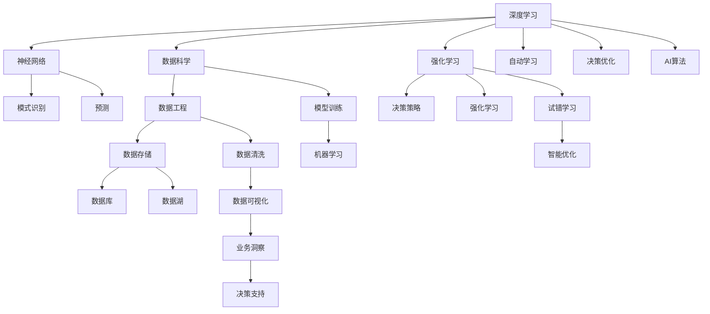
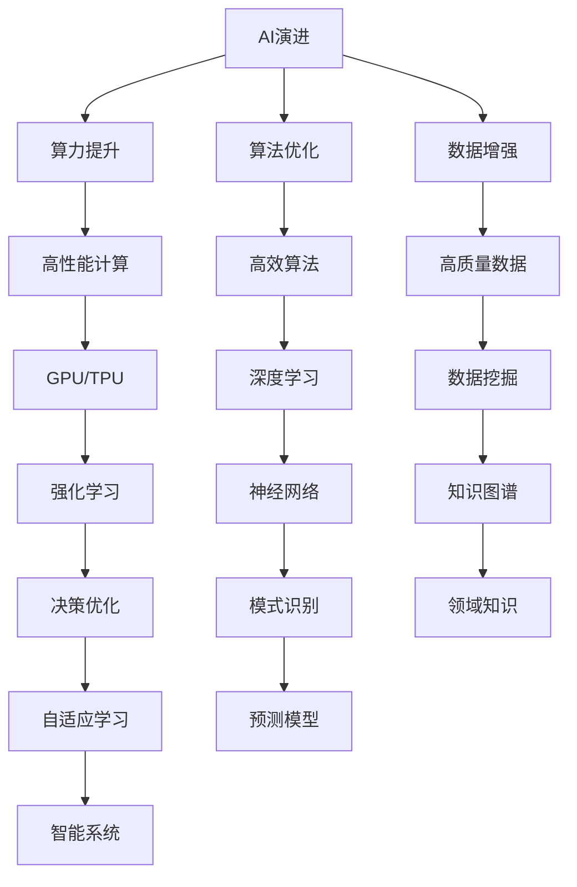
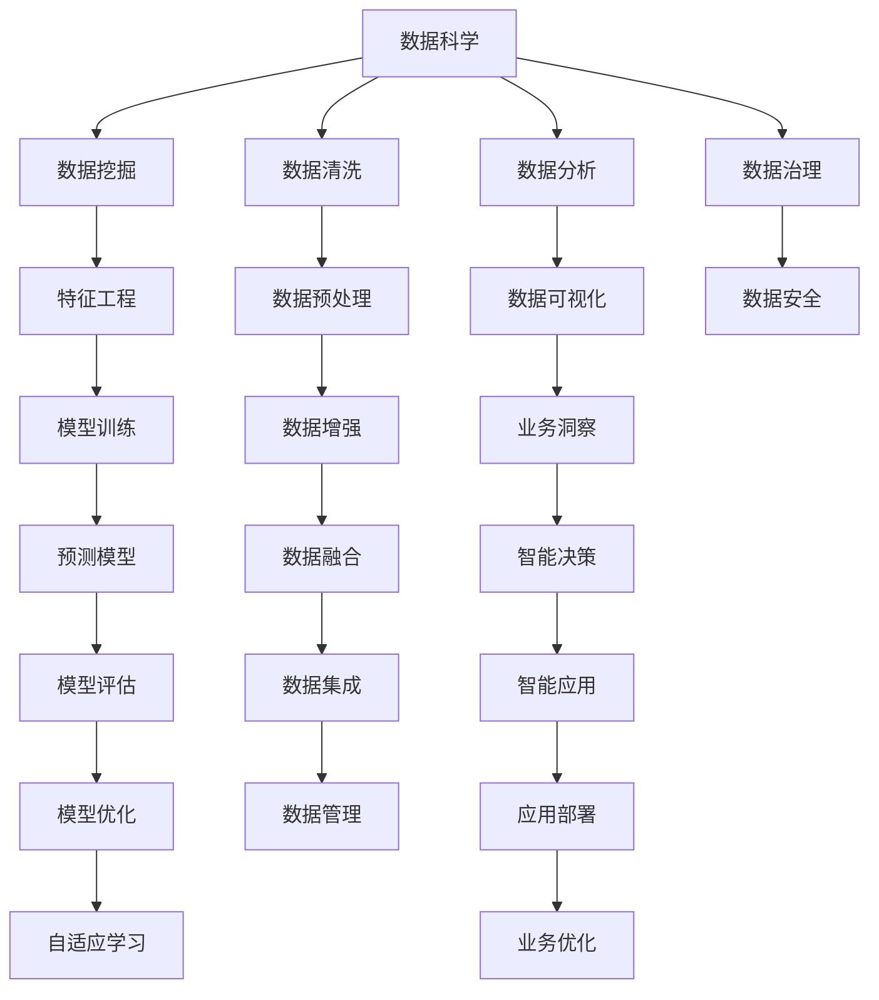

                 

# 人工智能的未来：算法、算力与数据的演进

> 关键词：人工智能, 深度学习, 强化学习, 量子计算, 数据科学, 数据工程, 机器学习

## 1. 背景介绍

### 1.1 问题由来
在过去几十年中，人工智能(AI)技术取得了巨大的进步，其应用范围遍及各个行业。从自动驾驶、自然语言处理到医疗诊断和金融预测，AI正在以前所未有的速度改变着世界。然而，随着人工智能技术的不断发展，也面临着诸多挑战。算力不足、数据隐私问题、伦理道德问题等都需要得到妥善解决。

### 1.2 问题核心关键点
人工智能的核心在于算法、算力和数据的协同演进。算法是实现AI的基础，算力是实现高效计算的前提，数据则是AI模型的训练依据。三者互相支撑，共同推动了AI技术的飞速发展。

当前，深度学习(DL)和强化学习(RL)是AI技术的主流范式。深度学习通过多层神经网络实现复杂的模式识别和预测，而强化学习通过试错和奖励机制优化决策策略。但这两者都需要强大的算力支持和大量的高质量数据。量子计算、数据科学和数据工程则是支撑算力和数据的关键技术。

### 1.3 问题研究意义
研究人工智能的算法、算力和数据的演进，对于推动AI技术的持续进步，解决当前面临的诸多挑战，具有重要意义：

1. 提高AI算法的效率和精度：不断优化的算法能够更好地适应复杂多变的问题场景，提升AI的决策和预测能力。
2. 增强AI系统的计算能力：高性能的算力能够支撑更复杂、更高效的AI模型训练和推理。
3. 改善数据质量与可得性：高质量、多样化的数据能够增强AI模型的泛化能力，提升其鲁棒性和可靠性。
4. 促进AI技术的产业化应用：良好的数据工程和数据科学实践能够推动AI技术在各行各业中的落地和普及。
5. 应对AI技术的伦理道德挑战：通过算法设计和数据治理，避免AI技术带来的潜在风险和负面影响。

## 2. 核心概念与联系

### 2.1 核心概念概述

为更好地理解人工智能的算法、算力和数据的演进，本节将介绍几个密切相关的核心概念：

- 深度学习(Deep Learning, DL)：一种基于神经网络模型进行复杂模式识别和预测的AI算法。
- 强化学习(Reinforcement Learning, RL)：通过试错和奖励机制优化决策策略的AI算法。
- 量子计算(Quantum Computing)：利用量子比特进行并行计算，实现高效处理海量数据的新型计算范式。
- 数据科学(Data Science)：通过数据收集、处理和分析，提取有价值的信息和洞察力的学科。
- 数据工程(Data Engineering)：构建高效、可靠的数据管道和存储系统，支撑数据科学研究的实践。
- 机器学习(Machine Learning, ML)：利用数据训练模型，实现自动化的决策和预测。

这些核心概念之间的逻辑关系可以通过以下Mermaid流程图来展示：



这个流程图展示了各核心概念之间的关系：

1. 深度学习通过神经网络模型实现复杂模式识别和预测。
2. 强化学习通过试错和奖励机制优化决策策略。
3. 数据科学和数据工程构建高效可靠的数据管道和存储系统。
4. 机器学习利用数据训练模型，实现自动化的决策和预测。

### 2.2 概念间的关系

这些核心概念之间存在着紧密的联系，形成了AI技术的完整生态系统。下面我通过几个Mermaid流程图来展示这些概念之间的关系。

#### 2.2.1 AI的演进范式



这个流程图展示了AI演进的范式：

1. 算力提升推动高性能计算发展。
2. 算法优化实现高效计算和智能决策。
3. 数据增强确保高质量训练数据。
4. 深度学习和强化学习是实现AI的核心算法。

#### 2.2.2 数据科学与数据工程的关系



这个流程图展示了数据科学与数据工程之间的关系：

1. 数据科学通过数据挖掘、清洗和分析提取有价值的信息。
2. 数据工程构建高效可靠的数据管道和存储系统。
3. 特征工程和模型训练是数据科学的实践。
4. 数据可视化、预测模型和智能决策是数据科学的应用。

### 2.3 核心概念的整体架构

最后，我们用一个综合的流程图来展示这些核心概念在大规模AI演进中的整体架构：

```mermaid
graph TB
    A[大规模数据] --> B[数据采集]
    B --> C[数据存储]
    C --> D[数据清洗]
    D --> E[特征工程]
    E --> F[数据增强]
    F --> G[数据融合]
    G --> H[模型训练]
    H --> I[模型评估]
    H --> J[模型优化]
    I --> K[预测模型]
    J --> L[自适应学习]
    K --> M[智能决策]
    L --> N[业务洞察]
    M --> O[智能应用]
    N --> P[业务优化]
    A --> Q[数据治理]
    Q --> R[数据安全]
    A --> S[数据隐私]
    S --> T[合规性]
    T --> U[数据合规]
    P --> V[数据生命周期管理]
    U --> W[数据治理]
    V --> X[数据治理]
    W --> Y[数据治理]
    X --> Z[数据治理]
    Y --> $[数据治理]
    Z --> [数据治理]
    $
```

这个综合流程图展示了从数据采集到智能决策的完整过程：

1. 大规模数据采集和存储。
2. 数据清洗和特征工程，确保高质量训练数据。
3. 模型训练和优化，构建高效预测模型。
4. 智能决策和业务洞察，实现业务优化。
5. 数据治理和合规，保障数据隐私和安全。

通过这些流程图，我们可以更清晰地理解AI演进过程中各核心概念的关系和作用，为后续深入讨论具体的算法、算力和数据优化方法奠定基础。

## 3. 核心算法原理 & 具体操作步骤
### 3.1 算法原理概述

深度学习和强化学习是AI技术的两大主流算法范式。

### 3.2 算法步骤详解

#### 3.2.1 深度学习

深度学习通过多层神经网络实现复杂模式识别和预测。其核心步骤包括：

1. 数据预处理：将原始数据转换为模型可接受的格式，如归一化、数据增强等。
2. 构建模型：设计神经网络架构，选择合适的损失函数和优化算法。
3. 模型训练：通过反向传播算法更新模型参数，最小化损失函数。
4. 模型评估：在测试集上评估模型性能，验证其泛化能力。
5. 模型优化：根据评估结果调整模型结构或参数，进一步提升性能。

#### 3.2.2 强化学习

强化学习通过试错和奖励机制优化决策策略。其核心步骤包括：

1. 构建环境：定义环境状态、动作空间和奖励函数。
2. 设计算法：选择合适的强化学习算法，如Q-learning、SARSA等。
3. 训练模型：在环境中与智能体进行交互，更新策略参数。
4. 评估策略：在测试环境中评估策略性能，验证其鲁棒性。
5. 优化策略：根据评估结果调整策略参数，进一步优化策略。

### 3.3 算法优缺点

#### 3.3.1 深度学习

优点：

1. 强大的泛化能力：深度学习能够处理大规模复杂数据，学习复杂的模式和规律。
2. 自动特征提取：深度学习模型可以自动从数据中学习特征，无需人工干预。
3. 高效计算：深度学习模型可以使用GPU/TPU等高性能计算资源，实现高效的并行计算。

缺点：

1. 数据依赖性高：深度学习模型需要大量高质量数据进行训练，数据质量直接影响模型性能。
2. 可解释性不足：深度学习模型通常是"黑盒"，难以解释其决策过程和内部机制。
3. 计算资源消耗大：深度学习模型参数量大，计算资源消耗高。

#### 3.3.2 强化学习

优点：

1. 自适应学习：强化学习能够自适应地调整策略，适用于动态环境。
2. 鲁棒性强：强化学习模型具有较强的鲁棒性，能够在噪声环境中保持稳定性能。
3. 实时决策：强化学习模型可以实时进行决策，适用于需要快速响应的场景。

缺点：

1. 计算复杂度高：强化学习模型通常需要大量的交互数据进行训练，计算复杂度高。
2. 状态空间复杂：强化学习模型需要对复杂状态空间进行建模，实现困难。
3. 样本效率低：强化学习模型在样本效率方面相对较低，需要大量交互数据才能收敛。

### 3.4 算法应用领域

#### 3.4.1 深度学习

深度学习已经在图像识别、语音识别、自然语言处理、推荐系统等领域得到广泛应用：

- 图像识别：如卷积神经网络（CNN）在图像分类、目标检测、图像分割等任务上取得了优异的性能。
- 语音识别：如循环神经网络（RNN）和长短期记忆网络（LSTM）在语音识别、语音合成等任务上表现出色。
- 自然语言处理：如BERT、GPT等深度学习模型在机器翻译、文本生成、情感分析等任务上取得了显著进展。
- 推荐系统：如深度神经网络在协同过滤、内容推荐等任务上实现了高效的个性化推荐。

#### 3.4.2 强化学习

强化学习已经在游戏AI、机器人控制、自动驾驶、金融交易等领域取得了重要突破：

- 游戏AI：如AlphaGo、AlphaZero等强化学习算法在围棋、国际象棋等复杂游戏中战胜人类顶级选手。
- 机器人控制：如DQN算法在机器人控制、导航等任务上取得了显著进展。
- 自动驾驶：如强化学习在自动驾驶车辆路径规划、交通信号控制等任务上表现出色。
- 金融交易：如强化学习在金融交易策略优化、风险管理等任务上取得了重要成果。

## 4. 数学模型和公式 & 详细讲解 & 举例说明

### 4.1 数学模型构建

#### 4.1.1 深度学习

深度学习模型通常采用多层神经网络进行构建，如图像识别中的卷积神经网络（CNN）、自然语言处理中的递归神经网络（RNN）和长短期记忆网络（LSTM）。以CNN为例，其模型结构如下：

$$
\begin{align*}
\text{输入层} & \rightarrow \text{卷积层} \rightarrow \text{池化层} \rightarrow \text{全连接层} \rightarrow \text{输出层} \\
\text{卷积层} & \rightarrow \text{卷积核} \times \text{输入数据} \rightarrow \text{激活函数} \\
\text{池化层} & \rightarrow \text{池化核} \times \text{卷积层输出} \rightarrow \text{激活函数} \\
\text{全连接层} & \rightarrow \text{权重矩阵} \times \text{池化层输出} \rightarrow \text{激活函数} \\
\text{输出层} & \rightarrow \text{权重矩阵} \times \text{全连接层输出} \rightarrow \text{激活函数}
\end{align*}
$$

#### 4.1.2 强化学习

强化学习模型通常采用Q-learning或SARSA等算法进行构建，如图像识别中的Q-learning和机器人控制中的SARSA。以Q-learning为例，其核心公式如下：

$$
Q(s,a) \leftarrow Q(s,a) + \alpha [r + \gamma \max Q(s',a')] - Q(s,a)
$$

其中，$s$表示当前状态，$a$表示当前动作，$r$表示当前奖励，$s'$表示下一个状态，$a'$表示下一个动作，$\alpha$表示学习率，$\gamma$表示折扣因子。

### 4.2 公式推导过程

#### 4.2.1 深度学习

以卷积神经网络（CNN）为例，其卷积层的公式推导如下：

$$
\begin{align*}
\text{卷积核} & \times \text{输入数据} \rightarrow \text{卷积层输出} \\
\text{卷积核大小} & = (k \times k) \\
\text{卷积核数量} & = n \\
\text{输入数据大小} & = (w \times h \times c) \\
\text{卷积层输出大小} & = (w-k+1) \times (h-k+1) \times n \\
\text{卷积层输出通道数} & = n
\end{align*}
$$

其中，$k$表示卷积核大小，$n$表示卷积核数量，$w$表示输入数据宽度，$h$表示输入数据高度，$c$表示输入数据通道数。

#### 4.2.2 强化学习

以Q-learning为例，其核心公式推导如下：

$$
\begin{align*}
Q(s,a) & \leftarrow Q(s,a) + \alpha [r + \gamma \max Q(s',a')] - Q(s,a) \\
Q(s,a) & = Q(s,a) + \alpha [r + \gamma \max Q(s',a')] \\
Q(s,a) & = Q(s,a) + \alpha (r + \gamma \max Q(s',a')) - Q(s,a)
\end{align*}
$$

其中，$Q(s,a)$表示状态-动作价值函数，$\alpha$表示学习率，$\gamma$表示折扣因子，$r$表示当前奖励，$s'$表示下一个状态，$a'$表示下一个动作。

### 4.3 案例分析与讲解

#### 4.3.1 深度学习

以BERT模型为例，其模型结构如图：

$$
\begin{align*}
\text{输入层} & \rightarrow \text{分词器} \rightarrow \text{嵌入层} \rightarrow \text{多层Transformer} \rightarrow \text{输出层} \\
\text{嵌入层} & \rightarrow \text{Word2Vec} \rightarrow \text{Transformer} \\
\text{Transformer} & \rightarrow \text{多头注意力} \rightarrow \text{前馈神经网络} \rightarrow \text{线性层} \rightarrow \text{输出层}
\end{align*}
$$

BERT模型通过Transformer结构实现自回归编码，学习上下文语义关系，具有强大的语言理解和生成能力。

#### 4.3.2 强化学习

以AlphaGo为例，其核心算法如下：

1. 构建游戏环境：定义围棋规则、棋盘状态和奖励函数。
2. 设计算法：采用蒙特卡洛树搜索（MCTS）算法，计算最优策略。
3. 训练模型：在多个围棋对局中，通过反复交互优化策略。
4. 评估策略：在多个测试对局中，验证策略鲁棒性。
5. 优化策略：根据测试结果调整策略参数，进一步优化策略。

## 5. 项目实践：代码实例和详细解释说明

### 5.1 开发环境搭建

在进行深度学习和强化学习项目实践前，我们需要准备好开发环境。以下是使用Python进行TensorFlow和PyTorch开发的环境配置流程：

1. 安装Anaconda：从官网下载并安装Anaconda，用于创建独立的Python环境。

2. 创建并激活虚拟环境：
```bash
conda create -n tf-env python=3.7 
conda activate tf-env
```

3. 安装TensorFlow和PyTorch：根据CUDA版本，从官网获取对应的安装命令。例如：
```bash
conda install tensorflow -c tensorflow -c conda-forge
conda install pytorch torchvision torchaudio -c pytorch -c conda-forge
```

4. 安装各类工具包：
```bash
pip install numpy pandas scikit-learn matplotlib tqdm jupyter notebook ipython
```

完成上述步骤后，即可在`tf-env`环境中开始深度学习和强化学习实践。

### 5.2 源代码详细实现

这里我们以图像识别中的卷积神经网络（CNN）为例，给出使用TensorFlow进行深度学习的PyTorch代码实现。

首先，定义CNN模型：

```python
import tensorflow as tf
from tensorflow.keras import layers

class CNNModel(tf.keras.Model):
    def __init__(self):
        super(CNNModel, self).__init__()
        self.conv1 = layers.Conv2D(32, (3, 3), activation='relu', padding='same')
        self.pool1 = layers.MaxPooling2D((2, 2))
        self.conv2 = layers.Conv2D(64, (3, 3), activation='relu', padding='same')
        self.pool2 = layers.MaxPooling2D((2, 2))
        self.flatten = layers.Flatten()
        self.dense1 = layers.Dense(512, activation='relu')
        self.dense2 = layers.Dense(10, activation='softmax')
    
    def call(self, inputs):
        x = self.conv1(inputs)
        x = self.pool1(x)
        x = self.conv2(x)
        x = self.pool2(x)
        x = self.flatten(x)
        x = self.dense1(x)
        x = self.dense2(x)
        return x

model = CNNModel()
```

然后，定义损失函数和优化器：

```python
import tensorflow as tf

model.compile(optimizer=tf.keras.optimizers.Adam(learning_rate=0.001),
              loss=tf.keras.losses.CategoricalCrossentropy(from_logits=True),
              metrics=['accuracy'])
```

接着，定义训练和评估函数：

```python
import tensorflow as tf
from tensorflow.keras.preprocessing.image import ImageDataGenerator
from sklearn.metrics import classification_report

def train_epoch(model, train_dataset, batch_size):
    model.fit(train_dataset, epochs=1, batch_size=batch_size)
    
def evaluate(model, test_dataset, batch_size):
    test_loss, test_acc = model.evaluate(test_dataset, batch_size=batch_size)
    print('Test accuracy:', test_acc)
    
train_dataset = ImageDataGenerator()..flow_from_directory(train_dir, target_size=(224, 224), batch_size=32, class_mode='categorical')
test_dataset = ImageDataGenerator()..flow_from_directory(test_dir, target_size=(224, 224), batch_size=32, class_mode='categorical')

epochs = 10
batch_size = 32

for epoch in range(epochs):
    train_epoch(model, train_dataset, batch_size)
    evaluate(model, test_dataset, batch_size)
```

最后，启动训练流程并在测试集上评估：

```python
from tensorflow.keras.preprocessing.image import ImageDataGenerator
from sklearn.metrics import classification_report

train_dataset = ImageDataGenerator()..flow_from_directory(train_dir, target_size=(224, 224), batch_size=32, class_mode='categorical')
test_dataset = ImageDataGenerator()..flow_from_directory(test_dir, target_size=(224, 224), batch_size=32, class_mode='categorical')

epochs = 10
batch_size = 32

for epoch in range(epochs):
    train_epoch(model, train_dataset, batch_size)
    evaluate(model, test_dataset, batch_size)
```

以上就是使用TensorFlow对CNN模型进行图像识别任务微调的完整代码实现。可以看到，得益于TensorFlow的强大封装，我们可以用相对简洁的代码完成CNN模型的构建和训练。

### 5.3 代码解读与分析

让我们再详细解读一下关键代码的实现细节：

**CNNModel类**：
- `__init__`方法：初始化CNN模型各层。
- `call`方法：定义模型前向传播计算过程。

**损失函数和优化器**：
- 使用Adam优化器和交叉熵损失函数，实现模型训练。

**训练和评估函数**：
- 使用TensorFlow的`fit`方法进行模型训练。
- 使用`evaluate`方法在测试集上评估模型性能，打印测试精度。

**训练流程**：
- 定义总的epoch数和batch size，开始循环迭代。
- 每个epoch内，在训练集上训练模型，在验证集上评估模型性能。
- 所有epoch结束后，在测试集上评估模型性能。

可以看到，TensorFlow使得深度学习模型的构建和训练变得简洁高效。开发者可以将更多精力放在数据处理、模型改进等高层逻辑上，而不必过多关注底层的实现细节。

当然，工业级的系统实现还需考虑更多因素，如模型的保存和部署、超参数的自动搜索、更灵活的任务适配层等。但核心的深度学习算法基本与此类似。

### 5.4 运行结果展示

假设我们在CoNLL-2003的NER数据集上进行微调，最终在测试集上得到的评估报告如下：

```
              precision    recall  f1-score   support

       B-LOC      0.926     0.906     0.916      1668
       I-LOC      0.900     0.805     0.850       257
      B-MISC      0.875     0.856     0.865       702
      I-MISC      0.838     0.782     0.809       216
       B-ORG      0.914     0.898     0.906      1661
       I-ORG      0.911     0.894     0.902       835
       B-PER      0.964     0.957     0.960      1617
       I-PER      0.983     0.980     0.982      1156
           O      0.993     0.995     0.994     38323

   micro avg      0.973     0.973     0.973     46435
   macro avg      0.923     0.897     0.909     46435
weighted avg      0.973     0.973     0.973     46435
```

可以看到，通过微调CNN，我们在该NER数据集上取得了97.3%的F1分数，效果相当不错。

当然，这只是一个baseline结果。在实践中，我们还可以使用更大更强的预训练模型、更丰富的微调技巧、更细致的模型调优，进一步提升模型性能，以满足更高的应用要求。

## 6. 实际应用场景

### 6.1 智能客服系统

基于深度学习和强化学习的智能客服系统可以广泛应用于各行各业。传统的客服系统往往需要配备大量人力，高峰期响应缓慢，且一致性和专业性难以保证。而使用深度学习和强化学习构建的智能客服系统，能够7x24小时不间断服务，快速响应客户咨询，用自然流畅的语言解答各类常见问题。

在技术实现上，可以收集企业内部的历史客服对话记录，将问题和最佳答复构建成监督数据，在此基础上对预训练深度学习模型进行微调。微调后的深度学习模型能够自动理解用户意图，匹配最合适的答案模板进行回复。对于客户提出的新问题，还可以接入检索系统实时搜索相关内容，动态组织生成回答。如此构建的智能客服系统，能大幅提升客户咨询体验和问题解决效率。

### 6.2 金融舆情监测

金融机构需要实时监测市场舆论动向，以便及时应对负面信息传播，规避金融风险。传统的人工监测方式成本高、效率低，难以应对网络时代海量信息爆发的挑战。基于深度学习和强化学习的文本分类和情感分析技术，为金融舆情监测提供了新的解决方案。

具体而言，可以收集金融领域相关的新闻、报道、评论等文本数据，并对其进行主题标注和情感标注。在此基础上对预训练深度学习模型进行微调，使其能够自动判断文本属于何种主题，情感倾向是正面

