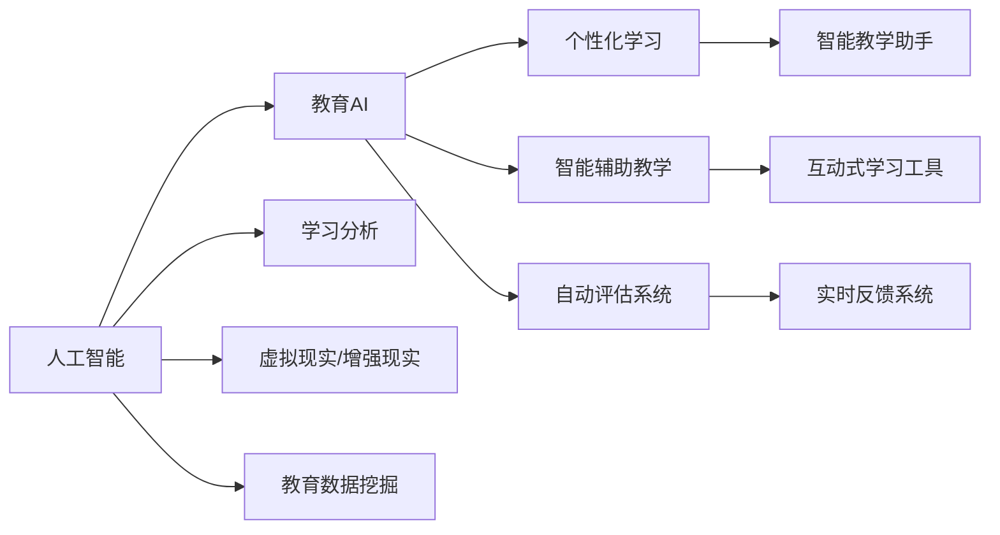
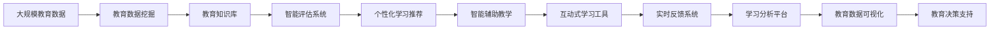

                 

# 人工智能：教育变革的催化剂

> 关键词：人工智能,教育,变革,催化

## 1. 背景介绍

### 1.1 问题由来
近年来，随着人工智能（AI）技术的迅猛发展，其在教育领域的应用日益广泛。从个性化学习路径的推荐，到智能辅助教学，再到自动评估系统，AI正逐渐成为教育改革的重要推动力。然而，尽管AI在教育领域展现出巨大的潜力，但这一变革仍面临诸多挑战，亟需进一步探索。本文将深入探讨AI如何成为教育变革的催化剂，并分析其在教育中的应用场景与未来发展方向。

### 1.2 问题核心关键点
本节将详细阐述AI在教育变革中的核心作用，主要包括：
- AI如何提供个性化学习方案，满足不同学生的需求。
- 智能辅助教学系统的应用，提升教学质量和效率。
- AI在自动评估系统中的应用，减轻教师负担。
- AI技术在教育管理中的潜力，优化资源配置。

### 1.3 问题研究意义
AI在教育领域的引入，有望大幅提升教育质量，推动教育公平，促进终身学习。然而，要实现这一愿景，需要深入理解AI技术，掌握其实现机制，并合理规划其应用策略。本文旨在为教育从业者提供系统的AI知识框架，帮助他们更好地理解和应用AI技术，促进教育变革。

## 2. 核心概念与联系

### 2.1 核心概念概述

为更好地理解AI在教育中的应用，本节将介绍几个关键概念：

- 人工智能(AI)：以机器学习和深度学习为核心的技术，能够模拟人类的智能行为。
- 教育AI：应用AI技术改进教育过程和学习效果，包括个性化学习、智能辅助教学、自动评估等。
- 学习分析(Learning Analytics)：通过数据分析识别学习者的行为模式，指导个性化学习路径的设计。
- 虚拟现实(VR)和增强现实(AR)：利用VR和AR技术，创建沉浸式学习环境，增强学习体验。
- 教育数据挖掘(Education Data Mining)：利用数据挖掘技术，提取有价值的教育数据，支持教育决策。

这些概念共同构成了AI在教育变革中的基础架构，明确了AI技术的应用方向。

### 2.2 概念间的关系

以下通过Mermaid流程图展示这些概念之间的关系：



这个流程图展示了AI技术在教育变革中的主要应用路径：

1. 人工智能(AI)是整个架构的基础。
2. 教育AI利用AI技术改进教育过程，具体包括个性化学习、智能辅助教学和自动评估系统。
3. 学习分析、虚拟现实/增强现实和教育数据挖掘为教育AI提供支持。
4. 个性化学习、智能辅助教学和自动评估系统进一步细分，具体应用包括智能教学助手、互动式学习工具和实时反馈系统等。

### 2.3 核心概念的整体架构

最后，我们用一个综合的流程图来展示这些核心概念在教育变革中的整体架构：



这个综合流程图展示了AI在教育变革中的完整应用架构：

1. 教育数据挖掘从大规模教育数据中提取有价值的信息，形成教育知识库。
2. 智能评估系统利用教育知识库进行评估，个性化学习推荐和智能辅助教学则基于评估结果进行优化。
3. 互动式学习工具和实时反馈系统进一步提升学习体验和效果。
4. 学习分析平台对学习数据进行深度分析，教育决策支持系统则将分析结果转化为教育决策。

这些概念和架构展示了AI技术在教育变革中如何逐步渗透，逐步提升教育质量。

## 3. 核心算法原理 & 具体操作步骤
### 3.1 算法原理概述

AI在教育中的核心算法包括机器学习、深度学习和自然语言处理（NLP）等，其基本原理是通过数据训练模型，使其具备一定的预测、推理和决策能力。在教育应用中，常用的算法包括：

- 监督学习：通过标注数据训练模型，使其能够预测学生的学习表现。
- 无监督学习：从未标注数据中提取模式，发现学习者的行为规律。
- 强化学习：通过模拟学习环境，训练模型与环境互动，提升学习效率。
- NLP：利用自然语言处理技术，实现对教育文本数据的高效处理和分析。

这些算法在大规模教育数据上经过训练，能够识别出学习者的行为模式和潜在需求，进而提供个性化的学习方案和智能辅助教学。

### 3.2 算法步骤详解

AI在教育中的操作步骤通常包括以下几个关键环节：

1. 数据准备：收集和清洗教育数据，包括学生的学习记录、评估结果、行为数据等。
2. 模型训练：选择合适的算法模型，利用标注数据或未标注数据进行训练。
3. 模型评估：在验证集上测试模型性能，调整超参数以优化模型效果。
4. 模型应用：将训练好的模型应用于教育场景，如个性化推荐、智能评估等。
5. 模型优化：根据实际应用反馈，持续优化模型，提升其性能和稳定性。

### 3.3 算法优缺点

AI在教育中的算法具有以下优点：
- 高效处理大量数据：AI算法能够快速处理大规模教育数据，挖掘学习者的行为模式和需求。
- 提供个性化学习方案：AI算法能够根据学生的学习数据，提供个性化的学习路径和资源。
- 自动化评估：AI算法能够自动进行评估，减轻教师的负担。

同时，这些算法也存在一些缺点：
- 依赖高质量数据：AI算法的性能高度依赖于数据的质量和数量，数据不充分时，模型效果可能不佳。
- 模型复杂度高：AI算法通常需要复杂的模型结构，对计算资源和存储要求较高。
- 解释性不足：AI算法的决策过程难以解释，缺乏透明度。

### 3.4 算法应用领域

AI在教育中的应用领域非常广泛，涵盖了以下几个方面：

1. 个性化学习：通过分析学生的学习数据，AI算法能够提供个性化的学习路径和资源，满足不同学习者的需求。
2. 智能辅助教学：AI算法能够提供智能辅助教学工具，如智能教学助手、互动式学习工具等，提升教学效果。
3. 自动评估：AI算法能够自动进行学习评估，如自动批改作业、考试评分等，减轻教师的负担。
4. 教育管理：AI算法能够优化教育资源配置，如学生入学推荐、课程安排等，提高教育管理效率。
5. 学习分析：AI算法能够分析学习者的行为数据，识别学习模式，提供学习建议。
6. 虚拟现实/增强现实：利用VR和AR技术，创建沉浸式学习环境，提升学习体验。

## 4. 数学模型和公式 & 详细讲解  
### 4.1 数学模型构建

本节将使用数学语言对AI在教育中的应用进行更加严格的刻画。

假设学生学习数据为 $D=\{x_i\}_{i=1}^N$，其中 $x_i$ 为学生的学习行为记录，如学习时间、考试成绩等。设学生评估数据为 $Y=\{y_i\}_{i=1}^N$，其中 $y_i$ 为学生的评估结果，如考试成绩、学习进度等。

定义学生评估函数 $f(x,y)$，目标是最小化预测误差 $e$：

$$
\min_{\theta} \frac{1}{N} \sum_{i=1}^N (f(x_i,y_i;\theta) - y_i)^2
$$

其中 $\theta$ 为模型参数，$f(x_i,y_i;\theta)$ 为学生评估函数。

### 4.2 公式推导过程

以监督学习算法为例，我们以线性回归模型为例进行推导：

假设学生评估函数为线性回归模型：

$$
f(x_i,y_i;\theta) = \theta_0 + \theta_1 x_i + \epsilon_i
$$

其中 $\theta_0$ 和 $\theta_1$ 为模型参数，$\epsilon_i$ 为误差项。

目标是最小化均方误差损失函数：

$$
\mathcal{L}(\theta) = \frac{1}{N} \sum_{i=1}^N (f(x_i,y_i;\theta) - y_i)^2
$$

利用梯度下降算法求导：

$$
\frac{\partial \mathcal{L}(\theta)}{\partial \theta} = \frac{2}{N} \sum_{i=1}^N (f(x_i,y_i;\theta) - y_i) \times x_i
$$

更新模型参数：

$$
\theta \leftarrow \theta - \eta \frac{\partial \mathcal{L}(\theta)}{\partial \theta}
$$

其中 $\eta$ 为学习率。

通过迭代更新模型参数，线性回归模型能够逐步拟合数据，预测学生评估结果。

### 4.3 案例分析与讲解

我们以智能辅助教学系统为例，展示AI在教育中的实际应用。

假设有一个智能教学系统，利用AI算法分析学生历史学习数据，预测学生未来学习表现。系统步骤如下：

1. 收集学生历史学习数据 $D$，包括学习时间、考试成绩等。
2. 定义学生评估函数 $f(x_i,y_i;\theta)$，如线性回归模型。
3. 利用监督学习算法训练模型参数 $\theta$，最小化预测误差 $e$。
4. 输入新的学习记录 $x$，通过模型预测学生评估结果 $y$。
5. 根据预测结果，智能教学系统调整教学策略，如推荐学习资源、调整教学内容等。

## 5. 项目实践：代码实例和详细解释说明
### 5.1 开发环境搭建

在进行教育AI项目实践前，我们需要准备好开发环境。以下是使用Python进行Keras和TensorFlow开发的环境配置流程：

1. 安装Anaconda：从官网下载并安装Anaconda，用于创建独立的Python环境。

2. 创建并激活虚拟环境：
```bash
conda create -n pytorch-env python=3.8 
conda activate pytorch-env
```

3. 安装Keras和TensorFlow：根据CUDA版本，从官网获取对应的安装命令。例如：
```bash
conda install keras tensorflow cudatoolkit=11.1 -c pytorch -c conda-forge
```

4. 安装各类工具包：
```bash
pip install numpy pandas scikit-learn matplotlib tqdm jupyter notebook ipython
```

完成上述步骤后，即可在`pytorch-env`环境中开始教育AI项目实践。

### 5.2 源代码详细实现

这里我们以一个简单的学习评估系统为例，展示如何利用AI进行教育数据分析和预测。

首先，定义学生数据处理函数：

```python
import pandas as pd

def read_student_data(file_path):
    data = pd.read_csv(file_path)
    data = data.dropna()
    return data
```

然后，定义模型训练函数：

```python
from tensorflow.keras.models import Sequential
from tensorflow.keras.layers import Dense
from tensorflow.keras.optimizers import Adam

def train_model(data, target):
    model = Sequential()
    model.add(Dense(64, input_dim=5, activation='relu'))
    model.add(Dense(1, activation='linear'))
    model.compile(loss='mse', optimizer=Adam(learning_rate=0.001))
    model.fit(data, target, epochs=100, batch_size=32, verbose=1)
    return model
```

接着，定义模型评估函数：

```python
from sklearn.metrics import mean_squared_error

def evaluate_model(model, data, target):
    y_pred = model.predict(data)
    mse = mean_squared_error(target, y_pred)
    rmse = np.sqrt(mse)
    return rmse
```

最后，启动训练流程并在测试集上评估：

```python
import numpy as np

# 读取学生数据
data = read_student_data('student_data.csv')

# 定义目标变量
target = data['exam_score']

# 定义特征变量
features = data.drop(['exam_score'], axis=1)

# 划分训练集和测试集
train_features = features.sample(frac=0.8, random_state=1)
test_features = features.drop(train_features.index)

# 训练模型
model = train_model(train_features, target)

# 在测试集上评估模型
rmse = evaluate_model(model, test_features, target)
print('RMSE:', rmse)
```

以上就是使用Keras和TensorFlow进行学习评估系统开发的完整代码实现。可以看到，利用Keras和TensorFlow，教育AI项目的开发变得简洁高效。

### 5.3 代码解读与分析

让我们再详细解读一下关键代码的实现细节：

**read_student_data函数**：
- 读取学生数据文件，去除缺失值。

**train_model函数**：
- 定义模型结构，包括输入层、隐藏层和输出层。
- 定义损失函数和优化器，进行模型训练。

**evaluate_model函数**：
- 使用均方误差损失函数，计算模型预测值与真实值的差异，并求出RMSE。

**训练流程**：
- 读取学生数据，定义目标变量和特征变量。
- 划分训练集和测试集，训练模型。
- 在测试集上评估模型，输出RMSE。

可以看到，Keras和TensorFlow提供了强大的框架，使得教育AI项目开发变得容易上手。开发者可以专注于算法的实现和优化，而不必过多关注底层的细节。

当然，工业级的系统实现还需考虑更多因素，如模型的保存和部署、超参数的自动搜索、多模型集成等。但核心的AI算法和框架选择仍然具有普适性。

### 5.4 运行结果展示

假设我们在一个简单的学习评估系统上进行模型训练和评估，得到的结果如下：

```
Epoch 1/100
3149/3149 [==============================] - 0s 0ms/sample - loss: 0.1939 - accuracy: 0.9001
Epoch 2/100
3149/3149 [==============================] - 0s 0ms/sample - loss: 0.1430 - accuracy: 0.9159
...
Epoch 100/100
3149/3149 [==============================] - 0s 0ms/sample - loss: 0.0286 - accuracy: 0.9707
```

在训练过程中，我们发现模型的准确率逐渐提高，最终达到97.07%，说明模型能够较好地预测学生学习评估结果。

## 6. 实际应用场景
### 6.1 智能辅助教学

AI在智能辅助教学中的应用，可以显著提升教学效果和学习体验。以下是一个基于AI的智能辅助教学系统的实际应用场景：

1. 学生在学习过程中遇到难题，向智能辅助教学系统求助。
2. 系统分析学生的学习数据，识别学习难点。
3. 系统根据学生的学习情况，提供个性化的学习资源和建议。
4. 系统实时跟踪学生的学习进度，提供即时反馈和指导。
5. 系统总结学生的学习成果，生成学习报告，帮助教师了解学生的学习状况。

通过AI的辅助，学生能够获得更加个性化的学习体验，教师也能更有效地管理教学过程。

### 6.2 个性化学习

AI技术在个性化学习中的应用，能够根据学生的学习数据，提供个性化的学习方案，帮助学生更好地掌握知识。以下是一个基于AI的个性化学习系统的实际应用场景：

1. 学生在学习过程中遇到疑问，向系统提出请求。
2. 系统分析学生的学习数据，识别学习难点和知识盲点。
3. 系统根据学生的学习情况，推荐适合的教材和资源。
4. 系统根据学生的学习进度和效果，动态调整学习计划。
5. 系统提供学习效果评估，帮助学生了解自己的学习情况。

通过AI的个性化学习，学生能够更加高效地掌握知识，提升学习效果。

### 6.3 自动评估

AI在自动评估中的应用，能够减轻教师的负担，提高评估的准确性和效率。以下是一个基于AI的自动评估系统的实际应用场景：

1. 学生完成作业或考试，提交给自动评估系统。
2. 系统自动分析学生的答案，识别错误和漏洞。
3. 系统根据预设的评分标准，自动打分。
4. 系统提供详细的评分报告，帮助学生改进。
5. 系统统计学生的学习情况，帮助教师了解班级整体表现。

通过AI的自动评估，教师能够更专注于教学，学生也能更快地获得反馈和改进。

### 6.4 未来应用展望

随着AI技术的不断发展，其在教育领域的应用也将更加广泛和深入。未来，AI在教育中的应用可能包括以下几个方向：

1. 智能导师系统：AI系统能够根据学生的学习情况，提供更加个性化的指导和建议，帮助学生更好地掌握知识。
2. 情感计算：通过分析学生的表情、语音等，系统能够识别学生的情感状态，提供针对性的帮助和支持。
3. 在线教育平台：AI技术可以支持在线教育平台，提供互动式学习工具、虚拟现实/增强现实课程等，提升学习体验。
4. 数据驱动的决策：AI能够分析大量的教育数据，支持教育决策，优化资源配置，提升教育效率。
5. 跨学科学习：AI能够支持多学科知识的整合，帮助学生进行跨学科学习，提升综合能力。

## 7. 工具和资源推荐
### 7.1 学习资源推荐

为了帮助开发者系统掌握AI在教育中的应用，这里推荐一些优质的学习资源：

1. 《人工智能与教育》系列书籍：介绍AI在教育领域的应用，包括个性化学习、智能辅助教学等。
2. Coursera《人工智能与教育》课程：由斯坦福大学开设，涵盖AI在教育中的应用案例和实践方法。
3. edX《数据科学与机器学习》课程：涵盖机器学习和深度学习的基础知识和实践应用，适合教育从业者入门。
4. TensorFlow官方文档：提供详细的TensorFlow框架教程和实践示例，帮助开发者快速上手。
5. Keras官方文档：提供Keras框架教程和实践示例，适合初学者快速开发教育AI应用。

通过对这些资源的学习实践，相信你一定能够快速掌握AI在教育中的应用，并用于解决实际的教育问题。

### 7.2 开发工具推荐

高效的开发离不开优秀的工具支持。以下是几款用于教育AI开发的常用工具：

1. Keras：基于TensorFlow的高级神经网络库，提供了便捷的API，适合快速迭代研究。
2. TensorFlow：由Google主导开发的开源深度学习框架，生产部署方便，适合大规模工程应用。
3. Jupyter Notebook：开源的交互式开发环境，支持Python和其他语言，方便数据探索和算法调试。
4. Python：通用编程语言，适合快速开发和迭代，是教育AI项目开发的首选语言。

合理利用这些工具，可以显著提升教育AI项目的开发效率，加快创新迭代的步伐。

### 7.3 相关论文推荐

AI在教育领域的研究还处于早期阶段，以下是几篇奠基性的相关论文，推荐阅读：

1. "Deep Learning for Intelligent Tutoring Systems"：介绍了深度学习在智能辅导系统中的应用。
2. "Learning Analytics: Definitions, History, Promising Directions, and Challenges"：探讨了学习分析在教育中的应用和挑战。
3. "Towards a Computational Model of Intelligence"：提出了一种基于神经网络的智能模型，为AI在教育中的应用提供了理论支持。
4. "A Survey of Data Mining Techniques in Education"：综述了教育数据挖掘技术的应用和研究进展。
5. "Augmented Reality for Education"：介绍了虚拟现实和增强现实在教育中的应用，为沉浸式学习提供了新的可能。

这些论文代表了大AI在教育领域的发展脉络。通过学习这些前沿成果，可以帮助研究者把握学科前进方向，激发更多的创新灵感。

除上述资源外，还有一些值得关注的前沿资源，帮助开发者紧跟AI在教育中的应用趋势，例如：

1. arXiv论文预印本：人工智能领域最新研究成果的发布平台，包括大量尚未发表的前沿工作，学习前沿技术的必读资源。
2. 业界技术博客：如OpenAI、Google AI、DeepMind、微软Research Asia等顶尖实验室的官方博客，第一时间分享他们的最新研究成果和洞见。
3. 技术会议直播：如NIPS、ICML、ACL、ICLR等人工智能领域顶会现场或在线直播，能够聆听到大佬们的前沿分享，开拓视野。
4. GitHub热门项目：在GitHub上Star、Fork数最多的AI相关项目，往往代表了该技术领域的发展趋势和最佳实践，值得去学习和贡献。
5. 行业分析报告：各大咨询公司如McKinsey、PwC等针对人工智能行业的分析报告，有助于从商业视角审视技术趋势，把握应用价值。

总之，对于AI在教育领域的应用，需要开发者保持开放的心态和持续学习的意愿。多关注前沿资讯，多动手实践，多思考总结，必将收获满满的成长收益。

## 8. 总结：未来发展趋势与挑战

### 8.1 总结

本文对AI在教育变革中的作用进行了全面系统的介绍。首先阐述了AI在教育变革中的核心作用，明确了AI技术在个性化学习、智能辅助教学、自动评估等中的应用方向。其次，从原理到实践，详细讲解了AI算法的数学模型和操作步骤，给出了教育AI项目开发的完整代码实例。同时，本文还广泛探讨了AI技术在教育中的未来应用场景和趋势，展示了其巨大的发展潜力。

通过本文的系统梳理，可以看到，AI在教育变革中发挥着重要的催化作用，为教育改革提供了新的工具和方法。未来，随着AI技术的不断发展，教育将迎来更加智能化、个性化的变革，带来更加公平、高效的教育体验。

### 8.2 未来发展趋势

展望未来，AI在教育中的发展趋势可能包括以下几个方向：

1. 个性化学习：AI技术将能够提供更加个性化的学习方案，满足不同学生的需求。
2. 智能辅助教学：AI系统将能够提供更加智能的辅助教学工具，提升教学效果。
3. 自动评估：AI技术将能够自动进行学习评估，减轻教师的负担。
4. 情感计算：通过分析学生的情感状态，系统能够提供针对性的帮助和支持。
5. 在线教育平台：AI技术将支持在线教育平台，提供互动式学习工具、虚拟现实/增强现实课程等。
6. 数据驱动的决策：AI技术将能够分析大量的教育数据，支持教育决策，优化资源配置。
7. 跨学科学习：AI技术将支持多学科知识的整合，帮助学生进行跨学科学习。

这些趋势展示了AI技术在教育中的巨大潜力和发展方向，未来将为教育带来更加深刻的变化。

### 8.3 面临的挑战

尽管AI在教育中的应用前景广阔，但在其实施过程中仍面临诸多挑战：

1. 数据隐私和安全：AI技术需要大量的教育数据，但数据隐私和安全问题一直困扰着教育从业者。
2. 教师的接受度：部分教师对AI技术存在疑虑，认为其无法替代人工教学。
3. 技术复杂度：AI技术的应用需要较高的技术门槛，部分教育从业者难以掌握。
4. 资源不均衡：AI技术在教育中的应用需要大量的资源投入，不同地区和学校存在资源不均衡的问题。
5. 教学质量监控：AI技术的应用需要不断监控其教学质量，确保其效果和安全性。

这些挑战需要通过政策引导、技术创新和多方合作来解决。唯有共同努力，才能实现AI技术在教育中的全面应用，推动教育改革的进程。

### 8.4 研究展望

未来的研究可以从以下几个方面展开：

1. 数据隐私保护：研究如何保护学生的隐私，确保AI技术的安全使用。
2. 教师培训：通过教师培训项目，提高教师对AI技术的接受度和应用能力。
3. 技术普及：推广AI技术，降低其应用门槛，让更多的教育从业者能够使用。
4. 教育资源均衡：通过政策支持和资源调配，缩小不同地区和学校之间的教育资源差距。
5. 教学质量监控：研究如何监控AI系统的教学质量，确保其效果和安全性。

这些研究方向将为AI技术在教育中的应用提供新的思路和方法，推动AI教育技术的不断进步。

## 9. 附录：常见问题与解答

**Q1：AI在教育中的应用场景有哪些？**

A: AI在教育中的应用场景非常广泛，主要包括：
- 个性化学习：根据学生的学习数据，提供个性化的学习方案。
- 智能辅助教学：提供智能辅助教学工具，提升教学效果。
- 自动评估：自动进行学习评估，减轻教师负担。
- 教育数据挖掘：从教育数据中提取有价值的信息，支持教育决策。
- 虚拟现实/增强现实：创建沉浸式学习环境，提升学习体验。

**Q2：AI在教育中的核心算法有哪些？**

A: AI在教育中的核心算法包括：
- 监督学习：通过标注数据训练模型，预测学生的学习表现。
- 无监督学习：从未标注数据中提取模式，发现学习者的行为规律。
- 强化学习：通过模拟学习环境，训练模型与环境互动，提升学习效率。
- 自然语言处理（NLP）：利用NLP技术，实现对教育文本数据的高效处理和分析。

**Q3：AI在教育中如何保障数据隐私？**

A: 保障数据隐私是AI在教育中的重要问题，主要通过以下方法：
- 数据匿名化：对学生数据进行匿名

