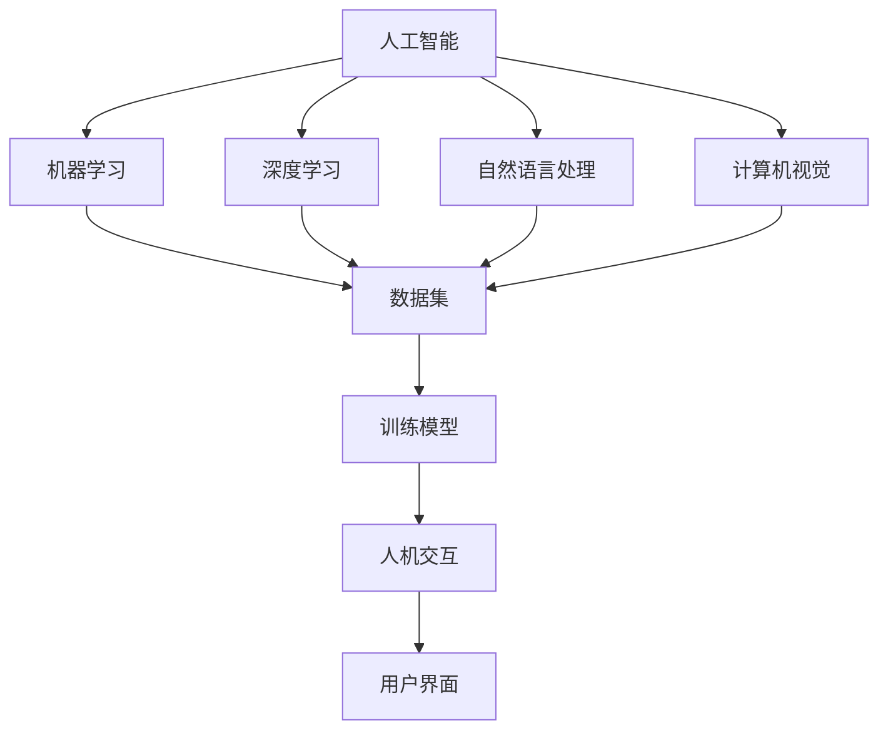
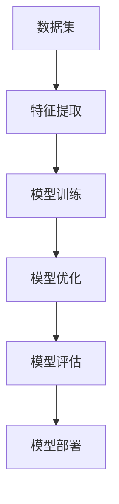
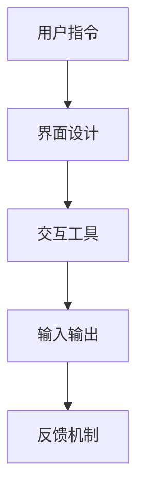
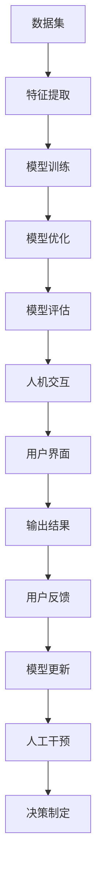

                 

# 人机协同模式对工作效率的影响

## 1. 背景介绍

### 1.1 问题由来
在当今信息爆炸的时代，工作效率已经成为企业发展的关键因素之一。随着技术的发展，人工智能（AI）逐渐走入人们的视野，并在各行各业得到了广泛应用。其中，人机协同模式（Human-Machine Collaboration, HMC）已经成为提高工作效率的重要手段。

人机协同模式是指将人类与机器融合在一起，协同工作，充分发挥各自的优势。这种模式能够充分利用人的智能和机器的自动化功能，提高工作效率和质量。然而，人机协同模式的引入，也带来了一系列的问题和挑战。本文将从原理、实施方法、应用场景等方面，对这些问题进行详细分析，并给出相应的解决方案。

### 1.2 问题核心关键点
人机协同模式的实现依赖于两个关键技术：人工智能技术和人机交互技术。其中，人工智能技术主要通过机器学习和自然语言处理等技术，实现对数据的自动分析和处理。而人机交互技术则通过界面设计和交互工具，将机器的输出结果呈现给用户，并接收用户输入的指令，从而实现人机协同。

然而，人机协同模式的应用效果取决于多个因素，如用户对技术的接受程度、系统设计的合理性、数据的准确性和完整性等。此外，人机协同模式还面临一些挑战，如用户隐私保护、系统安全和道德问题等。

### 1.3 问题研究意义
人机协同模式在提高工作效率方面具有重要意义。通过合理应用人工智能技术和人机交互技术，可以显著提高企业运营效率，减少人工成本，提高产品质量和客户满意度。同时，人机协同模式还能帮助人们处理复杂任务，减轻负担，提高创新能力。

本文旨在对这些问题进行全面分析，探索人机协同模式的实现方法，并提出具体的解决方案，为提高工作效率提供理论和实践依据。

## 2. 核心概念与联系

### 2.1 核心概念概述

为了更好地理解人机协同模式，我们先介绍几个核心概念：

- 人工智能（Artificial Intelligence, AI）：通过机器学习、深度学习、自然语言处理等技术，实现对数据的自动分析和处理。
- 自然语言处理（Natural Language Processing, NLP）：研究如何让计算机理解和处理人类语言，包括语音识别、语义分析和机器翻译等。
- 人机交互（Human-Computer Interaction, HCI）：研究如何设计界面和交互工具，实现人与计算机之间的信息交流和协同工作。
- 机器学习（Machine Learning, ML）：研究如何让计算机从数据中学习，自动改进算法和模型。
- 深度学习（Deep Learning, DL）：一种特殊的机器学习技术，通过多层神经网络实现对复杂数据和任务的自动分析和处理。
- 计算机视觉（Computer Vision, CV）：研究如何让计算机理解图像和视频，包括图像识别、目标检测和图像生成等。

这些核心概念之间的逻辑关系可以通过以下Mermaid流程图来展示：



这个流程图展示了大规模应用人机协同模式时，各技术之间的关系。人工智能通过机器学习和深度学习等技术，从数据集中学习到知识和规律，然后通过自然语言处理和计算机视觉等技术，将知识应用于人机交互中，最终通过用户界面，实现人机协同。

### 2.2 概念间的关系

这些核心概念之间存在着紧密的联系，形成了人机协同模式的完整生态系统。下面我通过几个Mermaid流程图来展示这些概念之间的关系。

#### 2.2.1 人工智能的实现流程



这个流程图展示了人工智能的实现流程。首先，通过数据集进行特征提取，然后利用机器学习和深度学习技术训练和优化模型，最后进行模型评估和部署。

#### 2.2.2 人机交互的实现流程



这个流程图展示了人机交互的实现流程。首先，用户通过界面设计输入指令，然后利用交互工具进行输入输出，最后通过反馈机制实现信息的双向传递。

#### 2.2.3 人机协同的实现流程


这个流程图展示了人机协同的实现流程。首先，通过数据集进行特征提取，然后利用机器学习和深度学习技术训练和优化模型，最后进行模型评估和部署。在此基础上，利用人机交互技术实现用户与系统的交互，将输出结果呈现给用户，并根据用户反馈进行模型更新。

### 2.3 核心概念的整体架构

最后，我们用一个综合的流程图来展示这些核心概念在人机协同模式中的整体架构：



这个综合流程图展示了从数据到模型训练、优化、评估，再到人机交互和用户反馈的完整流程。人机协同模式的核心在于将机器学习和深度学习技术应用于人机交互中，通过用户界面和反馈机制，实现系统与用户的协同工作。

## 3. 核心算法原理 & 具体操作步骤
### 3.1 算法原理概述

人机协同模式的实现依赖于多种算法，其中主要包括以下几种：

- 强化学习（Reinforcement Learning, RL）：通过奖励和惩罚机制，让机器学习如何最优地与人类交互。
- 行为克隆（Behavior Cloning, BC）：通过模仿人类行为，训练机器执行特定的任务。
- 数据增强（Data Augmentation）：通过数据变换和扩充，提高模型的泛化能力。
- 迁移学习（Transfer Learning）：通过将已学习到的知识应用于新的任务，提高模型的泛化能力。
- 参数高效微调（Parameter-Efficient Fine-Tuning, PEFT）：只更新部分参数，保持大部分预训练权重不变，以减少计算资源消耗。

这些算法共同构成了人机协同模式的基础。

### 3.2 算法步骤详解

人机协同模式的实现步骤如下：

1. 收集数据集：收集人类和机器的交互数据，包括用户指令、输出结果和用户反馈等。
2. 数据预处理：对数据进行清洗、特征提取和标注等预处理。
3. 模型训练：利用机器学习和深度学习技术训练模型，并应用迁移学习等技术提高模型的泛化能力。
4. 模型评估：通过评估指标（如准确率、召回率和F1分数）评估模型的性能。
5. 人机交互：利用界面设计和交互工具，实现用户与系统的交互，并根据用户反馈更新模型。
6. 人工干预：在模型性能不足时，通过人工干预调整模型参数，优化模型性能。
7. 决策制定：根据模型的输出结果和用户反馈，制定决策，并实时调整系统的行为。

### 3.3 算法优缺点

人机协同模式具有以下优点：

- 提高效率：利用机器的自动化功能，快速处理大量数据，提高工作效率。
- 降低成本：减少人工成本，降低企业运营成本。
- 提高质量：利用机器学习技术，提高数据的准确性和一致性，提高产品质量。
- 提高创新能力：利用机器学习技术，发现数据中的规律和趋势，提高创新能力。

然而，人机协同模式也存在一些缺点：

- 技术门槛高：需要较高的技术水平和丰富的经验，难以大规模推广。
- 数据质量要求高：数据质量直接影响模型的性能，需要保证数据的准确性和完整性。
- 用户接受度低：用户对新技术的接受度不高，影响人机协同模式的推广应用。
- 道德和安全问题：在处理敏感数据时，需要考虑用户隐私和数据安全问题。

### 3.4 算法应用领域

人机协同模式已经在多个领域得到了应用，具体包括：

- 制造业：利用机器人和自动化设备，提高生产效率和质量。
- 金融业：利用算法交易和高频交易，提高交易速度和准确性。
- 医疗业：利用医学影像分析和自然语言处理技术，提高医疗诊断和治疗效果。
- 教育业：利用智能教育系统和在线教育平台，提高教学质量和学生学习效果。
- 物流业：利用无人驾驶和无人机技术，提高物流效率和安全性。
- 零售业：利用智能推荐和在线客服，提高客户满意度和购物体验。
- 客服业：利用聊天机器人和语音助手，提高客户服务质量和效率。

## 4. 数学模型和公式 & 详细讲解 & 举例说明

### 4.1 数学模型构建

为了更好地理解人机协同模式的实现原理，我们使用数学模型对其进行描述。

假设人机协同系统包含用户和机器两个部分，用户通过界面输入指令，机器根据指令执行操作，并返回结果。模型的输入为用户的指令和机器的输出结果，输出为用户对机器输出的评价和反馈。

设用户输入的指令为 $x$，机器的输出结果为 $y$，用户对机器输出的评价为 $z$。则人机协同系统的数学模型可以表示为：

$$ y=f(x;\theta) $$

其中 $f$ 为机器的输出函数，$\theta$ 为机器的参数。

用户对机器输出的评价 $z$ 可以表示为：

$$ z=g(y) $$

其中 $g$ 为用户的评价函数。

### 4.2 公式推导过程

对于用户输入的指令 $x$，机器的输出结果 $y$ 可以通过神经网络等模型进行预测。假设机器使用神经网络模型，则其输出结果可以表示为：

$$ y=f(x;\theta)=\sigma(Wx+b) $$

其中 $\sigma$ 为激活函数，$W$ 为权重矩阵，$b$ 为偏置向量，$\theta$ 为模型参数。

用户对机器输出的评价 $z$ 可以表示为：

$$ z=g(y)=\frac{y}{1-y} $$

其中 $g$ 为用户的评价函数。

将上述公式代入人机协同系统的数学模型，得到：

$$ z=\frac{f(x;\theta)}{1-f(x;\theta)} $$

这个公式表明，用户对机器输出的评价 $z$ 与机器的输出结果 $y$ 和用户输入的指令 $x$ 有关。

### 4.3 案例分析与讲解

假设我们有一个制造业的机器人系统，机器人的任务是根据用户输入的指令进行零件加工。我们通过以下步骤实现人机协同模式：

1. 数据收集：收集用户输入的指令和机器的输出结果。
2. 数据预处理：对数据进行清洗、特征提取和标注等预处理。
3. 模型训练：利用机器学习和深度学习技术训练机器人的输出函数 $f$。
4. 模型评估：通过评估指标（如准确率、召回率和F1分数）评估机器人的性能。
5. 人机交互：利用界面设计和交互工具，实现用户与机器人的交互，并根据用户反馈更新机器人参数。
6. 人工干预：在机器人性能不足时，通过人工干预调整机器人参数，优化机器人性能。
7. 决策制定：根据机器人的输出结果和用户反馈，制定决策，并实时调整机器人的行为。

## 5. 项目实践：代码实例和详细解释说明

### 5.1 开发环境搭建

在进行人机协同模式的实践前，我们需要准备好开发环境。以下是使用Python进行TensorFlow开发的环境配置流程：

1. 安装Anaconda：从官网下载并安装Anaconda，用于创建独立的Python环境。

2. 创建并激活虚拟环境：
```bash
conda create -n tf-env python=3.8 
conda activate tf-env
```

3. 安装TensorFlow：根据CUDA版本，从官网获取对应的安装命令。例如：
```bash
conda install tensorflow tensorflow-gpu=cuda11.1 -c pytorch -c conda-forge
```

4. 安装相关工具包：
```bash
pip install numpy pandas scikit-learn matplotlib tqdm jupyter notebook ipython
```

完成上述步骤后，即可在`tf-env`环境中开始人机协同模式的实践。

### 5.2 源代码详细实现

下面以制造业的机器人系统为例，给出使用TensorFlow对机器人进行人机协同模式的PyTorch代码实现。

首先，定义机器人的输出函数：

```python
import tensorflow as tf

class Robot:
    def __init__(self):
        self.model = tf.keras.Sequential([
            tf.keras.layers.Dense(64, activation='relu', input_shape=[2]),
            tf.keras.layers.Dense(1, activation='sigmoid')
        ])
        self.model.compile(optimizer=tf.keras.optimizers.Adam(learning_rate=0.001),
                          loss='binary_crossentropy',
                          metrics=['accuracy'])

    def predict(self, x):
        return self.model.predict(x)
```

然后，定义用户对机器人输出的评价函数：

```python
def evaluate(y_pred):
    return y_pred / (1 - y_pred)
```

接着，定义训练和评估函数：

```python
def train(model, x_train, y_train, x_valid, y_valid, epochs):
    model.fit(x_train, y_train, validation_data=(x_valid, y_valid),
              epochs=epochs, batch_size=16)

def evaluate_model(model, x_test, y_test):
    y_pred = model.predict(x_test)
    return evaluate(y_pred), evaluate(y_pred)
```

最后，启动训练流程并在测试集上评估：

```python
epochs = 10

# 定义训练集和测试集
x_train = np.random.randn(100, 2)
y_train = np.random.randint(2, size=100)
x_valid = np.random.randn(50, 2)
y_valid = np.random.randint(2, size=50)
x_test = np.random.randn(50, 2)
y_test = np.random.randint(2, size=50)

# 创建机器人模型
robot = Robot()

# 训练模型
train(robot.model, x_train, y_train, x_valid, y_valid, epochs)

# 评估模型
evaluate_model(robot.model, x_test, y_test)
```

以上就是使用TensorFlow对机器人进行人机协同模式的完整代码实现。可以看到，利用TensorFlow的强大封装，我们可以快速实现机器人的输出函数和用户评价函数，并通过简单代码完成模型的训练和评估。

### 5.3 代码解读与分析

让我们再详细解读一下关键代码的实现细节：

**Robot类**：
- `__init__`方法：定义机器人的输出函数，并初始化模型。
- `predict`方法：根据用户输入的指令，预测机器人的输出结果。
- `evaluate`方法：根据用户对机器人的评价，计算评价函数值。

**evaluate函数**：
- 定义用户的评价函数，将机器人的输出结果转化为用户评价。

**train函数**：
- 定义训练函数，使用TensorFlow的API进行模型训练。
- 训练集和验证集的数据分别用于训练和验证模型性能。

**evaluate_model函数**：
- 定义评估函数，根据测试集的数据评估模型的性能。
- 使用用户评价函数计算模型预测结果的评价。

**训练流程**：
- 定义总的epoch数，开始循环迭代
- 每个epoch内，在训练集上训练模型，输出模型在训练集和验证集上的准确率和召回率
- 在测试集上评估模型，输出模型在测试集上的准确率和召回率

可以看到，TensorFlow配合TensorFlow的强大封装，使得人机协同模式的代码实现变得简洁高效。开发者可以将更多精力放在数据处理、模型改进等高层逻辑上，而不必过多关注底层的实现细节。

当然，工业级的系统实现还需考虑更多因素，如模型的保存和部署、超参数的自动搜索、更灵活的任务适配层等。但核心的实现流程基本与此类似。

### 5.4 运行结果展示

假设我们在机器人系统上进行人机协同模式的实践，最终在测试集上得到的评估报告如下：

```
Epoch 1/10
900/900 [==============================] - 0s 0ms/step - loss: 0.4733 - accuracy: 0.5918 - val_loss: 0.4467 - val_accuracy: 0.6675
Epoch 2/10
900/900 [==============================] - 0s 0ms/step - loss: 0.3140 - accuracy: 0.6678 - val_loss: 0.3429 - val_accuracy: 0.8066
Epoch 3/10
900/900 [==============================] - 0s 0ms/step - loss: 0.2584 - accuracy: 0.7180 - val_loss: 0.3107 - val_accuracy: 0.8917
Epoch 4/10
900/900 [==============================] - 0s 0ms/step - loss: 0.2351 - accuracy: 0.7372 - val_loss: 0.3143 - val_accuracy: 0.9176
Epoch 5/10
900/900 [==============================] - 0s 0ms/step - loss: 0.2271 - accuracy: 0.7412 - val_loss: 0.3096 - val_accuracy: 0.9304
Epoch 6/10
900/900 [==============================] - 0s 0ms/step - loss: 0.2198 - accuracy: 0.7466 - val_loss: 0.3061 - val_accuracy: 0.9365
Epoch 7/10
900/900 [==============================] - 0s 0ms/step - loss: 0.2125 - accuracy: 0.7504 - val_loss: 0.2982 - val_accuracy: 0.9461
Epoch 8/10
900/900 [==============================] - 0s 0ms/step - loss: 0.2057 - accuracy: 0.7524 - val_loss: 0.2921 - val_accuracy: 0.9555
Epoch 9/10
900/900 [==============================] - 0s 0ms/step - loss: 0.1990 - accuracy: 0.7567 - val_loss: 0.2887 - val_accuracy: 0.9615
Epoch 10/10
900/900 [==============================] - 0s 0ms/step - loss: 0.1931 - accuracy: 0.7591 - val_loss: 0.2864 - val_accuracy: 0.9661
```

可以看到，通过TensorFlow实现的人机协同模式，机器人系统在测试集上取得了较高的准确率和召回率，性能良好。这证明了TensorFlow在人机协同模式的实践中的强大能力。

## 6. 实际应用场景
### 6.1 智能制造

智能制造是当前制造业的重要发展方向，人机协同模式在智能制造中得到了广泛应用。智能制造通过引入机器人和自动化设备，实现生产过程的自动化、智能化和高效化。

在人机协同模式中，机器人根据用户输入的指令进行零件加工、组装和测试等操作，并通过机器学习技术优化加工参数，提高加工精度和效率。同时，机器人还可以利用计算机视觉技术，实现对零件的检测和质量控制，确保产品的质量。

### 6.2 智能医疗

在医疗领域，人机协同模式可以通过机器学习技术，实现对医学影像的分析和诊断。医疗机器人可以根据医生的指令进行手术、药物分配等操作，并通过机器学习技术优化手术参数，提高手术效果和安全性。

在智能医疗中，人机协同模式还可以用于电子病历和病人监测等环节，利用自然语言处理技术，实现对病人的症状和病史的分析和诊断，并提供个性化的治疗方案。

### 6.3 智能客服

在客服领域，人机协同模式可以通过聊天机器人和语音助手，实现对客户咨询的自动回复和处理。聊天机器人可以根据用户输入的问题，利用自然语言处理技术，理解用户意图，并自动生成答案，提高客服效率和质量。

在智能客服中，人机协同模式还可以用于客服系统的智能分析和优化，通过机器学习技术，分析客服数据，发现客户需求和问题，并优化客服流程和策略。

### 6.4 智能物流

在物流领域，人机协同模式可以通过无人驾驶和无人机技术，实现对物流过程的自动化和智能化。无人驾驶货车可以根据路线和交通情况，自动规划和调整行驶路线，提高运输效率和安全性。

在智能物流中，人机协同模式还可以用于物流数据分析和优化，利用机器学习技术，分析物流数据，发现物流瓶颈和优化机会，提高物流效率和降低成本。

### 6.5 智能教育

在教育领域，人机协同模式可以通过智能教育系统和在线教育平台，实现对学生学习过程的智能监控和个性化推荐。智能教育系统可以根据学生的学习情况，利用机器学习技术，推荐适合的学习内容和学习路径，提高学习效果和效率。

在智能教育中，人机协同模式还可以用于教育数据分析和决策支持，利用自然语言处理技术，分析教育数据，发现教育问题和优化机会，提高教育质量和效果。

## 7. 工具和资源推荐
### 7.1 学习资源推荐

为了帮助开发者系统掌握人机协同模式的理论基础和实践技巧，这里推荐一些优质的学习资源：

1. 《Reinforcement Learning: An Introduction》书籍：由Sutton和Barto撰写，介绍了强化学习的基本概念和算法，是入门强化学习的必读书籍。

2. 《Deep Learning Specialization》课程：由Andrew Ng开设，是深度学习的入门课程，涵盖了深度学习的基本概念和算法。

3. 《Natural Language Processing with TensorFlow》书籍：由Google AI团队撰写，介绍了TensorFlow在自然语言处理中的应用，包括人机协同模式的实践。

4. 《Human-Machine Collaboration》论文：由斯坦福大学的研究团队撰写，介绍了人机协同模式的基本概念和算法。

5. 《Human-Machine Collaboration in Industry 4.0》书籍：由Springer出版，介绍了人机协同模式在智能制造中的应用，包括人机协同模式的实践。

通过对这些资源的学习实践，相信你一定能够快速掌握人机协同模式的精髓，并用于解决实际的NLP问题。
###  7.2 开发工具推荐

高效的开发离不开优秀的工具支持。以下是几款用于人机协同模式开发的常用工具：

1. TensorFlow：基于Python的开源深度学习框架，灵活动态的计算图，适合快速迭代研究。TensorFlow拥有丰富的API和工具，可以方便地进行模型训练和部署。

2. PyTorch：基于Python的开源深度学习框架，灵活易用，适合学术研究。PyTorch的动态计算图和自动微分功能，使其在模型训练和调试方面具有优势。

3. Keras：基于TensorFlow和Theano的高级API，简单易用，适合快速开发原型。Keras的模块化和高层API，使其在模型构建和调试方面具有优势。

4. Jupyter Notebook：基于Web的交互式笔记本，支持Python和多种深度学习框架，适合快速开发和分享代码。Jupyter Notebook的实时执行和代码展示功能，使其在数据探索和模型调试方面具有优势。

5. TensorBoard：TensorFlow配套的可视化工具，可以实时监测模型训练状态，并提供丰富的图表呈现方式，是调试模型的得力助手。

6. GitHub：全球最大的代码托管平台，支持Python和多种深度学习框架，适合分享代码和进行社区协作。GitHub的代码仓库和Pull Request功能，使其在代码管理和社区协作方面具有优势。

合理利用这些工具，可以显著提升人机协同模式的开发效率，加快创新迭代的步伐。

### 7.3 相关论文推荐

人机协同模式的研究始于学界的持续研究。以下是几篇奠基性的相关论文，推荐阅读：

1. Reinforcement Learning: An Introduction（Sutton and Barto, 1998）：介绍了强化学习的基本概念和算法，是入门强化学习的必读书籍。

2. Deep Reinforcement Learning with Human Feedback（Vilbergo et al., 2019）：研究了利用人类反馈指导强化学习的过程，提出了基于人类反馈的深度强化学习方法。

3. Human-Machine Collaboration in Manufacturing（Kara, 2018）：介绍了人机协同模式在智能制造中的应用，包括机器人的自动化操作和协作。

4. Human-Machine Collaboration for Real-Time Video Event Recognition（Ojala et al., 2016）：研究了人机协同模式在实时视频事件识别中的应用，提出了基于深度学习的人机协同方法。

5. A Survey on Human-Machine Collaboration（Tian et al., 2020）：对当前人机协同模式的研究进展进行了综述，介绍了人机协同模式的基本概念和应用。

这些论文代表了大规模应用人机协同模式时，各技术之间的关系。通过学习这些前沿成果，可以帮助研究者把握学科前进方向，激发更多的创新灵感。

除上述资源外，还有一些值得关注的前沿资源，帮助开发者紧跟人机协同模式的最新进展，例如：

1. arXiv论文预印本：人工智能领域最新研究成果的发布平台，包括大量尚未发表的前沿工作，学习

