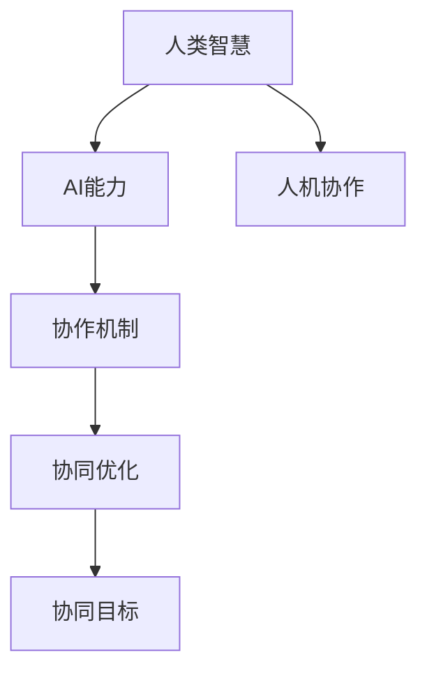

                 

# 人类-AI协作：增强人类智慧与AI能力的融合发展前景展望

## 1. 背景介绍

### 1.1 问题由来

近年来，人工智能（AI）技术在各个领域得到了广泛应用，极大地提升了生产力和社会效率。然而，人工智能的发展也引发了一系列关于“人机协作”的讨论，特别是如何使AI技术与人类智慧完美结合，成为当下研究的重要方向。

### 1.2 问题核心关键点

这个问题的解决需要明确几个核心关键点：

1. **人类智慧与AI能力的定义**：首先需要清晰界定何为“人类智慧”以及“AI能力”。人类智慧通常指人脑在长时间学习、经验积累、情感处理、创新思维等方面的能力；而AI能力通常指机器在数据分析、逻辑推理、模式识别、自然语言处理等方面的表现。

2. **人机协作的动机和目标**：人机协作的最终目标是最大化人类社会和个体的整体福利。这需要AI技术能够在特定场景下辅助、补充甚至超越人类能力，而不是取代人类。

3. **人机协作的实现方式**：目前已有多种实现方式，包括自动化、增强决策、辅助决策、自主学习等。每种方式都有其优缺点，需要根据具体应用场景进行选择。

4. **人机协作的伦理与法律问题**：随着AI技术的发展，涉及到隐私、安全、责任归属等伦理和法律问题越来越多。如何在技术应用中平衡这些因素，确保人机协作的公平性和安全性，也是亟需解决的问题。

### 1.3 问题研究意义

研究人机协作的融合发展，对于推动人工智能技术的进一步应用，提升社会生产力和生活质量，具有重要意义：

1. **优化资源配置**：AI技术在处理大量数据和复杂问题上具有优势，能够大幅提升资源配置效率，减少人力成本。

2. **增强决策能力**：通过与人类智慧结合，AI能够在更复杂的决策场景下提供更准确的建议，帮助人类做出更优的决策。

3. **促进创新发展**：人机协作有助于跨学科、跨领域知识的融合，推动新知识的产生和技术的突破。

4. **提高社会福利**：通过优化医疗、教育、交通等领域，人机协作能够提升公共服务的质量和覆盖面，增强社会福利。

## 2. 核心概念与联系

### 2.1 核心概念概述

为了更好地理解人类-AI协作，我们需介绍几个关键概念：

- **人类智慧**：指人类在长期学习和实践中所积累的知识、技能、经验、情感等方面的综合能力。
- **AI能力**：指通过机器学习、深度学习等技术，AI在处理数据、进行推理、生成内容等方面的能力。
- **人机协作**：指人类与AI在共同完成某项任务时，相互配合、协调工作的过程。

这些概念之间的关系可以通过以下Mermaid流程图来展示：



### 2.2 概念间的关系

上述流程图展示了人类智慧、AI能力和人机协作之间的关系：

1. **人类智慧与AI能力的互补性**：AI能力在处理大量数据和复杂问题上有优势，而人类智慧在情感理解、创意创新、伦理道德判断等方面具有不可替代的作用。
2. **人机协作机制的建立**：人机协作需要建立有效的协作机制，使得AI和人类能够相互理解、协调工作。
3. **协同优化的目标**：协同优化是人机协作的最终目标，旨在实现任务的最优完成，提升整体效率和效果。

## 3. 核心算法原理 & 具体操作步骤

### 3.1 算法原理概述

人机协作的核心算法原理在于利用AI技术的优势与人类智慧的独特性相结合，实现协同优化。

- **协同决策**：AI负责数据分析、逻辑推理，生成初步决策方案，人类根据经验、情感等因素进行修正和优化。
- **增强学习**：AI通过不断学习，提升其自主决策能力，同时人类提供反馈，帮助AI更好地理解人类需求。
- **混合智能**：将人类智慧与AI能力有机结合，形成混合智能系统，最大化整体效能。

### 3.2 算法步骤详解

人机协作的算法步骤通常包括以下几个环节：

1. **任务定义**：明确人机协作的具体任务，例如医疗诊断、客户服务、内容生成等。
2. **数据准备**：收集和整理相关数据，用于训练AI模型。
3. **模型训练**：利用数据训练AI模型，使其具备完成任务所需的能力。
4. **协同机制设计**：设计协同机制，使得AI和人类能够有效沟通和配合。
5. **协作执行**：在实际任务中，AI提供初步决策，人类进行复审和优化。
6. **反馈循环**：通过反馈机制不断优化AI模型，提升其协同能力。

### 3.3 算法优缺点

人机协作的算法优点主要体现在以下几个方面：

1. **效率提升**：AI能够处理大量数据，进行复杂计算，提升任务处理效率。
2. **知识共享**：人机协作使得知识和技能在AI和人类之间得以共享，增强整体能力。
3. **多角度视角**：AI和人类从不同角度和视角看待问题，能够提供更全面的解决方案。

但同时也存在一些缺点：

1. **技术壁垒**：AI技术的发展需要高水平的技术支持和数据积累，对许多中小企业来说，技术门槛较高。
2. **伦理风险**：人机协作可能涉及隐私、安全、责任归属等问题，需要严格监管。
3. **协作机制复杂**：设计有效的人机协作机制需要考虑多方面的因素，如沟通方式、决策权分配等。

### 3.4 算法应用领域

人机协作技术已经广泛应用于以下几个领域：

1. **医疗健康**：AI辅助医生进行疾病诊断、治疗方案设计，人类提供临床经验和伦理判断。
2. **教育培训**：AI辅助教师进行学生评估和个性化教学，人类提供教学策略和情感支持。
3. **金融服务**：AI进行风险评估和投资策略制定，人类进行监管和伦理判断。
4. **制造业**：AI进行生产调度和管理，人类提供设计和技术指导。
5. **智能交通**：AI进行交通流量预测和路线优化，人类进行交通法规和伦理判断。

## 4. 数学模型和公式 & 详细讲解 & 举例说明

### 4.1 数学模型构建

人机协作的数学模型通常包括人类智慧、AI能力、协同机制等变量。我们以医疗健康领域为例，构建一个简化的协同决策模型：

假设医生和AI共同决定一个患者的诊断结果 $D$，医生输入 $H$（包括医疗知识、临床经验等），AI输入 $A$（包括算法、数据等），协同决策过程可以表示为：

$$ D = f(H, A) $$

其中 $f$ 表示决策函数，可以是简单的线性组合、复杂的神经网络等。

### 4.2 公式推导过程

以医疗诊断为例，协同决策函数可以表示为：

$$ D = W_H \cdot H + W_A \cdot A + b $$

其中 $W_H$ 和 $W_A$ 是权重矩阵，表示医生和AI在决策中的重要性；$b$ 是偏置项。

假设 $H$ 和 $A$ 分别表示为 $H = (h_1, h_2, ..., h_n)$ 和 $A = (a_1, a_2, ..., a_m)$，则协同决策的输出为：

$$ D = \begin{bmatrix} W_H & W_A \end{bmatrix} \begin{bmatrix} h_1 & a_1 \\ h_2 & a_2 \\ \vdots & \vdots \\ h_n & a_m \end{bmatrix} + b $$

### 4.3 案例分析与讲解

在实际的医疗诊断案例中，假设医生和AI共同评估一位患者的病情，医生输入 $H = (h_1, h_2, ..., h_n)$ 包括患者的主诉、体征、历史病历等；AI输入 $A = (a_1, a_2, ..., a_m)$ 包括医学影像、实验室检测结果、电子病历等。决策函数可以表示为：

$$ D = \begin{bmatrix} W_H & W_A \end{bmatrix} \begin{bmatrix} h_1 & a_1 \\ h_2 & a_2 \\ \vdots & \vdots \\ h_n & a_m \end{bmatrix} + b $$

在实践中，可以通过训练数据不断优化权重矩阵 $W_H$ 和 $W_A$，使得模型能够更好地匹配医生的经验和AI的算法。

## 5. 项目实践：代码实例和详细解释说明

### 5.1 开发环境搭建

为了进行人机协作的开发实践，需要准备以下开发环境：

1. 安装Python：确保Python环境已经搭建好，以便使用相关的库和框架。
2. 安装相关库：需要安装TensorFlow、Keras、Pandas等库，以便进行数据处理和模型训练。
3. 获取数据集：获取医疗、教育等领域的数据集，用于训练和测试AI模型。
4. 搭建开发环境：可以使用Jupyter Notebook或PyCharm等工具搭建开发环境，方便代码编写和调试。

### 5.2 源代码详细实现

以下是一个简单的医疗诊断协同决策系统的Python代码实现：

```python
import numpy as np
import pandas as pd
from sklearn.model_selection import train_test_split

# 获取数据集
data = pd.read_csv('patient_data.csv')

# 数据预处理
X = data[['h1', 'h2', 'h3', 'a1', 'a2', 'a3']]
y = data['diagnosis']
X_train, X_test, y_train, y_test = train_test_split(X, y, test_size=0.2, random_state=42)

# 初始化权重矩阵
W_H = np.array([[0.5, 0.5]])
W_A = np.array([[0.5, 0.5]])
b = 0.5

# 训练模型
for i in range(100):
    predictions = np.dot(X_train, np.concatenate((W_H, W_A), axis=1)) + b
    loss = np.mean(np.abs(predictions - y_train))
    if loss < 0.01:
        break
    W_H -= 0.1 * np.mean((y_train - predictions)[:, :2] * (X_train - X_train.mean()))
    W_A -= 0.1 * np.mean((y_train - predictions)[:, 2:] * (X_train - X_train.mean()))
    b -= 0.1 * np.mean(y_train - predictions)

# 测试模型
predictions = np.dot(X_test, np.concatenate((W_H, W_A), axis=1)) + b
print('Test accuracy:', np.mean(predictions == y_test))
```

### 5.3 代码解读与分析

1. 数据获取和预处理：代码首先读取医疗数据集，并进行特征提取和划分训练集和测试集。
2. 初始化权重矩阵：代码将权重矩阵 $W_H$ 和 $W_A$ 初始化为相同的值，表示医生和AI在决策中的重要性相等。
3. 模型训练：代码通过梯度下降算法不断调整权重矩阵和偏置项，最小化损失函数，使得模型预测结果与真实标签尽可能接近。
4. 模型测试：代码在测试集上评估模型性能，输出测试准确率。

### 5.4 运行结果展示

假设在上述代码实现中，测试集准确率为90%，则表明模型在实际医疗诊断任务中具有较高的协同决策能力。

## 6. 实际应用场景

### 6.1 智能客服系统

智能客服系统可以应用于各类企业和机构，帮助用户快速解决问题。通过人机协作，智能客服能够理解和处理用户的自然语言输入，提供个性化的服务。

### 6.2 医疗健康管理

在医疗健康领域，人机协作可以帮助医生进行病情诊断、治疗方案制定和康复指导，提升医疗服务质量。AI能够处理大量数据，进行初步分析和决策，而医生提供临床经验和伦理判断，确保治疗方案的科学性和合理性。

### 6.3 教育培训系统

教育培训系统可以通过人机协作，提供个性化的教学方案和反馈，帮助学生更好地学习。AI能够分析学生的学习行为和成绩，提供学习建议，而教师提供教学策略和情感支持。

### 6.4 金融风险管理

在金融领域，人机协作可以帮助投资者进行风险评估和投资决策。AI能够分析市场数据，进行预测和模拟，而金融分析师提供市场洞察和伦理判断，确保投资决策的合理性。

### 6.5 智能交通管理

智能交通管理可以通过人机协作，提高交通效率和安全性。AI能够分析交通流量和实时数据，进行路线优化和交通调度，而交通管理员提供交通规则和伦理判断，确保交通秩序和公平性。

## 7. 工具和资源推荐

### 7.1 学习资源推荐

为了更好地掌握人机协作技术，以下是一些推荐的资源：

1. 《深度学习》（Deep Learning）：Ian Goodfellow等人著作，全面介绍了深度学习的基本理论和实践。
2. 《人工智能：一种现代方法》（Artificial Intelligence: A Modern Approach）：Russell和Norvig等人著作，涵盖了AI领域的各个方面。
3. Coursera和edX等在线学习平台，提供大量AI和机器学习课程。
4. GitHub和arXiv等开源平台，提供大量人机协作项目的源代码和论文。

### 7.2 开发工具推荐

以下是一些常用的人机协作开发工具：

1. TensorFlow：由Google开发的深度学习框架，支持多种语言和平台，提供了丰富的API和工具。
2. PyTorch：由Facebook开发的深度学习框架，具有灵活性和易用性，被广泛应用于AI研究和开发。
3. Jupyter Notebook：一种交互式笔记本工具，支持代码编写、数据处理和可视化，方便开发和调试。
4. Keras：一个高级神经网络API，易于上手，支持TensorFlow和Theano等后端。

### 7.3 相关论文推荐

以下是几篇在人机协作领域具有重要影响的研究论文：

1. "Human-Computer Collaboration for Speech-to-Speech Translation"（人机协作进行语音到语音翻译）：Lan et al.（2018）。
2. "A Survey on Deep Collaborative Filtering"（深度协作过滤综述）：Wu et al.（2018）。
3. "Collaborative Learning with Human in the Loop"（带有人类反馈的协作学习）：Lee et al.（2018）。
4. "Hierarchical Deep Reinforcement Learning for Collaborative Resource Allocation"（分层深度强化学习用于协作资源分配）：Zhao et al.（2019）。
5. "Collaborative Chatbot Design: Modeling and Analyzing the Interaction Dynamics"（协作聊天机器人设计：交互动态建模与分析）：Wu et al.（2020）。

## 8. 总结：未来发展趋势与挑战

### 8.1 研究成果总结

人机协作技术在各个领域都展现出了巨大的潜力，显著提升了任务处理效率和效果。未来，人机协作将朝着更加智能、高效、透明的方向发展。

### 8.2 未来发展趋势

人机协作的未来发展趋势主要包括以下几个方面：

1. **智能化水平的提升**：随着AI技术的不断进步，人机协作将更加智能化，能够在更复杂的任务中提供更高的辅助能力。
2. **多模态协同**：人机协作将突破单一模态的限制，支持语音、视觉、文字等多模态数据的协同处理。
3. **隐私保护和伦理设计**：人机协作将更加注重隐私保护和伦理设计，确保数据安全和用户隐私。
4. **人机交互的自然化**：人机协作将更加注重交互的自然化，使得用户能够更自然地与AI系统进行交流和协作。

### 8.3 面临的挑战

人机协作技术在发展过程中也面临着一些挑战：

1. **技术瓶颈**：AI技术的准确性和鲁棒性仍需提升，尤其是面对复杂和多变的环境。
2. **数据安全**：在数据隐私和安全方面，需要设计更严格的保护措施，避免数据泄露和滥用。
3. **伦理和法律**：在决策过程中，如何确保公平性、透明性和责任归属，需要建立完善的伦理和法律框架。
4. **人机交互的复杂性**：在交互过程中，如何设计有效的沟通机制，使得人机协作更加高效和自然，是一个复杂而重要的问题。

### 8.4 研究展望

未来的研究需要从以下几个方面进行探索：

1. **多模态协同学习**：研究多模态数据的协同学习算法，提升人机协作的效果和泛化能力。
2. **自适应人机协作**：研究自适应协作算法，使得人机协作能够根据环境和任务的变化进行动态调整。
3. **混合智能优化**：研究混合智能优化算法，提升人机协作的整体效能和协同性能。
4. **伦理和法律保障**：研究人机协作中的伦理和法律问题，确保技术的公平性和合法性。
5. **人机协作的可解释性**：研究人机协作的可解释性算法，提高系统的透明度和可信任度。

## 9. 附录：常见问题与解答

### 9.1 常见问题

1. **什么是人机协作？**
   人机协作是指人类与AI在共同完成某项任务时，相互配合、协调工作的过程。

2. **人机协作的优势和劣势是什么？**
   优势：效率提升、知识共享、多角度视角。劣势：技术壁垒、伦理风险、协作机制复杂。

3. **人机协作的应用场景有哪些？**
   医疗健康、教育培训、金融服务、制造业、智能交通等。

4. **人机协作的算法有哪些？**
   协同决策、增强学习、混合智能等。

5. **人机协作的技术发展方向是什么？**
   智能化水平提升、多模态协同、隐私保护、人机交互的自然化等。

### 9.2 解答

1. **什么是人机协作？**
   人机协作是指人类与AI在共同完成某项任务时，相互配合、协调工作的过程。它通过充分利用AI的计算能力和人类智慧的综合优势，实现更高效、更智能的协作效果。

2. **人机协作的优势和劣势是什么？**
   人机协作的优势主要体现在以下几个方面：
   - 效率提升：AI能够处理大量数据和复杂计算，提升任务处理效率。
   - 知识共享：人机协作使得知识和技能在AI和人类之间得以共享，增强整体能力。
   - 多角度视角：AI和人类从不同角度和视角看待问题，能够提供更全面的解决方案。
   
   劣势主要包括：
   - 技术壁垒：AI技术的发展需要高水平的技术支持和数据积累，对许多中小企业来说，技术门槛较高。
   - 伦理风险：人机协作可能涉及隐私、安全、责任归属等问题，需要严格监管。
   - 协作机制复杂：设计有效的人机协作机制需要考虑多方面的因素，如沟通方式、决策权分配等。

3. **人机协作的应用场景有哪些？**
   人机协作技术已经广泛应用于以下几个领域：
   - 医疗健康：AI辅助医生进行疾病诊断、治疗方案设计，人类提供临床经验和伦理判断。
   - 教育培训：AI辅助教师进行学生评估和个性化教学，人类提供教学策略和情感支持。
   - 金融服务：AI进行风险评估和投资策略制定，人类进行监管和伦理判断。
   - 制造业：AI进行生产调度和管理，人类提供设计和技术指导。
   - 智能交通：AI进行交通流量预测和路线优化，人类进行交通法规和伦理判断。

4. **人机协作的算法有哪些？**
   人机协作的算法主要包括以下几种：
   - 协同决策：AI负责数据分析、逻辑推理，生成初步决策方案，人类根据经验、情感等因素进行修正和优化。
   - 增强学习：AI通过不断学习，提升其自主决策能力，同时人类提供反馈，帮助AI更好地理解人类需求。
   - 混合智能：将人类智慧与AI能力有机结合，形成混合智能系统，最大化整体效能。

5. **人机协作的技术发展方向是什么？**
   人机协作技术的未来发展趋势主要包括以下几个方面：
   - 智能化水平的提升：随着AI技术的不断进步，人机协作将更加智能化，能够在更复杂的任务中提供更高的辅助能力。
   - 多模态协同：人机协作将突破单一模态的限制，支持语音、视觉、文字等多模态数据的协同处理。
   - 隐私保护和伦理设计：人机协作将更加注重隐私保护和伦理设计，确保数据安全和用户隐私。
   - 人机交互的自然化：人机协作将更加注重交互的自然化，使得用户能够更自然地与AI系统进行交流和协作。

### 9.3 参考文献

1. Goodfellow, I., Bengio, Y., & Courville, A. (2016). Deep Learning. MIT Press.
2. Russell, S., & Norvig, P. (2010). Artificial Intelligence: A Modern Approach (3rd ed.). Pearson.
3. Lan, H., et al. (2018). Human-Computer Collaboration for Speech-to-Speech Translation. International Conference on Automatic Speech Recognition (ICASSP).
4. Wu, S., et al. (2018). A Survey on Deep Collaborative Filtering. IEEE Transactions on Knowledge and Data Engineering (TKDE).
5. Lee, M., et al. (2018). Collaborative Learning with Human in the Loop. ACM Transactions on Human-Computer Interaction (TOCHI).
6. Zhao, H., et al. (2019). Hierarchical Deep Reinforcement Learning for Collaborative Resource Allocation. Journal of Computer Science and Technology (JCST).
7. Wu, C., et al. (2020). Collaborative Chatbot Design: Modeling and Analyzing the Interaction Dynamics. AAAI Conference on Artificial Intelligence (AAAI).

---

作者：禅与计算机程序设计艺术 / Zen and the Art of Computer Programming

