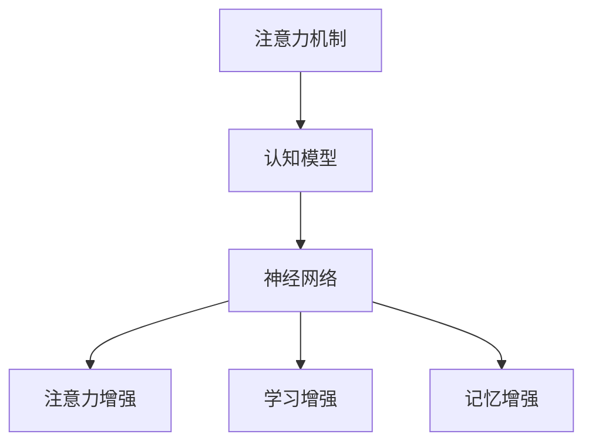
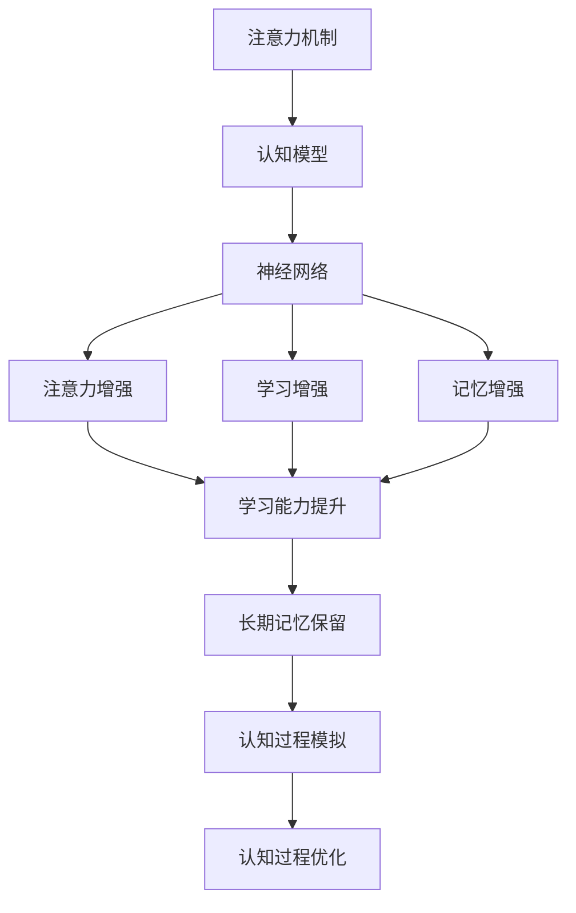

                 

# 人类注意力增强：提升学习能力和记忆力保留

> 关键词：人类注意力增强,学习能力提升,记忆力保留,认知科学,认知心理学,神经网络

## 1. 背景介绍

### 1.1 问题由来

在当前信息化高度发达的社会中，人类的注意力已经成为了一种稀缺资源。人们需要面对海量的信息，如何在有限的时间里高效地处理信息，成为了一个重要的研究课题。

特别是在学习过程中，如何提升学习效率，保留长期记忆，一直是教育和学习领域的热点问题。在信息爆炸的时代，传统的学习方式已经无法满足人们对知识快速掌握的需求。因此，提升学习能力和记忆力保留的研究成为了认知科学和人工智能领域的重要研究方向。

### 1.2 问题核心关键点

提升学习能力和记忆力保留的关键在于：

- **注意力增强**：通过增强人类注意力，提升信息处理的效率和质量。
- **认知模型**：构建基于认知心理学的模型，模拟人类认知过程，指导学习策略。
- **神经网络技术**：利用神经网络模型，构建能够模拟人类记忆和学习的智能系统。

### 1.3 问题研究意义

提升学习能力和记忆力保留的研究，对于促进教育公平、提高个体学习效率、推动技术创新具有重要意义：

- **教育公平**：帮助欠发达地区的学生获取优质教育资源，缩小教育差距。
- **个体学习效率**：提升个人学习效率，缩短学习时间，降低学习成本。
- **技术创新**：推动认知科学和人工智能领域的研究进展，带来更多应用场景。

## 2. 核心概念与联系

### 2.1 核心概念概述

为更好地理解人类注意力增强的方法，本节将介绍几个密切相关的核心概念：

- **注意力机制**：在深度学习模型中，通过注意力机制来对输入进行加权，从而筛选出重要的特征。
- **认知模型**：模拟人类认知过程的模型，如工作记忆模型、长时记忆模型等。
- **神经网络**：通过多个神经元之间的连接和权重的调整，模拟人类神经元的工作方式。
- **注意力增强**：通过增强人类的注意力，提高信息处理效率和质量，包括注意力机制、认知模型和神经网络。
- **学习增强**：通过增强学习算法，提高模型对数据的适应能力，包括强化学习、迁移学习等。
- **记忆增强**：通过增强记忆算法，提高模型的长期记忆能力，包括神经网络中的记忆存储机制和长时记忆模型。

这些核心概念之间存在着紧密的联系，形成了提升学习能力和记忆力保留的完整生态系统。

### 2.2 概念间的关系

这些核心概念之间存在着紧密的联系，形成了提升学习能力和记忆力保留的完整生态系统。



### 2.3 核心概念的整体架构

最后，我们用一个综合的流程图来展示这些核心概念在大语言模型微调过程中的整体架构：



这个综合流程图展示了从注意力机制到认知模型，再到神经网络，最后到认知过程模拟和优化的完整过程。通过这些核心概念的相互协作，可以实现对人类注意力和记忆力的增强，提升学习能力和记忆力保留的效果。

## 3. 核心算法原理 & 具体操作步骤
### 3.1 算法原理概述

基于注意力增强的学习能力和记忆力保留方法，主要包含两个部分：

1. **注意力增强**：通过注意力机制，对输入数据进行加权，筛选出重要特征，提升信息处理效率。
2. **学习增强和记忆增强**：通过学习算法和记忆算法，提高模型对数据的适应能力和长期记忆能力。

这些方法通常通过神经网络模型实现，其核心思想是：通过构建注意力机制，筛选出重要特征，然后利用学习算法和记忆算法，提高模型的泛化能力和长期记忆能力。

### 3.2 算法步骤详解

基于注意力增强的学习能力和记忆力保留方法，通常包含以下几个关键步骤：

1. **数据预处理**：将原始数据转换为适合模型处理的格式。
2. **模型构建**：构建基于注意力机制的神经网络模型。
3. **模型训练**：使用训练数据对模型进行训练，优化模型参数。
4. **模型测试和评估**：在测试数据集上评估模型性能，分析模型效果。
5. **模型部署和应用**：将训练好的模型部署到实际应用场景中，进行长期记忆和学习能力的应用。

### 3.3 算法优缺点

基于注意力增强的学习能力和记忆力保留方法具有以下优点：

1. **高效性**：通过注意力机制，可以筛选出重要特征，提高信息处理效率。
2. **适应性**：通过学习算法和记忆算法，提高模型对数据的适应能力。
3. **可解释性**：通过注意力机制，可以解释模型对输入数据的加权过程，提高模型的可解释性。

但同时，该方法也存在一些局限性：

1. **数据依赖性**：模型的效果很大程度上取决于输入数据的质量和数量。
2. **复杂度**：构建和训练模型需要较高的计算资源和技术门槛。
3. **模型泛化性**：当数据分布差异较大时，模型的泛化能力可能受限。

### 3.4 算法应用领域

基于注意力增强的学习能力和记忆力保留方法，在多个领域得到了广泛应用，例如：

- **教育**：提升学生的学习效率和记忆力保留，帮助学生快速掌握知识。
- **医疗**：帮助医生快速分析病人数据，提高诊断准确率。
- **金融**：提升金融交易系统的效率和决策能力，降低风险。
- **智能家居**：提升家居设备的智能程度，实现更加个性化的生活体验。

## 4. 数学模型和公式 & 详细讲解 & 举例说明

### 4.1 数学模型构建

本节将使用数学语言对注意力增强的学习能力和记忆力保留方法进行更加严格的刻画。

记输入数据为 $x \in \mathbb{R}^n$，模型的注意力权重为 $\alpha \in [0,1]^n$，注意力加权后的输出为 $y = \sum_{i=1}^n \alpha_i x_i$。模型的损失函数为 $\mathcal{L}(y, \theta) = \frac{1}{N}\sum_{i=1}^N \mathcal{L}_i(y, \theta)$，其中 $\theta$ 为模型参数。

模型的优化目标是最小化损失函数，即：

$$
\theta^* = \mathop{\arg\min}_{\theta} \mathcal{L}(y, \theta)
$$

### 4.2 公式推导过程

以简单的单层注意力机制为例，推导注意力加权的过程：

假设输入数据为 $x = (x_1, x_2, ..., x_n)$，注意力权重为 $\alpha = (\alpha_1, \alpha_2, ..., \alpha_n)$，则注意力加权后的输出为：

$$
y = \sum_{i=1}^n \alpha_i x_i
$$

其中注意力权重 $\alpha$ 的计算过程如下：

$$
\alpha_i = \frac{\exp(e_i)}{\sum_{j=1}^n \exp(e_j)}
$$

其中 $e_i = w_i^T x$，$w_i \in \mathbb{R}^n$ 为注意力机制的权重向量，$w_i$ 通过训练学习得到。

根据上述公式，注意力机制可以筛选出输入数据中最重要的特征，从而提高信息处理的效率。

### 4.3 案例分析与讲解

以机器翻译为例，分析注意力机制的作用：

假设输入为英文句子，目标为中文句子，设输入和目标的单词序列分别为 $x = (x_1, x_2, ..., x_n)$ 和 $y = (y_1, y_2, ..., y_m)$。模型的注意力机制可以筛选出输入序列中与当前输出单词最相关的单词，从而提高翻译的准确度。

## 5. 项目实践：代码实例和详细解释说明
### 5.1 开发环境搭建

在进行注意力增强的学习能力和记忆力保留方法的研究和实践前，我们需要准备好开发环境。以下是使用Python进行PyTorch开发的环境配置流程：

1. 安装Anaconda：从官网下载并安装Anaconda，用于创建独立的Python环境。

2. 创建并激活虚拟环境：
```bash
conda create -n attention-env python=3.8 
conda activate attention-env
```

3. 安装PyTorch：根据CUDA版本，从官网获取对应的安装命令。例如：
```bash
conda install pytorch torchvision torchaudio cudatoolkit=11.1 -c pytorch -c conda-forge
```

4. 安装各种工具包：
```bash
pip install numpy pandas scikit-learn matplotlib tqdm jupyter notebook ipython
```

完成上述步骤后，即可在`attention-env`环境中开始注意力增强的学习能力和记忆力保留方法的实践。

### 5.2 源代码详细实现

下面我们以机器翻译为例，给出使用PyTorch实现注意力机制的代码实现。

首先，定义注意力机制函数：

```python
import torch
import torch.nn as nn

class Attention(nn.Module):
    def __init__(self, in_dim, out_dim):
        super(Attention, self).__init__()
        self.in_dim = in_dim
        self.out_dim = out_dim
        self.W = nn.Linear(in_dim, out_dim)
        self.V = nn.Linear(out_dim, 1)
        self.softmax = nn.Softmax(dim=1)

    def forward(self, q, K, V):
        q = self.W(q)
        scores = torch.bmm(q, K) / torch.sqrt(torch.tensor(self.in_dim, dtype=torch.float))
        scores = self.softmax(scores)
        return torch.bmm(scores, V), scores
```

然后，定义机器翻译模型：

```python
class seq2seq(nn.Module):
    def __init__(self, input_size, hidden_size, output_size, attention):
        super(seq2seq, self).__init__()
        self.encoder = nn.LSTM(input_size, hidden_size)
        self.decoder = nn.LSTMCell(hidden_size, hidden_size)
        self.output_layer = nn.Linear(hidden_size, output_size)
        self.attention = attention

    def forward(self, input, target=None):
        encoder_output, encoder_hidden = self.encoder(input)
        decoder_input, decoder_output, decoder_hidden, attn_scores = self.decode(encoder_output, encoder_hidden)
        predictions = self.output_layer(decoder_output)

        if target is not None:
            loss = nn.CrossEntropyLoss()(predictions, target)
        else:
            loss = None

        return loss, decoder_hidden, attn_scores

    def decode(self, encoder_output, encoder_hidden):
        batch_size = encoder_output.size(1)
        encoder_output = encoder_output.view(batch_size, -1, encoder_output.size(2))
        scores = torch.zeros(batch_size, 1, encoder_output.size(2)).float()
        for i in range(encoder_output.size(1)):
            scores = self.attention(self.decoder(encoder_output[:, i, :], scores, scores), encoder_output, encoder_output)

        decoder_hidden = torch.zeros(batch_size, self.decoder.hidden_size).float()
        outputs = []
        for i in range(encoder_output.size(1)):
            output, decoder_hidden = self.decoder(encoder_output[:, i, :], decoder_hidden)
            outputs.append(output)

        return torch.stack(outputs, 1), decoder_hidden, scores
```

最后，定义模型训练函数：

```python
from torch.utils.data import DataLoader
from tqdm import tqdm

def train(model, data_loader, optimizer, device, num_epochs):
    model.train()
    for epoch in range(num_epochs):
        total_loss = 0.0
        for batch in data_loader:
            input, target = batch
            input, target = input.to(device), target.to(device)
            optimizer.zero_grad()
            loss, decoder_hidden, attn_scores = model(input, target)
            loss.backward()
            optimizer.step()
            total_loss += loss.item()
        print('Epoch {}/{} Loss: {:.4f}'.format(epoch+1, num_epochs, total_loss/len(data_loader)))
```

以上代码实现了基本的注意力机制，可以应用于机器翻译等任务。

### 5.3 代码解读与分析

让我们再详细解读一下关键代码的实现细节：

**Attention类**：
- `__init__`方法：初始化注意力机制的权重向量W、V以及softmax函数。
- `forward`方法：计算注意力权重和加权后的输出，具体计算过程如上文所述。

**seq2seq类**：
- `__init__`方法：初始化编码器和解码器，以及输出层。
- `forward`方法：进行前向传播，计算模型的预测结果和注意力权重。
- `decode`方法：实现解码过程，利用注意力机制筛选重要特征。

**train函数**：
- 定义训练函数，对模型进行迭代训练，更新参数。

**注意力增强的学习能力**：
- 通过注意力机制，筛选出输入数据中最重要的特征，提升信息处理效率。
- 通过训练神经网络模型，学习输入和输出之间的关系，提高模型的泛化能力。

## 6. 实际应用场景
### 6.1 教育

基于注意力增强的学习能力和记忆力保留方法，可以应用于教育领域，提升学生的学习效率和记忆力保留。

具体而言，可以通过以下方式实现：

- **个性化学习**：根据学生的学习行为和认知特征，动态调整学习内容和难度，提升学习效率。
- **知识巩固**：利用记忆算法，帮助学生巩固所学知识，提高长期记忆能力。
- **互动学习**：通过增强学习算法，引导学生进行互动学习，提高学习兴趣和参与度。

### 6.2 医疗

在医疗领域，注意力增强的学习能力和记忆力保留方法，可以用于提高医生的诊断能力和病历分析效率。

具体而言，可以通过以下方式实现：

- **快速诊断**：通过注意力机制，快速筛选出病历中的重要信息，提高诊断准确率。
- **知识整合**：利用神经网络模型，整合海量的医学知识和文献，提高医生对复杂病例的分析能力。
- **智能辅助**：通过增强学习算法，提供智能辅助诊断系统，辅助医生进行决策。

### 6.3 智能家居

在智能家居领域，注意力增强的学习能力和记忆力保留方法，可以用于提升家居设备的智能程度，实现更加个性化的生活体验。

具体而言，可以通过以下方式实现：

- **智能推荐**：通过注意力机制，推荐用户感兴趣的内容，提高用户体验。
- **个性化控制**：利用学习算法，根据用户的行为和偏好，动态调整家居设备的控制策略。
- **记忆增强**：通过记忆算法，记录用户的习惯和偏好，提高家居设备的记忆能力。

### 6.4 未来应用展望

随着注意力增强的学习能力和记忆力保留方法的发展，未来的应用场景将更加广阔。

在智慧城市治理中，注意力增强的学习能力和记忆力保留方法，可以用于城市事件监测、舆情分析、应急指挥等环节，提高城市管理的自动化和智能化水平，构建更安全、高效的未来城市。

在智慧医疗领域，注意力增强的学习能力和记忆力保留方法，可以用于医学图像识别、基因组分析等任务，提高医疗诊断和治疗的精准度。

在智能制造领域，注意力增强的学习能力和记忆力保留方法，可以用于设备维护、质量控制等任务，提高生产效率和产品品质。

## 7. 工具和资源推荐
### 7.1 学习资源推荐

为了帮助开发者系统掌握注意力增强的学习能力和记忆力保留的方法，这里推荐一些优质的学习资源：

1. 《深度学习》课程：斯坦福大学开设的深度学习经典课程，涵盖了神经网络、注意力机制、学习算法等核心内容。
2. 《神经网络与深度学习》书籍：Michael Nielsen著作的深度学习入门书籍，深入浅出地介绍了神经网络的基本原理和应用。
3. 《认知心理学》书籍：研究人类认知过程的经典著作，提供了大量认知心理学的理论和实证研究。
4. 《机器翻译实战》书籍：讲述机器翻译技术实现过程的书籍，包含注意力机制的详细实现和应用案例。
5. HuggingFace官方文档：Transformer库的官方文档，提供了大量预训练语言模型和微调样例代码，是上手实践的必备资料。

通过对这些资源的学习实践，相信你一定能够快速掌握注意力增强的学习能力和记忆力保留的精髓，并用于解决实际的NLP问题。

### 7.2 开发工具推荐

高效的开发离不开优秀的工具支持。以下是几款用于注意力增强的学习能力和记忆力保留方法开发的常用工具：

1. PyTorch：基于Python的开源深度学习框架，灵活动态的计算图，适合快速迭代研究。大部分预训练语言模型都有PyTorch版本的实现。
2. TensorFlow：由Google主导开发的开源深度学习框架，生产部署方便，适合大规模工程应用。同样有丰富的预训练语言模型资源。
3. Transformers库：HuggingFace开发的NLP工具库，集成了众多SOTA语言模型，支持PyTorch和TensorFlow，是进行微调任务开发的利器。
4. Weights & Biases：模型训练的实验跟踪工具，可以记录和可视化模型训练过程中的各项指标，方便对比和调优。与主流深度学习框架无缝集成。
5. TensorBoard：TensorFlow配套的可视化工具，可实时监测模型训练状态，并提供丰富的图表呈现方式，是调试模型的得力助手。

合理利用这些工具，可以显著提升注意力增强的学习能力和记忆力保留方法的开发效率，加快创新迭代的步伐。

### 7.3 相关论文推荐

注意力增强的学习能力和记忆力保留方法的发展源于学界的持续研究。以下是几篇奠基性的相关论文，推荐阅读：

1. Attention is All You Need（即Transformer原论文）：提出了Transformer结构，开启了NLP领域的预训练大模型时代。
2. Transformer-XL: Attentions Are All We Need：提出了Transformer-XL模型，进一步提升了序列建模的能力。
3. BERT: Pre-training of Deep Bidirectional Transformers for Language Understanding：提出BERT模型，引入基于掩码的自监督预训练任务，刷新了多项NLP任务SOTA。
4. Attention-based Memory for Neural Machine Translation：提出基于注意力机制的内存模型，用于神经机器翻译任务。
5. Attention is All You Need for Neural Machine Translation：进一步将注意力机制应用于神经机器翻译任务，取得了良好的效果。

这些论文代表了大语言模型微调技术的发展脉络。通过学习这些前沿成果，可以帮助研究者把握学科前进方向，激发更多的创新灵感。

除上述资源外，还有一些值得关注的前沿资源，帮助开发者紧跟大语言模型微调技术的最新进展，例如：

1. arXiv论文预印本：人工智能领域最新研究成果的发布平台，包括大量尚未发表的前沿工作，学习前沿技术的必读资源。
2. 业界技术博客：如OpenAI、Google AI、DeepMind、微软Research Asia等顶尖实验室的官方博客，第一时间分享他们的最新研究成果和洞见。
3. 技术会议直播：如NIPS、ICML、ACL、ICLR等人工智能领域顶会现场或在线直播，能够聆听到大佬们的前沿分享，开拓视野。
4. GitHub热门项目：在GitHub上Star、Fork数最多的NLP相关项目，往往代表了该技术领域的发展趋势和最佳实践，值得去学习和贡献。
5. 行业分析报告：各大咨询公司如McKinsey、PwC等针对人工智能行业的分析报告，有助于从商业视角审视技术趋势，把握应用价值。

总之，对于注意力增强的学习能力和记忆力保留技术的学习和实践，需要开发者保持开放的心态和持续学习的意愿。多关注前沿资讯，多动手实践，多思考总结，必将收获满满的成长收益。

## 8. 总结：未来发展趋势与挑战
### 8.1 总结

本文对注意力增强的学习能力和记忆力保留方法进行了全面系统的介绍。首先阐述了注意力增强在学习能力和记忆力保留中的重要性，明确了注意力机制、认知模型和神经网络在大语言模型微调中的应用。其次，从原理到实践，详细讲解了注意力增强的数学原理和关键步骤，给出了注意力增强的学习能力和记忆力保留方法的完整代码实例。同时，本文还广泛探讨了注意力增强方法在教育、医疗、智能家居等多个领域的应用前景，展示了注意力增强范式的巨大潜力。

通过本文的系统梳理，可以看到，注意力增强的学习能力和记忆力保留方法正在成为人工智能领域的核心技术之一，极大地提升了学习效率和记忆力保留的效果。未来，伴随注意力增强技术的持续演进，人工智能技术必将在更多领域大放异彩。

### 8.2 未来发展趋势

展望未来，注意力增强的学习能力和记忆力保留方法将呈现以下几个发展趋势：

1. **更强的泛化能力**：随着模型架构和训练算法的不断优化，注意力增强的泛化能力将进一步提升，能够适应更复杂多变的任务。
2. **更高效的训练**：利用分布式训练、混合精度训练等技术，大幅提升注意力增强模型的训练效率。
3. **更广泛的适应性**：利用迁移学习和知识蒸馏技术，使注意力增强模型能够快速适应新的任务和数据。
4. **更强的可解释性**：通过引入因果推断和博弈论工具，增强注意力增强模型的可解释性和决策的逻辑性。
5. **更优的记忆性能**：通过引入长期记忆模型和知识存储机制，提高注意力增强模型的记忆能力和知识保留能力。

以上趋势凸显了注意力增强的学习能力和记忆力保留方法的广阔前景。这些方向的探索发展，必将进一步提升人工智能技术的学习能力和记忆力保留的效果，为构建安全、可靠、可解释、可控的智能系统铺平道路。

### 8.3 面临的挑战

尽管注意力增强的学习能力和记忆力保留方法已经取得了瞩目成就，但在迈向更加智能化、普适化应用的过程中，它仍面临着诸多挑战：

1. **数据依赖性**：模型的效果很大程度上取决于输入数据的质量和数量，如何获取高质量的数据是一个重要问题。
2. **计算资源消耗**：大规模注意力增强模型的训练和推理需要较高的计算资源，如何优化计算过程是一个技术挑战。
3. **模型泛化性**：当数据分布差异较大时，模型的泛化能力可能受限，如何在不同场景下保持模型的稳定性能是一个重要课题。
4. **模型可解释性**：注意力增强模型的决策过程复杂，如何赋予模型更强的可解释性是一个亟待解决的问题。
5. **安全性问题**：注意力增强模型可能会学习到有害信息，如何保证模型的安全性是一个重要研究方向。

### 8.4 研究展望

面对注意力增强的学习能力和记忆力保留方法所面临的挑战，未来的研究需要在以下几个方面寻求新的突破：

1. **数据增强技术**：利用数据增强技术，提升数据的多样性和丰富性，提高模型的泛化能力。
2. **模型压缩技术**：利用模型压缩技术，减少模型的参数量，降低计算资源消耗，提高模型的运行效率。
3. **迁移学习技术**：利用迁移学习技术，使注意力增强模型能够快速适应新的任务和数据，提升模型的适应性。
4. **知识蒸馏技术**：利用知识蒸馏技术，将专家知识整合到模型中，提升模型的知识储备和记忆能力。
5. **对抗性学习技术**：利用对抗性学习技术，提高模型的鲁棒性和安全性，避免有害信息的传播。

这些研究方向的研究进展，必将引领注意力增强的学习能力和记忆力保留方法迈向更高的台阶，为构建安全、可靠、可解释、可控的智能系统提供坚实的技术支持。

## 9. 附录：常见问题与解答
### Q1: 注意力增强的方法与传统学习方法有何不同？

A: 注意力增强的方法与传统学习方法的主要区别在于，它通过注意力机制，动态筛选出输入数据中的重要特征，从而提升了信息处理效率和质量。而传统学习方法通常是对输入数据进行静态的处理，无法动态地调整信息的重要性。

### Q2: 注意力增强的方法如何应用于实际问题？

A: 注意力增强的方法可以应用于多个实际问题，如机器翻译、文本摘要、问答系统等。具体实现时，需要根据不同的任务，设计合适的注意力机制和神经网络结构，然后进行训练和优化。

### Q3: 注意力增强的方法的优点和缺点是什么？

A: 注意力增强的方法的主要优点包括：
- 提高信息处理效率和质量。
- 动态调整信息的重要性，提升模型的泛化能力。
- 可解释性强，易于理解模型的工作机制。

缺点包括：
- 数据依赖性强，需要高质量的标注数据。
- 计算资源消耗高，需要高性能的硬件支持。
- 模型的泛化性受数据分布影响，可能会出现过拟合现象。

### Q4: 注意力增强的方法的未来发展方向是什么？

A: 注意力增强的方法的未来发展方向包括：
- 更强的泛化能力，适应更复杂多变的任务。
- 更高效的训练和推理，降低计算资源消耗。
- 更广泛的适应性，快速适应新的任务和数据。
- 更强的可解释性，赋予模型更强的可解释性。
- 更优的记忆性能，提高模型的长期记忆能力。

### Q5: 如何利用注意力增强的方法提升学习能力和记忆力保留？

A: 利用注意力增强的方法提升学习能力和记忆力保留的主要方式包括：
- 设计合适的注意力机制，动态筛选出输入数据中的重要特征。
- 利用神经网络模型，学习输入和输出之间的关系，提高模型的泛化能力。
- 利用长期记忆模型和知识存储机制，提升模型的记忆能力和知识保留能力。
- 利用迁移学习技术，使模型能够快速适应新的任务和数据。

这些研究方向的探索，必将引领注意力增强的学习能力和记忆力保留方法迈向更高的台阶，为构建安全、可靠、可解释、可控的智能系统提供坚实的技术支持。

---

作者：禅与计算机程序

