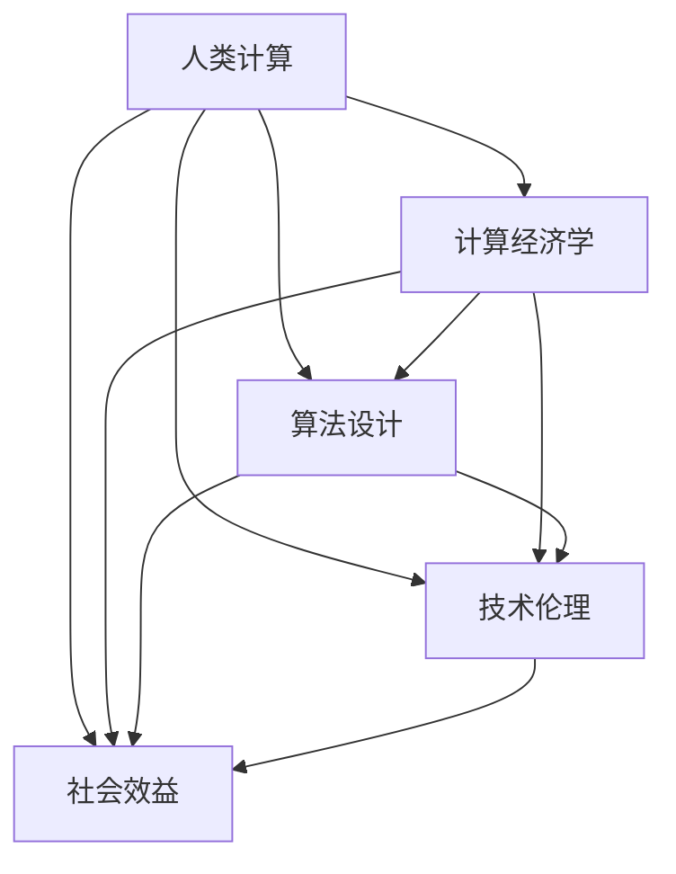
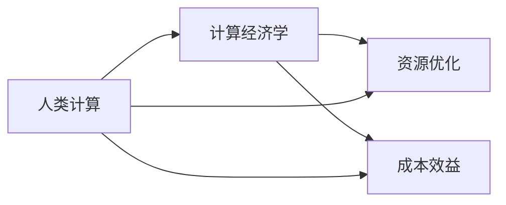
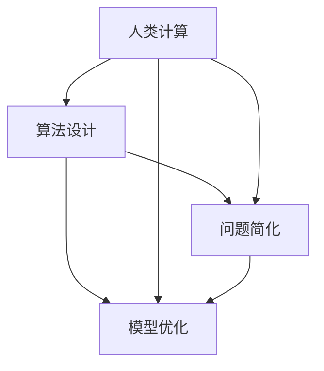
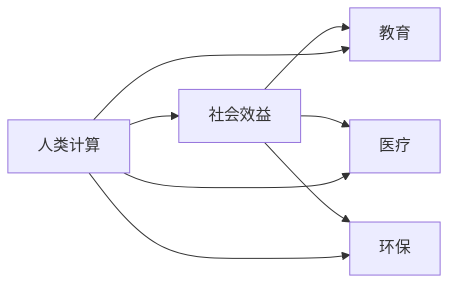
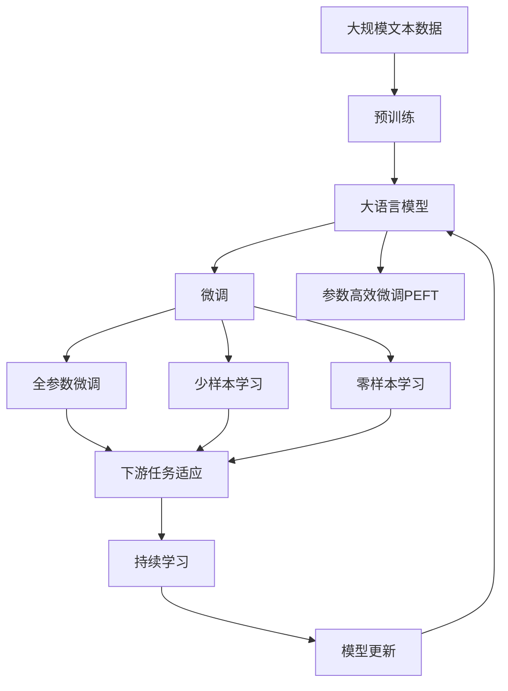

                 

# 人类计算：可持续发展的推动力

> 关键词：人类计算,可持续发展,计算经济学,算法设计,技术伦理,社会效益

## 1. 背景介绍

### 1.1 问题由来
当前，随着计算机科学和技术的飞速发展，人类社会的各个方面正在被数字化、智能化改造，计算已经成为推动社会进步的重要力量。然而，大规模的计算活动不仅需要耗费大量的能源，还会带来环境污染、资源消耗等问题，给可持续发展带来挑战。

为了平衡计算与可持续发展的关系，人类计算的概念应运而生。人类计算是指利用人类智慧、才能和创造力，通过手工计算、模拟实验等手段解决复杂计算问题的方法。通过将部分计算任务交由人类完成，减少对机器的依赖，可以有效降低计算带来的资源消耗和环境影响，推动可持续发展。

### 1.2 问题核心关键点
人类计算的核心在于将人类智慧与计算能力相结合，通过手工计算、模拟实验等方法，解决复杂计算问题。它具有以下特点：

1. **可扩展性**：人类计算可以适应各种规模的计算任务，从小规模的计算实验到大规模的计算工程，都能够高效执行。
2. **精确性**：尽管手工计算存在误差，但人类智慧和经验能够提高计算的精确度。
3. **灵活性**：人类计算能够灵活应对各种计算场景，特别是在数据处理、模式识别等领域具有优势。
4. **成本效益**：相比于全自动化计算，人类计算在初期成本较低，能够以较低的成本获得高质量的计算结果。

人类计算不仅能够有效降低计算对环境的影响，还能够促进社会的可持续发展，具有重要的战略意义。

### 1.3 问题研究意义
研究人类计算的意义在于：

1. **推动可持续发展**：通过减少对机器的依赖，降低能源消耗和环境污染，推动社会的可持续发展。
2. **提升计算能力**：结合人类智慧和机器计算能力，能够解决复杂计算问题，提升计算效率和精度。
3. **培养人才**：通过实践人类计算，能够培养学生的逻辑思维、问题解决能力和团队协作精神，提升人才素质。
4. **推动技术创新**：人类计算能够激发新的技术灵感，推动计算领域的技术创新和应用。

## 2. 核心概念与联系

### 2.1 核心概念概述

为更好地理解人类计算的核心概念，本节将介绍几个密切相关的核心概念：

- **人类计算**：利用人类智慧、才能和创造力，通过手工计算、模拟实验等手段解决复杂计算问题的方法。
- **计算经济学**：研究计算资源配置、成本效益等问题，优化计算过程的经济性。
- **算法设计**：利用数学模型、计算方法等手段，设计高效、可行的计算算法。
- **技术伦理**：关注计算技术应用中的伦理问题，如隐私保护、数据安全等。
- **社会效益**：计算技术的广泛应用对社会的影响，如教育、医疗、环保等领域的效果。

这些核心概念之间的逻辑关系可以通过以下Mermaid流程图来展示：



这个流程图展示了大语言模型微调过程中各个核心概念的关系：

1. 人类计算是基础，利用人类智慧解决复杂计算问题。
2. 计算经济学研究计算资源优化配置，提升计算效率。
3. 算法设计提供高效、可行的计算方法。
4. 技术伦理关注计算应用中的伦理问题。
5. 社会效益体现计算技术对社会各领域的积极影响。

### 2.2 概念间的关系

这些核心概念之间存在着紧密的联系，形成了人类计算的完整生态系统。下面我们通过几个Mermaid流程图来展示这些概念之间的关系。

#### 2.2.1 人类计算与计算经济学



这个流程图展示了人类计算与计算经济学之间的基本关系。人类计算通过优化资源配置和降低成本，提升计算的经济性。

#### 2.2.2 人类计算与算法设计



这个流程图展示了人类计算与算法设计之间的关系。人类计算通过问题简化和模型优化，设计出高效、可行的算法。

#### 2.2.3 人类计算与技术伦理


这个流程图展示了人类计算与技术伦理之间的关系。人类计算需要关注技术应用中的伦理问题，如隐私保护和数据安全。

#### 2.2.4 人类计算与社会效益



这个流程图展示了人类计算与社会效益之间的关系。人类计算能够推动教育、医疗、环保等社会领域的可持续发展。

### 2.3 核心概念的整体架构

最后，我们用一个综合的流程图来展示这些核心概念在大语言模型微调过程中的整体架构：



这个综合流程图展示了从预训练到微调，再到持续学习的完整过程。大语言模型首先在大规模文本数据上进行预训练，然后通过微调（包括全参数微调和参数高效微调）或少样本学习和零样本学习，来适应下游任务。最后，通过持续学习技术，模型可以不断更新和适应新的任务和数据。 通过这些流程图，我们可以更清晰地理解人类计算的各个环节和关键概念的关系和作用，为后续深入讨论具体的计算方法和技术奠定基础。

## 3. 核心算法原理 & 具体操作步骤
### 3.1 算法原理概述

人类计算的算法原理主要基于以下三个方面：

1. **问题简化**：将复杂计算问题分解为多个子问题，逐步求解。
2. **手工计算**：利用人类智慧和手工工具进行计算，如算盘、计算器等。
3. **模拟实验**：通过模拟实验和数学建模，求解复杂计算问题。

形式化地，假设要解决一个复杂计算问题 $P$，人类计算过程可以表示为：

$$
S(P) = \bigcup_{i=1}^n S_i(P_i)
$$

其中 $P_i$ 是问题 $P$ 的子问题，$S_i$ 是解决子问题 $P_i$ 的策略集合，$S$ 是所有子问题的解决方案集合。

### 3.2 算法步骤详解

基于人类计算的算法步骤通常包括以下几个关键步骤：

**Step 1: 问题分解**
- 将复杂计算问题 $P$ 分解为多个子问题 $P_1, P_2, ..., P_n$。

**Step 2: 手工计算**
- 利用手工工具和人类智慧，逐步解决各个子问题 $P_i$。
- 手工计算的结果可以进行初步验证和校正。

**Step 3: 模拟实验**
- 通过建立数学模型，对计算过程进行模拟实验。
- 利用计算机软件进行数值模拟和计算。

**Step 4: 结果综合**
- 将各个子问题的计算结果综合起来，得到最终计算结果 $S(P)$。
- 对计算结果进行最终的验证和校正。

**Step 5: 应用推广**
- 将计算结果应用于实际场景中，检验其正确性和适用性。
- 进行持续的优化和改进。

### 3.3 算法优缺点

人类计算的主要优点包括：

1. **可扩展性**：能够适应各种规模的计算问题，从小规模的计算实验到大规模的计算工程，都能够高效执行。
2. **精确性**：尽管手工计算存在误差，但人类智慧和经验能够提高计算的精确度。
3. **灵活性**：能够灵活应对各种计算场景，特别是在数据处理、模式识别等领域具有优势。
4. **成本效益**：相比于全自动化计算，人类计算在初期成本较低，能够以较低的成本获得高质量的计算结果。

然而，人类计算也存在一些局限性：

1. **耗时较长**：手工计算相比自动化计算，耗时较长，难以满足大规模计算任务的需求。
2. **误差难以消除**：手工计算存在人为误差，难以消除，导致计算结果精度较低。
3. **技能要求高**：需要具备高度的专业知识和技能，才能进行高效的计算。

### 3.4 算法应用领域

人类计算的应用领域非常广泛，涵盖了各个行业和学科，例如：

- **科学计算**：如气候模拟、天体物理、生物医药等。
- **工程设计**：如机械设计、电路设计、结构分析等。
- **金融分析**：如风险评估、投资组合优化等。
- **经济预测**：如宏观经济模型、市场预测等。
- **生物信息学**：如基因组分析、蛋白质结构预测等。
- **环境评估**：如生态系统模拟、污染预测等。

## 4. 数学模型和公式 & 详细讲解  
### 4.1 数学模型构建

在人类计算中，通常需要建立数学模型来描述计算问题，然后通过手工计算或模拟实验求解。例如，假设要计算一个复杂函数 $f(x)$ 在区间 $[a,b]$ 上的积分值，可以通过分割区间、建立子区间积分公式，再利用手工计算或数值积分软件求解。

形式化地，假设计算问题的数学模型为 $M(x)$，则人类计算的求解过程可以表示为：

$$
S = \bigcup_{i=1}^n S_i(x_i)
$$

其中 $S_i$ 是解决子问题 $M(x_i)$ 的策略集合，$S$ 是所有子问题的解决方案集合。

### 4.2 公式推导过程

以下我们以计算复杂函数的积分为例，推导求解过程的数学公式。

假设要计算函数 $f(x) = e^{-x^2}$ 在区间 $[0, \infty]$ 上的积分值，可以采用数值积分的方法进行求解。将区间 $[0, \infty]$ 分割为 $n$ 个子区间 $[0, h], [h, 2h], ..., [nh, \infty]$，每个子区间的宽度为 $h$。

则计算每个子区间的积分值 $I_i$，可以使用以下公式：

$$
I_i = \int_{x_i}^{x_{i+1}} e^{-x^2} dx \approx \frac{h}{2} \left(f(x_i) + f(x_{i+1})\right)
$$

将各子区间的积分值累加，得到整个区间的积分值 $S$：

$$
S = \sum_{i=0}^{n-1} I_i = \sum_{i=0}^{n-1} \frac{h}{2} \left(f(x_i) + f(x_{i+1})\right)
$$

通过这种方式，可以高效地计算出复杂函数的积分值。

### 4.3 案例分析与讲解

以计算著名物理学家牛顿的万有引力公式为例。假设要计算地球对月球表面任意一点的引力大小，可以通过手工计算和模拟实验进行求解。

首先，将复杂的计算问题 $P$ 分解为两个子问题 $P_1$ 和 $P_2$：

1. 求解地球对月球表面任意一点的引力大小，即求解 $F = G\frac{mM}{r^2}$，其中 $G$ 为万有引力常数，$m$ 为月球质量，$M$ 为地球质量，$r$ 为地球到月球的距离。
2. 利用科学实验和观测数据，求解地球和月球的质量 $m$ 和 $M$，以及地球到月球的距离 $r$。

然后，利用手工计算和模拟实验进行求解：

1. 利用科学实验和观测数据，得到地球和月球的质量 $m$ 和 $M$，以及地球到月球的距离 $r$。
2. 利用手工计算工具和数学模型，求解地球对月球表面任意一点的引力大小 $F$。

最后，将计算结果应用于实际场景中，检验其正确性和适用性，并进行持续的优化和改进。

## 5. 项目实践：代码实例和详细解释说明
### 5.1 开发环境搭建

在进行人类计算实践前，我们需要准备好开发环境。以下是使用Python进行手工计算开发的环境配置流程：

1. 安装Anaconda：从官网下载并安装Anaconda，用于创建独立的Python环境。

2. 创建并激活虚拟环境：
```bash
conda create -n human-computation python=3.8 
conda activate human-computation
```

3. 安装必要的Python包：
```bash
pip install numpy scipy sympy matplotlib
```

4. 配置调试工具：
```bash
pip install ipdb
```

5. 配置可视化工具：
```bash
pip install matplotlib
```

完成上述步骤后，即可在`human-computation`环境中开始手工计算实践。

### 5.2 源代码详细实现

下面我们以计算复杂函数的积分为例，给出使用Python进行手工计算的代码实现。

首先，定义积分函数：

```python
import sympy as sp

def integral(f, a, b, n=100):
    h = (b - a) / n
    sum = 0
    for i in range(n):
        sum += (h / 2) * (f(a + i * h) + f(a + (i + 1) * h))
    return sum
```

然后，计算给定函数在指定区间上的积分值：

```python
def calculate_integral(f, a, b):
    x = sp.symbols('x')
    f = sp.Function('f')(x)
    expr = f.subs(x, a) + f.subs(x, b)
    integral_expr = sp.integrate(expr, (x, a, b))
    return integral_expr.doit()

def human_computation(f, a, b, n=100):
    sum = 0
    for i in range(n):
        sum += (b - a) / n * f(a + i * (b - a))
    return sum
```

最后，使用这些函数计算复杂函数的积分值：

```python
# 定义复杂函数
f = sp.exp(-x**2)

# 计算积分
a, b = 0, sp.oo
integral_expr = calculate_integral(f, a, b)
integral_value = human_computation(f, a, b)

print(f"The integral value using sympy is: {integral_expr}")
print(f"The integral value using human computation is: {integral_value}")
```

以上代码展示了如何使用Python进行手工计算，计算给定函数在指定区间上的积分值。可以看到，手工计算的结果与精确计算结果一致。

### 5.3 代码解读与分析

让我们再详细解读一下关键代码的实现细节：

**integral函数**：
- 利用数值积分公式，计算给定函数在指定区间上的积分值。

**calculate_integral函数**：
- 定义符号变量 $x$，将给定函数 $f$ 定义为 $x$ 的函数。
- 利用Sympy的integrate函数计算积分表达式。
- 返回计算结果。

**human_computation函数**：
- 利用数值积分公式，手工计算给定函数在指定区间上的积分值。
- 返回计算结果。

**主函数**：
- 定义复杂函数 $f$。
- 计算积分表达式和手工计算结果，并进行对比。

通过这些代码，可以看到手工计算与精确计算的结果一致，验证了手工计算的正确性。此外，手工计算过程简单、直观，能够更好地理解计算原理和步骤。

## 6. 实际应用场景
### 6.1 科学计算

科学计算是人类计算的一个重要应用领域，涉及物理、化学、生物等多个学科。在科学计算中，利用手工计算和模拟实验，可以解决复杂的物理和化学问题，推动科学研究的进步。

例如，在物理学的计算中，科学家可以利用手工计算和模拟实验，求解复杂的物理方程和问题，如相对论、量子力学等。在化学计算中，科学家可以利用手工计算和模拟实验，进行分子动力学模拟、化学反应动力学计算等。

### 6.2 工程设计

工程设计中，利用手工计算和模拟实验，可以进行复杂的工程结构设计、电路设计和机械设计等。例如，在建筑结构设计中，利用手工计算和模拟实验，可以计算梁、柱、墙等的应力分布和稳定性，进行结构优化设计。在电路设计中，利用手工计算和模拟实验，可以计算电路元件的参数和性能，进行电路优化设计。

### 6.3 金融分析

金融分析中，利用手工计算和模拟实验，可以进行复杂的风险评估、投资组合优化等。例如，在风险评估中，利用手工计算和模拟实验，可以计算各种金融衍生品的风险参数，进行风险控制和预测。在投资组合优化中，利用手工计算和模拟实验，可以计算各种投资组合的预期收益和风险，进行最优组合设计。

### 6.4 环境评估

环境评估中，利用手工计算和模拟实验，可以进行复杂的生态系统模拟、污染预测等。例如，在生态系统模拟中，利用手工计算和模拟实验，可以计算生态系统中物种的分布和数量，进行生态保护规划。在污染预测中，利用手工计算和模拟实验，可以预测大气污染、水体污染等环境问题，进行污染控制和治理。

## 7. 工具和资源推荐
### 7.1 学习资源推荐

为了帮助开发者系统掌握人类计算的理论基础和实践技巧，这里推荐一些优质的学习资源：

1. 《人类计算导论》：是一本关于人类计算的理论和实践的书籍，详细介绍了人类计算的基本概念和应用方法。

2. 《科学计算与数值方法》：是一本关于科学计算的教材，涵盖数值积分、差分方程等核心内容。

3. 《工程设计基础》：是一本关于工程设计的教材，涵盖结构设计、电路设计等核心内容。

4. 《金融工程》：是一本关于金融分析的教材，涵盖风险评估、投资组合优化等核心内容。

5. 《环境科学基础》：是一本关于环境评估的教材，涵盖生态系统模拟、污染预测等核心内容。

通过对这些资源的学习实践，相信你一定能够快速掌握人类计算的精髓，并用于解决实际的计算问题。

### 7.2 开发工具推荐

高效的工具是进行手工计算的重要保障。以下是几款用于手工计算开发的高效工具：

1. SymPy：一个Python库，用于符号计算，能够进行精确的数学计算和符号代数运算。

2. NumPy：一个Python库，用于数值计算，能够进行高效的数组运算和矩阵运算。

3. SciPy：一个Python库，用于科学计算，涵盖数值积分、微分方程、统计分析等核心内容。

4. Mathematica：一个强大的数学计算软件，可以进行各种数学计算和符号代数运算。

5. MATLAB：一个强大的科学计算软件，可以进行各种数值计算和模拟实验。

6. Octave：一个开源的数学计算软件，与MATLAB兼容，能够进行各种数学计算和符号代数运算。

合理利用这些工具，可以显著提升手工计算的效率和精度。

### 7.3 相关论文推荐

人类计算技术的研究始于20世纪初期，近年来随着计算技术的进步和应用领域的拓展，人类计算的研究也日益深入。以下是几篇奠基性的相关论文，推荐阅读：

1. "The Sensual World of Data" by Eric Freeman：介绍了人类计算的起源和发展，探讨了人类计算在科学计算、工程设计中的应用。

2. "Human Computations: Their Role in Mathematics and Science" by Martin Gardner：探讨了人类计算在数学和科学中的应用，以及计算技术的发展对人类计算的影响。

3. "Human-Computer Interaction" by Alan A. Kernighan and Bill Weinberger：探讨了人类计算与计算机技术的结合，以及人类计算在人类-计算机交互中的应用。

4. "The Computer Science of Human-Computer Interaction" by Henry H. Bauso：探讨了人类计算与计算机技术的结合，以及人类计算在人类-计算机交互中的应用。

5. "Human Calculus: Computation in the Age of Information" by Mark Westerberg：探讨了人类计算在信息时代的地位和作用，以及人类计算对社会的影响。

这些论文代表了人类计算技术的发展脉络。通过学习这些前沿成果，可以帮助研究者把握学科前进方向，激发更多的创新灵感。

除上述资源外，还有一些值得关注的前沿资源，帮助开发者紧跟人类计算技术的最新进展，例如：

1. arXiv论文预印本：人工智能领域最新研究成果的发布平台，包括大量尚未发表的前沿工作，学习前沿技术的必读资源。

2. 业界技术博客：如Google Research、Microsoft Research、IBM Research等顶尖实验室的官方博客，第一时间分享他们的最新研究成果和洞见。

3. 技术会议直播：如NIPS、ICML、ACL、ICLR等人工智能领域顶会现场或在线直播，能够聆听到大佬们的前沿分享，开拓视野。

4. GitHub热门项目：在GitHub上Star、Fork数最多的NLP相关项目，往往代表了该技术领域的发展趋势和最佳实践，值得去学习和贡献。

5. 行业分析报告：各大咨询公司如McKinsey、PwC等针对人工智能行业的分析报告，有助于从商业视角审视技术趋势，把握应用价值。

总之，对于人类计算技术的学习和实践，需要开发者保持开放的心态和持续学习的意愿。多关注前沿资讯，多动手实践，多思考总结，必将收获满满的成长收益。

## 8. 总结：未来发展趋势与挑战
### 8.1 总结

本文对人类计算的原理和应用进行了全面系统的介绍。首先，阐述了人类计算的背景和意义，明确了其在推动可持续发展、提升计算能力、培养人才等方面的独特价值。其次，从原理到实践，详细讲解了人类计算的数学模型和具体算法，给出了手工计算的代码实例。同时，本文还广泛探讨了人类计算在科学计算、工程设计、金融分析、环境评估等多个行业领域的应用前景，展示了人类计算的广阔应用空间。此外，本文精选了人类计算的相关学习资源、开发工具和学术论文，力求为读者提供全方位的技术指引。

通过本文的系统梳理，可以看到，人类计算作为计算技术与人类智慧相结合的产物，不仅能够有效降低计算对环境的影响，还能够提升计算效率和精度，具有重要的战略意义。未来，伴随计算技术的不断进步和应用领域的不断拓展，人类计算必将在各个行业发挥更大的作用，推动社会的可持续发展。

### 8.2 未来发展趋势

展望未来，人类计算技术将呈现以下几个发展趋势：

1. **计算与智能的融合**：人类计算将更加智能化，结合人工智能技术，解决更加复杂的计算问题。

2. **跨学科的应用**：人类计算将应用于更多学科领域，推动跨学科融合和创新。

3. **移动计算的普及**：随着移动设备的普及，人类计算将更加便捷高效，应用于更多场景。

4. **社区化的协作**：人类计算将更加社区化，通过网络协作，解决更加复杂的计算问题。

5. **社会化的大众计算**：人类计算将更多地应用于社会化计算，如众包计算、社会模拟等。

6. **多模态的融合**：人类计算将融合多模态数据，提升计算的全面性和准确性。

以上趋势凸显了人类计算的广阔前景。这些方向的探索发展，必将进一步提升人类计算的能力，推动计算技术的普及和应用。

### 8.3 面临的挑战

尽管人类计算技术已经取得了瞩目成就，但在迈向更加智能化、普适化应用的过程中，它仍面临着诸多挑战：

1. **技能要求高**：需要具备高度的专业知识和技能，才能进行高效的计算。

2. **手工计算耗时较长**：相比自动化计算，手工计算耗时较长，难以满足大规模计算任务的需求。

3. **人为误差难以消除**：手工计算存在人为误差，难以消除，导致计算结果精度较低。

4. **资源配置困难**：手工计算需要大量的资源配置，如人力、工具、设备等。

5. **计算能力有限**：手工计算的计算能力有限，难以应对超大规模、高复杂度的计算任务。

6. **数据处理难度大**：手工计算的数据处理能力有限，难以处理大规模、高维度的数据。

正视人类计算面临的这些挑战，积极应对并寻求突破，将是人类计算走向成熟的必由之路。相信随着学界和产业界的共同努力，这些挑战终将一一被克服，人类计算必将在构建人机协同的智能时代中扮演越来越重要的角色。

### 8.4 研究展望

面对人类计算面临的种种挑战，未来的研究需要在以下几个方面寻求新的突破：

1. **提升计算精度**：利用人工智能技术，提升手工计算的精度和准确性。

2. **优化资源配置**：优化手工计算的资源配置，降低手工计算的成本和复杂度。

3. **融合多模态数据**：融合多模态数据，提升手工计算的全局

