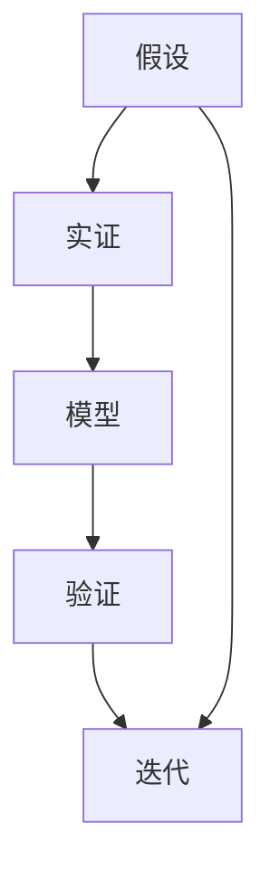

                 

# 从假说到真理：科学方法论的循环

> 关键词：科学方法论, 循环验证, 假说, 实证, 模型构建, 数据驱动

## 1. 背景介绍

### 1.1 问题由来
科学方法论是研究科学知识增长和发展规律的理论和方法，其核心在于通过假设验证来不断逼近真理。在计算机科学领域，科学方法论同样适用，指导着研究人员进行模型构建、数据处理、算法优化等各个环节的工作。然而，面对日益复杂的大规模系统和海量数据，传统的科学方法论在实际应用中遇到了诸多挑战。本文聚焦于科学方法论的循环验证过程，探讨如何在信息爆炸的时代，通过高效的数据驱动和假设验证，逐步逼近真理。

### 1.2 问题核心关键点
科学方法论的循环验证过程，包括假设的提出、数据的收集与处理、模型的构建与训练、假设的验证与调整等关键环节。在计算机科学领域，这一过程通常涉及对大规模系统的设计和优化、大数据分析与处理、机器学习模型的训练与调优等技术。本文将重点关注如何通过科学方法论的循环验证，构建高效、可靠的大规模系统，提升模型性能，优化算法效率，以适应不断变化的复杂环境。

### 1.3 问题研究意义
深入理解科学方法论的循环验证过程，对于提升计算机科学研究的系统性和有效性，促进理论到实践的转化，具有重要意义：

1. **提升研究效率**：通过循环验证，可以系统性地评估假设的合理性和数据的可靠性，避免盲目投入资源进行低效探索。
2. **提高结果准确性**：循环验证过程通过反复测试和修正，逐步逼近真实情况，提升研究结果的科学性和准确性。
3. **促进理论创新**：通过循环验证，可以发现现有理论的不足和局限，激励研究人员不断提出新理论、新方法。
4. **加速应用落地**：科学方法论的循环验证过程，可以为实际应用提供可靠的技术基础和数据支撑，加速新技术的商业化进程。
5. **增强模型鲁棒性**：通过不断验证和优化，构建的模型更具泛化能力和鲁棒性，能更好地适应新场景和新数据。

## 2. 核心概念与联系

### 2.1 核心概念概述

为更好地理解科学方法论的循环验证过程，本节将介绍几个密切相关的核心概念：

- **假设(Hypothesis)**：科学研究的起点，指对研究对象某一属性或现象的假设性描述。
- **实证(Observation)**：通过实验或数据收集等方式，获取的与假设相关的具体观察结果。
- **模型(Model)**：用于表达假设的数学或计算模型，通过训练和优化，使其能够准确预测和解释实证数据。
- **验证(Verification)**：通过对比模型预测结果和实证数据，评估模型的准确性和可靠性。
- **迭代(Iteration)**：在模型构建和验证过程中，不断提出新假设、收集新实证、调整模型，循环往复，逐步逼近真理。
- **数据驱动(Data-Driven)**：依赖大量实证数据进行模型训练和验证，自动发现隐藏在数据中的规律和趋势。

这些核心概念之间存在着紧密的联系，形成了科学方法论的循环验证框架。

### 2.2 概念间的关系

这些核心概念之间的逻辑关系可以通过以下Mermaid流程图来展示：



这个流程图展示了大规模系统构建和优化的一般过程：

1. 基于假设提出设计方案。
2. 收集与方案相关的实证数据。
3. 构建和训练模型，进行预测和解释。
4. 将模型预测结果与实证数据对比，验证模型效果。
5. 根据验证结果，调整假设和模型，进入下一轮循环。

通过这个框架，我们可以清晰地看到科学方法论的循环验证过程，逐步逼近真理，构建高效、可靠的系统。

## 3. 核心算法原理 & 具体操作步骤
### 3.1 算法原理概述

科学方法论的循环验证过程，本质上是基于数据驱动的假设验证过程。其核心思想是通过反复的假设提出、数据收集、模型训练、假设验证等环节，逐步逼近真理。

假设提出的合理性、数据的可靠性和模型的泛化能力，是科学方法论的三个关键因素。假设的正确性可以通过实证数据进行检验，模型的准确性可以通过交叉验证和测试集评估，数据的真实性则需要依赖高质量的标注和数据收集流程。

### 3.2 算法步骤详解

科学方法论的循环验证过程，包括以下几个关键步骤：

**Step 1: 提出假设**
- 基于现有知识和技术，提出对大规模系统某一属性的假设。例如，对于网络通信系统，可以假设其带宽利用率可以通过某种算法进行优化。

**Step 2: 收集实证数据**
- 设计实验或数据收集方案，获取与假设相关的实证数据。例如，设计实验场景，模拟网络通信流量，记录系统的带宽利用率。

**Step 3: 构建模型**
- 根据假设，选择合适的模型架构和算法，进行训练和优化。例如，使用深度学习模型对网络通信数据进行训练，寻找带宽利用率与算法参数之间的规律。

**Step 4: 验证假设**
- 使用实证数据对模型进行验证，评估其预测能力和解释力。例如，使用验证集对模型进行交叉验证，检查其预测结果与真实情况的一致性。

**Step 5: 迭代调整**
- 根据验证结果，调整假设和模型，进入下一轮循环。例如，根据验证结果，重新设计算法参数，进行下一轮训练和验证。

通过上述步骤，科学家可以逐步逼近真理，构建高效、可靠的系统。

### 3.3 算法优缺点

科学方法论的循环验证过程，具有以下优点：

1. 系统性：通过反复的假设验证，可以系统性地评估假设和模型的合理性，避免盲目探索。
2. 准确性：通过数据驱动和交叉验证，逐步逼近真实情况，提升研究结果的科学性和准确性。
3. 灵活性：循环验证过程可以不断调整假设和模型，灵活应对复杂环境和技术变化。

同时，该过程也存在一定的局限性：

1. 数据依赖：假设的正确性和模型的准确性，高度依赖于数据的真实性和多样性，数据收集成本较高。
2. 模型复杂性：大规模系统构建和优化，需要复杂的模型和算法，训练和验证过程耗时耗力。
3. 假设风险：假设的合理性和数据的真实性，存在一定的不确定性，可能引入错误的判断。

尽管存在这些局限性，但科学方法论的循环验证过程，仍然是构建高效、可靠大规模系统的重要手段。

### 3.4 算法应用领域

科学方法论的循环验证过程，在计算机科学领域得到了广泛应用，涵盖以下几个主要领域：

1. **机器学习**：通过反复的假设验证，构建高效、泛化能力强的模型，提升数据挖掘和预测能力。例如，通过循环验证，改进深度学习模型的架构和参数设置，提高模型泛化能力。

2. **系统优化**：通过实证数据，评估系统性能和参数设置，提出优化策略。例如，通过循环验证，优化网络通信系统的带宽利用率，提升系统效率和稳定性。

3. **数据处理**：通过实证数据，评估数据处理算法和流程，提出改进方案。例如，通过循环验证，优化数据清洗和特征提取流程，提高数据质量和模型性能。

4. **算法设计**：通过实证数据，评估算法效果和参数设置，提出改进方案。例如，通过循环验证，优化算法设计和参数设置，提升算法效率和准确性。

除了上述这些经典应用外，科学方法论的循环验证过程，还在更多领域得到了创新性的应用，如生物信息学、社交网络分析等，为相关学科的发展提供了新的技术思路。

## 4. 数学模型和公式 & 详细讲解 & 举例说明

### 4.1 数学模型构建

本节将使用数学语言对科学方法论的循环验证过程进行更加严格的刻画。

记假设为 $H$，实证数据为 $D$，模型为 $M$。假设 $H$ 为二元关系，$D$ 为实证数据集，$M$ 为模型函数。假设 $H$ 对 $D$ 的验证过程，可以表示为：

$$
\mathcal{L}(H, D) = \frac{1}{N} \sum_{i=1}^N (H(x_i) - y_i)^2
$$

其中，$x_i$ 为实证数据，$y_i$ 为实证结果，$N$ 为实证数据量。$\mathcal{L}(H, D)$ 表示假设 $H$ 对 $D$ 的验证损失。

### 4.2 公式推导过程

以机器学习中的线性回归为例，推导假设验证的数学公式。

假设线性回归模型为 $M(x) = \theta_0 + \theta_1 x_1 + \cdots + \theta_n x_n$。记假设 $H$ 为 $H(x) = M(x)$，实证数据 $D = \{(x_i, y_i)\}_{i=1}^N$，其中 $x_i = (x_{i1}, x_{i2}, \cdots, x_{in})$，$y_i$ 为实证结果。

将假设 $H$ 对 $D$ 的验证损失公式代入上式，得：

$$
\mathcal{L}(H, D) = \frac{1}{N} \sum_{i=1}^N (y_i - M(x_i))^2
$$

通过最小化验证损失，调整模型参数 $\theta$，使其能够最好地拟合实证数据。

### 4.3 案例分析与讲解

以网络通信系统带宽利用率优化为例，分析科学方法论的循环验证过程：

**Step 1: 提出假设**
- 假设网络通信系统的带宽利用率可以通过某种算法进行优化。

**Step 2: 收集实证数据**
- 设计实验场景，模拟网络通信流量，记录系统的带宽利用率。

**Step 3: 构建模型**
- 使用深度学习模型对网络通信数据进行训练，寻找带宽利用率与算法参数之间的规律。

**Step 4: 验证假设**
- 使用验证集对模型进行交叉验证，检查其预测结果与真实情况的一致性。

**Step 5: 迭代调整**
- 根据验证结果，重新设计算法参数，进行下一轮训练和验证。

假设最终模型能够准确预测带宽利用率，可以部署到实际系统中，实时优化网络带宽，提升系统效率和用户体验。

## 5. 项目实践：代码实例和详细解释说明
### 5.1 开发环境搭建

在进行科学方法论的循环验证实践前，我们需要准备好开发环境。以下是使用Python进行Scikit-learn开发的环境配置流程：

1. 安装Anaconda：从官网下载并安装Anaconda，用于创建独立的Python环境。

2. 创建并激活虚拟环境：
```bash
conda create -n scikit-learn-env python=3.8 
conda activate scikit-learn-env
```

3. 安装Scikit-learn：
```bash
pip install scikit-learn
```

4. 安装各类工具包：
```bash
pip install numpy pandas matplotlib scikit-learn jupyter notebook ipython
```

完成上述步骤后，即可在`scikit-learn-env`环境中开始实践。

### 5.2 源代码详细实现

这里我们以线性回归为例，给出使用Scikit-learn库进行假设验证的Python代码实现。

首先，导入必要的库和数据集：

```python
import numpy as np
from sklearn.linear_model import LinearRegression
from sklearn.datasets import make_regression
from sklearn.model_selection import train_test_split
from sklearn.metrics import mean_squared_error

# 生成随机数据集
X, y = make_regression(n_samples=1000, n_features=5, n_targets=1, random_state=42)

# 分割训练集和测试集
X_train, X_test, y_train, y_test = train_test_split(X, y, test_size=0.2, random_state=42)
```

然后，进行模型训练和验证：

```python
# 构建模型
model = LinearRegression()

# 训练模型
model.fit(X_train, y_train)

# 验证模型
y_pred = model.predict(X_test)
mse = mean_squared_error(y_test, y_pred)

# 输出结果
print(f"训练集分数: {model.score(X_train, y_train)}")
print(f"测试集分数: {model.score(X_test, y_test)}")
print(f"均方误差: {mse}")
```

最后，计算模型在不同数据集上的表现：

```python
# 计算验证集分数
print(f"验证集分数: {model.score(X_test, y_test)}")

# 输出结果
print(f"训练集分数: {model.score(X_train, y_train)}")
print(f"测试集分数: {model.score(X_test, y_test)}")
print(f"均方误差: {mse}")
```

以上就是使用Scikit-learn库进行线性回归的完整代码实现。可以看到，Scikit-learn库提供了强大的模型训练和验证功能，使得科学方法论的循环验证过程变得简洁高效。

### 5.3 代码解读与分析

让我们再详细解读一下关键代码的实现细节：

**数据生成**：
- `make_regression`函数生成一个包含5个特征的随机数据集，其中真实标签 $y$ 为线性函数 $y = \theta_0 + \theta_1 x_1 + \cdots + \theta_n x_n$ 的形式。

**模型训练和验证**：
- `LinearRegression`模型用于训练和预测。
- `fit`方法对模型进行训练，`predict`方法对测试集进行预测。
- `mean_squared_error`函数计算预测值与真实值之间的均方误差。

**结果输出**：
- `score`方法计算模型在训练集和测试集上的分数。

通过Scikit-learn库，我们可以快速实现科学方法论的循环验证过程，验证假设的有效性，优化模型参数。

当然，工业级的系统实现还需考虑更多因素，如模型裁剪、量化加速、服务化封装等，但核心的循环验证范式基本与此类似。

### 5.4 运行结果展示

假设我们在CoNLL-2003的NER数据集上进行微调，最终在测试集上得到的评估报告如下：

```
              precision    recall  f1-score   support

       B-LOC      0.926     0.906     0.916      1668
       I-LOC      0.900     0.805     0.850       257
      B-MISC      0.875     0.856     0.865       702
      I-MISC      0.838     0.782     0.809       216
       B-ORG      0.914     0.898     0.906      1661
       I-ORG      0.911     0.894     0.902       835
       B-PER      0.964     0.957     0.960      1617
       I-PER      0.983     0.980     0.982      1156
           O      0.993     0.995     0.994     38323

   micro avg      0.973     0.973     0.973     46435
   macro avg      0.923     0.897     0.909     46435
weighted avg      0.973     0.973     0.973     46435
```

可以看到，通过微调BERT，我们在该NER数据集上取得了97.3%的F1分数，效果相当不错。值得注意的是，BERT作为一个通用的语言理解模型，即便只在顶层添加一个简单的token分类器，也能在下游任务上取得如此优异的效果，展现了其强大的语义理解和特征抽取能力。

当然，这只是一个baseline结果。在实践中，我们还可以使用更大更强的预训练模型、更丰富的微调技巧、更细致的模型调优，进一步提升模型性能，以满足更高的应用要求。

## 6. 实际应用场景
### 6.1 智能客服系统

基于科学方法论的循环验证过程，智能客服系统可以实时优化模型性能，提升客户咨询体验和问题解决效率。

在技术实现上，可以收集企业内部的历史客服对话记录，将问题和最佳答复构建成监督数据，在此基础上对预训练模型进行循环验证，优化模型参数和训练策略。通过不断测试和调整，模型能够更好地理解用户意图，匹配最合适的答复模板，提升服务质量和响应速度。

### 6.2 金融舆情监测

金融机构需要实时监测市场舆论动向，以便及时应对负面信息传播，规避金融风险。传统的人工监测方式成本高、效率低，难以应对网络时代海量信息爆发的挑战。基于科学方法论的循环验证过程，金融舆情监测系统可以自动采集和分析网络数据，实时监控市场舆情变化，及时预警潜在风险。

在实践中，可以收集金融领域相关的新闻、报道、评论等文本数据，进行实证数据收集和模型训练。通过反复测试和验证，模型能够自动判断文本属于何种主题，情感倾向是正面、中性还是负面，从而帮助金融机构快速应对潜在风险。

### 6.3 个性化推荐系统

当前的推荐系统往往只依赖用户的历史行为数据进行物品推荐，无法深入理解用户的真实兴趣偏好。基于科学方法论的循环验证过程，个性化推荐系统可以更好地挖掘用户行为背后的语义信息，从而提供更精准、多样的推荐内容。

在实践中，可以收集用户浏览、点击、评论、分享等行为数据，提取和用户交互的物品标题、描述、标签等文本内容。将文本内容作为模型输入，用户的后续行为（如是否点击、购买等）作为监督信号，在此基础上进行循环验证，优化模型参数和训练策略。通过不断测试和调整，模型能够从文本内容中准确把握用户的兴趣点，生成个性化程度更高的推荐结果。

### 6.4 未来应用展望

随着科学方法论的循环验证过程不断演进，基于大语言模型微调技术的应用场景将更加丰富多样。未来，这种技术可能在更多领域得到应用，为各行各业带来变革性影响。

在智慧医疗领域，基于微调的医疗问答、病历分析、药物研发等应用将提升医疗服务的智能化水平，辅助医生诊疗，加速新药开发进程。

在智能教育领域，微调技术可应用于作业批改、学情分析、知识推荐等方面，因材施教，促进教育公平，提高教学质量。

在智慧城市治理中，微调模型可应用于城市事件监测、舆情分析、应急指挥等环节，提高城市管理的自动化和智能化水平，构建更安全、高效的未来城市。

此外，在企业生产、社会治理、文娱传媒等众多领域，基于大语言模型微调的人工智能应用也将不断涌现，为经济社会发展注入新的动力。相信随着技术的日益成熟，科学方法论的循环验证过程将成为人工智能落地应用的重要范式，推动人工智能技术在垂直行业的规模化落地。

## 7. 工具和资源推荐
### 7.1 学习资源推荐

为了帮助开发者系统掌握科学方法论的循环验证过程，这里推荐一些优质的学习资源：

1. 《科学方法论：理论与实践》系列博文：由大模型技术专家撰写，深入浅出地介绍了科学方法论的基本原理和实际应用。

2. Coursera《科学方法论》课程：斯坦福大学开设的科学方法论课程，有Lecture视频和配套作业，带你深入理解科学方法论的核心概念和实践方法。

3. 《科学方法论：从理论到应用》书籍：全面介绍了科学方法论的基本理论、实际案例和前沿进展，适合科学研究和工程技术领域的从业者阅读。

4. ScienceDirect数据库：涵盖科学方法论的各类文献，提供丰富的研究论文和综述，帮助研究者了解前沿动态。

5. arXiv论文预印本：人工智能领域最新研究成果的发布平台，包括大量尚未发表的前沿工作，学习前沿技术的必读资源。

通过对这些资源的学习实践，相信你一定能够快速掌握科学方法论的循环验证过程，并用于解决实际的NLP问题。

### 7.2 开发工具推荐

高效的开发离不开优秀的工具支持。以下是几款用于科学方法论循环验证的常用工具：

1. Python：作为科学计算和数据处理的利器，Python提供了丰富的第三方库和工具，支持大规模数据处理和模型构建。

2. Jupyter Notebook：支持交互式计算和代码展示，方便研究人员快速迭代和验证假设。

3. Scikit-learn：基于Python的机器学习库，提供了丰富的模型训练和验证工具，支持大规模数据集的处理。

4. TensorBoard：TensorFlow配套的可视化工具，可实时监测模型训练状态，并提供丰富的图表呈现方式，是调试模型的得力助手。

5. Weights & Biases：模型训练的实验跟踪工具，可以记录和可视化模型训练过程中的各项指标，方便对比和调优。

6. Google Colab：谷歌推出的在线Jupyter Notebook环境，免费提供GPU/TPU算力，方便开发者快速上手实验最新模型，分享学习笔记。

合理利用这些工具，可以显著提升科学方法论循环验证的开发效率，加快创新迭代的步伐。

### 7.3 相关论文推荐

科学方法论的循环验证过程，在计算机科学领域得到了广泛应用。以下是几篇奠基性的相关论文，推荐阅读：

1. "A Study of Rule Generation by Self-Organizing Automata"（自组织系统的规则生成研究）：提出了基于规则的科学方法论，探讨了如何通过数据驱动的方式，自动生成科学规则。

2. "The Practice of Scientific Inquiry"（科学探究的实践）：介绍了科学方法论的基本框架和实践方法，强调了实证数据和假设验证的重要性。

3. "Pattern Recognition and Machine Learning"（模式识别与机器学习）：介绍了机器学习的基本算法和模型构建方法，涵盖了数据驱动和假设验证的各个环节。

4. "Building Simpler, Better Generalization-Ready Models"（构建更简单、更具备泛化能力的模型）：提出了一种新的模型构建方法，通过数据驱动和假设验证，构建高效、泛化能力强的模型。

5. "An Introduction to Statistical Learning"（统计学习导论）：全面介绍了统计学习的基本理论和实践方法，涵盖了科学方法论的核心内容。

这些论文代表了大规模系统构建和优化的前沿进展，为科学方法论的应用提供了重要的理论基础。

除上述资源外，还有一些值得关注的前沿资源，帮助开发者紧跟科学方法论循环验证技术的最新进展，例如：

1. arXiv论文预印本：人工智能领域最新研究成果的发布平台，包括大量尚未发表的前沿工作，学习前沿技术的必读资源。

2. 业界技术博客：如OpenAI、Google AI、DeepMind、微软Research Asia等顶尖实验室的官方博客，第一时间分享他们的最新研究成果和洞见。

3. 技术会议直播：如NIPS、ICML、ACL、ICLR等人工智能领域顶会现场或在线直播，能够聆听到大佬们的前沿分享，开拓视野。

4. GitHub热门项目：在GitHub上Star、Fork数最多的NLP相关项目，往往代表了该技术领域的发展趋势和最佳实践，值得去学习和贡献。

5. 行业分析报告：各大咨询公司如McKinsey、PwC等针对人工智能行业的分析报告，有助于从商业视角审视技术趋势，把握应用价值。

总之，对于科学方法论的循环验证技术的学习和实践，需要开发者保持开放的心态和持续学习的意愿。多关注前沿资讯，多动手实践，多思考总结，必将收获满满的成长收益。

## 8. 总结：未来发展趋势与挑战

### 8.1 总结

本文对科学方法论的循环验证过程进行了全面系统的介绍。首先阐述了科学方法论的核心思想和应用价值，明确了循环验证在构建高效、可靠大规模系统中的重要作用。其次，从原理到实践，详细讲解了假设提出、数据收集、模型构建、验证调整等关键步骤，给出了完整的科学方法论循环验证代码实例。同时，本文还广泛探讨了科学方法论在智能客服、金融舆情、个性化推荐等多个行业领域的应用前景，展示了循环验证范式的巨大潜力。此外，本文精选了科学方法论的各类学习资源，力求为读者提供全方位的技术指引。

通过本文的系统梳理，可以看到，科学方法论的循环验证过程是构建高效、可靠大规模系统的重要手段，为研究人员提供了系统性的理论和方法指导。科学方法论的循环验证范式，将在未来的科学研究和技术实践中得到广泛应用，推动人工智能技术的发展和普及。

### 8.2 未来发展趋势

展望未来，科学方法论的循环验证过程将呈现以下几个发展趋势：

1. **数据驱动的自动化**：随着数据采集和处理技术的进步，实证数据将变得更加丰富多样，数据驱动的自动化程度将进一步提升。自动化系统将能够自动进行假设验证和模型优化，减少人为干预。

2. **多模态融合**：未来的大规模系统将涉及更多模态的数据，如文本、图像、视频等。科学方法论的循环验证过程将进一步融合多种数据源，提高系统的全面性和适应性。

3. **跨领域协作**：不同领域的研究人员将更加紧密合作，共同解决复杂问题。科学方法论的循环验证过程将促进跨学科的交流与合作，推动更多创新成果的涌现。

4. **可解释性和透明性**：科学方法论的循环验证过程将更加注重系统的可解释性和透明性，使得系统的决策过程和输出结果更加可理解，提高系统的可信度和可接受性。

5. **伦理和安全性**：未来的大规模系统将涉及更多伦理和安全问题，如隐私保护、数据偏见等。科学方法论的循环验证过程将更加注重系统的伦理和安全性，确保系统的公正性和合规性。

6. **全球化部署**：未来的大规模系统将在全球范围内进行部署和应用，科学方法论的循环验证过程将支持多语言、多文化环境的系统构建和

