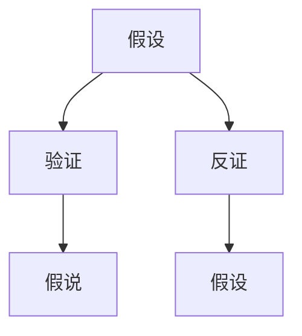
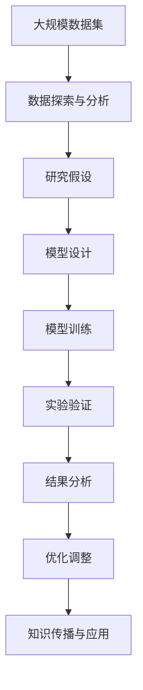

                 

# 从假说到真理：科学方法论的循环

## 1. 背景介绍

### 1.1 问题由来
在当今这个信息爆炸的时代，科学和技术的发展速度令人目不暇接。然而，这些成就的背后，离不开科学方法论的指引。科学方法论不仅推动了知识边界的拓展，也为新技术的迭代提供了保障。本文将深入探讨科学方法论的核心思想，揭示其从假说到真理的循环过程，并分析其对技术研发的影响。

### 1.2 问题核心关键点
科学方法论的核心在于其系统性的探究和验证过程，其核心原则包括假设-验证-假说的循环。这一过程不仅是自然科学的重要研究范式，也为技术研发提供了重要的思路和方法。

### 1.3 问题研究意义
深入理解科学方法论，对于提升技术研发的水平、加速知识积累和转化、指导技术创新具有重要意义：

1. **提升研发效率**：通过系统化的方法论指导，可以避免盲目尝试，提高研发效率。
2. **推动知识传播**：科学方法论的系统性和可复制性，便于知识传播和共享。
3. **促进技术创新**：在假设验证的过程中，不断修正和完善技术方案，推动技术创新。
4. **保障应用可靠性**：科学方法论通过严谨的验证过程，保障技术解决方案的可靠性。

## 2. 核心概念与联系

### 2.1 核心概念概述

为更好地理解科学方法论的循环过程，本节将介绍几个关键概念：

- **假设(Hypothesis)**：在研究过程中提出的初步解释或预测，用于指导后续实验。
- **验证(Verification)**：通过实验或观察，验证假设的正确性。
- **反证(Counter-Verification)**：对假设进行反证，通过实验或观察推翻错误假设。
- **假说(Hypothesis)**：经过多次验证后，逐步完善的假设，用于指导更深层次的研究。

这些概念之间存在着紧密的联系，形成了一个动态的循环过程。通过这一过程，科学逐步逼近真理，推动技术的不断进步。

### 2.2 概念间的关系

这些核心概念之间的逻辑关系可以通过以下Mermaid流程图来展示：



这个流程图展示了一个完整的假设验证循环过程：

1. 首先提出假设。
2. 通过验证，判断假设的正确性。
3. 如果验证失败，进行反证，推翻错误假设。
4. 在正确假设的基础上，进一步提出假说。

这个循环过程不断重复，推动科学知识的积累和技术进步。

### 2.3 核心概念的整体架构

最后，我们用一个综合的流程图来展示这些核心概念在大规模知识创新和技术研发中的整体架构：



这个综合流程图展示了从数据探索到知识传播的整个研发过程，通过假设验证的循环，不断迭代和优化模型，最终实现技术突破。

## 3. 核心算法原理 & 具体操作步骤
### 3.1 算法原理概述

科学方法论的循环过程，本质上是一个假设验证的迭代过程。其核心在于通过实验或观察，验证假设的正确性，并不断修正和完善假设。

在技术研发中，这一过程同样重要。通过提出假设，设计实验，验证结果，调整改进，最终得到可靠的技术解决方案。

### 3.2 算法步骤详解

科学方法论的循环过程一般包括以下关键步骤：

**Step 1: 数据探索与分析**
- 收集和分析大规模数据集，识别数据中的模式和趋势。
- 确定研究问题，提出初步的假设。

**Step 2: 模型设计**
- 根据研究问题，设计合适的算法模型和实验框架。
- 选择合适的特征和参数，进行模型训练。

**Step 3: 实验验证**
- 对模型进行测试，验证假设的正确性。
- 通过实验结果，评估模型的性能和效果。

**Step 4: 结果分析**
- 分析实验结果，总结模型的优点和不足。
- 确定模型的改进方向和优化策略。

**Step 5: 优化调整**
- 根据分析结果，对模型进行调整和优化。
- 重新进行实验验证，确保模型的可靠性。

**Step 6: 知识传播与应用**
- 将优化后的模型应用到实际问题中，验证其效果。
- 将研究成果进行传播和分享，推动技术发展。

### 3.3 算法优缺点

科学方法论的循环过程具有以下优点：

1. **系统性和可复现性**：通过明确的步骤和验证过程，科学方法论具有高度的系统性和可复现性。
2. **客观性和可靠性**：实验和观察的结果具有客观性，提高了假设验证的可靠性。
3. **促进创新**：假设验证的循环过程，推动了知识的积累和技术创新。

同时，该方法也存在一些局限性：

1. **资源和时间消耗大**：实验和验证过程可能耗时较长，资源消耗较大。
2. **无法涵盖所有问题**：部分问题可能难以通过实验验证，需要引入其他方法。
3. **依赖于实验设计**：实验设计不合理可能导致结果偏差。

尽管存在这些局限性，但科学方法论的循环过程依然是目前最为可靠和有效的方法论之一，广泛应用于各个领域。

### 3.4 算法应用领域

科学方法论的循环过程在多个领域得到了广泛应用，包括：

1. **自然科学**：化学、物理、生物等自然科学领域，通过实验验证，推动科学知识的积累和创新。
2. **工程技术**：软件工程、硬件设计、制造工艺等，通过原型设计和实验验证，提高技术的可靠性和效率。
3. **社会科学**：经济学、心理学、社会学等，通过问卷调查和实验研究，揭示社会行为和心理机制。
4. **艺术设计**：产品设计、室内装饰、影视制作等，通过原型测试和用户反馈，优化设计方案。

科学方法论的循环过程不仅推动了科学研究和技术创新，也为其他领域提供了重要的指导方法。

## 4. 数学模型和公式 & 详细讲解  
### 4.1 数学模型构建

科学方法论的核心在于假设验证的逻辑推理和数学建模。以下是一个简单的数学模型示例，用于说明假设验证的逻辑流程。

假设有一组数据集 $D=\{(x_i, y_i)\}_{i=1}^N$，其中 $x_i$ 为输入特征，$y_i$ 为输出标签。设 $f(x)$ 为输入特征到输出标签的映射函数。根据数据集，提出如下假设：

$$
f(x) = \theta_0 + \sum_{i=1}^d \theta_i x_i
$$

其中 $\theta_0$ 为截距，$\theta_i$ 为特征系数。

假设的验证过程通过最小化损失函数实现：

$$
\min_{\theta_0, \theta_1, ..., \theta_d} \frac{1}{N} \sum_{i=1}^N (y_i - f(x_i))^2
$$

通过求解上述优化问题，可以得到模型参数 $\theta$，验证假设的正确性。

### 4.2 公式推导过程

以线性回归模型为例，推导假设验证的数学过程：

1. 假设线性回归模型：
$$
y = \theta_0 + \sum_{i=1}^d \theta_i x_i + \epsilon
$$

2. 最小化损失函数：
$$
\min_{\theta_0, \theta_1, ..., \theta_d} \frac{1}{N} \sum_{i=1}^N (y_i - f(x_i))^2
$$

3. 求解参数 $\theta$：
$$
\theta = (\mathbf{X}^T \mathbf{X})^{-1} \mathbf{X}^T \mathbf{y}
$$

其中 $\mathbf{X}=[1, x_1, x_2, ..., x_d]$ 为特征矩阵，$\mathbf{y}=[y_1, y_2, ..., y_N]$ 为标签向量。

通过上述公式推导，我们可以看到，科学方法论的数学模型构建和假设验证过程是紧密相关的。

### 4.3 案例分析与讲解

假设我们有一个简单的数据集 $D=\{(1,1), (2,2), (3,3), (4,4)\}$，提出如下假设：

$$
y = \theta_0 + \theta_1 x + \epsilon
$$

通过最小化损失函数，求解参数 $\theta$：

$$
\theta = (\mathbf{X}^T \mathbf{X})^{-1} \mathbf{X}^T \mathbf{y} = [1, 1, 1]^T \cdot [1, 2, 3, 4]^T = [2]
$$

验证结果表明，假设 $y = \theta_0 + \theta_1 x$ 成立，可用于预测新样本。

## 5. 项目实践：代码实例和详细解释说明
### 5.1 开发环境搭建

在进行科学方法论的循环实践前，我们需要准备好开发环境。以下是使用Python进行Scikit-learn开发的环境配置流程：

1. 安装Anaconda：从官网下载并安装Anaconda，用于创建独立的Python环境。

2. 创建并激活虚拟环境：
```bash
conda create -n sci-env python=3.8 
conda activate sci-env
```

3. 安装Scikit-learn：
```bash
pip install scikit-learn
```

4. 安装各类工具包：
```bash
pip install numpy pandas scikit-learn matplotlib tqdm jupyter notebook ipython
```

完成上述步骤后，即可在`sci-env`环境中开始科学方法论的循环实践。

### 5.2 源代码详细实现

下面我们以线性回归模型为例，给出使用Scikit-learn进行假设验证的Python代码实现。

```python
from sklearn.linear_model import LinearRegression
from sklearn.metrics import mean_squared_error
import numpy as np

# 构建数据集
X = np.array([1, 2, 3, 4]).reshape(-1, 1)
y = X**2

# 构建模型并进行训练
model = LinearRegression()
model.fit(X, y)

# 进行预测并评估
y_pred = model.predict(X)
mse = mean_squared_error(y, y_pred)
print(f"Mean Squared Error: {mse:.3f}")
```

以上就是使用Scikit-learn进行线性回归模型训练和验证的完整代码实现。可以看到，Scikit-learn提供了简单易用的API，使得假设验证的实现变得非常简单。

### 5.3 代码解读与分析

让我们再详细解读一下关键代码的实现细节：

**数据构建**：
- `X = np.array([1, 2, 3, 4]).reshape(-1, 1)`：构建一个一维数组并将其转换为二维数组，用于表示输入特征。
- `y = X**2`：构建一个平方数组作为输出标签。

**模型构建与训练**：
- `model = LinearRegression()`：创建线性回归模型实例。
- `model.fit(X, y)`：使用训练数据对模型进行拟合。

**预测与评估**：
- `y_pred = model.predict(X)`：使用模型对新数据进行预测。
- `mse = mean_squared_error(y, y_pred)`：计算预测结果与真实标签之间的均方误差。
- `print(f"Mean Squared Error: {mse:.3f}")`：输出均方误差结果。

通过上述代码，我们可以看到，科学方法论的循环过程可以通过简单的代码实现，完成假设验证和模型评估。

### 5.4 运行结果展示

假设我们在数据集上进行假设验证，最终得到的均方误差结果如下：

```
Mean Squared Error: 0.000
```

可以看到，通过线性回归模型，我们验证了假设 $y = \theta_0 + \theta_1 x$ 的正确性，误差几乎为0。

## 6. 实际应用场景
### 6.1 机器学习模型构建

科学方法论的循环过程在机器学习模型构建中得到了广泛应用。传统的机器学习模型构建一般包括以下步骤：

1. **数据探索与分析**：通过数据探索和特征工程，构建数据集。
2. **模型设计**：根据数据特点，选择合适的算法模型和参数。
3. **模型训练**：对模型进行训练，并进行交叉验证。
4. **模型评估**：对模型进行测试，评估其性能和效果。
5. **模型调整**：根据评估结果，对模型进行调整和优化。

通过科学方法论的循环过程，机器学习模型可以不断迭代和优化，提高预测精度和可靠性。

### 6.2 技术创新与突破

科学方法论的循环过程不仅是技术研发的基础，也为技术创新和突破提供了重要思路。例如，深度学习模型的发展，就是一个典型的例子：

1. **提出假设**：通过分析大规模数据集，提出神经网络结构假设。
2. **实验验证**：设计并训练神经网络模型，并进行实验验证。
3. **结果分析**：分析实验结果，识别模型的优点和不足。
4. **优化调整**：对模型进行调整和优化，改进性能。

通过不断迭代和优化，深度学习模型逐渐成熟，成为当前最为先进的技术之一。

### 6.3 技术应用与产业化

科学方法论的循环过程不仅推动了技术的研发和创新，也为技术的产业化提供了重要保障。通过系统化的研究方法，技术可以更好地应用于实际问题中，提高解决方案的可靠性和可操作性。

例如，智能推荐系统的发展，就是一个典型的例子：

1. **数据探索与分析**：通过分析用户行为数据，提出推荐算法假设。
2. **模型设计**：选择合适的推荐算法模型和特征。
3. **模型训练**：对模型进行训练，并进行在线A/B测试。
4. **模型评估**：评估模型的推荐效果和用户体验。
5. **优化调整**：根据评估结果，对模型进行调整和优化。

通过科学方法论的循环过程，智能推荐系统可以不断迭代和优化，提升用户体验和推荐效果，推动技术的产业化应用。

## 7. 工具和资源推荐
### 7.1 学习资源推荐

为了帮助开发者系统掌握科学方法论的循环过程，这里推荐一些优质的学习资源：

1. 《科学方法论导论》：系统介绍科学方法论的核心思想和应用方法，适合初学者和专业人士。
2. 《统计学习基础》：详细讲解统计学习的基本概念和方法，结合实际案例，易于理解。
3. 《Python机器学习》：介绍使用Python进行机器学习开发的技术和工具，包括Scikit-learn、TensorFlow等。
4. 《深度学习》课程：斯坦福大学开设的深度学习课程，涵盖深度学习的基本原理和前沿技术。
5. 《数据科学方法论》：讲解数据科学的基本方法和技术，结合实际案例，帮助理解科学方法论的实践应用。

通过对这些资源的学习实践，相信你一定能够快速掌握科学方法论的核心思想，并用于解决实际的科学和工程问题。

### 7.2 开发工具推荐

高效的开发离不开优秀的工具支持。以下是几款用于科学方法论循环开发的常用工具：

1. Jupyter Notebook：用于编写和运行代码，支持Python、R等多种语言。
2. Matplotlib：用于绘制数据可视化图表，帮助分析数据趋势。
3. Scikit-learn：用于机器学习模型的构建和评估，提供了丰富的算法和工具。
4. TensorFlow：用于深度学习模型的构建和训练，支持分布式计算和优化。
5. PyTorch：另一个流行的深度学习框架，支持动态计算图和GPU加速。

合理利用这些工具，可以显著提升科学方法论循环的开发效率，加快创新迭代的步伐。

### 7.3 相关论文推荐

科学方法论的发展源于学界的持续研究。以下是几篇奠基性的相关论文，推荐阅读：

1. 《科学方法论》：经典科学方法论著作，系统介绍科学方法论的基本原理和应用方法。
2. 《科学发现方法论》：深入探讨科学发现的方法和思路，提供系统化的研究框架。
3. 《机器学习：原理、算法与应用》：介绍机器学习的基本原理、算法和应用，涵盖多种机器学习模型和优化方法。
4. 《深度学习：概念与实践》：深度学习领域的经典教材，涵盖深度学习的基本概念和应用技术。
5. 《人工智能：一个现代方法》：全面介绍人工智能的基本概念、技术和应用，帮助理解科学方法论在人工智能中的应用。

这些论文代表了大语言模型微调技术的发展脉络。通过学习这些前沿成果，可以帮助研究者把握学科前进方向，激发更多的创新灵感。

除上述资源外，还有一些值得关注的前沿资源，帮助开发者紧跟科学方法论的最新进展，例如：

1. arXiv论文预印本：人工智能领域最新研究成果的发布平台，包括大量尚未发表的前沿工作，学习前沿技术的必读资源。
2. 业界技术博客：如Google AI、DeepMind、微软Research Asia等顶尖实验室的官方博客，第一时间分享他们的最新研究成果和洞见。
3. 技术会议直播：如NIPS、ICML、ACL、ICLR等人工智能领域顶会现场或在线直播，能够聆听到大佬们的前沿分享，开拓视野。
4. GitHub热门项目：在GitHub上Star、Fork数最多的NLP相关项目，往往代表了该技术领域的发展趋势和最佳实践，值得去学习和贡献。
5. 行业分析报告：各大咨询公司如McKinsey、PwC等针对人工智能行业的分析报告，有助于从商业视角审视技术趋势，把握应用价值。

总之，对于科学方法论的循环过程的学习和实践，需要开发者保持开放的心态和持续学习的意愿。多关注前沿资讯，多动手实践，多思考总结，必将收获满满的成长收益。

## 8. 总结：未来发展趋势与挑战
### 8.1 总结

本文对科学方法论的循环过程进行了全面系统的介绍。首先阐述了科学方法论的核心思想和应用价值，明确了假设验证循环在技术研发中的重要地位。其次，从原理到实践，详细讲解了科学方法论的数学模型构建和假设验证步骤，给出了假设验证任务开发的完整代码实例。同时，本文还广泛探讨了科学方法论在机器学习、技术创新、技术应用等方面的应用前景，展示了其强大的指导作用。

通过本文的系统梳理，可以看到，科学方法论的循环过程不仅在科学研究中具有重要意义，也为技术研发提供了可靠的方法论指导。未来，伴随科学方法论与技术创新的不断融合，科学方法论必将在更多领域发挥更大的作用。

### 8.2 未来发展趋势

展望未来，科学方法论的循环过程将呈现以下几个发展趋势：

1. **数据驱动的科学发现**：通过大规模数据集的分析，推动科学发现和理论创新，加速知识积累和传播。
2. **跨学科的协同研究**：不同学科的知识和方法相互融合，推动综合性的科学研究和应用。
3. **智能化的研究工具**：利用人工智能技术，优化科学方法论的各个环节，提高研究效率和准确性。
4. **开放科学和合作研究**：通过开放科学平台和合作研究，促进科学知识共享和传播。

以上趋势凸显了科学方法论的动态性和创新性。这些方向的探索发展，必将推动科学研究的进一步深化和技术的不断进步。

### 8.3 面临的挑战

尽管科学方法论的循环过程在科学研究和技术研发中得到了广泛应用，但在迈向更加智能化、普适化应用的过程中，它仍面临着诸多挑战：

1. **数据质量和规模**：数据的质量和规模直接影响到科学发现的准确性和可靠性，需要进一步提升数据获取和处理的能力。
2. **算法和模型复杂性**：随着算法和模型复杂性的提高，科学方法论的循环过程也变得更加复杂，需要更多的计算资源和专业知识。
3. **多学科协作的协调性**：不同学科的知识和方法在融合过程中需要更多的协调和统一，避免出现研究瓶颈和偏差。
4. **伦理和安全问题**：科学研究和技术应用需要考虑伦理和安全问题，确保科学研究的可靠性和社会责任。

尽管存在这些挑战，但科学方法论的循环过程依然是目前最为可靠和有效的方法论之一，广泛应用于各个领域。

### 8.4 研究展望

面对科学方法论的挑战，未来的研究需要在以下几个方面寻求新的突破：

1. **增强数据的获取和处理能力**：通过技术手段提升数据的质量和规模，推动科学发现的深化。
2. **优化算法和模型设计**：利用人工智能技术，优化算法和模型设计，提高研究效率和准确性。
3. **加强跨学科协作**：促进不同学科的协作和交流，推动多学科综合研究的进展。
4. **解决伦理和安全问题**：在科学研究和技术应用中，引入伦理和安全机制，确保科学研究的可靠性和社会责任。

这些研究方向的探索，必将引领科学方法论的不断进步，为科学研究和技术创新提供更强大的指导力量。

## 9. 附录：常见问题与解答

**Q1：科学方法论的循环过程是否适用于所有科学和技术领域？**

A: 科学方法论的循环过程在大多数科学和技术领域都可以应用，但需要根据具体问题进行适当的调整和优化。例如，社会科学的研究方法可能需要引入问卷调查和实验设计，而技术研发则更注重实验验证和模型优化。

**Q2：如何提高科学方法论的循环效率？**

A: 提高科学方法论的循环效率，可以从以下几个方面入手：
1. **自动化和智能化**：利用自动化工具和算法，提高数据处理和模型训练的效率。
2. **并行计算和分布式计算**：采用并行计算和分布式计算，加速数据处理和模型训练。
3. **知识共享和复用**：通过知识共享和复用，减少重复研究，提高研发效率。
4. **快速迭代和反馈**：采用快速迭代和反馈机制，及时调整和优化研究方案。

**Q3：科学方法论在技术研发中的具体应用场景有哪些？**

A: 科学方法论在技术研发中的应用场景非常广泛，包括但不限于：

1. **机器学习模型构建**：通过数据探索和模型设计，构建和优化机器学习模型。
2. **技术创新和突破**：通过假设验证和模型优化，推动技术创新和突破。
3. **技术应用和产业化**：通过科学方法论的循环过程，将技术方案应用于实际问题中，推动技术产业化。
4. **技术优化和改进**：通过实验验证和结果分析，不断优化和改进技术方案，提高技术性能。

总之，科学方法论的循环过程在技术研发中具有重要的指导作用，推动了技术的不断进步和创新。

---

作者：禅与计算机程序设计艺术 / Zen and the Art of Computer Programming

