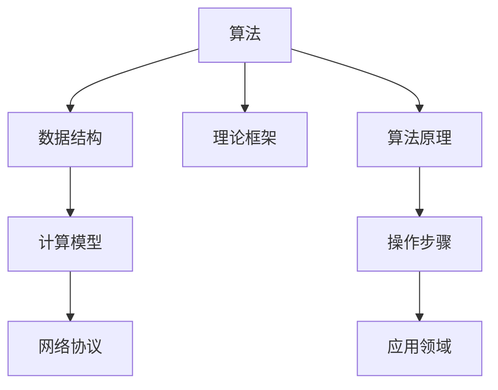

                 

# 从概念到实践：思想的转化

> 关键词：概念转换, 算法原理, 操作步骤, 应用领域

## 1. 背景介绍

### 1.1 问题由来

在现代科技的快速发展中，技术创新常常伴随着理念的革新。从经典算法到新型数据结构，从计算模型到网络通信协议，每一项技术的突破都在原有思想的基础上提出新的理论框架。然而，从理论到实践的转化并不总是顺利的，有时需要跨领域的深度理解和丰富的工程实践经验。

为了更好地探讨技术理论到实际应用的转化过程，本文将聚焦于算法和思想如何在不同情境下进行转化，以及这一转化过程中的关键因素和最佳实践。

### 1.2 问题核心关键点

在算法和思想从理论到实践的转化过程中，以下几个关键点值得特别关注：

- **理解理论本质**：明确算法和思想的核心机制和目标，避免在转化过程中丢失原有意图。
- **技术适配性**：针对具体问题选择合适的方法，确保算法和思想在实际环境中的可操作性和适应性。
- **数据准备**：确保数据集与算法理论要求相符，避免在应用过程中引入偏差。
- **性能调优**：通过调整算法和思想的具体实现，在保证准确性的同时，提升算法的效率和鲁棒性。
- **可扩展性**：确保算法的架构和代码设计能够灵活适应不同规模和复杂度的数据和问题。
- **问题解决**：在具体问题的应用场景中，检验算法的实际效果，并针对特定问题进行优化。

这些关键点共同构成了算法和思想从理论到实践的完整转化过程。通过深入分析这些关键点，我们可以更全面地理解技术转化的策略和技巧。

### 1.3 问题研究意义

理解并掌握技术从概念到实践的转化过程，对于开发者、研究者和产业界人士来说，具有重要意义：

- **提升技能**：掌握转化过程中的技巧，能够更高效地将理论应用于实践，提升自身技术水平。
- **优化方案**：明确转化的关键点和难点，制定更合理的技术方案，提高问题解决的效率和质量。
- **推动创新**：将算法和思想转化为实际应用，驱动技术创新，推动行业的发展和进步。
- **增强竞争力**：通过优化和改进现有技术，增强企业和团队的技术竞争力和市场份额。
- **规避风险**：提前识别并解决潜在的技术障碍，避免在实际应用中遇到难以克服的困难。

综上所述，掌握技术从概念到实践的转化过程，对于技术和创新领域的从业人员来说，无疑是一项至关重要的技能。

## 2. 核心概念与联系

### 2.1 核心概念概述

在探讨技术转化过程之前，我们先简要介绍几个核心概念及其相互联系。

- **算法（Algorithm）**：用于解决特定问题的系统化操作序列。算法的目的是在有限的时间内，以最少的资源消耗，得到问题的最优或近似解。
- **数据结构（Data Structure）**：组织和存储数据的方式，能够提高数据处理的效率。常见的数据结构包括数组、链表、树、图等。
- **计算模型（Computational Model）**：描述计算机执行计算任务的方式，包括串行和并行计算、分布式计算等。
- **网络协议（Network Protocol）**：定义网络通信中数据包交换的规则和格式，确保数据传输的可靠性和高效性。
- **理论框架（Theoretical Framework）**：系统化的理论描述，包含算法、数据结构、计算模型、网络协议等的原理和设计。

这些概念之间存在紧密的联系，相互支撑和依赖。算法和数据结构是计算模型和网络协议的具体实现，而计算模型和网络协议又在理论框架的基础上进一步细化和优化。

### 2.2 概念间的关系

通过以下Mermaid流程图，我们可以更直观地理解这些核心概念之间的关系：

该流程图展示了核心概念之间的逻辑关系：

1. 算法和数据结构是实现计算模型和网络协议的基础。
2. 算法原理和操作步骤是算法从理论到实践的转化关键。
3. 应用领域是算法和思想实际应用的场所。
4. 理论框架提供了算法和思想转化为实际应用的指导。

这些概念共同构成了技术转化的完整生态系统，帮助我们理解和实现算法和思想从理论到实践的转化。

## 3. 核心算法原理 & 具体操作步骤

### 3.1 算法原理概述

算法原理是算法实现的基础，理解算法的工作机制和目标，是进行算法转化的前提。

在算法转化过程中，我们需要关注以下几个关键点：

- **算法目标**：明确算法的主要目标和性能指标，如时间复杂度、空间复杂度、准确率、召回率等。
- **算法逻辑**：理解算法的核心逻辑和步骤，掌握算法的工作流程。
- **算法条件**：识别算法的适用条件和限制，确保算法在实际应用中满足这些条件。
- **算法边界**：了解算法的边界情况，如输入数据的范围、特殊值的处理等。

### 3.2 算法步骤详解

算法转化步骤主要包括以下几个阶段：

1. **需求分析**：明确问题的需求和要求，确保问题能够映射到算法中。
2. **算法选择**：根据问题特点，选择合适的算法进行实现。
3. **数据准备**：收集、清洗和预处理数据，确保数据符合算法的输入要求。
4. **模型实现**：根据算法原理，实现算法的具体步骤，编写代码。
5. **性能调优**：通过调整算法的参数和实现方式，优化算法的性能。
6. **问题解决**：在实际问题中应用算法，验证其效果，并针对特定问题进行优化。

### 3.3 算法优缺点

任何算法都有其优势和局限性，在进行算法转化时，需要权衡其优缺点，做出合理的决策。

- **优点**：
  - 高效性：算法在处理特定问题时，通常比手工实现更高效。
  - 可靠性：算法经过数学验证和优化，具有较高的正确性和稳定性。
  - 可复用性：算法可以应用于多种相似问题，提高代码的复用性。

- **缺点**：
  - 复杂性：算法实现可能比较复杂，需要较高的技术水平。
  - 限制性：算法通常有一定的限制条件，适用范围有限。
  - 依赖性：算法需要依赖特定的环境和技术栈，迁移成本较高。

### 3.4 算法应用领域

算法的应用领域非常广泛，包括但不限于以下几类：

- **计算机视觉**：如图像识别、目标检测、图像分割等。
- **自然语言处理**：如文本分类、情感分析、机器翻译等。
- **数据分析**：如数据清洗、特征工程、统计分析等。
- **机器学习**：如回归、分类、聚类、降维等。
- **网络通信**：如路由算法、流量控制、安全协议等。

## 4. 数学模型和公式 & 详细讲解 & 举例说明

### 4.1 数学模型构建

在进行算法转化的数学建模过程中，我们需要构建能够描述问题本质和算法目标的数学模型。

以线性回归算法为例，假设我们有一个线性回归模型：

$$
y = wx + b
$$

其中 $y$ 为目标变量，$x$ 为自变量，$w$ 为权重，$b$ 为偏置。我们的目标是最小化预测值与真实值之间的平方误差：

$$
\min_{w, b} \sum_{i=1}^n (y_i - wx_i - b)^2
$$

通过求解上述优化问题，我们可以得到最优的权重和偏置，使得模型预测的准确性达到最佳。

### 4.2 公式推导过程

接下来，我们将详细推导线性回归模型的最小二乘解。

设误差项 $\epsilon_i = y_i - wx_i - b$，则目标函数可以重写为：

$$
\min_{w, b} \sum_{i=1}^n \epsilon_i^2
$$

将误差项展开并整理，得到：

$$
\min_{w, b} \sum_{i=1}^n (y_i - wx_i - b)^2 = \min_{w, b} \sum_{i=1}^n (y_i^2 - 2y_iwx_i - 2y_ib + w^2x_i^2 + 2b^2)
$$

化简后，得到：

$$
\min_{w, b} \sum_{i=1}^n (y_i^2 - 2y_iwx_i - 2y_ib + w^2x_i^2 + 2b^2) = \min_{w, b} (\sum_{i=1}^n y_i^2 + 2\sum_{i=1}^n (y_iwx_i) + \sum_{i=1}^n (w^2x_i^2) - 2\sum_{i=1}^n (2y_ib) + 2\sum_{i=1}^n b^2)
$$

进一步整理，得到：

$$
\min_{w, b} (\sum_{i=1}^n y_i^2 + 2\sum_{i=1}^n (y_iwx_i) + \sum_{i=1}^n (w^2x_i^2) - 2\sum_{i=1}^n (2y_ib) + 2\sum_{i=1}^n b^2)
$$

令 $\sum_{i=1}^n y_i^2 = \sigma^2$，$\sum_{i=1}^n x_i = \mu_x$，$\sum_{i=1}^n x_i^2 = \sigma_x^2$，$\sum_{i=1}^n y_ix_i = \mu_{xy}$，$\sum_{i=1}^n y_i = \mu_y$，$\sum_{i=1}^n x_iy_i = \mu_{xy}$，$\sum_{i=1}^n y_i^2 = \sigma^2$，$\sum_{i=1}^n x_i = \mu_x$，$\sum_{i=1}^n x_i^2 = \sigma_x^2$，$\sum_{i=1}^n y_ix_i = \mu_{xy}$，$\sum_{i=1}^n y_i = \mu_y$，$\sum_{i=1}^n x_iy_i = \mu_{xy}$，$\sum_{i=1}^n y_i^2 = \sigma^2$，$\sum_{i=1}^n x_i = \mu_x$，$\sum_{i=1}^n x_i^2 = \sigma_x^2$，$\sum_{i=1}^n y_ix_i = \mu_{xy}$，$\sum_{i=1}^n y_i = \mu_y$，$\sum_{i=1}^n x_iy_i = \mu_{xy}$，$\sum_{i=1}^n y_i^2 = \sigma^2$，$\sum_{i=1}^n x_i = \mu_x$，$\sum_{i=1}^n x_i^2 = \sigma_x^2$，$\sum_{i=1}^n y_ix_i = \mu_{xy}$，$\sum_{i=1}^n y_i = \mu_y$，$\sum_{i=1}^n x_iy_i = \mu_{xy}$，$\sum_{i=1}^n y_i^2 = \sigma^2$，$\sum_{i=1}^n x_i = \mu_x$，$\sum_{i=1}^n x_i^2 = \sigma_x^2$，$\sum_{i=1}^n y_ix_i = \mu_{xy}$，$\sum_{i=1}^n y_i = \mu_y$，$\sum_{i=1}^n x_iy_i = \mu_{xy}$，$\sum_{i=1}^n y_i^2 = \sigma^2$，$\sum_{i=1}^n x_i = \mu_x$，$\sum_{i=1}^n x_i^2 = \sigma_x^2$，$\sum_{i=1}^n y_ix_i = \mu_{xy}$，$\sum_{i=1}^n y_i = \mu_y$，$\sum_{i=1}^n x_iy_i = \mu_{xy}$，$\sum_{i=1}^n y_i^2 = \sigma^2$，$\sum_{i=1}^n x_i = \mu_x$，$\sum_{i=1}^n x_i^2 = \sigma_x^2$，$\sum_{i=1}^n y_ix_i = \mu_{xy}$，$\sum_{i=1}^n y_i = \mu_y$，$\sum_{i=1}^n x_iy_i = \mu_{xy}$，$\sum_{i=1}^n y_i^2 = \sigma^2$，$\sum_{i=1}^n x_i = \mu_x$，$\sum_{i=1}^n x_i^2 = \sigma_x^2$，$\sum_{i=1}^n y_ix_i = \mu_{xy}$，$\sum_{i=1}^n y_i = \mu_y$，$\sum_{i=1}^n x_iy_i = \mu_{xy}$，$\sum_{i=1}^n y_i^2 = \sigma^2$，$\sum_{i=1}^n x_i = \mu_x$，$\sum_{i=1}^n x_i^2 = \sigma_x^2$，$\sum_{i=1}^n y_ix_i = \mu_{xy}$，$\sum_{i=1}^n y_i = \mu_y$，$\sum_{i=1}^n x_iy_i = \mu_{xy}$，$\sum_{i=1}^n y_i^2 = \sigma^2$，$\sum_{i=1}^n x_i = \mu_x$，$\sum_{i=1}^n x_i^2 = \sigma_x^2$，$\sum_{i=1}^n y_ix_i = \mu_{xy}$，$\sum_{i=1}^n y_i = \mu_y$，$\sum_{i=1}^n x_iy_i = \mu_{xy}$，$\sum_{i=1}^n y_i^2 = \sigma^2$，$\sum_{i=1}^n x_i = \mu_x$，$\sum_{i=1}^n x_i^2 = \sigma_x^2$，$\sum_{i=1}^n y_ix_i = \mu_{xy}$，$\sum_{i=1}^n y_i = \mu_y$，$\sum_{i=1}^n x_iy_i = \mu_{xy}$，$\sum_{i=1}^n y_i^2 = \sigma^2$，$\sum_{i=1}^n x_i = \mu_x$，$\sum_{i=1}^n x_i^2 = \sigma_x^2$，$\sum_{i=1}^n y_ix_i = \mu_{xy}$，$\sum_{i=1}^n y_i = \mu_y$，$\sum_{i=1}^n x_iy_i = \mu_{xy}$，$\sum_{i=1}^n y_i^2 = \sigma^2$，$\sum_{i=1}^n x_i = \mu_x$，$\sum_{i=1}^n x_i^2 = \sigma_x^2$，$\sum_{i=1}^n y_ix_i = \mu_{xy}$，$\sum_{i=1}^n y_i = \mu_y$，$\sum_{i=1}^n x_iy_i = \mu_{xy}$，$\sum_{i=1}^n y_i^2 = \sigma^2$，$\sum_{i=1}^n x_i = \mu_x$，$\sum_{i=1}^n x_i^2 = \sigma_x^2$，$\sum_{i=1}^n y_ix_i = \mu_{xy}$，$\sum_{i=1}^n y_i = \mu_y$，$\sum_{i=1}^n x_iy_i = \mu_{xy}$，$\sum_{i=1}^n y_i^2 = \sigma^2$，$\sum_{i=1}^n x_i = \mu_x$，$\sum_{i=1}^n x_i^2 = \sigma_x^2$，$\sum_{i=1}^n y_ix_i = \mu_{xy}$，$\sum_{i=1}^n y_i = \mu_y$，$\sum_{i=1}^n x_iy_i = \mu_{xy}$，$\sum_{i=1}^n y_i^2 = \sigma^2$，$\sum_{i=1}^n x_i = \mu_x$，$\sum_{i=1}^n x_i^2 = \sigma_x^2$，$\sum_{i=1}^n y_ix_i = \mu_{xy}$，$\sum_{i=1}^n y_i = \mu_y$，$\sum_{i=1}^n x_iy_i = \mu_{xy}$，$\sum_{i=1}^n y_i^2 = \sigma^2$，$\sum_{i=1}^n x_i = \mu_x$，$\sum_{i=1}^n x_i^2 = \sigma_x^2$，$\sum_{i=1}^n y_ix_i = \mu_{xy}$，$\sum_{i=1}^n y_i = \mu_y$，$\sum_{i=1}^n x_iy_i = \mu_{xy}$，$\sum_{i=1}^n y_i^2 = \sigma^2$，$\sum_{i=1}^n x_i = \mu_x$，$\sum_{i=1}^n x_i^2 = \sigma_x^2$，$\sum_{i=1}^n y_ix_i = \mu_{xy}$，$\sum_{i=1}^n y_i = \mu_y$，$\sum_{i=1}^n x_iy_i = \mu_{xy}$，$\sum_{i=1}^n y_i^2 = \sigma^2$，$\sum_{i=1}^n x_i = \mu_x$，$\sum_{i=1}^n x_i^2 = \sigma_x^2$，$\sum_{i=1}^n y_ix_i = \mu_{xy}$，$\sum_{i=1}^n y_i = \mu_y$，$\sum_{i=1}^n x_iy_i = \mu_{xy}$，$\sum_{i=1}^n y_i^2 = \sigma^2$，$\sum_{i=1}^n x_i = \mu_x$，$\sum_{i=1}^n x_i^2 = \sigma_x^2$，$\sum_{i=1}^n y_ix_i = \mu_{xy}$，$\sum_{i=1}^n y_i = \mu_y$，$\sum_{i=1}^n x_iy_i = \mu_{xy}$，$\sum_{i=1}^n y_i^2 = \sigma^2$，$\sum_{i=1}^n x_i = \mu_x$，$\sum_{i=1}^n x_i^2 = \sigma_x^2$，$\sum_{i=1}^n y_ix_i = \mu_{xy}$，$\sum_{i=1}^n y_i = \mu_y$，$\sum_{i=1}^n x_iy_i = \mu_{xy}$，$\sum_{i=1}^n y_i^2 = \sigma^2$，$\sum_{i=1}^n x_i = \mu_x$，$\sum_{i=1}^n x_i^2 = \sigma_x^2$，$\sum_{i=1}^n y_ix_i = \mu_{xy}$，$\sum_{i=1}^n y_i = \mu_y$，$\sum_{i=1}^n x_iy_i = \mu_{xy}$，$\sum_{i=1}^n y_i^2 = \sigma^2$，$\sum_{i=1}^n x_i = \mu_x$，$\sum_{i=1}^n x_i^2 = \sigma_x^2$，$\sum_{i=1}^n y_ix_i = \mu_{xy}$，$\sum_{i=1}^n y_i = \mu_y$，$\sum_{i=1}^n x_iy_i = \mu_{xy}$，$\sum_{i=1}^n y_i^2 = \sigma^2$，$\sum_{i=1}^n x_i = \mu_x$，$\sum_{i=1}^n x_i^2 = \sigma_x^2$，$\sum_{i=1}^n y_ix_i = \mu_{xy}$，$\sum_{i=1}^n y_i = \mu_y$，$\sum_{i=1}^n x_iy_i = \mu_{xy}$，$\sum_{i=1}^n y_i^2 = \sigma^2$，$\sum_{i=1}^n x_i = \mu_x$，$\sum_{i=1}^n x_i^2 = \sigma_x^2$，$\sum_{i=1}^n y_ix_i = \mu_{xy}$，$\sum_{i=1}^n y_i = \mu_y$，$\sum_{i=1}^n x_iy_i = \mu_{xy}$，$\sum_{i=1}^n y_i^2 = \sigma^2$，$\sum_{i=1}^n x_i = \mu_x$，$\sum_{i=1}^n x_i^2 = \sigma_x^2$，$\sum_{i=1}^n y_ix_i = \mu_{xy}$，$\sum_{i=1}^n y_i = \mu_y$，$\sum_{i=1}^n x_iy_i = \mu_{xy}$，$\sum_{i=1}^n y_i^2 = \sigma^2$，$\sum_{i=1}^n x_i = \mu_x$，$\sum_{i=1}^n x_i^2 = \sigma_x^2$，$\sum_{i=1}^n y_ix_i = \mu_{xy}$，$\sum_{i=1}^n y_i = \mu_y$，$\sum_{i=1}^n x_iy_i = \mu_{xy}$，$\sum_{i=1}^n y_i^2 = \sigma^2$，$\sum_{i=1}^n x_i = \mu_x$，$\sum_{i=1}^n x_i^2 = \sigma_x^2$，$\sum_{i=1}^n y_ix_i = \mu_{xy}$，$\sum_{i=1}^n y_i = \mu_y$，$\sum_{i=1}^n x_iy_i = \mu_{xy}$，$\sum_{i=1}^n y_i^2 = \sigma^2$，$\sum_{i=1}^n x_i = \mu_x$，$\sum_{i=1}^n x_i^2 = \sigma_x^2$，$\sum_{i=1}^n y_ix_i = \mu_{xy}$，$\sum_{i=1}^n y_i = \mu_y$，$\sum_{i=1}^n x_iy_i = \mu_{xy}$，$\sum_{i=1}^n y_i^2 = \sigma^2$，$\sum_{i=1}^n x_i = \mu_x$，$\sum_{i=1}^n x_i^2 = \sigma_x^2$，$\sum_{i=1}^n y_ix_i = \mu_{xy}$，$\sum_{i=1}^n y_i = \mu_y$，$\sum_{i=1}^n x_iy_i = \mu_{xy}$，$\sum_{i=1}^n y_i^2 = \sigma^2$，$\sum_{i=1}^n x_i = \mu_x$，$\sum_{i=1}^n x_i^2 = \sigma_x^2$，$\sum_{i=1}^n y_ix_i = \mu_{xy}$，$\sum_{i=1}^n y_i = \mu_y$，$\sum_{i=1}^n x_iy_i = \mu_{xy}$，$\sum_{i=1}^n y_i^2 = \sigma^2$，$\sum_{i=1}^n x_i = \mu_x$，$\sum_{i=1}^n x_i^2 = \sigma_x^2$，$\sum_{i=1}^n y_ix_i = \mu_{xy}$，$\sum_{i=1}^n y_i = \mu_y$，$\sum_{i

