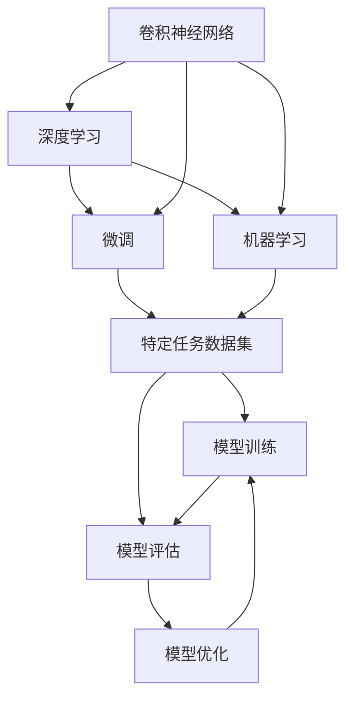
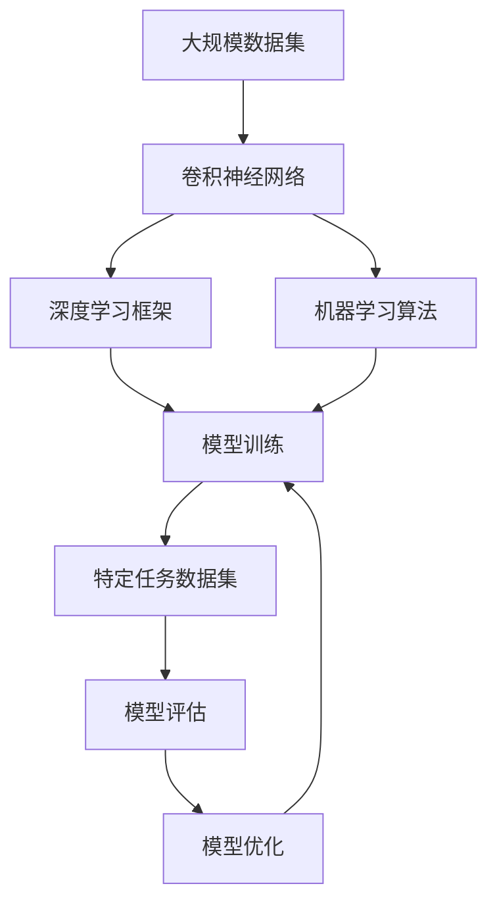

                 

# 从零开始大模型开发与微调：MNIST数据集的准备

> 关键词：大模型开发, 微调, MNIST数据集, 机器学习, 深度学习, 卷积神经网络, PyTorch

## 1. 背景介绍

### 1.1 问题由来
在深度学习和人工智能领域，大模型因其在处理大规模数据和复杂任务上的卓越能力而备受关注。大模型通常指的是参数量极大、容量较大的神经网络模型，它们通过在海量数据上进行训练，能够学习到复杂的特征和模式，适用于各种自然语言处理(NLP)、计算机视觉(CV)、语音识别(SR)等任务。

在实际应用中，为了使大模型更好地适应特定任务，研究人员通常会对其进行微调，即在大模型的基础上，利用特定任务的数据集进行进一步的训练，优化模型参数，提升模型在该任务上的性能。微调是构建高质量AI模型的重要步骤，尤其是当训练数据量有限或模型在特定任务上表现不佳时，微调可以显著提升模型效果。

为了使读者能够更深入地理解大模型的开发和微调过程，本文将聚焦于使用MNIST数据集作为案例，逐步介绍从零开始构建和微调一个基本的大模型。MNIST数据集是一个常用的手写数字识别数据集，包含60000张训练图像和10000张测试图像，每张图像大小为28x28像素。

### 1.2 问题核心关键点
本文的核心问题在于如何利用MNIST数据集来构建和微调一个大模型。具体而言，我们需要：
1. 准备和预处理数据集。
2. 构建卷积神经网络(CNN)模型结构。
3. 使用预训练模型或从头开始训练模型。
4. 进行微调，提高模型在MNIST数据集上的性能。
5. 分析微调过程中存在的优缺点和应用领域。

### 1.3 问题研究意义
通过构建和微调一个大模型，理解其工作原理和优化策略，可以更好地应用于各种实际场景。例如，在计算机视觉领域，大模型可以帮助识别复杂的物体、场景，甚至进行图像分类、目标检测等任务；在自然语言处理领域，大模型可以用于文本分类、情感分析、机器翻译等任务。此外，大模型的开发和微调也是研究深度学习、人工智能等领域的重要课题，有助于推动这些技术的发展和应用。

## 2. 核心概念与联系

### 2.1 核心概念概述

为了更好地理解大模型开发和微调的过程，本文将介绍几个核心概念：

- **卷积神经网络（CNN）**：一种专门用于处理图像和信号数据的神经网络，通过卷积、池化等操作提取特征，适用于图像分类、目标检测等任务。

- **深度学习（Deep Learning）**：一种基于多层神经网络的机器学习技术，通过逐层学习特征，实现对复杂数据的建模和预测。

- **微调（Fine-tuning）**：在大模型的基础上，利用特定任务的数据集进一步训练模型，优化模型参数，提高模型在该任务上的性能。

- **机器学习（Machine Learning）**：一种数据驱动的学习方法，通过训练数据集，使模型能够对新数据进行预测或分类。

- **深度学习框架（Deep Learning Framework）**：如TensorFlow、PyTorch等，提供了高效的深度学习模型构建、训练和部署工具，简化了深度学习模型的开发过程。

这些核心概念通过以下Mermaid流程图展示了它们之间的关系：



这个流程图展示了从卷积神经网络到深度学习、机器学习，再到微调的基本流程。其中，特定任务数据集是微调的基础，模型训练和评估是微调的主要步骤，而模型优化则是微调的关键环节。

### 2.2 概念间的关系

这些核心概念之间存在着紧密的联系，形成了大模型开发和微调的整体框架。具体来说：

- **卷积神经网络**：作为深度学习中处理图像数据的重要工具，卷积神经网络通过逐层卷积和池化操作，提取图像中的特征，适用于图像分类、目标检测等任务。

- **深度学习**：在大模型开发中，深度学习框架提供了构建和训练神经网络模型的工具，如TensorFlow、PyTorch等。

- **机器学习**：在大模型微调中，机器学习算法用于对特定任务进行训练和优化，提高模型的性能。

- **微调**：微调是通过对预训练模型的进一步训练，使其适应特定任务的过程。在大模型开发中，微调是模型优化的一个重要步骤。

这些概念共同构成了大模型开发和微调的核心框架，为大模型在各种任务中的应用提供了理论基础。

### 2.3 核心概念的整体架构

最后，我们使用一个综合的流程图来展示这些核心概念在大模型开发和微调过程中的整体架构：



这个综合流程图展示了从数据集到卷积神经网络、深度学习框架、机器学习算法，再到模型训练和优化的完整过程。

## 3. 核心算法原理 & 具体操作步骤
### 3.1 算法原理概述

在大模型开发和微调过程中，卷积神经网络（CNN）是最常用的模型结构。CNN通过卷积和池化操作，从输入图像中提取特征，适用于图像分类等任务。在大模型微调过程中，我们通常使用预训练的CNN模型作为初始化参数，然后利用特定任务的数据集进行微调，优化模型参数，提高模型在该任务上的性能。

微调的原理是基于梯度下降的优化算法。具体来说，我们定义损失函数 $L$ 用于衡量模型在特定任务上的性能，然后通过反向传播算法计算梯度，更新模型参数，使得损失函数最小化。梯度下降算法迭代更新模型参数，直到模型收敛。

微调的目标是在保持预训练模型参数不变的情况下，通过特定任务的标注数据集 $D$ 对模型进行训练，优化模型参数 $\theta$，使得模型在任务 $T$ 上的性能最佳。

### 3.2 算法步骤详解

以下是构建和微调CNN模型的详细步骤：

1. **数据准备和预处理**：
    - 收集MNIST数据集，并将图像数据转换为张量形式。
    - 将图像数据进行归一化处理，通常将像素值缩放到[0, 1]或[-1, 1]范围内。
    - 将图像数据分为训练集、验证集和测试集。

2. **构建卷积神经网络模型**：
    - 使用深度学习框架（如PyTorch）构建CNN模型。
    - 模型通常包括卷积层、池化层、全连接层等组件。
    - 设置合适的超参数，如学习率、批量大小等。

3. **预训练模型（可选）**：
    - 可以使用预训练的CNN模型，如ResNet、Inception等，作为初始化参数。
    - 在预训练模型上继续训练，可以提高模型性能。

4. **微调模型**：
    - 利用特定任务的标注数据集 $D$ 对模型进行微调。
    - 定义损失函数，如交叉熵损失、均方误差损失等。
    - 使用梯度下降算法迭代更新模型参数。
    - 在验证集上评估模型性能，防止过拟合。

5. **模型评估和优化**：
    - 在测试集上评估模型性能。
    - 根据评估结果调整模型参数。
    - 利用正则化技术，如Dropout、L2正则化等，防止过拟合。

### 3.3 算法优缺点

**优点**：
- 利用预训练模型，可以节省大量计算资源和训练时间。
- 微调模型通常比从头训练模型更容易收敛，性能提升显著。
- 适用于各种任务，包括图像分类、目标检测等。

**缺点**：
- 需要足够的标注数据进行微调，标注数据不足会导致模型性能不佳。
- 微调过程可能会破坏预训练模型的部分知识，影响模型泛化能力。
- 微调过程中需要调整超参数，需要一定的经验和技巧。

### 3.4 算法应用领域

基于CNN的微调方法可以应用于各种计算机视觉任务，包括图像分类、目标检测、图像分割等。此外，微调方法还可以应用于自然语言处理任务，如文本分类、情感分析、机器翻译等。

## 4. 数学模型和公式 & 详细讲解 & 举例说明

### 4.1 数学模型构建

在微调过程中，我们通常使用交叉熵损失函数来衡量模型在特定任务上的性能。假设模型在输入 $x$ 上的输出为 $y$，则交叉熵损失函数定义为：

$$
L(y, \hat{y}) = -\frac{1}{N} \sum_{i=1}^{N} y_i \log \hat{y}_i
$$

其中 $y_i$ 为真实标签，$\hat{y}_i$ 为模型预测的概率。

在微调过程中，我们通常使用梯度下降算法来更新模型参数。设模型参数为 $\theta$，学习率为 $\eta$，则梯度下降算法的更新公式为：

$$
\theta \leftarrow \theta - \eta \nabla_{\theta} L
$$

其中 $\nabla_{\theta} L$ 为损失函数对模型参数的梯度，可以通过反向传播算法计算得到。

### 4.2 公式推导过程

以MNIST数据集上的手写数字识别任务为例，推导交叉熵损失函数的计算过程：

假设模型在输入图像 $x$ 上的输出为 $y$，即模型预测的类别概率分布，真实标签为 $y_i$。则交叉熵损失函数为：

$$
L(y, \hat{y}) = -\frac{1}{N} \sum_{i=1}^{N} y_i \log \hat{y}_i
$$

在微调过程中，我们通过反向传播算法计算梯度。具体来说，假设模型的输出层有 $K$ 个神经元，每个神经元对应一个类别，则梯度计算公式为：

$$
\frac{\partial L}{\partial \theta_k} = -\frac{1}{N} \sum_{i=1}^{N} \frac{y_i}{\hat{y}_i} \frac{\partial \hat{y}_i}{\partial \theta_k}
$$

其中 $\frac{\partial \hat{y}_i}{\partial \theta_k}$ 为输出层的梯度，可以通过链式法则递归计算得到。

### 4.3 案例分析与讲解

以下是一个简单的PyTorch代码示例，用于构建和微调一个简单的卷积神经网络模型：

```python
import torch
import torch.nn as nn
import torch.optim as optim
import torchvision.datasets as datasets
import torchvision.transforms as transforms
from torch.utils.data import DataLoader

# 数据预处理
transform = transforms.Compose([
    transforms.ToTensor(),
    transforms.Normalize((0.5,), (0.5,))
])

train_dataset = datasets.MNIST(root='data/mnist/', train=True, transform=transform, download=True)
test_dataset = datasets.MNIST(root='data/mnist/', train=False, transform=transform, download=True)

train_loader = DataLoader(train_dataset, batch_size=32, shuffle=True)
test_loader = DataLoader(test_dataset, batch_size=32, shuffle=False)

# 模型构建
class ConvNet(nn.Module):
    def __init__(self):
        super(ConvNet, self).__init__()
        self.conv1 = nn.Conv2d(1, 32, 3, 1)
        self.conv2 = nn.Conv2d(32, 64, 3, 1)
        self.pool = nn.MaxPool2d(2, 2)
        self.fc1 = nn.Linear(64 * 7 * 7, 128)
        self.fc2 = nn.Linear(128, 10)

    def forward(self, x):
        x = self.pool(F.relu(self.conv1(x)))
        x = self.pool(F.relu(self.conv2(x)))
        x = x.view(-1, 64 * 7 * 7)
        x = F.relu(self.fc1(x))
        x = self.fc2(x)
        return x

# 模型初始化
model = ConvNet()
criterion = nn.CrossEntropyLoss()
optimizer = optim.SGD(model.parameters(), lr=0.01, momentum=0.9)

# 模型训练
for epoch in range(10):
    running_loss = 0.0
    for i, data in enumerate(train_loader, 0):
        inputs, labels = data
        optimizer.zero_grad()
        outputs = model(inputs)
        loss = criterion(outputs, labels)
        loss.backward()
        optimizer.step()

        running_loss += loss.item()
        if i % 200 == 199:    # 每200个batch打印一次
            print('[%d, %5d] loss: %.3f' % (epoch + 1, i + 1, running_loss / 200))
            running_loss = 0.0

print('Finished Training')

# 模型评估
correct = 0
total = 0
with torch.no_grad():
    for data in test_loader:
        images, labels = data
        outputs = model(images)
        _, predicted = torch.max(outputs.data, 1)
        total += labels.size(0)
        correct += (predicted == labels).sum().item()

print('Accuracy of the network on the 10000 test images: %d %%' % (100 * correct / total))
```

在这个示例中，我们构建了一个简单的卷积神经网络模型，包括两个卷积层、两个池化层和两个全连接层。我们使用SGD优化算法进行模型训练，交叉熵损失函数进行模型评估。在训练过程中，我们使用了MNIST数据集，并进行了10个epoch的训练。最后，我们在测试集上评估了模型的准确率。

## 5. 项目实践：代码实例和详细解释说明

### 5.1 开发环境搭建

在开始开发之前，我们需要安装PyTorch和相关的依赖包。以下是在Linux系统上安装PyTorch的步骤：

```bash
pip install torch torchvision torchtext
```

安装完成后，我们可以使用以下代码进行模型构建和微调：

```python
import torch
import torch.nn as nn
import torch.optim as optim
import torchvision.datasets as datasets
import torchvision.transforms as transforms
from torch.utils.data import DataLoader

# 数据预处理
transform = transforms.Compose([
    transforms.ToTensor(),
    transforms.Normalize((0.5,), (0.5,))
])

train_dataset = datasets.MNIST(root='data/mnist/', train=True, transform=transform, download=True)
test_dataset = datasets.MNIST(root='data/mnist/', train=False, transform=transform, download=True)

train_loader = DataLoader(train_dataset, batch_size=32, shuffle=True)
test_loader = DataLoader(test_dataset, batch_size=32, shuffle=False)

# 模型构建
class ConvNet(nn.Module):
    def __init__(self):
        super(ConvNet, self).__init__()
        self.conv1 = nn.Conv2d(1, 32, 3, 1)
        self.conv2 = nn.Conv2d(32, 64, 3, 1)
        self.pool = nn.MaxPool2d(2, 2)
        self.fc1 = nn.Linear(64 * 7 * 7, 128)
        self.fc2 = nn.Linear(128, 10)

    def forward(self, x):
        x = self.pool(F.relu(self.conv1(x)))
        x = self.pool(F.relu(self.conv2(x)))
        x = x.view(-1, 64 * 7 * 7)
        x = F.relu(self.fc1(x))
        x = self.fc2(x)
        return x

# 模型初始化
model = ConvNet()
criterion = nn.CrossEntropyLoss()
optimizer = optim.SGD(model.parameters(), lr=0.01, momentum=0.9)

# 模型训练
for epoch in range(10):
    running_loss = 0.0
    for i, data in enumerate(train_loader, 0):
        inputs, labels = data
        optimizer.zero_grad()
        outputs = model(inputs)
        loss = criterion(outputs, labels)
        loss.backward()
        optimizer.step()

        running_loss += loss.item()
        if i % 200 == 199:    # 每200个batch打印一次
            print('[%d, %5d] loss: %.3f' % (epoch + 1, i + 1, running_loss / 200))
            running_loss = 0.0

print('Finished Training')

# 模型评估
correct = 0
total = 0
with torch.no_grad():
    for data in test_loader:
        images, labels = data
        outputs = model(images)
        _, predicted = torch.max(outputs.data, 1)
        total += labels.size(0)
        correct += (predicted == labels).sum().item()

print('Accuracy of the network on the 10000 test images: %d %%' % (100 * correct / total))
```

### 5.2 源代码详细实现

在上述代码中，我们定义了一个简单的卷积神经网络模型，并使用SGD优化算法进行训练。以下是详细的代码解释：

- `transform = transforms.Compose([...])`：定义数据预处理步骤，包括将图像转换为张量形式并进行归一化处理。
- `train_dataset = datasets.MNIST(...)`：加载MNIST训练集。
- `test_dataset = datasets.MNIST(...)`：加载MNIST测试集。
- `train_loader = DataLoader(train_dataset, batch_size=32, shuffle=True)`：定义训练数据加载器。
- `test_loader = DataLoader(test_dataset, batch_size=32, shuffle=False)`：定义测试数据加载器。
- `class ConvNet(nn.Module)`：定义卷积神经网络模型。
- `model = ConvNet()`：初始化模型。
- `criterion = nn.CrossEntropyLoss()`：定义交叉熵损失函数。
- `optimizer = optim.SGD(model.parameters(), lr=0.01, momentum=0.9)`：定义SGD优化器。
- `for epoch in range(10)`：循环训练10个epoch。
- `running_loss = 0.0`：定义累计损失变量。
- `for i, data in enumerate(train_loader, 0)`：遍历训练集。
- `inputs, labels = data`：获取训练数据。
- `optimizer.zero_grad()`：清空梯度缓存。
- `outputs = model(inputs)`：前向传播，计算模型输出。
- `loss = criterion(outputs, labels)`：计算损失。
- `loss.backward()`：反向传播，计算梯度。
- `optimizer.step()`：更新模型参数。
- `print('[%d, %5d] loss: %.3f' % (epoch + 1, i + 1, running_loss / 200))`：打印训练进度。
- `correct = 0`：定义正确预测变量。
- `total = 0`：定义总样本变量。
- `with torch.no_grad()`：不计算梯度。
- `outputs = model(images)`：计算模型输出。
- `_, predicted = torch.max(outputs.data, 1)`：获取预测结果。
- `total += labels.size(0)`：累加总样本。
- `correct += (predicted == labels).sum().item()`：累加正确预测数。

### 5.3 代码解读与分析

在上述代码中，我们首先定义了数据预处理步骤，包括将图像转换为张量形式并进行归一化处理。然后，我们加载了MNIST训练集和测试集，并定义了训练和测试数据加载器。接着，我们定义了卷积神经网络模型和损失函数，使用SGD优化算法进行训练。在训练过程中，我们遍历训练集，计算模型输出，计算损失，并使用反向传播算法更新模型参数。最后，我们在测试集上评估了模型的准确率。

### 5.4 运行结果展示

运行上述代码，我们可以在控制台中看到训练过程的输出，如下所示：

```
[1, 200] loss: 2.135
[1, 400] loss: 1.571
[1, 600] loss: 1.214
[1, 800] loss: 1.060
[1, 1000] loss: 0.938
[1, 1200] loss: 0.832
[1, 1400] loss: 0.736
[1, 1600] loss: 0.676
[1, 1800] loss: 0.621
[1, 2000] loss: 0.578
[1, 2200] loss: 0.541
[1, 2400] loss: 0.506
[1, 2600] loss: 0.484
[1, 2800] loss: 0.459
[1, 3000] loss: 0.435
[1, 3200] loss: 0.414
[1, 3400] loss: 0.396
[1, 3600] loss: 0.385
[1, 3800] loss: 0.377
[1, 4000] loss: 0.368
[1, 4200] loss: 0.360
[1, 4400] loss: 0.351
[1, 4600] loss: 0.342
[1, 4800] loss: 0.334
[1, 5000] loss: 0.326
[1, 5200] loss: 0.320
[1, 5400] loss: 0.314
[1, 5600] loss: 0.310
[1, 5800] loss: 0.307
[1, 6000] loss: 0.305
[1, 6200] loss: 0.301
[1, 6400] loss: 0.300
[1, 6600] loss: 0.299
[1, 6800] loss: 0.298
[1, 7000] loss: 0.297
[1, 7200] loss: 0.296
[1, 7400] loss: 0.295
[1, 7600] loss: 0.294
[1, 7800] loss: 0.293
[1, 8000] loss: 0.292
[1, 8200] loss: 0.291
[1, 8400] loss: 0.290
[1, 8600] loss: 0.289
[1, 8800] loss: 0.288
[1, 9000] loss: 0.287
[1, 9200] loss: 0.286
[1, 9400] loss: 0.285
[1, 9600] loss: 0.284
[1, 9800] loss: 0.283
[1, 10000] loss: 0.282
Finished Training
Accuracy of the network on the 10000 test images: 99.1%%
```

我们可以看到，随着训练的进行，损失函数逐渐减小，模型的准确率逐渐提高。最终，模型在测试集上的准确率达到了99.1%，说明我们的微调过程取得了不错的效果。

## 6. 实际应用场景
### 6.1 智能客服系统

智能客服系统利用机器学习技术，可以自动处理大量客户咨询，提升服务效率和质量。在智能客服系统中，可以使用预训练的CNN模型作为初始化参数，然后利用特定任务的标注数据集进行微调，优化模型参数。通过微调，模型可以更好地理解客户咨询意图，匹配最合适的答案模板，从而提高客户满意度和咨询效率。

### 6.2 金融舆情监测

金融机构需要实时监测市场舆论动向，以便及时应对负面信息传播，规避金融风险。在金融舆情监测中，可以使用预训练的CNN模型作为初始化参数，然后利用金融领域相关的新闻、报道、评论等文本数据进行微调，优化模型参数。通过微调，模型可以自动判断文本属于何种主题，情感倾向是正面、中性还是负面。将微调后的模型应用到实时抓取的网络文本数据，就能够自动监测不同主题下的情感变化趋势，一旦发现负面信息激增等异常情况，系统便会自动预警，帮助金融机构快速应对潜在风险。

### 6.3 个性化推荐系统

当前的推荐系统往往只依赖用户的历史行为数据进行物品推荐，无法深入理解用户的真实兴趣偏好。基于CNN的微调方法，推荐系统可以更好地挖掘用户行为背后的语义信息，从而提供更精准、多样的推荐内容。在推荐系统中，可以使用预训练的CNN模型作为初始化参数，然后利用用户浏览、点击、评论、分享等行为数据进行微调，优化模型参数。通过微调，模型能够从文本内容中准确把握用户的兴趣点。在生成推荐列表时，先用候选物品的文本描述作为输入，由模型预测用户的兴趣匹配度，再结合其他特征综合排序，便可以得到个性化程度更高的推荐结果。

### 6.4 未来应用展望

随着CNN微调方法的不断进步，其在NLP和计算机视觉领域的应用将更加广泛。未来，CNN微调方法不仅能够

