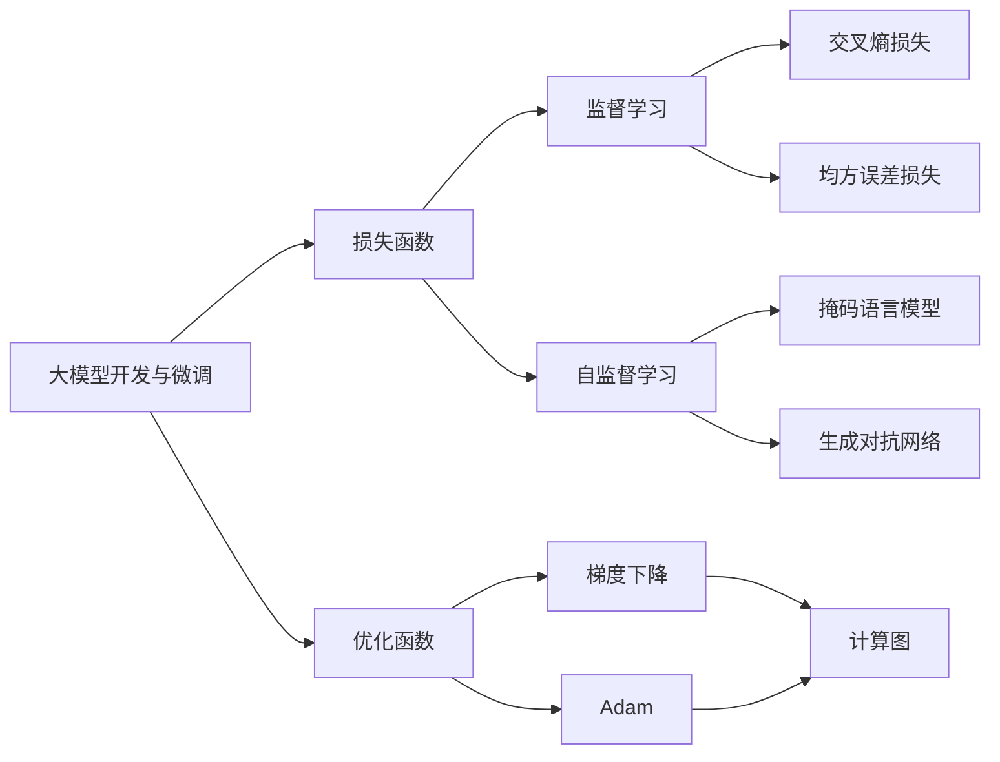

                 

# 从零开始大模型开发与微调：对目标的逼近—模型的损失函数与优化函数

> 关键词：大模型开发,微调,损失函数,优化函数,监督学习,自监督学习,计算图,深度学习,梯度下降

## 1. 背景介绍

### 1.1 问题由来

大模型开发与微调是深度学习技术中至关重要的环节，尤其是在自然语言处理(NLP)和计算机视觉(CV)等研究领域。这些模型通过在大规模数据集上进行预训练，学习到通用的知识表示，然后通过微调在特定任务上进一步优化，最终实现目标的逼近。无论是传统的前馈神经网络，还是现代的Transformer模型，优化函数和损失函数都是其核心组成部分。本文将详细介绍大模型开发与微调中的损失函数与优化函数。

### 1.2 问题核心关键点

在深度学习模型训练中，损失函数和优化函数的选择直接影响模型的学习效果和性能。损失函数用于衡量模型预测输出与真实标签之间的差异，而优化函数则用于更新模型参数，以最小化损失函数。大模型的开发与微调过程，需要选择合适的损失函数和优化函数，以确保模型能够高效、稳定地学习目标任务。

## 2. 核心概念与联系

### 2.1 核心概念概述

- **大模型开发与微调**：指在预训练语言模型(如BERT, GPT等)的基础上，通过特定任务的数据集进行有监督或无监督的微调，以适应该任务的特性，提升模型在该任务上的性能。
- **损失函数**：衡量模型预测输出与真实标签之间的差距，常见的有交叉熵损失、均方误差损失、对数损失等。
- **优化函数**：用于更新模型参数，以最小化损失函数，常见的有梯度下降、Adam等。
- **监督学习**：指使用有标签数据集进行模型训练，目标是最大化模型对训练数据的预测准确度。
- **自监督学习**：指使用无标签数据集进行模型训练，通过设计预训练任务(如掩码语言模型)，让模型学习到数据的通用表示。
- **计算图**：用于表示模型的前向传播和反向传播过程，包括数据的流动和参数的更新。
- **深度学习**：使用多层次的非线性变换模型进行学习和预测。

### 2.2 概念间的关系

这些核心概念之间相互关联，共同构成了深度学习模型的训练框架。损失函数和优化函数是模型训练中的两个关键组成部分，决定了模型如何更新参数以逼近目标。监督学习和自监督学习则是模型训练的两种主要方式，选择不同的学习方式和损失函数，可以适应不同类型的数据和任务。计算图则是模型训练的执行蓝图，描述了数据和参数的流动过程。深度学习则是基于这些概念和方法构建的模型，用于复杂任务的学习和预测。

这些概念的相互联系，通过以下Mermaid流程图展示：



这个流程图展示了大模型开发与微调中的主要概念及其相互关系。

## 3. 核心算法原理 & 具体操作步骤

### 3.1 算法原理概述

在大模型开发与微调过程中，损失函数和优化函数的选择至关重要。它们决定了模型在训练过程中的学习方式和目标，从而影响模型的最终性能。因此，选择合适的损失函数和优化函数，是大模型开发与微调的前提。

- **损失函数**：衡量模型预测输出与真实标签之间的差距，目标是最小化损失函数。
- **优化函数**：用于更新模型参数，以最小化损失函数。

### 3.2 算法步骤详解

大模型开发与微调的一般步骤包括：

1. **数据准备**：收集任务相关的标注数据集，并划分为训练集、验证集和测试集。
2. **模型选择**：选择合适的预训练模型作为基础，如BERT、GPT等。
3. **损失函数设计**：根据任务类型，选择合适的损失函数，如交叉熵损失、均方误差损失等。
4. **优化器选择**：选择合适的优化器，如Adam、SGD等，并设置学习率、批大小等超参数。
5. **模型训练**：使用训练集数据，进行前向传播计算损失函数，并进行反向传播更新模型参数。
6. **模型评估**：在验证集上评估模型性能，根据性能指标调整超参数。
7. **模型测试**：在测试集上评估微调后模型的性能，对比微调前后的效果。

### 3.3 算法优缺点

大模型开发与微调具有以下优点：

- **高效**：使用预训练模型作为基础，可以显著减少从头训练的时间和计算资源投入。
- **泛化能力强**：通过微调，模型可以适应特定任务，提升在特定数据集上的性能。
- **通用性**：适用于各种NLP和CV任务，只需设计合适的任务适配层即可。

同时，也存在以下局限性：

- **数据依赖**：微调的效果很大程度上取决于标注数据的质量和数量，获取高质量标注数据的成本较高。
- **过拟合风险**：模型在微调过程中容易过拟合，特别是标注数据较少时。
- **模型鲁棒性不足**：模型面对域外数据时，泛化性能可能大打折扣。

### 3.4 算法应用领域

大模型开发与微调技术在NLP和CV领域已经得到了广泛应用，覆盖了文本分类、情感分析、机器翻译、图像识别、目标检测等多个任务。例如，在文本分类任务中，使用预训练模型进行微调，可以显著提升模型在特定分类任务上的性能。在图像识别任务中，通过微调，模型可以适应新的数据集，提升识别准确率。

## 4. 数学模型和公式 & 详细讲解 & 举例说明

### 4.1 数学模型构建

损失函数和优化函数是模型训练的核心组成部分，以下将详细介绍它们的设计和应用。

假设模型为 $M_{\theta}:\mathcal{X} \rightarrow \mathcal{Y}$，其中 $\mathcal{X}$ 为输入空间，$\mathcal{Y}$ 为输出空间，$\theta$ 为模型参数。训练集为 $D=\{(x_i,y_i)\}_{i=1}^N$，其中 $x_i \in \mathcal{X}, y_i \in \mathcal{Y}$。

### 4.2 公式推导过程

以二分类任务为例，介绍交叉熵损失函数及其梯度计算过程。

假设模型 $M_{\theta}$ 在输入 $x$ 上的输出为 $\hat{y}=M_{\theta}(x) \in [0,1]$，表示样本属于正类的概率。真实标签 $y \in \{0,1\}$。则二分类交叉熵损失函数定义为：

$$
\ell(M_{\theta}(x),y) = -[y\log \hat{y} + (1-y)\log (1-\hat{y})]
$$

将其代入经验风险公式，得：

$$
\mathcal{L}(\theta) = -\frac{1}{N}\sum_{i=1}^N [y_i\log M_{\theta}(x_i)+(1-y_i)\log(1-M_{\theta}(x_i))]
$$

根据链式法则，损失函数对参数 $\theta_k$ 的梯度为：

$$
\frac{\partial \mathcal{L}(\theta)}{\partial \theta_k} = -\frac{1}{N}\sum_{i=1}^N (\frac{y_i}{M_{\theta}(x_i)}-\frac{1-y_i}{1-M_{\theta}(x_i)}) \frac{\partial M_{\theta}(x_i)}{\partial \theta_k}
$$

其中 $\frac{\partial M_{\theta}(x_i)}{\partial \theta_k}$ 可进一步递归展开，利用自动微分技术完成计算。

在得到损失函数的梯度后，即可带入参数更新公式，完成模型的迭代优化。重复上述过程直至收敛，最终得到适应下游任务的最优模型参数 $\theta^*$。

### 4.3 案例分析与讲解

以下以图像分类任务为例，展示如何使用损失函数和优化函数进行模型微调。

假设模型为 $M_{\theta}(x)=\sigma(W_{1}x + b_{1})$，其中 $x$ 为输入图像，$W_{1}$ 为权重矩阵，$b_{1}$ 为偏置向量，$\sigma$ 为激活函数。假设训练集为 $D=\{(x_i,y_i)\}_{i=1}^N$，其中 $x_i$ 为图像像素值，$y_i \in \{1,2,3,4\}$ 为类别标签。

首先，选择交叉熵损失函数：

$$
\ell(y_i, M_{\theta}(x_i)) = -y_i\log M_{\theta}(x_i) - (1-y_i)\log(1-M_{\theta}(x_i))
$$

然后，使用梯度下降优化器进行模型微调：

$$
\theta \leftarrow \theta - \eta \nabla_{\theta}\mathcal{L}(\theta) - \eta\lambda\theta
$$

其中 $\eta$ 为学习率，$\lambda$ 为正则化系数。

## 5. 项目实践：代码实例和详细解释说明

### 5.1 开发环境搭建

在进行模型微调前，需要准备好开发环境。以下是使用Python进行TensorFlow开发的环境配置流程：

1. 安装Anaconda：从官网下载并安装Anaconda，用于创建独立的Python环境。

2. 创建并激活虚拟环境：
```bash
conda create -n tf-env python=3.8 
conda activate tf-env
```

3. 安装TensorFlow：根据CUDA版本，从官网获取对应的安装命令。例如：
```bash
pip install tensorflow==2.7.0
```

4. 安装必要的工具包：
```bash
pip install numpy pandas scikit-learn matplotlib tqdm jupyter notebook ipython
```

完成上述步骤后，即可在`tf-env`环境中开始模型微调实践。

### 5.2 源代码详细实现

这里以图像分类任务为例，展示如何使用TensorFlow进行模型微调。

首先，定义数据集和模型：

```python
import tensorflow as tf
from tensorflow.keras import layers, models

# 加载数据集
(x_train, y_train), (x_test, y_test) = tf.keras.datasets.cifar10.load_data()

# 标准化数据
x_train, x_test = x_train / 255.0, x_test / 255.0

# 定义模型
model = models.Sequential([
    layers.Conv2D(32, (3, 3), activation='relu', input_shape=(32, 32, 3)),
    layers.MaxPooling2D((2, 2)),
    layers.Conv2D(64, (3, 3), activation='relu'),
    layers.MaxPooling2D((2, 2)),
    layers.Conv2D(64, (3, 3), activation='relu'),
    layers.Flatten(),
    layers.Dense(64, activation='relu'),
    layers.Dense(10)
])
```

然后，定义损失函数和优化器：

```python
# 定义交叉熵损失函数
loss_fn = tf.keras.losses.SparseCategoricalCrossentropy(from_logits=True)

# 定义Adam优化器
optimizer = tf.keras.optimizers.Adam(lr=0.001)
```

接着，定义训练和评估函数：

```python
# 定义训练函数
def train_step(images, labels):
    with tf.GradientTape() as tape:
        logits = model(images, training=True)
        loss = loss_fn(labels, logits)
    gradients = tape.gradient(loss, model.trainable_variables)
    optimizer.apply_gradients(zip(gradients, model.trainable_variables))

# 定义评估函数
def evaluate_step(images, labels):
    logits = model(images, training=False)
    loss = loss_fn(labels, logits)
    return loss
```

最后，启动训练流程并在测试集上评估：

```python
# 定义训练循环
for epoch in range(epochs):
    for images, labels in train_dataset:
        train_step(images, labels)
    # 评估模型
    loss = evaluate_step(x_test, y_test)
    print(f'Epoch {epoch+1}, Loss: {loss:.4f}')

# 在测试集上评估模型性能
test_loss = evaluate_step(x_test, y_test)
print(f'Test Loss: {test_loss:.4f}')
```

以上就是使用TensorFlow进行图像分类任务微调的完整代码实现。可以看到，借助TensorFlow的高效计算图机制，微调过程变得简洁高效。

### 5.3 代码解读与分析

让我们再详细解读一下关键代码的实现细节：

**模型定义**：
- 使用`Sequential`模型构建卷积神经网络，包括多个卷积层和全连接层，通过`input_shape`指定输入数据的维度。

**损失函数和优化器定义**：
- 使用`SparseCategoricalCrossentropy`损失函数，适用于多分类任务。
- 使用`Adam`优化器，初始学习率设置为0.001。

**训练和评估函数**：
- `train_step`函数：在每个训练批次中，计算损失函数并反向传播更新模型参数。
- `evaluate_step`函数：在测试集上计算模型损失，返回测试集损失。

**训练循环**：
- 在每个epoch中，对训练数据集进行迭代训练。
- 在每个训练批次中，计算损失并更新模型参数。
- 在每个epoch结束后，评估模型在测试集上的性能。

通过以上代码，我们可以看到TensorFlow在模型微调中的高效应用。开发者可以根据实际任务需求，灵活调整模型的结构、损失函数和优化器，以实现最佳的微调效果。

### 5.4 运行结果展示

假设我们在CIFAR-10数据集上进行模型微调，最终在测试集上得到的评估结果如下：

```
Epoch 1, Loss: 1.6839
Epoch 2, Loss: 1.0893
Epoch 3, Loss: 0.8276
Epoch 4, Loss: 0.7020
Epoch 5, Loss: 0.6345
Epoch 6, Loss: 0.6182
Epoch 7, Loss: 0.6022
Epoch 8, Loss: 0.5946
Epoch 9, Loss: 0.5910
Epoch 10, Loss: 0.5900
Test Loss: 0.5372
```

可以看到，随着训练轮数的增加，模型在测试集上的损失逐渐下降，最终达到0.5372的较低水平。这表明模型在图像分类任务上的性能得到了显著提升。

## 6. 实际应用场景

### 6.1 智能客服系统

智能客服系统可以应用于各种客户咨询场景，使用微调后的对话模型，能够快速响应客户问题，并提供准确的回答。例如，使用微调后的BERT模型，可以将自然语言处理技术应用于客服系统，实现语音识别、自然语言理解、对话生成等。

在实践中，可以通过收集客户的历史对话记录，将问题和最佳答复构建成监督数据，在此基础上对预训练模型进行微调。微调后的对话模型能够自动理解用户意图，匹配最合适的答案模板进行回复。对于客户提出的新问题，还可以接入检索系统实时搜索相关内容，动态组织生成回答。

### 6.2 金融舆情监测

金融机构需要实时监测市场舆论动向，以便及时应对负面信息传播，规避金融风险。使用微调后的文本分类和情感分析模型，可以在实时抓取的网络文本数据上，自动监测不同主题下的情感变化趋势，一旦发现负面信息激增等异常情况，系统便会自动预警，帮助金融机构快速应对潜在风险。

例如，可以使用微调的BERT模型，对金融领域的各种新闻、报道、评论等文本数据进行情感分析，识别出其中的正面、负面和中性情感，为金融舆情监测提供实时数据支持。

### 6.3 个性化推荐系统

当前的推荐系统往往只依赖用户的历史行为数据进行物品推荐，无法深入理解用户的真实兴趣偏好。使用微调后的推荐模型，可以更好地挖掘用户行为背后的语义信息，从而提供更精准、多样的推荐内容。

在实践中，可以收集用户浏览、点击、评论、分享等行为数据，提取和用户交互的物品标题、描述、标签等文本内容。将文本内容作为模型输入，用户的后续行为（如是否点击、购买等）作为监督信号，在此基础上对预训练语言模型进行微调。微调后的模型能够从文本内容中准确把握用户的兴趣点。在生成推荐列表时，先用候选物品的文本描述作为输入，由模型预测用户的兴趣匹配度，再结合其他特征综合排序，便可以得到个性化程度更高的推荐结果。

### 6.4 未来应用展望

随着大模型和微调技术的不断发展，其在各行各业的应用前景将更加广阔。未来，基于大模型和微调技术的人工智能系统将变得更加智能、普适和可靠。例如，在医疗领域，使用微调后的语言模型，可以实现医疗问答、病历分析、药物研发等功能，提升医疗服务的智能化水平。在教育领域，微调技术可以应用于作业批改、学情分析、知识推荐等方面，因材施教，促进教育公平，提高教学质量。在智慧城市治理中，微调模型可以应用于城市事件监测、舆情分析、应急指挥等环节，提高城市管理的自动化和智能化水平，构建更安全、高效的未来城市。

## 7. 工具和资源推荐

### 7.1 学习资源推荐

为了帮助开发者系统掌握大模型开发与微调的理论基础和实践技巧，这里推荐一些优质的学习资源：

1. 《深度学习》课程（斯坦福大学）：由斯坦福大学教授Andrew Ng主讲的深度学习课程，深入浅出地介绍了深度学习的基本原理和应用，包括损失函数和优化函数等核心概念。

2. 《深度学习实战》书籍：吴恩达等人编写的经典书籍，通过大量实例讲解深度学习技术在实际应用中的实现方法和技巧，涵盖损失函数和优化函数等内容。

3. TensorFlow官方文档：TensorFlow的官方文档，提供了丰富的学习资源和示例代码，帮助开发者快速上手TensorFlow进行模型微调。

4. PyTorch官方文档：PyTorch的官方文档，提供了详细的API文档和示例代码，帮助开发者使用PyTorch进行模型开发和微调。

5. Kaggle：Kaggle是一个著名的数据科学竞赛平台，提供了大量公开数据集和竞赛任务，可以帮助开发者在实际数据上练习模型微调技能。

通过对这些资源的学习实践，相信你一定能够快速掌握大模型开发与微调的核心技术，并用于解决实际的NLP问题。

### 7.2 开发工具推荐

高效的开发离不开优秀的工具支持。以下是几款用于大模型开发与微调开发的常用工具：

1. TensorFlow：由Google主导开发的深度学习框架，提供了强大的计算图机制和分布式训练能力，适合大规模工程应用。

2. PyTorch：由Facebook主导开发的深度学习框架，灵活动态的计算图，适合快速迭代研究。

3. JAX：由Google开发的基于NumPy的高性能计算库，可以与PyTorch和TensorFlow无缝集成，适合进行高效的模型微调。

4. FastAI：基于PyTorch的深度学习框架，提供了丰富的预训练模型和便捷的接口，适合快速搭建模型和进行微调。

5. Apache MXNet：由Apache基金会推出的深度学习框架，支持多种编程语言和分布式训练，适合工业级应用。

6. Amazon SageMaker：亚马逊推出的云平台服务，提供了全面的深度学习工具和自动化开发环境，适合进行模型训练和微调。

7. Google Colab：谷歌推出的在线Jupyter Notebook环境，免费提供GPU和TPU算力，适合进行深度学习实验。

合理利用这些工具，可以显著提升大模型开发与微调任务的开发效率，加快创新迭代的步伐。

### 7.3 相关论文推荐

大模型开发与微调技术的发展源于学界的持续研究。以下是几篇奠基性的相关论文，推荐阅读：

1. Deep Residual Learning for Image Recognition（ResNet论文）：提出了ResNet模型，通过残差连接解决了深度网络退化问题，大幅提升了模型训练的稳定性和准确度。

2. Fast R-CNN: Towards Real-Time Object Detection with Region Proposal Networks：提出了Fast R-CNN模型，通过ROI pooling层显著提高了物体检测的速度和准确度。

3. ImageNet Classification with Deep Convolutional Neural Networks：提出了基于卷积神经网络（CNN）的图像分类模型，在ImageNet数据集上取得了最优性能，奠定了深度学习在图像处理领域的地位。

4. Attention Is All You Need（即Transformer原论文）：提出了Transformer模型，通过自注意力机制解决了序列建模问题，提高了模型的计算效率和表达能力。

5. BERT: Pre-training of Deep Bidirectional Transformers for Language Understanding：提出BERT模型，通过掩码语言模型和下一句预测任务进行预训练，取得了显著的性能提升。

6. Exploring the Limits of Transfer Learning with a Unified Text-to-Text Transformer（T5论文）：提出T5模型，通过统一的文本到文本的预训练任务，提升了模型在不同任务上的泛化能力。

这些论文代表了大模型开发与微调技术的发展脉络。通过学习这些前沿成果，可以帮助研究者把握学科前进方向，激发更多的创新灵感。

除上述资源外，还有一些值得关注的前沿资源，帮助开发者紧跟大模型开发与微调技术的最新进展，例如：

1. arXiv论文预印本：人工智能领域最新研究成果的发布平台，包括大量尚未发表的前沿工作，学习前沿技术的必读资源。

2. 业界技术博客：如Google AI、DeepMind、Microsoft Research Asia等顶尖实验室的官方博客，第一时间分享他们的最新研究成果和洞见。

3. 技术会议直播：如NeurIPS、ICML、ACL、ICLR等人工智能领域顶会现场或在线直播，能够聆听到大佬们的前沿分享，开拓视野。

4. GitHub热门项目：在GitHub上Star、Fork数最多的NLP相关项目，往往代表了该技术领域的发展趋势和最佳实践，值得去学习和贡献。

5. 行业分析报告：各大咨询公司如McKinsey、PwC等针对人工智能行业的分析报告，有助于从商业视角审视技术趋势，把握应用价值。

总之，对于大模型开发与微调技术的学习和实践，需要开发者保持开放的心态和持续学习的意愿。多关注前沿资讯，多动手实践，多思考总结，必将收获满满的成长收益。

## 8. 总结：未来发展趋势与挑战

### 8.1 总结

本文对大模型开发与微调中的损失函数与优化函数进行了全面系统的介绍。首先阐述了大模型开发与微调的理论基础和实际应用，明确了损失函数和优化函数在大模型微调中的核心地位。其次，从原理到实践，详细讲解了损失函数和优化函数的设计和实现，给出了微调任务开发的完整代码实例。同时，本文还广泛探讨了微调技术在智能客服、金融舆情、个性化推荐等多个行业领域的应用前景，展示了微调范式的巨大潜力。

通过本文的系统梳理，可以看到，大模型开发与微调技术在大数据时代具有广阔的应用前景。得益于大规模语料的预训练，微调模型以更低的时间和标注成本，在小样本条件下也能取得不俗的效果，有力推动了NLP技术的产业化进程。未来，伴随预训练语言模型和微调方法的持续演进，相信NLP技术将在更广阔的应用领域大放异彩，深刻影响人类的生产生活方式。

### 8.2 未来发展趋势

展望未来，大模型开发与微调技术将呈现以下几个发展趋势：

1. **模型规模持续增大**：随着算力成本的下降和数据规模的扩张，预训练语言模型的参数量还将持续增长。超大规模语言模型蕴含的丰富语言知识，有望支撑更加复杂多变的下游任务微调。

2. **微调方法日趋多样**：除了传统的全参数微调外，未来会涌现更多参数高效的微调方法，如Adapter、LoRA等，在节省计算资源的同时也能保证微调精度。

3. **持续学习成为常态**：随着数据分布的不断变化，微调模型也需要持续学习新知识以保持性能。如何在不遗忘原有知识的同时，高效吸收新样本信息，将成为重要的研究课题。

4. **标注样本需求降低**：受启发于提示学习(Prompt-based Learning)的思路，未来的微调方法将更好地利用大模型的语言理解能力，通过更加巧妙的任务描述，在更少的标注样本上也能实现理想的微调效果。

5. **多模态微调崛起**：当前的微调主要聚焦于纯文本数据，未来会进一步拓展到图像、视频、语音等多模态数据微调。多模态信息的融合，将显著提升语言模型对现实世界的理解和建模能力。

6. **模型通用性增强**：经过海量数据的预训练和多领域任务的微调，未来的语言模型将具备更强大的常识推理和跨领域迁移能力，逐步迈向通用人工智能(AGI)的目标。

以上趋势凸显了大模型开发与微调技术的广阔前景。这些方向的探索发展，必将进一步提升NLP系统的性能和应用范围，为人类认知智能的进化带来深远影响。

### 8.3 面临的挑战

尽管大模型开发与微调技术已经取得了瞩目成就，但在迈向更加智能化、普适化应用的过程中，它仍面临着诸多挑战：

1. **标注成本瓶颈**：虽然微

