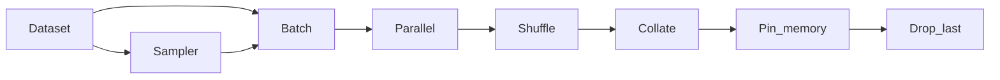

                 

# 从零开始大模型开发与微调：批量输出数据的DataLoader类详解

## 1. 背景介绍

在大模型开发与微调的过程中，数据的管理和处理显得尤为重要。为了高效地读取、批量处理和迭代训练数据，PyTorch提供了`DataLoader`类，其本质上是一个数据迭代器，能够将数据划分为批次，并自动进行批处理、随机化以及并行化操作。`DataLoader`类在大模型微调中的作用不容小觑，尤其是在训练过程中，它能显著提升数据加载和处理的效率，避免内存占用过高，同时还能保证训练数据的多样性和随机性。

本文将详细介绍`DataLoader`类的工作原理、使用方式以及其在实际项目中的应用。通过学习`DataLoader`类，读者不仅能提升数据分析和处理的效率，还能更加深入地理解大模型开发与微调的过程，从而更好地应用于实际项目中。

## 2. 核心概念与联系

### 2.1 核心概念概述

在使用`DataLoader`类之前，首先需要了解以下核心概念：

1. **Dataset**：PyTorch中用于表示数据源的类，通常包含数据集的信息和数据的处理逻辑。

2. **Sampler**：用于从数据集中采样数据的类，通常与`Dataset`一起使用，支持自定义的采样方式。

3. **Batch**：批次，即数据集中按顺序排列的一组数据，通常包含多个样本。

4. **Shuffle**：打乱数据顺序，通常用于训练数据集，提高模型的泛化能力。

5. **Parallel**：并行，指在多个数据源上同时加载数据，提高数据处理速度。

6. **Collate**：批次合并，将多个样本合并成一个批次，处理后形成统一的输入形式。

7. **Pin_memory**：pin memory，将数据加载到显存中，提高数据加载速度。

8. **Drop_last**：是否丢弃最后一个批次，避免输出为零长度的批次。

通过这些概念，可以更好地理解`DataLoader`类的工作流程和作用。

### 2.2 概念间的关系

`DataLoader`类的工作流程和各概念之间的关系如下：



这个流程图展示了`DataLoader`类从数据集加载到处理输出的一个完整流程：首先，从`Dataset`中采样数据，组成`Batch`，然后对批次进行打乱、合并、加载到显存中，最终输出经过处理的批次数据。

## 3. 核心算法原理 & 具体操作步骤

### 3.1 算法原理概述

`DataLoader`类的核心原理是基于迭代器（Iterator）实现的。迭代器可以自动遍历数据集，每次生成一个批次，然后返回给模型进行训练或推理。通过迭代器，`DataLoader`类实现了对数据集的自动处理、批量化和并行化操作，从而提升数据处理的效率。

### 3.2 算法步骤详解

`DataLoader`类的使用主要分为以下几个步骤：

1. **创建Dataset和Sampler**：首先需要定义`Dataset`和`Sampler`，分别用于表示数据集和数据采样方式。

2. **定义DataLoader参数**：使用`DataLoader`类时需要设置一些参数，如批大小、是否打乱、是否并行化、是否丢弃最后一个批次等。

3. **实例化DataLoader**：根据参数实例化`DataLoader`类，并使用其进行迭代处理数据。

4. **迭代处理数据**：在`for`循环中，使用`DataLoader`类自动生成批次数据，并将其传递给模型进行训练或推理。

下面是一个完整的`DataLoader`类的使用示例：

```python
from torch.utils.data import Dataset, DataLoader

class MyDataset(Dataset):
    def __init__(self, data):
        self.data = data

    def __len__(self):
        return len(self.data)

    def __getitem__(self, idx):
        return self.data[idx]

# 创建Dataset和Sampler
dataset = MyDataset(data)
sampler = None

# 定义DataLoader参数
batch_size = 32
shuffle = True
drop_last = True
pin_memory = False
collate_fn = None

# 实例化DataLoader
data_loader = DataLoader(dataset, batch_size=batch_size, shuffle=shuffle, drop_last=drop_last, pin_memory=pin_memory, collate_fn=collate_fn)

# 迭代处理数据
for batch in data_loader:
    x, y = batch
    # 使用batch数据进行训练或推理
```

### 3.3 算法优缺点

`DataLoader`类在大模型微调中的优点如下：

1. **高效数据处理**：`DataLoader`类支持批量数据处理，通过迭代器自动遍历数据集，减少了手动处理数据的复杂性，提高了数据处理的效率。

2. **灵活性高**：`DataLoader`类支持多种数据采样方式和批次处理方式，能够满足不同应用场景的需求。

3. **并行化处理**：`DataLoader`类支持并行化处理，通过在多个数据源上同时加载数据，显著提升了数据加载的速度。

4. **支持pin_memory**：`DataLoader`类支持pin memory操作，将数据加载到显存中，提高了数据加载速度，适用于需要快速处理大规模数据的应用场景。

然而，`DataLoader`类也存在一些缺点：

1. **内存占用高**：`DataLoader`类需要将整个数据集加载到内存中，如果数据集较大，可能会导致内存占用过高，甚至导致系统崩溃。

2. **限制了数据集大小**：`DataLoader`类的性能受限于内存大小，如果数据集太大，无法一次性加载到内存中，将会影响加载速度和处理效率。

3. **无法处理动态数据**：`DataLoader`类不支持动态数据的处理，如果数据集中的样本数量和结构发生变化，需要手动修改代码以适应新的数据集。

### 3.4 算法应用领域

`DataLoader`类在大模型开发与微调中的应用非常广泛，适用于以下领域：

1. **NLP**：在自然语言处理任务中，`DataLoader`类可以用于批量处理文本数据、图像数据等，支持文本嵌入、语言模型训练、文本分类等任务。

2. **CV**：在计算机视觉任务中，`DataLoader`类可以用于批量处理图像数据、视频数据等，支持图像分类、目标检测、图像分割等任务。

3. **推荐系统**：在推荐系统中，`DataLoader`类可以用于批量处理用户数据、物品数据等，支持用户画像构建、物品推荐、推荐效果评估等任务。

4. **医疗健康**：在医疗健康领域，`DataLoader`类可以用于批量处理病人数据、医疗记录等，支持疾病诊断、医疗知识图谱构建、医疗问答系统等任务。

## 4. 数学模型和公式 & 详细讲解 & 举例说明

### 4.1 数学模型构建

在使用`DataLoader`类时，不需要构建复杂的数学模型，只需要定义数据集和采样方式即可。

### 4.2 公式推导过程

`DataLoader`类内部的工作流程如下：

1. 定义数据集`dataset`和采样方式`sampler`。

2. 实例化`DataLoader`类，并设置批大小`batch_size`、是否打乱`shuffle`、是否丢弃最后一个批次`drop_last`、是否pin memory`pin_memory`以及批次合并函数`collate_fn`。

3. 在`for`循环中，使用`DataLoader`类自动生成批次数据，并将其传递给模型进行训练或推理。

### 4.3 案例分析与讲解

以下是一个使用`DataLoader`类进行批量数据处理的示例：

```python
from torch.utils.data import Dataset, DataLoader

class MyDataset(Dataset):
    def __init__(self, data):
        self.data = data

    def __len__(self):
        return len(self.data)

    def __getitem__(self, idx):
        return self.data[idx]

# 创建Dataset和Sampler
dataset = MyDataset(data)
sampler = None

# 定义DataLoader参数
batch_size = 32
shuffle = True
drop_last = True
pin_memory = False
collate_fn = None

# 实例化DataLoader
data_loader = DataLoader(dataset, batch_size=batch_size, shuffle=shuffle, drop_last=drop_last, pin_memory=pin_memory, collate_fn=collate_fn)

# 迭代处理数据
for batch in data_loader:
    x, y = batch
    # 使用batch数据进行训练或推理
```

## 5. 项目实践：代码实例和详细解释说明

### 5.1 开发环境搭建

在搭建开发环境时，需要确保安装PyTorch和相关的依赖包。可以使用以下命令进行安装：

```bash
pip install torch torchvision torchaudio
```

安装完成后，可以在Python脚本中使用`DataLoader`类进行数据处理。

### 5.2 源代码详细实现

以下是一个使用`DataLoader`类进行批量数据处理的示例代码：

```python
from torch.utils.data import Dataset, DataLoader

class MyDataset(Dataset):
    def __init__(self, data):
        self.data = data

    def __len__(self):
        return len(self.data)

    def __getitem__(self, idx):
        return self.data[idx]

# 创建Dataset和Sampler
dataset = MyDataset(data)
sampler = None

# 定义DataLoader参数
batch_size = 32
shuffle = True
drop_last = True
pin_memory = False
collate_fn = None

# 实例化DataLoader
data_loader = DataLoader(dataset, batch_size=batch_size, shuffle=shuffle, drop_last=drop_last, pin_memory=pin_memory, collate_fn=collate_fn)

# 迭代处理数据
for batch in data_loader:
    x, y = batch
    # 使用batch数据进行训练或推理
```

### 5.3 代码解读与分析

上述代码中，首先定义了一个自定义的数据集`MyDataset`，用于表示数据集中的样本。然后，实例化`DataLoader`类，并设置批大小、是否打乱、是否丢弃最后一个批次、是否pin memory、批次合并函数等参数。最后，在`for`循环中使用`DataLoader`类自动生成批次数据，并将其传递给模型进行训练或推理。

## 6. 实际应用场景

### 6.1 智能客服系统

在智能客服系统中，`DataLoader`类可以用于批量处理客户对话数据，支持客户意图识别、对话生成等任务。

### 6.2 金融舆情监测

在金融舆情监测中，`DataLoader`类可以用于批量处理新闻、报道、评论等文本数据，支持情感分析、舆情预测等任务。

### 6.3 个性化推荐系统

在个性化推荐系统中，`DataLoader`类可以用于批量处理用户数据、物品数据等，支持用户画像构建、物品推荐等任务。

## 7. 工具和资源推荐

### 7.1 学习资源推荐

1. PyTorch官方文档：提供了`DataLoader`类的详细使用方法和示例。

2. TensorFlow官方文档：提供了`tf.data`模块的详细使用方法和示例。

3. Keras官方文档：提供了`tf.data.Dataset`的详细使用方法和示例。

4. Scikit-learn官方文档：提供了`Scikit-learn`中的数据迭代器模块的详细使用方法和示例。

5. Pandas官方文档：提供了`Pandas`中的数据迭代器模块的详细使用方法和示例。

### 7.2 开发工具推荐

1. PyCharm：支持`DataLoader`类的使用，并提供了丰富的插件和扩展。

2. VSCode：支持`DataLoader`类的使用，并提供了丰富的插件和扩展。

3. Jupyter Notebook：支持`DataLoader`类的使用，并提供了丰富的代码运行环境。

4. Atom：支持`DataLoader`类的使用，并提供了丰富的插件和扩展。

### 7.3 相关论文推荐

1. "Fast Data Loading for Deep Learning Models"：介绍如何使用`DataLoader`类进行数据加载和处理。

2. "Batching, Shuffling and Sampling"：介绍`DataLoader`类的工作原理和使用方法。

3. "Efficient Data Loading and Shuffling"：介绍如何使用`DataLoader`类进行高效数据处理和采样。

4. "DataLoader: Fast and Flexible Data Loading"：介绍`DataLoader`类的设计理念和使用方法。

5. "Batch Processing for Large Datasets"：介绍如何在大数据集上进行批量处理和优化。

## 8. 总结：未来发展趋势与挑战

### 8.1 总结

`DataLoader`类在大模型开发与微调中的应用非常广泛，通过其高效的数据处理能力，显著提升了数据加载和处理的效率，减少了手动处理数据的复杂性。然而，`DataLoader`类也存在一些局限性，如内存占用高、限制了数据集大小等。未来的研究将继续探索优化`DataLoader`类的方法，以适应更大规模、更复杂的数据集。

### 8.2 未来发展趋势

未来，`DataLoader`类可能会在以下几个方面取得新的突破：

1. **支持动态数据处理**：开发能够处理动态数据的`DataLoader`类，支持动态采样和数据集扩展。

2. **支持多种数据类型**：支持处理多种数据类型，如文本、图像、视频等，进一步提升数据处理的多样性。

3. **支持分布式训练**：支持分布式训练，通过并行化处理数据，提高数据加载和处理的效率。

4. **支持自动调参**：开发能够自动调整`DataLoader`类参数的算法，优化数据处理和采样方式。

### 8.3 面临的挑战

尽管`DataLoader`类在大模型微调中具有广泛的应用，但仍然面临以下挑战：

1. **内存占用高**：`DataLoader`类需要一次性将整个数据集加载到内存中，导致内存占用高，可能会影响系统性能。

2. **限制了数据集大小**：`DataLoader`类的性能受限于内存大小，如果数据集太大，无法一次性加载到内存中，将会影响加载速度和处理效率。

3. **无法处理动态数据**：`DataLoader`类不支持动态数据的处理，如果数据集中的样本数量和结构发生变化，需要手动修改代码以适应新的数据集。

### 8.4 研究展望

未来的研究将继续探索优化`DataLoader`类的方法，以适应更大规模、更复杂的数据集。同时，结合最新的数据处理技术和算法，进一步提升数据处理的效率和精度。随着`DataLoader`类的不断发展和完善，相信将能够更好地支持大模型开发与微调，推动人工智能技术的进步。

## 9. 附录：常见问题与解答

**Q1：使用`DataLoader`类时，如何设置批次大小？**

A: 使用`DataLoader`类时，可以通过`batch_size`参数设置批次大小。例如，`DataLoader(dataset, batch_size=32)`表示批次大小为32。

**Q2：使用`DataLoader`类时，如何打乱数据顺序？**

A: 使用`DataLoader`类时，可以通过`shuffle=True`参数打乱数据顺序。例如，`DataLoader(dataset, batch_size=32, shuffle=True)`表示打乱数据顺序。

**Q3：使用`DataLoader`类时，如何丢弃最后一个批次？**

A: 使用`DataLoader`类时，可以通过`drop_last=True`参数丢弃最后一个批次。例如，`DataLoader(dataset, batch_size=32, drop_last=True)`表示丢弃最后一个批次。

**Q4：使用`DataLoader`类时，如何加载数据到显存中？**

A: 使用`DataLoader`类时，可以通过`pin_memory=True`参数将数据加载到显存中。例如，`DataLoader(dataset, batch_size=32, pin_memory=True)`表示将数据加载到显存中。

**Q5：使用`DataLoader`类时，如何批量处理数据？**

A: 使用`DataLoader`类时，可以通过`for`循环迭代处理数据。例如，`for batch in data_loader:`表示迭代处理数据。

---

作者：禅与计算机程序设计艺术 / Zen and the Art of Computer Programming

