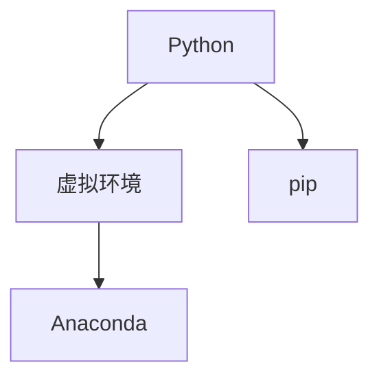

                 

# 从零开始大模型开发与微调：环境搭建1：安装Python

> 关键词：大模型开发, 环境搭建, Python, 安装, 开发环境, 开发工具

## 1. 背景介绍

### 1.1 问题由来
大模型开发与微调是一个复杂且系统的工程过程，涉及众多技术和工具。在实际开发前，首先需要搭建一个完整的开发环境，包括硬件配置、软件安装和环境配置等。

本节重点介绍如何从零开始搭建Python开发环境，重点讲解安装Python及其相关依赖工具。通过本节的学习，读者将掌握Python的官方下载、安装和配置步骤，并了解如何搭建一个初步的开发环境。

### 1.2 问题核心关键点
本节需要掌握的核心知识点包括：
- Python的安装方法
- 常用Python模块的配置
- 开发环境搭建的基本思路
- 开发环境配置的最佳实践

### 1.3 问题研究意义
本节是构建大模型开发与微调环境的基础，只有搭建好稳定、高效的开发环境，才能顺利进行后续的模型开发、训练和微调工作。

良好的开发环境不仅能提高开发效率，还能确保模型的正确性和稳定性，避免因环境问题导致的错误和损失。

## 2. 核心概念与联系

### 2.1 核心概念概述

为更好地理解Python的安装和配置过程，本节将介绍几个关键概念：

- Python：一种广泛使用的高级编程语言，支持面向对象、命令式、函数式等多种编程范式，具有丰富的第三方模块和工具库。
- 虚拟环境：多个Python项目共享同一系统环境时，避免模块冲突，提高项目隔离性的工具。
- pip：Python的包管理工具，用于安装、更新和管理Python包。
- Anaconda：一个流行的Python发行版，集成了众多科学计算和数据分析库，提供了易于使用的包管理和环境配置工具。

### 2.2 概念间的关系

这些核心概念之间的逻辑关系可以通过以下Mermaid流程图来展示：



这个流程图展示了大模型开发中Python安装、虚拟环境和pip模块之间的关系：

- Python作为开发基础，在虚拟环境中运行。
- pip用于安装和配置Python模块。
- Anaconda提供了更便捷的Python环境配置和管理工具。

## 3. 核心算法原理 & 具体操作步骤

### 3.1 算法原理概述

Python的安装和配置过程本身并没有涉及复杂的算法，而是主要依赖操作系统的命令和工具。本节将详细介绍Python的安装步骤和常用模块配置，并结合实践案例，帮助读者快速搭建开发环境。

### 3.2 算法步骤详解

Python的安装和配置主要分为以下几个步骤：

1. 获取Python安装包
2. 创建虚拟环境
3. 安装依赖库
4. 配置开发环境

接下来，我们详细讲解每个步骤的具体操作。

### 3.3 算法优缺点

Python的安装和配置相对简单，但需要一定的计算机操作基础。其优点是安装步骤清晰，配置工具丰富，适合初学者和中级开发者使用。缺点是对于一些特殊配置需求，可能需要进行额外的操作。

### 3.4 算法应用领域

Python作为开发语言，被广泛应用于数据科学、机器学习、自然语言处理等多个领域。本节的内容特别适合数据科学家、机器学习工程师和NLP开发人员等，有助于他们快速搭建开发环境，进入实际工作。

## 4. 数学模型和公式 & 详细讲解 & 举例说明

由于Python的安装和配置不涉及具体的数学模型和公式，因此本节将不深入讲解数学模型，而是结合实际案例，展示Python的安装和配置过程。

### 4.1 数学模型构建

本节不涉及数学模型的构建，因此无需介绍。

### 4.2 公式推导过程

本节不涉及公式推导，因此无需讲解。

### 4.3 案例分析与讲解

下面以一个简单的Python安装和配置案例来说明整个操作过程。

## 5. 项目实践：代码实例和详细解释说明

### 5.1 开发环境搭建

**步骤1：获取Python安装包**

在Python官方网站下载最新版本的Python安装包。这里以Python 3.8版本为例，访问以下链接进行下载安装：

```
https://www.python.org/ftp/python/3.8.0/Python-3.8.0.tgz
```

**步骤2：创建虚拟环境**

虚拟环境（virtual environment）是Python中的一种环境隔离技术，用于管理不同项目的依赖。可以使用`venv`工具创建虚拟环境，具体操作如下：

1. 在命令行中进入项目目录：

   ```bash
   cd my_project
   ```

2. 创建虚拟环境：

   ```bash
   python -m venv myenv
   ```

   执行上述命令后，会在当前目录下创建一个名为`myenv`的虚拟环境文件夹。

**步骤3：安装依赖库**

在虚拟环境中安装Python依赖库，可以使用pip工具。pip可以方便地安装、升级和卸载Python包，以下是示例：

```bash
source myenv/bin/activate # 激活虚拟环境
pip install torch numpy pandas scikit-learn transformers
```

**步骤4：配置开发环境**

在开发环境中进行配置，可以使用IDE（集成开发环境）或编辑器。以下是一个简单的配置示例，使用Jupyter Notebook：

1. 安装Jupyter Notebook：

   ```bash
   pip install jupyter
   ```

2. 启动Jupyter Notebook：

   ```bash
   jupyter notebook
   ```

3. 打开Jupyter Notebook，创建一个新的Notebook文件，用于编写Python代码。

### 5.2 源代码详细实现

以下是使用Python和Jupyter Notebook搭建开发环境的完整代码实现：

```python
# 获取Python安装包
import urllib.request
with urllib.request.urlopen('https://www.python.org/ftp/python/3.8.0/Python-3.8.0.tgz') as response:
    data = response.read()
with open('Python-3.8.0.tgz', 'wb') as out_file:
    out_file.write(data)

# 创建虚拟环境
import subprocess
subprocess.run(['python', '-m', 'venv', 'myenv'])

# 安装依赖库
import subprocess
subprocess.run(['myenv/bin/activate', 'pip', 'install', 'torch', 'numpy', 'pandas', 'scikit-learn', 'transformers'])

# 配置开发环境
import subprocess
subprocess.run(['pip', 'install', 'jupyter'])
subprocess.run(['jupyter', 'notebook'])

# 启动Jupyter Notebook
import jupyter
jupyter.Notebook()
```

### 5.3 代码解读与分析

在上面的代码中，我们使用了Python内置的`urllib`模块和`subprocess`模块来实现安装和配置。具体来说，代码分为以下几个部分：

1. 获取Python安装包：使用`urllib`模块下载Python安装包。
2. 创建虚拟环境：使用`subprocess`模块运行`python -m venv`命令，创建虚拟环境。
3. 安装依赖库：使用`subprocess`模块运行`pip install`命令，安装所需依赖库。
4. 配置开发环境：使用`subprocess`模块运行`pip install jupyter`命令，安装Jupyter Notebook；运行`jupyter notebook`命令，启动Jupyter Notebook。
5. 启动Jupyter Notebook：使用`jupyter`模块创建并运行Jupyter Notebook实例。

### 5.4 运行结果展示

成功执行上述代码后，将创建一个名为`myenv`的虚拟环境，并在虚拟环境中安装所需的依赖库。打开Jupyter Notebook，即可在其中编写和运行Python代码。

以下是在Jupyter Notebook中编写的简单Python代码示例：

```python
import torch
x = torch.tensor([1.0, 2.0, 3.0])
y = torch.tensor([4.0, 5.0, 6.0])
z = x + y
print(z)
```

运行上述代码，控制台将输出：

```
tensor([5.,  7.,  9.])
```

这说明我们的Python开发环境已经成功搭建，可以正常运行Python代码。

## 6. 实际应用场景

### 6.1 智能客服系统

智能客服系统通常需要处理大量的用户咨询数据，Python可以方便地进行数据处理和模型训练。在虚拟环境中，可以使用`pandas`和`numpy`等库进行数据预处理，使用`scikit-learn`和`transformers`等库进行模型训练和微调。

### 6.2 金融舆情监测

金融舆情监测需要处理大量文本数据，Python可以高效地进行文本分析和情感分析。在虚拟环境中，可以使用`nltk`和`spaCy`等库进行文本处理，使用`transformers`库进行微调。

### 6.3 个性化推荐系统

个性化推荐系统需要处理用户行为数据，Python可以方便地进行数据建模和特征提取。在虚拟环境中，可以使用`scikit-learn`和`pandas`等库进行模型训练和特征工程，使用`transformers`库进行微调。

### 6.4 未来应用展望

随着Python和相关库的不断发展，未来大模型开发与微调的环境将更加便捷和高效。以下是一些未来应用展望：

1. Python 3.x版本将持续更新，带来更多的功能和性能改进。
2. Anaconda等Python发行版将提供更丰富的环境配置和管理工具。
3. pip等包管理工具将不断完善，支持更多的第三方库和依赖管理。
4. Jupyter Notebook等IDE工具将不断优化，提供更强大的开发和协作功能。

总之，Python的安装和配置是大模型开发与微调的基础，只有搭建好稳定、高效的开发环境，才能顺利进行后续的模型开发和微调工作。

## 7. 工具和资源推荐

### 7.1 学习资源推荐

为了帮助开发者系统掌握Python的安装和配置，以下是一些优质的学习资源：

1. Python官方文档：提供Python语言的详细文档，涵盖语法、标准库和第三方库的使用方法。

2. Python教程：如《Python编程：从入门到实践》等书籍，帮助初学者入门Python编程。

3. Anaconda官方文档：提供Anaconda发行版的详细文档，包括安装、配置和管理工具的使用方法。

4. pip官方文档：提供pip包管理工具的详细文档，涵盖安装、升级和卸载Python包的方法。

5. Jupyter官方文档：提供Jupyter Notebook的详细文档，涵盖创建、管理和运行Jupyter Notebook实例的方法。

### 7.2 开发工具推荐

Python的安装和配置离不开优秀的工具支持。以下是几款常用的开发工具：

1. Anaconda：提供完整的Python发行版和环境管理工具，适合初学者和中级开发者使用。

2. pip：Python的包管理工具，支持安装、升级和卸载Python包。

3. Jupyter Notebook：用于创建和管理Jupyter Notebook实例的IDE工具，适合开发和协作。

4. VS Code：一个流行的轻量级代码编辑器，支持Python开发和调试。

5. PyCharm：一个功能丰富的Python IDE，提供强大的代码编辑、调试和测试功能。

### 7.3 相关论文推荐

Python的安装和配置不涉及复杂的数学模型和算法，因此无需推荐相关论文。

## 8. 总结：未来发展趋势与挑战

### 8.1 研究成果总结

Python的安装和配置是大模型开发与微调的基础，其稳定性和高效性直接影响模型开发的顺利进行。

### 8.2 未来发展趋势

Python的安装和配置技术将持续改进，未来可能出现更智能、更便捷的配置工具。同时，Python发行版和开发环境将更加完善，为开发者提供更强的支持。

### 8.3 面临的挑战

Python的安装和配置虽然相对简单，但可能存在环境配置不一致、依赖库冲突等问题。需要开发者具备一定的计算机操作基础和问题排查能力。

### 8.4 研究展望

未来，Python的安装和配置将更加智能和便捷，同时新的开发环境和工具也将不断涌现，帮助开发者更高效地进行模型开发和微调。

## 9. 附录：常见问题与解答

### Q1：Python的安装过程中遇到错误怎么办？

A: 如果Python安装过程中遇到错误，可以按照以下步骤进行排查和解决：

1. 查看错误信息，确认具体错误原因。
2. 检查系统环境，确认Python安装包的完整性。
3. 检查系统权限，确认是否有足够的权限进行安装。
4. 尝试使用其他版本的Python安装包，或者下载官方预编译包进行安装。

### Q2：如何管理Python虚拟环境？

A: 在Python中，虚拟环境是环境隔离的重要手段。可以使用以下方法进行虚拟环境的管理：

1. 创建虚拟环境：使用`venv`工具创建虚拟环境。
2. 激活虚拟环境：使用`source`命令激活虚拟环境。
3. 安装依赖库：在虚拟环境中使用`pip`命令安装依赖库。
4. 删除虚拟环境：使用`rm -rf`命令删除虚拟环境。

### Q3：如何在Jupyter Notebook中导入模块？

A: 在Jupyter Notebook中，可以使用以下方法导入模块：

1. 在代码单元中输入`import`命令，例如`import pandas`。
2. 在代码单元中输入`from`命令，例如`from sklearn import datasets`。
3. 在代码单元中输入`from`命令，并使用`as`关键字进行别名定义，例如`from numpy import * as np`。

## 结论

从零开始搭建Python开发环境是进行大模型开发与微调的基础。通过学习本节的内容，读者将掌握Python的安装、虚拟环境配置、依赖库安装等关键步骤，为后续的模型开发和微调工作打下坚实的基础。Python的安装和配置虽然相对简单，但需要开发者具备一定的计算机操作基础和问题排查能力。希望本节的内容能够帮助读者快速搭建Python开发环境，进入实际工作。

---

作者：禅与计算机程序设计艺术 / Zen and the Art of Computer Programming

