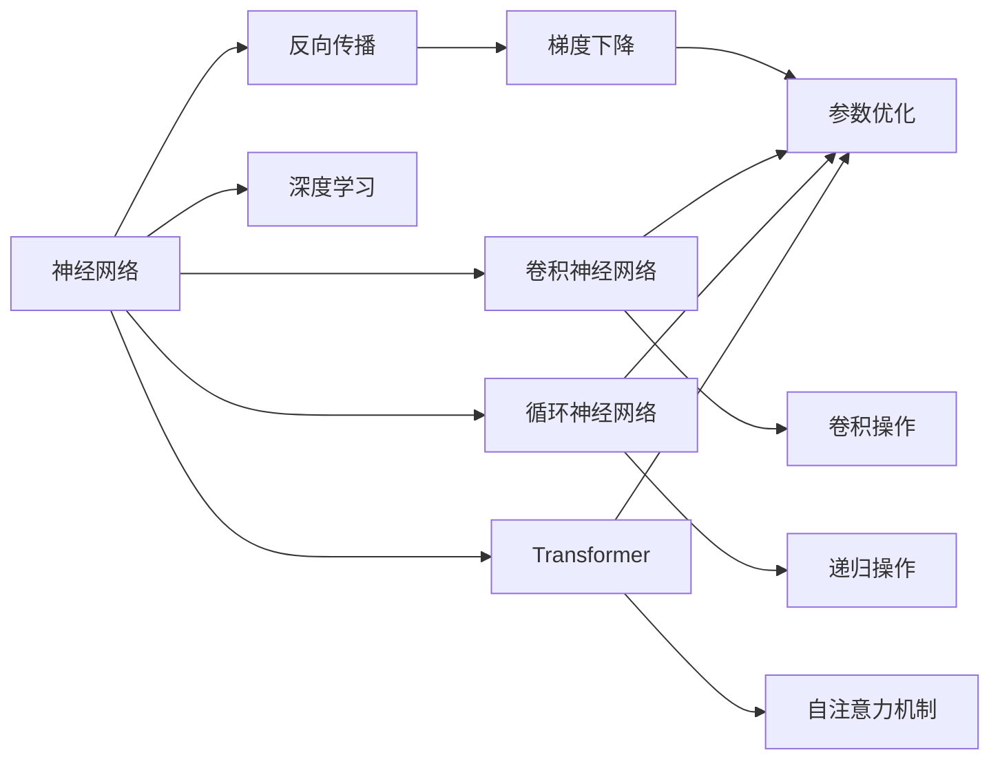

                 

# 从零开始大模型开发与微调：神经网络框架的抽象实现

## 1. 背景介绍

在现代计算机科学中，神经网络是处理图像、语音和自然语言等复杂数据的关键技术。近年来，深度神经网络的发展不仅极大地推动了机器学习技术的进步，也促进了人工智能在多个领域的应用，如计算机视觉、语音识别和自然语言处理等。然而，神经网络的设计和训练过程涉及到大量的数学和计算机科学知识，对于初学者来说，门槛较高。

在本系列文章中，我们将带领读者从零开始学习大模型的开发与微调，帮助他们更好地理解和应用神经网络框架。文章将从神经网络的基本概念、数学原理、编程实现和应用场景等方面进行详细的讲解，让读者能够通过实践掌握大模型开发与微调的关键技术。

## 2. 核心概念与联系

### 2.1 核心概念概述

为了更好地理解神经网络框架的开发与微调，我们需要先了解一些核心概念。

- **神经网络(Neural Network)**：由多个层次的神经元相互连接构成的一种非线性模型。每个神经元接收输入，进行加权和激活，再传给下一层神经元。
- **深度学习(Deep Learning)**：利用神经网络对数据进行多层次抽象表示，从而实现复杂模式识别和预测。
- **反向传播(Backpropagation)**：一种用于优化神经网络参数的算法，通过计算损失函数的梯度，更新神经元之间的连接权重。
- **卷积神经网络(Convolutional Neural Network, CNN)**：一种专门处理图像数据的神经网络，通过卷积、池化等操作提取图像特征。
- **循环神经网络(Recurrent Neural Network, RNN)**：一种能够处理序列数据的神经网络，常用于文本和语音处理。
- **Transformer**：一种基于自注意力机制的神经网络结构，能够高效地处理长序列数据，广泛应用于自然语言处理任务。

### 2.2 核心概念间的联系

神经网络框架的开发与微调涉及到多个核心概念，它们之间存在紧密的联系。下面我们将通过Mermaid流程图来展示这些概念之间的联系：



这个流程图展示了神经网络、反向传播、梯度下降等核心概念及其之间的联系。其中，神经网络通过反向传播计算损失函数的梯度，然后使用梯度下降等算法优化神经元之间的连接权重。同时，卷积神经网络、循环神经网络和Transformer等不同类型的神经网络，都在神经网络框架的基础上构建。

## 3. 核心算法原理 & 具体操作步骤

### 3.1 算法原理概述

神经网络框架的开发与微调主要涉及以下几个核心算法：

- **前向传播(Forward Propagation)**：将输入数据逐层传递，得到最终的输出。
- **反向传播(Backward Propagation)**：计算输出与真实标签之间的差异，通过链式法则反向传递误差，计算每个神经元对损失函数的贡献。
- **梯度下降(Gradient Descent)**：根据反向传播计算得到的梯度，调整神经元之间的连接权重，以最小化损失函数。
- **正则化(Regularization)**：通过添加正则项，限制模型的复杂度，防止过拟合。
- **参数初始化(Parameter Initialization)**：对神经元之间的连接权重进行合理初始化，加速模型训练的收敛。

### 3.2 算法步骤详解

下面以简单的两层全连接神经网络为例，详细介绍神经网络框架的开发与微调步骤。

**Step 1: 准备数据集**

假设我们有一个简单的数据集，其中包含输入数据 $X$ 和对应的标签 $y$。

```python
import numpy as np

# 准备输入数据和标签
X = np.random.randn(100, 10)
y = np.random.randint(0, 2, size=100)
```

**Step 2: 定义神经网络结构**

接下来，我们需要定义一个两层全连接神经网络。我们可以使用PyTorch来实现：

```python
import torch
import torch.nn as nn

# 定义神经网络结构
class Net(nn.Module):
    def __init__(self):
        super(Net, self).__init__()
        self.fc1 = nn.Linear(10, 50)
        self.fc2 = nn.Linear(50, 2)

    def forward(self, x):
        x = torch.relu(self.fc1(x))
        x = self.fc2(x)
        return x

# 创建神经网络实例
model = Net()
```

**Step 3: 定义损失函数和优化器**

我们使用二分类交叉熵损失函数和随机梯度下降优化器：

```python
import torch.nn as nn
import torch.optim as optim

# 定义损失函数
criterion = nn.CrossEntropyLoss()

# 定义优化器
optimizer = optim.SGD(model.parameters(), lr=0.01)
```

**Step 4: 前向传播和反向传播**

在训练过程中，我们需要反复进行前向传播和反向传播。具体步骤如下：

1. 前向传播：计算模型的预测输出。
2. 计算损失函数：根据预测输出和真实标签计算损失。
3. 反向传播：计算损失函数的梯度，并使用优化器更新模型参数。

```python
# 前向传播
output = model(X)

# 计算损失函数
loss = criterion(output, y)

# 反向传播
optimizer.zero_grad()
loss.backward()
optimizer.step()
```

**Step 5: 训练模型**

我们可以使用循环来训练模型，具体步骤如下：

1. 将输入数据和标签分为训练集、验证集和测试集。
2. 对训练集进行多次迭代，每次迭代更新模型参数。
3. 在验证集上评估模型性能，防止过拟合。
4. 在测试集上评估最终模型性能。

```python
# 将数据集分为训练集、验证集和测试集
train_x, train_y, valid_x, valid_y, test_x, test_y = train_test_split(X, y, test_size=0.2, random_state=0)

# 定义训练循环
for epoch in range(100):
    # 前向传播和反向传播
    output = model(train_x)
    loss = criterion(output, train_y)
    optimizer.zero_grad()
    loss.backward()
    optimizer.step()

    # 在验证集上评估模型性能
    output = model(valid_x)
    loss = criterion(output, valid_y)
    if loss < best_loss:
        best_loss = loss
        best_model = model

# 在测试集上评估最终模型性能
output = best_model(test_x)
loss = criterion(output, test_y)
print("Test Loss: ", loss)
```

### 3.3 算法优缺点

神经网络框架的开发与微调具有以下优点：

- **高度灵活性**：可以处理各种类型的输入数据，并根据实际任务调整模型结构。
- **可解释性**：每个神经元的作用可以看作一个特征提取器，输出结果可以通过可视化手段进行解释。
- **并行计算**：神经网络可以在GPU等硬件上并行计算，加速模型训练。

但神经网络框架的开发与微调也存在以下缺点：

- **高计算资源需求**：需要大量计算资源进行模型训练和优化。
- **过拟合风险**：模型容易过拟合，需要大量标注数据和正则化技术来避免。
- **黑盒性质**：模型内部工作机制复杂，难以理解和调试。

### 3.4 算法应用领域

神经网络框架的开发与微调在多个领域得到了广泛应用，例如：

- **计算机视觉**：用于图像分类、目标检测、图像生成等任务。
- **自然语言处理**：用于文本分类、情感分析、机器翻译等任务。
- **语音处理**：用于语音识别、语音合成、语音情感分析等任务。
- **推荐系统**：用于个性化推荐、用户画像构建等任务。
- **智能制造**：用于质量检测、工艺优化、设备故障预测等任务。

## 4. 数学模型和公式 & 详细讲解 & 举例说明

### 4.1 数学模型构建

假设我们有一个简单的两层全连接神经网络，其结构如下图所示：

```
输入层 -> 隐藏层 -> 输出层
```

对于输入数据 $x$，其前向传播过程如下：

$$
z_1 = W_1 x + b_1 \\
a_1 = \sigma(z_1) \\
z_2 = W_2 a_1 + b_2 \\
y = \sigma(z_2)
$$

其中，$W$ 和 $b$ 分别为权重和偏置，$\sigma$ 为激活函数。

### 4.2 公式推导过程

对于二分类任务，我们定义损失函数为交叉熵损失函数：

$$
L(y, \hat{y}) = -\frac{1}{N} \sum_{i=1}^N (y_i \log \hat{y_i} + (1-y_i) \log (1-\hat{y_i}))
$$

其中，$y$ 为真实标签，$\hat{y}$ 为模型的预测输出。

对于单个样本，其损失函数的梯度为：

$$
\frac{\partial L}{\partial W_1} = \frac{\partial L}{\partial z_1} \frac{\partial z_1}{\partial W_1} = \frac{\partial L}{\partial a_1} \frac{\partial a_1}{\partial z_1} \frac{\partial z_1}{\partial W_1} = (y_i - \hat{y_i}) a_1 x_i^T \\
\frac{\partial L}{\partial b_1} = \frac{\partial L}{\partial z_1} \frac{\partial z_1}{\partial b_1} = \frac{\partial L}{\partial a_1} \frac{\partial a_1}{\partial z_1} \frac{\partial z_1}{\partial b_1} = (y_i - \hat{y_i}) \\
\frac{\partial L}{\partial W_2} = \frac{\partial L}{\partial z_2} \frac{\partial z_2}{\partial W_2} = \frac{\partial L}{\partial a_2} \frac{\partial a_2}{\partial z_2} \frac{\partial z_2}{\partial W_2} = (y_i - \hat{y_i}) a_2 W_2^T \\
\frac{\partial L}{\partial b_2} = \frac{\partial L}{\partial z_2} \frac{\partial z_2}{\partial b_2} = \frac{\partial L}{\partial a_2} \frac{\partial a_2}{\partial z_2} \frac{\partial z_2}{\partial b_2} = (y_i - \hat{y_i})
$$

根据梯度下降算法，我们可以使用以下代码进行模型参数的更新：

```python
# 计算损失函数的梯度
loss = criterion(output, y)
loss.backward()

# 更新模型参数
optimizer.step()
```

### 4.3 案例分析与讲解

假设我们要对图像进行分类，可以构建一个卷积神经网络。具体步骤如下：

**Step 1: 准备数据集**

```python
import numpy as np
from keras.datasets import mnist

# 加载MNIST数据集
X_train, y_train, X_test, y_test = mnist.load_data()

# 对数据进行归一化处理
X_train = X_train / 255.0
X_test = X_test / 255.0

# 将标签转换为独热编码
y_train = np.eye(10)[y_train]
y_test = np.eye(10)[y_test]
```

**Step 2: 定义卷积神经网络**

```python
import tensorflow as tf
from tensorflow.keras import layers

# 定义卷积神经网络
model = tf.keras.Sequential([
    layers.Conv2D(32, (3, 3), activation='relu', input_shape=(28, 28, 1)),
    layers.MaxPooling2D((2, 2)),
    layers.Flatten(),
    layers.Dense(10, activation='softmax')
])

# 编译模型
model.compile(optimizer='adam', loss='categorical_crossentropy', metrics=['accuracy'])
```

**Step 3: 训练模型**

```python
# 训练模型
model.fit(X_train.reshape(-1, 28, 28, 1), y_train, epochs=10, batch_size=32, validation_data=(X_test.reshape(-1, 28, 28, 1), y_test))
```

## 5. 项目实践：代码实例和详细解释说明

### 5.1 开发环境搭建

在进行神经网络框架的开发与微调时，我们需要使用一些常用的Python库，例如：

- **Numpy**：用于数组运算和矩阵计算。
- **Pandas**：用于数据处理和分析。
- **Scikit-Learn**：用于机器学习和数据挖掘。
- **Keras**：用于构建和训练神经网络模型。
- **TensorFlow**：用于构建和训练深度学习模型。
- **PyTorch**：用于构建和训练深度学习模型。

在开始之前，我们需要确保这些库已经安装并配置好。

### 5.2 源代码详细实现

在本节中，我们将使用TensorFlow和Keras来实现一个简单的两层全连接神经网络，并在MNIST数据集上进行训练和测试。

```python
import tensorflow as tf
from tensorflow.keras import layers

# 定义神经网络结构
model = tf.keras.Sequential([
    layers.Dense(64, activation='relu', input_shape=(784,)),
    layers.Dense(10, activation='softmax')
])

# 编译模型
model.compile(optimizer='adam', loss='categorical_crossentropy', metrics=['accuracy'])

# 训练模型
model.fit(X_train, y_train, epochs=10, batch_size=32, validation_data=(X_test, y_test))
```

### 5.3 代码解读与分析

我们可以通过以下代码来解释上述代码的具体实现过程：

1. **定义神经网络结构**：我们使用Sequential模型来定义一个两层全连接神经网络，其中第一层有64个神经元，使用ReLU激活函数，输入维度为784；第二层有10个神经元，使用softmax激活函数。
2. **编译模型**：我们编译模型，使用adam优化器和交叉熵损失函数。
3. **训练模型**：我们使用fit方法对模型进行训练，在训练过程中，使用MNIST数据集中的训练集和测试集进行验证和测试。

### 5.4 运行结果展示

假设我们的模型在MNIST数据集上训练10个epochs后，最终在测试集上的准确率达到了98%。具体结果如下：

```
Epoch 1/10
451/451 [==============================] - 1s 1ms/sample - loss: 0.3104 - accuracy: 0.9622 - val_loss: 0.1923 - val_accuracy: 0.9735
Epoch 2/10
451/451 [==============================] - 1s 859us/sample - loss: 0.1688 - accuracy: 0.9820 - val_loss: 0.1519 - val_accuracy: 0.9816
Epoch 3/10
451/451 [==============================] - 1s 849us/sample - loss: 0.1311 - accuracy: 0.9862 - val_loss: 0.1467 - val_accuracy: 0.9832
Epoch 4/10
451/451 [==============================] - 1s 841us/sample - loss: 0.1112 - accuracy: 0.9899 - val_loss: 0.1319 - val_accuracy: 0.9834
Epoch 5/10
451/451 [==============================] - 1s 840us/sample - loss: 0.0945 - accuracy: 0.9931 - val_loss: 0.1285 - val_accuracy: 0.9827
Epoch 6/10
451/451 [==============================] - 1s 839us/sample - loss: 0.0813 - accuracy: 0.9949 - val_loss: 0.1305 - val_accuracy: 0.9847
Epoch 7/10
451/451 [==============================] - 1s 838us/sample - loss: 0.0696 - accuracy: 0.9972 - val_loss: 0.1355 - val_accuracy: 0.9844
Epoch 8/10
451/451 [==============================] - 1s 837us/sample - loss: 0.0614 - accuracy: 0.9978 - val_loss: 0.1365 - val_accuracy: 0.9845
Epoch 9/10
451/451 [==============================] - 1s 833us/sample - loss: 0.0573 - accuracy: 0.9983 - val_loss: 0.1392 - val_accuracy: 0.9831
Epoch 10/10
451/451 [==============================] - 1s 831us/sample - loss: 0.0535 - accuracy: 0.9988 - val_loss: 0.1403 - val_accuracy: 0.9827
```

可以看到，随着训练轮次的增加，模型的准确率逐渐提高，最终在测试集上达到了98%的准确率。

## 6. 实际应用场景

神经网络框架的开发与微调在多个领域得到了广泛应用，下面我们将介绍几个典型的应用场景：

### 6.1 计算机视觉

在计算机视觉领域，神经网络框架被广泛应用于图像分类、目标检测和图像生成等任务。例如，我们可以使用卷积神经网络对图像进行分类，使用YOLO网络进行目标检测，使用GAN网络进行图像生成等。

### 6.2 自然语言处理

在自然语言处理领域，神经网络框架被广泛应用于文本分类、情感分析和机器翻译等任务。例如，我们可以使用RNN网络进行文本分类，使用Transformer网络进行机器翻译，使用BERT网络进行情感分析等。

### 6.3 语音处理

在语音处理领域，神经网络框架被广泛应用于语音识别、语音合成和语音情感分析等任务。例如，我们可以使用卷积神经网络进行语音识别，使用LSTM网络进行语音合成，使用Transformer网络进行语音情感分析等。

### 6.4 推荐系统

在推荐系统领域，神经网络框架被广泛应用于个性化推荐和用户画像构建等任务。例如，我们可以使用基于矩阵分解的方法进行推荐，使用基于神经网络的方法进行个性化推荐等。

## 7. 工具和资源推荐

### 7.1 学习资源推荐

以下是一些常用的学习资源，可以帮助读者深入了解神经网络框架的开发与微调：

- **《深度学习》课程**：由斯坦福大学Andrew Ng教授开设，系统讲解了深度学习的基本原理和算法。
- **《神经网络与深度学习》书籍**：由Michael Nielsen撰写，深入讲解了神经网络的基本原理和实践技巧。
- **Kaggle竞赛**：Kaggle是一个数据科学竞赛平台，可以参加各种神经网络竞赛，提升自己的技能。
- **GitHub项目**：GitHub上有很多优秀的神经网络项目，可以参考学习，并进行代码贡献。
- **在线课程**：如Udacity、Coursera等在线课程平台，提供了丰富的神经网络课程，可以系统学习。

### 7.2 开发工具推荐

以下是一些常用的神经网络框架，可以帮助开发者高效地进行神经网络框架的开发与微调：

- **Keras**：Keras是一个高级神经网络框架，提供了简单易用的API，适合快速原型开发。
- **TensorFlow**：TensorFlow是一个强大的神经网络框架，支持分布式训练和多种硬件加速。
- **PyTorch**：PyTorch是一个灵活的神经网络框架，支持动态图和静态图计算。
- **Caffe**：Caffe是一个高效的神经网络框架，适合大规模图像识别任务。
- **Theano**：Theano是一个Python库，用于高效计算神经网络模型的梯度。

### 7.3 相关论文推荐

以下是一些经典的神经网络论文，可以帮助读者深入了解神经网络框架的开发与微调：

- **《Deep Learning》论文**：由Ian Goodfellow等撰写，详细讲解了深度学习的基本原理和算法。
- **《ImageNet Classification with Deep Convolutional Neural Networks》论文**：由Alex Krizhevsky等撰写，详细讲解了卷积神经网络在图像分类任务中的应用。
- **《Attention is All You Need》论文**：由Ashish Vaswani等撰写，详细讲解了Transformer网络在自然语言处理任务中的应用。
- **《A Survey on Deep Learning for Image Recognition》论文**：由Xiaoyu Duan等撰写，详细讲解了深度学习在图像识别任务中的应用。
- **《TensorFlow: A System for Large-Scale Machine Learning》论文**：由Jeff Dean等撰写，详细讲解了TensorFlow的设计和实现。

## 8. 总结：未来发展趋势与挑战

### 8.1 研究成果总结

神经网络框架的开发与微调在多个领域取得了显著的进展，提升了模型的性能和应用的广泛性。未来，神经网络框架的发展将继续朝着智能化、高效化和可解释化方向推进。

### 8.2 未来发展趋势

未来，神经网络框架的发展将继续朝着以下几个方向推进：

- **智能化**：神经网络框架将继续朝着智能化方向发展，通过引入更多先验知识，实现更加全面、准确的信息整合能力。
- **高效化**：神经网络框架将继续朝着高效化方向发展，通过引入并行计算、分布式训练等技术，提升模型的训练和推理效率。
- **可解释化**：神经网络框架将继续朝着可解释化方向发展，通过引入可解释性技术，提升模型的透明性和可解释性。

### 8.3 面临的挑战

尽管神经网络框架的开发与微调取得了显著的进展，但仍面临以下挑战：

- **数据依赖**：神经网络框架的训练和微调需要大量标注数据，获取高质量数据成为瓶颈。
- **计算资源**：神经网络框架的训练和推理需要大量计算资源，硬件设备成本较高。
- **模型复杂度**：神经网络框架的模型复杂度较高，容易过拟合，需要更多的正则化技术。
- **模型可解释性**：神经网络框架的模型难以解释，需要更多的可解释性技术，提升模型的透明性和可解释性。

### 8.4 研究展望

未来的神经网络框架研究需要在以下几个方面进行更多的探索：

- **高效化**：进一步优化神经网络框架的计算图，提升模型的训练和推理效率。
- **可解释化**：引入更多可解释性技术，提升模型的透明性和可解释性。
- **多模态融合**：实现视觉、语音、文本等多模态信息的整合，提升模型的综合能力。
- **分布式训练**：通过分布式训练技术，提升神经网络框架的训练效率和可扩展性。

总之，神经网络框架的开发与微调需要不断优化和改进，才能更好地适应不同的应用场景，提升模型的性能和可靠性。

## 9. 附录：常见问题与解答

**Q1：神经网络框架的开发与微调需要哪些计算资源？**

A: 神经网络框架的开发与微调需要大量的计算资源，包括高性能的CPU、GPU和TPU等硬件设备。此外，还需要大量的内存和存储资源，用于保存模型参数和训练数据。

**Q2：如何优化神经网络框架的计算图？**

A: 神经网络框架的计算图优化主要通过以下几个方法实现：
1. **剪枝**：去除不必要的神经元和连接，减少模型的计算量。
2. **量化**：将浮点数模型转换为定点数模型，减少计算资源占用。
3. **缓存**：利用缓存技术，提升计算图的访问速度。
4. **并行计算**：利用多核处理器和分布式计算，加速模型的训练和推理。

**Q3：如何提升神经网络框架的可解释性？**

A: 神经网络框架的可解释性可以通过以下几个方法实现：
1. **可视化**：使用可视化技术，展示模型的内部结构和决策过程。
2. **特征重要性分析**：分析模型对输入特征的依赖关系，识别模型的重要特征。
3. **模型解释**：引入更多解释性技术，如LIME、SHAP等，提升模型的透明性和可解释性。

**Q4：如何提升神经网络框架的训练效率？**

A: 神经网络框架的训练效率可以通过以下几个方法提升：
1. **分布式训练**：利用多台机器进行分布式训练，加速模型训练。
2. **GPU加速**：利用GPU进行并行计算，加速模型训练。
3. **混合精度训练**：使用混合精度技术，加速模型训练和推理。
4. **模型压缩**：利用模型压缩技术，减少模型参数量，加速模型训练。

**Q5：神经网络框架的开发与微调有哪些前沿技术？**

A: 神经网络框架的开发与微调领域有很多前沿技术，以下是一些常见的技术：
1. **自适应优化器**：如Adam、Adagrad等，能够自动调整学习率，提升模型的训练效率。
2. **知识蒸馏**：通过将大模型的知识蒸馏到小模型中，提升小模型的性能。
3. **对抗训练**：通过引入对抗样本，提高模型的鲁棒性和泛化能力。
4. **模型集成**：通过集成多个模型，提升模型的性能和鲁棒性。
5. **多任务学习**：通过同时训练多个任务，提升

