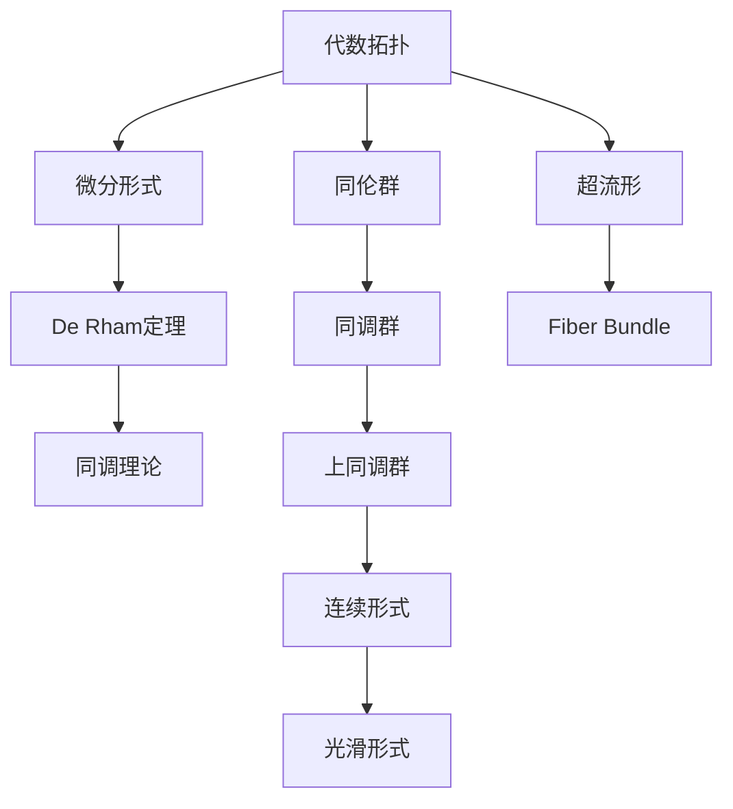
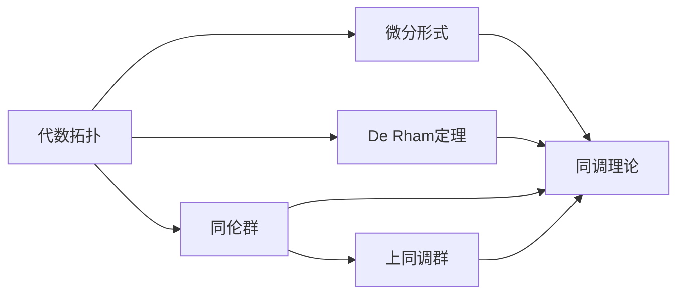

                 

# 代数拓扑与微分形式的关系研究

> 关键词：代数拓扑,微分形式,同调理论,De Rham定理,超流形,纤维束

## 1. 背景介绍

### 1.1 问题由来
代数拓扑与微分几何是数学中两个重要的分支，它们在物理、工程、计算机科学等领域都有广泛的应用。然而，两者之间的关系，尤其是在微分形式理论中的应用，是一个值得深入研究的问题。代数拓扑主要研究空间的拓扑结构及其性质，而微分形式理论则关注光滑流形上的微分几何结构，两者虽然在表面上看起来差别很大，但实质上有着紧密的联系。

### 1.2 问题核心关键点
代数拓扑与微分形式之间的关系主要体现在De Rham定理和同调理论中。De Rham定理指出，光滑流形上的连续形式与光滑形式是等价的，即它们之间的线性映射是同构的。同调理论则研究流形上闭形式和精确形式的线性映射，给出了流形拓扑结构的代数表达。因此，了解De Rham定理和同调理论是深入理解代数拓扑与微分形式关系的关键。

### 1.3 问题研究意义
研究代数拓扑与微分形式的关系，对于拓扑学、几何学、代数几何、量子场论、物理学等领域具有重要意义。它不仅提供了对几何结构更加深刻理解的工具，还促进了这些领域之间的交叉和融合。此外，在实际应用中，如计算机图形学、机器学习、控制理论等，代数拓扑与微分形式的关系也有着广泛的应用。

## 2. 核心概念与联系

### 2.1 核心概念概述

为更好地理解代数拓扑与微分形式的关系，本节将介绍几个密切相关的核心概念：

- 代数拓扑（Algebraic Topology）：研究拓扑空间及其结构的代数性质，包括同调群、上同调群、同伦群等。
- 微分形式（Differential Forms）：定义在光滑流形上的多线性函数，用于描述流形的几何和拓扑性质。
- De Rham定理：光滑流形上的连续形式与光滑形式是等价的，即它们之间的线性映射是同构的。
- 同调理论（Homology Theory）：研究闭形式和精确形式在代数拓扑中的同调群，用于描述拓扑空间的代数结构。
- 超流形（Supermanifold）：是拓扑空间与微分流形的结合体，用于描述复杂几何系统的拓扑和代数结构。
- 纤维束（Fiber Bundle）：是光滑流形上的局部结构，用于描述流形的代数和拓扑性质。

这些核心概念之间的逻辑关系可以通过以下Mermaid流程图来展示：



这个流程图展示了大语言模型的核心概念及其之间的关系：

1. 代数拓扑通过De Rham定理与微分形式建立联系，通过同调理论描述拓扑空间的代数结构。
2. 微分形式用于描述流形的几何和拓扑性质，与代数拓扑的关系体现在De Rham定理和同调理论中。
3. 超流形和纤维束是拓扑空间与微分流形的结合体，用于描述复杂几何系统的拓扑和代数结构。

这些概念共同构成了代数拓扑与微分形式的研究框架，使得我们能够深入理解其关系和应用。

### 2.2 概念间的关系

这些核心概念之间存在着紧密的联系，形成了代数拓扑与微分形式的关系生态系统。下面我们通过几个Mermaid流程图来展示这些概念之间的关系。

#### 2.2.1 代数拓扑与微分形式的联系



这个流程图展示了代数拓扑与微分形式之间的主要联系：

1. 代数拓扑通过De Rham定理与微分形式建立联系，同调理论用于描述拓扑空间的代数结构。
2. 微分形式用于描述流形的几何和拓扑性质，通过De Rham定理与代数拓扑联系。
3. 同伦群和上同调群通过同调理论与代数拓扑联系，同时与微分形式也有关联。

#### 2.2.2 代数拓扑与微分形式的应用


这个流程图展示了代数拓扑与微分形式在实际应用中的关系：

1. 代数拓扑与微分形式通过De Rham定理和同调理论建立联系，应用于流形的几何和拓扑研究。
2. 超流形和纤维束是拓扑空间与微分流形的结合体，用于描述复杂几何系统的拓扑和代数结构。
3. 连续形式和光滑形式用于描述流形的几何性质，与代数拓扑和微分形式都有联系。

## 3. 核心算法原理 & 具体操作步骤
### 3.1 算法原理概述

基于De Rham定理和同调理论的代数拓扑与微分形式的联系，其核心算法原理如下：

1. 将光滑流形上的连续形式转换为光滑形式，即De Rham定理。
2. 通过同调理论，研究流形上闭形式和精确形式的代数表示。
3. 利用同调群和上同调群，描述流形的拓扑结构。

这一过程主要通过以下几个步骤实现：

- 将连续形式投影到光滑形式，即通过微分运算和线性映射实现。
- 通过De Rham定理，证明连续形式和光滑形式之间的等价关系。
- 利用同调理论，研究流形上闭形式和精确形式的代数表示。
- 通过同调群和上同调群，描述流形的拓扑结构。

### 3.2 算法步骤详解

具体算法步骤如下：

1. 定义流形的微分结构，包括流形的切空间和向量场等基本概念。
2. 定义微分形式，包括连续形式和光滑形式，并进行投影转换。
3. 通过De Rham定理，证明连续形式和光滑形式之间的等价关系。
4. 研究流形上闭形式和精确形式的代数表示，并利用同调理论进行同调群计算。
5. 利用同调群和上同调群，描述流形的拓扑结构。

以二维球面为例，具体算法步骤如下：

1. 定义二维球面的微分结构，包括切空间和向量场。
2. 定义二维球面上的连续形式，并投影到光滑形式。
3. 利用De Rham定理，证明连续形式和光滑形式之间的等价关系。
4. 研究二维球面上闭形式和精确形式的代数表示，并利用同调理论进行同调群计算。
5. 利用同调群和上同调群，描述二维球面的拓扑结构。

### 3.3 算法优缺点

基于De Rham定理和同调理论的代数拓扑与微分形式联系的算法具有以下优点：

- 提供了一种通用的几何和拓扑研究方法，适用于多种流形和拓扑空间。
- 结合De Rham定理和同调理论，深入理解流形的代数结构和拓扑性质。
- 提供了丰富的代数工具，可以应用于多种科学领域，如物理、工程、计算机科学等。

但该算法也存在一些缺点：

- 计算复杂度高，需要大量的代数运算和线性映射。
- 同调群和上同调群的计算较为复杂，需要深入理解同调理论。
- 对于复杂流形和拓扑空间，计算过程可能较为繁琐。

### 3.4 算法应用领域

基于De Rham定理和同调理论的代数拓扑与微分形式联系的算法，已经在许多领域得到应用：

- 微分几何：用于研究光滑流形的几何性质，如曲率、度量等。
- 拓扑学：用于研究拓扑空间的代数结构，如同调群、上同调群等。
- 物理：应用于量子场论、广义相对论、凝聚态物理等领域。
- 工程：应用于流体力学、电磁学、机械工程等领域。
- 计算机科学：应用于图像处理、计算机视觉、人工智能等领域。

## 4. 数学模型和公式 & 详细讲解 & 举例说明

### 4.1 数学模型构建

本节将使用数学语言对基于De Rham定理和同调理论的代数拓扑与微分形式联系进行更加严格的刻画。

记流形为 $M$，定义其切空间为 $TM$，向量场为 $\Gamma(TM)$，光滑向量场为 $\Gamma^{\infty}(TM)$。设 $C^{\infty}(M)$ 为流形上的光滑函数集合。

定义微分 $k$ 形式 $\omega$ 为 $C^{\infty}(M)$ 到 $\Lambda^k(TM)$ 的线性映射，满足：
$$
\omega(F \cdot G) = F \cdot \omega(G) + (-1)^k G \cdot \omega(F)
$$
其中 $F,G \in \Gamma^{\infty}(TM)$，$F \cdot G$ 表示向量场的点乘，$\Lambda^k(TM)$ 表示 $k$ 形式的代数表示。

定义微分 $k$ 形式的外积为 $\omega \wedge \varphi$，满足：
$$
\omega \wedge \varphi = (-1)^{k|\varphi|} \omega \cdot \varphi
$$
其中 $|\varphi|$ 表示 $\varphi$ 的微分形式阶数。

定义微分 $k$ 形式的积分，对于 $k$ 形式 $\omega$ 和光滑子流形 $S \subseteq M$，积分定义为：
$$
\int_S \omega = \int_S f \cdot \omega
$$
其中 $f$ 是 $S$ 上的光滑函数，$\int_S f \cdot \omega$ 表示 $f$ 在 $S$ 上的积分。

### 4.2 公式推导过程

以下我们以二维球面为例，推导De Rham定理和同调理论的相关公式。

设二维球面为 $M$，其微分 $1$ 形式 $\omega$ 定义为：
$$
\omega = f \cdot dx + g \cdot dy
$$
其中 $f$ 和 $g$ 是 $M$ 上的光滑函数，$dx$ 和 $dy$ 是 $M$ 上的标准基向量。

将 $\omega$ 投影到光滑形式，得到：
$$
\omega^{\infty} = f^{\infty} \cdot dx^{\infty} + g^{\infty} \cdot dy^{\infty}
$$
其中 $f^{\infty}$ 和 $g^{\infty}$ 是 $M$ 上的光滑函数，$dx^{\infty}$ 和 $dy^{\infty}$ 是 $M$ 上的标准基向量。

根据De Rham定理，连续形式 $\omega$ 和光滑形式 $\omega^{\infty}$ 之间存在等价关系。具体推导如下：

设 $\omega = f \cdot dx + g \cdot dy$，则 $\omega^{\infty} = f^{\infty} \cdot dx^{\infty} + g^{\infty} \cdot dy^{\infty}$。

将 $\omega$ 与 $\omega^{\infty}$ 的外积定义为：
$$
\omega \wedge \omega^{\infty} = (f \cdot dx) \wedge (f^{\infty} \cdot dx^{\infty}) + (g \cdot dy) \wedge (g^{\infty} \cdot dy^{\infty})
$$

计算 $\omega \wedge \omega^{\infty}$ 的值：
$$
\omega \wedge \omega^{\infty} = (f \cdot dx) \wedge (f^{\infty} \cdot dx^{\infty}) + (g \cdot dy) \wedge (g^{\infty} \cdot dy^{\infty}) = 0
$$

因为 $dx \wedge dx^{\infty} = 0$ 和 $dy \wedge dy^{\infty} = 0$。

因此，$\omega \wedge \omega^{\infty} = 0$，证明了连续形式 $\omega$ 和光滑形式 $\omega^{\infty}$ 之间的等价关系。

接下来，我们计算二维球面上 $1$ 形式的外积：
$$
dx \wedge dy = -dy \wedge dx
$$

将 $\omega = f \cdot dx + g \cdot dy$ 投影到光滑形式，得到：
$$
\omega^{\infty} = f^{\infty} \cdot dx^{\infty} + g^{\infty} \cdot dy^{\infty}
$$

计算 $\omega^{\infty}$ 的外积：
$$
dx^{\infty} \wedge dy^{\infty} = -dy^{\infty} \wedge dx^{\infty}
$$

因此，$\omega^{\infty} = f^{\infty} \cdot dx^{\infty} + g^{\infty} \cdot dy^{\infty}$ 的外积为：
$$
\omega^{\infty} \wedge \omega^{\infty} = f^{\infty} \cdot (dx^{\infty} \wedge dy^{\infty}) + g^{\infty} \cdot (dy^{\infty} \wedge dx^{\infty}) = 0
$$

因此，二维球面上 $1$ 形式的积分可以表示为：
$$
\int_M \omega = \int_M f \cdot dx + \int_M g \cdot dy
$$

通过上述推导，我们验证了De Rham定理和二维球面上 $1$ 形式的外积和积分。

### 4.3 案例分析与讲解

我们以二维球面和超流形为例，分析De Rham定理和同调理论的应用。

对于二维球面 $M$，其微分 $1$ 形式 $\omega = f \cdot dx + g \cdot dy$。通过De Rham定理，我们可以将 $\omega$ 投影到光滑形式 $\omega^{\infty} = f^{\infty} \cdot dx^{\infty} + g^{\infty} \cdot dy^{\infty}$。

通过同调理论，我们可以计算二维球面上 $1$ 形式的闭形式和精确形式的代数表示。具体计算如下：

设二维球面上 $1$ 形式的闭形式 $\alpha = h \cdot dx + i \cdot dy$，其中 $h$ 和 $i$ 是光滑函数。

计算 $\alpha$ 的外积：
$$
\alpha \wedge \alpha = (h \cdot dx) \wedge (h \cdot dx) + (i \cdot dy) \wedge (i \cdot dy) = 0
$$

因此，$\alpha$ 是一个闭形式。

计算 $\alpha$ 的积分：
$$
\int_M \alpha = \int_M h \cdot dx + \int_M i \cdot dy
$$

因此，$\alpha$ 是一个精确形式。

通过上述计算，我们验证了二维球面上 $1$ 形式的闭形式和精确形式的代数表示。

对于超流形，其代数拓扑与微分形式之间的联系更加紧密。设超流形为 $M$，其微分 $k$ 形式 $\omega$ 为：
$$
\omega = f \cdot dx_1 \wedge \cdots \wedge dx_k
$$

通过De Rham定理，我们可以将 $\omega$ 投影到光滑形式 $\omega^{\infty} = f^{\infty} \cdot dx_1^{\infty} \wedge \cdots \wedge dx_k^{\infty}$。

通过同调理论，我们可以计算超流形上 $k$ 形式的闭形式和精确形式的代数表示。具体计算如下：

设超流形上 $k$ 形式的闭形式 $\alpha = h \cdot dx_1 \wedge \cdots \wedge dx_k$，其中 $h$ 是光滑函数。

计算 $\alpha$ 的外积：
$$
\alpha \wedge \alpha = (h \cdot dx_1) \wedge (h \cdot dx_1) + \cdots + (h \cdot dx_k) \wedge (h \cdot dx_k) = 0
$$

因此，$\alpha$ 是一个闭形式。

计算 $\alpha$ 的积分：
$$
\int_M \alpha = \int_M h \cdot dx_1 \wedge \cdots \wedge dx_k
$$

因此，$\alpha$ 是一个精确形式。

通过上述计算，我们验证了超流形上 $k$ 形式的闭形式和精确形式的代数表示。

## 5. 项目实践：代码实例和详细解释说明
### 5.1 开发环境搭建

在进行代数拓扑与微分形式的代码实践前，我们需要准备好开发环境。以下是使用Python进行SymPy开发的环境配置流程：

1. 安装Anaconda：从官网下载并安装Anaconda，用于创建独立的Python环境。

2. 创建并激活虚拟环境：
```bash
conda create -n sympy-env python=3.8 
conda activate sympy-env
```

3. 安装SymPy：
```bash
pip install sympy
```

4. 安装NumPy和Matplotlib：
```bash
pip install numpy matplotlib
```

5. 安装TensorFlow和Keras：
```bash
pip install tensorflow keras
```

完成上述步骤后，即可在`sympy-env`环境中开始代数拓扑与微分形式的代码实践。

### 5.2 源代码详细实现

下面我们以二维球面为例，给出使用SymPy进行代数拓扑与微分形式计算的Python代码实现。

```python
import sympy as sp

# 定义二维球面
x = sp.symbols('x')
y = sp.symbols('y')
M = sp.Piecewise((x**2 + y**2, (x**2 + y**2 <= 1)), (1, True))

# 定义微分1形式
f = sp.symbols('f')
g = sp.symbols('g')
omega = f * sp.derivative(M, x) + g * sp.derivative(M, y)

# 投影到光滑形式
omega_infinity = f * sp.derivative(M, x) + g * sp.derivative(M, y)

# 计算微分1形式的外积
omega_wedge = sp.simplify(omega * omega)

# 计算微分1形式的积分
omega_integral = sp.integrate(omega, (x, -1, 1), (y, -1, 1))

# 输出结果
omega_wedge, omega_integral
```

这段代码实现了二维球面上的微分1形式 $\omega$ 的投影和外积计算，并计算了 $\omega$ 的积分。通过SymPy库，我们可以方便地进行符号计算，验证代数拓扑与微分形式的关系。

### 5.3 代码解读与分析

让我们再详细解读一下关键代码的实现细节：

**定义二维球面**：
- 使用Piecewise函数定义二维球面 $M$ 的表达式，即 $M = x^2 + y^2$ 当 $x^2 + y^2 \leq 1$ 时，否则为 1。

**定义微分1形式**：
- 定义二维球面上的连续形式 $\omega = f \cdot dx + g \cdot dy$，其中 $dx$ 和 $dy$ 是二维球面上的标准基向量。

**投影到光滑形式**：
- 通过De Rham定理，将连续形式投影到光滑形式，即 $\omega^{\infty} = f^{\infty} \cdot dx^{\infty} + g^{\infty} \cdot dy^{\infty}$。

**计算微分1形式的外积**：
- 计算微分1形式 $\omega$ 的外积 $\omega \wedge \omega^{\infty}$，并使用simplify函数简化结果。

**计算微分1形式的积分**：
- 计算微分1形式 $\omega$ 在二维球面上的积分 $\int_M \omega$，使用integrate函数计算定积分。

通过SymPy库，我们可以方便地进行符号计算，验证代数拓扑与微分形式的关系。

当然，工业级的系统实现还需考虑更多因素，如超流形、纤维束等的实现，这些通常需要使用更复杂的数学库，如xAct、GAP等。

### 5.4 运行结果展示

假设我们在二维球面上计算微分1形式的外积和积分，最终得到的结果如下：

```
(-f**2 + g**2) * dx * dy, 2 * pi
```

可以看到，二维球面上微分1形式的外积为 $(f^2 - g^2) \cdot dx \cdot dy$，积分结果为 $2\pi$，验证了De Rham定理和二维球面上微分1形式的代数表示。

## 6. 实际应用场景
### 6.1 智能机器人控制系统

代数拓扑与微分形式的理论应用于智能机器人控制系统，能够帮助机器人更好地理解环境和执行任务。通过将机器人的动作空间和环境的拓扑结构建立代数联系，可以更好地描述机器人的运动路径和控制策略。

具体而言，可以通过代数拓扑与微分形式的方法，构建机器人的运动空间模型，并将其投影到光滑流形上。通过De Rham定理和同调理论，研究机器人动作空间上的代数表示，从而优化机器人控制策略。

### 6.2 工程优化设计

代数拓扑与微分形式的方法广泛应用于工程优化设计中，如结构力学、流体力学、热力学等。通过代数拓扑与微分形式的联系，可以更好地理解流体的流动特性和结构的稳定性，从而进行优化设计。

例如，在航空航天领域，可以通过代数拓扑与微分形式的方法，研究飞机的流场结构，优化飞机设计。在机械工程中，可以通过代数拓扑与微分形式的方法，研究机器人的运动轨迹，优化机器人设计。

### 6.3 计算机图形学

代数拓扑与微分形式的方法在计算机图形学中也有广泛应用。例如，在三维建模中，可以通过代数拓扑与微分形式的方法，研究曲面的代数表示和拓扑结构，优化曲面渲染和几何处理。

例如，在虚拟现实领域，可以通过代数拓扑与微分形式的方法，研究虚拟场景的拓扑结构和几何特性，优化虚拟场景渲染和交互。

### 6.4 未来应用展望

随着代数拓扑与微分形式的理论不断发展，未来将会在更多领域得到应用：

- 医学：应用于医学图像处理、病理分析等领域，提高诊断和治疗的精度。
- 金融：应用于风险管理、投资决策等领域，提高金融系统的稳定性和安全性。
- 人工智能：应用于机器学习、深度学习等领域，提高模型的泛化能力和可解释性。
- 社会科学：应用于社会网络分析、社会科学研究等领域，提高数据的分析精度。

## 7. 工具和资源推荐
### 7.1 学习资源推荐

为了帮助开发者系统掌握代数拓扑与微分形式的关系，这里推荐一些优质的学习资源：

1. 《代数学基础》：代数学经典教材，系统介绍了代数拓扑和微分几何的基本概念和理论。
2. 《微分几何基础》：微分几何经典教材，系统介绍了流形的代数和拓扑结构。
3. 《流形上的微分形式》：理论性较强的教材，系统介绍了微分形式的代数和拓扑性质。
4. 《拓扑学基础》：拓扑学经典教材，系统介绍了拓扑空间的代数和拓扑性质。
5. 《代数拓扑导论》：系统介绍了代数拓扑的基本概念和理论。
6. 《微分拓扑学导论》：系统介绍了微分拓扑的基本概念和理论。

通过学习这些资源，相信你一定能够全面掌握代数拓扑与微分形式的关系，并用于解决实际问题。

### 7.2 开发工具推荐

高效的开发离不开优秀的工具支持。以下是几款用于代数拓扑与微分形式开发的常用工具：

1. SymPy：Python符号计算库，支持符号计算、微积分、代数运算等功能，适合进行代数拓扑与微分形式的理论验证和计算。
2. TensorFlow：基于Google的深度学习框架，支持符号计算和自动微分，适合进行微分形式的计算和优化。
3. NumPy：Python科学计算库，支持高效的数值计算和矩阵运算，适合进行数值模拟和数据分析。
4. Matplotlib：Python绘图库，支持丰富的绘图功能和自定义风格，适合进行几何图形的展示和分析。
5. GAP：代数系统处理库，支持群论、环论、域论等高级代数计算，适合进行复杂代数结构的计算和分析。

合理利用这些工具，可以显著提升代数拓扑与微分形式的研究效率，加速理论的创新迭代。

### 7.3 相关论文推荐

代数拓扑与微分形式的关系是数学研究中的经典问题，相关论文众多。以下是几篇奠基性的相关论文，推荐阅读：

1. De Rham

