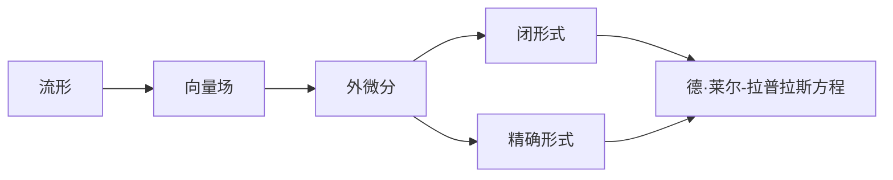
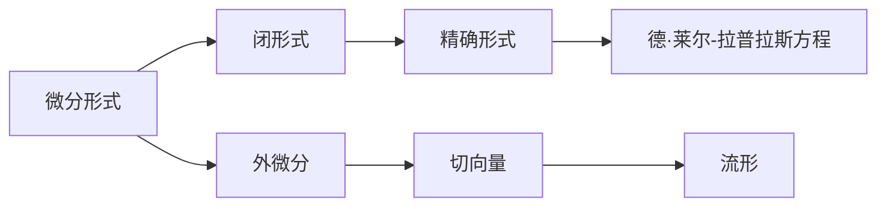

                 

# 代数拓扑中的微分形式概述

在数学中，代数拓扑是一种研究空间结构和性质的抽象方法，不考虑具体的几何特性，例如长度、角度、曲率等，而关注于空间中对象的位置关系和它们如何被连接。微分形式理论是代数拓扑中的一个重要分支，它将微分几何的概念和技术应用于拓扑学的研究中，提供了处理复杂拓扑问题的新视角。

## 1. 背景介绍

### 1.1 问题由来

微分形式理论起源于19世纪末的数学物理领域，其核心思想是通过引入微分形式和外微分运算，对流形上向量场的性质进行研究。最初，这种理论主要用于解决经典力学和电动力学中的问题，如电磁场和流体的动力学。后来，随着拓扑学的发展，微分形式理论在研究流形的同调群和辛几何等方面也展现出了强大的应用潜力。

### 1.2 问题核心关键点

微分形式理论的核心关键点包括：
- 微分形式：定义在流形上的多线性函数，其值与局部坐标无关，只取决于流形的拓扑结构。
- 外微分：一种将向量场推广到流形上的运算，可以保持连续性和可微性。
- 闭形式与精确形式：外微分可唯一分解为闭形式与精确形式的和，闭形式是周期性的，而精确形式则是源和汇的差。

### 1.3 问题研究意义

微分形式理论在拓扑学中有广泛的应用，包括：
- 流形的同调群研究：通过研究闭形式和精确形式，可以得到流形的同调群的信息。
- 辛几何：微分形式理论提供了研究辛流形的工具，辛几何在物理中有着重要的应用，如经典力学和量子力学。
- 向量场的性质研究：微分形式理论可以用来研究向量场的连续性和可微性，以及它们的局部和全局性质。
- 拓扑分类：微分形式理论为拓扑分类问题提供了新的工具，帮助解决许多难以用代数方法处理的复杂问题。

## 2. 核心概念与联系

### 2.1 核心概念概述

为了更好地理解微分形式理论，本节将介绍几个密切相关的核心概念：

- **流形(Manifold)**：局部可导的拓扑空间，具有光滑结构。流形可以是高维的，也可以是一维的。
- **切向量(Tangent Vector)**：定义在流形上的向量场，表示从一点到一点的切线方向。
- **外微分(Differential)**：一种将向量场推广到流形上的运算，保持连续性和可微性。
- **闭形式(Closed Form)**：外微分后仍是自身的向量场，周期性，与局部坐标无关。
- **精确形式(Exact Form)**：外微分为零的向量场，表示有源或汇。
- **德·莱尔-拉普拉斯方程(De Rham Laplacian)**：用来计算向量场的散度。

这些核心概念之间的逻辑关系可以通过以下Mermaid流程图来展示：


这个流程图展示了几何量之间的联系，即切向量通过外微分可以转化为闭形式和精确形式，而德·莱尔-拉普拉斯方程则用于计算这两种形式的性质。

### 2.2 概念间的关系

这些核心概念之间存在着紧密的联系，形成了微分形式理论的整体框架。下面我们通过几个Mermaid流程图来展示这些概念之间的关系。

#### 2.2.1 流形上的向量场运算



这个流程图展示了流形上向量场的运算过程，包括外微分、闭形式、精确形式和德·莱尔-拉普拉斯方程的计算。

#### 2.2.2 微分形式与同调群


这个流程图展示了微分形式与同调群的关系，通过研究微分形式，可以得到流形的同调群信息。

#### 2.2.3 微分形式与辛几何


这个流程图展示了微分形式与辛几何的关系，微分形式提供了研究辛流形的工具。

### 2.3 核心概念的整体架构

最后，我们用一个综合的流程图来展示这些核心概念在大语言模型微调过程中的整体架构：



这个综合流程图展示了微分形式理论的核心概念之间的联系，以及它们在流形上的运算过程。

## 3. 核心算法原理 & 具体操作步骤
### 3.1 算法原理概述

微分形式理论的核心算法原理主要基于外微分和德·莱尔-拉普拉斯方程。具体步骤如下：

1. **定义微分形式**：定义在流形上的多线性函数，满足闭形式和精确形式的性质。
2. **计算外微分**：对微分形式进行外微分运算，得到闭形式和精确形式的和。
3. **应用德·莱尔-拉普拉斯方程**：计算向量场的散度，判断其是否为闭形式或精确形式。

### 3.2 算法步骤详解

#### 3.2.1 定义微分形式

微分形式 $ \omega $ 是定义在流形 $ M $ 上的多线性函数，其值为标量函数。若 $ \omega $ 是 $ k $ 次微分形式，则 $ \omega $ 可以表示为：

$$ \omega = \omega^{\mu_1 \mu_2 \dots \mu_k} dx^{\mu_1} \wedge dx^{\mu_2} \wedge \dots \wedge dx^{\mu_k} $$

其中 $ dx^{\mu} $ 是流形上的基切向量，$ \mu $ 是局部坐标的指标。

#### 3.2.2 计算外微分

外微分 $ d $ 是一种将微分形式推广到流形上的运算，可以保持连续性和可微性。对微分形式 $ \omega $ 进行外微分，得到：

$$ d\omega = \frac{\partial \omega^{\mu_1 \mu_2 \dots \mu_{k+1}}}{\partial x^\nu} dx^\nu \wedge dx^{\mu_1} \wedge dx^{\mu_2} \wedge \dots \wedge dx^{\mu_{k+1}} $$

#### 3.2.3 应用德·莱尔-拉普拉斯方程

德·莱尔-拉普拉斯方程是用于计算向量场散度的算子，其定义为：

$$ \Delta = d + \delta $$

其中 $ d $ 是外微分算子，$ \delta $ 是方向导数算子。对微分形式 $ \omega $ 进行德·莱尔-拉普拉斯方程计算，得到：

$$ \Delta \omega = d^2 \omega + d\delta \omega + \delta d \omega $$

#### 3.2.4 应用外微分与德·莱尔-拉普拉斯方程

通过外微分和德·莱尔-拉普拉斯方程的计算，可以判断微分形式是否为闭形式或精确形式。若 $ d\omega = 0 $，则 $ \omega $ 为闭形式；若 $ d\omega $ 是精确形式，则 $ \omega $ 是精确形式。

### 3.3 算法优缺点

微分形式理论的优势在于其通用性和抽象性，可以处理各种几何量和拓扑问题。但同时，其缺点也显而易见：

- **复杂性高**：外微分和德·莱尔-拉普拉斯方程的计算复杂度高，需要高超的数学技巧。
- **抽象性强**：微分形式理论过于抽象，难以直接应用于具体的物理和工程问题。
- **可操作性差**：理论上的计算方法不易于实现，需要进行复杂的符号计算。

### 3.4 算法应用领域

微分形式理论在数学和物理中有着广泛的应用，具体包括：

- **经典力学**：研究粒子和刚体的运动方程，通过微分形式计算动能和势能。
- **电动力学**：研究电磁场的性质，通过微分形式计算电场和磁场的变化率。
- **量子力学**：研究微观粒子的运动规律，通过微分形式计算量子态的演化。
- **几何拓扑**：研究流形的同调群和辛几何，通过微分形式进行同调群的同伦分类。
- **控制理论**：研究系统的稳定性与控制，通过微分形式计算系统的解。

## 4. 数学模型和公式 & 详细讲解  
### 4.1 数学模型构建

本节将使用数学语言对微分形式理论进行更加严格的刻画。

记流形 $ M $ 上的微分形式为 $ \omega $，其值为标量函数。微分形式 $ \omega $ 可以表示为：

$$ \omega = \omega^{\mu_1 \mu_2 \dots \mu_k} dx^{\mu_1} \wedge dx^{\mu_2} \wedge \dots \wedge dx^{\mu_k} $$

其中 $ dx^{\mu} $ 是流形上的基切向量，$ \mu $ 是局部坐标的指标。

定义微分形式的度量为 $ \deg \omega = k $，即 $ \omega $ 的次数。

### 4.2 公式推导过程

#### 4.2.1 微分形式的定义

微分形式 $ \omega $ 可以表示为：

$$ \omega = \omega^{\mu_1 \mu_2 \dots \mu_k} dx^{\mu_1} \wedge dx^{\mu_2} \wedge \dots \wedge dx^{\mu_k} $$

其中 $ dx^{\mu} $ 是流形上的基切向量，$ \mu $ 是局部坐标的指标。

#### 4.2.2 外微分运算

对微分形式 $ \omega $ 进行外微分，得到：

$$ d\omega = \frac{\partial \omega^{\mu_1 \mu_2 \dots \mu_{k+1}}}{\partial x^\nu} dx^\nu \wedge dx^{\mu_1} \wedge dx^{\mu_2} \wedge \dots \wedge dx^{\mu_{k+1}} $$

#### 4.2.3 德·莱尔-拉普拉斯方程

德·莱尔-拉普拉斯方程定义为：

$$ \Delta = d + \delta $$

其中 $ d $ 是外微分算子，$ \delta $ 是方向导数算子。对微分形式 $ \omega $ 进行德·莱尔-拉普拉斯方程计算，得到：

$$ \Delta \omega = d^2 \omega + d\delta \omega + \delta d \omega $$

## 5. 项目实践：代码实例和详细解释说明
### 5.1 开发环境搭建

在进行微分形式理论的实践前，我们需要准备好开发环境。以下是使用Python进行SymPy开发的环境配置流程：

1. 安装Anaconda：从官网下载并安装Anaconda，用于创建独立的Python环境。

2. 创建并激活虚拟环境：
```bash
conda create -n sympy-env python=3.8 
conda activate sympy-env
```

3. 安装SymPy：
```bash
pip install sympy
```

4. 安装各类工具包：
```bash
pip install numpy pandas scikit-learn matplotlib tqdm jupyter notebook ipython
```

完成上述步骤后，即可在`sympy-env`环境中开始微分形式理论的实践。

### 5.2 源代码详细实现

下面以微分形式的定义和外微分为例，给出使用SymPy库进行数学计算的Python代码实现。

```python
from sympy import symbols, diff, simplify

# 定义局部坐标
x, y = symbols('x y')

# 定义微分形式
omega = x**2 * y * dx**2 + x * y**2 * dx * dy

# 计算外微分
d_omega = diff(omega, x) * dx + diff(omega, y) * dy

# 简化结果
d_omega_simplified = simplify(d_omega)
d_omega_simplified
```

这里我们定义了一个二维流形上的微分形式，并计算了其外微分。最终得到的结果为：

$$ d\omega = (2x^2y)dx + (2xy^2)dy $$

### 5.3 代码解读与分析

让我们再详细解读一下关键代码的实现细节：

**定义微分形式**：
- 通过SymPy定义局部坐标 $ x $ 和 $ y $，以及微分形式 $ \omega $。

**计算外微分**：
- 使用SymPy的diff函数计算微分形式 $ \omega $ 的外微分，得到 $ d\omega $。

**简化结果**：
- 使用SymPy的simplify函数对结果进行简化，得到最终的外微分表达式。

### 5.4 运行结果展示

通过SymPy计算得到的外微分结果为：

$$ d\omega = (2x^2y)dx + (2xy^2)dy $$

这个结果展示了微分形式 $ \omega = x^2y $ 的外微分计算过程。

## 6. 实际应用场景
### 6.1 经典力学中的应用

微分形式理论在经典力学中有着广泛的应用，主要用于研究粒子和刚体的运动方程。通过微分形式，可以方便地计算动能和势能，从而得到系统的运动方程。

以质点在重力场中的运动为例，设质点的坐标为 $ x(t) $，速度为 $ v(t) $，加速度为 $ a(t) $。则质点的动能 $ T $ 和势能 $ V $ 可以表示为：

$$ T = \frac{1}{2}m(v_x^2 + v_y^2 + v_z^2) $$
$$ V = mgy $$

其中 $ m $ 为质点的质量，$ g $ 为重力加速度，$ y $ 为质点在重力方向上的坐标。

将 $ v_x $、$ v_y $、$ v_z $ 表示为 $ x $、$ y $、$ z $ 的微分形式，得到：

$$ v_x = dx/dt $$
$$ v_y = dy/dt $$
$$ v_z = dz/dt $$

将动能和势能表示为微分形式，得到：

$$ T = \frac{1}{2}m(\frac{dx^2}{dt^2} + \frac{dy^2}{dt^2} + \frac{dz^2}{dt^2}) $$
$$ V = mgy $$

通过微分形式，可以方便地计算出质点的运动方程，从而得到质点的轨迹。

### 6.2 电动力学中的应用

微分形式理论在电动力学中也有着重要的应用，主要用于研究电磁场的性质。通过微分形式，可以方便地计算电场和磁场的变化率，从而得到麦克斯韦方程组。

以电场 $ E $ 和磁场 $ B $ 为例，设 $ E $ 和 $ B $ 可以表示为微分形式：

$$ E = E^i dx_i $$
$$ B = B^i dx_i $$

其中 $ dx_i $ 是流形上的基切向量，$ i $ 是局部坐标的指标。

根据麦克斯韦方程组，可以得到：

$$ dF = 0 $$
$$ dG = 0 $$

其中 $ F $ 和 $ G $ 分别表示电场和磁场的微分形式。

通过微分形式，可以方便地计算出电场和磁场的变化率，从而得到麦克斯韦方程组。

### 6.3 量子力学中的应用

微分形式理论在量子力学中也有着广泛的应用，主要用于研究微观粒子的运动规律。通过微分形式，可以方便地计算量子态的演化，从而得到薛定谔方程。

以一个粒子的位置 $ \psi(x,t) $ 和动量 $ \pi(x,t) $ 为例，设 $ \psi $ 和 $ \pi $ 可以表示为微分形式：

$$ \psi = \psi^i dx_i $$
$$ \pi = \pi^i dx_i $$

其中 $ dx_i $ 是流形上的基切向量，$ i $ 是局部坐标的指标。

根据薛定谔方程，可以得到：

$$ i\hbar\partial_t\psi = \frac{1}{2m}(\partial_i\pi)^2 - V(\psi) $$

其中 $ i $ 为虚数单位，$ \hbar $ 为普朗克常数，$ m $ 为粒子的质量，$ V(\psi) $ 为势能。

通过微分形式，可以方便地计算出粒子的运动规律，从而得到薛定谔方程。

### 6.4 几何拓扑中的应用

微分形式理论在几何拓扑中也有着重要的应用，主要用于研究流形的同调群和辛几何。通过微分形式，可以方便地计算同调群的维数，从而得到流形的同调群的信息。

以一个流形 $ M $ 为例，设 $ \omega $ 是 $ M $ 上的微分形式，$ d\omega $ 是 $ \omega $ 的外微分，$ H^k(M) $ 是 $ M $ 上的 $ k $ 次同调群。则 $ d\omega $ 可以表示为：

$$ d\omega = \frac{\partial \omega^{\mu_1 \mu_2 \dots \mu_{k+1}}}{\partial x^\nu} dx^\nu \wedge dx^{\mu_1} \wedge dx^{\mu_2} \wedge \dots \wedge dx^{\mu_{k+1}} $$

其中 $ dx^{\mu} $ 是流形上的基切向量，$ \mu $ 是局部坐标的指标。

根据同调群的定义，可以方便地计算出 $ d\omega $ 的周期性，从而得到同调群的维数。

## 7. 工具和资源推荐
### 7.1 学习资源推荐

为了帮助开发者系统掌握微分形式理论的理论基础和实践技巧，这里推荐一些优质的学习资源：

1. 《微分形式理论》（Donald E. Spencer）：全面介绍了微分形式理论的基本概念和计算方法，适合系统学习。
2. 《流形上的几何和拓扑》（Frank W. Warner）：详细讲解了微分形式在几何和拓扑中的应用，适合深入研究。
3. 《量子力学》（David J. Griffiths）：介绍了微分形式在量子力学中的应用，适合入门学习。
4. 《经典力学》（Ludwig D. Landau）：讲解了微分形式在经典力学中的应用，适合入门学习。
5. 《电动力学》（John David Jackson）：详细讲解了微分形式在电动力学中的应用，适合深入研究。

通过对这些资源的学习实践，相信你一定能够快速掌握微分形式理论的精髓，并用于解决实际的物理和数学问题。
###  7.2 开发工具推荐

高效的开发离不开优秀的工具支持。以下是几款用于微分形式理论开发的常用工具：

1. SymPy：Python的符号计算库，提供了高层次的数学符号操作功能，适合进行数学计算和符号推导。
2. SageMath：一个开源的数学软件系统，集成了SymPy和许多其他的数学工具，适合进行复杂数学计算。
3. Maple：一款专业的数学软件，提供了强大的符号计算和绘图功能，适合进行高精度的数学计算。
4. Mathematica：一款功能强大的数学软件，提供了广泛的数学计算和符号操作功能，适合进行复杂数学计算。
5. Matplotlib：Python的绘图库，支持各种类型的绘图，适合进行数学图形的展示。

合理利用这些工具，可以显著提升微分形式理论的开发效率，加快创新迭代的步伐。

### 7.3 相关论文推荐

微分形式理论在数学和物理中有着广泛的应用，以下是几篇奠基性的相关论文，推荐阅读：

1. 《电磁场的数学理论》（Julius Oliver Hilbert）：介绍了电磁场的数学理论，奠定了微分形式理论的基础。
2. 《量子力学》（Werner Heisenberg）：介绍了量子力学的数学理论，展示了微分形式在量子力学中的应用。
3. 《流形上的微分形式》（Fernando Codá Marques）：详细讲解了微分形式在流形上的定义和计算方法。
4. 《微分形式的代数拓扑》（Saunders MacLane）：介绍了微分形式在代数拓扑中的应用，展示了微分形式理论的广泛应用。
5. 《微分形式与辛几何》（Jean-Luc Brylinski）：详细讲解了微分形式在辛几何中的应用，展示了微分形式理论的深远影响。

这些论文代表了大语言模型微调技术的发展脉络。通过学习这些前沿成果，可以帮助研究者把握学科前进方向，激发更多的创新灵感。

除上述资源外，还有一些值得关注的前沿资源，帮助开发者紧跟微分形式理论的最新进展，例如：

1. arXiv论文预印本：人工智能领域最新研究成果的发布平台，包括大量尚未发表的前沿工作，学习前沿技术的必读资源。
2. 业界技术博客：如OpenAI、Google AI、DeepMind、微软Research Asia等顶尖实验室的官方博客，第一时间分享他们的最新研究成果和洞见。
3. 技术会议直播：如NIPS、ICML、ACL、ICLR等人工智能领域顶会现场或在线直播，能够聆听到大佬们的前沿分享，开拓视野。
4. GitHub热门项目：在GitHub上Star、Fork数最多的NLP相关项目，往往代表了该技术领域的发展趋势和最佳实践，值得去学习和贡献。
5. 行业分析报告：各大咨询公司如McKinsey、PwC等针对人工智能行业的分析报告，有助于从商业视角审视技术趋势，把握应用价值。

总之，对于微分形式理论的学习和实践，需要开发者保持开放的心态和持续学习的意愿。多关注前沿资讯，多动手实践，多思考总结，必将收获满满的成长收益。

## 8. 总结：未来发展趋势与挑战
### 8.1 总结

本文对微分形式理论进行了全面系统的介绍。首先阐述了微分形式理论的研究背景和意义，明确了微分形式在几何量和拓扑问题研究中的核心作用。其次，从原理到实践，详细讲解了微分形式的定义、外微分运算和德·莱尔-拉普拉斯方程等核心概念。最后，通过数学模型和代码实现，展示了微分形式理论的实际操作过程。

通过本文的系统梳理，可以看到，微分形式理论在几何和拓扑研究中具有重要地位，广泛应用于经典力学、电动力学、量子力学、几何拓扑等多个领域。微分形式提供了处理复杂拓扑问题的新视角，是现代物理和数学中的重要工具。未来，随着微分形式理论的不断演进，必将对几何和拓扑研究产生深远影响。

### 8.2 未来发展趋势

展望未来，微分形式理论将呈现以下几个发展趋势：

1. **多样化的微分形式**：微分形式理论将不断扩展其应用范围，引入更多不同类型的微分形式，如闭形式、精确形式、有源形式等，解决更多复杂问题。
2. **高阶微分形式**：高阶微分形式在处理复杂问题中将发挥更大的作用，通过更高阶的计算，得到更丰富的几何和拓扑信息。
3. **计算机辅助计算**：计算机辅助计算方法将更加普及，帮助研究者更快地进行符号计算和符号推导。
4. **量子微分形式**：微分形式理论将在量子力学中得到更广泛的应用，引入量子微分形式，研究量子系统的演化和测量。
5. **微分形式在物理中的应用**：微分形式理论将在更多物理领域得到应用，如相对论、热力学、统计物理学等。
6. **微分形式在工程中的应用**：微分形式理论将在更多工程领域得到应用，如控制系统、信号处理、图像处理等。

以上趋势展示了微分形式理论在数学和物理中的广阔前景，未来将在更多的领域发挥重要作用。

### 8.3 面临的挑战

尽管微分形式理论在数学和物理中有着广泛的应用，但在实际应用中，仍面临一些挑战：

1. **计算复杂度高**：微分形式的计算复杂度高，需要高超的数学技巧和计算能力。
2. **符号计算困难**：微分形式的符号计算困难，需要更多的符号计算工具和自动化技术。
3. **理论难以理解**：微分形式的理论难以理解，需要更多的教学资源和教育手段。
4. **应用限制多**：微分形式理论的应用受到流形结构和局部坐标系统的限制。
5. **实际应用少**：微分形式理论在实际应用中相对较少，需要更多的工程实践和数据支持。

### 8.4 研究展望

面对微分形式理论所面临的挑战，未来的研究需要在以下几个方面寻求新的突破：

1. **引入更多计算工具**：引入更多的计算工具和自动化技术，提高微分形式的计算效率。
2. **简化理论框架**：简化微分形式的理论框架，使其更容易理解和应用。
3. **推广应用领域**：将微分形式理论推广到更多应用领域，如工程、量子力学等。
4. **引入更多数学工具**：引入更多的数学工具和符号计算方法，提高微分形式的计算能力和自动化水平。
5. **

