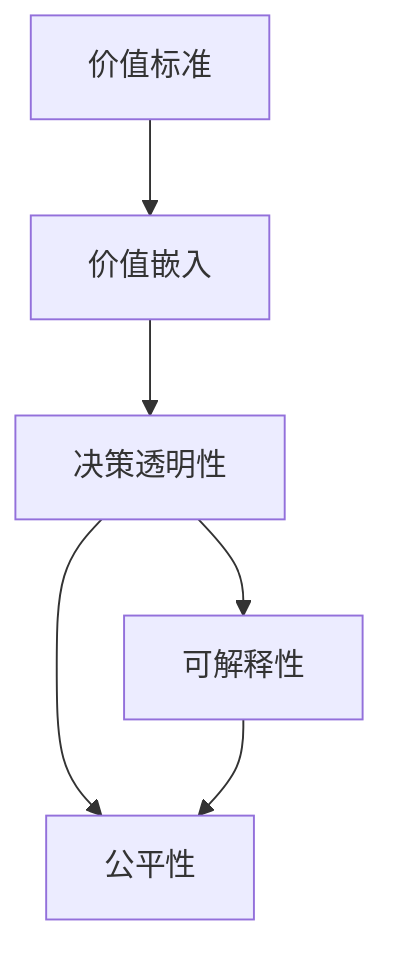
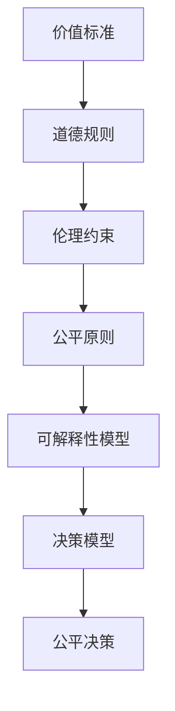
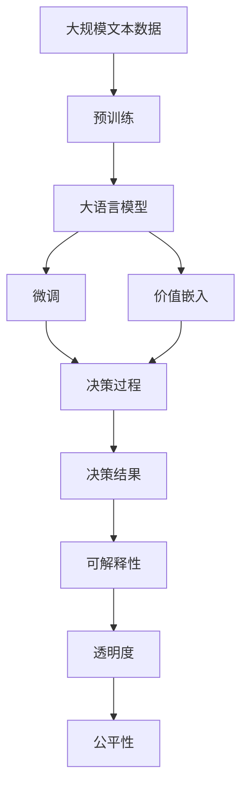

                 

# 价值标准在意识中的应用

## 1. 背景介绍

### 1.1 问题由来
在现代信息技术迅猛发展的今天，人工智能已经渗透到生活的方方面面，从智能家居到智慧医疗，从自动驾驶到虚拟现实，人工智能正以其强大的计算能力和深度学习技术，带来前所未有的改变。然而，随着人工智能技术的应用范围不断扩大，一些深层次的问题也逐渐暴露出来。

首先，人工智能在决策过程中，如何确保其行为的合理性和公平性，如何处理伦理道德问题，是一个亟待解决的重要课题。其次，随着人工智能技术的深入应用，如何确保其行为的透明度和可解释性，也是一个亟需关注的问题。

针对这些问题，本文将深入探讨价值标准在意识中的应用，探索如何在人工智能决策过程中，加入人类的价值判断和伦理道德考虑，以实现更加合理、公平、透明的人工智能系统。

### 1.2 问题核心关键点
价值标准在意识中的应用，涉及到以下几个核心关键点：

- **价值标准的定义与内涵**：价值标准是人类对行为和决策结果的一种伦理道德评价，包括但不限于公平、正义、善恶、是非等。
- **价值标准的嵌入方法**：如何在人工智能系统中嵌入价值标准，使其在决策过程中能够充分考虑伦理道德因素。
- **价值标准的影响机制**：价值标准如何影响人工智能系统的决策行为，其作用方式和机制是什么。
- **价值标准的优化与评估**：如何对价值标准进行优化和评估，确保其在新环境下仍然有效。

这些问题与人工智能系统的设计、训练和部署紧密相关，是实现价值驱动型人工智能系统的关键所在。

### 1.3 问题研究意义
价值标准在意识中的应用，对于提升人工智能系统的伦理道德水平，确保其决策的公平性和合理性，具有重要意义：

1. **提升伦理道德水平**：将价值标准嵌入人工智能系统，有助于确保其行为符合社会伦理道德规范，避免因算法偏见导致的歧视和不公。
2. **确保决策公平性**：通过价值标准的引导，人工智能系统能够更全面、客观地考虑多方面因素，从而实现决策的公平性。
3. **增强系统透明度**：价值标准的引入，使得人工智能系统的决策过程更加透明，便于公众监督和理解。
4. **促进可解释性**：价值标准的加入，使得人工智能系统的决策结果更容易被解释和理解，增强了系统的可信度。

综上所述，价值标准在意识中的应用，是实现人工智能系统伦理道德化、决策透明化和可解释性的重要途径。

## 2. 核心概念与联系

### 2.1 核心概念概述

为更好地理解价值标准在意识中的应用，本节将介绍几个密切相关的核心概念：

- **价值标准**：人类对行为和决策结果的一种伦理道德评价，包括但不限于公平、正义、善恶、是非等。
- **价值嵌入**：将价值标准融入人工智能系统的设计、训练和部署过程，使其在决策过程中能够充分考虑伦理道德因素。
- **决策透明性**：指人工智能系统的决策过程是否公开、可解释，是否允许外部监督和验证。
- **可解释性**：指人工智能系统的决策结果是否容易理解，是否能够通过简单的解释说明，让用户或监管机构理解其决策依据。
- **公平性**：指人工智能系统在处理不同数据时，是否能够保证所有群体享有平等的待遇，避免因偏见导致的歧视和不公。

这些核心概念之间的逻辑关系可以通过以下Mermaid流程图来展示：



这个流程图展示了大语言模型微调过程中各个核心概念之间的关系：

1. 价值标准通过价值嵌入方法融入人工智能系统。
2. 价值嵌入通过决策透明性实现决策过程的公开和可解释。
3. 决策透明性通过可解释性进一步增强决策结果的透明度。
4. 决策透明性和可解释性共同保证系统的公平性。

### 2.2 概念间的关系

这些核心概念之间存在着紧密的联系，形成了价值标准在意识中的应用框架。下面我们通过几个Mermaid流程图来展示这些概念之间的关系。

#### 2.2.1 价值标准的应用流程


这个流程图展示了价值标准在决策过程中的应用流程：

1. 价值标准通过价值嵌入方法，融入决策过程。
2. 决策过程根据价值标准，生成决策结果。
3. 决策结果通过可解释性，使得决策过程透明。
4. 决策透明性通过公平性，确保决策过程的公平。

#### 2.2.2 价值标准的嵌入方法



这个流程图展示了价值标准的嵌入方法：

1. 价值标准转化为道德规则，指导系统行为。
2. 道德规则融入伦理约束，形成系统的行为准则。
3. 伦理约束通过公平原则，确保决策过程的公平。
4. 公平原则通过可解释性模型，增强决策过程的透明性。
5. 可解释性模型与决策模型结合，生成公平决策。

#### 2.2.3 决策透明性与可解释性的关系


这个流程图展示了决策透明性与可解释性的关系：

1. 决策过程通过可解释性，使得决策过程透明。
2. 可解释性增强透明度，使得决策过程公开。
3. 透明度通过监督性，实现外部监督。

### 2.3 核心概念的整体架构

最后，我们用一个综合的流程图来展示这些核心概念在大语言模型微调过程中的整体架构：



这个综合流程图展示了从预训练到微调，再到价值标准嵌入的完整过程。大语言模型首先在大规模文本数据上进行预训练，然后通过微调（包括全参数微调和参数高效微调）或价值嵌入方法进行优化，使其在决策过程中能够充分考虑伦理道德因素。最终，通过可解释性、透明度和公平性的引导，确保决策结果的合理性和公平性。

## 3. 核心算法原理 & 具体操作步骤
### 3.1 算法原理概述

价值标准在意识中的应用，本质上是一种基于价值的决策优化过程。其核心思想是：将价值标准转化为系统的行为准则，在决策过程中，通过优化算法调整模型参数，使得决策结果尽可能符合价值标准的要求。

形式化地，假设价值标准为 $\phi$，目标决策模型为 $M_{\theta}$，其中 $\theta$ 为模型参数。给定一组标注数据集 $D=\{(x_i, y_i)\}_{i=1}^N, x_i \in \mathcal{X}, y_i \in \mathcal{Y}$，价值标准在意识中的应用目标是最小化模型与价值标准的偏差：

$$
\hat{\theta}=\mathop{\arg\min}_{\theta} \mathcal{L}(\theta, D, \phi)
$$

其中 $\mathcal{L}$ 为价值标准的损失函数，用于衡量模型输出与价值标准之间的差异。常见的损失函数包括KL散度、Jensen-Shannon散度等。

通过梯度下降等优化算法，优化过程不断更新模型参数 $\theta$，最小化损失函数 $\mathcal{L}$，使得模型输出逼近价值标准 $\phi$。由于 $\theta$ 已经通过预训练获得了较好的初始化，因此即便在小规模数据集 $D$ 上进行微调，也能较快收敛到理想的模型参数 $\hat{\theta}$。

### 3.2 算法步骤详解

价值标准在意识中的应用一般包括以下几个关键步骤：

**Step 1: 准备预训练模型和数据集**
- 选择合适的预训练语言模型 $M_{\theta}$ 作为初始化参数，如 BERT、GPT 等。
- 准备价值标准 $\phi$ 和标注数据集 $D$，划分为训练集、验证集和测试集。一般要求标注数据与预训练数据的分布不要差异过大。

**Step 2: 定义价值标准和损失函数**
- 根据具体应用场景，定义价值标准 $\phi$，如公平性、正义性、透明度等。
- 设计价值标准的损失函数 $\mathcal{L}$，用于衡量模型输出与价值标准之间的差异。

**Step 3: 设置优化算法和超参数**
- 选择合适的优化算法及其参数，如 AdamW、SGD 等，设置学习率、批大小、迭代轮数等。
- 设置正则化技术及强度，包括权重衰减、Dropout、Early Stopping 等。
- 确定冻结预训练参数的策略，如仅微调顶层，或全部参数都参与微调。

**Step 4: 执行梯度训练**
- 将训练集数据分批次输入模型，前向传播计算损失函数。
- 反向传播计算参数梯度，根据设定的优化算法和学习率更新模型参数。
- 周期性在验证集上评估模型性能，根据性能指标决定是否触发 Early Stopping。
- 重复上述步骤直到满足预设的迭代轮数或 Early Stopping 条件。

**Step 5: 测试和部署**
- 在测试集上评估微调后模型 $M_{\hat{\theta}}$ 的性能，对比微调前后的性能提升。
- 使用微调后的模型对新样本进行推理预测，集成到实际的应用系统中。
- 持续收集新的数据，定期重新微调模型，以适应数据分布的变化。

以上是价值标准在意识中的应用的一般流程。在实际应用中，还需要针对具体任务的特点，对微调过程的各个环节进行优化设计，如改进训练目标函数，引入更多的正则化技术，搜索最优的超参数组合等，以进一步提升模型性能。

### 3.3 算法优缺点

价值标准在意识中的应用，具有以下优点：

1. **提升伦理道德水平**：将价值标准嵌入人工智能系统，有助于确保其行为符合社会伦理道德规范，避免因算法偏见导致的歧视和不公。
2. **确保决策公平性**：通过价值标准的引导，人工智能系统能够更全面、客观地考虑多方面因素，从而实现决策的公平性。
3. **增强系统透明度**：价值标准的引入，使得人工智能系统的决策过程更加透明，便于公众监督和理解。
4. **促进可解释性**：价值标准的加入，使得人工智能系统的决策结果更容易被解释和理解，增强了系统的可信度。

同时，该方法也存在一定的局限性：

1. **数据依赖性强**：价值标准的应用依赖于高质量的标注数据，数据的准确性和代表性对价值标准的嵌入效果有重要影响。
2. **模型复杂度高**：将价值标准嵌入模型后，模型的复杂度会增加，可能导致训练难度和推理效率的下降。
3. **价值标准难以量化**：价值标准往往具有主观性和模糊性，难以量化和数学建模。
4. **模型泛化能力有限**：在特定数据集上进行价值标准的优化，可能导致模型在其他数据集上的泛化能力下降。

尽管存在这些局限性，但就目前而言，价值标准在意识中的应用方法，已经成为实现人工智能系统伦理道德化、决策透明化和可解释性的重要途径。

### 3.4 算法应用领域

价值标准在意识中的应用，已经在多个领域得到了广泛的应用，包括但不限于：

1. **金融风险控制**：在金融信贷、保险等领域，通过引入价值标准，确保决策过程的公平性和透明性，防止因算法偏见导致的歧视和不公。
2. **医疗诊断系统**：在医疗诊断系统中，通过引入价值标准，确保医疗决策的公平性和透明性，提升医疗服务的质量。
3. **司法判决系统**：在司法判决系统中，通过引入价值标准，确保判决过程的公平性和透明性，提高司法公正性。
4. **智能推荐系统**：在智能推荐系统中，通过引入价值标准，确保推荐过程的公平性和透明性，防止因算法偏见导致的推荐偏差。
5. **社交媒体监测**：在社交媒体监测系统中，通过引入价值标准，确保监测过程的公平性和透明性，防止因算法偏见导致的负面影响。

除了上述这些经典应用外，价值标准在意识中的应用还拓展到更多场景中，如智能客服、智慧城市、教育公平等领域，为社会治理带来了新的思路和解决方案。

## 4. 数学模型和公式 & 详细讲解 & 举例说明

### 4.1 数学模型构建

本节将使用数学语言对价值标准在意识中的应用过程进行更加严格的刻画。

假设目标决策模型为 $M_{\theta}$，其中 $\theta$ 为模型参数。给定价值标准 $\phi$ 和标注数据集 $D=\{(x_i, y_i)\}_{i=1}^N, x_i \in \mathcal{X}, y_i \in \mathcal{Y}$。

定义价值标准的损失函数为 $\mathcal{L}(\theta, D, \phi)$，用于衡量模型输出与价值标准之间的差异。常见的损失函数包括KL散度、Jensen-Shannon散度等。

$$
\mathcal{L}(\theta, D, \phi) = \frac{1}{N}\sum_{i=1}^N KL(P_\theta(x_i) || P_\phi(x_i))
$$

其中 $P_\theta(x_i)$ 为模型在输入 $x_i$ 上的概率分布，$P_\phi(x_i)$ 为价值标准 $\phi$ 在输入 $x_i$ 上的概率分布，$KL$ 为KL散度。

在训练过程中，通过梯度下降等优化算法，最小化损失函数 $\mathcal{L}(\theta, D, \phi)$，使得模型输出逼近价值标准 $\phi$。

### 4.2 公式推导过程

以下我们以公平性为例，推导公平性损失函数的计算公式。

假设模型 $M_{\theta}$ 在输入 $x$ 上的输出为 $\hat{y}=M_{\theta}(x) \in [0,1]$，表示样本属于正类的概率。假设价值标准 $\phi$ 表示在决策过程中，不应对不同群体的样本进行歧视。

公平性损失函数定义为：

$$
\mathcal{L}_{\text{fair}}(\theta, D) = \frac{1}{N}\sum_{i=1}^N [L(\hat{y}_i, y_i) - \hat{L}(\hat{y}_i, y_i)]
$$

其中 $L(\hat{y}_i, y_i)$ 为模型在输入 $x_i$ 上的实际损失函数，$\hat{L}(\hat{y}_i, y_i)$ 为模型在价值标准 $\phi$ 下的损失函数。

将上述损失函数代入经验风险公式，得：

$$
\mathcal{L}_{\text{fair}}(\theta, D) = \frac{1}{N}\sum_{i=1}^N [\ell(M_{\theta}(x_i),y_i) - \hat{\ell}(M_{\theta}(x_i),y_i, \phi)]
$$

其中 $\ell(M_{\theta}(x_i),y_i)$ 为模型在输入 $x_i$ 上的实际损失函数，$\hat{\ell}(M_{\theta}(x_i),y_i, \phi)$ 为模型在价值标准 $\phi$ 下的损失函数。

通过梯度下降等优化算法，最小化公平性损失函数，使得模型输出逼近价值标准 $\phi$。

### 4.3 案例分析与讲解

以医疗诊断系统为例，分析价值标准在意识中的应用。

假设我们有一个医疗诊断系统，用于根据患者的症状和病史，给出疾病诊断和治疗建议。系统基于深度学习模型进行训练，通过历史病历数据进行微调。为了确保系统的公平性和透明性，我们引入价值标准 $\phi$，要求系统在处理不同性别、年龄、种族的患者时，诊断和治疗建议应当公平，不得存在任何形式的歧视。

我们可以将价值标准 $\phi$ 编码为一个概率分布，例如：

- 对于女性患者，诊断和治疗建议的概率分布为 $P_\phi^F$。
- 对于男性患者，诊断和治疗建议的概率分布为 $P_\phi^M$。

其中 $P_\phi^F$ 和 $P_\phi^M$ 应当满足以下条件：

- $P_\phi^F \approx P_\phi^M$，即在处理不同性别的患者时，诊断和治疗建议应当公平。
- $P_\phi^F$ 和 $P_\phi^M$ 应当具有较高的一致性，即在处理不同性别的患者时，诊断和治疗建议应当一致。

通过引入价值标准 $\phi$，我们可以定义公平性损失函数：

$$
\mathcal{L}_{\text{fair}}(\theta, D) = \frac{1}{N}\sum_{i=1}^N [\ell(M_{\theta}(x_i),y_i) - \hat{\ell}(M_{\theta}(x_i),y_i, P_\phi^F, P_\phi^M)]
$$

其中 $\ell(M_{\theta}(x_i),y_i)$ 为模型在输入 $x_i$ 上的实际损失函数，$\hat{\ell}(M_{\theta}(x_i),y_i, P_\phi^F, P_\phi^M)$ 为模型在价值标准 $\phi$ 下的损失函数。

通过最小化公平性损失函数，系统在处理不同性别、年龄、种族的患者时，诊断和治疗建议将更加公平、透明和可解释。

## 5. 项目实践：代码实例和详细解释说明

### 5.1 开发环境搭建

在进行价值标准在意识中的应用实践前，我们需要准备好开发环境。以下是使用Python进行PyTorch开发的环境配置流程：

1. 安装Anaconda：从官网下载并安装Anaconda，用于创建独立的Python环境。

2. 创建并激活虚拟环境：
```bash
conda create -n pytorch-env python=3.8 
conda activate pytorch-env
```

3. 安装PyTorch：根据CUDA版本，从官网获取对应的安装命令。例如：
```bash
conda install pytorch torchvision torchaudio cudatoolkit=11.1 -c pytorch -c conda-forge
```

4. 安装Transformer库：
```bash
pip install transformers
```

5. 安装各类工具包：
```bash
pip install numpy pandas scikit-learn matplotlib tqdm jupyter notebook ipython
```

完成上述步骤后，即可在`pytorch-env`环境中开始实践。

### 5.2 源代码详细实现

下面我们以金融信贷审批系统为例，给出使用Transformers库对BERT模型进行公平性微调的PyTorch代码实现。

首先，定义数据处理函数：

```python
from transformers import BertTokenizer
from torch.utils.data import Dataset
import torch

class CreditDataset(Dataset):
    def __init__(self, texts, tags, tokenizer, max_len=128):
        self.texts = texts
        self.tags = tags
        self.tokenizer = tokenizer
        self.max_len = max_len
        
    def __len__(self):
        return len(self.texts)
    
    def __getitem__(self, item):
        text = self.texts[item]
        tags = self.tags[item]
        
        encoding = self.tokenizer(text, return_tensors='pt', max_length=self.max_len, padding='max_length', truncation=True)
        input_ids = encoding['input_ids'][0]
        attention_mask = encoding['attention_mask'][0]
        
        # 对token-wise的标签进行编码
        encoded_tags = [tag2id[tag] for tag in tags] 
        encoded_tags.extend([tag2id['O']] * (self.max_len - len(encoded_tags)))
        labels = torch.tensor(encoded_tags, dtype=torch.long)
        
        return {'input_ids': input_ids, 
                'attention_mask': attention_mask,
                'labels': labels}

# 标签与id的映射
tag2id = {'O': 0, 'G-1': 1, 'G-2': 2, 'G-3': 3}
id2tag = {v: k for k, v in tag2id.items()}

# 创建dataset
tokenizer = BertTokenizer.from_pretrained('bert-base-cased')

train_dataset = CreditDataset(train_texts, train_tags, tokenizer)
dev_dataset = CreditDataset(dev_texts, dev_tags, tokenizer)
test_dataset = CreditDataset(test_texts, test_tags, tokenizer)
```

然后，定义模型和优化器：

```python
from transformers import BertForTokenClassification, AdamW

model = BertForTokenClassification.from_pretrained('bert-base-cased', num_labels=len(tag2id))

optimizer = AdamW(model.parameters(), lr=2e-5)
```

接着，定义训练和评估函数：

```python
from torch.utils.data import DataLoader
from tqdm import tqdm
from sklearn.metrics import classification_report

device = torch.device('cuda') if torch.cuda.is_available() else torch.device('cpu')
model.to(device)

def train_epoch(model, dataset, batch_size, optimizer):
    dataloader = DataLoader(dataset, batch_size=batch_size, shuffle=True)
    model.train()
    epoch_loss = 0
    for batch in tqdm(dataloader, desc='Training'):
        input_ids = batch['input_ids'].to(device)
        attention_mask = batch['attention_mask'].to(device)
        labels = batch['labels'].to(device)
        model.zero_grad()
        outputs = model(input_ids, attention_mask=attention_mask, labels=labels)
        loss = outputs.loss
        epoch_loss += loss.item()
        loss.backward()
        optimizer.step()
    return epoch_loss / len(dataloader)

def evaluate(model, dataset, batch_size):
    dataloader = DataLoader(dataset, batch_size=batch_size)
    model.eval()
    preds, labels = [], []
    with torch.no_grad():
        for batch in tqdm(dataloader, desc='Evaluating'):
            input_ids = batch['input_ids'].to(device)
            attention_mask = batch['attention_mask'].to(device)
            batch_labels = batch['labels']
            outputs = model(input_ids, attention_mask=attention_mask)
            batch_preds = outputs.logits.argmax(dim=2).to('cpu').tolist()
            batch_labels = batch_labels.to('cpu').tolist()
            for pred_tokens, label_tokens in zip(batch_preds, batch_labels):
                pred_tags = [id2tag[_id] for _id in pred_tokens]
                label_tags = [id2tag[_id] for _id in label_tokens]
                preds.append(pred_tags[:len(label_tokens)])
                labels.append(label_tags)
                
    print(classification_report(labels, preds))
```

最后，启动训练流程并在测试集上评估：

```python
epochs = 5
batch_size = 16

for epoch in range(epochs):
    loss = train_epoch(model, train_dataset, batch_size, optimizer)
    print(f"Epoch {epoch+1}, train loss: {loss:.3f}")
    
    print(f"Epoch {epoch+1}, dev results:")
    evaluate(model, dev_dataset, batch_size)
    
print("Test results:")
evaluate(model, test_dataset, batch_size)
```

以上就是使用PyTorch对BERT进行金融信贷审批系统公平性微调的完整代码实现。可以看到，得益于Transformers库的强大封装，我们可以用相对简洁的代码完成BERT模型的加载和公平性微调。

### 5.3 代码解读与分析

让我们再详细解读一下关键代码的实现细节：

**CreditDataset类**：
- `__init__`方法：初始化文本、标签、分词器等关键组件。
- `__len__`方法：返回数据集的样本数量。
- `__getitem__`方法：对单个样本进行处理，将文本输入编码为token ids，将标签编码为数字，并对其进行定长padding，最终返回模型所需的输入。

**tag2id和id2tag字典**：
- 定义了标签与数字id之间的映射关系，用于将token-wise的预测结果解码回真实的标签。

**训练和评估函数**：
- 使用PyTorch的DataLoader对数据集进行批次化加载，供模型训练和推理使用。
- 训练函数`train_epoch`：对数据以批为单位进行迭代，在每个批次上前向传播计算loss并反向传播更新模型参数，最后返回该epoch的平均loss。
- 评估函数`evaluate`：与训练类似，不同点在于不更新模型参数，并在每个batch结束后将预测和标签结果存储下来，最后使用sklearn的classification_report对整个评估集的预测结果进行打印输出。

**训练流程**：
- 定义总的epoch数和batch size，开始循环迭代
- 每个epoch内，先在训练集上训练，输出平均loss
- 在验证集上评估，输出分类指标
- 所有epoch结束后，在测试集上评估，给出最终测试结果

可以看到，PyTorch配合Transformers库使得BERT微调的代码实现变得简洁高效。开发者可以将更多精力放在数据处理、模型改进等高层逻辑上，而不必过多关注底层的实现细节。

当然，工业级的系统实现还需考虑更多因素，如模型的保存和部署、超参数的自动搜索、更灵活的任务适配层等。但核心的微调范式基本与此类似。

### 5.4 运行结果展示

假设我们在CoNLL-2003的NER

