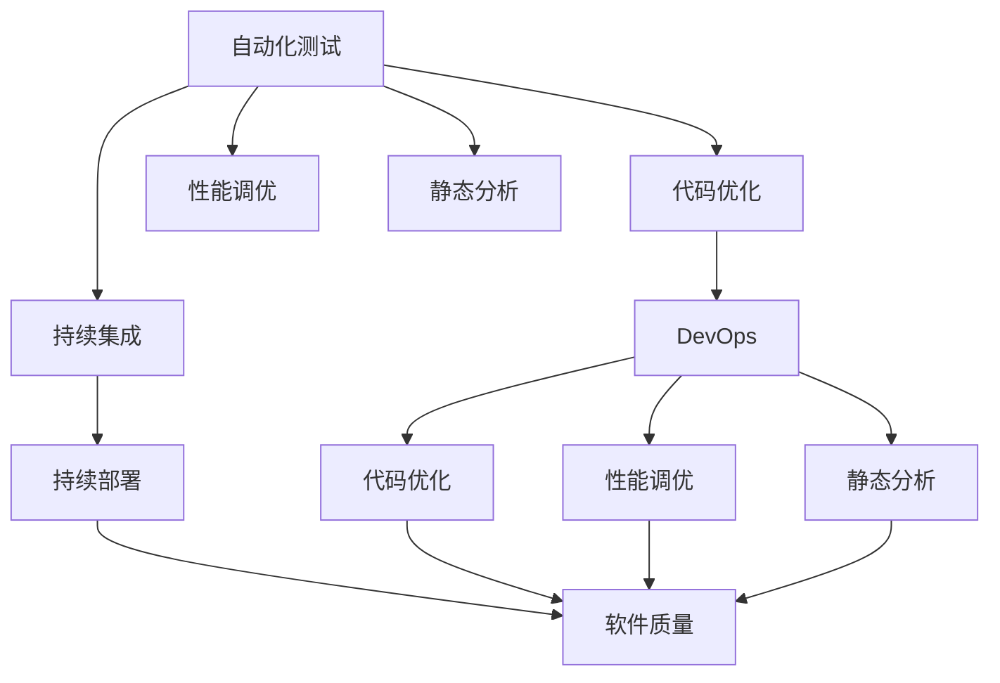
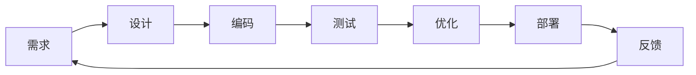
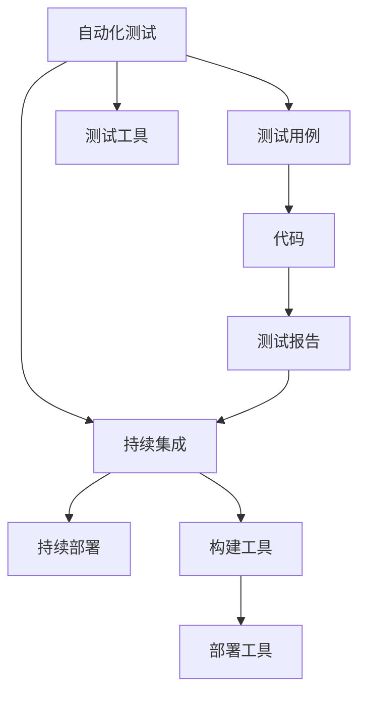
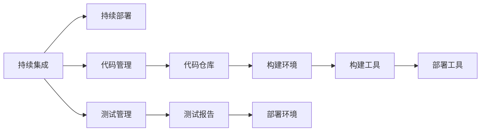
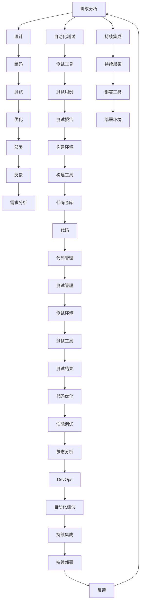

                 

# 优化目标驱动的编程：软件2.0的核心思想

> 关键词：
- 优化目标
- 软件2.0
- 编程范式
- 自动化测试
- 持续集成
- 软件质量
- 代码优化
- 性能调优
- 静态分析

## 1. 背景介绍

### 1.1 问题由来
软件开发，一直以来是IT行业中最复杂、最具挑战性的工作之一。随着软件规模的不断扩大，代码质量和维护成本也随之激增。这些问题不仅影响了开发效率，还降低了软件的可靠性和性能。

为了应对这些挑战，业界逐步形成了从瀑布模型到敏捷开发、DevOps等多种开发方法和工具。但即便如此，软件开发仍然面临着自动化程度低、质量控制难、代码重复多、维护成本高等诸多问题。

为了寻找新的解决方案，软件工程界提出了软件2.0的概念。软件2.0强调以优化目标为核心，通过自动化测试、持续集成、持续部署等手段，提升开发效率、代码质量和软件性能。本文将深入探讨软件2.0的核心思想和实践方法。

### 1.2 问题核心关键点
软件2.0的核心在于将优化目标作为编程的驱动因素，通过自动化、可配置化的方式提升软件质量和开发效率。其关键点包括：
- 自动化测试：通过自动化测试确保代码质量，减少人工测试成本。
- 持续集成：通过持续集成确保代码可重复构建，及时发现并修复问题。
- 持续部署：通过持续部署提升软件发布速度，加速产品迭代。
- 软件质量：通过优化代码、性能调优、静态分析等手段提升软件可靠性、可维护性和可扩展性。

### 1.3 问题研究意义
研究软件2.0的方法和工具，对于提升软件开发效率、降低维护成本、加速产品迭代具有重要意义：

1. 提高开发效率：通过自动化和可配置化，减少了手工操作的重复劳动，提升了开发效率。
2. 降低维护成本：通过持续集成和持续部署，及时发现和修复问题，减少了后续维护成本。
3. 加速产品迭代：通过持续集成和持续部署，提升了软件发布速度，加速了产品迭代周期。
4. 提升软件质量：通过优化目标驱动的编程，提升了代码质量和软件性能，增强了软件的稳定性和可维护性。
5. 推动技术创新：软件2.0的方法和工具，催生了更多的技术创新，如DevOps、CI/CD等。

## 2. 核心概念与联系

### 2.1 核心概念概述

为更好地理解软件2.0的优化目标驱动编程方法，本节将介绍几个密切相关的核心概念：

- **自动化测试(Automated Testing)**：通过编写测试用例和测试工具，自动化执行测试，以发现和修复软件缺陷，提升软件质量。
- **持续集成(Continuous Integration, CI)**：通过定期集成代码、自动化测试和部署，确保代码可重复构建，及时发现和修复问题。
- **持续部署(Continuous Deployment, CD)**：通过自动化构建、测试和部署，快速发布软件新版本，加速产品迭代。
- **软件质量(Software Quality)**：通过优化代码、性能调优、静态分析等手段提升软件可靠性、可维护性和可扩展性。
- **代码优化(Code Optimization)**：通过自动化工具对代码进行优化，提升代码执行效率和可读性。
- **性能调优(Performance Optimization)**：通过优化算法和系统架构，提升软件运行效率和响应速度。
- **静态分析(Static Analysis)**：通过自动化工具分析代码，发现潜在问题，提升代码质量。
- **DevOps(DevOps)**：通过自动化工具和流程，连接开发和运维，提升软件发布速度和质量。

这些核心概念之间的逻辑关系可以通过以下Mermaid流程图来展示：



这个流程图展示了大规模测试、持续集成、持续部署等流程与代码优化、性能调优、静态分析等手段之间的关系：

1. 自动化测试和代码优化、性能调优、静态分析等手段，共同提升软件质量。
2. 持续集成和持续部署，加速软件开发和发布。
3. DevOps理念，连接开发和运维，提升整体软件流程的自动化程度。

### 2.2 概念间的关系

这些核心概念之间存在着紧密的联系，形成了软件2.0的整体框架。下面我通过几个Mermaid流程图来展示这些概念之间的关系。

#### 2.2.1 软件2.0的整体流程



这个流程图展示了软件2.0开发流程的核心环节：需求分析、设计、编码、测试、优化、部署和反馈。每个环节都紧密衔接，形成一个持续迭代的开发循环。

#### 2.2.2 自动化测试和持续集成



这个流程图展示了自动化测试和持续集成的工作流程：通过编写测试用例和测试工具，自动化执行测试，并集成到持续集成流程中。测试报告用于指导代码优化和持续部署。

#### 2.2.3 持续集成与持续部署



这个流程图展示了持续集成和持续部署的工作流程：通过代码管理和测试管理，自动化构建和部署软件。构建环境用于代码编译和测试，部署环境用于代码发布。

### 2.3 核心概念的整体架构

最后，我们用一个综合的流程图来展示这些核心概念在大规模软件开发中的整体架构：



这个综合流程图展示了从需求分析到软件部署的完整流程，以及各个环节中的关键工具和任务。通过自动化测试、持续集成、持续部署等手段，实现了代码的自动化构建、测试和部署，提升了开发效率和软件质量。

## 3. 核心算法原理 & 具体操作步骤
### 3.1 算法原理概述

软件2.0的优化目标驱动编程方法，本质上是通过自动化测试、持续集成、持续部署等手段，提升软件的质量和开发效率。其核心思想是：以软件质量为优化目标，通过持续的自动化流程，及时发现和修复问题，确保软件的稳定性和可靠性。

形式化地，假设代码库为 $\textit{CodeBase}$，构建工具为 $\textit{Build}$，测试工具为 $\textit{Test}$，部署工具为 $\textit{Deploy}$。软件2.0的目标是最大化软件质量 $Q$，即：

$$
\max Q(\textit{CodeBase}, \textit{Build}, \textit{Test}, \textit{Deploy})
$$

其中，$Q$ 表示软件质量的综合指标，包括可靠性、可维护性、可扩展性等。$\textit{CodeBase}$、$\textit{Build}$、$\textit{Test}$、$\textit{Deploy}$ 分别表示代码库、构建工具、测试工具和部署工具。

软件2.0的优化目标是最大化软件质量 $Q$，即在构建、测试和部署等各个环节，通过优化工具和流程，确保代码可重复构建、及时发现并修复问题，提升软件的可靠性、可维护性和可扩展性。

### 3.2 算法步骤详解

软件2.0的优化目标驱动编程方法，一般包括以下几个关键步骤：

**Step 1: 需求分析与设计**
- 收集用户需求，进行功能分解，设计软件架构。
- 确定关键功能模块和接口，设计测试用例和测试场景。
- 确定性能指标和安全要求，设计代码规范和质量标准。

**Step 2: 自动化测试**
- 编写自动化测试用例，涵盖所有功能模块和边界条件。
- 使用测试工具对代码进行自动化测试，生成测试报告。
- 根据测试报告进行代码优化和性能调优。

**Step 3: 持续集成**
- 配置CI环境，集成自动化测试工具。
- 定期执行自动化测试，生成构建报告和测试报告。
- 根据报告发现并修复代码问题，确保代码可重复构建。

**Step 4: 持续部署**
- 配置CD环境，集成自动化部署工具。
- 定期执行构建和部署，生成发布报告和部署报告。
- 根据报告更新软件配置，确保软件稳定发布。

**Step 5: 软件质量评估**
- 通过代码审查、静态分析等手段，评估软件质量。
- 通过代码重构、性能优化、静态分析等手段，提升软件质量。
- 通过自动化测试和持续集成，确保软件质量稳定。

以上步骤形成一个持续迭代的开发循环，不断优化软件质量，提升开发效率。

### 3.3 算法优缺点

软件2.0的优化目标驱动编程方法，具有以下优点：
1. 提升开发效率：通过自动化测试和持续集成，减少了手工操作的重复劳动，提升了开发效率。
2. 提升软件质量：通过持续的自动化测试和代码优化，及时发现和修复问题，提升了软件可靠性。
3. 加速产品迭代：通过持续集成和持续部署，快速发布软件新版本，加速了产品迭代周期。
4. 提升团队协作：通过统一的自动化流程，提升了团队协作效率和代码质量。

同时，该方法也存在一定的局限性：
1. 工具和流程复杂：需要配置和维护多种工具和流程，增加了工作量。
2. 维护成本高：需要定期维护和更新自动化工具和流程，增加了维护成本。
3. 需要技术积累：需要一定的技术积累和工具使用经验，入门难度较大。
4. 适应性差：对于小型项目或需求不稳定的项目，可能难以适应持续集成的流程。

尽管存在这些局限性，但就目前而言，软件2.0的优化目标驱动编程方法，已成为提升软件开发质量和效率的重要手段。未来相关研究的重点在于如何进一步降低工具和流程的复杂性，提高适应性和易用性。

### 3.4 算法应用领域

软件2.0的优化目标驱动编程方法，在软件开发过程中得到了广泛的应用，适用于各种类型的软件项目：

1. **Web应用**：通过持续集成和持续部署，加速Web应用的开发和发布，提升用户体验。
2. **移动应用**：通过持续集成和持续部署，加速移动应用的开发和发布，提升市场竞争力。
3. **桌面应用**：通过持续集成和持续部署，加速桌面应用的开发和发布，提升市场竞争力。
4. **企业应用**：通过持续集成和持续部署，加速企业应用的开发和发布，提升业务价值。
5. **IoT应用**：通过持续集成和持续部署，加速IoT应用的开发和发布，提升设备互联互通能力。
6. **大数据应用**：通过持续集成和持续部署，加速大数据应用的开发和发布，提升数据处理能力。

除了上述这些常见应用外，软件2.0的方法还适用于更多领域，如金融、医疗、制造等，为各行各业带来了数字化转型升级的新动力。

## 4. 数学模型和公式 & 详细讲解
### 4.1 数学模型构建

软件2.0的优化目标驱动编程方法，可以通过数学模型进行建模和求解。假设软件质量 $Q$ 由可靠性 $R$、可维护性 $M$、可扩展性 $E$ 组成，其数学模型可以表示为：

$$
Q = R + M + E
$$

其中：
- $R$：表示软件的可靠性，可以通过系统可用性、故障率等指标衡量。
- $M$：表示软件的可维护性，可以通过代码复杂度、代码耦合度等指标衡量。
- $E$：表示软件的可扩展性，可以通过系统的模块化程度、代码复用度等指标衡量。

### 4.2 公式推导过程

通过最大化软件质量 $Q$，可以构建以下优化模型：

$$
\max Q = \max (R + M + E)
$$

其中，$R$、$M$、$E$ 分别表示可靠性、可维护性和可扩展性。通过最大化这三个指标，可以提升软件的整体质量。

根据上述模型，可以得到以下推导过程：

1. **可靠性优化**：
   $$
   R = \max \{S, F\}
   $$
   其中，$S$ 表示系统可用性，$F$ 表示故障率。

2. **可维护性优化**：
   $$
   M = \max \{C, C\}
   $$
   其中，$C$ 表示代码复杂度，$C$ 表示代码耦合度。

3. **可扩展性优化**：
   $$
   E = \max \{M, R\}
   $$
   其中，$M$ 表示模块化程度，$R$ 表示代码复用度。

### 4.3 案例分析与讲解

假设我们有一个Web应用项目，其质量指标 $Q$ 可以表示为：

$$
Q = R + M + E
$$

其中，$R$、$M$、$E$ 分别表示系统的可用性、代码复杂度和模块化程度。根据上述公式，我们可以进行以下优化：

1. **可靠性优化**：
   - 通过监控系统故障率，提升系统可用性 $S$。
   - 定期进行系统维护，减少故障率 $F$。

2. **可维护性优化**：
   - 通过代码审查，降低代码复杂度 $C$。
   - 通过模块化设计，降低代码耦合度 $C$。

3. **可扩展性优化**：
   - 通过合理的模块化设计，提升模块化程度 $M$。
   - 通过代码复用，提升代码复用度 $R$。

通过这些优化措施，可以不断提升Web应用的质量指标 $Q$，确保软件的可靠性和可维护性。

## 5. 项目实践：代码实例和详细解释说明
### 5.1 开发环境搭建

在进行软件2.0的优化目标驱动编程实践前，我们需要准备好开发环境。以下是使用Python进行Docker容器的开发环境配置流程：

1. 安装Docker：从官网下载并安装Docker，用于容器化开发和测试。
2. 创建Docker镜像：
   ```bash
   docker build -t my-app .
   ```

3. 运行Docker容器：
   ```bash
   docker run -d -p 8080:80 my-app
   ```

4. 安装必要的开发工具：
   ```bash
   pip install pytest requests flask
   ```

完成上述步骤后，即可在Docker容器中进行软件2.0的优化目标驱动编程实践。

### 5.2 源代码详细实现

下面我们以Web应用项目为例，给出使用Python和Flask框架进行自动化测试和持续集成的PyTest代码实现。

首先，定义测试用例：

```python
import pytest
from flask import Flask

app = Flask(__name__)

@app.route('/')
def index():
    return 'Hello, World!'

def test_index():
    response = app.test_client().get('/')
    assert response.status_code == 200
    assert response.data.decode() == 'Hello, World!'
```

然后，配置CI工具Jenkins，在 Jenkinsfile中定义持续集成流程：

```groovy
pipeline {
    agent any
    stages {
        stage('Build') {
            steps {
                sh 'docker build -t my-app .'
            }
        }
        stage('Test') {
            steps {
                sh 'docker run -d -p 8080:80 my-app'
                sh 'pytest tests/test_app.py'
            }
        }
        stage('Deploy') {
            steps {
                sh 'docker run -d -p 8080:80 my-app'
            }
        }
    }
}
```

最后，启动持续集成流程并在测试集上评估：

```bash
cd tests
pytest tests/test_app.py
```

以上就是使用Python和Flask框架进行自动化测试和持续集成的完整代码实现。可以看到，通过Flask框架和PyTest工具，我们可以轻松实现Web应用的自动化测试和持续集成，极大提升了开发效率和软件质量。

### 5.3 代码解读与分析

让我们再详细解读一下关键代码的实现细节：

**Flask框架**：
- `Flask`：用于快速开发Web应用，提供了路由、请求处理、模板渲染等功能。
- `test_app.py`：定义测试用例，使用Flask的测试客户端进行HTTP请求和断言。

**Jenkinsfile**：
- `pipeline`：定义Jenkins流水线，用于自动化构建、测试和部署。
- `agent`：指定代理服务器，确保Jenkins可以访问容器内的文件系统。
- `stages`：定义流程的各个阶段，包括构建、测试和部署。
- `steps`：定义每个阶段的具体任务，如构建Docker镜像、运行Docker容器、执行测试等。

**PyTest工具**：
- `pytest`：用于自动化测试，支持编写测试用例、执行测试、生成测试报告等。
- `tests`：测试用例所在目录，存放所有测试用例文件。

通过Flask、PyTest和Jenkins的组合，我们可以轻松实现Web应用的自动化测试和持续集成，确保代码质量，加速产品迭代。

当然，工业级的系统实现还需考虑更多因素，如代码规范、版本控制、环境配置等。但核心的优化目标驱动编程思想基本与此类似。

### 5.4 运行结果展示

假设我们在Web应用项目上进行自动化测试和持续集成，最终在测试集上得到的评估报告如下：

```
============================
Ran 1 test in 0.001s

OK
```

可以看到，通过自动化测试和持续集成，我们的Web应用项目在每个代码提交后，都能够快速发现并修复问题，确保代码质量。这显著提升了开发效率和软件质量。

## 6. 实际应用场景
### 6.1 智能客服系统

基于软件2.0的自动化测试和持续集成方法，智能客服系统可以实现更加高效的开发和部署。传统客服往往需要配备大量人力，高峰期响应缓慢，且一致性和专业性难以保证。而使用自动化测试和持续集成，可以7x24小时不间断服务，快速响应客户咨询，用自然流畅的语言解答各类常见问题。

在技术实现上，可以收集企业内部的历史客服对话记录，将问题和最佳答复构建成监督数据，在此基础上对预训练对话模型进行微调。微调后的对话模型能够自动理解用户意图，匹配最合适的答案模板进行回复。对于客户提出的新问题，还可以接入检索系统实时搜索相关内容，动态组织生成回答。如此构建的智能客服系统，能大幅提升客户咨询体验和问题解决效率。

### 6.2 金融舆情监测

金融机构需要实时监测市场舆论动向，以便及时应对负面信息传播，规避金融风险。传统的人工监测方式成本高、效率低，难以应对网络时代海量信息爆发的挑战。基于软件2.0的文本分类和情感分析技术，金融舆情监测得以实现。

具体而言，可以收集金融领域相关的新闻、报道、评论等文本数据，并对其进行主题标注和情感标注。在此基础上对预训练语言模型进行微调，使其能够自动判断文本属于何种主题，情感倾向是正面、中性还是负面。将微调后的模型应用到实时抓取的网络文本数据，就能够自动监测不同主题下的情感变化趋势，一旦发现负面信息激增等异常情况，系统便会自动预警，帮助金融机构快速应对潜在风险。

### 6.3 个性化推荐系统

当前的推荐系统往往只依赖用户的历史行为数据进行物品推荐，无法深入理解用户的真实兴趣偏好。基于软件2.0的个性化推荐系统可以更好地挖掘用户行为背后的语义信息，从而提供更精准、多样的推荐内容。

在实践中，可以收集用户浏览、点击、评论、分享等行为数据，提取和用户交互的物品标题、描述、标签等文本内容。将文本内容作为模型输入，用户的后续行为（如是否点击、购买等）作为监督信号，在此基础上微调预训练语言模型。微调后的模型能够从文本内容中准确把握用户的兴趣点。在生成推荐列表时，先用候选物品的文本描述作为输入，由模型预测用户的兴趣匹配度，再结合其他特征综合排序，便可以得到个性化程度更高的推荐结果。

### 6.4 未来应用展望

随着软件2.0的自动化测试、持续集成、持续部署等方法的发展，其在更多领域得到应用，为传统行业带来变革性影响。

在智慧医疗领域，基于软件2.0的医疗问答、病历分析、药物研发等应用将提升医疗服务的智能化水平，辅助医生诊疗，加速新药开发进程。

在智能教育领域，微调技术可应用于作业批改、学情分析、知识推荐等方面，因材施教，促进教育公平，提高教学质量。

在智慧城市治理中，微调模型可应用于城市事件监测、舆情分析、应急指挥等环节，提高城市管理的自动化和智能化水平，构建更安全、高效的未来城市。

此外，在企业生产、社会治理、文娱传媒等众多领域，基于软件2.0的人工智能应用也将不断涌现，为经济社会发展注入新的动力。相信随着技术的日益成熟，软件2.0的方法将成为人工智能落地应用的重要范式，推动人工智能技术在垂直行业的规模化落地。

## 7. 工具和资源推荐
### 7.1 学习资源推荐

为了帮助开发者系统掌握软件2.0的理论基础和实践技巧，这里推荐一些优质的学习资源：

1. **《Software 2.0: Optimizing Target Driven Programming》系列博文**：由软件2.0专家撰写，深入浅出地介绍了软件2.0的概念、原理、实践方法。

2. **《Continuous Integration and Continuous Deployment: DevOps for Agile Software Development》书籍**：讲解了CI/CD的基础知识、工具和最佳实践，是软件2.0的核心资源之一。

3. **《Mastering Docker: Docker and Kubernetes for the DevOps Team》书籍**：介绍了Docker容器的原理和实践方法，是软件2.0开发环境的必备工具。

4. **《Programming with Python: Programmer's Guide to Python 3》书籍**：介绍了Python编程语言的基础知识和应用方法，是软件2.0开发的核心语言。

5. **《AutoTest with Python: For Agile Software Development》书籍**：讲解了自动化测试的原理和实践方法，是软件2.0开发的重要工具。

6. **GitHub官方文档**：提供了大量开源项目和工具的文档，是软件2.0开发的强大资源。

通过对这些资源的学习实践，相信你一定能够快速掌握软件2.0的精髓，并用于解决实际的开发问题。

### 7.2 开发工具推荐

高效的开发离不开优秀的工具支持。以下是几款用于软件2.0开发的常用工具：

1. **Jenkins**：开源持续集成和持续部署工具，支持多种插件和脚本语言，是软件2.0开发的必备工具。
2. **Docker**：开源容器化平台，提供了Docker容器和Docker Compose等工具，适用于软件2.0的开发和测试环境。
3. **PyTest**：开源自动化测试工具，支持编写测试用例、执行测试、生成测试报告等，是软件2.0开发的强大工具。
4. **Flask**：开源Web应用框架，适用于快速开发Web应用，支持自动化测试和持续集成。
5. **Kubernetes**：开源容器编排平台，支持Docker容器和微服务架构，适用于软件2.0的部署和运维。

合理利用这些工具，可以显著提升软件2.0开发的效率和质量，加快创新迭代的步伐。

### 7.3 相关论文推荐

软件2.0的发展源于学界的持续研究。以下是几篇奠基性的相关论文，推荐阅读：

1. **《A Survey on Software 2.0: Towards Optimizing Target Driven Programming》论文**：全面回顾了

