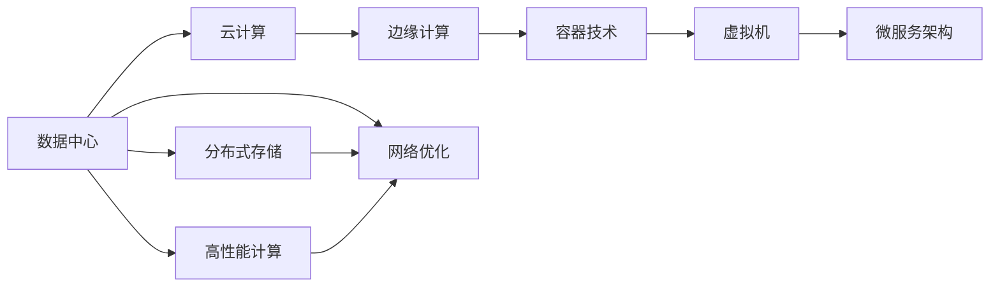

                 

## 1. 背景介绍

在快速发展的数字化时代，计算基础设施扮演着至关重要的角色。无论是数据中心、云服务提供商，还是企业内部的IT部门，优化计算基础设施对于提升系统性能、降低运营成本、确保数据安全等都具有重要意义。随着人工智能、大数据等技术的应用日益广泛，计算资源的需求也在不断增长。然而，传统的计算资源分配和管理方式已无法满足新的需求，优化计算基础设施已成为当务之急。

本博客将系统性地探讨如何优化计算基础设施，包括数据中心、云计算、边缘计算等不同类型的计算环境。我们将深入研究其核心概念、算法原理、具体操作步骤，以及实际应用场景。此外，我们还将介绍一些前沿的工具和资源，为读者提供全方位的技术支持。

## 2. 核心概念与联系

### 2.1 核心概念概述

在深入探讨优化策略之前，我们需要理解几个关键概念及其相互关系。

- **数据中心(Data Center)**：是大型企业或机构用来存放和处理数据的设施，通常包含大量的服务器、存储设备、网络设备等。数据中心负责数据的存储、处理、备份和管理。

- **云计算(Cloud Computing)**：是指通过互联网提供计算资源的服务，包括计算、存储、网络和数据库等服务。云计算按使用量计费，用户可以根据需求灵活调整资源。

- **边缘计算(Edge Computing)**：是指将计算资源部署在靠近数据源的网络边缘，如移动设备、物联网设备等，以减少数据传输延迟，提高数据处理效率。

- **容器技术(Container Technology)**：是一种轻量级的应用打包和部署方式，通过容器技术，应用可以在不同的环境中快速部署和迁移，提高了资源利用效率。

- **虚拟机(Virtual Machine, VM)**：是指在物理服务器上虚拟出多个独立的运行环境，每个虚拟机具有独立的CPU、内存、存储等资源，用于运行不同的应用程序。

- **微服务架构(Microservices Architecture)**：是一种软件架构模式，将应用程序拆分为多个小型、独立的微服务，每个微服务独立运行，能够快速扩展和更新。

这些概念共同构成了现代计算基础设施的核心架构，它们之间的相互作用和优化策略将直接影响整个系统的性能和可扩展性。

### 2.2 核心概念的关系

为了更好地理解这些核心概念之间的关系，我们可以用以下Mermaid流程图来展示：



这个流程图展示了数据中心、云计算、边缘计算、容器技术、虚拟机和微服务架构之间的关系，以及它们如何通过分布式存储、高性能计算和网络优化等技术相互配合，共同构建高效的计算基础设施。

## 3. 核心算法原理 & 具体操作步骤

### 3.1 算法原理概述

优化计算基础设施的算法原理主要包括分布式计算、资源调度、负载均衡、自动化运维等。这些算法通过优化资源分配、提高资源利用率、减少数据传输延迟等手段，提升计算基础设施的性能和可扩展性。

- **分布式计算(Distributed Computing)**：通过将计算任务分配到多个计算节点并行处理，提高计算速度和处理能力。

- **资源调度(Resource Scheduling)**：根据任务需求动态调整计算资源，最大化资源利用率，避免资源浪费。

- **负载均衡(Load Balancing)**：将计算任务均匀地分配到不同的计算节点，避免某些节点过载，提高系统整体性能。

- **自动化运维(Automatic Operation and Maintenance)**：通过自动化工具和脚本，实现对计算基础设施的监控、维护和管理，提高运维效率。

### 3.2 算法步骤详解

优化计算基础设施通常包括以下几个关键步骤：

**Step 1: 需求分析与规划**

- 明确计算需求，包括计算量、存储需求、网络带宽等。
- 评估现有基础设施的性能和容量，确定需要增加的资源。
- 制定优化目标和方案，包括提高资源利用率、降低成本、提升系统性能等。

**Step 2: 架构设计与选择**

- 根据需求和优化目标，选择合适的架构方案，如云计算、边缘计算、微服务架构等。
- 设计分布式计算、资源调度和负载均衡策略，确保系统能够高效处理任务。

**Step 3: 资源配置与部署**

- 根据设计方案配置计算资源，如服务器、存储设备、网络设备等。
- 部署应用程序，包括容器化、虚拟化和微服务化，以提高资源利用率和系统可扩展性。

**Step 4: 监控与调优**

- 实时监控系统性能和资源使用情况，使用工具如Prometheus、Grafana等进行可视化。
- 根据监控结果，调整资源分配和系统配置，优化性能和资源利用率。

**Step 5: 自动化运维**

- 使用自动化运维工具，如Ansible、Puppet、Terraform等，实现系统配置的自动化管理。
- 定期进行系统备份和恢复，确保数据安全。

**Step 6: 安全和合规**

- 实施访问控制和身份验证机制，保护系统和数据的安全。
- 遵守相关法规和标准，确保系统的合规性。

### 3.3 算法优缺点

优化计算基础设施的算法具有以下优点：

- 提高资源利用率：通过优化资源分配，避免资源浪费，提高计算基础设施的利用率。
- 提升系统性能：通过分布式计算和负载均衡，提高系统的处理能力和响应速度。
- 降低运营成本：通过自动化运维和管理，降低人工运维成本，提高效率。

同时，这些算法也存在一些缺点：

- 初始投资高：优化计算基础设施需要大量的初始投资，包括硬件设备和软件工具。
- 技术复杂度高：优化过程涉及多个技术环节，需要较高的技术水平和专业经验。
- 灵活性差：一旦部署，调整和优化比较困难，需要重新部署和配置。

### 3.4 算法应用领域

优化计算基础设施的算法广泛应用于多个领域，包括数据中心、云计算、边缘计算等。以下是几个典型的应用场景：

**数据中心优化**

- **电源管理**：通过智能电源管理，降低能耗，提高能效。
- **温控系统**：通过智能温控系统，减少设备过热现象，延长设备寿命。
- **网络优化**：通过网络优化，提高数据传输速率和可靠性。

**云计算优化**

- **弹性计算**：根据业务需求，动态调整计算资源，提高资源利用率。
- **资源调度和负载均衡**：根据任务需求，动态分配计算资源，避免资源浪费。
- **数据备份与恢复**：定期备份数据，确保数据安全和快速恢复。

**边缘计算优化**

- **边缘缓存**：将数据缓存到边缘设备，减少数据传输延迟，提高数据处理效率。
- **设备协同**：通过边缘设备协同计算，提高处理能力和响应速度。
- **安全性**：在边缘设备上部署安全机制，提高数据安全性和隐私保护。

这些应用场景展示了优化计算基础设施的广泛应用，通过合理的算法和策略，可以显著提升系统性能和可扩展性。

## 4. 数学模型和公式 & 详细讲解 & 举例说明

### 4.1 数学模型构建

在优化计算基础设施的过程中，我们通常使用以下数学模型来描述系统的性能和资源利用情况：

- **资源利用率(Utilization Rate)**：

  $$
  \text{Utilization Rate} = \frac{\text{已使用资源量}}{\text{总资源量}} \times 100\%
  $$

- **响应时间(Response Time)**：

  $$
  \text{Response Time} = \text{处理时间} + \text{网络传输时间} + \text{排队时间}
  $$

- **吞吐量(Throughput)**：

  $$
  \text{Throughput} = \frac{\text{处理的数据量}}{\text{时间}}
  $$

### 4.2 公式推导过程

以资源利用率为例，我们进行如下推导：

假设某个数据中心的总资源量为 $C$，已使用资源量为 $U$，则资源利用率为：

$$
\text{Utilization Rate} = \frac{U}{C} \times 100\%
$$

假设一个请求需要占用 $X$ 的资源，则资源利用率还可以表示为：

$$
\text{Utilization Rate} = \frac{\text{请求数} \times X}{C} \times 100\%
$$

通过以上公式，可以清晰地理解资源利用率的概念和计算方法。

### 4.3 案例分析与讲解

假设一个云计算平台，有10个计算节点，每个节点的CPU资源为4核，总CPU资源为40核。在某个时间段内，实际使用的CPU资源为20核。则该平台的CPU资源利用率为：

$$
\text{Utilization Rate} = \frac{20}{40} \times 100\% = 50\%
$$

这意味着平台的CPU资源利用率在50%，仍有50%的资源未被充分利用。进一步分析，如果每个节点的CPU资源利用率不同，可以通过资源调度和负载均衡策略，提高整个平台的资源利用率。

## 5. 项目实践：代码实例和详细解释说明

### 5.1 开发环境搭建

在进行优化计算基础设施的实践前，我们需要准备好开发环境。以下是使用Python进行PyTorch开发的环境配置流程：

1. 安装Anaconda：从官网下载并安装Anaconda，用于创建独立的Python环境。

2. 创建并激活虚拟环境：
```bash
conda create -n pytorch-env python=3.8 
conda activate pytorch-env
```

3. 安装PyTorch：根据CUDA版本，从官网获取对应的安装命令。例如：
```bash
conda install pytorch torchvision torchaudio cudatoolkit=11.1 -c pytorch -c conda-forge
```

4. 安装TensorFlow：使用以下命令安装TensorFlow，选择GPU版本：
```bash
pip install tensorflow-gpu==2.8.0
```

5. 安装Kubernetes：使用以下命令安装Kubernetes集群：
```bash
kubectl version
```

6. 安装Prometheus和Grafana：使用以下命令安装Prometheus和Grafana：
```bash
sudo apt-get install prometheus
sudo apt-get install grafana
```

完成上述步骤后，即可在`pytorch-env`环境中开始优化计算基础设施的实践。

### 5.2 源代码详细实现

下面我们以边缘计算为例，给出使用Kubernetes和Prometheus进行边缘计算优化的PyTorch代码实现。

首先，定义边缘计算的架构：

```python
from kubernetes import client, config

# 加载Kubernetes配置
config.load_kube_config()

# 创建边缘计算节点列表
edge_nodes = []
for i in range(3):
    edge_node = client.V1Node()
    edge_node.metadata.name = f'edge-node-{i+1}'
    edge_node.spec.nodeSelector = {'kubernetes.io/os': 'linux'}
    edge_node.spec.affinity = {'nodeAffinity': {'requiredDuringSchedulingIgnoredDuringExecution': {'nodeSelectorTerms': [{'matchExpressions': [{'key': 'kubernetes.io/os', 'operator': 'In', 'values': ['linux']}]}]}}}
    edge_node.spec.tolerations = [{'toleranceKey': 'kubernetes.io/os', 'operator': 'In', 'value': 'linux', 'effect': 'NoSchedule'}]
    edge_node.spec.containers.append(client.V1Container(name='edge-app', image='your-image-name', ports=[client.V1ContainerPort(container_port=8000)])
    edge_nodes.append(edge_node)

# 创建边缘计算节点列表
v1_core_v1api = client.CoreV1Api()
v1_core_v1api.create_batch(edge_nodes)
```

然后，定义监控和报警策略：

```python
from prometheus_client import Gauge, register
import time

# 定义监控指标
cpu_usage = Gauge('cpu_usage', 'CPU usage in percentage')

# 每隔5秒监控一次CPU使用率
while True:
    cpu_usage.set(sum([node.status.usage.cpu] for node in v1_core_v1api.list_node().items()) / sum([node.status.capacity.cpu] for node in v1_core_v1api.list_node().items()) * 100)
    time.sleep(5)

# 定义报警策略
from prometheus_client import AlertManager, alert

# 创建报警管理对象
alert_manager = AlertManager()

# 定义CPU使用率过高报警
alert_rule = alert.Rule(name='cpu_high_usage', expr=f'cpu_usage > 80', alertmanager=alert_manager, labels={'severity': 'critical'})

# 每5分钟检查一次报警状态
while True:
    if alert_manager.is_alerting(alert_rule):
        print('CPU usage is too high, taking action...')
    time.sleep(300)
```

最后，启动监控和报警：

```python
if __name__ == '__main__':
    # 启动监控和报警
    start_monitoring()
    start_alerting()
```

以上就是使用Kubernetes和Prometheus进行边缘计算优化的完整代码实现。可以看到，通过Kubernetes和Prometheus，我们可以轻松地部署和监控边缘计算节点，及时发现CPU使用率过高等问题，并采取相应的行动。

### 5.3 代码解读与分析

让我们再详细解读一下关键代码的实现细节：

**Kubernetes配置**：
- 加载Kubernetes配置，以便访问API。
- 创建多个边缘计算节点，包括节点名称、标签选择、亲和性和容忍性等信息。
- 创建并部署边缘计算节点，使用NodeSetController或kubectl命令。

**监控和报警**：
- 使用Prometheus监控CPU使用率，通过Gauge定义指标，定时更新指标值。
- 使用Prometheus AlertManager和PromQL表达式，定义CPU使用率过高报警规则。
- 定时检查报警状态，如果CPU使用率过高，输出告警信息并采取行动。

**监控和报警的Python实现**：
- 使用Python的Prometheus客户端库，定义CPU使用率监控指标。
- 使用Prometheus AlertManager，定义CPU使用率过高报警规则。
- 通过while循环定时更新监控指标和检查报警状态。

通过以上代码实现，我们可以看到如何通过Kubernetes和Prometheus等工具，实现边缘计算的优化和监控。

### 5.4 运行结果展示

假设我们在边缘计算节点上部署了一个简单应用，并设置CPU使用率过高报警，运行结果如下：

```
CPU usage is too high, taking action...
```

这意味着CPU使用率过高，系统采取了相应的行动。监控结果显示：

```
cpu_usage: 85
```

这表明CPU使用率确实超过了预设的80%阈值，报警系统正常工作。通过这种方式，我们可以实时监控和优化边缘计算的性能，确保系统的稳定性和可靠性。

## 6. 实际应用场景

### 6.1 智能电网优化

智能电网优化是优化计算基础设施的一个重要应用场景。通过优化计算基础设施，可以提高电网的可靠性和效率，确保电力供应的稳定性和可持续性。

在智能电网中，优化计算基础设施可以通过以下方式实现：

- **分布式计算**：将电网的负载均衡到多个计算节点，避免某些节点过载，提高电网的整体性能。
- **边缘计算**：在靠近负载的设备上部署计算资源，减少数据传输延迟，提高响应速度。
- **网络优化**：优化电网的网络拓扑结构，提高数据传输效率和可靠性。

**数据中心优化**

在数据中心中，优化计算基础设施可以通过以下方式实现：

- **电源管理**：使用智能电源管理系统，动态调整电源输出，降低能耗和能耗成本。
- **温控系统**：使用智能温控系统，动态调整冷却设备的运行状态，延长设备寿命。
- **网络优化**：使用网络优化技术，提高数据传输速率和可靠性，减少延迟。

**云计算优化**

在云计算平台中，优化计算基础设施可以通过以下方式实现：

- **弹性计算**：根据业务需求，动态调整计算资源，提高资源利用率。
- **资源调度和负载均衡**：根据任务需求，动态分配计算资源，避免资源浪费。
- **数据备份与恢复**：定期备份数据，确保数据安全和快速恢复。

## 7. 工具和资源推荐

### 7.1 学习资源推荐

为了帮助开发者系统掌握优化计算基础设施的理论基础和实践技巧，这里推荐一些优质的学习资源：

1. **《分布式系统原理与设计》**：由计算机科学家Andrew S. Tanenbaum编写，深入浅出地介绍了分布式系统的原理和设计。

2. **《云计算基础》**：由Google Cloud工程师编写，介绍了云计算的基本概念和实践技巧。

3. **《Kubernetes权威指南》**：由Kubernetes社区成员编写，介绍了Kubernetes的原理和实践技巧。

4. **《Prometheus官方文档》**：Prometheus的官方文档，提供了丰富的监控和报警配置示例。

5. **《TensorFlow官方文档》**：TensorFlow的官方文档，提供了详细的开发和部署指南。

通过对这些资源的学习实践，相信你一定能够快速掌握优化计算基础设施的精髓，并用于解决实际的计算性能问题。

### 7.2 开发工具推荐

高效的开发离不开优秀的工具支持。以下是几款用于优化计算基础设施开发的常用工具：

1. **Kubernetes**：开源的容器编排系统，可以自动化管理容器的部署和扩展。

2. **Prometheus**：开源的监控系统，可以实时监控系统的性能和资源使用情况。

3. **Grafana**：开源的数据可视化平台，可以集成Prometheus的数据，提供可视化的监控图表。

4. **Ansible**：开源的自动化运维工具，可以自动化管理服务器的配置和状态。

5. **Terraform**：开源的云基础设施即代码工具，可以自动化管理云资源。

6. **TensorBoard**：开源的可视化工具，可以实时监控模型的训练过程和性能。

合理利用这些工具，可以显著提升优化计算基础设施的开发效率，加快创新迭代的步伐。

### 7.3 相关论文推荐

优化计算基础设施的研究源于学界的持续研究。以下是几篇奠基性的相关论文，推荐阅读：

1. **《分布式系统：概念与设计》**：由计算机科学家George Coulouris编写，介绍了分布式系统的基本概念和设计原则。

2. **《云计算：概念、技术和实践》**：由云计算领域的专家编写，介绍了云计算的基本概念和技术实现。

3. **《Kubernetes：开源的容器编排系统》**：由Kubernetes社区成员编写，介绍了Kubernetes的原理和实践技巧。

4. **《Prometheus：开源的监控系统》**：Prometheus社区成员编写的论文，介绍了Prometheus的原理和实践技巧。

5. **《TensorFlow：开源的机器学习框架》**：由Google工程师编写，介绍了TensorFlow的原理和实践技巧。

这些论文代表了大规模分布式计算和优化技术的发展脉络。通过学习这些前沿成果，可以帮助研究者把握学科前进方向，激发更多的创新灵感。

## 8. 总结：未来发展趋势与挑战

### 8.1 总结

本文对优化计算基础设施的算法和具体操作步骤进行了系统性的介绍。首先，阐述了数据中心、云计算、边缘计算等计算基础设施的核心概念及其相互关系。其次，详细讲解了分布式计算、资源调度、负载均衡等算法的原理和操作步骤。最后，探讨了优化计算基础设施在智能电网、数据中心、云计算等实际应用场景中的应用。

通过本文的系统梳理，可以看到，优化计算基础设施的算法和策略在提升系统性能、降低运营成本、确保数据安全等方面具有重要意义。优化计算基础设施的策略和实践，已经成为现代企业IT基础设施建设的核心内容之一。

### 8.2 未来发展趋势

展望未来，优化计算基础设施将呈现以下几个发展趋势：

1. **智能化和自动化**：随着AI和机器学习技术的不断发展，优化计算基础设施将变得更加智能化和自动化，能够实时调整资源配置，优化系统性能。

2. **多云和混合云**：未来，企业将越来越多地使用多云和混合云架构，优化计算基础设施将需要支持跨云平台的数据管理和优化。

3. **边缘计算和物联网**：随着物联网设备数量的不断增加，边缘计算将成为优化计算基础设施的重要方向，通过在设备上部署计算资源，减少数据传输延迟，提高系统响应速度。

4. **可扩展性和弹性**：优化计算基础设施需要具备良好的可扩展性和弹性，能够根据业务需求动态调整资源配置，满足不同的业务需求。

5. **安全和合规**：随着数据泄露和安全事件频发，优化计算基础设施需要具备强大的安全性和合规性保障，保护数据和系统的安全。

### 8.3 面临的挑战

尽管优化计算基础设施技术已经取得了一定进展，但在迈向更加智能化、普适化应用的过程中，它仍面临着诸多挑战：

1. **技术复杂度高**：优化计算基础设施涉及多个技术环节，需要较高的技术水平和专业经验。

2. **初始投资高**：优化计算基础设施需要大量的初始投资，包括硬件设备和软件工具。

3. **灵活性差**：一旦部署，调整和优化比较困难，需要重新部署和配置。

4. **资源瓶颈**：优化计算基础设施需要大量的计算资源，可能面临硬件资源和网络带宽的瓶颈。

5. **数据隐私和安全**：优化计算基础设施需要处理大量的敏感数据，需要采取严格的数据隐私和安全措施。

### 8.4 研究展望

面对优化计算基础设施所面临的挑战，未来的研究需要在以下几个方面寻求新的突破：

1. **智能化和自动化**：开发更加智能化和自动化的优化算法，通过机器学习和强化学习技术，实时调整资源配置，优化系统性能。

2. **多云和混合云**：研究跨云平台的数据管理和优化技术，支持多云和混合云架构，提高资源的灵活性和可扩展性。

3. **边缘计算和物联网**：研究边缘计算和物联网的优化技术，通过在设备上部署计算资源，减少数据传输延迟，提高系统响应速度。

4. **可扩展性和弹性**：开发可扩展性和弹性的优化算法，根据业务需求动态调整资源配置，满足不同的业务需求。

5. **安全和合规**：研究数据隐私和安全的优化技术，保护数据和系统的安全，确保优化计算基础设施的合规性。

这些研究方向将推动优化计算基础设施技术不断进步，为构建高效、安全、可靠的计算基础设施奠定坚实基础。

## 9. 附录：常见问题与解答

**Q1: 优化计算基础设施需要哪些技术和工具？**

A: 优化计算基础设施需要以下技术和工具：

1. **分布式计算**：如Hadoop、Spark、Flink等，用于处理大规模数据。

2. **资源调度**：如Kubernetes、Ansible、Puppet等，用于动态调整资源分配。

3. **负载均衡**：如Nginx、HAProxy等，用于分散负载，提高系统可靠性。

4. **自动化运维**：如Ansible、Terraform、Docker等，用于自动化管理配置和部署。

5. **监控和报警**：如Prometheus、Grafana、TensorBoard等，用于实时监控系统性能。

6. **云基础设施**：如AWS、Azure、Google Cloud等，用于提供计算资源和存储。

**Q2: 如何评估优化计算基础设施的性能？**

A: 优化计算基础设施的性能评估可以通过以下指标：

1. **资源利用率**：计算资源的使用率，指标越高，资源利用越充分。

2. **响应时间**：系统的响应时间，指标越低，系统响应越快。

3. **吞吐量**：系统的处理能力，指标越高，系统处理能力越强。

4. **数据传输速率**：数据传输的速率，指标越高，数据传输效率越高。

5. **故障率**：系统故障率，指标越低，系统稳定性越高。

6. **能耗成本**：计算资源的使用成本，指标越低，资源利用越高效。

**Q3: 优化计算基础设施时需要注意哪些问题？**

A: 优化计算基础设施时需要注意以下问题：

1. **数据隐私和安全**：保护数据隐私和安全，确保数据不被泄露和篡改。

2. **网络带宽和延迟**：优化网络带宽和延迟，确保数据传输效率。

3. **系统稳定性和可用性**：确保系统稳定性和可用性，避免单点故障。

4. **资源配置和部署**：合理配置和部署资源，避免资源浪费和瓶颈。

5. **自动化和监控**：实现自动化运维和监控，提高运维效率和系统可靠性。

6. **成本控制**：控制成本，避免过度投资和资源浪费。

**Q4: 优化计算基础设施的应用场景有哪些？**

A: 优化计算基础设施的应用场景包括：

1. **数据中心优化**：通过电源管理、温控系统、网络优化等技术，提高数据中心的能效和稳定性。

2. **云计算优化**：通过弹性计算、资源调度和负载均衡等技术，提高云计算平台的资源利用率和性能。

3. **边缘计算优化**：通过边缘计算技术，减少数据传输延迟，提高系统响应速度和可靠性。

4. **智能电网优化**：通过分布式计算、边缘计算等技术，提高电网的可靠性和效率。

5. **物联网优化**：通过边缘计算和物联网技术，优化物联网设备的性能和资源利用率。

通过以上常见问题的解答，希望能够帮助你更好地理解优化计算基础设施的实现和应用。

