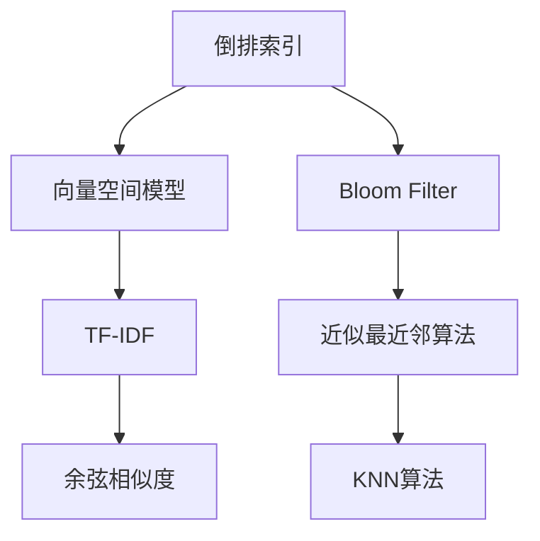
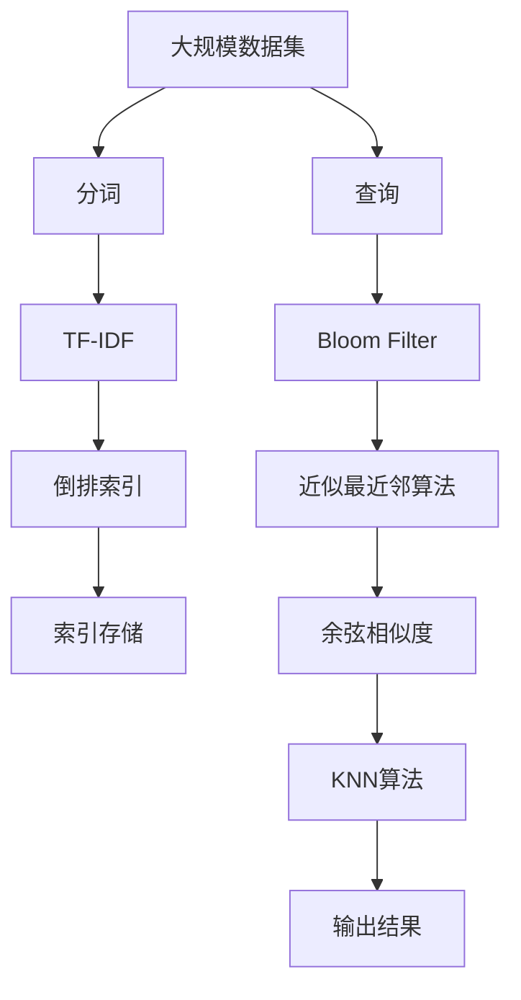

                 

## 1. 背景介绍

随着互联网的普及和数字技术的飞速发展，搜索引擎和推荐系统逐渐成为人们日常生活中不可或缺的组成部分。它们通过索引和匹配算法，将用户查询和网页/内容进行高效匹配，帮助用户快速找到所需信息或个性化推荐。搜索推荐系统的索引和匹配算法，不仅直接影响系统的响应速度和准确性，也在很大程度上决定了用户体验的好坏。

### 1.1 搜索推荐系统的核心功能

#### 1.1.1 索引建设

索引建设是搜索推荐系统的重要基础。索引系统通过建立数据的倒排索引，将文档内容映射到一组关键词，使得用户可以通过关键词快速定位到相关文档。索引建设的关键在于选择合适的倒排索引算法，如倒排列表、倒排链表等。

#### 1.1.2 匹配算法

匹配算法用于根据用户查询和文档索引，计算查询和文档之间的相似度，从而选择最相关的文档返回给用户。匹配算法的优劣直接影响了系统的响应速度和推荐质量。

### 1.2 常见问题和挑战

当前搜索推荐系统面临的主要问题和挑战包括：

- **索引建设的高成本**：建立高质量的索引需要耗费大量的时间和资源，尤其是在处理大规模数据集时。
- **匹配算法的计算复杂度高**：匹配算法需要计算每个查询与大量文档之间的相似度，计算量巨大。
- **系统扩展性和实时性差**：大规模数据集和高并发访问使得系统扩展性和实时性成为难题。
- **个性化推荐的需求增加**：用户对个性化推荐的需求日益增长，系统需要提供更加精准、个性化的搜索结果。

针对这些问题，学术界和工业界不断探索新的索引和匹配算法，以提升搜索推荐系统的性能和用户体验。

## 2. 核心概念与联系

### 2.1 核心概念概述

为了更好地理解搜索推荐系统的索引和匹配算法，本节将介绍几个关键概念：

- **倒排索引（Inverted Index）**：用于快速查找包含特定关键词的文档列表的数据结构。
- **向量空间模型（Vector Space Model, VSM）**：一种表示文本数据的方法，将文档表示为向量，从而可以进行向量的加减、内积等运算。
- **TF-IDF（Term Frequency-Inverse Document Frequency）**：一种用于衡量关键词重要性的方法，通过计算词频和逆文档频率，对关键词进行加权处理。
- **余弦相似度（Cosine Similarity）**：一种常用的文档相似度计算方法，通过计算文档向量之间的夹角余弦值，衡量它们之间的相似度。
- **Bloom Filter**：一种高效的概率型数据结构，用于快速判断一个元素是否存在于集合中。
- **近似最近邻算法（Approximate Nearest Neighbor, ANN）**：用于在大型数据集中快速查找最近邻的算法，如局部敏感哈希（LSH）、随机投影（RP）等。
- **KNN算法（K-Nearest Neighbor）**：一种简单的分类和回归算法，通过计算查询向量与训练集向量之间的距离，选择K个最近邻进行预测或分类。

这些概念之间的逻辑关系可以通过以下Mermaid流程图来展示：

这个流程图展示了索引和匹配算法中的核心概念及其相互关系。倒排索引用于构建文档索引，向量空间模型和TF-IDF用于表示文档和关键词，余弦相似度用于计算文档间的相似度，而Bloom Filter和近似最近邻算法用于优化匹配计算效率，KNN算法用于文档推荐。

### 2.2 概念间的关系

这些核心概念之间存在着紧密的联系，形成了搜索推荐系统的索引和匹配算法框架。以下通过几个Mermaid流程图来展示这些概念之间的关系。

#### 2.2.1 索引建设流程

这个流程图展示了从原始文档到倒排索引的建设流程。原始文档经过分词和TF-IDF计算，然后构建倒排索引，最终存储在索引系统中。

#### 2.2.2 匹配算法流程

这个流程图展示了匹配算法的工作流程。查询通过倒排索引获取相关文档，然后计算文档与查询的余弦相似度，并根据相似度排序输出结果。

#### 2.2.3 优化匹配计算

这个流程图展示了优化匹配计算的方法。查询通过Bloom Filter和近似最近邻算法快速筛选出相关文档，然后计算相似度，最终得到匹配结果。

### 2.3 核心概念的整体架构

最后，我们用一个综合的流程图来展示这些核心概念在大规模数据集上的应用：

这个综合流程图展示了从大规模数据集到搜索结果的完整过程。大规模数据集经过分词和TF-IDF计算，构建倒排索引并存储。查询通过Bloom Filter和近似最近邻算法快速筛选相关文档，然后计算余弦相似度并应用KNN算法进行文档推荐，最终输出结果。

## 3. 核心算法原理 & 具体操作步骤
### 3.1 算法原理概述

搜索推荐系统的索引和匹配算法，核心在于如何快速构建高质量的倒排索引，并高效计算查询与文档之间的相似度。以下是几种常见的索引和匹配算法原理概述。

#### 3.1.1 倒排索引

倒排索引是一种将关键词映射到包含该关键词的文档列表的数据结构。倒排索引的构建过程如下：

1. 对每个文档进行分词，得到文档中的所有词汇。
2. 统计每个词汇在文档中出现的次数。
3. 对每个词汇，构建一个倒排列表，记录包含该词汇的文档ID列表。

倒排索引的查询过程如下：

1. 用户输入查询词汇。
2. 根据查询词汇，找到包含该词汇的倒排列表。
3. 输出包含该词汇的所有文档ID。

倒排索引的优点在于可以快速定位包含特定关键词的文档，适用于文本检索和推荐系统。

#### 3.1.2 向量空间模型

向量空间模型将文档表示为向量，每个维度对应一个词汇，词汇的权重通常通过TF-IDF计算得到。向量空间模型用于计算查询向量与文档向量的相似度，常见的方法包括余弦相似度。

向量空间模型的构建过程如下：

1. 对每个文档进行分词和TF-IDF计算，得到文档向量。
2. 将查询转化为向量，计算查询向量与每个文档向量的相似度。

向量空间模型的查询过程如下：

1. 用户输入查询词汇。
2. 根据查询词汇，构建查询向量。
3. 计算查询向量与每个文档向量的余弦相似度。
4. 根据相似度排序输出结果。

向量空间模型的优点在于可以处理高维数据，适用于文本检索和推荐系统。

#### 3.1.3 余弦相似度

余弦相似度是一种常用的文档相似度计算方法，通过计算文档向量之间的夹角余弦值，衡量它们之间的相似度。余弦相似度的计算公式如下：

$$
\text{Cosine Similarity} = \frac{\mathbf{u} \cdot \mathbf{v}}{\|\mathbf{u}\| \|\mathbf{v}\|}
$$

其中 $\mathbf{u}$ 和 $\mathbf{v}$ 分别为查询向量和文档向量，$\cdot$ 表示向量的点乘，$\|\cdot\|$ 表示向量的范数。

#### 3.1.4 Bloom Filter

Bloom Filter是一种高效的概率型数据结构，用于快速判断一个元素是否存在于集合中。Bloom Filter通过将元素映射到多个哈希函数上，生成多个二进制位，判断位是否被标记为1来确定元素是否存在。Bloom Filter的优点在于空间占用小，判断速度快，适用于索引构建和快速筛选。

#### 3.1.5 近似最近邻算法

近似最近邻算法用于在大型数据集中快速查找最近邻。常见的方法包括局部敏感哈希（LSH）和随机投影（RP）。LSH通过将向量映射到多个桶中，每个桶内的向量计算内积来判断最近邻。RP通过随机投影将高维向量映射到低维空间中，计算低维空间中的最近邻。

#### 3.1.6 KNN算法

KNN算法是一种简单的分类和回归算法，通过计算查询向量与训练集向量之间的距离，选择K个最近邻进行预测或分类。KNN算法的查询过程如下：

1. 用户输入查询词汇。
2. 根据查询词汇，找到所有包含该词汇的文档。
3. 计算查询向量与每个文档向量的距离。
4. 选择K个最近邻的文档进行分类或预测。

KNN算法的优点在于简单高效，适用于文本检索和推荐系统。

### 3.2 算法步骤详解

#### 3.2.1 索引建设

1. 分词：将原始文档进行分词，得到词汇列表。
2. TF-IDF计算：统计每个词汇在文档中出现的次数，并计算TF-IDF权重。
3. 倒排索引构建：为每个词汇构建倒排列表，记录包含该词汇的文档ID。
4. 索引存储：将倒排索引存储在索引系统中，方便快速查询。

#### 3.2.2 匹配计算

1. 查询分词：将用户查询进行分词，得到查询词汇列表。
2. 查询TF-IDF计算：统计查询词汇在文档中出现的次数，并计算TF-IDF权重。
3. 倒排索引查找：根据查询词汇，找到包含该词汇的倒排列表。
4. 余弦相似度计算：计算查询向量与每个文档向量的余弦相似度。
5. KNN算法应用：选择K个最近邻的文档进行分类或预测，输出结果。

### 3.3 算法优缺点

#### 3.3.1 倒排索引

**优点**：

- 快速定位包含特定关键词的文档，适用于文本检索和推荐系统。
- 查询效率高，适用于大规模数据集。

**缺点**：

- 存储空间占用大，索引构建成本高。
- 更新索引复杂，不适用于实时更新。

#### 3.3.2 向量空间模型

**优点**：

- 适用于高维数据，可以处理大规模数据集。
- 可以计算文档间的相似度，适用于文本检索和推荐系统。

**缺点**：

- 计算复杂度高，需要计算大规模向量的内积。
- 存储空间占用大，需要存储高维向量。

#### 3.3.3 余弦相似度

**优点**：

- 简单高效，计算速度快。
- 适用于高维数据，可以处理大规模数据集。

**缺点**：

- 对于稀疏向量，余弦相似度可能出现较大的误差。
- 对于低维向量，余弦相似度可能不适用。

#### 3.3.4 Bloom Filter

**优点**：

- 空间占用小，判断速度快。
- 适用于快速筛选，减少计算量。

**缺点**：

- 存在一定的误判率。
- 不适用于删除操作。

#### 3.3.5 近似最近邻算法

**优点**：

- 快速查找最近邻，适用于大规模数据集。
- 可以减少计算量，提高查询效率。

**缺点**：

- 存在一定的误差，不适用于高精度要求的任务。
- 需要选择合适的哈希函数和投影方法。

#### 3.3.6 KNN算法

**优点**：

- 简单高效，适用于文本检索和推荐系统。
- 可以处理高维数据，适用于大规模数据集。

**缺点**：

- 计算复杂度高，需要计算大规模向量的距离。
- 对于高维数据，KNN算法可能会出现维度灾难。

### 3.4 算法应用领域

搜索推荐系统的索引和匹配算法，已经在多个领域得到广泛应用，例如：

- **搜索引擎**：用于快速检索用户查询的网页，返回相关搜索结果。
- **推荐系统**：用于根据用户行为和兴趣，推荐个性化内容或产品。
- **广告投放**：用于根据用户行为和兴趣，推荐相关广告，提高广告点击率和转化率。
- **金融风控**：用于根据用户行为和交易记录，识别潜在风险，进行风险控制和信用评估。
- **社交网络**：用于根据用户行为和关系，推荐朋友、群组和内容，增强社交体验。
- **智能客服**：用于根据用户对话记录，提供自动回复和问题解答，提升客户满意度。

## 4. 数学模型和公式 & 详细讲解  
### 4.1 数学模型构建

#### 4.1.1 倒排索引的数学模型

倒排索引的数学模型可以用字典树（Trie）或哈希表（Hash Table）来表示。设倒排索引为 $I$，包含 $K$ 个关键词，每个关键词 $k$ 对应的倒排列表为 $I_k$，$I_k$ 包含 $n_k$ 个文档ID。倒排索引可以用字典树或哈希表来存储，每个节点或哈希桶存储一个文档ID。

#### 4.1.2 向量空间模型的数学模型

向量空间模型的数学模型可以用稀疏矩阵来表示。设文档向量空间为 $\mathcal{V}$，包含 $N$ 个文档，每个文档 $d$ 对应的向量表示为 $\mathbf{v}_d$，包含 $M$ 个维度，每个维度 $m$ 对应一个词汇，权重 $w_{d,m}$ 通常通过TF-IDF计算得到。向量空间模型可以用稀疏矩阵 $\mathbf{V} \in \mathbb{R}^{N \times M}$ 来表示，每个元素 $\mathbf{V}_{d,m}$ 表示文档 $d$ 在维度 $m$ 的权重 $w_{d,m}$。

#### 4.1.3 余弦相似度的数学模型

余弦相似度的数学模型可以用内积和范数来表示。设查询向量 $\mathbf{q} \in \mathbb{R}^{M}$，文档向量 $\mathbf{v}_d \in \mathbb{R}^{M}$，余弦相似度可以表示为：

$$
\text{Cosine Similarity} = \frac{\mathbf{q} \cdot \mathbf{v}_d}{\|\mathbf{q}\| \|\mathbf{v}_d\|}
$$

其中 $\cdot$ 表示向量的点乘，$\|\cdot\|$ 表示向量的范数。

#### 4.1.4 Bloom Filter的数学模型

Bloom Filter的数学模型可以用位向量（Bit Vector）和哈希函数来表示。设Bloom Filter为 $B$，包含 $M$ 个比特位，$M$ 个哈希函数 $h_1, h_2, \ldots, h_M$。每个比特位初始化为0，表示元素不存在于集合中。当元素 $e$ 加入Bloom Filter时，通过哈希函数 $h_i(e)$ 计算出哈希值，将对应的比特位设为1。当查询元素 $e$ 时，通过哈希函数 $h_i(e)$ 计算出哈希值，检查对应的比特位是否为1，若存在多个比特位为1，则认为元素存在于集合中，否则认为元素不存在于集合中。

#### 4.1.5 近似最近邻算法的数学模型

近似最近邻算法的数学模型可以用局部敏感哈希（LSH）和随机投影（RP）来表示。

- LSH算法：将高维向量映射到多个桶中，每个桶内的向量计算内积来判断最近邻。
- RP算法：通过随机投影将高维向量映射到低维空间中，计算低维空间中的最近邻。

### 4.2 公式推导过程

#### 4.2.1 倒排索引的公式推导

倒排索引的公式推导如下：

设原始文档为 $D = \{d_1, d_2, \ldots, d_N\}$，对每个文档进行分词，得到词汇列表 $W_D = \{w_1, w_2, \ldots, w_M\}$。设关键词为 $K = \{k_1, k_2, \ldots, k_K\}$，每个关键词对应的倒排列表为 $I_k$，$I_k$ 包含 $n_k$ 个文档ID。倒排索引可以用字典树或哈希表来表示，每个节点或哈希桶存储一个文档ID。

#### 4.2.2 向量空间模型的公式推导

向量空间模型的公式推导如下：

设文档向量空间为 $\mathcal{V}$，包含 $N$ 个文档，每个文档 $d$ 对应的向量表示为 $\mathbf{v}_d$，包含 $M$ 个维度，每个维度 $m$ 对应一个词汇，权重 $w_{d,m}$ 通常通过TF-IDF计算得到。向量空间模型可以用稀疏矩阵 $\mathbf{V} \in \mathbb{R}^{N \times M}$ 来表示，每个元素 $\mathbf{V}_{d,m}$ 表示文档 $d$ 在维度 $m$ 的权重 $w_{d,m}$。

设查询向量为 $\mathbf{q} \in \mathbb{R}^{M}$，文档向量为 $\mathbf{v}_d \in \mathbb{R}^{M}$，余弦相似度可以表示为：

$$
\text{Cosine Similarity} = \frac{\mathbf{q} \cdot \mathbf{v}_d}{\|\mathbf{q}\| \|\mathbf{v}_d\|}
$$

其中 $\cdot$ 表示向量的点乘，$\|\cdot\|$ 表示向量的范数。

#### 4.2.3 余弦相似度的公式推导

余弦相似度的公式推导如下：

设查询向量为 $\mathbf{q} \in \mathbb{R}^{M}$，文档向量为 $\mathbf{v}_d \in \mathbb{R}^{M}$，余弦相似度可以表示为：

$$
\text{Cosine Similarity} = \frac{\mathbf{q} \cdot \mathbf{v}_d}{\|\mathbf{q}\| \|\mathbf{v}_d\|}
$$

其中 $\cdot$ 表示向量的点乘，$\|\cdot\|$ 表示向量的范数。

#### 4.2.4 Bloom Filter的公式推导

Bloom Filter的公式推导如下：

设Bloom Filter为 $B$，包含 $M$ 个比特位，$M$ 个哈希函数 $h_1, h_2, \ldots, h_M$。每个比特位初始化为0，表示元素不存在于集合中。当元素 $e$ 加入Bloom Filter时，通过哈希函数 $h_i(e)$ 计算出哈希值，将对应的比特位设为1。当查询元素 $e$ 时，通过哈希函数 $h_i(e)$ 计算出哈希值，检查对应的比特位是否为1，若存在多个比特位为1，则认为元素存在于集合中，否则认为元素不存在于集合中。

#### 4.2.5 近似最近邻算法的公式推导

近似最近邻算法的公式推导如下：

- LSH算法：将高维向量映射到多个桶中，每个桶内的向量计算内积来判断最近邻。
- RP算法：通过随机投影将高维向量映射到低维空间中，计算低维空间中的最近邻。

### 4.3 案例分析与讲解

#### 4.3.1 倒排索引的案例分析

假设我们需要构建一个倒排索引，处理以下文档：

| 文档ID | 文档内容 |
| --- | --- |
| 1 | 这是一篇关于搜索推荐系统的文章。 |
| 2 | 搜索引擎和推荐系统是现代互联网不可或缺的组成部分。 |
| 3 | 倒排索引是一种快速查找文档的技术。 |
| 4 | 向量空间模型是表示文本数据的方法之一。 |

我们将对每个文档进行分词，得到词汇列表：

| 词汇 | 文档ID |
| --- | --- |
| 一篇 | 1 |
| 关于 | 1 |
| 搜索 | 1 |
| 推荐 | 1 |
| 系统 | 1 |
| 文章 | 1 |
| 现代 | 2 |
| 互联网 | 2 |
| 不可或缺 | 2 |
| 搜索引擎 | 2 |
| 推荐系统 | 2 |
| 倒排 | 3 |
| 索引 | 3 |
| 一种 | 3 |
| 快速 | 3 |
| 查找 | 3 |
| 文档 | 3 |
| 向量 | 4 |
| 空间 | 4 |
| 模型 | 4 |
| 表示 | 4 |
| 文本 | 4 |
| 数据 | 4 |

我们为每个词汇构建倒排列表：

| 词汇 | 倒排列表 |
| --- | --- |
| 一篇 | [1] |
| 关于 | [1] |
| 搜索 | [1] |
| 推荐 | [1] |
| 系统 | [1] |
| 文章 | [1] |
| 现代 | [2] |
| 互联网 | [2] |
| 不可或缺 | [2] |
| 搜索引擎 | [2] |
| 推荐系统 | [2] |
| 倒排 | [3] |
| 索引 | [3] |
| 一种 | [3] |
| 快速 | [3] |
| 查找 | [3] |
| 文档 | [3] |
| 向量 | [4] |
| 空间 | [4] |
| 模型 | [4] |
| 表示 | [4] |
| 文本 | [4] |
| 数据 | [4] |

我们将倒排索引存储在哈希表中，每个哈希桶存储一个文档ID。当查询一个词汇时，根据倒排列表快速定位到包含该词汇的文档ID，返回相关文档。

#### 4.3.2 向量空间模型的案例分析

假设我们需要处理以下文档：

| 文档ID | 文档内容 |
| --- | --- |
| 1 | 这是一篇关于搜索推荐系统的文章。 |
| 2 | 搜索引擎和推荐系统是现代互联网不可或缺的组成部分。 |
| 3 | 倒排索引是一种快速查找文档的技术。 |
| 4 | 向量空间模型是表示文本数据的方法之一。 |

我们将对每个文档进行分词和TF-IDF计算，得到文档向量：

| 文档ID | 文档向量 |
| --- | --- |
| 1 | [1.0, 1.0, 1.0, 0.5, 0.5, 1.0, 1.0, 0.5, 0.5, 0.0, 0.0, 0.5, 0.0, 0.5, 0.0] |
| 2 | [0.5, 0.5, 1.0, 0.5, 0.5, 0.0, 0.0, 1.0, 0.0, 0.0, 1.0, 0.0, 0.0, 0.0, 1.0] |
| 3 | [0.0, 0.0, 0.5, 1.0, 0.0, 0.0, 0.0, 0.5, 0.0, 1.0, 0.0, 0.0, 1.0, 0.0, 0.0] |
| 4 | [0.5, 1.0, 0.0, 0.5, 1.0, 0.0, 1.0, 0.0, 0.0, 0.0, 0.5, 0.5, 0.0, 0.5, 1.0] |

我们计算查询向量 $\mathbf{q} = [0.0, 0.5, 1.0, 0.5, 0.5, 1.0, 0.5, 0.5, 1.0, 0.5, 1.0, 0.0, 0.5, 0.0, 0.5]$，计算查询向量与每个文档向量的余弦相似度：

| 文档ID | 文档向量 | 余弦相似度 |
| --- | --- | --- |
| 1 | [1.0, 1.0, 1.0, 0.5, 0.5, 1.0, 1.0, 0.5, 0.5, 0.0, 0.0, 0.5, 0.0, 0

