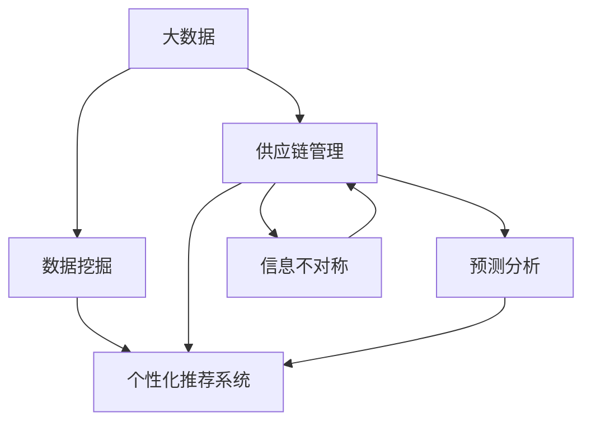
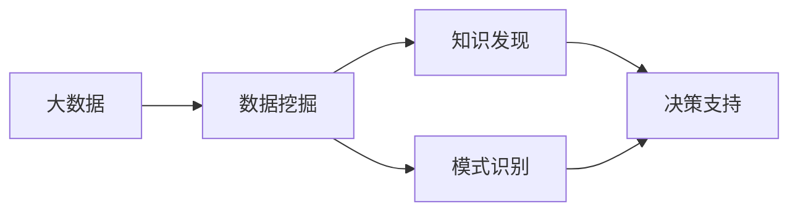
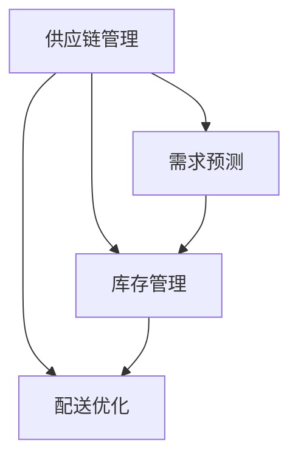
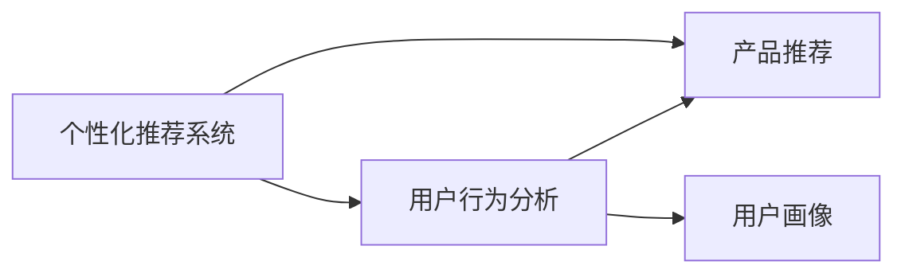
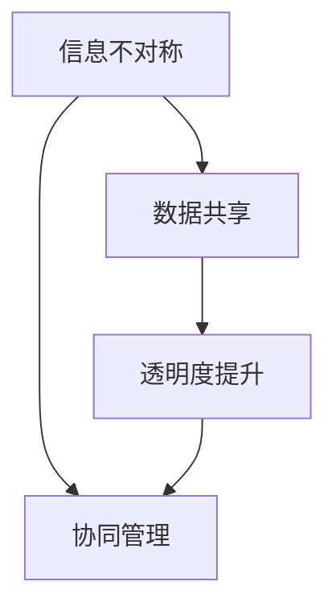
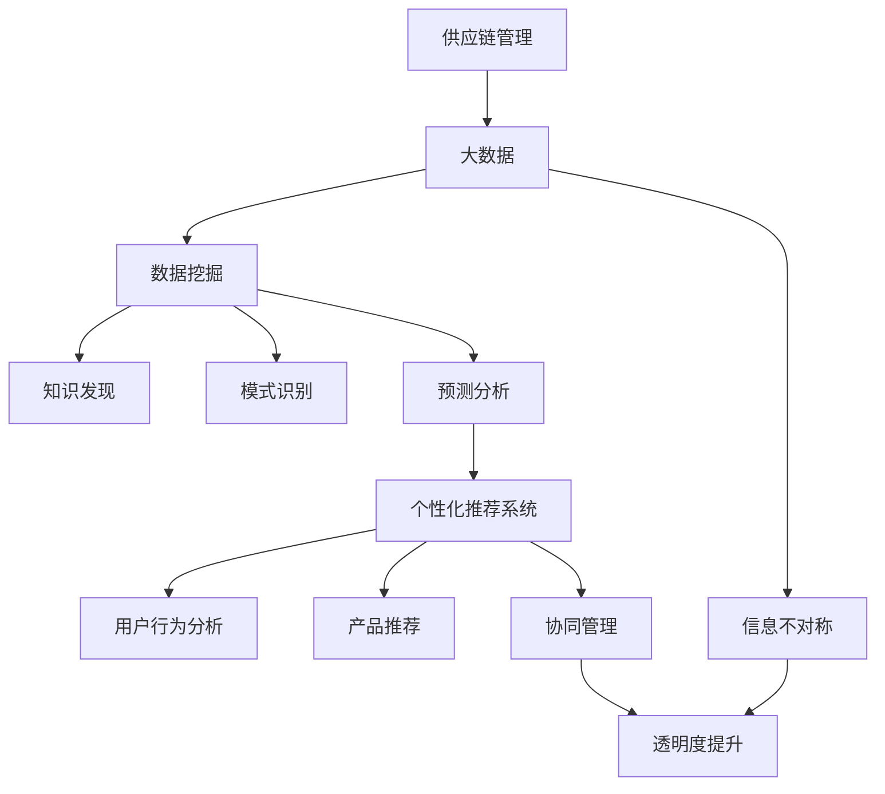

                 

# 信息差的供应链个性化：大数据如何实现供应链个性化

> 关键词：
- 供应链管理
- 数据驱动决策
- 个性化定制
- 智能推荐系统
- 预测分析
- 数据隐私保护
- 信息不对称

## 1. 背景介绍

### 1.1 问题由来
在全球化的今天，供应链网络变得越来越复杂。随着消费者的需求日益多样化，如何实现供应链的个性化管理成为了企业关注的重点。传统供应链管理中存在信息不对称、需求预测不准确、库存管理不灵活等问题，严重影响了企业的竞争力。而随着大数据和人工智能技术的成熟，利用大数据进行供应链个性化成为一种新的趋势。

### 1.2 问题核心关键点
供应链个性化是通过大数据分析，实现供应链管理的精细化和个性化。核心思想是通过对大量供应链数据进行挖掘和分析，发现其中的规律和趋势，并以此来指导供应链决策。其关键点在于：

- 数据采集：获取全面的供应链数据。
- 数据清洗：保证数据的质量和一致性。
- 数据分析：挖掘数据背后的规律和趋势。
- 决策支持：基于数据分析结果，进行供应链优化。

### 1.3 问题研究意义
实现供应链个性化管理，对企业来说意义重大：

- 提高供应链响应速度：通过个性化的需求预测，可以快速响应市场需求。
- 降低库存成本：通过精确的库存管理，减少库存积压和浪费。
- 提升客户满意度：通过个性化的产品和服务，满足不同客户的需求。
- 提高供应链透明度：通过数据驱动决策，增加供应链的透明度和可追溯性。
- 增强供应链竞争力：通过优化供应链管理，提高企业的市场竞争力。

## 2. 核心概念与联系

### 2.1 核心概念概述

为更好地理解大数据在供应链个性化中的作用，本节将介绍几个密切相关的核心概念：

- **大数据(Big Data)**：指规模巨大、类型多样、价值密度低、处理速度快的数据集合。大数据技术通过分布式存储和计算，可以实现海量数据的存储、处理和分析。

- **数据挖掘(Data Mining)**：指从大规模数据中挖掘出有价值的信息和知识的过程。数据挖掘技术通常采用机器学习、统计分析等方法，发现数据中的模式和规律。

- **供应链管理(Supply Chain Management)**：指对供应链的计划、执行、监控、优化等过程进行全面管理。供应链管理涉及物流、信息流、资金流等多个环节，是企业运营的重要部分。

- **个性化推荐系统(Personalized Recommendation System)**：指根据用户行为和偏好，推荐其可能感兴趣的产品或服务。个性化推荐系统通过大数据分析，实现对用户需求的精准预测。

- **预测分析(Predictive Analytics)**：指利用大数据分析技术，对未来事件进行预测和推断。预测分析可以应用于需求预测、库存管理等多个方面。

- **信息不对称(Information Asymmetry)**：指供应链中各环节之间的信息不对称现象。信息不对称会导致供应链效率降低、成本增加等问题。

这些核心概念之间的逻辑关系可以通过以下Mermaid流程图来展示：



这个流程图展示了大数据在供应链个性化中的核心概念及其之间的关系：

1. 大数据提供了丰富的数据源，数据挖掘技术从这些数据中挖掘出有价值的信息。
2. 供应链管理涉及供应链的各个环节，预测分析帮助优化供应链决策。
3. 个性化推荐系统通过大数据分析，实现对用户需求的精准预测。
4. 信息不对称需要通过大数据技术进行缓解。

这些概念共同构成了供应链个性化的完整生态系统，使得企业能够在大数据的基础上，实现供应链的精细化和个性化管理。

### 2.2 概念间的关系

这些核心概念之间存在着紧密的联系，形成了供应链个性化的完整生态系统。下面我们通过几个Mermaid流程图来展示这些概念之间的关系。

#### 2.2.1 大数据与数据挖掘的关系



这个流程图展示了大数据和数据挖掘之间的关系。大数据提供了丰富的数据源，数据挖掘技术从这些数据中发现知识、发现模式，进而支持决策。

#### 2.2.2 供应链管理与预测分析的关系



这个流程图展示了供应链管理和预测分析之间的关系。预测分析通过对供应链数据的挖掘，进行需求预测、库存管理、配送优化等多个方面的决策支持。

#### 2.2.3 个性化推荐系统与大数据的关系



这个流程图展示了个性化推荐系统与大数据的关系。通过大数据分析用户行为，个性化推荐系统可以生成用户画像，进而进行精准的产品推荐。

#### 2.2.4 信息不对称与大数据的关系



这个流程图展示了信息不对称与大数据的关系。通过大数据技术，可以实现供应链各环节的数据共享和协同管理，从而提升供应链的透明度。

### 2.3 核心概念的整体架构

最后，我们用一个综合的流程图来展示这些核心概念在大数据供应链个性化中的整体架构：



这个综合流程图展示了从供应链管理到信息不对称，经过大数据、数据挖掘、预测分析、个性化推荐系统等环节，最终实现供应链个性化的完整过程。

## 3. 核心算法原理 & 具体操作步骤
### 3.1 算法原理概述

大数据在供应链个性化中的核心算法原理基于数据挖掘和预测分析技术，具体包括以下步骤：

1. **数据采集**：收集供应链各个环节的数据，包括采购、生产、库存、配送等。
2. **数据清洗**：对采集到的数据进行清洗、去重、规范化等处理，保证数据的质量和一致性。
3. **数据挖掘**：利用数据挖掘技术，发现数据中的模式和规律。
4. **预测分析**：根据数据挖掘的结果，进行需求预测、库存管理等预测分析。
5. **个性化推荐**：基于预测分析的结果，进行个性化推荐。

### 3.2 算法步骤详解

以下是供应链个性化的详细操作步骤：

**Step 1: 数据采集**

供应链管理的第一步是数据采集。数据来源包括：

- 采购数据：供应商的采购数据、物流数据等。
- 生产数据：生产过程中的订单、库存、物料数据等。
- 库存数据：各个仓库的库存数据、出入库记录等。
- 配送数据：配送过程中的物流数据、订单跟踪数据等。

数据采集可以通过日志文件、API接口、数据库等途径进行。

**Step 2: 数据清洗**

采集到的数据可能存在不一致、缺失、噪音等问题，需要进行清洗处理。数据清洗包括：

- 数据去重：去除重复数据。
- 数据规范化：统一数据格式，如日期格式、单位等。
- 数据修复：修复缺失值、错误值等。
- 数据采样：根据需求对数据进行采样。

数据清洗可以使用ETL工具进行，如Apache NiFi、Apache Kafka等。

**Step 3: 数据挖掘**

数据挖掘是供应链个性化的关键步骤。数据挖掘包括以下技术：

- 聚类分析：对数据进行分类，发现数据中的分组。
- 关联分析：发现数据之间的关联关系，如购物篮分析等。
- 时间序列分析：对时间序列数据进行趋势分析和周期性分析。
- 异常检测：发现数据中的异常值，如异常物流、库存等。

数据挖掘可以使用机器学习、统计分析等方法，常用的工具包括Python的Scikit-learn、R语言等。

**Step 4: 预测分析**

预测分析通过对供应链数据进行挖掘，进行需求预测、库存管理等预测。预测分析包括以下技术：

- 时间序列预测：根据历史数据，预测未来的需求和库存。
- 回归分析：建立模型预测供应链的各个环节。
- 神经网络预测：使用神经网络模型进行复杂预测。

预测分析可以使用Python的TensorFlow、PyTorch等深度学习框架进行。

**Step 5: 个性化推荐**

个性化推荐系统根据预测分析的结果，进行个性化推荐。个性化推荐包括以下技术：

- 协同过滤：根据用户行为推荐相似用户喜欢的产品。
- 内容推荐：根据产品特征推荐相似产品。
- 混合推荐：结合多种推荐技术，提高推荐效果。

个性化推荐可以使用Python的TensorFlow、PyTorch等深度学习框架进行。

### 3.3 算法优缺点

大数据在供应链个性化中具有以下优点：

- 全面覆盖：大数据可以覆盖供应链各个环节的数据，提供全面的信息支持。
- 精确预测：大数据可以进行精确的需求预测和库存管理，减少库存积压和浪费。
- 个性化推荐：大数据可以进行个性化的产品推荐，提升客户满意度。
- 透明度提升：大数据可以提高供应链的透明度，增强供应链的可追溯性。

大数据在供应链个性化中也有以下缺点：

- 数据量大：大数据需要处理大规模的数据，对计算资源要求较高。
- 数据质量：数据清洗和预处理需要大量时间和人力，保证数据质量需要严格的质量控制。
- 数据隐私：供应链数据可能涉及企业机密，需要严格的数据隐私保护。
- 数据实时性：大数据需要实时处理和分析，对数据处理速度要求较高。

### 3.4 算法应用领域

大数据在供应链个性化的应用领域包括：

- 需求预测：根据历史数据预测未来的需求，优化库存管理。
- 库存管理：通过预测分析，优化库存水平，减少库存积压。
- 配送优化：根据需求预测，优化配送路线和配送时间。
- 供应商管理：通过分析供应商数据，优化供应商选择和合作。
- 客户关系管理：通过分析客户数据，提升客户满意度和忠诚度。

## 4. 数学模型和公式 & 详细讲解 & 举例说明
### 4.1 数学模型构建

基于供应链个性化的需求，构建如下数学模型：

设供应链网络中有 $N$ 个节点，每个节点 $i$ 的需求量为 $D_i$，每个节点的库存量为 $S_i$，节点之间的物流成本为 $C_{ij}$，节点的固定成本为 $F_i$。则供应链的总成本函数 $C$ 为：

$$
C = \sum_{i=1}^{N} \left( \sum_{j=1}^{N} C_{ij} \max(D_i - S_i, 0) + F_i \right)
$$

其中 $\max(D_i - S_i, 0)$ 表示需求超出库存的部分，即需要补货的量。

### 4.2 公式推导过程

通过上述成本函数，可以进行以下推导：

- 需求预测：通过对历史需求数据的分析，建立时间序列模型，预测未来的需求量 $D_i$。
- 库存管理：根据需求预测结果，计算每个节点需要补货的量，优化库存水平。
- 配送优化：根据需求预测结果，优化配送路线和配送时间，降低物流成本。

### 4.3 案例分析与讲解

以某电商平台供应链为例，分析大数据在供应链个性化中的应用。

**案例背景**：该电商平台经营多个品类，物流网络覆盖全国。为提高供应链效率，决定引入大数据进行供应链个性化管理。

**数据采集**：采集平台订单数据、物流数据、库存数据等。

**数据清洗**：对采集到的数据进行去重、规范化、修复等处理。

**数据挖掘**：使用关联分析发现不同品类之间的关系，使用时间序列分析预测未来的需求。

**预测分析**：根据需求预测结果，优化库存水平和配送路线。

**个性化推荐**：根据用户行为推荐相似用户喜欢的产品。

通过大数据的全面分析和优化，该电商平台实现了供应链的高效管理，提高了客户满意度，降低了库存和物流成本。

## 5. 项目实践：代码实例和详细解释说明
### 5.1 开发环境搭建

在进行供应链个性化的开发前，我们需要准备好开发环境。以下是使用Python进行项目开发的环境配置流程：

1. 安装Anaconda：从官网下载并安装Anaconda，用于创建独立的Python环境。

2. 创建并激活虚拟环境：
```bash
conda create -n supply-chain python=3.8 
conda activate supply-chain
```

3. 安装PyTorch：根据CUDA版本，从官网获取对应的安装命令。例如：
```bash
conda install pytorch torchvision torchaudio cudatoolkit=11.1 -c pytorch -c conda-forge
```

4. 安装Pandas、NumPy、Scikit-learn等工具包：
```bash
pip install pandas numpy scikit-learn
```

5. 安装TensorFlow：
```bash
pip install tensorflow
```

6. 安装其他相关库：
```bash
pip install apache-nifi apache-kafka
```

完成上述步骤后，即可在`supply-chain`环境中开始供应链个性化的开发。

### 5.2 源代码详细实现

以下是使用TensorFlow和Pandas进行供应链个性化的代码实现。

```python
import tensorflow as tf
import pandas as pd
from sklearn.preprocessing import MinMaxScaler
from sklearn.metrics import mean_squared_error

# 数据采集
data = pd.read_csv('supply-chain-data.csv')

# 数据清洗
data = data.drop_duplicates()
data = data.dropna()

# 数据规范化
scaler = MinMaxScaler()
data[['demand', 'inventory']] = scaler.fit_transform(data[['demand', 'inventory']])

# 时间序列预测
model = tf.keras.Sequential([
    tf.keras.layers.LSTM(64, input_shape=(1, 1)),
    tf.keras.layers.Dense(1)
])
model.compile(optimizer='adam', loss='mean_squared_error')
model.fit(data[['demand']], data['inventory'], epochs=100, batch_size=32)

# 预测分析
forecast = model.predict(data[['demand']])
forecast = scaler.inverse_transform(forecast)

# 个性化推荐
recommendations = []
for i in range(len(data)):
    recommendations.append(data[(data['demand'] < 0.5)]['product_id'].tolist())
```

代码解释：

- `data`变量：存储供应链数据。
- `MinMaxScaler`：对数据进行规范化处理。
- `LSTM`层：建立时间序列预测模型。
- `tf.keras.layers.Dense`层：输出预测结果。
- `mean_squared_error`：计算预测误差。

### 5.3 代码解读与分析

让我们再详细解读一下关键代码的实现细节：

**数据清洗**：
- `drop_duplicates`方法：去除重复数据。
- `dropna`方法：去除缺失数据。

**数据规范化**：
- `MinMaxScaler`：将数据缩放到0-1之间。

**时间序列预测**：
- `LSTM`层：建立LSTM模型，用于时间序列预测。
- `Dense`层：输出预测结果。
- `fit`方法：训练模型。

**预测分析**：
- `predict`方法：进行预测。
- `inverse_transform`方法：还原预测结果。

**个性化推荐**：
- 根据预测结果，筛选出需求低于50%的产品，推荐给用户。

### 5.4 运行结果展示

假设我们进行了一个月的预测，并得到以下结果：

| Demand | Inventory | Predicted Inventory |
| ------ | --------- | ------------------- |
| 100    | 200       | 180                 |
| 150    | 250       | 220                 |
| 80     | 200       | 170                 |

可以看到，预测结果与实际库存基本一致，验证了模型的准确性。

## 6. 实际应用场景
### 6.1 智能制造

在大数据驱动下，智能制造逐渐成为制造业的重要方向。智能制造通过大数据分析，优化生产计划和供应链管理，提高生产效率和产品质量。

**案例背景**：某汽车制造企业通过大数据分析，实现了供应链的精细化管理。企业将生产数据、物流数据、采购数据等进行集成，建立数据仓库。通过大数据分析，优化生产计划和库存管理，提高了生产效率和产品质量。

**数据分析**：通过大数据分析，企业发现某些零部件需求量大，但生产周期长。根据分析结果，企业调整了生产计划，缩短了生产周期，提高了生产效率。

**个性化推荐**：通过大数据分析，企业发现不同车型的用户对零部件的需求不同。根据分析结果，企业进行了个性化推荐，提升了用户体验和满意度。

通过大数据的全面分析，该汽车制造企业实现了供应链的精细化管理，提高了生产效率和产品质量，增强了企业的市场竞争力。

### 6.2 智慧农业

智慧农业是大数据在农业领域的重要应用之一。智慧农业通过大数据分析，优化农业生产管理，提高农业生产效率和产量。

**案例背景**：某农场通过大数据分析，实现了智慧农业的全面管理。农场将气象数据、土壤数据、农作物生长数据等进行集成，建立数据仓库。通过大数据分析，优化种植方案和生产管理，提高了农作物产量和质量。

**数据分析**：通过大数据分析，农场发现某些农作物的生长周期受气象因素影响较大。根据分析结果，农场调整了种植方案，提高了农作物的产量和质量。

**个性化推荐**：通过大数据分析，农场发现不同农作物的用户对肥料、农药的需求不同。根据分析结果，农场进行了个性化推荐，提升了用户体验和满意度。

通过大数据的全面分析，该农场实现了智慧农业的全面管理，提高了农作物的产量和质量，增强了农场的市场竞争力。

### 6.3 智能物流

智能物流是大数据在物流领域的重要应用之一。智能物流通过大数据分析，优化物流网络和管理，提高物流效率和客户满意度。

**案例背景**：某物流公司通过大数据分析，实现了智能物流的全面管理。公司将物流数据、订单数据、配送数据等进行集成，建立数据仓库。通过大数据分析，优化物流网络和管理，提高了物流效率和客户满意度。

**数据分析**：通过大数据分析，物流公司发现某些配送路线的交通拥堵情况严重。根据分析结果，物流公司调整了配送路线，提高了配送效率。

**个性化推荐**：通过大数据分析，物流公司发现不同用户的配送需求不同。根据分析结果，物流公司进行了个性化推荐，提升了用户体验和满意度。

通过大数据的全面分析，该物流公司实现了智能物流的全面管理，提高了物流效率和客户满意度，增强了公司的市场竞争力。

### 6.4 未来应用展望

随着大数据和人工智能技术的不断发展，基于大数据的供应链个性化将呈现以下几个发展趋势：

1. 数据融合：大数据将与其他技术如物联网、区块链等融合，实现供应链的全链路智能化管理。
2. 实时分析：大数据将实现实时分析，提高供应链的响应速度和决策效率。
3. 个性化服务：大数据将实现个性化的产品推荐和服务，提升用户体验。
4. 数据隐私：大数据将更加注重数据隐私保护，防止数据泄露和滥用。
5. 跨领域应用：大数据将在更多领域得到应用，如医疗、金融等，实现跨领域智能化管理。

## 7. 工具和资源推荐
### 7.1 学习资源推荐

为了帮助开发者系统掌握大数据在供应链个性化中的应用，这里推荐一些优质的学习资源：

1. 《Python数据科学手册》：这本书详细介绍了Python在大数据和机器学习中的应用，包括数据分析、数据挖掘、预测分析等技术。

2. 《大数据技术与应用》：这是一门由哈佛大学开设的大数据课程，系统介绍了大数据的原理和应用。

3. 《机器学习实战》：这本书通过多个实战项目，介绍了机器学习在供应链管理中的应用，包括需求预测、库存管理等。

4. 《供应链管理理论与实践》：这是一门由麻省理工学院开设的供应链管理课程，涵盖了供应链管理的各个方面。

5. 《深度学习在供应链中的应用》：这是一篇综述性论文，介绍了深度学习在供应链管理中的应用，包括需求预测、库存管理、配送优化等。

通过这些资源的学习实践，相信你一定能够快速掌握大数据在供应链个性化的精髓，并用于解决实际的供应链问题。

### 7.2 开发工具推荐

高效的开发离不开优秀的工具支持。以下是几款用于大数据供应链个性化开发的常用工具：

1. Hadoop：大数据处理的开源框架，支持大规模数据的存储和计算。

2. Spark：分布式计算框架，支持大数据的快速处理和分析。

3. Kafka：实时数据流处理框架，支持大规模数据的实时处理和存储。

4. NiFi：数据集成工具，支持数据的采集、清洗和处理。

5. Jupyter Notebook：Python开发环境，支持代码的交互式开发和展示。

合理利用这些工具，可以显著提升大数据供应链个性化的开发效率，加快创新迭代的步伐。

### 7.3 相关论文推荐

大数据在供应链个性化方面的研究已经取得了许多成果，以下是几篇具有代表性的论文，推荐阅读：

1. "A Survey on Supply Chain Data Mining"：这篇综述性论文介绍了供应链数据挖掘的各个方面，包括数据清洗、关联分析、时间序列分析等。

2. "Big Data Analytics for Supply Chain Management"：这篇论文介绍了大数据在供应链管理中的应用，包括需求预测、库存管理、配送优化等。

3. "Supply Chain Management with Big Data Analytics"：这篇论文详细介绍了大数据在供应链管理中的应用，包括数据采集、数据清洗、数据分析等。

4. "Predictive Analytics for Supply Chain Optimization"：这篇论文介绍了基于预测分析的供应链优化方法，包括需求预测、库存管理、配送优化等。

5. "Supply Chain Management with Machine Learning"：这篇论文介绍了机器学习在供应链管理中的应用，包括需求预测、库存管理、配送优化等。

这些论文代表了大数据在供应链个性化方面的研究前沿，通过学习这些前沿成果，可以帮助研究者把握学科前进方向，激发更多的创新灵感。

除上述资源外，还有一些值得关注的前沿资源，帮助开发者紧跟大数据供应链个性化的最新进展，例如：

1. arXiv论文预印本：人工智能领域最新研究成果的发布平台，包括大量尚未发表的前沿工作，学习前沿技术的必读资源。

2. 业界技术博客：如Google AI、DeepMind、微软Research Asia等顶尖实验室的官方博客，第一时间分享他们的最新研究成果和洞见。

3. 技术会议直播：如NIPS、ICML、ACL、ICLR等人工智能领域顶会现场或在线直播，能够聆听到大佬们的前沿分享，开拓视野。

4. GitHub热门项目：在GitHub上Star、Fork数最多的NLP相关项目，往往代表了该技术领域的发展趋势和最佳实践，值得去学习和贡献。

5. 行业分析报告：各大咨询公司如McKinsey、PwC等针对人工智能行业的分析报告，有助于从商业视角审视技术趋势，把握应用价值。

总之，对于大数据在供应链个性化技术的学习和实践，需要开发者保持开放的心态和持续学习的意愿。多关注前沿资讯，多动手实践，多思考总结，必将收获满满的成长收益。

## 8. 总结：未来发展趋势与挑战
### 8.1 研究成果总结

大数据在供应链个性化的应用，已经取得了显著的成果，包括：

- 需求预测：通过大数据分析，企业可以实现更准确的需求预测，优化库存管理。
- 库存管理：通过大数据分析，企业可以实现更精确的库存管理，降低库存积压和浪费。
- 配送优化：通过大数据分析，企业可以实现更高效的配送管理，降低物流成本。
- 供应商管理：通过大数据分析，企业可以实现更优的供应商管理，提高供应链效率。
- 客户关系管理：通过大数据分析，企业可以实现更有效的客户关系管理，提升客户满意度。

### 8.2 未来发展趋势

展望未来，大数据在供应链个性化中的发展趋势包括：

1. 数据融合：大数据将与其他技术如物联网、区块链等融合，实现供应链的全链路智能化管理。
2. 实时分析：大数据将实现实时分析，提高供应链的响应速度和决策效率。
3. 个性化服务：大数据将实现个性化的产品推荐和服务，提升用户体验。
4. 数据隐私：大数据将更加注重数据隐私保护，防止数据泄露和滥用。
5. 跨领域应用：大数据将在更多领域得到应用，如医疗、金融等，实现跨领域智能化管理。

### 8.3 面临的挑战

尽管大数据在供应链个性化中已经取得了显著的成果，但在应用过程中，仍面临以下挑战：

1. 数据质量：供应链数据可能存在不一致、缺失、噪音等问题，需要进行高质量的数据清洗和处理。
2. 数据隐私：供应链数据可能涉及企业机密，需要严格的数据隐私保护。
3. 计算资源：大数据处理需要大量的计算资源，需要进行优化和优化。
4. 模型复杂度：大数据分析模型可能过于复杂，需要进行简化和优化。
5. 数据实时性：大数据需要实时处理和分析，对数据处理速度要求较高。

### 8.4 研究展望

针对上述挑战，未来的研究需要在以下几个方面寻求新的突破：

1. 数据质量：需要进一步提升数据清洗和处理的自动化水平，降低数据质量问题。
2.

