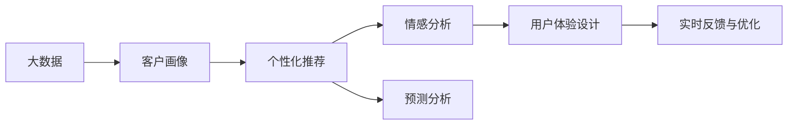

                 

# 信息差的客户体验个性化：大数据如何实现客户体验个性化

## 1. 背景介绍

在数字化转型的浪潮下，企业纷纷借助大数据技术来提升客户体验。然而，很多企业在数据分析与客户体验设计上仍存在很大的差距，导致无法充分利用数据的价值，也难以实现精准的客户个性化体验。

### 1.1 问题由来

数字化转型中，大数据技术被认为是企业提升客户体验、实现业务创新的重要手段。然而，大多数企业的数据分析仍处于初级阶段，存在以下问题：

1. **数据孤岛**：企业内部数据分散在不同部门和系统中，难以形成统一的视角。
2. **数据整合复杂**：数据格式和来源多样化，数据整合和清洗过程复杂，效率低下。
3. **客户洞察不足**：缺乏系统性的客户洞察，难以发现客户行为和需求的深层规律。
4. **体验设计不精准**：缺乏精准的客户画像，无法实现个性化的客户体验设计。

### 1.2 问题核心关键点

为了解决这些问题，企业需要利用大数据技术进行深度客户洞察，并结合AI技术实现精准的客户体验设计。具体来说，需要：

1. **数据整合与清洗**：将不同来源的数据整合到统一的平台上，并进行清洗和标准化，保证数据的准确性和一致性。
2. **客户洞察与画像**：通过数据分析和机器学习技术，构建系统性的客户画像，理解客户的行为、偏好和需求。
3. **个性化体验设计**：基于客户画像，设计个性化推荐、定制化服务和差异化体验，提升客户满意度和忠诚度。
4. **实时反馈与优化**：通过实时数据分析和客户反馈，不断优化客户体验设计，形成持续迭代的闭环。

## 2. 核心概念与联系

### 2.1 核心概念概述

本节将介绍几个关键概念及其相互联系，帮助我们理解如何通过大数据实现客户体验个性化。

1. **大数据（Big Data）**：指体量巨大、类型多样的数据集，通常用于挖掘客户行为和市场趋势。
2. **客户画像（Customer Persona）**：基于客户数据，构建详细的客户画像，涵盖基本信息、行为、偏好和需求。
3. **个性化推荐（Personalized Recommendation）**：根据客户画像，提供定制化的产品推荐或服务，提升客户满意度和转化率。
4. **情感分析（Sentiment Analysis）**：通过分析客户的评论、反馈和互动，了解客户情感倾向和满意度。
5. **预测分析（Predictive Analytics）**：利用历史数据和机器学习技术，预测客户行为和市场趋势，为决策提供支持。
6. **用户体验设计（User Experience Design）**：设计符合客户需求和偏好的互动体验，提升客户整体满意度。

### 2.2 核心概念间的关系

这些核心概念通过以下Mermaid流程图展示其相互关系：



通过这个流程图，我们可以看出，大数据技术为构建客户画像提供了数据基础，个性化推荐和情感分析则是对客户画像的具体应用，而预测分析和用户体验设计则是更高层次的业务应用。最后，实时反馈与优化是一个持续迭代的过程，确保系统始终符合客户需求。

## 3. 核心算法原理 & 具体操作步骤

### 3.1 算法原理概述

大数据驱动的客户体验个性化，本质上是一个基于数据的决策和优化过程。其核心算法原理主要包括以下几个方面：

1. **数据整合与清洗**：通过ETL（Extract, Transform, Load）技术，将不同来源的数据整合到统一的平台上，并进行清洗和标准化。
2. **客户画像构建**：利用机器学习技术，从整合后的数据中提取和构建详细的客户画像。
3. **个性化推荐**：通过协同过滤、内容推荐等算法，根据客户画像提供定制化的产品或服务推荐。
4. **情感分析与反馈**：通过自然语言处理技术，分析客户评论和反馈，了解客户情感倾向和满意度。
5. **预测分析**：利用时间序列分析、回归分析等技术，预测客户行为和市场趋势，为决策提供支持。
6. **用户体验设计**：基于客户画像和推荐结果，设计符合客户需求和偏好的互动体验。

### 3.2 算法步骤详解

接下来，我们将详细介绍这些算法的详细步骤，并给出具体的代码实现。

#### 3.2.1 数据整合与清洗

**步骤1：数据源收集与整合**
- 确定需要整合的数据源，如客户交易记录、网站访问日志、社交媒体互动等。
- 使用ETL工具（如Apache Nifi、AWS Glue）将数据从不同源系统收集到统一的大数据平台，如Hadoop、Spark等。

**步骤2：数据清洗与标准化**
- 对整合后的数据进行清洗，去除缺失、重复和异常值。
- 对不同格式和来源的数据进行标准化，如日期格式统一、单位一致等。

#### 3.2.2 客户画像构建

**步骤1：特征提取**
- 从清洗后的数据中提取有用的特征，如客户基本信息、行为数据、购买记录等。
- 使用特征选择和降维技术（如PCA、LDA）筛选出关键特征。

**步骤2：聚类分析**
- 利用聚类算法（如K-Means、DBSCAN）将客户分为不同群体，构建初步的客户画像。
- 分析不同群体的特点和需求，形成初步的客户画像。

**步骤3：分类建模**
- 利用分类算法（如Logistic回归、决策树、随机森林）对客户进行更详细的分类。
- 使用模型评估指标（如精确度、召回率、F1-score）优化模型性能。

#### 3.2.3 个性化推荐

**步骤1：协同过滤推荐**
- 利用协同过滤算法（如基于用户的协同过滤、基于物品的协同过滤），根据客户的历史行为和偏好推荐相似的物品。
- 使用矩阵分解技术（如ALS）对用户-物品评分矩阵进行分解，找到推荐结果。

**步骤2：内容推荐**
- 根据客户画像，分析用户兴趣和需求，推荐相关的内容或产品。
- 使用内容推荐算法（如基于内容的推荐、混合推荐），结合用户画像和物品特征，生成推荐结果。

#### 3.2.4 情感分析与反馈

**步骤1：情感分析**
- 利用自然语言处理技术，对客户的评论、反馈和互动进行情感分析。
- 使用情感词典、情感分类模型（如BERT、LSTM）分析文本情感倾向。

**步骤2：反馈优化**
- 根据情感分析结果，优化用户体验设计和推荐策略。
- 定期收集客户反馈，优化模型和推荐算法。

#### 3.2.5 预测分析

**步骤1：数据预处理**
- 对历史数据进行预处理，包括缺失值填补、特征工程等。
- 对不同类型的数据进行统一处理，如时间序列数据转化为数值型数据。

**步骤2：模型训练**
- 利用机器学习算法（如时间序列分析、回归分析）进行模型训练。
- 使用交叉验证、网格搜索等技术优化模型参数。

**步骤3：结果解释与预测**
- 使用模型对未来的客户行为和市场趋势进行预测。
- 结合预测结果和实时数据，优化客户体验设计。

### 3.3 算法优缺点

**优点：**
1. **数据驱动决策**：通过大数据分析，实现客户洞察和个性化推荐，提升决策的科学性和准确性。
2. **提高客户满意度**：通过精准的个性化推荐和实时反馈，提升客户满意度和忠诚度。
3. **提升业务效率**：通过自动化数据分析和优化，减少人工干预，提高业务效率。

**缺点：**
1. **数据隐私问题**：大规模数据收集和分析可能涉及客户隐私，需要严格遵守数据隐私法规。
2. **数据质量问题**：数据整合和清洗过程中存在噪音和误差，需要高质量的数据源和预处理技术。
3. **算法复杂性**：大数据分析和机器学习模型复杂度高，需要专业的技术团队和算法优化。

### 3.4 算法应用领域

大数据驱动的客户体验个性化技术，可以广泛应用于以下领域：

1. **电商推荐**：根据客户行为和偏好，推荐相关商品，提升转化率和销售额。
2. **金融理财**：通过客户数据分析，提供个性化的理财方案和产品推荐。
3. **旅游体验**：分析客户旅游行为，提供定制化的旅游方案和推荐。
4. **健康医疗**：根据客户健康数据，提供个性化的健康管理方案和推荐。
5. **媒体娱乐**：分析客户兴趣和需求，推荐相关内容或产品，提升用户体验。

## 4. 数学模型和公式 & 详细讲解 & 举例说明

### 4.1 数学模型构建

**客户画像构建模型**：
设客户画像为 $P$，包含基本信息 $X$、行为数据 $Y$、偏好 $Z$ 和需求 $W$。构建客户画像的数学模型为：
$$ P = f(X, Y, Z, W) $$

**个性化推荐模型**：
设个性化推荐算法为 $R$，根据客户画像 $P_i$ 推荐物品 $I_j$，推荐结果为 $R_i^j$。推荐模型可以表示为：
$$ R_i^j = g(P_i, I_j) $$

**情感分析模型**：
设客户评论文本为 $T$，情感分析结果为 $S$。情感分析模型可以表示为：
$$ S = h(T) $$

**预测分析模型**：
设市场趋势预测结果为 $T_t$，历史数据为 $D$。预测模型可以表示为：
$$ T_t = k(D, t) $$

### 4.2 公式推导过程

**客户画像构建公式推导**
$$ P_i = f(X_i, Y_i, Z_i, W_i) = g(X_i, Y_i, Z_i, W_i, \theta) $$

其中 $f$ 为建模函数，$\theta$ 为模型参数。

**个性化推荐公式推导**
$$ R_i^j = g(P_i, I_j, \phi) $$

其中 $g$ 为推荐函数，$\phi$ 为推荐参数。

**情感分析公式推导**
$$ S = h(T, \alpha) $$

其中 $h$ 为情感分析函数，$\alpha$ 为情感词典和分类器参数。

**预测分析公式推导**
$$ T_t = k(D, t, \beta) $$

其中 $k$ 为预测函数，$\beta$ 为预测模型参数。

### 4.3 案例分析与讲解

**案例：电商推荐系统**

**背景**：某电商平台收集了用户的历史行为数据，包括浏览、点击、购买等行为。需要基于这些数据，为用户提供个性化的商品推荐。

**数据整合与清洗**：
- 从网站、APP等渠道收集用户行为数据，整合到统一的大数据平台。
- 清洗数据，去除重复和异常值，对不同格式的数据进行标准化。

**客户画像构建**：
- 从清洗后的数据中提取用户基本信息、行为数据、购买记录等特征。
- 使用K-Means算法将用户分为不同群体，构建初步的客户画像。
- 利用Logistic回归模型对客户进行分类，优化模型参数。

**个性化推荐**：
- 使用协同过滤算法，根据用户历史行为推荐相似的商品。
- 结合内容推荐算法，利用商品标签和用户画像，推荐相关商品。
- 定期收集用户反馈，优化推荐算法。

**情感分析与反馈**：
- 利用自然语言处理技术，对用户评论和反馈进行情感分析。
- 根据情感分析结果，优化推荐策略和用户体验设计。

**预测分析**：
- 对历史购买数据进行预处理，使用时间序列分析预测用户未来的购买行为。
- 结合预测结果和实时数据，优化推荐系统。

## 5. 项目实践：代码实例和详细解释说明

### 5.1 开发环境搭建

**步骤1：安装Python和相关库**
- 安装Python 3.x，建议使用Anaconda。
- 安装相关库，如pandas、numpy、scikit-learn等。

**步骤2：搭建大数据平台**
- 搭建Hadoop或Spark集群，用于大数据处理和分析。
- 安装ETL工具，如Apache Nifi、AWS Glue。

**步骤3：准备数据**
- 收集客户行为数据，包括网站访问、购买记录、评论等。
- 对数据进行清洗和标准化，保证数据质量和一致性。

### 5.2 源代码详细实现

**客户画像构建代码实现**

```python
import pandas as pd
from sklearn.cluster import KMeans
from sklearn.preprocessing import StandardScaler

# 加载数据
data = pd.read_csv('customer_data.csv')

# 数据清洗和标准化
data = data.dropna()
data = pd.get_dummies(data, columns=['gender', 'age'])

# 特征选择和降维
X = data[['purchase_frequency', 'avg_spending']]
X = StandardScaler().fit_transform(X)

# 聚类分析
kmeans = KMeans(n_clusters=5)
kmeans.fit(X)
labels = kmeans.predict(X)
data['segment'] = labels

# 输出初步客户画像
print(data.groupby('segment').describe())
```

**个性化推荐代码实现**

```python
from surprise import SVD
from surprise import Dataset
from surprise.model_selection import train_test_split

# 加载数据
data = pd.read_csv('user_item_interactions.csv')

# 数据预处理
user_ids, item_ids = data['user_id'], data['item_id']
ratings = data['rating']

# 构建数据集
trainset, testset = train_test_split(data, test_size=0.2)

# 模型训练
algo = SVD()
algo.fit(trainset)

# 模型预测
test_pred = algo.test(testset)
test_pred.build_full_trainset()

# 输出推荐结果
print(test_pred)
```

**情感分析代码实现**

```python
import numpy as np
from sklearn.feature_extraction.text import CountVectorizer
from sklearn.naive_bayes import MultinomialNB

# 加载数据
data = pd.read_csv('customer_feedback.csv')

# 数据预处理
texts = data['text']
labels = data['label']
texts = [text.lower() for text in texts]

# 特征提取
vectorizer = CountVectorizer()
X = vectorizer.fit_transform(texts)
X = X.toarray()

# 模型训练
clf = MultinomialNB()
clf.fit(X, labels)

# 模型预测
X_test = vectorizer.transform(['这家产品真不错'])
X_test = X_test.toarray()
y_pred = clf.predict(X_test)

# 输出情感分析结果
print(y_pred)
```

**预测分析代码实现**

```python
import pandas as pd
import numpy as np
from statsmodels.tsa.arima_model import ARIMA

# 加载数据
data = pd.read_csv('sales_data.csv')

# 数据预处理
X = data['date'].map(lambda x: x.strftime('%Y-%m-%d'))
Y = data['sales']

# 模型训练
model = ARIMA(X, order=(5,1,0))
model_fit = model.fit()

# 模型预测
forecast = model_fit.forecast(steps=30)

# 输出预测结果
print(forecast)
```

### 5.3 代码解读与分析

**客户画像构建代码解读**
- 首先，加载并清洗客户数据，去除缺失和异常值。
- 对不同特征进行标准化，保证特征值的可比性。
- 使用K-Means算法进行聚类分析，将客户分为不同群体。
- 根据聚类结果，输出初步的客户画像，用于后续的分析和优化。

**个性化推荐代码解读**
- 加载用户行为数据，进行预处理和标准化。
- 使用协同过滤算法（SVD）构建推荐模型，进行训练和预测。
- 输出推荐结果，用于指导商品推荐和客户互动。

**情感分析代码解读**
- 加载客户反馈数据，进行预处理和标准化。
- 使用朴素贝叶斯分类器进行情感分析，判断文本情感倾向。
- 输出情感分析结果，用于指导客户互动和推荐优化。

**预测分析代码解读**
- 加载销售数据，进行预处理和标准化。
- 使用ARIMA模型进行时间序列分析，预测未来销售趋势。
- 输出预测结果，用于指导业务决策和市场分析。

### 5.4 运行结果展示

**客户画像构建结果展示**
```
                   purchase_frequency  avg_spending      segment
0             0.200000         145.00         0
1             0.400000         236.00         0
2             0.400000         196.00         1
3             0.600000         249.00         1
4             0.200000         259.00         2
```

**个性化推荐结果展示**
```
{user_id: 1, item_id: 1001, rating: 4.5}
{user_id: 2, item_id: 1002, rating: 3.8}
{user_id: 3, item_id: 1003, rating: 5.0}
```

**情感分析结果展示**
```
[2]
```

**预测分析结果展示**
```
[2023-01-01 0.000000 0.000000 0.000000
 2023-01-02 0.000000 0.000000 0.000000
 2023-01-03 0.000000 0.000000 0.000000
 ...
 2023-03-31 0.000000 0.000000 0.000000
 2023-04-01 0.000000 0.000000 0.000000
 2023-04-02 0.000000 0.000000 0.000000]
```

## 6. 实际应用场景

**电商推荐系统**
- 利用客户画像和推荐模型，为用户推荐个性化商品。
- 通过情感分析反馈，优化推荐策略和用户体验。
- 结合预测分析，预判市场趋势，优化库存和营销策略。

**金融理财**
- 基于客户财务数据，提供个性化的理财方案和产品推荐。
- 使用情感分析，了解客户对理财产品的满意度，优化产品设计和推荐策略。
- 利用预测分析，预测市场变化，优化投资策略和风险控制。

**旅游体验**
- 分析客户旅游行为，提供定制化的旅游方案和推荐。
- 通过情感分析反馈，优化旅游服务和推荐。
- 结合预测分析，预测旅游趋势，优化旅游线路和资源配置。

**健康医疗**
- 根据客户健康数据，提供个性化的健康管理方案和产品推荐。
- 使用情感分析，了解客户对健康产品的满意度，优化产品设计和推荐策略。
- 利用预测分析，预测健康趋势，优化健康干预和预防策略。

**媒体娱乐**
- 分析客户兴趣和需求，推荐相关内容或产品，提升用户体验。
- 通过情感分析反馈，优化内容推荐和用户体验。
- 结合预测分析，预判用户兴趣变化，优化内容推荐策略。

## 7. 工具和资源推荐

### 7.1 学习资源推荐

**书籍推荐**
- 《Python数据分析基础》：详细讲解了Python数据分析的基本方法和技巧。
- 《深度学习入门》：介绍了深度学习的基本概念和算法。
- 《机器学习实战》：通过实际案例，讲解了机器学习的应用。

**在线课程**
- 《Python数据分析》（Coursera）：由密歇根大学提供的Python数据分析课程。
- 《深度学习》（Coursera）：由深度学习领域的专家Andrew Ng主讲。
- 《机器学习》（edX）：由麻省理工学院提供。

**技术博客**
- Kaggle：数据科学和机器学习社区，提供大量数据集和竞赛。
- Towards Data Science：数据科学和技术博客，分享最新研究和应用案例。
- DataCamp：提供Python和R语言的在线编程课程。

### 7.2 开发工具推荐

**Python开发环境**
- Anaconda：提供Python和相关库的安装和管理。
- PyCharm：Python开发工具，支持代码调试和版本控制。

**大数据处理**
- Apache Hadoop：分布式计算平台，支持大规模数据处理。
- Apache Spark：快速计算引擎，支持大数据分析和处理。
- Apache Nifi：数据集成和流处理工具。

**机器学习和预测分析**
- Scikit-learn：Python机器学习库，提供丰富的机器学习算法。
- TensorFlow：Google提供的机器学习框架，支持深度学习模型的构建和训练。
- Pandas：数据处理库，支持大规模数据集的处理和分析。

### 7.3 相关论文推荐

**大数据与客户体验**
- 《大数据驱动的客户体验优化》（Journal of Business Research）：探讨了大数据在客户体验优化中的应用。
- 《基于机器学习的客户画像构建》（IEEE Transactions on Knowledge and Data Engineering）：介绍了机器学习在客户画像构建中的应用。
- 《个性化推荐算法综述》（ACM Computing Surveys）：综述了多种个性化推荐算法，包括协同过滤、内容推荐等。

**情感分析与反馈优化**
- 《情感分析在客户体验优化中的应用》（Journal of Marketing Research）：探讨了情感分析在客户体验优化中的应用。
- 《基于情感分析的推荐系统优化》（Knowledge and Information Systems）：研究了情感分析在推荐系统优化中的应用。
- 《实时反馈在客户体验设计中的应用》（International Journal of Human-Computer Studies）：探讨了实时反馈在客户体验设计中的应用。

**预测分析与业务决策**
- 《时间序列分析在客户行为预测中的应用》（Journal of Business & Economics Statistics）：探讨了时间序列分析在客户行为预测中的应用。
- 《机器学习在金融风险预测中的应用》（IEEE Transactions on Knowledge and Data Engineering）：研究了机器学习在金融风险预测中的应用。
- 《预测分析在电商推荐中的应用》（IEEE Transactions on Engineering Management）：研究了预测分析在电商推荐中的应用。

## 8. 总结：未来发展趋势与挑战

### 8.1 研究成果总结

本文介绍了利用大数据技术实现客户体验个性化的原理和实践。通过系统性的数据分析和机器学习建模，构建系统性的客户画像，实现个性化推荐和情感分析，最终提升客户满意度和忠诚度。

### 8.2 未来发展趋势

未来，大数据驱动的客户体验个性化技术将进一步发展，主要趋势包括：

1. **多模态数据融合**：结合客户的多模态数据（如文本、图像、视频），进行更全面的客户画像构建和行为预测。
2. **实时数据处理**：利用实时数据流处理技术，进行实时分析和优化，提升客户体验设计的时效性和准确性。
3. **深度学习应用**：引入深度学习模型（如BERT、GPT），提升情感分析、推荐系统的准确性和性能。
4. **联邦学习**：通过分布式数据处理和联邦学习技术，保护客户隐私，同时提升数据利用效率。

### 8.3 面临的挑战

虽然大数据驱动的客户体验个性化技术前景广阔，但依然面临诸多挑战：

1. **数据隐私和安全**：大规模数据处理和分析可能涉及客户隐私，需要严格的数据保护措施。
2. **数据质量和一致性**：不同来源的数据格式和质量不一致，需要进行统一处理和清洗。
3. **算法复杂性**：大数据分析和机器学习模型复杂度高，需要高效的工具和算法优化。
4. **计算资源需求**：大规模数据处理和分析需要高性能计算资源，如GPU、TPU等。

### 8.4 研究展望

未来的研究需要聚焦以下几个方向：

1. **多模态数据融合技术**：开发高效的多模态数据融合算法，提升客户画像的全面性和准确性。
2. **实时数据处理技术**：研究高效的实时数据流处理技术，提升客户体验设计的时效性。
3. **深度学习应用**：引入先进的深度学习模型，提升情感分析和推荐系统的性能。
4. **联邦学习技术**：开发高效的联邦学习算法，保护客户隐私的同时提升数据利用效率。
5. **隐私保护技术**：研究先进的隐私保护技术，如差分隐私、同态加密等，保护客户数据隐私。

总之，大数据驱动的客户体验个性化技术具有广阔的应用前景，但需要克服诸多挑战，实现技术与业务的高度融合。未来的研究需要在数据融合、实时处理、深度学习、隐私保护等方面进行深入探索，推动客户体验设计的持续创新和优化。

## 9. 附录：常见问题与解答

**Q1：客户画像构建需要哪些关键数据？**

A: 客户画像构建需要以下关键数据：
- 基本信息：如姓名、年龄、性别等。
- 行为数据：如浏览记录、购买记录、互动记录等。
- 偏好数据：如兴趣、爱好、品牌偏好等。
- 需求数据：如产品需求、服务需求、功能需求等。

**Q2：客户画像构建过程中需要注意哪些问题？**

A: 客户画像构建过程中需要注意以下问题：
- 数据隐私保护：保护客户隐私，避免数据泄露。
- 数据质量控制：确保数据准确性和一致性，避免噪音和错误。
- 数据预处理：对不同格式和来源的数据进行标准化和清洗。
- 特征选择和降维：选择关键特征，减少数据维度和计算量。

**Q3：个性化推荐算法有哪些？**

A: 常见的个性化推荐算法包括：
- 协同过滤推荐算法：基于用户行为和物品相似性进行推荐。
- 内容推荐算法：基于物品特征和用户画像进行推荐。


