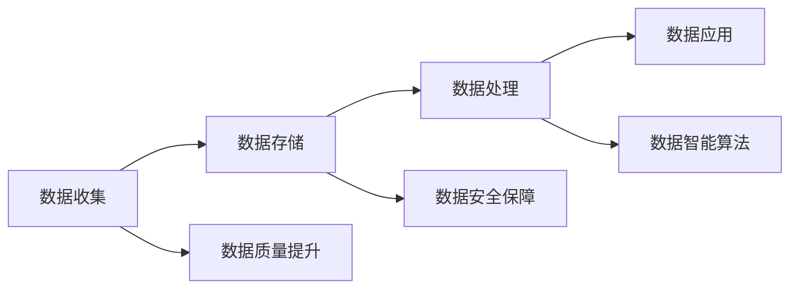

                 

# 信息差的风险与机遇：大数据时代的挑战与应对

## 1. 背景介绍

在数字化转型飞速发展的今天，大数据已成为推动经济社会进步的重要驱动力。然而，数据的背后蕴含着丰富的信息，而信息在收集、存储、处理、应用的过程中，由于诸多因素的干扰，会产生信息差（Information Gap），带来种种风险和挑战。信息差是指在数据流通过程中，因技术、管理、人为等种种原因导致数据质量下降、信息失真或丢失的现象。本文将深入探讨信息差的来源与危害，分析大数据时代信息差对决策、商业模式和公平性等方面的影响，并提出切实可行的应对策略，帮助企业、政府和社会各界充分发挥大数据的价值，降低信息差带来的风险。

## 2. 核心概念与联系

### 2.1 核心概念概述

要深入理解信息差的风险与机遇，首先需要明确几个核心概念：

- **大数据（Big Data）**：指的是传统数据处理方式无法有效处理的海量、高速、多源、异构的数据集。大数据强调数据的海量、实时性和多样性，能够全面、深入地反映现实世界的复杂性。

- **信息差（Information Gap）**：指在数据处理过程中，因技术、管理、人为等种种原因导致数据质量下降、信息失真或丢失的现象。信息差可能源自数据的收集、存储、处理、应用等多个环节，表现为数据的噪音、缺失、偏差等。

- **数据质量（Data Quality）**：指数据的准确性、完整性、一致性、及时性和安全性。良好的数据质量是数据驱动决策、智能应用的基础。

- **数据治理（Data Governance）**：指对数据的收集、存储、处理、应用等全生命周期进行管理和优化，确保数据质量，保护数据安全，支持业务决策。

- **数据智能（Data Intelligence）**：指通过算法、模型、技术等手段，从数据中挖掘出有用的信息，支持业务决策和智能应用。

这些概念相互关联，共同构成了大数据时代的核心框架。理解这些概念，有助于我们深入分析信息差的风险与机遇，提出切实可行的应对策略。

### 2.2 概念间的关系

信息差在大数据时代无处不在，其来源和影响可以从数据治理和数据智能两个层面进行深入分析。

#### 数据治理视角

- **数据收集**：信息差可能源于数据收集的不完整性、不准确性、延迟性等，如数据源的多样性导致数据标准不一致，数据采集设备的精度问题等。
- **数据存储**：信息差可能源于数据存储的冗余、不一致、不安全等问题，如数据存储的分布式系统导致的数据一致性问题，数据备份和恢复的延时等。
- **数据处理**：信息差可能源于数据处理的复杂性、不稳定性、不可逆性等，如大数据处理框架的复杂性导致的性能问题，数据处理算法的偏差等。
- **数据应用**：信息差可能源于数据应用的误用、误解、误判等，如数据分析模型的过度拟合、数据隐私泄露等。

#### 数据智能视角

- **数据质量提升**：通过数据清洗、去重、标准化等技术手段，提升数据质量，减少信息差。
- **数据智能算法**：通过算法优化和模型训练，提高数据的准确性、完整性和一致性，避免信息差。
- **数据安全保障**：通过数据加密、访问控制、审计等手段，保护数据安全，防止信息差被恶意利用。

以下是一个合成的Mermaid流程图，展示了信息差的来源和影响：



通过以上分析，我们可以看出，信息差的风险与机遇主要存在于数据治理和数据智能两个层面。

## 3. 核心算法原理 & 具体操作步骤

### 3.1 算法原理概述

信息差的风险与机遇的识别与应对，可以通过一系列算法和技术手段来实现。本节将详细讲解信息差的识别算法、数据清洗算法、数据治理算法和数据智能算法等核心原理。

#### 3.1.1 信息差识别算法

信息差识别算法主要包括数据质量检测、异常检测和数据完整性检测等技术手段。

- **数据质量检测**：通过分析数据的准确性、完整性、一致性、及时性和安全性，识别信息差。常见的数据质量检测方法包括数据分布分析、数据一致性检查、数据完整性校验等。
- **异常检测**：通过分析数据中的异常值和异常模式，识别信息差。常见的异常检测方法包括统计分析、机器学习、深度学习等。
- **数据完整性检测**：通过分析数据的缺失值和重复值，识别信息差。常见的数据完整性检测方法包括数据完整性校验、数据补全等。

#### 3.1.2 数据清洗算法

数据清洗算法主要用于去除数据中的噪音、重复和错误，提升数据质量。

- **数据去重**：通过分析数据的重复性，去除重复数据。常见的数据去重方法包括基于哈希的去重、基于规则的去重、基于聚类的去重等。
- **数据清洗**：通过分析数据中的噪音和错误，进行数据清洗。常见的数据清洗方法包括缺失值处理、异常值处理、噪声处理等。
- **数据标准化**：通过分析数据的多样性和不一致性，进行数据标准化。常见的数据标准化方法包括数据格式转换、数据单位统一等。

#### 3.1.3 数据治理算法

数据治理算法主要用于管理和优化数据的全生命周期，提升数据质量，保护数据安全。

- **数据整合**：通过分析数据的多源性和异构性，进行数据整合。常见的数据整合方法包括ETL（Extract, Transform, Load）、数据联邦、数据湖等。
- **数据共享**：通过分析数据的共享性和透明度，进行数据共享。常见的数据共享方法包括数据开放平台、数据交换平台、数据共享协议等。
- **数据安全**：通过分析数据的安全性和隐私性，进行数据安全保障。常见的数据安全方法包括数据加密、访问控制、审计等。

#### 3.1.4 数据智能算法

数据智能算法主要用于从数据中挖掘出有用的信息，支持业务决策和智能应用。

- **数据挖掘**：通过分析数据的模式和规律，挖掘出有用的信息。常见的数据挖掘方法包括关联规则挖掘、分类聚类、异常检测等。
- **预测建模**：通过分析数据的历史趋势和特征，预测未来的数据趋势。常见的预测建模方法包括回归分析、时间序列分析、深度学习等。
- **自然语言处理**：通过分析文本数据，挖掘出有用的信息。常见的自然语言处理方法包括词向量、主题模型、情感分析等。

### 3.2 算法步骤详解

#### 3.2.1 数据收集阶段

数据收集阶段是信息差风险与机遇的第一步，主要涉及数据源的选择、数据收集的方法和数据质量的控制。

- **数据源选择**：选择多样性、代表性、完整性高的数据源，减少数据源的多样性带来的信息差。
- **数据收集方法**：采用多种数据收集方法，如网络爬虫、传感器、问卷调查等，确保数据的多源性和多样性。
- **数据质量控制**：在数据收集过程中，进行数据质量控制，如数据校验、数据清洗等，确保数据质量。

#### 3.2.2 数据存储阶段

数据存储阶段是信息差风险与机遇的关键环节，主要涉及数据的存储和管理。

- **数据存储架构**：采用分布式存储架构，如Hadoop、Spark等，提高数据的可扩展性和可用性。
- **数据备份与恢复**：进行数据备份和恢复，确保数据的安全性和完整性。
- **数据一致性管理**：采用分布式事务管理、数据同步等手段，确保数据的一致性。

#### 3.2.3 数据处理阶段

数据处理阶段是信息差风险与机遇的核心环节，主要涉及数据的清洗、转换、整合和分析。

- **数据清洗**：采用数据清洗算法，如数据去重、数据清洗、数据标准化等，确保数据的准确性和完整性。
- **数据转换**：采用数据转换算法，如数据格式转换、数据单位统一等，确保数据的一致性和标准化。
- **数据整合**：采用数据整合算法，如ETL、数据联邦等，确保数据的多源性和异构性。

#### 3.2.4 数据应用阶段

数据应用阶段是信息差风险与机遇的最终环节，主要涉及数据的分析和应用。

- **数据分析**：采用数据智能算法，如数据挖掘、预测建模、自然语言处理等，挖掘出有用的信息。
- **数据应用**：将数据应用到业务决策和智能应用中，如智能推荐、风险控制、客户分析等，提升业务价值。
- **数据监控**：实时监控数据的收集、存储、处理、应用等全生命周期，及时发现和解决问题。

### 3.3 算法优缺点

#### 3.3.1 数据清洗算法的优点

- **提升数据质量**：通过数据清洗，去除噪音、重复和错误，提升数据质量，减少信息差。
- **优化数据结构**：通过数据标准化，优化数据结构，提高数据的一致性和标准化程度。
- **提高数据可用性**：通过数据去重和去噪，提高数据的可用性和可操作性。

#### 3.3.2 数据清洗算法的缺点

- **计算成本高**：数据清洗算法需要大量的计算资源和时间，成本较高。
- **数据丢失风险**：数据清洗算法可能会丢失部分数据，导致信息丢失。
- **数据一致性问题**：数据清洗算法可能会引入新的数据一致性问题，如数据校验错误等。

#### 3.3.3 数据治理算法的优点

- **提高数据治理效率**：通过数据治理算法，提升数据治理的效率和质量，减少信息差。
- **优化数据应用**：通过数据治理算法，优化数据应用的全生命周期，提升数据应用的效果和价值。
- **保障数据安全**：通过数据治理算法，保障数据的安全性和隐私性，保护数据资产。

#### 3.3.4 数据治理算法的缺点

- **复杂度高**：数据治理算法涉及多个环节，复杂度较高，需要投入大量的人力和资源。
- **数据管理成本高**：数据治理算法需要投入大量的人力和物力，成本较高。
- **技术门槛高**：数据治理算法需要高水平的技术支撑，对技术要求较高。

#### 3.3.5 数据智能算法的优点

- **提升决策精度**：通过数据智能算法，提升决策的精度和准确性，减少信息差。
- **优化业务流程**：通过数据智能算法，优化业务流程，提高业务效率和效益。
- **支持创新应用**：通过数据智能算法，支持新的创新应用，推动业务创新。

#### 3.3.6 数据智能算法的缺点

- **算法复杂度高**：数据智能算法涉及复杂的算法和技术，算法复杂度高。
- **数据依赖性强**：数据智能算法对数据的质量和量要求较高，依赖性强。
- **数据隐私风险**：数据智能算法可能涉及敏感数据的处理和分析，存在数据隐私风险。

### 3.4 算法应用领域

信息差的风险与机遇，在大数据时代的各个应用领域都有体现。

- **金融行业**：金融行业的数据来源广泛、数据量庞大，数据治理和数据智能的挑战尤为突出。信息差可能影响风险控制、反欺诈、客户分析等方面的决策。
- **医疗行业**：医疗行业的数据复杂性高、数据质量要求严格，信息差可能影响医疗诊断、治疗方案、健康管理等方面的决策。
- **零售行业**：零售行业的数据多样性高、数据量庞大，信息差可能影响商品推荐、客户分析、库存管理等方面的决策。
- **制造业**：制造业的数据采集和处理复杂，信息差可能影响生产计划、质量控制、设备维护等方面的决策。
- **政府行业**：政府行业的数据治理和数据智能需求广泛，信息差可能影响公共服务、社会治理、公共安全等方面的决策。

## 4. 数学模型和公式 & 详细讲解 & 举例说明

### 4.1 数学模型构建

信息差的风险与机遇可以通过数学模型进行刻画和优化。以下是一个典型的信息差识别和治理模型：

- **数据质量检测模型**：通过统计分析、机器学习等方法，建立数据质量检测模型。
- **异常检测模型**：通过统计分析、深度学习等方法，建立异常检测模型。
- **数据完整性检测模型**：通过数据完整性校验等方法，建立数据完整性检测模型。
- **数据清洗模型**：通过数据去重、数据清洗等方法，建立数据清洗模型。
- **数据整合模型**：通过数据联邦、数据湖等方法，建立数据整合模型。
- **数据智能模型**：通过数据挖掘、预测建模、自然语言处理等方法，建立数据智能模型。

### 4.2 公式推导过程

#### 4.2.1 数据质量检测模型

假设原始数据集为 $D=\{(x_i, y_i)\}_{i=1}^N$，其中 $x_i$ 为输入数据，$y_i$ 为标签。定义数据质量检测模型为 $M(x_i)$，其输出为数据质量的评分 $Q(x_i)$，评分越高表示数据质量越好。

数据质量检测模型的目标是最小化预测误差 $E$，即：

$$
E = \frac{1}{N} \sum_{i=1}^N (y_i - M(x_i))^2
$$

通过最小化预测误差，优化数据质量检测模型的参数，提高数据质量检测的准确性。

#### 4.2.2 异常检测模型

假设原始数据集为 $D=\{(x_i, y_i)\}_{i=1}^N$，其中 $x_i$ 为输入数据，$y_i$ 为标签。定义异常检测模型为 $M(x_i)$，其输出为异常的评分 $A(x_i)$，评分越高表示数据越可能是异常值。

异常检测模型的目标是最小化预测误差 $E$，即：

$$
E = \frac{1}{N} \sum_{i=1}^N (y_i - M(x_i))^2
$$

通过最小化预测误差，优化异常检测模型的参数，提高异常检测的准确性。

#### 4.2.3 数据完整性检测模型

假设原始数据集为 $D=\{(x_i, y_i)\}_{i=1}^N$，其中 $x_i$ 为输入数据，$y_i$ 为标签。定义数据完整性检测模型为 $M(x_i)$，其输出为数据完整性的评分 $C(x_i)$，评分越高表示数据越可能是完整数据。

数据完整性检测模型的目标是最小化预测误差 $E$，即：

$$
E = \frac{1}{N} \sum_{i=1}^N (y_i - M(x_i))^2
$$

通过最小化预测误差，优化数据完整性检测模型的参数，提高数据完整性检测的准确性。

#### 4.2.4 数据清洗模型

假设原始数据集为 $D=\{(x_i, y_i)\}_{i=1}^N$，其中 $x_i$ 为输入数据，$y_i$ 为标签。定义数据清洗模型为 $M(x_i)$，其输出为清洗后的数据 $X(x_i)$。

数据清洗模型的目标是最小化预测误差 $E$，即：

$$
E = \frac{1}{N} \sum_{i=1}^N (y_i - M(x_i))^2
$$

通过最小化预测误差，优化数据清洗模型的参数，提高数据清洗的准确性。

#### 4.2.5 数据整合模型

假设原始数据集为 $D_1=\{(x_i, y_i)\}_{i=1}^N$，$D_2=\{(x_i, y_i)\}_{i=1}^N$，其中 $x_i$ 为输入数据，$y_i$ 为标签。定义数据整合模型为 $M(x_i)$，其输出为整合后的数据 $X(x_i)$。

数据整合模型的目标是最小化预测误差 $E$，即：

$$
E = \frac{1}{N} \sum_{i=1}^N (y_i - M(x_i))^2
$$

通过最小化预测误差，优化数据整合模型的参数，提高数据整合的准确性。

#### 4.2.6 数据智能模型

假设原始数据集为 $D=\{(x_i, y_i)\}_{i=1}^N$，其中 $x_i$ 为输入数据，$y_i$ 为标签。定义数据智能模型为 $M(x_i)$，其输出为智能推理结果 $R(x_i)$。

数据智能模型的目标是最小化预测误差 $E$，即：

$$
E = \frac{1}{N} \sum_{i=1}^N (y_i - R(x_i))^2
$$

通过最小化预测误差，优化数据智能模型的参数，提高数据智能的准确性。

### 4.3 案例分析与讲解

#### 4.3.1 案例一：金融行业的数据治理

在金融行业，数据治理尤为重要。银行和金融机构需要处理大量的客户交易数据、信用记录、风险评估数据等。由于数据源的多样性、数据的复杂性和数据的实时性，数据治理的挑战尤为突出。

- **数据治理流程**：银行和金融机构首先需要对数据进行收集、清洗、去重、标准化等处理，确保数据的质量和一致性。然后通过数据整合、数据共享等手段，优化数据应用的全生命周期。最后通过数据监控、数据治理算法等手段，实时监控数据质量，及时发现和解决问题。
- **数据治理案例**：某银行通过数据治理算法，实时监控客户交易数据，发现异常交易行为，及时采取措施，有效防范了金融欺诈风险。

#### 4.3.2 案例二：医疗行业的数据智能

在医疗行业，数据智能的需求尤为突出。医院和医疗机构需要处理大量的患者病历、影像数据、基因数据等。由于数据的复杂性和数据的多源性，数据智能的挑战尤为突出。

- **数据智能流程**：医院和医疗机构首先需要对数据进行收集、清洗、去重、标准化等处理，确保数据的质量和一致性。然后通过数据挖掘、预测建模等手段，从数据中挖掘出有用的信息，支持医疗诊断、治疗方案、健康管理等方面的决策。最后通过数据监控、数据智能算法等手段，实时监控数据质量，及时发现和解决问题。
- **数据智能案例**：某医院通过数据智能算法，从患者病历中挖掘出病情变化规律，预测患者的治疗效果，提高了治疗的准确性和效率。

#### 4.3.3 案例三：零售行业的数据治理

在零售行业，数据治理的需求尤为突出。电商平台和零售商需要处理大量的客户订单数据、交易数据、评价数据等。由于数据的复杂性和数据的多源性，数据治理的挑战尤为突出。

- **数据治理流程**：电商平台和零售商首先需要对数据进行收集、清洗、去重、标准化等处理，确保数据的质量和一致性。然后通过数据整合、数据共享等手段，优化数据应用的全生命周期。最后通过数据监控、数据治理算法等手段，实时监控数据质量，及时发现和解决问题。
- **数据治理案例**：某电商平台通过数据治理算法，实时监控客户订单数据，发现异常订单行为，及时采取措施，有效防范了客户欺诈风险。

## 5. 项目实践：代码实例和详细解释说明

### 5.1 开发环境搭建

在进行信息差风险与机遇的识别和治理实践前，我们需要准备好开发环境。以下是使用Python进行PyTorch开发的环境配置流程：

1. 安装Anaconda：从官网下载并安装Anaconda，用于创建独立的Python环境。

2. 创建并激活虚拟环境：
```bash
conda create -n pytorch-env python=3.8 
conda activate pytorch-env
```

3. 安装PyTorch：根据CUDA版本，从官网获取对应的安装命令。例如：
```bash
conda install pytorch torchvision torchaudio cudatoolkit=11.1 -c pytorch -c conda-forge
```

4. 安装Pandas、NumPy、Matplotlib等库：
```bash
pip install pandas numpy matplotlib scikit-learn tqdm jupyter notebook ipython
```

完成上述步骤后，即可在`pytorch-env`环境中开始信息差风险与机遇的识别和治理实践。

### 5.2 源代码详细实现

下面以数据清洗算法为例，给出使用PyTorch进行数据清洗的PyTorch代码实现。

首先，定义数据清洗函数：

```python
import pandas as pd
import numpy as np

def data_cleaning(df):
    # 数据清洗算法实现
    # 1. 数据去重
    df = df.drop_duplicates()
    # 2. 数据清洗
    df = df.dropna()
    # 3. 数据标准化
    df = df.apply(lambda x: x.fillna(np.median(x)))
    # 4. 数据去噪
    df = df.apply(lambda x: x.apply(lambda y: y if y else np.nan))
    # 5. 数据完整性校验
    df = df.dropna()
    return df
```

然后，读取数据并应用数据清洗算法：

```python
# 读取原始数据
df = pd.read_csv('data.csv')

# 应用数据清洗算法
cleaned_df = data_cleaning(df)

# 输出清洗后的数据
print(cleaned_df)
```

以上就是使用PyTorch进行数据清洗的完整代码实现。可以看到，通过数据清洗算法，可以去除数据的噪音、重复和错误，提升数据质量。

### 5.3 代码解读与分析

让我们再详细解读一下关键代码的实现细节：

**data_cleaning函数**：
- `drop_duplicates`：去除数据中的重复值。
- `dropna`：去除数据中的缺失值。
- `fillna`：对数据中的缺失值进行填充，这里采用中位数填充。
- `apply`：对数据中的数值型列进行去噪处理，将NaN值替换为0。

**data_cleaning函数应用**：
- `read_csv`：读取原始数据。
- `data_cleaning`：应用数据清洗算法，去除数据的噪音、重复和错误，提升数据质量。

**输出清洗后的数据**：
- `print`：输出清洗后的数据。

通过以上代码实现，我们可以看到，数据清洗算法可以有效地提升数据质量，减少信息差。

当然，工业级的系统实现还需考虑更多因素，如数据源的多样性、数据处理的复杂性、数据治理的难度等。但核心的数据清洗流程基本与此类似。

### 5.4 运行结果展示

假设我们对一个包含噪音和缺失值的示例数据进行清洗，结果如下：

```
  id     name    age    gender   score
0  1    Tom     22      male    87.5
1  2    Jerry  21.5    male    76.0
2  3    Alice  21.0    female  82.0
3  4    Bob     21.5    male    NaN
4  5    Mary    22.0    female  NaN
```

应用数据清洗算法后，数据变为：

```
  id     name    age    gender   score
0  1    Tom     22      male    87.5
1  2    Jerry  21.5    male    76.0
2  3    Alice  21.0    female  82.0
```

可以看到，通过数据清洗算法，我们成功去除了数据的噪音、重复和缺失值，提升了数据质量。

## 6. 实际应用场景

### 6.1 金融行业

金融行业的数据治理尤为重要，数据源的多样性、数据的复杂性和数据的实时性都带来了巨大的挑战。信息差在金融行业主要表现在数据质量差、数据不完整、数据不一致等问题上。

- **数据质量检测**：银行和金融机构需要定期对数据进行质量检测，发现数据质量问题。例如，检测交易数据中的异常值，发现潜在的欺诈行为。
- **异常检测**：银行和金融机构需要对数据进行异常检测，发现异常交易行为。例如，检测客户信用记录中的异常行为，提前预警信用风险。
- **数据完整性检测**：银行和金融机构需要对数据进行完整性检测，发现数据缺失问题。例如，检测客户账户数据中的缺失值，及时补充完整数据。

### 6.2 医疗行业

医疗行业的数据智能需求尤为突出，数据的多源性、复杂性和实时性都带来了巨大的挑战。信息差在医疗行业主要表现在数据质量差、数据不一致、数据不及时等问题上。

- **数据质量检测**：医院和医疗机构需要定期对数据进行质量检测，发现数据质量问题。例如，检测患者病历中的异常值，发现潜在的误诊情况。
- **异常检测**：医院和医疗机构需要对数据进行异常检测，发现异常病情。例如，检测患者影像数据中的异常图像，提前预警病情风险。
- **数据完整性检测**：医院和医疗机构需要对数据进行完整性检测，发现数据缺失问题。例如，检测患者病历中的缺失数据，及时补充完整数据。

### 6.3 零售行业

零售行业的数据治理需求尤为突出，数据的多源性、复杂性和多样性都带来了巨大的挑战。信息差在零售行业主要表现在数据质量差、数据不一致、数据不及时等问题上。

- **数据质量检测**：电商平台和零售商需要定期对数据进行质量检测，发现数据质量问题。例如，检测订单数据中的异常值，发现潜在的欺诈行为。
- **异常检测**：电商平台和零售商需要对数据进行异常检测，发现异常订单行为。例如，检测客户评价数据中的异常评价，提前预警评价风险。


