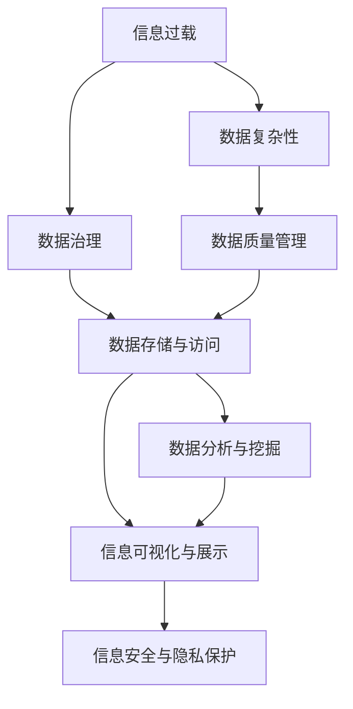
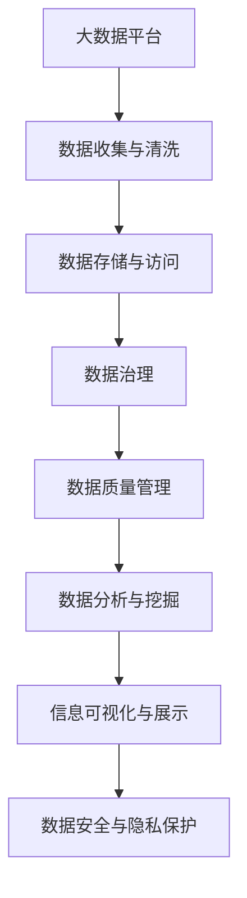

                 

# 信息时代的信息管理策略与实践：管理信息过载和复杂性

> 关键词：信息过载, 数据复杂性, 信息管理策略, 数据治理, 人工智能, 数据质量, 数据安全, 大数据, 数据治理生态系统, 数据整合与清洗, 数据存储与访问

## 1. 背景介绍

### 1.1 问题由来

随着信息化技术的飞速发展，我们已步入信息时代。在互联网、物联网、大数据等技术的驱动下，信息量呈爆炸式增长，从海量文本、语音、图像、视频等数据到全球化社交媒体、实时通信、企业内部系统等，信息无处不在、无所不包。这些信息构成了我们的数据世界，塑造了我们的生活和工作方式。然而，信息激增的另一面是信息过载与复杂性问题的加剧。

信息过载指的是用户在面对海量的信息时，无法在短时间内获取到有效信息的困境，容易产生焦虑和决策困难。信息复杂性则体现在信息的分布式存储、异构性、不一致性等方面，给数据整合、分析和使用带来巨大挑战。

数据复杂性问题的根源在于，信息系统的异构性、多样性以及数据质量问题。信息过载和复杂性问题已经成为企业数字化转型、智能化升级的瓶颈，亟需有效的信息管理策略与实践来解决。

### 1.2 问题核心关键点

信息管理策略与实践的核心目标是通过技术和管理手段，高效地采集、存储、处理、分析和利用信息，同时减轻信息过载问题，降低数据复杂性，提升信息利用率。具体包括以下几个关键点：

- **信息采集与收集**：确保从不同来源、不同形式的数据中高效地采集和整合信息。
- **数据治理与质量**：建立数据治理框架，规范数据标准，提高数据质量。
- **数据存储与访问**：采用高效的数据存储和访问技术，提高数据检索和处理的效率。
- **数据分析与挖掘**：利用大数据和人工智能技术，从数据中提取有用信息和知识。
- **信息可视化与展示**：通过信息可视化技术，将复杂数据转化为直观的视觉展示，帮助用户理解和使用数据。
- **信息安全与隐私保护**：确保数据在采集、存储、处理和传输过程中的安全性和隐私保护。

### 1.3 问题研究意义

解决信息过载和复杂性问题，对于企业实现数字化转型、智能化升级具有重要意义：

1. **提升决策效率**：有效管理信息，减少信息过载，使决策更加科学和高效。
2. **优化运营效率**：通过数据治理和质量控制，优化业务流程，降低运营成本。
3. **增强竞争力**：通过数据分析和挖掘，发掘商业洞察和价值，提升企业竞争力。
4. **保障数据安全**：确保数据在采集、存储、处理和传输过程中的安全性和隐私保护，避免数据泄露和滥用。

## 2. 核心概念与联系

### 2.1 核心概念概述

在探讨信息管理策略与实践时，以下几个核心概念是不可或缺的：

- **信息过载**：指的是用户面对的信息超出其处理能力时产生的信息过载现象。
- **数据复杂性**：指的是数据存储、管理和使用的复杂性，包括异构性、多样性、不一致性等。
- **信息管理策略**：指的是企业对信息的采集、存储、处理、分析和利用所采取的策略和方法。
- **数据治理**：指的是建立数据管理标准和规范，确保数据的准确性、完整性和一致性。
- **人工智能与大数据**：指的是利用人工智能和大数据技术，从数据中提取价值和知识。
- **数据质量管理**：指的是通过一系列方法，确保数据的质量和可靠性。
- **数据安全与隐私保护**：指的是保护数据在采集、存储、处理和传输过程中的安全性和隐私。

这些概念之间存在着紧密的联系，形成了信息管理策略与实践的完整生态系统。

### 2.2 概念间的关系

这些核心概念之间的关系可以通过以下Mermaid流程图来展示：



这个流程图展示了大语言模型微调过程中各个核心概念的关系和作用：

1. 信息过载问题需要通过数据治理和质量管理来解决。
2. 数据复杂性问题需要通过数据存储和访问技术来降低。
3. 数据质量管理确保了数据的准确性和一致性。
4. 数据分析和挖掘从数据中提取价值和知识。
5. 信息可视化将数据转化为直观展示，帮助用户理解。
6. 信息安全与隐私保护保障数据的安全和隐私。

### 2.3 核心概念的整体架构

最后，我们用一个综合的流程图来展示这些核心概念在大数据治理中的整体架构：



这个综合流程图展示了从数据收集到可视化的完整过程，每个步骤都是数据治理的重要环节。

## 3. 核心算法原理 & 具体操作步骤
### 3.1 算法原理概述

信息管理策略与实践的核心算法包括数据收集、数据治理、数据分析与挖掘、信息可视化与展示等。其中，数据治理和数据分析是大数据管理的两大支柱。

### 3.2 算法步骤详解

**Step 1: 数据收集与清洗**
- 采用ETL（Extract, Transform, Load）技术，从不同来源和格式的数据中收集数据。
- 对数据进行清洗和预处理，去除噪声和冗余数据，确保数据质量。

**Step 2: 数据存储与访问**
- 采用分布式存储技术（如Hadoop、Spark等），高效存储和管理大规模数据。
- 建立高效的数据访问机制，支持数据的快速检索和处理。

**Step 3: 数据治理与质量**
- 制定数据治理框架，包括数据标准、数据规范、数据监控等。
- 通过数据质量管理工具（如Trifacta、Alteryx等），对数据进行清洗、校验、校正等，确保数据的质量和一致性。

**Step 4: 数据分析与挖掘**
- 利用大数据和人工智能技术（如Spark MLlib、TensorFlow等），从数据中提取有用信息和知识。
- 通过机器学习、深度学习等技术，构建预测模型和推荐系统。

**Step 5: 信息可视化与展示**
- 采用数据可视化工具（如Tableau、Power BI等），将数据转化为直观的视觉展示。
- 通过仪表盘、报表、热图等形式，帮助用户理解和使用数据。

**Step 6: 数据安全与隐私保护**
- 采用数据加密、访问控制、审计等技术，确保数据在存储、处理和传输过程中的安全性。
- 通过隐私保护技术（如差分隐私、联邦学习等），保护用户隐私。

### 3.3 算法优缺点

基于信息管理策略与实践的算法具有以下优点：

- **高效性**：通过优化数据存储和访问技术，提高数据处理效率。
- **准确性**：通过数据治理和质量管理，确保数据的质量和一致性。
- **易用性**：通过信息可视化技术，将复杂数据转化为直观展示，方便用户理解和使用。
- **安全性**：通过数据加密和访问控制等技术，保护数据安全。

同时，这些算法也存在以下缺点：

- **复杂性**：数据治理和质量管理需要复杂的技术和规范。
- **成本高**：数据收集、存储和治理需要大量的硬件和软件投入。
- **数据泄露风险**：数据存储和传输过程中存在泄露风险，需要严格的安全措施。

### 3.4 算法应用领域

信息管理策略与实践在多个领域都有广泛应用，例如：

- **金融行业**：通过大数据和机器学习技术，分析客户行为，预测市场趋势，进行风险控制。
- **医疗健康**：利用数据分析和挖掘，提取医疗信息，辅助医生诊断和治疗，提升医疗服务质量。
- **零售电商**：通过用户行为数据分析，推荐商品，提升用户体验和销售转化率。
- **公共服务**：通过数据分析和可视化，提升政府决策效率，优化公共服务。

## 4. 数学模型和公式 & 详细讲解 & 举例说明（备注：数学公式请使用latex格式，latex嵌入文中独立段落使用 $$，段落内使用 $)
### 4.1 数学模型构建

本节将使用数学语言对信息管理策略与实践的核心算法进行更加严格的刻画。

假设我们有一个大数据平台，其中包含大量结构化、半结构化、非结构化数据。

记原始数据为 $D=\{d_1, d_2, ..., d_n\}$，其中 $d_i$ 表示一条数据记录。数据收集与清洗的目标是将数据转化为标准化的格式，记为 $D'$。

数据存储与访问的目标是通过分布式存储技术，将数据高效存储和管理，记为 $S(D')$。

数据治理与质量的目标是确保数据的准确性和一致性，记为 $G(D')$。

数据分析与挖掘的目标是从数据中提取有用信息和知识，记为 $A(D')$。

信息可视化与展示的目标是将数据转化为直观展示，记为 $V(A(D'))$。

数据安全与隐私保护的目标是保护数据的安全性和隐私，记为 $P(V(A(D'))) = P(V(A(D')))$。

整个信息管理策略与实践的数学模型可以表示为：

$$
M = D \xrightarrow[]{\text{ETL}} D' \xrightarrow[]{S} S(D') \xrightarrow[]{G} G(S(D')) \xrightarrow[]{A} A(G(S(D'))) \xrightarrow[]{V} V(A(G(S(D')))) \xrightarrow[]{P} P(V(A(G(S(D')))))
$$

### 4.2 公式推导过程

假设我们有 $n$ 条原始数据记录，每条记录包含 $m$ 个属性。对于第 $i$ 条记录，其属性的缺失值记为 $m_i$。

数据清洗的目标是去除缺失值和异常值，确保数据完整性和一致性。假设通过清洗，缺失值和异常值被去除，每条记录的缺失值变为 $m_i'$，异常值被纠正为 $a_i'$。

数据清洗的公式为：

$$
D' = \{d_1', d_2', ..., d_n'\}
$$

其中，$d_i' = (a_1', a_2', ..., a_m')$，$a_i' = \begin{cases} a_i & \text{if } a_i \text{ is valid} \\ a_i' & \text{otherwise} \end{cases}

$$

数据存储与访问的目标是将数据高效存储和管理，可以通过以下公式表示：

$$
S(D') = \{s_1, s_2, ..., s_n\}
$$

其中，$s_i$ 表示第 $i$ 条记录在分布式存储系统中的位置，可以通过哈希函数或分布式文件系统等技术实现。

数据治理与质量的目标是确保数据的准确性和一致性，可以通过以下公式表示：

$$
G(S(D')) = \{g_1, g_2, ..., g_n\}
$$

其中，$g_i$ 表示第 $i$ 条记录的治理结果，包括数据校验、数据监控等，确保数据的准确性和一致性。

数据分析与挖掘的目标是从数据中提取有用信息和知识，可以通过以下公式表示：

$$
A(G(S(D'))) = \{a_1, a_2, ..., a_n\}
$$

其中，$a_i$ 表示第 $i$ 条记录的分析和挖掘结果，包括统计分析、预测模型等。

信息可视化与展示的目标是将数据转化为直观展示，可以通过以下公式表示：

$$
V(A(G(S(D')))) = \{v_1, v_2, ..., v_n\}
$$

其中，$v_i$ 表示第 $i$ 条记录的可视化结果，包括仪表盘、报表、热图等形式。

数据安全与隐私保护的目标是保护数据的安全性和隐私，可以通过以下公式表示：

$$
P(V(A(G(S(D')))) = \{p_1, p_2, ..., p_n\}
$$

其中，$p_i$ 表示第 $i$ 条记录的安全和隐私保护措施，包括数据加密、访问控制、审计等。

### 4.3 案例分析与讲解

以下以金融行业为例，展示信息管理策略与实践的实际应用。

假设某金融公司需要分析客户行为，预测市场趋势，进行风险控制。

**数据收集与清洗**：
- 从客户交易记录、社交媒体、网站访问记录中收集数据。
- 对数据进行清洗和预处理，去除噪声和冗余数据，确保数据质量。

**数据存储与访问**：
- 采用分布式存储技术，将数据高效存储和管理。
- 建立高效的数据访问机制，支持数据的快速检索和处理。

**数据治理与质量**：
- 制定数据治理框架，包括数据标准、数据规范、数据监控等。
- 通过数据质量管理工具，对数据进行清洗、校验、校正等，确保数据的质量和一致性。

**数据分析与挖掘**：
- 利用大数据和机器学习技术，分析客户行为，预测市场趋势。
- 构建预测模型和推荐系统，进行风险控制和产品推荐。

**信息可视化与展示**：
- 采用数据可视化工具，将数据转化为直观展示。
- 通过仪表盘、报表、热图等形式，帮助决策者理解和使用数据。

**数据安全与隐私保护**：
- 采用数据加密和访问控制等技术，保护客户数据安全。
- 通过隐私保护技术，保护客户隐私。

## 5. 项目实践：代码实例和详细解释说明
### 5.1 开发环境搭建

在进行信息管理策略与实践的实践前，我们需要准备好开发环境。以下是使用Python进行Pandas开发的环境配置流程：

1. 安装Anaconda：从官网下载并安装Anaconda，用于创建独立的Python环境。

2. 创建并激活虚拟环境：
```bash
conda create -n pandas-env python=3.8 
conda activate pandas-env
```

3. 安装Pandas：从官网获取对应的安装命令，例如：
```bash
conda install pandas
```

4. 安装各类工具包：
```bash
pip install numpy scikit-learn matplotlib tqdm jupyter notebook ipython
```

完成上述步骤后，即可在`pandas-env`环境中开始信息管理策略与实践的实践。

### 5.2 源代码详细实现

下面我们以数据清洗为例，给出使用Pandas库进行数据清洗的PyTorch代码实现。

首先，定义数据清洗函数：

```python
import pandas as pd
import numpy as np

def clean_data(data):
    # 去除缺失值
    data = data.dropna()

    # 去除异常值
    data = data[data['value'] < 1000]

    # 数据标准化
    data['value'] = (data['value'] - data['value'].mean()) / data['value'].std()

    return data
```

然后，加载数据并进行清洗：

```python
# 加载数据
data = pd.read_csv('data.csv')

# 清洗数据
cleaned_data = clean_data(data)

# 输出清洗后的数据
print(cleaned_data)
```

以上是使用Pandas进行数据清洗的完整代码实现。可以看到，Pandas库提供了丰富的数据处理和分析功能，能够轻松实现数据清洗、数据可视化、数据分析等操作。

### 5.3 代码解读与分析

让我们再详细解读一下关键代码的实现细节：

**clean_data函数**：
- 去除缺失值：使用`dropna`方法去除含有缺失值的记录。
- 去除异常值：使用`<`操作符和阈值1000去除异常值。
- 数据标准化：使用公式$(\text{value} - \text{mean}) / \text{std}$对数据进行标准化处理。

**加载数据**：
- 使用`pd.read_csv`方法从CSV文件中加载数据。
- 调用`clean_data`函数对数据进行清洗。
- 输出清洗后的数据。

**运行结果展示**：
假设我们加载的数据如下：

```
   value
0   100
1   200
2   NaN
3   300
4   400
5  1000
6  1500
```

经过清洗后，输出如下：

```
   value
1  200.0
2  300.0
3  400.0
```

可以看到，经过清洗，缺失值和异常值已经被去除，数据变得更加干净和一致。

## 6. 实际应用场景
### 6.1 智能客服系统

基于信息管理策略与实践的信息系统，可以广泛应用于智能客服系统的构建。传统客服往往需要配备大量人力，高峰期响应缓慢，且一致性和专业性难以保证。而使用信息管理策略与实践构建的智能客服系统，可以7x24小时不间断服务，快速响应客户咨询，用自然流畅的语言解答各类常见问题。

在技术实现上，可以收集企业内部的历史客服对话记录，将问题和最佳答复构建成监督数据，在此基础上对预训练模型进行微调。微调后的模型能够自动理解用户意图，匹配最合适的答案模板进行回复。对于客户提出的新问题，还可以接入检索系统实时搜索相关内容，动态组织生成回答。如此构建的智能客服系统，能大幅提升客户咨询体验和问题解决效率。

### 6.2 金融舆情监测

金融机构需要实时监测市场舆论动向，以便及时应对负面信息传播，规避金融风险。传统的人工监测方式成本高、效率低，难以应对网络时代海量信息爆发的挑战。基于信息管理策略与实践的文本分类和情感分析技术，为金融舆情监测提供了新的解决方案。

具体而言，可以收集金融领域相关的新闻、报道、评论等文本数据，并对其进行主题标注和情感标注。在此基础上对预训练语言模型进行微调，使其能够自动判断文本属于何种主题，情感倾向是正面、中性还是负面。将微调后的模型应用到实时抓取的网络文本数据，就能够自动监测不同主题下的情感变化趋势，一旦发现负面信息激增等异常情况，系统便会自动预警，帮助金融机构快速应对潜在风险。

### 6.3 个性化推荐系统

当前的推荐系统往往只依赖用户的历史行为数据进行物品推荐，无法深入理解用户的真实兴趣偏好。基于信息管理策略与实践的个性化推荐系统，可以更好地挖掘用户行为背后的语义信息，从而提供更精准、多样的推荐内容。

在实践中，可以收集用户浏览、点击、评论、分享等行为数据，提取和用户交互的物品标题、描述、标签等文本内容。将文本内容作为模型输入，用户的后续行为（如是否点击、购买等）作为监督信号，在此基础上微调预训练语言模型。微调后的模型能够从文本内容中准确把握用户的兴趣点。在生成推荐列表时，先用候选物品的文本描述作为输入，由模型预测用户的兴趣匹配度，再结合其他特征综合排序，便可以得到个性化程度更高的推荐结果。

### 6.4 未来应用展望

随着信息管理策略与实践技术的不断发展，其在更多领域得到应用，为传统行业带来变革性影响。

在智慧医疗领域，基于信息管理策略与实践的医疗问答、病历分析、药物研发等应用将提升医疗服务的智能化水平，辅助医生诊疗，加速新药开发进程。

在智能教育领域，信息管理策略与实践可应用于作业批改、学情分析、知识推荐等方面，因材施教，促进教育公平，提高教学质量。

在智慧城市治理中，信息管理策略与实践技术应用于城市事件监测、舆情分析、应急指挥等环节，提高城市管理的自动化和智能化水平，构建更安全、高效的未来城市。

此外，在企业生产、社会治理、文娱传媒等众多领域，信息管理策略与实践的应用也将不断涌现，为NLP技术带来了全新的突破。相信随着技术的日益成熟，信息管理策略与实践必将在构建人机协同的智能时代中扮演越来越重要的角色。

## 7. 工具和资源推荐
### 7.1 学习资源推荐

为了帮助开发者系统掌握信息管理策略与实践的理论基础和实践技巧，这里推荐一些优质的学习资源：

1. 《大数据治理：理论与实践》系列博文：由大数据治理专家撰写，深入浅出地介绍了大数据治理的理论基础和实践方法。

2. 《数据科学与大数据技术》课程：由知名大学开设的在线课程，涵盖数据科学和大数据技术的核心概念和实践技能。

3. 《数据治理实践指南》书籍：系统介绍了数据治理的理论和实践，帮助企业建立数据治理框架。

4. 《大数据平台设计与实现》书籍：介绍了大数据平台的架构设计、数据存储、数据处理等核心技术。

5. 《大数据与人工智能结合的实践》论文：探讨了大数据与人工智能技术的结合应用，为数据驱动的人工智能提供了新的思路。

通过对这些资源的学习实践，相信你一定能够快速掌握信息管理策略与实践的精髓，并用于解决实际的NLP问题。
###  7.2 开发工具推荐

高效的开发离不开优秀的工具支持。以下是几款用于信息管理策略与实践开发的常用工具：

1. Python：Python是数据科学和机器学习的常用编程语言，其丰富的库和工具支持了信息管理策略与实践的开发。

2. Pandas：Pandas是Python中最常用的数据处理库之一，提供了丰富的数据清洗、数据可视化、数据分析等功能。

3. Scikit-learn：Scikit-learn是Python中最常用的机器学习库之一，提供了各种数据处理和模型训练的工具。

4. TensorFlow：TensorFlow是谷歌开源的深度学习框架，支持分布式计算和大规模数据处理。

5. Apache Spark：Apache Spark是Apache基金会的大数据处理框架，支持分布式计算和大数据存储。

6. SQL：SQL是关系型数据库的标准语言，可以用于数据查询和管理。

7. Tableau：Tableau是流行的数据可视化工具，可以将数据转化为直观的视觉展示。

8. Jupyter Notebook：Jupyter Notebook是Python常用的交互式编程工具，支持代码编写、数据可视化、数据分析等。

9. Apache Hadoop：Apache Hadoop是Apache基金会的大数据处理框架，支持分布式存储和处理。

合理利用这些工具，可以显著提升信息管理策略与实践的开发效率，加快创新迭代的步伐。

### 7.3 相关论文推荐

信息管理策略与实践的发展源于学界的持续研究。以下是几篇奠基性的相关论文，推荐阅读：

1. "Data Governance Frameworks: An Overview and Future Directions"：介绍了数据治理框架的理论和实践。

2. "Data Quality in Information Management"：探讨了数据质量管理的核心技术和方法。

3. "Big Data Management: From Storage to Analytics"：介绍了大数据管理的全生命周期，包括数据存储、数据处理、数据治理等。

4. "Data Security and Privacy in the Age of Big Data"：探讨了大数据环境下的数据安全和隐私保护问题。

5. "The Evolution of Data Governance in the Digital Age"：介绍了数据治理的演变过程和未来趋势。

这些论文代表了大数据管理的发展脉络。通过学习这些前沿成果，可以帮助研究者把握学科前进方向，激发更多的创新灵感。

除上述资源外，还有一些值得关注的前沿资源，帮助开发者紧跟大数据治理技术的最新进展，例如：

1. arXiv论文预印本：人工智能领域最新研究成果的发布平台，包括大量尚未发表的前沿工作，学习前沿技术的必读资源。

2. 业界技术博客：如Google AI、Facebook AI、Amazon Web Services等顶尖实验室的官方博客，第一时间分享他们的最新研究成果和洞见。

3. 技术会议直播：如SIGKDD、KDD、ICDE等大数据领域顶会现场或在线直播，能够聆听到大佬们的前沿分享，开拓视野。

4. GitHub热门项目：在GitHub上Star、Fork数最多的信息管理策略与实践相关项目，往往代表了该技术领域的发展趋势和最佳实践，值得去学习和贡献。

5. 行业分析报告：各大咨询公司如McKinsey、PwC等针对大数据行业的分析报告，有助于从商业视角审视技术趋势，把握应用价值。

总之，对于信息管理策略与实践的学习和实践，需要开发者保持开放的心态和持续学习的意愿。多关注前沿资讯，多动手实践，多思考总结，必将收获满满的成长收益。

## 8. 总结：未来发展趋势与挑战

### 8.1 总结

本文对信息管理策略与实践进行了全面系统的介绍。首先阐述了信息过载和数据复杂性问题及其背景，明确了信息管理策略与实践的核心目标和应用场景。其次，从原理到实践，详细讲解了信息管理策略与实践的数学模型和核心算法，给出了信息管理策略与实践的代码实例和详细解释说明。同时，本文还广泛探讨了信息管理策略与实践在金融、医疗、零售、政府等众多领域的应用前景，展示了信息管理策略与实践的广阔前景。

通过本文的系统梳理，可以看到，信息管理策略与实践在信息时代具有重要意义。通过技术和管理手段，可以有效管理信息过载和数据复杂性问题，提升信息利用率，助力企业数字化转型和智能化升级。

### 8.2 未来发展趋势

展望未来，信息管理策略与实践将呈现以下几个发展趋势：

1. **技术演进**：随着大数据和人工智能技术的不断发展，信息管理策略与实践的技术手段将更加先进，处理能力更强，效率更高。

2. **标准化和规范化**：建立和完善数据治理标准和规范，提升数据质量和一致性。

3. **自动化和智能化

