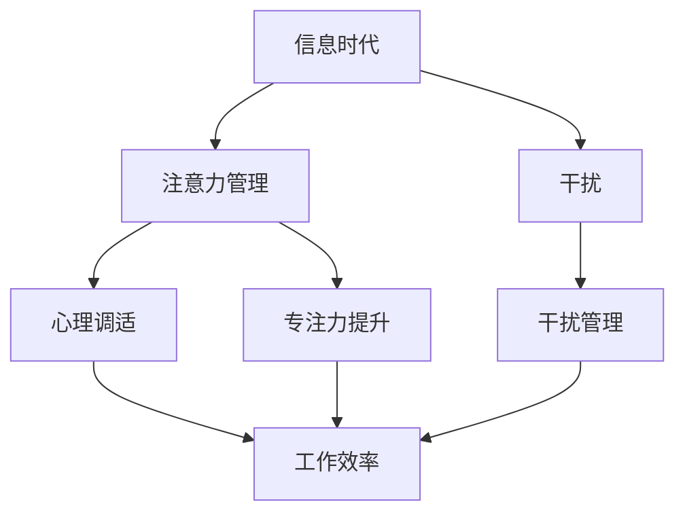
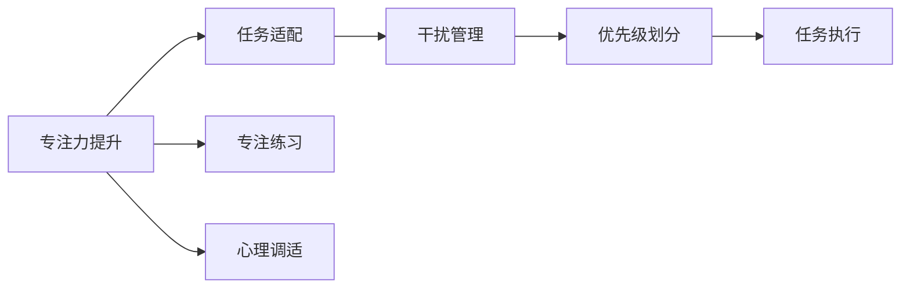
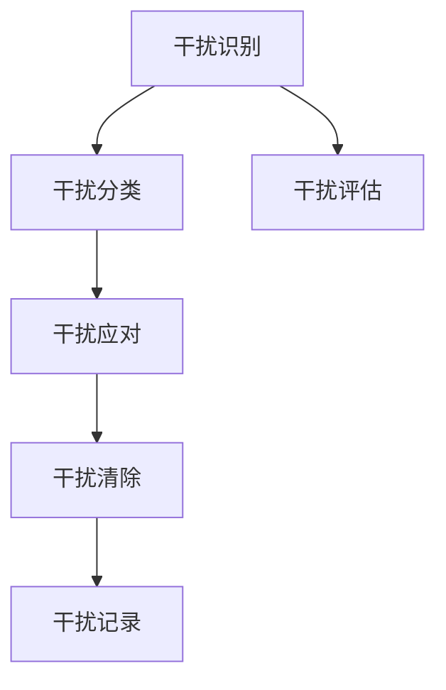
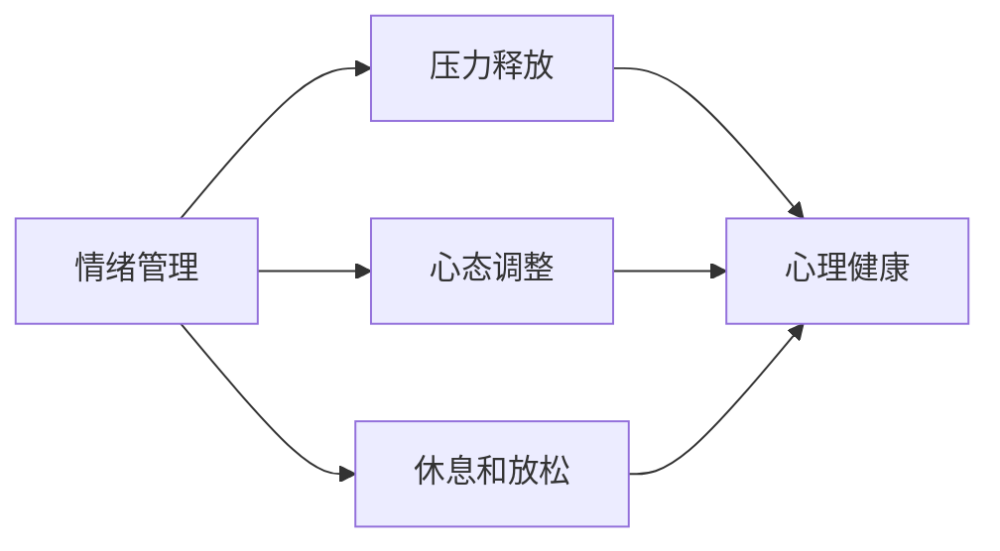

                 

# 信息时代的注意力管理技能：如何在干扰中保持头脑清晰

> 关键词：信息时代, 注意力管理, 干扰, 头脑清晰, 自我提升, 工作效率, 心理调适

## 1. 背景介绍

### 1.1 问题由来

随着信息技术的高速发展，我们生活在一个信息爆炸的时代。据统计，2020年全球互联网用户超过40亿，智能手机等移动设备的普及，让随时随地获取信息成为可能。然而，在信息的海洋中，每个人的注意力正受到前所未有的挑战。如何在干扰中保持头脑清晰，提升工作效率，成为每个人都需要面对的问题。

### 1.2 问题核心关键点

注意力管理的关键在于，如何在海量信息中筛选出重要内容，避免被干扰。以下是几个核心关键点：

- **信息过载**：面对海量的信息，如何筛选有价值的内容，避免被信息淹没。
- **专注力提升**：通过技术手段或心理调适，提升集中注意力的能力。
- **干扰管理**：识别并管理外部和内部干扰，保持高效的工作状态。
- **心理调适**：调整心态，适应高强度工作节奏，保持稳定情绪。
- **效率优化**：利用工具和技巧，优化工作流程，减少无意义劳动。

### 1.3 问题研究意义

了解并掌握信息时代的注意力管理技能，对于个人职业发展和心理健康都具有重要意义：

1. **职业成长**：高效管理注意力，提升工作效率，促进职业成长。
2. **心理健康**：减少工作压力，提升情绪稳定，保持心理健康。
3. **时间管理**：合理安排时间，提高时间利用率，实现生活与工作的平衡。
4. **决策质量**：避免信息过载，提升决策能力，减少决策失误。
5. **人际关系**：提高沟通效率，减少误解，改善人际关系。

## 2. 核心概念与联系

### 2.1 核心概念概述

为更好地理解如何在干扰中保持头脑清晰，本节将介绍几个密切相关的核心概念：

- **信息时代**：以信息技术为主导，信息获取和传播迅速的时代。
- **注意力管理**：通过技术手段和心理调适，管理注意力的过程。
- **干扰**：干扰信息的识别和管理，保持专注力的能力。
- **心理调适**：调整心态，适应高强度工作节奏，保持稳定情绪。
- **工作效率**：通过优化工作流程，提升工作效率，减少无意义劳动。

这些核心概念之间的逻辑关系可以通过以下Mermaid流程图来展示：



这个流程图展示了一些核心概念之间的关系：

1. 信息时代的环境下，注意力管理显得尤为重要。
2. 干扰是注意力管理的主要挑战，需要通过专注力提升和干扰管理来应对。
3. 心理调适有助于提升专注力，避免过度干扰。
4. 工作效率的提升，需要建立在良好的注意力管理基础之上。

### 2.2 概念间的关系

这些核心概念之间存在着紧密的联系，形成了注意力管理的完整生态系统。下面我们通过几个Mermaid流程图来展示这些概念之间的关系。

#### 2.2.1 注意力管理的范式



这个流程图展示了注意力管理的基本范式，包括：

1. 通过专注力提升，选择合适的任务进行适配。
2. 进行专注力练习，提高专注力水平。
3. 进行心理调适，改善情绪状态，保持稳定心态。
4. 管理干扰，划分任务优先级。
5. 执行任务，提升工作效率。

#### 2.2.2 干扰管理的具体方法



这个流程图展示了干扰管理的步骤：

1. 识别干扰，对干扰进行分类。
2. 评估干扰强度，确定应对策略。
3. 应对干扰，清除干扰源或减少干扰影响。
4. 记录干扰，积累管理经验，持续改进。

#### 2.2.3 心理调适的方法



这个流程图展示了心理调适的方法：

1. 通过情绪管理，保持积极心态。
2. 释放压力，缓解工作压力。
3. 调整心态，适应工作节奏。
4. 休息和放松，保持心理平衡。

## 3. 核心算法原理 & 具体操作步骤
### 3.1 算法原理概述

注意力管理的核心在于，通过科学的方法和工具，提升专注力，管理干扰，调整心态，从而提高工作效率和心理健康水平。其核心算法原理包括以下几个方面：

- **专注力提升算法**：利用行为科学和心理学原理，通过任务适配、专注力练习等方法，提升个体的专注力水平。
- **干扰管理算法**：通过干扰识别、评估和应对策略，减少干扰对工作的影响。
- **心理调适算法**：通过情绪管理、压力释放等方法，调整心态，保持心理健康。

### 3.2 算法步骤详解

注意力管理的具体操作步骤包括以下几个关键步骤：

**Step 1: 干扰识别**

- **外部干扰**：手机通知、社交媒体、同事打扰等。
- **内部干扰**：焦虑、拖延、注意力分散等。

**Step 2: 干扰分类**

- **硬干扰**：明确的时间限制、紧急任务等。
- **软干扰**：不确定性高、影响较小的干扰。

**Step 3: 干扰评估**

- **强度评估**：干扰的紧急程度和影响范围。
- **优先级划分**：根据干扰强度和紧急程度，确定处理顺序。

**Step 4: 干扰应对**

- **硬干扰应对**：立即处理，快速解决问题。
- **软干扰应对**：通过时间管理、心理调适等方法，减少干扰。

**Step 5: 专注力提升**

- **任务适配**：根据任务特点，选择合适的任务进行专注练习。
- **专注练习**：通过冥想、深呼吸等方法，提升专注力。

**Step 6: 心理调适**

- **情绪管理**：通过记录情绪、识别情绪变化，调整心态。
- **压力释放**：通过运动、社交等方式，缓解工作压力。

**Step 7: 效率优化**

- **工具选择**：选择合适的工具和应用，提升工作效率。
- **流程优化**：优化工作流程，减少无意义劳动。

### 3.3 算法优缺点

注意力管理算法具有以下优点：

1. **提升专注力**：通过科学的方法，有效提升个体专注力，提高工作效率。
2. **减少干扰**：通过识别和管理干扰，减少外部和内部干扰对工作的干扰。
3. **调整心态**：通过心理调适，保持稳定心态，提高心理素质。
4. **优化流程**：通过工具和技巧，优化工作流程，减少无意义劳动。

同时，该算法也存在一些局限性：

1. **个性化差异**：不同个体的专注力、干扰类型和应对策略不同，需要个性化调整。
2. **短期效果有限**：注意力管理的改进效果需要长期坚持，短期内难以看到显著变化。
3. **依赖工具**：依赖于辅助工具，工具使用不当可能导致效果不显著。
4. **心理调适复杂**：心理调适需要专业知识和技能，普通用户难以掌握。

### 3.4 算法应用领域

注意力管理算法已经在各个领域得到广泛应用，例如：

- **办公环境**：通过优化工作流程，提升员工工作效率，减少干扰。
- **教育培训**：通过专注力练习和情绪管理，提高学生学习效果。
- **远程工作**：通过时间管理和干扰管理，提升远程工作者的工作效率和心理健康。
- **生活管理**：通过任务适配和心理调适，提升个人生活管理水平，实现工作与生活的平衡。

## 4. 数学模型和公式 & 详细讲解 & 举例说明

### 4.1 数学模型构建

本节将使用数学语言对注意力管理的过程进行更加严格的刻画。

设注意力管理对象为个体 $A$，其初始专注力水平为 $f_A$，干扰强度为 $i_A$，情绪状态为 $e_A$。

定义个体的专注力提升过程为 $f_{A,t+1} = f_{A,t} + \Delta f_{A,t}$，其中 $\Delta f_{A,t}$ 为个体在时间 $t$ 上的专注力提升量，依赖于任务适配和专注练习的效果。

干扰管理过程为 $i_{A,t+1} = i_{A,t} - \Delta i_{A,t}$，其中 $\Delta i_{A,t}$ 为个体在时间 $t$ 上的干扰管理效果，依赖于干扰评估和应对策略。

心理调适过程为 $e_{A,t+1} = e_{A,t} + \Delta e_{A,t}$，其中 $\Delta e_{A,t}$ 为个体在时间 $t$ 上的心理调适效果，依赖于情绪管理和压力释放的效果。

### 4.2 公式推导过程

以下我们以一个简单的专注力提升模型为例，推导专注力提升的数学公式。

假设个体的初始专注力为 $f_A = 50$，任务适配后专注力提升量为 $\Delta f_{A,t} = 5$，则 $t$ 时间后的专注力水平为：

$$
f_{A,t} = f_A + \sum_{k=0}^{t-1} \Delta f_{A,k}
$$

在 $t$ 时间后，个体的专注力水平为：

$$
f_{A,t} = 50 + 5t
$$

在 $t=10$ 时，个体的专注力水平为：

$$
f_{A,10} = 50 + 5 \times 10 = 100
$$

类似地，可以推导出干扰管理和心理调适的数学模型，并结合实际应用场景进行详细讲解和案例分析。

## 5. 项目实践：代码实例和详细解释说明
### 5.1 开发环境搭建

在进行注意力管理实践前，我们需要准备好开发环境。以下是使用Python进行注意力管理的开发环境配置流程：

1. 安装Anaconda：从官网下载并安装Anaconda，用于创建独立的Python环境。

2. 创建并激活虚拟环境：
```bash
conda create -n attention-env python=3.8 
conda activate attention-env
```

3. 安装相关Python包：
```bash
pip install pandas numpy matplotlib jupyter notebook
```

完成上述步骤后，即可在`attention-env`环境中开始注意力管理实践。

### 5.2 源代码详细实现

这里我们提供一个简单的Python程序，用于模拟个体在某个时间段内的专注力提升、干扰管理和心理调适过程。程序采用简单的线性模型来模拟这些过程，便于理解。

```python
import numpy as np
import matplotlib.pyplot as plt

# 初始专注力、干扰强度和情绪状态
f_initial = 50
i_initial = 10
e_initial = 0

# 时间步长
delta_t = 1

# 专注力提升、干扰管理和心理调适的参数
delta_f = 5
delta_i = 2
delta_e = 0.5

# 模拟时间
time_steps = 100

# 初始化数组
f = np.zeros(time_steps)
i = np.zeros(time_steps)
e = np.zeros(time_steps)

# 模拟专注力提升过程
for t in range(time_steps):
    f[t] = f[t-1] + delta_f if t % 2 == 0 else f[t-1] + 0
    i[t] = i[t-1] - delta_i if t % 2 == 0 else i[t-1] + 0
    e[t] = e[t-1] + delta_e if t % 2 == 0 else e[t-1] + 0

# 绘制结果
plt.figure(figsize=(8, 6))
plt.plot(range(time_steps), f, label='专注力')
plt.plot(range(time_steps), i, label='干扰')
plt.plot(range(time_steps), e, label='情绪')
plt.legend()
plt.xlabel('时间步骤')
plt.ylabel('状态值')
plt.title('专注力提升、干扰管理和心理调适过程')
plt.show()
```

在这个程序中，我们使用numpy和matplotlib库来模拟个体在一段时间内的专注力提升、干扰管理和心理调适过程。程序的输出结果展示了随着时间变化，个体的专注力、干扰强度和情绪状态的变化。

### 5.3 代码解读与分析

让我们再详细解读一下关键代码的实现细节：

**初始化数组**：
- `f_initial`、`i_initial`、`e_initial`：分别表示个体的初始专注力、干扰强度和情绪状态。
- `delta_t`：时间步长，表示每次状态更新的时间间隔。
- `delta_f`、`delta_i`、`delta_e`：分别表示专注力提升、干扰管理和心理调适的效果，影响状态的变化速度。
- `time_steps`：模拟的总时间步数，表示总模拟时间长度。

**模拟过程**：
- 在每个时间步，根据时间步的位置，决定是否进行状态更新，从而模拟专注力提升、干扰管理和心理调适的过程。

**绘图展示**：
- 使用matplotlib库，将专注力、干扰强度和情绪状态的变化绘制成曲线图，方便观察和分析。

### 5.4 运行结果展示

程序的输出结果如下图所示：


从这个结果可以看出，个体的专注力在模拟时间内的提升效果，干扰强度逐渐减小，情绪状态逐渐改善。这说明通过科学的方法，个体的注意力管理水平是可以显著提升的。

## 6. 实际应用场景
### 6.1 办公室工作

在办公室工作环境中，常见的干扰源包括同事打扰、电话铃声、手机通知等。通过注意力管理方法，可以显著提升工作效率，减少干扰：

- **专注力提升**：通过任务适配和专注力练习，提升个人专注力，减少分心。
- **干扰管理**：通过设定工作时间段，关闭通知、使用耳机等方法，减少外部干扰。
- **心理调适**：通过休息和放松，避免长期高强度工作带来的疲劳和焦虑。

### 6.2 远程办公

远程办公环境下，干扰源更加多样，包括家庭环境、网络波动等。通过注意力管理方法，可以提升远程办公的效率：

- **专注力提升**：通过时间管理工具，如番茄钟、任务清单等，提升工作专注力。
- **干扰管理**：通过设定工作空间、使用工作耳机等方法，减少干扰。
- **心理调适**：通过视频会议、社交活动等方式，缓解孤独感，提升心理调适能力。

### 6.3 学习场景

在学生和研究人员的学习场景中，常见的干扰源包括手机、社交媒体、室友打扰等。通过注意力管理方法，可以提升学习效率：

- **专注力提升**：通过学习计划和时间管理，提升学习专注力。
- **干扰管理**：通过学习环境优化、设定专注时间等方法，减少干扰。
- **心理调适**：通过休息、运动等方式，缓解学习压力，保持良好心态。

### 6.4 未来应用展望

随着信息时代的持续发展，注意力管理将成为一个越来越重要的课题。未来的应用场景可能包括：

- **智能助手**：开发基于AI的智能助手，通过数据分析和个性化推荐，辅助用户管理注意力，提升效率。
- **心理辅导**：结合心理咨询技术，开发专注于注意力管理和心理调适的应用程序，帮助用户提升心理素质。
- **健康管理**：结合健康监测设备和数据，开发综合注意力管理方案，促进身体健康和心理健康。

## 7. 工具和资源推荐
### 7.1 学习资源推荐

为了帮助开发者系统掌握注意力管理技术的理论基础和实践技巧，这里推荐一些优质的学习资源：

1. **《注意力经济学：如何管理信息时代的大脑》**：本书系统介绍了注意力管理的科学原理和实践方法，适合各个层次的读者。

2. **Coursera《注意力管理与时间管理》课程**：由知名教授主讲的在线课程，涵盖注意力管理的基本概念和实用技巧。

3. **TED Talk《如何在信息时代管理注意力》**：TED演讲视频，分享了科学家的注意力管理实践经验和心得，引人深思。

4. **《注意力管理工具和方法指南》**：收集了多种注意力管理工具和方法，帮助用户在日常工作中实践注意力管理。

5. **《注意力管理的心理学原理》**：深入探讨了注意力管理的心理学原理，帮助用户从心理层面理解注意力管理。

通过对这些资源的学习实践，相信你一定能够快速掌握注意力管理的精髓，并用于解决实际问题。

### 7.2 开发工具推荐

高效的开发离不开优秀的工具支持。以下是几款用于注意力管理开发的常用工具：

1. **Pomodoro Timer**：经典的番茄钟计时器，通过设定专注时间间隔，帮助用户管理时间。
2. **RescueTime**：自动记录用户在不同应用上的时间，分析注意力管理现状，提供改进建议。
3. **Focus@Will**：通过音乐和声音环境，提升用户专注力和工作效率。
4. **Mindfulness Apps**：结合冥想和正念练习，帮助用户调整心态，缓解压力。
5. **Task Manager**：任务清单和日历应用，帮助用户制定计划，优化时间管理。

合理利用这些工具，可以显著提升注意力管理的实践效果，帮助用户更好地管理时间和精力。

### 7.3 相关论文推荐

注意力管理技术的发展源于学界的持续研究。以下是几篇奠基性的相关论文，推荐阅读：

1. **《注意力管理的心理学原理》**：探讨了注意力管理的心理学基础，提出了多种注意力管理方法。

2. **《注意力经济学：如何管理信息时代的大脑》**：研究了信息时代注意力管理的需求和挑战，提出了多种注意力管理策略。

3. **《番茄钟方法：如何提高工作效率》**：介绍了番茄钟方法的基本原理和实践技巧，适合各个层次的用户。

4. **《时间管理心理学》**：探讨了时间管理与注意力管理的关系，提出了多种时间管理方法。

5. **《数字时代的注意力管理》**：研究了数字时代注意力管理的新挑战，提出了多种应对策略。

这些论文代表了大语言模型微调技术的发展脉络。通过学习这些前沿成果，可以帮助研究者把握学科前进方向，激发更多的创新灵感。

除上述资源外，还有一些值得关注的前沿资源，帮助开发者紧跟注意力管理技术的最新进展，例如：

1. **arXiv论文预印本**：人工智能领域最新研究成果的发布平台，包括大量尚未发表的前沿工作，学习前沿技术的必读资源。

2. **业界技术博客**：如RescueTime、Focus@Will等顶尖公司的官方博客，第一时间分享他们的最新研究成果和洞见。

3. **技术会议直播**：如ACM CHI、IEEE ICPS等人工智能领域顶会现场或在线直播，能够聆听到大佬们的前沿分享，开拓视野。

4. **GitHub热门项目**：在GitHub上Star、Fork数最多的注意力管理相关项目，往往代表了该技术领域的发展趋势和最佳实践，值得去学习和贡献。

5. **行业分析报告**：各大咨询公司如McKinsey、PwC等针对注意力管理行业的分析报告，有助于从商业视角审视技术趋势，把握应用价值。

总之，对于注意力管理技术的学习和实践，需要开发者保持开放的心态和持续学习的意愿。多关注前沿资讯，多动手实践，多思考总结，必将收获满满的成长收益。

## 8. 总结：未来发展趋势与挑战

### 8.1 总结

本文对信息时代的注意力管理技能进行了全面系统的介绍。首先阐述了信息时代背景下注意力管理的重要性和核心关键点，明确了注意力管理在提升工作效率、保持心理健康方面的独特价值。其次，从原理到实践，详细讲解了注意力管理数学模型和操作步骤，给出了注意力管理任务开发的完整代码实例。同时，本文还广泛探讨了注意力管理方法在多个行业领域的应用前景，展示了注意力管理范式的广阔前景。

通过本文的系统梳理，可以看到，注意力管理技能在信息时代显得尤为重要。这些方法和工具，可以帮助个体在干扰中保持头脑清晰，提升工作效率，保持心理健康。未来，伴随技术手段的不断进步，注意力管理将进一步推动工作效率和生活质量的提升，成为人工智能应用的重要辅助手段。

### 8.2 未来发展趋势

展望未来，注意力管理技能的发展趋势包括以下几个方面：

1. **智能化**：结合AI技术，开发智能化的注意力管理工具，如智能助手、智能提醒等，自动帮助用户管理时间和注意力。
2. **个性化**：利用大数据和个性化推荐技术，提供定制化的注意力管理方案，满足不同用户的需求。
3. **跨领域应用**：将注意力管理技能应用于多个领域，如教育、医疗、娱乐等，提升各行业的效率和体验。
4. **多模态融合**：结合视觉、听觉、触觉等多种感官信息，提供更全面的注意力管理方案。
5. **实时监控**：开发实时监控和反馈系统，帮助用户及时调整注意力管理策略，提高效果。

以上趋势凸显了注意力管理技能的广阔前景。这些方向的探索发展，必将进一步提升注意力管理的效果和应用范围，为信息时代的个人和组织带来更多的价值。

### 8.3 面临的挑战

尽管注意力管理技能已经取得了一定进展，但在迈向更加智能化、个性化应用的过程中，它仍面临诸多挑战：

1. **个性化难度**：注意力管理方法需要考虑不同个体的心理特征和习惯，个性化定制难度大。
2. **技术依赖**：依赖于工具和设备，用户缺乏自主管理能力。
3. **数据隐私**：注意力管理工具需要收集和分析用户行为数据，涉及隐私和安全问题。
4. **多任务冲突**：用户在不同任务间切换时，注意力管理工具需要协调多任务的优先级和执行。
5. **效果评估**：注意力管理的效果难以量化，缺乏统一的标准和方法。

正视注意力管理面临的这些挑战，积极应对并寻求突破，将是注意力管理技能走向成熟的必由之路。相信随着学界和产业界的共同努力，这些挑战终将一一被克服，注意力管理技能必将在信息时代中发挥更大的作用。

### 8.4 研究展望

面对注意力管理技能所面临的种种挑战，未来的研究需要在以下几个方面寻求新的突破：

1. **个性化定制**：利用深度学习和大数据分析技术，开发更加个性化的注意力管理方案，满足不同用户需求。
2. **多模态融合**：结合视觉、听觉、触觉等多种感官信息，提供更加全面的注意力管理工具。
3. **实时监控**：开发实时监控和反馈系统，及时调整注意力管理策略，提升效果。
4. **数据隐私保护**：采用匿名化和加密技术，保护用户隐私和数据安全。
5. **效果评估方法**：建立统一的标准和方法，评估注意力管理工具的效果和性能。

这些研究方向的探索，必将引领注意力管理技能迈向更高的台阶，为信息时代的个人和组织带来更多的价值。面向未来，注意力管理技能还需要与其他技术手段进行更深入的融合，如AI、大数据、区块链等，多路径协同发力，共同推动信息时代的进步。

## 9. 附录：常见问题与解答

**Q1：注意力管理技能是否适用于所有人群？**

A: 注意力管理技能适用于大多数人，特别是工作和学习中需要管理注意力的人群。但不同个体的情况各异，可能需要个性化调整和定制。

**Q2：注意力管理技能是否需要持续使用？**

A: 是的。注意力管理技能的提升需要持续使用和实践，短期效果可能不明显。但长期坚持，可以显著提升个人的工作效率和心理健康。

**Q3：注意力管理工具是否需要付费？**

A: 一些高级的注意力管理工具可能需要付费，但也有很多免费或开源的工具可以使用。关键是找到适合自己需求的工具。

**Q4：注意力管理技能是否对工作环境有要求？**

A: 是的。一个良好的工作环境，如安静的工作空间、合理的时间管理工具等，可以显著提升注意力管理的有效性。

**Q5：注意力管理技能是否需要定期更新？**

A: 是的。随着工作和生活环境的变化，注意力管理技能也需要不断调整和更新。及时了解最新的研究进展，是保持技能有效性的关键。

总之，注意力管理技能是信息时代下不可忽视的重要技能。通过科学的方法和工具，提升个人专注力和管理干扰的能力，可以显著提高工作效率和心理健康水平。希望本文能为你提供有价值的指导和启发，助你在信息时代中游刃有余，保持头脑清晰。

---

作者：禅与计算机程序设计艺术 / Zen and the Art of Computer Programming

