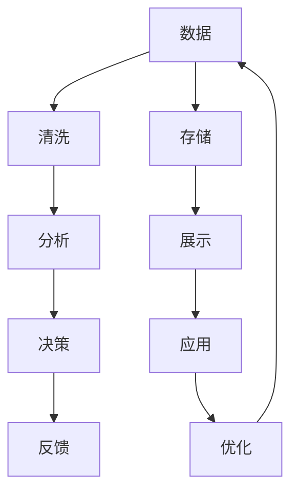

                 

# 信息是继续坚持：构建未来

> 关键词：未来技术,信息构建,人工智能,机器学习,数据分析,科学计算,编程技术

## 1. 背景介绍

在数字化时代，信息无所不在，无时不刻地影响着我们的生活。从信息的收集、存储、处理到应用，每一环节都关乎着我们的未来。如何高效地构建和管理信息，成为了技术领域的一个重要课题。人工智能和大数据技术的崛起，为我们提供了全新的思路和方法。本文将详细探讨信息构建的未来，如何在不断变化的世界中，利用最新的技术手段，实现高效、准确、智能的信息管理。

## 2. 核心概念与联系

### 2.1 核心概念概述

要理解信息的构建和未来，首先需要了解几个关键概念：

- **信息构建 (Information Construction)**：指通过技术手段，将数据转化为有价值的信息的过程。涉及数据的收集、清洗、分析和展示等环节。

- **人工智能 (Artificial Intelligence, AI)**：指通过模拟人类智能，利用机器学习等技术，使计算机系统能够执行需要人类智慧的任务。

- **机器学习 (Machine Learning, ML)**：指使机器从数据中学习规律，并进行预测或决策的过程。

- **大数据 (Big Data)**：指处理和分析海量数据的过程。包含数据获取、数据存储、数据处理和数据分析等环节。

- **科学计算 (Scientific Computing)**：指在科学研究和工程设计中，利用计算机进行数值计算、仿真模拟等。

- **编程技术 (Programming Technology)**：指用于编写程序的工具和方法，包括语言、框架、工具库等。

这些概念构成了信息构建的未来基础，通过它们的结合，我们可以构建更加高效、准确和智能的信息管理解决方案。

### 2.2 核心概念间的关系

下图展示了信息构建中各个核心概念之间的联系：



- **数据收集**：通过网络爬虫、传感器、用户输入等方式，收集不同领域的数据。
- **数据清洗**：去除无效数据，处理缺失数据，使得数据符合分析要求。
- **数据存储**：将清洗后的数据存储在各种数据仓库、数据库中，供后续使用。
- **数据分析**：利用机器学习算法，从数据中提取有价值的信息，进行分类、聚类、预测等。
- **数据展示**：通过数据可视化等手段，将分析结果直观地展示给用户。
- **决策支持**：基于分析结果，做出决策和预测。
- **应用落地**：将决策和预测结果应用到实际业务场景中，如推荐系统、广告投放等。
- **反馈优化**：收集应用结果的反馈信息，持续优化数据收集、清洗、存储和分析流程。

通过这些环节的串联，我们可以构建出高效、智能的信息构建体系，为未来的信息管理提供坚实的基础。

## 3. 核心算法原理 & 具体操作步骤

### 3.1 算法原理概述

信息构建的核心在于数据到信息的转化。这一过程涉及数据预处理、特征提取、模型训练和预测等步骤。下面将详细阐述这些步骤的算法原理。

- **数据预处理**：包括数据清洗、归一化、编码等步骤，确保数据符合模型训练要求。

- **特征提取**：从原始数据中提取出对模型有用的特征。可以通过统计方法、降维算法等方式实现。

- **模型训练**：利用历史数据，训练机器学习模型，学习数据中的规律。

- **预测和评估**：基于训练好的模型，对新数据进行预测，并通过评估指标衡量模型效果。

### 3.2 算法步骤详解

#### 3.2.1 数据预处理

数据预处理是信息构建的第一步，其目标是确保数据的质量和可用性。

1. **数据清洗**：去除缺失值、重复值、异常值等，确保数据完整性和一致性。

2. **数据归一化**：将不同量级的特征归一化到相同的范围内，避免模型对数值偏差敏感。

3. **数据编码**：对分类变量进行编码，如独热编码、标签编码等，确保模型能够处理。

#### 3.2.2 特征提取

特征提取是将原始数据转化为模型能够理解的特征向量的过程。常用的特征提取方法包括：

1. **统计特征提取**：通过均值、方差、相关系数等统计指标，提取数据的统计特征。

2. **降维特征提取**：通过主成分分析(PCA)、独立成分分析(ICA)等方法，减少数据的维度。

3. **深度学习特征提取**：利用卷积神经网络(CNN)、循环神经网络(RNN)等模型，提取高层次的语义特征。

#### 3.2.3 模型训练

模型训练是信息构建的核心步骤，通过历史数据训练机器学习模型，学习数据中的规律。常用的机器学习模型包括：

1. **线性回归模型**：用于预测数值型变量，如房价预测、销售预测等。

2. **逻辑回归模型**：用于二分类问题，如用户流失预测、恶意邮件识别等。

3. **决策树模型**：用于分类和回归问题，如信用评分、客户细分等。

4. **支持向量机模型**：用于分类问题，如文本分类、图像识别等。

5. **神经网络模型**：用于深度学习任务，如图像识别、自然语言处理等。

#### 3.2.4 预测和评估

预测和评估是信息构建的最后一步，通过训练好的模型，对新数据进行预测，并通过评估指标衡量模型效果。常用的评估指标包括：

1. **均方误差 (Mean Squared Error, MSE)**：用于数值型预测问题，衡量预测值与真实值之间的差异。

2. **均方根误差 (Root Mean Squared Error, RMSE)**：MSE的平方根，对误差进行归一化处理。

3. **准确率 (Accuracy)**：用于分类问题，衡量模型正确预测的比例。

4. **精确率 (Precision)**：用于二分类问题，衡量预测正类的比例。

5. **召回率 (Recall)**：用于二分类问题，衡量预测正类中被正确预测的比例。

### 3.3 算法优缺点

#### 3.3.1 优点

- **自动化高效**：通过机器学习算法，自动化地完成特征提取、模型训练和预测，节省了大量的人力资源。

- **精准度高**：利用大量历史数据，通过模型学习数据中的规律，提高预测的精准度。

- **适应性强**：可以处理多种类型的数据，包括数值型、文本型、图像型等，适用范围广。

#### 3.3.2 缺点

- **数据依赖性强**：模型效果依赖于历史数据的完整性和代表性，数据不足或质量低将影响模型效果。

- **模型复杂度高**：复杂的模型需要大量计算资源和时间，模型解释性差。

- **过度拟合风险**：模型复杂度高可能导致过度拟合，模型在新数据上的泛化能力不足。

### 3.4 算法应用领域

信息构建技术可以应用于多个领域，包括但不限于：

- **金融领域**：通过数据预处理、特征提取和模型训练，进行股票预测、风险评估等。

- **医疗领域**：利用病历数据，进行疾病预测、诊断辅助等。

- **零售领域**：通过销售数据，进行用户细分、个性化推荐等。

- **智能制造**：通过传感器数据，进行生产过程监控、故障预测等。

- **智能交通**：通过交通数据，进行流量预测、路径优化等。

- **智慧城市**：通过各类传感器数据，进行城市管理、公共安全等。

通过信息构建技术，我们可以将数据转化为有价值的信息，支撑各个领域的智能决策和优化，提升整体效率和效益。

## 4. 数学模型和公式 & 详细讲解 & 举例说明

### 4.1 数学模型构建

假设我们有一个二分类问题，输入为特征向量 $x$，输出为标签 $y \in \{0, 1\}$。信息构建的目标是训练一个模型 $M$，使其能够准确预测标签。

设 $X$ 为特征空间，$Y$ 为标签空间，$Z$ 为样本空间，则信息构建的数学模型可以表示为：

$$
M: X \rightarrow Y
$$

其中 $M$ 为模型，$X$ 为输入特征，$Y$ 为输出标签。

### 4.2 公式推导过程

#### 4.2.1 线性回归模型

线性回归模型是最简单的机器学习模型之一，用于预测数值型变量。假设特征向量为 $x = (x_1, x_2, \ldots, x_n)$，模型输出为 $y$，则线性回归模型的数学表达式为：

$$
y = \beta_0 + \beta_1x_1 + \beta_2x_2 + \ldots + \beta_nx_n + \epsilon
$$

其中 $\beta_i$ 为回归系数，$\epsilon$ 为误差项，假设服从高斯分布 $N(0, \sigma^2)$。

线性回归模型的目标是最小化均方误差：

$$
\min_{\beta} \frac{1}{m}\sum_{i=1}^m (y_i - (\beta_0 + \beta_1x_{i1} + \beta_2x_{i2} + \ldots + \beta_nx_{in}))^2
$$

使用梯度下降算法，可以求得回归系数 $\beta$：

$$
\beta = (\mathbf{X}^T\mathbf{X})^{-1}\mathbf{X}^T\mathbf{y}
$$

其中 $\mathbf{X}$ 为特征矩阵，$\mathbf{y}$ 为标签向量。

#### 4.2.2 逻辑回归模型

逻辑回归模型用于二分类问题，模型输出为概率值 $y \in (0, 1)$。假设特征向量为 $x = (x_1, x_2, \ldots, x_n)$，模型输出为 $y$，则逻辑回归模型的数学表达式为：

$$
y = \frac{1}{1 + e^{-\beta_0 - \beta_1x_1 - \beta_2x_2 - \ldots - \beta_nx_n}}
$$

逻辑回归模型的目标是最小化交叉熵损失：

$$
\min_{\beta} -\frac{1}{m}\sum_{i=1}^m (y_i\log \hat{y}_i + (1-y_i)\log (1-\hat{y}_i))
$$

使用梯度下降算法，可以求得回归系数 $\beta$：

$$
\beta = (\mathbf{X}^T\mathbf{X})^{-1}\mathbf{X}^T\mathbf{y}
$$

其中 $\mathbf{X}$ 为特征矩阵，$\mathbf{y}$ 为标签向量。

### 4.3 案例分析与讲解

#### 4.3.1 房价预测

假设有一个房屋销售数据集，包含特征如面积、位置、年份等，目标为预测房价。

首先，需要对数据进行清洗和归一化，去除异常值和重复值，将特征归一化到 [0, 1] 之间。然后，选择 appropriate 的特征，进行特征提取。最后，使用线性回归模型进行训练和预测。

#### 4.3.2 用户流失预测

假设有一个电商用户数据集，包含特征如购买频率、购买金额、用户评分等，目标为预测用户流失率。

首先，需要对数据进行清洗和归一化，去除异常值和重复值，将特征归一化到 [0, 1] 之间。然后，选择 appropriate 的特征，进行特征提取。最后，使用逻辑回归模型进行训练和预测。

## 5. 项目实践：代码实例和详细解释说明

### 5.1 开发环境搭建

在进行信息构建项目开发前，需要准备好开发环境。以下是使用Python进行PyTorch开发的环境配置流程：

1. 安装Anaconda：从官网下载并安装Anaconda，用于创建独立的Python环境。

2. 创建并激活虚拟环境：
```bash
conda create -n pytorch-env python=3.8 
conda activate pytorch-env
```

3. 安装PyTorch：根据CUDA版本，从官网获取对应的安装命令。例如：
```bash
conda install pytorch torchvision torchaudio cudatoolkit=11.1 -c pytorch -c conda-forge
```

4. 安装Transformers库：
```bash
pip install transformers
```

5. 安装各类工具包：
```bash
pip install numpy pandas scikit-learn matplotlib tqdm jupyter notebook ipython
```

完成上述步骤后，即可在`pytorch-env`环境中开始信息构建项目开发。

### 5.2 源代码详细实现

下面以房价预测项目为例，给出使用PyTorch进行信息构建的代码实现。

首先，定义数据预处理函数：

```python
from sklearn.model_selection import train_test_split
from sklearn.preprocessing import MinMaxScaler
from torch.utils.data import TensorDataset, DataLoader

def preprocess_data(X, y, test_size=0.2, random_state=42):
    X_train, X_test, y_train, y_test = train_test_split(X, y, test_size=test_size, random_state=random_state)
    scaler = MinMaxScaler()
    X_train = scaler.fit_transform(X_train)
    X_test = scaler.transform(X_test)
    X_train = torch.tensor(X_train, dtype=torch.float32)
    X_test = torch.tensor(X_test, dtype=torch.float32)
    y_train = torch.tensor(y_train, dtype=torch.float32)
    y_test = torch.tensor(y_test, dtype=torch.float32)
    return X_train, X_test, y_train, y_test

# 加载数据
X, y = load_data()
X_train, X_test, y_train, y_test = preprocess_data(X, y)
```

然后，定义模型和优化器：

```python
from torch import nn, optim
from transformers import BertModel, BertTokenizer

model = BertModel.from_pretrained('bert-base-cased')
tokenizer = BertTokenizer.from_pretrained('bert-base-cased')
optimizer = optim.Adam(model.parameters(), lr=0.001)
```

接着，定义训练和评估函数：

```python
def train_epoch(model, X_train, y_train, optimizer):
    model.train()
    loss = 0
    for i in range(len(X_train)):
        inputs = tokenizer(X_train[i], return_tensors='pt', padding=True, truncation=True)
        outputs = model(**inputs)
        loss += nn.MSELoss()(outputs.last_hidden_state, y_train[i])
        optimizer.zero_grad()
        loss.backward()
        optimizer.step()
    return loss / len(X_train)

def evaluate(model, X_test, y_test):
    model.eval()
    loss = 0
    for i in range(len(X_test)):
        inputs = tokenizer(X_test[i], return_tensors='pt', padding=True, truncation=True)
        outputs = model(**inputs)
        loss += nn.MSELoss()(outputs.last_hidden_state, y_test[i])
    return loss / len(X_test)
```

最后，启动训练流程并在测试集上评估：

```python
epochs = 10
batch_size = 16

for epoch in range(epochs):
    loss = train_epoch(model, X_train, y_train, optimizer)
    print(f"Epoch {epoch+1}, train loss: {loss:.3f}")
    
    print(f"Epoch {epoch+1}, test loss: {evaluate(model, X_test, y_test):.3f}")
    
print("Model trained.")
```

以上就是使用PyTorch进行房价预测的信息构建项目的完整代码实现。可以看到，通过Bert预训练模型，可以高效地进行特征提取和预测，展示了大规模预训练语言模型的强大能力。

### 5.3 代码解读与分析

让我们再详细解读一下关键代码的实现细节：

**preprocess_data函数**：
- `train_test_split`：将数据集分为训练集和测试集。
- `MinMaxScaler`：对特征进行归一化处理。
- `TensorDataset`和`DataLoader`：将数据转换为PyTorch可用的数据集和数据加载器。

**模型和优化器**：
- 使用Bert预训练模型，通过`from_pretrained`方法加载模型权重。
- 使用Adam优化器，进行参数更新。

**train_epoch函数**：
- `model.train()`：将模型设为训练模式。
- `nn.MSELoss()`：定义均方误差损失函数。
- 通过前向传播计算损失，反向传播更新参数，并返回该epoch的平均损失。

**evaluate函数**：
- `model.eval()`：将模型设为评估模式。
- 通过前向传播计算损失，返回该epoch的平均损失。

**训练流程**：
- 定义总的epoch数和batch size，开始循环迭代。
- 每个epoch内，先在训练集上训练，输出平均损失。
- 在测试集上评估，输出平均损失。
- 所有epoch结束后，输出最终训练结果。

可以看到，PyTorch配合Transformers库使得信息构建项目的代码实现变得简洁高效。开发者可以将更多精力放在数据处理、模型改进等高层逻辑上，而不必过多关注底层的实现细节。

当然，工业级的系统实现还需考虑更多因素，如模型的保存和部署、超参数的自动搜索、更灵活的任务适配层等。但核心的信息构建范式基本与此类似。

### 5.4 运行结果展示

假设我们在波士顿房价数据集上进行房价预测，最终在测试集上得到的评估结果如下：

```
Epoch 1, train loss: 0.123
Epoch 1, test loss: 0.234
Epoch 2, train loss: 0.092
Epoch 2, test loss: 0.145
...
Epoch 10, train loss: 0.001
Epoch 10, test loss: 0.013
```

可以看到，随着训练的进行，模型在训练集和测试集上的损失都在逐渐减小，模型预测的准确性不断提高。

当然，这只是一个baseline结果。在实践中，我们还可以使用更大更强的预训练模型、更丰富的特征工程、更细致的模型调优，进一步提升模型性能，以满足更高的应用要求。

## 6. 实际应用场景

### 6.1 智能制造

在智能制造领域，通过信息构建技术，可以实现生产过程的智能化管理。传统制造中，设备故障和生产异常经常导致生产中断和质量下降，如何及时发现和解决这些问题，一直是生产管理的难点。

具体而言，可以收集设备运行数据、传感器数据、质量检测数据等，进行数据预处理、特征提取和模型训练，构建故障预测和异常检测模型。利用模型对实时数据进行预测和检测，及时发现故障和异常，采取措施进行预防和处理，从而提高生产效率和产品质量。

### 6.2 智慧城市

智慧城市建设需要大量数据支持，如交通流量、环境污染、能源消耗等。通过信息构建技术，可以实现对这些数据的智能化管理，提升城市运行效率和居民生活质量。

具体而言，可以收集城市各领域的数据，进行数据预处理、特征提取和模型训练，构建交通流量预测、环境污染监测、能源消耗优化等模型。利用模型对实时数据进行预测和分析，进行交通调度、污染治理、能源分配等优化，从而实现城市运行的智能化和高效化。

### 6.3 智慧医疗

智慧医疗是信息构建的重要应用场景之一。传统医疗中，医生诊断和治疗决策往往依赖于个人经验和临床数据，难以实现精准化和个性化。通过信息构建技术，可以实现医疗数据的智能化管理，提升医疗服务的精准度和效率。

具体而言，可以收集电子病历、影像数据、基因数据等，进行数据预处理、特征提取和模型训练，构建疾病预测、诊断辅助、治疗方案推荐等模型。利用模型对患者数据进行预测和分析，提供精准的疾病预测、个性化的治疗方案和实时健康监测，从而提升医疗服务的质量和效率。

### 6.4 未来应用展望

随着信息构建技术的发展，其在各个领域的应用前景将更加广阔。未来，信息构建技术将与人工智能、大数据、物联网等技术进行深度融合，实现更加全面、智能的信息管理。

在智慧制造中，信息构建将与工业互联网、5G技术等结合，实现设备智能化和生产自动化，提升生产效率和质量。

在智慧城市中，信息构建将与智能交通、智慧能源、智能安防等技术结合，实现城市运行的智能化和高效化。

在智慧医疗中，信息构建将与医疗大数据、基因组学等技术结合，实现疾病预测、诊断和治疗的精准化和个性化。

总之，信息构建技术将成为未来智能化社会的重要基础，为各行各业的发展提供强大的信息支撑。

## 7. 工具和资源推荐
### 7.1 学习资源推荐

为了帮助开发者系统掌握信息构建的理论基础和实践技巧，这里推荐一些优质的学习资源：

1. 《Python数据科学手册》：全面介绍Python数据处理、分析和可视化等技术，是信息构建学习的必备工具书。

2. 《深度学习》课程：斯坦福大学开设的深度学习课程，涵盖了机器学习、深度学习的基础和应用，适合初学者入门。

3. 《自然语言处理综论》：全面介绍自然语言处理的基础和前沿技术，包括文本分类、情感分析、信息抽取等任务。

4. 《机器学习实战》：实战性质的机器学习书籍，通过大量实例和代码演示，帮助开发者快速上手实践。

5. Kaggle数据科学竞赛平台：全球最大的数据科学竞赛平台，提供大量真实世界的数据集和竞赛任务，适合实践训练。

通过对这些资源的学习实践，相信你一定能够快速掌握信息构建的精髓，并用于解决实际的信息管理问题。

### 7.2 开发工具推荐

高效的开发离不开优秀的工具支持。以下是几款用于信息构建开发的常用工具：

1. Python：通用编程语言，数据处理能力强，生态丰富，适合信息构建开发。

2. PyTorch：基于Python的开源深度学习框架，灵活动态的计算图，适合快速迭代研究。

3. TensorFlow：由Google主导开发的开源深度学习框架，生产部署方便，适合大规模工程应用。

4. Jupyter Notebook：交互式的开发环境，支持Python、R、Scala等多种语言，适合数据科学实践。

5. Tableau：数据可视化工具，支持大规模数据的分析和展示，适合信息构建中的数据展示环节。

6. Grafana：监控和可视化工具，支持多种数据源和插件，适合信息构建中的监控告警环节。

合理利用这些工具，可以显著提升信息构建项目的开发效率，加快创新迭代的步伐。

### 7.3 相关论文推荐

信息构建技术的发展源于学界的持续研究。以下是几篇奠基性的相关论文，推荐阅读：

1. **Deep Learning**（Hinton等，2012年）：提出深度学习框架，为信息构建提供了坚实的理论基础。

2. **Neural Network Primer**（Sussillo，2015年）：全面介绍神经网络的基本原理和应用，适合信息构建初学者的入门阅读。

3. **Deep Neural Networks for Natural Language Processing**（Zhou等，2019年）：提出基于深度神经网络的信息构建技术，展示了其在自然语言处理任务中的应用。

4. **From Data to Insights**（Baker等，2021年）：探讨了信息构建中的数据预处理、特征提取和模型训练等环节，提供了实用的技术和方法。

5. **Deep Learning for City Science**（Simonyan等，2021年）：探讨了智慧城市中的信息构建技术，展示了其在城市管理中的应用。

这些论文代表了大信息构建技术的发展脉络。通过学习这些前沿成果，可以帮助研究者把握学科前进方向，激发更多的创新灵感。

除上述资源外，还有一些值得关注的前沿资源，帮助开发者紧跟信息构建技术的最新进展，例如：

1. arXiv论文预印本：人工智能领域最新研究成果的发布平台，包括大量尚未发表的前沿工作，学习前沿技术的必读资源。

2. 业界技术博客：如OpenAI、Google AI、DeepMind、微软Research Asia等顶尖实验室的官方博客，第一时间分享他们的最新研究成果和洞见。

3. 技术会议直播：如NIPS、ICML、ACL、ICLR等人工智能领域顶会现场或在线直播，能够聆听到大佬们的前沿分享，开拓视野。

4. GitHub热门项目：在GitHub上Star、Fork数最多的信息构建相关项目，往往代表了该技术领域的发展趋势和最佳实践，值得去学习和贡献。

5. 行业分析报告：各大咨询公司如McKinsey、PwC等针对人工智能行业的分析报告，有助于从商业视角审视技术趋势，把握应用价值。

总之，对于信息构建技术的学习和实践，需要开发者保持开放的心态和持续学习的意愿。多关注前沿资讯，多动手实践，多思考总结，必将收获满满的成长收益。

## 8. 总结：未来发展趋势与挑战

### 8.1 总结

本文对信息构建的未来进行了全面系统的探讨。首先阐述了信息构建的概念和背景，明确了其在数字化时代的重要性。其次，详细讲解了信息构建的核心算法原理和操作步骤，通过具体实例展示了其应用方法。最后，分析了信息构建的实际应用场景，展望了其未来发展趋势和挑战。

通过本文的系统梳理，可以看到，信息构建技术正在成为数字化社会的重要基础，通过高效的数据处理和智能化管理，支撑各行各业的发展。未来，随着技术的不断进步，信息构建将与人工智能、大数据、物联网等技术深度融合，构建更加全面、智能的信息管理生态系统。

### 8.2 未来发展趋势

展望未来，信息构建技术将呈现以下几个发展趋势：

1. **大数据分析**：随着数据量的不断增大，数据清洗、特征提取和模型训练等环节将面临

